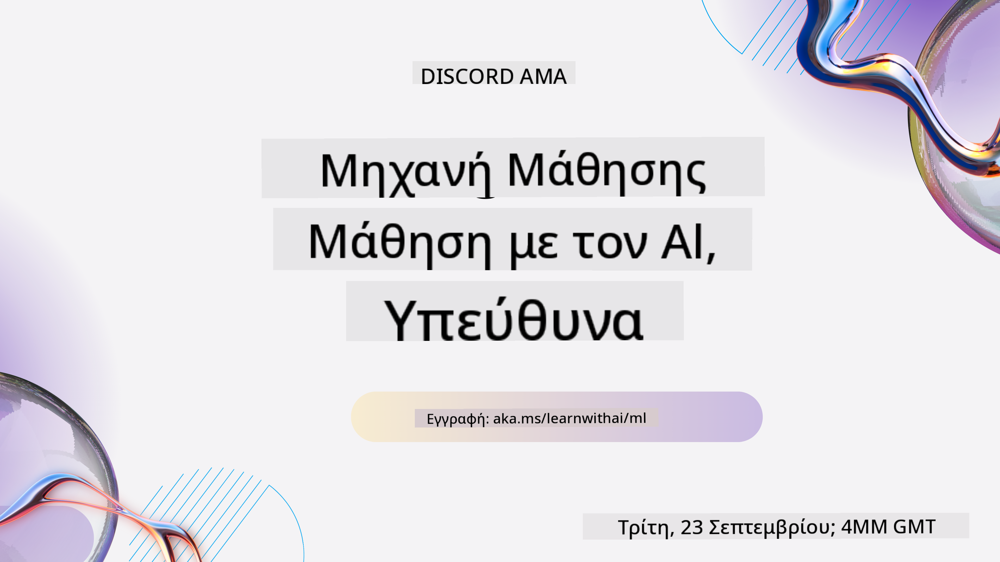
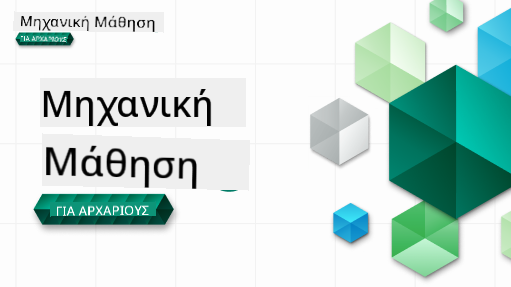

<!--
CO_OP_TRANSLATOR_METADATA:
{
  "original_hash": "a54f98da7bbee99ddc62a9e490eef7dc",
  "translation_date": "2025-09-29T22:00:11+00:00",
  "source_file": "README.md",
  "language_code": "el"
}
-->
  
  
  
  
  

  
  
  

### 🌐 Υποστήριξη Πολλών Γλωσσών  

#### Υποστηρίζεται μέσω GitHub Action (Αυτοματοποιημένο & Πάντα Ενημερωμένο)  

[Γαλλικά](../fr/README.md) | [Ισπανικά](../es/README.md) | [Γερμανικά](../de/README.md) | [Ρωσικά](../ru/README.md) | [Αραβικά](../ar/README.md) | [Περσικά (Φαρσί)](../fa/README.md) | [Ουρντού](../ur/README.md) | [Κινέζικα (Απλοποιημένα)](../zh/README.md) | [Κινέζικα (Παραδοσιακά, Μακάο)](../mo/README.md) | [Κινέζικα (Παραδοσιακά, Χονγκ Κονγκ)](../hk/README.md) | [Κινέζικα (Παραδοσιακά, Ταϊβάν)](../tw/README.md) | [Ιαπωνικά](../ja/README.md) | [Κορεατικά](../ko/README.md) | [Χίντι](../hi/README.md) | [Μπενγκάλι](../bn/README.md) | [Μαραθικά](../mr/README.md) | [Νεπαλικά](../ne/README.md) | [Παντζάμπι (Γκουρμούκι)](../pa/README.md) | [Πορτογαλικά (Πορτογαλία)](../pt/README.md) | [Πορτογαλικά (Βραζιλία)](../br/README.md) | [Ιταλικά](../it/README.md) | [Πολωνικά](../pl/README.md) | [Τουρκικά](../tr/README.md) | [Ελληνικά](./README.md) | [Ταϊλανδικά](../th/README.md) | [Σουηδικά](../sv/README.md) | [Δανικά](../da/README.md) | [Νορβηγικά](../no/README.md) | [Φινλανδικά](../fi/README.md) | [Ολλανδικά](../nl/README.md) | [Εβραϊκά](../he/README.md) | [Βιετναμέζικα](../vi/README.md) | [Ινδονησιακά](../id/README.md) | [Μαλαισιανά](../ms/README.md) | [Ταγκαλόγκ (Φιλιππινέζικα)](../tl/README.md) | [Σουαχίλι](../sw/README.md) | [Ουγγρικά](../hu/README.md) | [Τσέχικα](../cs/README.md) | [Σλοβακικά](../sk/README.md) | [Ρουμανικά](../ro/README.md) | [Βουλγαρικά](../bg/README.md) | [Σερβικά (Κυριλλικά)](../sr/README.md) | [Κροατικά](../hr/README.md) | [Σλοβενικά](../sl/README.md) | [Ουκρανικά](../uk/README.md) | [Βιρμανικά (Μιανμάρ)](../my/README.md)  

#### Γίνετε Μέλος της Κοινότητάς μας  

  

Έχουμε μια σειρά εκμάθησης με AI στο Discord σε εξέλιξη. Μάθετε περισσότερα και συμμετάσχετε στο [Learn with AI Series](https://aka.ms/learnwithai/discord) από τις 18 έως τις 30 Σεπτεμβρίου 2025. Θα λάβετε συμβουλές και τεχνικές για τη χρήση του GitHub Copilot για Data Science.  

  

# Μηχανική Μάθηση για Αρχάριους - Ένα Πρόγραμμα Σπουδών  

> 🌍 Ταξιδέψτε σε όλο τον κόσμο καθώς εξερευνούμε τη Μηχανική Μάθηση μέσω των πολιτισμών του κόσμου 🌍  

Οι Cloud Advocates της Microsoft είναι στην ευχάριστη θέση να προσφέρουν ένα πρόγραμμα σπουδών 12 εβδομάδων, με 26 μαθήματα, που αφορά τη **Μηχανική Μάθηση**. Σε αυτό το πρόγραμμα, θα μάθετε για αυτό που μερικές φορές αποκαλείται **κλασική μηχανική μάθηση**, χρησιμοποιώντας κυρίως τη βιβλιοθήκη Scikit-learn και αποφεύγοντας τη βαθιά μάθηση, η οποία καλύπτεται στο [πρόγραμμα σπουδών AI για Αρχάριους](https://aka.ms/ai4beginners). Συνδυάστε αυτά τα μαθήματα με το πρόγραμμα σπουδών ['Data Science for Beginners'](https://aka.ms/ds4beginners), επίσης!  

Ταξιδέψτε μαζί μας σε όλο τον κόσμο καθώς εφαρμόζουμε αυτές τις κλασικές τεχνικές σε δεδομένα από πολλές περιοχές του κόσμου. Κάθε μάθημα περιλαμβάνει κουίζ πριν και μετά το μάθημα, γραπτές οδηγίες για την ολοκλήρωση του μαθήματος, λύση, εργασία και πολλά άλλα. Η παιδαγωγική μας προσέγγιση που βασίζεται σε έργα σας επιτρέπει να μαθαίνετε ενώ δημιουργείτε, ένας αποδεδειγμένος τρόπος για να εδραιώσετε νέες δεξιότητες.  

**✍️ Θερμές ευχαριστίες στους συγγραφείς μας** Jen Looper, Stephen Howell, Francesca Lazzeri, Tomomi Imura, Cassie Breviu, Dmitry Soshnikov, Chris Noring, Anirban Mukherjee, Ornella Altunyan, Ruth Yakubu και Amy Boyd  

**🎨 Ευχαριστίες επίσης στους εικονογράφους μας** Tomomi Imura, Dasani Madipalli και Jen Looper  

**🙏 Ειδικές ευχαριστίες 🙏 στους Microsoft Student Ambassador συγγραφείς, κριτές και συνεισφέροντες περιεχομένου**, ιδίως στους Rishit Dagli, Muhammad Sakib Khan Inan, Rohan Raj, Alexandru Petrescu, Abhishek Jaiswal, Nawrin Tabassum, Ioan Samuila και Snigdha Agarwal  

**🤩 Επιπλέον ευγνωμοσύνη στους Microsoft Student Ambassadors Eric Wanjau, Jasleen Sondhi και Vidushi Gupta για τα μαθήματα R!**  

# Ξεκινώντας  

Ακολουθήστε αυτά τα βήματα:  
1. **Κάντε Fork το Αποθετήριο**: Πατήστε το κουμπί "Fork" στην επάνω δεξιά γωνία αυτής της σελίδας.  
2. **Κλωνοποιήστε το Αποθετήριο**:   `git clone https://github.com/microsoft/ML-For-Beginners.git`  

> [βρείτε όλους τους πρόσθετους πόρους για αυτό το μάθημα στη συλλογή μας στο Microsoft Learn](https://learn.microsoft.com/en-us/collections/qrqzamz1nn2wx3?WT.mc_id=academic-77952-bethanycheum)  

**[Φοιτητές](https://aka.ms/student-page)**, για να χρησιμοποιήσετε αυτό το πρόγραμμα σπουδών, κάντε fork ολόκληρο το αποθετήριο στον δικό σας λογαριασμό GitHub και ολοκληρώστε τις ασκήσεις μόνοι σας ή με μια ομάδα:  

- Ξεκινήστε με ένα κουίζ πριν το μάθημα.  
- Διαβάστε το μάθημα και ολοκληρώστε τις δραστηριότητες, σταματώντας και αναλογιζόμενοι σε κάθε έλεγχο γνώσεων.  
- Προσπαθήστε να δημιουργήσετε τα έργα κατανοώντας τα μαθήματα αντί να εκτελείτε τον κώδικα λύσης. Ωστόσο, αυτός ο κώδικας είναι διαθέσιμος στους φακέλους `/solution` σε κάθε μάθημα που βασίζεται σε έργο.  
- Κάντε το κουίζ μετά το μάθημα.  
- Ολοκληρώστε την πρόκληση.  
- Ολοκληρώστε την εργασία.  
- Αφού ολοκληρώσετε μια ομάδα μαθημάτων, επισκεφθείτε τον [Πίνακα Συζητήσεων](https://github.com/microsoft/ML-For-Beginners/discussions) και "μάθετε δυνατά" συμπληρώνοντας το κατάλληλο PAT rubric. Ένα 'PAT' είναι ένα Εργαλείο Αξιολόγησης Προόδου που είναι ένα rubric που συμπληρώνετε για να προωθήσετε τη μάθησή σας. Μπορείτε επίσης να αντιδράσετε σε άλλα PATs ώστε να μάθουμε μαζί.  

> Για περαιτέρω μελέτη, προτείνουμε να ακολουθήσετε αυτά τα [Microsoft Learn](https://docs.microsoft.com/en-us/users/jenlooper-2911/collections/k7o7tg1gp306q4?WT.mc_id=academic-77952-leestott) modules και μονοπάτια μάθησης.  

**Καθηγητές**, έχουμε [συμπεριλάβει κάποιες προτάσεις](for-teachers.md) για το πώς να χρησιμοποιήσετε αυτό το πρόγραμμα σπουδών.  

---  

## Βίντεο Οδηγίες  

Μερικά από τα μαθήματα είναι διαθέσιμα ως σύντομα βίντεο. Μπορείτε να βρείτε όλα αυτά ενσωματωμένα στα μαθήματα ή στη [λίστα αναπαραγωγής ML for Beginners στο κανάλι Microsoft Developer στο YouTube](https://aka.ms/ml-beginners-videos) πατώντας την εικόνα παρακάτω.  

  

---  

## Γνωρίστε την Ομάδα  

  

**Gif από** [Mohit Jaisal](https://linkedin.com/in/mohitjaisal)  

> 🎥 Πατήστε την εικόνα παραπάνω για ένα βίντεο σχετικά με το έργο και τους ανθρώπους που το δημιούργησαν!  

---  

## Παιδαγωγική  

Επιλέξαμε δύο παιδαγωγικές αρχές κατά τη δημιουργία αυτού του προγράμματος σπουδών: να διασφαλίσουμε ότι είναι **βασισμένο σε έργα** και ότι περιλαμβάνει **συχνά κουίζ**. Επιπλέον, αυτό το πρόγραμμα σπουδών έχει ένα κοινό **θέμα** για να του δώσει συνοχή.  

Με τη διασφάλιση ότι το περιεχόμενο ευθυγραμμίζεται με έργα, η διαδικασία γίνεται πιο ενδιαφέρουσα για τους μαθητές και η διατήρηση των εννοιών ενισχύεται. Επιπλέον, ένα κουίζ χαμηλού κινδύνου πριν από το μάθημα θέτει την πρόθεση του μαθητή προς την εκμάθηση ενός θέματος, ενώ ένα δεύτερο κουίζ μετά το μάθημα διασφαλίζει περαιτέρω τη διατήρηση. Αυτό το πρόγραμμα σπουδών σχεδιάστηκε για να είναι ευέλικτο και διασκεδαστικό και μπορεί να ληφθεί ολόκληρο ή εν μέρει. Τα έργα ξεκινούν μικρά και γίνονται όλο και πιο περίπλοκα μέχρι το τέλος του κύκλου των 12 εβδομάδων. Αυτό το πρόγραμμα σπουδών περιλαμβάνει επίσης ένα επίλογο για τις εφαρμογές της ML στον πραγματικό κόσμο, που μπορεί να χρησιμοποιηθεί ως επιπλέον πίστωση ή ως βάση για συζήτηση.  

> Βρείτε τον [Κώδικα Συμπεριφοράς](CODE_OF_CONDUCT.md), [Οδηγίες Συνεισφοράς](CONTRIBUTING.md) και [Οδηγίες Μετάφρασης](TRANSLATIONS.md). Καλωσορίζουμε τα εποικοδομητικά σας σχόλια!  

## Κάθε μάθημα περιλαμβάνει  

- προαιρετικό σκίτσο  
- προαιρετικό συμπληρωματικό βίντεο  
- βίντεο οδηγίες (μόνο σε ορισμένα μαθήματα)  
- [κουίζ προθέρμανσης πριν το μάθημα](https://ff-quizzes.netlify.app/en/ml/)  
- γραπτό μάθημα  
- για μαθήματα που βασίζονται σε έργα, οδηγίες βήμα προς βήμα για την κατασκευή του έργου  
- έλεγχοι γνώσεων  
- μια πρόκληση  
- συμπληρωματική ανάγνωση  
- εργασία  
- [κουίζ μετά το μάθημα](https://ff-quizzes.netlify.app/en/ml/)  

> **Σημείωση για τις γλώσσες**: Αυτά τα μαθήματα είναι κυρίως γραμμένα σε Python, αλλά πολλά είναι επίσης διαθέσιμα σε R. Για να ολοκληρώσετε ένα μάθημα R, μεταβείτε στον φάκελο `/solution` και αναζητήστε μαθήματα R. Περιλαμβάνουν μια επέκταση .rmd που αντιπροσωπεύει ένα **R Markdown** αρχείο, το οποίο μπορεί να οριστεί απλά ως ενσωμάτωση `code chunks` (R ή άλλων γλωσσών) και ενός `YAML header` (που καθοδηγεί πώς να μορφοποιηθούν εξαγωγές όπως PDF) σε ένα `Markdown document`. Ως εκ τούτου, χρησιμεύει ως ένα εξαιρετικό πλαίσιο συγγραφής για την επιστήμη δεδομένων, καθώς σας επιτρέπει να συνδυάσετε τον κώδικά σας, την έξοδό του και τις σκέψεις σας γράφοντάς τες σε Markdown. Επιπλέον, τα R Markdown έγγραφα μπορούν να αποδοθούν σε μορφές εξαγωγής όπως PDF, HTML ή Word.  

> **Σημείωση για τα κουίζ**: Όλα τα κουίζ περιέχονται στον [φάκελο Quiz App](../../quiz-app), για συνολικά 52 κουίζ των τριών ερωτήσεων το καθένα. Συνδέονται από τα μαθήματα, αλλά η εφαρμογή κουίζ μπορεί να εκτελεστεί τοπικά. Ακολουθήστε τις οδηγίες στον φάκελο `quiz-app` για τοπική φιλοξενία ή ανάπτυξη στο Azure.  

| Αριθμός Μαθήματος |                             Θέμα                              |                   Ομαδοποίηση Μαθήματος                   | Στόχοι Μάθησης                                                                                                             |                                                              Συνδεδεμένο Μάθημα                                                               |                        Συγγραφέας                        |
| :-----------: | :------------------------------------------------------------: | :-------------------------------------------------: | ------------------------------------------------------------------------------------------------------------------------------- | :--------------------------------------------------------------------------------------------------------------------------------------: | :--------------------------------------------------: |
|      01       |                Εισαγωγή στη μηχανική μάθηση                |      [Εισαγωγή](1-Introduction/README.md)       | Μάθετε τις βασικές έννοιες πίσω από τη μηχανική μάθηση                                                                                |                                             [Μάθημα](1-Introduction/1-intro-to-ML/README.md)                                             |                       Muhammad                       |
|      02       |                Η Ιστορία της μηχανικής μάθησης                 |      [Εισαγωγή](1-Introduction/README.md)       | Μάθετε την ιστορία που υποστηρίζει αυτόν τον τομέα                                                                                         |                                            [Μάθημα](1-Introduction/2-history-of-ML/README.md)                                            |                     Jen και Amy                      |
|      03       |                 Δικαιοσύνη και μηχανική μάθηση                 |      [Εισαγωγή](1-Introduction/README.md)       | Ποια είναι τα σημαντικά φιλοσοφικά ζητήματα γύρω από τη δικαιοσύνη που πρέπει να εξετάσουν οι μαθητές όταν δημιουργούν και εφαρμόζουν μοντέλα μηχανικής μάθησης; |                                              [Μάθημα](1-Introduction/3-fairness/README.md)                                               |                        Tomomi                        |
|      04       |                Τεχνικές για μηχανική μάθηση                   |      [Εισαγωγή](1-Introduction/README.md)       | Ποιες τεχνικές χρησιμοποιούν οι ερευνητές μηχανικής μάθησης για να δημιουργήσουν μοντέλα μηχανικής μάθησης;                                                      |                                          [Μάθημα](1-Introduction/4-techniques-of-ML/README.md)                                           |                    Chris και Jen                     |
|      05       |                   Εισαγωγή στην παλινδρόμηση                   |        [Παλινδρόμηση](2-Regression/README.md)         | Ξεκινήστε με Python και Scikit-learn για μοντέλα παλινδρόμησης                                                                  |         [Python](2-Regression/1-Tools/README.md) • [R](../../2-Regression/1-Tools/solution/R/lesson_1.html)         |      Jen • Eric Wanjau       |
|      06       |                Τιμές κολοκύθας στη Βόρεια Αμερική 🎃           |        [Παλινδρόμηση](2-Regression/README.md)         | Οπτικοποιήστε και καθαρίστε δεδομένα για την προετοιμασία της μηχανικής μάθησης                                                 |          [Python](2-Regression/2-Data/README.md) • [R](../../2-Regression/2-Data/solution/R/lesson_2.html)          |      Jen • Eric Wanjau       |
|      07       |                Τιμές κολοκύθας στη Βόρεια Αμερική 🎃           |        [Παλινδρόμηση](2-Regression/README.md)         | Δημιουργήστε γραμμικά και πολυωνυμικά μοντέλα παλινδρόμησης                                                                     |        [Python](2-Regression/3-Linear/README.md) • [R](../../2-Regression/3-Linear/solution/R/lesson_3.html)        |      Jen και Dmitry • Eric Wanjau       |
|      08       |                Τιμές κολοκύθας στη Βόρεια Αμερική 🎃           |        [Παλινδρόμηση](2-Regression/README.md)         | Δημιουργήστε ένα μοντέλο λογιστικής παλινδρόμησης                                                                               |     [Python](2-Regression/4-Logistic/README.md) • [R](../../2-Regression/4-Logistic/solution/R/lesson_4.html)      |      Jen • Eric Wanjau       |
|      09       |                          Μια διαδικτυακή εφαρμογή 🔌           |           [Web App](3-Web-App/README.md)            | Δημιουργήστε μια διαδικτυακή εφαρμογή για να χρησιμοποιήσετε το εκπαιδευμένο σας μοντέλο                                        |                                                 [Python](3-Web-App/1-Web-App/README.md)                                                  |                         Jen                          |
|      10       |                 Εισαγωγή στην ταξινόμηση                      |    [Ταξινόμηση](4-Classification/README.md)     | Καθαρίστε, προετοιμάστε και οπτικοποιήστε τα δεδομένα σας· εισαγωγή στην ταξινόμηση                                             | [Python](4-Classification/1-Introduction/README.md) • [R](../../4-Classification/1-Introduction/solution/R/lesson_10.html)  | Jen και Cassie • Eric Wanjau |
|      11       |             Νόστιμες ασιατικές και ινδικές κουζίνες 🍜         |    [Ταξινόμηση](4-Classification/README.md)     | Εισαγωγή στους ταξινομητές                                                                                                     | [Python](4-Classification/2-Classifiers-1/README.md) • [R](../../4-Classification/2-Classifiers-1/solution/R/lesson_11.html) | Jen και Cassie • Eric Wanjau |
|      12       |             Νόστιμες ασιατικές και ινδικές κουζίνες 🍜         |    [Ταξινόμηση](4-Classification/README.md)     | Περισσότεροι ταξινομητές                                                                                                       | [Python](4-Classification/3-Classifiers-2/README.md) • [R](../../4-Classification/3-Classifiers-2/solution/R/lesson_12.html) | Jen και Cassie • Eric Wanjau |
|      13       |             Νόστιμες ασιατικές και ινδικές κουζίνες 🍜         |    [Ταξινόμηση](4-Classification/README.md)     | Δημιουργήστε μια διαδικτυακή εφαρμογή συστάσεων χρησιμοποιώντας το μοντέλο σας                                                  |                                              [Python](4-Classification/4-Applied/README.md)                                              |                         Jen                          |
|      14       |                   Εισαγωγή στην ομαδοποίηση                   |        [Ομαδοποίηση](5-Clustering/README.md)         | Καθαρίστε, προετοιμάστε και οπτικοποιήστε τα δεδομένα σας· εισαγωγή στην ομαδοποίηση                                            |         [Python](5-Clustering/1-Visualize/README.md) • [R](../../5-Clustering/1-Visualize/solution/R/lesson_14.html)         |      Jen • Eric Wanjau       |
|      15       |              Εξερεύνηση μουσικών προτιμήσεων στη Νιγηρία 🎧    |        [Ομαδοποίηση](5-Clustering/README.md)         | Εξερευνήστε τη μέθοδο ομαδοποίησης K-Means                                                                                      |           [Python](5-Clustering/2-K-Means/README.md) • [R](../../5-Clustering/2-K-Means/solution/R/lesson_15.html)           |      Jen • Eric Wanjau       |
|      16       |        Εισαγωγή στην επεξεργασία φυσικής γλώσσας ☕️           |   [Επεξεργασία φυσικής γλώσσας](6-NLP/README.md)    | Μάθετε τα βασικά για την επεξεργασία φυσικής γλώσσας δημιουργώντας ένα απλό bot                                                 |                                             [Python](6-NLP/1-Introduction-to-NLP/README.md)                                              |                       Stephen                        |
|      17       |                      Κοινές εργασίες NLP ☕️                   |   [Επεξεργασία φυσικής γλώσσας](6-NLP/README.md)    | Εμβαθύνετε τις γνώσεις σας στην επεξεργασία φυσικής γλώσσας κατανοώντας κοινές εργασίες που απαιτούνται για τη διαχείριση γλωσσικών δομών |                                                    [Python](6-NLP/2-Tasks/README.md)                                                     |                       Stephen                        |
|      18       |             Μετάφραση και ανάλυση συναισθημάτων ♥️            |   [Επεξεργασία φυσικής γλώσσας](6-NLP/README.md)    | Μετάφραση και ανάλυση συναισθημάτων με έργα της Jane Austen                                                                      |                                            [Python](6-NLP/3-Translation-Sentiment/README.md)                                             |                       Stephen                        |
|      19       |                  Ρομαντικά ξενοδοχεία της Ευρώπης ♥️          |   [Επεξεργασία φυσικής γλώσσας](6-NLP/README.md)    | Ανάλυση συναισθημάτων με κριτικές ξενοδοχείων 1                                                                                 |                                               [Python](6-NLP/4-Hotel-Reviews-1/README.md)                                                |                       Stephen                        |
|      20       |                  Ρομαντικά ξενοδοχεία της Ευρώπης ♥️          |   [Επεξεργασία φυσικής γλώσσας](6-NLP/README.md)    | Ανάλυση συναισθημάτων με κριτικές ξενοδοχείων 2                                                                                 |                                               [Python](6-NLP/5-Hotel-Reviews-2/README.md)                                                |                       Stephen                        |
|      21       |            Εισαγωγή στην πρόβλεψη χρονοσειρών                 |        [Χρονοσειρές](7-TimeSeries/README.md)        | Εισαγωγή στην πρόβλεψη χρονοσειρών                                                                                              |                                             [Python](7-TimeSeries/1-Introduction/README.md)                                              |                      Francesca                       |
|      22       | ⚡️ Χρήση ενέργειας παγκοσμίως ⚡️ - πρόβλεψη χρονοσειρών με ARIMA |        [Χρονοσειρές](7-TimeSeries/README.md)        | Πρόβλεψη χρονοσειρών με ARIMA                                                                                                   |                                                 [Python](7-TimeSeries/2-ARIMA/README.md)                                                 |                      Francesca                       |
|      23       |  ⚡️ Χρήση ενέργειας παγκοσμίως ⚡️ - πρόβλεψη χρονοσειρών με SVR  |        [Χρονοσειρές](7-TimeSeries/README.md)        | Πρόβλεψη χρονοσειρών με Support Vector Regressor                                                                                |                                                  [Python](7-TimeSeries/3-SVR/README.md)                                                  |                       Anirban                        |
|      24       |             Εισαγωγή στην ενισχυτική μάθηση                  | [Ενισχυτική μάθηση](8-Reinforcement/README.md) | Εισαγωγή στην ενισχυτική μάθηση με Q-Learning                                                                                   |                                             [Python](8-Reinforcement/1-QLearning/README.md)                                              |                        Dmitry                        |
|      25       |                 Βοηθήστε τον Peter να αποφύγει τον λύκο! 🐺   | [Ενισχυτική μάθηση](8-Reinforcement/README.md) | Ενισχυτική μάθηση με Gym                                                                                                        |                                                [Python](8-Reinforcement/2-Gym/README.md)                                                 |                        Dmitry                        |
|  Επίλογος     |            Σενάρια και εφαρμογές μηχανικής μάθησης στον πραγματικό κόσμο |      [ML στον πραγματικό κόσμο](9-Real-World/README.md)       | Ενδιαφέρουσες και αποκαλυπτικές εφαρμογές της κλασικής μηχανικής μάθησης                                                        |                                             [Μάθημα](9-Real-World/1-Applications/README.md)                                              |                         Ομάδα                         |
|  Επίλογος     |            Εντοπισμός σφαλμάτων μοντέλων ML με τον πίνακα RAI |      [ML στον πραγματικό κόσμο](9-Real-World/README.md)       | Εντοπισμός σφαλμάτων μοντέλων μηχανικής μάθησης χρησιμοποιώντας στοιχεία του πίνακα Responsible AI                               |                                             [Μάθημα](9-Real-World/2-Debugging-ML-Models/README.md)                                              |                         Ruth Yakubu                       |

> [βρείτε όλους τους πρόσθετους πόρους για αυτό το μάθημα στη συλλογή μας στο Microsoft Learn](https://learn.microsoft.com/en-us/collections/qrqzamz1nn2wx3?WT.mc_id=academic-77952-bethanycheum)

## Πρόσβαση εκτός σύνδεσης

Μπορείτε να εκτελέσετε αυτήν την τεκμηρίωση εκτός σύνδεσης χρησιμοποιώντας το [Docsify](https://docsify.js.org/#/). Κάντε fork αυτό το repo, [εγκαταστήστε το Docsify](https://docsify.js.org/#/quickstart) στον τοπικό σας υπολογιστή και στη συνέχεια, στον ριζικό φάκελο αυτού του repo, πληκτρολογήστε `docsify serve`. Ο ιστότοπος θα εξυπηρετείται στην πόρτα 3000 του localhost σας: `localhost:3000`.

## PDFs

Βρείτε ένα PDF του προγράμματος σπουδών με συνδέσμους [εδώ](https://microsoft.github.io/ML-For-Beginners/pdf/readme.pdf).

## 🎒 Άλλα Μαθήματα 

Η ομάδα μας δημιουργεί και άλλα μαθήματα! Δείτε:

- [Edge AI για αρχάριους](https://aka.ms/edgeai-for-beginners)
- [AI Agents για αρχάριους](https://aka.ms/ai-agents-beginners)
- [Γενετική AI για αρχάριους](https://aka.ms/genai-beginners)
- [Γενετική AI για αρχάριους .NET](https://github.com/microsoft/Generative-AI-for-beginners-dotnet)
- [Γενετική AI με JavaScript](https://github.com/microsoft/generative-ai-with-javascript)
- [Γενετική AI με Java](https://github.com/microsoft/Generative-AI-for-beginners-java)
- [AI για αρχάριους](https://aka.ms/ai-beginners)
- [Επιστήμη δεδομένων για αρχάριους](https://aka.ms/datascience-beginners)
- [ML για αρχάριους](https://aka.ms/ml-beginners)
- [Κυβερνοασφάλεια για αρχάριους](https://github.com/microsoft/Security-101) 
- [Web Dev για αρχάριους](https://aka.ms/webdev-beginners)
- [IoT για αρχάριους](https://aka.ms/iot-beginners)
- [Ανάπτυξη XR για αρχάριους](https://github.com/microsoft/xr-development-for-beginners)
- [Mastering GitHub Copilot για συνεργατική προγραμματιστική εργασία](https://github.com/microsoft/Mastering-GitHub-Copilot-for-Paired-Programming)
- [Mastering GitHub Copilot για προγραμματιστές C#/.NET](https://github.com/microsoft/mastering-github-copilot-for-dotnet-csharp-developers)
- [Επιλέξτε τη δική σας περιπέτεια με το Copilot](https://github.com/microsoft/CopilotAdventures)

---

**Αποποίηση ευθύνης**:  
Αυτό το έγγραφο έχει μεταφραστεί χρησιμοποιώντας την υπηρεσία μετάφρασης AI [Co-op Translator](https://github.com/Azure/co-op-translator). Παρόλο που καταβάλλουμε προσπάθειες για ακρίβεια, παρακαλούμε να έχετε υπόψη ότι οι αυτοματοποιημένες μεταφράσεις ενδέχεται να περιέχουν λάθη ή ανακρίβειες. Το πρωτότυπο έγγραφο στη μητρική του γλώσσα θα πρέπει να θεωρείται η αυθεντική πηγή. Για κρίσιμες πληροφορίες, συνιστάται επαγγελματική ανθρώπινη μετάφραση. Δεν φέρουμε ευθύνη για τυχόν παρεξηγήσεις ή εσφαλμένες ερμηνείες που προκύπτουν από τη χρήση αυτής της μετάφρασης.