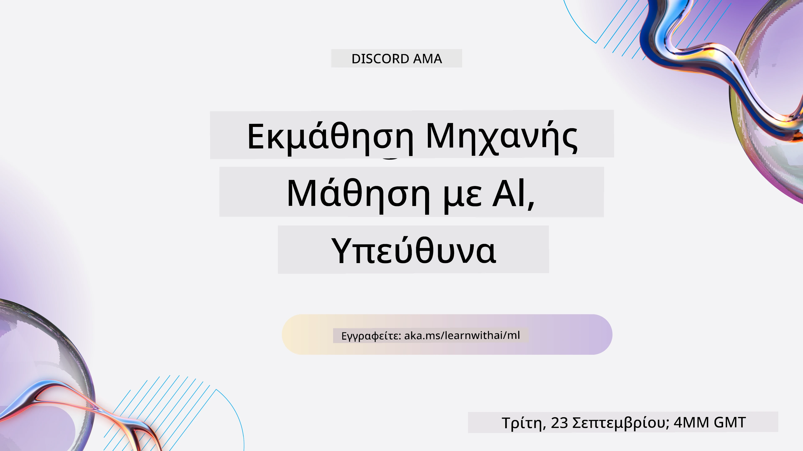
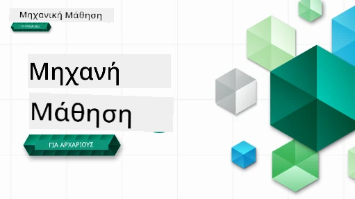

[](https://github.com/microsoft/ML-For-Beginners/blob/master/LICENSE)
[](https://GitHub.com/microsoft/ML-For-Beginners/graphs/contributors/)
[](https://GitHub.com/microsoft/ML-For-Beginners/issues/)
[](https://GitHub.com/microsoft/ML-For-Beginners/pulls/)
[](http://makeapullrequest.com)

[](https://GitHub.com/microsoft/ML-For-Beginners/watchers/)
[](https://GitHub.com/microsoft/ML-For-Beginners/network/)
[](https://GitHub.com/microsoft/ML-For-Beginners/stargazers/)

### 🌐 Υποστήριξη Πολυγλωσσίας

#### Υποστηρίζεται μέσω GitHub Action (Αυτοματοποιημένο & Πάντα Ενημερωμένο)

<!-- CO-OP TRANSLATOR LANGUAGES TABLE START -->
[Αραβικά](../ar/README.md) | [Μπενγκάλι](../bn/README.md) | [Βουλγαρικά](../bg/README.md) | [Βιρμανικά (Μιανμάρ)](../my/README.md) | [Κινέζικα (Απλοποιημένα)](../zh-CN/README.md) | [Κινέζικα (Παραδοσιακά, Χονγκ Κονγκ)](../zh-HK/README.md) | [Κινέζικα (Παραδοσιακά, Μακάο)](../zh-MO/README.md) | [Κινέζικα (Παραδοσιακά, Ταϊβάν)](../zh-TW/README.md) | [Κροατικά](../hr/README.md) | [Τσεχικά](../cs/README.md) | [Δανικά](../da/README.md) | [Ολλανδικά](../nl/README.md) | [Εσθονικά](../et/README.md) | [Φινλανδικά](../fi/README.md) | [Γαλλικά](../fr/README.md) | [Γερμανικά](../de/README.md) | [Ελληνικά](./README.md) | [Εβραϊκά](../he/README.md) | [Χίντι](../hi/README.md) | [Ουγγρικά](../hu/README.md) | [Ινδονησιακά](../id/README.md) | [Ιταλικά](../it/README.md) | [Ιαπωνικά](../ja/README.md) | [Κανάτα](../kn/README.md) | [Κμερ](../km/README.md) | [Κορεάτικα](../ko/README.md) | [Λιθουανικά](../lt/README.md) | [Μαλαισιανά](../ms/README.md) | [Μαλαγιάλαμ](../ml/README.md) | [Μαραθικά](../mr/README.md) | [Νεπάλι](../ne/README.md) | [Νιγηριανό Πίτζιν](../pcm/README.md) | [Νορβηγικά](../no/README.md) | [Περσικά (Φαρσί)](../fa/README.md) | [Πολωνικά](../pl/README.md) | [Πορτογαλικά (Βραζιλία)](../pt-BR/README.md) | [Πορτογαλικά (Πορτογαλία)](../pt-PT/README.md) | [Πουντζάμπι (Γκουρμούκι)](../pa/README.md) | [Ρουμανικά](../ro/README.md) | [Ρωσικά](../ru/README.md) | [Σερβικά (Κυριλλικό)](../sr/README.md) | [Σλοβακικά](../sk/README.md) | [Σλοβενικά](../sl/README.md) | [Ισπανικά](../es/README.md) | [Σουαχίλι](../sw/README.md) | [Σουηδικά](../sv/README.md) | [Ταγκάλογκ (Φιλιππινέζικα)](../tl/README.md) | [Ταμιλ](../ta/README.md) | [Τελούγκου](../te/README.md) | [Ταϊλανδέζικα](../th/README.md) | [Τουρκικά](../tr/README.md) | [Ουκρανικά](../uk/README.md) | [Ουρντού](../ur/README.md) | [Βιετναμέζικα](../vi/README.md)

> **Προτιμάτε να Κλωνοποιήσετε Τοπικά;**
>
> Αυτό το αποθετήριο περιλαμβάνει περισσότερες από 50 μεταφράσεις γλωσσών που αυξάνουν σημαντικά το μέγεθος λήψης. Για να κλωνοποιήσετε χωρίς μεταφράσεις, χρησιμοποιήστε την αραίωση (sparse) κατά το checkout:
>
> **Bash / macOS / Linux:**
> ```bash
> git clone --filter=blob:none --sparse https://github.com/microsoft/ML-For-Beginners.git
> cd ML-For-Beginners
> git sparse-checkout set --no-cone '/*' '!translations' '!translated_images'
> ```
>
> **CMD (Windows):**
> ```cmd
> git clone --filter=blob:none --sparse https://github.com/microsoft/ML-For-Beginners.git
> cd ML-For-Beginners
> git sparse-checkout set --no-cone "/*" "!translations" "!translated_images"
> ```
>
> Αυτό σας δίνει όλα όσα χρειάζεστε για να ολοκληρώσετε το μάθημα με πολύ πιο γρήγορη λήψη.
<!-- CO-OP TRANSLATOR LANGUAGES TABLE END -->

#### Ενταχθείτε στην Κοινότητά μας

[](https://discord.gg/nTYy5BXMWG)

Έχουμε μια σειρά Discord "μάθε με AI" σε εξέλιξη, μάθετε περισσότερα και ενταχθείτε σε εμάς στο [Learn with AI Series](https://aka.ms/learnwithai/discord) από 18 έως 30 Σεπτεμβρίου 2025. Θα πάρετε συμβουλές και κόλπα για τη χρήση του GitHub Copilot για Data Science.



# Μηχανική Μάθηση για Αρχάριους - Ένα Αναλυτικό Πρόγραμμα

> 🌍 Ταξιδέψτε σε όλο τον κόσμο καθώς εξερευνούμε τη Μηχανική Μάθηση μέσω των πολιτισμών του κόσμου 🌍

Οι εκπρόσωποι Cloud στην Microsoft προσφέρουν ένα 12-εβδομάδων, 26-μαθημάτων πρόγραμμα ειδικά για τη **Μηχανική Μάθηση**. Σε αυτό το πρόγραμμα θα μάθετε για την λεγόμενη **κλασική μηχανική μάθηση**, χρησιμοποιώντας κυρίως τη βιβλιοθήκη Scikit-learn και αποφεύγοντας τη βαθιά μάθηση, η οποία καλύπτεται στο [AI for Beginners' curriculum](https://aka.ms/ai4beginners). Συνδυάστε αυτά τα μαθήματα με το ['Data Science for Beginners' curriculum](https://aka.ms/ds4beginners), επίσης!

Ταξιδέψτε μαζί μας σε όλο τον κόσμο καθώς εφαρμόζουμε αυτές τις κλασικές τεχνικές σε δεδομένα από πολλές περιοχές. Κάθε μάθημα περιλαμβάνει προ- και μετα-μαθήματος κουίζ, γραπτές οδηγίες για την ολοκλήρωση του μαθήματος, μια λύση, μια εργασία και άλλα. Η παιδαγωγική μας που βασίζεται σε έργα σάς επιτρέπει να μαθαίνετε ενώ δημιουργείτε, ένας αποδεδειγμένος τρόπος για την εμπέδωση νέων δεξιοτήτων.

**✍️ Ειλικρινές ευχαριστώ στους συγγραφείς μας** Jen Looper, Stephen Howell, Francesca Lazzeri, Tomomi Imura, Cassie Breviu, Dmitry Soshnikov, Chris Noring, Anirban Mukherjee, Ornella Altunyan, Ruth Yakubu και Amy Boyd

**🎨 Ευχαριστίες επίσης στους εικονογράφους μας** Tomomi Imura, Dasani Madipalli, και Jen Looper

**🙏 Ειδικές ευχαριστίες 🙏 στους Microsoft Student Ambassador συγγραφείς, αξιολογητές και συντελεστές περιεχομένου μας**, ιδιαίτερα Rishit Dagli, Muhammad Sakib Khan Inan, Rohan Raj, Alexandru Petrescu, Abhishek Jaiswal, Nawrin Tabassum, Ioan Samuila, και Snigdha Agarwal

**🤩 Επιπλέον ευγνωμοσύνη στους Microsoft Student Ambassadors Eric Wanjau, Jasleen Sondhi, και Vidushi Gupta για τα μαθήματα R μας!**

# Ξεκινώντας

Ακολουθήστε αυτά τα βήματα:
1. **Δημιουργήστε Fork το Αποθετήριο**: Κάντε κλικ στο κουμπί "Fork" στην επάνω δεξιά γωνία αυτής της σελίδας.
2. **Κλωνοποιήστε το Αποθετήριο**:   `git clone https://github.com/microsoft/ML-For-Beginners.git`

> 💡 **Quick Start Tip:** Θέλετε να ξεκινήσετε σε έναν περιηγητή χωρίς να ρυθμίσετε το Python τοπικά; Χρησιμοποιήστε [GitHub Codespaces](https://github.com/features/codespaces) για να δημιουργήσετε ένα περιβάλλον ανάπτυξης στο νέφος για το fork σας. Ανοίξτε το πράσινο μενού **Code**, επιλέξτε **Codespaces**, και δημιουργήστε ένα codespace· εγκαταστήστε κάθε απαραίτητη εξάρτηση του μαθήματος μέσα σε αυτό, εφόσον χρειάζεται.

> [βρείτε όλους τους επιπλέον πόρους για αυτό το μάθημα στη συλλογή Microsoft Learn](https://learn.microsoft.com/en-us/collections/qrqzamz1nn2wx3?WT.mc_id=academic-77952-bethanycheum)

> 🔧 **Χρειάζεστε βοήθεια;** Ελέγξτε τον [Οδηγό Επίλυσης Προβλημάτων](TROUBLESHOOTING.md) για λύσεις σε κοινά θέματα με την εγκατάσταση, ρύθμιση, και εκτέλεση μαθημάτων.


**[Φοιτητές](https://aka.ms/student-page)**, για να χρησιμοποιήσετε αυτό το πρόγραμμα, δημιουργήστε fork ολόκληρου του αποθετηρίου στον δικό σας λογαριασμό GitHub και ολοκληρώστε τις ασκήσεις μόνοι σας ή με ομάδα:

- Ξεκινήστε με ένα προ-μάθημα κουίζ.
- Διαβάστε το μάθημα και ολοκληρώστε τις δραστηριότητες, σταματώντας και αναλογιζόμενοι στην κάθε διαδικασία ελέγχου γνώσεων.
- Προσπαθήστε να δημιουργήσετε τα έργα κατανοώντας τα μαθήματα αντί απλά να τρέχετε τον κώδικα λύσης. Ωστόσο, ο κώδικας αυτός είναι διαθέσιμος στους φακέλους `/solution` σε κάθε μάθημα που σχετίζεται με έργο.
- Πάρτε το μετα-μάθημα κουίζ.
- Ολοκληρώστε την πρόκληση.
- Ολοκληρώστε την ανάθεση.
- Μετά την ολοκλήρωση μιας ομάδας μαθημάτων, επισκεφτείτε το [Discussion Board](https://github.com/microsoft/ML-For-Beginners/discussions) και "μάθετε δυνατά" συμπληρώνοντας το κατάλληλο PAT rubric. Ένα 'PAT' είναι ένα Εργαλείο Αξιολόγησης Προόδου που συμπληρώνετε για να εμβαθύνετε τη μάθησή σας. Μπορείτε επίσης να αντιδράσετε σε άλλες PAT ώστε να μάθουμε μαζί.

> Για περαιτέρω μελέτη, προτείνουμε να ακολουθήσετε αυτά τα [Microsoft Learn](https://docs.microsoft.com/en-us/users/jenlooper-2911/collections/k7o7tg1gp306q4?WT.mc_id=academic-77952-leestott) μαθήματα και διαδρομές μάθησης.

**Καθηγητές**, έχουμε [συμπεριλάβει μερικές προτάσεις](for-teachers.md) για το πώς να χρησιμοποιήσετε αυτό το πρόγραμμα.

---

## Βίντεο Περιήγησης

Μερικά από τα μαθήματα είναι διαθέσιμα σε σύντομο βίντεο. Μπορείτε να τα βρείτε σε όλο το μάθημα ή στη [λίστα αναπαραγωγής ML for Beginners στο κανάλι Microsoft Developer στο YouTube](https://aka.ms/ml-beginners-videos) κάνοντας κλικ στην εικόνα παρακάτω.

[](https://aka.ms/ml-beginners-videos)

---

## Γνωρίστε την Ομάδα

[](https://youtu.be/Tj1XWrDSYJU)

**Gif από** [Mohit Jaisal](https://linkedin.com/in/mohitjaisal)

> 🎥 Κάντε κλικ στην εικόνα παραπάνω για ένα βίντεο σχετικά με το έργο και τους ανθρώπους που το δημιούργησαν!

---

## Παιδαγωγική

Έχουμε επιλέξει δύο παιδαγωγικές αρχές κατά τη δημιουργία αυτού του προγράμματος: να είναι πρακτικό και **βασισμένο σε έργα** και να περιλαμβάνει **συχνά κουίζ**. Επιπλέον, το πρόγραμμα διαθέτει ένα κοινό **θέμα** για να δώσει συνοχή.

Με την εξασφάλιση ότι το περιεχόμενο συνδέεται με έργα, η όλη διαδικασία γίνεται πιο ελκυστική για τους φοιτητές και η διατήρηση των εννοιών ενισχύεται. Επιπλέον, ένα κουίζ χαμηλού κινδύνου πριν από το μάθημα θέτει την πρόθεση του φοιτητή να μάθει ένα θέμα, ενώ ένα δεύτερο κουίζ μετά το μάθημα εξασφαλίζει περαιτέρω διατήρηση. Το πρόγραμμα σχεδιάστηκε να είναι ευέλικτο και διασκεδαστικό και μπορεί να ακολουθηθεί ολόκληρο ή μέρη του. Τα έργα ξεκινούν μικρά και γίνονται σταδιακά πιο πολύπλοκα στο τέλος του δωδεκαετούς κύκλου. Το πρόγραμμα περιλαμβάνει επίσης ένα επίμετρο σχετικά με πραγματικές εφαρμογές της ML, που μπορεί να χρησιμοποιηθεί ως επιπλέον βαθμός ή ως βάση για συζήτηση.

> Βρείτε τον [Κώδικα Συμπεριφοράς μας](CODE_OF_CONDUCT.md), τις οδηγίες [Συμβολής](CONTRIBUTING.md), τις [Μεταφράσεις](..), και τις οδηγίες [Επίλυσης Προβλημάτων](TROUBLESHOOTING.md). Εκτιμούμε την εποικοδομητική σας ανατροφοδότηση!

## Κάθε μάθημα περιλαμβάνει

- προαιρετικό σκίτσο
- προαιρετικό συμπληρωματικό βίντεο
- περιήγηση μέσω βίντεο (μόνο σε μερικά μαθήματα)
- [προ-μάθημα ζέσταμα κουίζ](https://ff-quizzes.netlify.app/en/ml/)
- γραπτό μάθημα
- για μαθήματα με έργα, οδηγίες βήμα προς βήμα για το πώς να δημιουργήσετε το έργο
- έλεγχοι γνώσης
- μια πρόκληση
- συμπληρωματική ανάγνωση
- εργασία
- [μετά-μάθημα κουίζ](https://ff-quizzes.netlify.app/en/ml/)

> **Μια σημείωση για τις γλώσσες**: Αυτά τα μαθήματα είναι κυρίως γραμμένα σε Python, αλλά πολλά είναι διαθέσιμα και σε R. Για να ολοκληρώσετε ένα μάθημα σε R, πηγαίνετε στο φάκελο `/solution` και αναζητήστε μαθήματα R. Περιλαμβάνουν μία επέκταση .rmd που αντιπροσωπεύει ένα αρχείο **R Markdown**, το οποίο μπορεί να οριστεί ως ενσωμάτωση `κομματιών κώδικα` (σε R ή άλλες γλώσσες) και μια `κεφαλίδα YAML` (που καθοδηγεί το πώς να μορφοποιήσει εξόδους όπως PDF) σε ένα `έγγραφο Markdown`. Ως τέτοιο, λειτουργεί ως υπόδειγμα πλαισίου συγγραφής για την επιστήμη δεδομένων, αφού σας επιτρέπει να συνδυάσετε τον κώδικα σας, την έξοδό του και τις σκέψεις σας γράφοντάς τις σε Markdown. Επιπλέον, τα έγγραφα R Markdown μπορούν να αποδοθούν σε μορφές εξόδου όπως PDF, HTML ή Word.

> **Μια σημείωση για τα κουίζ**: Όλα τα κουίζ βρίσκονται στο φάκελο [Quiz App](../../quiz-app), με συνολικά 52 κουίζ των τριών ερωτήσεων το καθένα. Αυτά συνδέονται μέσα στα μαθήματα, αλλά η εφαρμογή κουίζ μπορεί να τρέξει τοπικά· ακολουθήστε τις οδηγίες στον φάκελο `quiz-app` για να φιλοξενήσετε τοπικά ή να αναπτύξετε στο Azure.

| Αριθμός Μαθήματος |                             Θέμα                              |                   Ομαδοποίηση Μαθήματος                   | Στόχοι Μάθησης                                                                                                             |                                                              Συνδεδεμένο Μάθημα                                                               |                        Συγγραφέας                        |
| :-----------: | :------------------------------------------------------------: | :-------------------------------------------------: | ------------------------------------------------------------------------------------------------------------------------------- | :--------------------------------------------------------------------------------------------------------------------------------------: | :--------------------------------------------------: |
|      01       |                Εισαγωγή στη μηχανική μάθηση                   |      [Introduction](1-Introduction/README.md)       | Μάθετε τις βασικές έννοιες πίσω από τη μηχανική μάθηση                                                                          |                                             [Lesson](1-Introduction/1-intro-to-ML/README.md)                                             |                       Muhammad                       |
|      02       |                Η ιστορία της μηχανικής μάθησης                |      [Introduction](1-Introduction/README.md)       | Μάθετε την ιστορία που διέπει αυτόν τον τομέα                                                                                   |                                            [Lesson](1-Introduction/2-history-of-ML/README.md)                                            |                     Jen and Amy                      |
|      03       |                 Δικαιοσύνη και μηχανική μάθηση                |      [Introduction](1-Introduction/README.md)       | Ποια είναι τα σημαντικά φιλοσοφικά ζητήματα γύρω από τη δικαιοσύνη που πρέπει να εξετάζουν οι μαθητές όταν δημιουργούν και εφαρμόζουν μοντέλα ΜΜ; |                                              [Lesson](1-Introduction/3-fairness/README.md)                                               |                        Tomomi                        |
|      04       |                Τεχνικές για μηχανική μάθηση                   |      [Introduction](1-Introduction/README.md)       | Ποιες τεχνικές χρησιμοποιούν οι ερευνητές ΜΜ για να δημιουργήσουν μοντέλα ΜΜ;                                                     |                                          [Lesson](1-Introduction/4-techniques-of-ML/README.md)                                           |                    Chris and Jen                     |
|      05       |                   Εισαγωγή στην παλινδρόμηση                 |        [Regression](2-Regression/README.md)         | Ξεκινήστε με Python και Scikit-learn για μοντέλα παλινδρόμησης                                                                   |         [Python](2-Regression/1-Tools/README.md) • [R](../../2-Regression/1-Tools/solution/R/lesson_1.html)         |      Jen • Eric Wanjau       |
|      06       |                Τιμές κολοκύθας στη Βόρεια Αμερική 🎃         |        [Regression](2-Regression/README.md)         | Οπτικοποίηση και καθαρισμός δεδομένων για προετοιμασία της ΜΜ                                                                  |          [Python](2-Regression/2-Data/README.md) • [R](../../2-Regression/2-Data/solution/R/lesson_2.html)          |      Jen • Eric Wanjau       |
|      07       |                Τιμές κολοκύθας στη Βόρεια Αμερική 🎃         |        [Regression](2-Regression/README.md)         | Δημιουργία γραμμικών και πολυωνυμικών μοντέλων παλινδρόμησης                                                                    |        [Python](2-Regression/3-Linear/README.md) • [R](../../2-Regression/3-Linear/solution/R/lesson_3.html)        |      Jen and Dmitry • Eric Wanjau       |
|      08       |                Τιμές κολοκύθας στη Βόρεια Αμερική 🎃         |        [Regression](2-Regression/README.md)         | Δημιουργία μοντέλου λογιστικής παλινδρόμησης                                                                                     |     [Python](2-Regression/4-Logistic/README.md) • [R](../../2-Regression/4-Logistic/solution/R/lesson_4.html)      |      Jen • Eric Wanjau       |
|      09       |                          Μια διαδικτυακή εφαρμογή 🔌          |           [Web App](3-Web-App/README.md)            | Δημιουργήστε μια διαδικτυακή εφαρμογή για να χρησιμοποιήσετε το εκπαιδευμένο σας μοντέλο                                         |                                                 [Python](3-Web-App/1-Web-App/README.md)                                                  |                         Jen                          |
|      10       |                 Εισαγωγή στην ταξινόμηση                      |    [Classification](4-Classification/README.md)     | Καθαρισμός, προετοιμασία και οπτικοποίηση των δεδομένων σας· εισαγωγή στην ταξινόμηση                                            | [Python](4-Classification/1-Introduction/README.md) • [R](../../4-Classification/1-Introduction/solution/R/lesson_10.html)  | Jen and Cassie • Eric Wanjau |
|      11       |             Γευστικές Ασιατικές και Ινδικές κουζίνες 🍜       |    [Classification](4-Classification/README.md)     | Εισαγωγή στους ταξινομητές                                                                                                       | [Python](4-Classification/2-Classifiers-1/README.md) • [R](../../4-Classification/2-Classifiers-1/solution/R/lesson_11.html) | Jen and Cassie • Eric Wanjau |
|      12       |             Γευστικές Ασιατικές και Ινδικές κουζίνες 🍜       |    [Classification](4-Classification/README.md)     | Περισσότεροι ταξινομητές                                                                                                         | [Python](4-Classification/3-Classifiers-2/README.md) • [R](../../4-Classification/3-Classifiers-2/solution/R/lesson_12.html) | Jen and Cassie • Eric Wanjau |
|      13       |             Γευστικές Ασιατικές και Ινδικές κουζίνες 🍜       |    [Classification](4-Classification/README.md)     | Δημιουργήστε μια διαδικτυακή εφαρμογή προτάσεων χρησιμοποιώντας το μοντέλο σας                                                    |                                              [Python](4-Classification/4-Applied/README.md)                                              |                         Jen                          |
|      14       |                   Εισαγωγή στην ομαδοποίηση                   |        [Clustering](5-Clustering/README.md)         | Καθαρισμός, προετοιμασία και οπτικοποίηση των δεδομένων σας· εισαγωγή στην ομαδοποίηση                                           |         [Python](5-Clustering/1-Visualize/README.md) • [R](../../5-Clustering/1-Visualize/solution/R/lesson_14.html)         |      Jen • Eric Wanjau       |
|      15       |              Εξερεύνηση μουσικών προτιμήσεων Νιγηρίας 🎧       |        [Clustering](5-Clustering/README.md)         | Εξερευνήστε τη μέθοδο ομαδοποίησης K-Means                                                                                        |           [Python](5-Clustering/2-K-Means/README.md) • [R](../../5-Clustering/2-K-Means/solution/R/lesson_15.html)           |      Jen • Eric Wanjau       |
|      16       |        Εισαγωγή στην επεξεργασία φυσικής γλώσσας ☕️           |   [Natural language processing](6-NLP/README.md)    | Μάθετε τις βασικές αρχές της ΕΦΓ δημιουργώντας ένα απλό bot                                                                       |                                             [Python](6-NLP/1-Introduction-to-NLP/README.md)                                              |                       Stephen                        |
|      17       |                      Κοινές εργασίες ΕΦΓ ☕️                   |   [Natural language processing](6-NLP/README.md)    | Εμβαθύνετε τις γνώσεις σας στην ΕΦΓ κατανοώντας κοινές εργασίες που απαιτούνται όταν ασχολείστε με δομές γλώσσας                  |                                                    [Python](6-NLP/2-Tasks/README.md)                                                     |                       Stephen                        |
|      18       |             Μετάφραση και ανάλυση συναισθήματος ♥️            |   [Natural language processing](6-NLP/README.md)    | Μετάφραση και ανάλυση συναισθήματος με την Jane Austen                                                                            |                                            [Python](6-NLP/3-Translation-Sentiment/README.md)                                             |                       Stephen                        |
|      19       |                  Ρομαντικά ξενοδοχεία της Ευρώπης ♥️           |   [Natural language processing](6-NLP/README.md)    | Ανάλυση συναισθήματος με κριτικές ξενοδοχείων 1                                                                                   |                                               [Python](6-NLP/4-Hotel-Reviews-1/README.md)                                                |                       Stephen                        |
|      20       |                  Ρομαντικά ξενοδοχεία της Ευρώπης ♥️           |   [Natural language processing](6-NLP/README.md)    | Ανάλυση συναισθήματος με κριτικές ξενοδοχείων 2                                                                                   |                                               [Python](6-NLP/5-Hotel-Reviews-2/README.md)                                                |                       Stephen                        |
|      21       |            Εισαγωγή στην πρόβλεψη σειρών χρόνου              |        [Time series](7-TimeSeries/README.md)        | Εισαγωγή στην πρόβλεψη σειρών χρόνου                                                                                             |                                             [Python](7-TimeSeries/1-Introduction/README.md)                                              |                      Francesca                       |
|      22       | ⚡️ Παγκόσμια κατανάλωση ενέργειας ⚡️ - πρόβλεψη σειρών με ARIMA |        [Time series](7-TimeSeries/README.md)        | Πρόβλεψη σειρών χρόνου με ARIMA                                                                                                   |                                                 [Python](7-TimeSeries/2-ARIMA/README.md)                                                 |                      Francesca                       |
|      23       |  ⚡️ Παγκόσμια κατανάλωση ενέργειας ⚡️ - πρόβλεψη σειρών με SVR  |        [Time series](7-TimeSeries/README.md)        | Πρόβλεψη σειρών χρόνου με Υποστηρικτικό Διανυσματικό Παλινδρομητή                                                                |                                                  [Python](7-TimeSeries/3-SVR/README.md)                                                  |                       Anirban                        |
|      24       |             Εισαγωγή στην ενισχυτική μάθηση                  | [Reinforcement learning](8-Reinforcement/README.md) | Εισαγωγή στην ενισχυτική μάθηση με Q-Learning                                                                                     |                                             [Python](8-Reinforcement/1-QLearning/README.md)                                              |                        Dmitry                        |
|      25       |                 Βοηθήστε τον Πέτρο να αποφύγει το λύκο! 🐺    | [Reinforcement learning](8-Reinforcement/README.md) | Ενισχυτική μάθηση Gym                                                                                                            |                                                [Python](8-Reinforcement/2-Gym/README.md)                                                 |                        Dmitry                        |
|  Postscript   |            Σενάρια και εφαρμογές μηχανικής μάθησης στον πραγματικό κόσμο            |      [ML in the Wild](9-Real-World/README.md)       | Ενδιαφέρουσες και αποκαλυπτικές πραγματικές εφαρμογές της κλασικής ΜΜ                                                            |                                             [Lesson](9-Real-World/1-Applications/README.md)                                              |                         Team                         |
|  Postscript   |            Εντοπισμός σφαλμάτων μοντέλων στη ΜΜ με το RAI dashboard            |      [ML in the Wild](9-Real-World/README.md)       | Εντοπισμός σφαλμάτων μοντέλων στη μηχανική μάθηση χρησιμοποιώντας τη μονάδα ελέγχου Responsible AI                               |                                             [Lesson](9-Real-World/2-Debugging-ML-Models/README.md)                                              |                     Ruth Yakubu                      |

> [βρείτε όλους τους επιπλέον πόρους για αυτό το μάθημα στη συλλογή μας στο Microsoft Learn](https://learn.microsoft.com/en-us/collections/qrqzamz1nn2wx3?WT.mc_id=academic-77952-bethanycheum)

## Πρόσβαση εκτός σύνδεσης

Μπορείτε να εκτελέσετε αυτήν την τεκμηρίωση εκτός σύνδεσης χρησιμοποιώντας το [Docsify](https://docsify.js.org/#/). Κλωνοποιήστε αυτό το αποθετήριο, [εγκαταστήστε το Docsify](https://docsify.js.org/#/quickstart) στο τοπικό σας μηχάνημα, και στη ρίζα αυτού του αποθετηρίου πληκτρολογήστε `docsify serve`. Ο ιστότοπος θα σερβιριστεί στην πόρτα 3000 στο localhost σας: `localhost:3000`.

## Αρχεία PDF

Βρείτε ένα pdf του προγράμματος σπουδών με συνδέσμους [εδώ](https://microsoft.github.io/ML-For-Beginners/pdf/readme.pdf).


## 🎒 Άλλα Μαθήματα

Η ομάδα μας παράγει και άλλα μαθήματα! Δείτε:

<!-- CO-OP TRANSLATOR OTHER COURSES START -->
### LangChain
[](https://aka.ms/langchain4j-for-beginners)
[](https://aka.ms/langchainjs-for-beginners?WT.mc_id=m365-94501-dwahlin)
[](https://github.com/microsoft/langchain-for-beginners?WT.mc_id=m365-94501-dwahlin)
---

### Azure / Edge / MCP / Agents
[](https://github.com/microsoft/AZD-for-beginners?WT.mc_id=academic-105485-koreyst)
[](https://github.com/microsoft/edgeai-for-beginners?WT.mc_id=academic-105485-koreyst)
[](https://github.com/microsoft/mcp-for-beginners?WT.mc_id=academic-105485-koreyst)
[](https://github.com/microsoft/ai-agents-for-beginners?WT.mc_id=academic-105485-koreyst)

---
 
### Σειρά Generative AI
[](https://github.com/microsoft/generative-ai-for-beginners?WT.mc_id=academic-105485-koreyst)
[-9333EA?style=for-the-badge&labelColor=E5E7EB&color=9333EA)](https://github.com/microsoft/Generative-AI-for-beginners-dotnet?WT.mc_id=academic-105485-koreyst)
[-C084FC?style=for-the-badge&labelColor=E5E7EB&color=C084FC)](https://github.com/microsoft/generative-ai-for-beginners-java?WT.mc_id=academic-105485-koreyst)
[-E879F9?style=for-the-badge&labelColor=E5E7EB&color=E879F9)](https://github.com/microsoft/generative-ai-with-javascript?WT.mc_id=academic-105485-koreyst)

---
 
### Βασική Μάθηση
[](https://aka.ms/ml-beginners?WT.mc_id=academic-105485-koreyst)
[](https://aka.ms/datascience-beginners?WT.mc_id=academic-105485-koreyst)
[](https://aka.ms/ai-beginners?WT.mc_id=academic-105485-koreyst)
[](https://github.com/microsoft/Security-101?WT.mc_id=academic-96948-sayoung)
[](https://aka.ms/webdev-beginners?WT.mc_id=academic-105485-koreyst)
[](https://aka.ms/iot-beginners?WT.mc_id=academic-105485-koreyst)
[](https://github.com/microsoft/xr-development-for-beginners?WT.mc_id=academic-105485-koreyst)

---
 
### Σειρά Copilot
[](https://aka.ms/GitHubCopilotAI?WT.mc_id=academic-105485-koreyst)
[](https://github.com/microsoft/mastering-github-copilot-for-dotnet-csharp-developers?WT.mc_id=academic-105485-koreyst)
[](https://github.com/microsoft/CopilotAdventures?WT.mc_id=academic-105485-koreyst)
<!-- CO-OP TRANSLATOR OTHER COURSES END -->

## Λήψη Βοήθειας

Αν κολλήσετε ή έχετε ερωτήσεις κατά τη διάρκεια της μάθησης της Μηχανικής Μάθησης ή της δημιουργίας εφαρμογών AI, μην ανησυχείτε — η βοήθεια είναι διαθέσιμη.

Μπορείτε να συμμετέχετε σε συζητήσεις με άλλους μαθητές και προγραμματιστές, να κάνετε ερωτήσεις και να μοιραστείτε τις ιδέες σας με την κοινότητα.

- Γίνετε μέρος της κοινότητας για να κάνετε ερωτήσεις και να μάθετε μαζί με άλλους
- Συζητήστε έννοιες και ιδέες έργων μηχανικής μάθησης
- Λάβετε καθοδήγηση από έμπειρους προγραμματιστές

Μια υποστηρικτική κοινότητα είναι ένας εξαιρετικός τρόπος να αναπτύξετε τις δεξιότητές σας και να λύσετε προβλήματα πιο γρήγορα.

[Microsoft Foundry Discord Community](https://discord.gg/nTYy5BXMWG)

Αν αντιμετωπίσετε σφάλματα, λάθη ή έχετε προτάσεις για βελτιώσεις, μπορείτε επίσης να ανοίξετε ένα **Issue** σε αυτό το αποθετήριο για να αναφέρετε το πρόβλημα.

Για ανατροφοδότηση προϊόντος ή για να αναζητήσετε υπάρχουσες δημοσιεύσεις της κοινότητας, επισκεφθείτε το Developer Forum:

[](https://aka.ms/foundry/forum)

## Πρόσθετες Συμβουλές Μάθησης

- Επανεξετάστε τα τετράδια μετά από κάθε μάθημα για καλύτερη κατανόηση.
- Εξασκηθείτε στην υλοποίηση αλγορίθμων μόνοι σας.
- Εξερευνήστε πραγματικά σύνολα δεδομένων χρησιμοποιώντας τις μάθειες έννοιες.

---

<!-- CO-OP TRANSLATOR DISCLAIMER START -->
**Αποποίηση ευθυνών**:
Αυτό το έγγραφο έχει μεταφραστεί χρησιμοποιώντας την υπηρεσία μετάφρασης με τεχνητή νοημοσύνη [Co-op Translator](https://github.com/Azure/co-op-translator). Ενώ επιδιώκουμε την ακρίβεια, παρακαλούμε να έχετε υπόψη ότι οι αυτοματοποιημένες μεταφράσεις ενδέχεται να περιέχουν λάθη ή ανακρίβειες. Το πρωτότυπο έγγραφο στη μητρική του γλώσσα πρέπει να θεωρείται η αυθεντική πηγή. Για κρίσιμες πληροφορίες, συνιστάται επαγγελματική ανθρώπινη μετάφραση. Δεν φέρουμε ευθύνη για τυχόν παρεξηγήσεις ή λανθασμένες ερμηνείες που προκύπτουν από τη χρήση αυτής της μετάφρασης.
<!-- CO-OP TRANSLATOR DISCLAIMER END -->