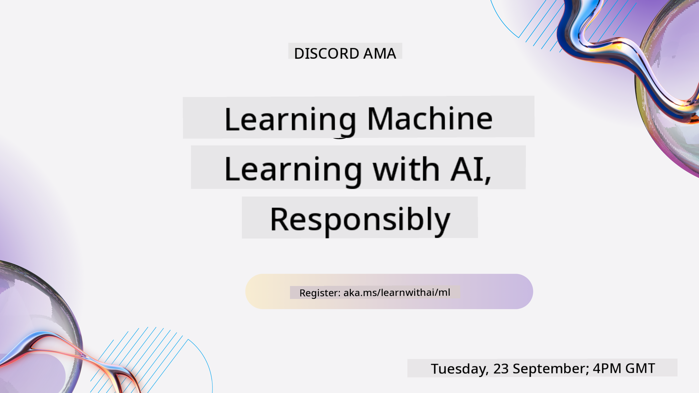
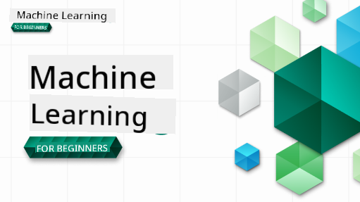

<!--
CO_OP_TRANSLATOR_METADATA:
{
  "original_hash": "a54f98da7bbee99ddc62a9e490eef7dc",
  "translation_date": "2025-09-29T21:34:16+00:00",
  "source_file": "README.md",
  "language_code": "en"
}
-->
  
  
  
  
  

  
  
  

### 🌐 Multi-Language Support  

#### Supported via GitHub Action (Automated & Always Up-to-Date)  

[French](../fr/README.md) | [Spanish](../es/README.md) | [German](../de/README.md) | [Russian](../ru/README.md) | [Arabic](../ar/README.md) | [Persian (Farsi)](../fa/README.md) | [Urdu](../ur/README.md) | [Chinese (Simplified)](../zh/README.md) | [Chinese (Traditional, Macau)](../mo/README.md) | [Chinese (Traditional, Hong Kong)](../hk/README.md) | [Chinese (Traditional, Taiwan)](../tw/README.md) | [Japanese](../ja/README.md) | [Korean](../ko/README.md) | [Hindi](../hi/README.md) | [Bengali](../bn/README.md) | [Marathi](../mr/README.md) | [Nepali](../ne/README.md) | [Punjabi (Gurmukhi)](../pa/README.md) | [Portuguese (Portugal)](../pt/README.md) | [Portuguese (Brazil)](../br/README.md) | [Italian](../it/README.md) | [Polish](../pl/README.md) | [Turkish](../tr/README.md) | [Greek](../el/README.md) | [Thai](../th/README.md) | [Swedish](../sv/README.md) | [Danish](../da/README.md) | [Norwegian](../no/README.md) | [Finnish](../fi/README.md) | [Dutch](../nl/README.md) | [Hebrew](../he/README.md) | [Vietnamese](../vi/README.md) | [Indonesian](../id/README.md) | [Malay](../ms/README.md) | [Tagalog (Filipino)](../tl/README.md) | [Swahili](../sw/README.md) | [Hungarian](../hu/README.md) | [Czech](../cs/README.md) | [Slovak](../sk/README.md) | [Romanian](../ro/README.md) | [Bulgarian](../bg/README.md) | [Serbian (Cyrillic)](../sr/README.md) | [Croatian](../hr/README.md) | [Slovenian](../sl/README.md) | [Ukrainian](../uk/README.md) | [Burmese (Myanmar)](../my/README.md)  

#### Join Our Community  

  

We have a Discord Learn with AI series ongoing. Learn more and join us at [Learn with AI Series](https://aka.ms/learnwithai/discord) from September 18–30, 2025. You'll get tips and tricks for using GitHub Copilot for Data Science.  

  

# Machine Learning for Beginners - A Curriculum  

> 🌍 Travel around the world as we explore Machine Learning through world cultures 🌍  

Microsoft's Cloud Advocates are excited to present a 12-week, 26-lesson curriculum focused on **Machine Learning**. This curriculum introduces you to **classic machine learning**, primarily using the Scikit-learn library, while avoiding deep learning (covered in our [AI for Beginners' curriculum](https://aka.ms/ai4beginners)). Pair these lessons with our ['Data Science for Beginners' curriculum](https://aka.ms/ds4beginners) for a comprehensive learning experience!  

Join us on a journey around the globe as we apply these techniques to datasets from various regions. Each lesson includes pre- and post-lesson quizzes, step-by-step instructions, solutions, assignments, and more. Our project-based approach ensures you learn by building, a proven method for retaining new skills.  

**✍️ Special thanks to our authors** Jen Looper, Stephen Howell, Francesca Lazzeri, Tomomi Imura, Cassie Breviu, Dmitry Soshnikov, Chris Noring, Anirban Mukherjee, Ornella Altunyan, Ruth Yakubu, and Amy Boyd  

**🎨 Thanks to our illustrators** Tomomi Imura, Dasani Madipalli, and Jen Looper  

**🙏 Special thanks 🙏 to our Microsoft Student Ambassador authors, reviewers, and contributors**, including Rishit Dagli, Muhammad Sakib Khan Inan, Rohan Raj, Alexandru Petrescu, Abhishek Jaiswal, Nawrin Tabassum, Ioan Samuila, and Snigdha Agarwal  

**🤩 Extra gratitude to Microsoft Student Ambassadors Eric Wanjau, Jasleen Sondhi, and Vidushi Gupta for our R lessons!**  

# Getting Started  

Follow these steps:  
1. **Fork the Repository**: Click the "Fork" button at the top-right corner of this page.  
2. **Clone the Repository**: `git clone https://github.com/microsoft/ML-For-Beginners.git`  

> [Find additional resources for this course in our Microsoft Learn collection](https://learn.microsoft.com/en-us/collections/qrqzamz1nn2wx3?WT.mc_id=academic-77952-bethanycheum)  

**[Students](https://aka.ms/student-page)**, to use this curriculum, fork the entire repo to your GitHub account and complete the exercises individually or in groups:  

- Start with a pre-lecture quiz.  
- Read the lecture and complete the activities, pausing to reflect at each knowledge check.  
- Try building the projects by understanding the lessons rather than running the solution code (available in the `/solution` folders for project-based lessons).  
- Take the post-lecture quiz.  
- Complete the challenge.  
- Finish the assignment.  
- After completing a lesson group, visit the [Discussion Board](https://github.com/microsoft/ML-For-Beginners/discussions) and "learn out loud" by filling out the appropriate PAT rubric. A 'PAT' (Progress Assessment Tool) is a rubric to further your learning. You can also engage with other PATs to learn collaboratively.  

> For further study, we recommend exploring these [Microsoft Learn](https://docs.microsoft.com/en-us/users/jenlooper-2911/collections/k7o7tg1gp306q4?WT.mc_id=academic-77952-leestott) modules and learning paths.  

**Teachers**, we have [included some suggestions](for-teachers.md) on how to use this curriculum.  

---  

## Video walkthroughs  

Some lessons are available as short-form videos. You can find these embedded in the lessons or on the [ML for Beginners playlist on the Microsoft Developer YouTube channel](https://aka.ms/ml-beginners-videos) by clicking the image below.  

  

---  

## Meet the Team  

  

**Gif by** [Mohit Jaisal](https://linkedin.com/in/mohitjaisal)  

> 🎥 Click the image above for a video about the project and the team behind it!  

---  

## Pedagogy  

This curriculum is built on two pedagogical principles: hands-on **project-based learning** and **frequent quizzes**. Additionally, it follows a common **theme** for cohesion.  

By aligning content with projects, the learning process becomes more engaging, and concept retention improves. Low-stakes quizzes before a class set the student's intention for learning, while post-class quizzes reinforce retention. This curriculum is designed to be flexible and enjoyable, allowing students to take it in full or in part. Projects start small and grow in complexity over the 12-week cycle. A postscript on real-world ML applications is included for extra credit or discussion.  

> Find our [Code of Conduct](CODE_OF_CONDUCT.md), [Contributing](CONTRIBUTING.md), and [Translation](TRANSLATIONS.md) guidelines. We welcome your constructive feedback!  

## Each lesson includes  

- Optional sketchnote  
- Optional supplemental video  
- Video walkthrough (some lessons only)  
- [Pre-lecture warmup quiz](https://ff-quizzes.netlify.app/en/ml/)  
- Written lesson  
- Step-by-step guides for project-based lessons  
- Knowledge checks  
- A challenge  
- Supplemental reading  
- Assignment  
- [Post-lecture quiz](https://ff-quizzes.netlify.app/en/ml/)  

> **A note about languages**: Lessons are primarily written in Python, but many are also available in R. To complete an R lesson, go to the `/solution` folder and look for R lessons. These include an `.rmd` extension, representing **R Markdown** files. R Markdown combines code chunks (R or other languages), a YAML header (for formatting outputs like PDFs), and Markdown text. It’s an excellent framework for data science, allowing you to integrate code, output, and commentary. R Markdown documents can be rendered into formats like PDF, HTML, or Word.  

> **A note about quizzes**: All quizzes are in the [Quiz App folder](../../quiz-app), totaling 52 quizzes with three questions each. They are linked within lessons but can also be run locally. Follow the instructions in the `quiz-app` folder to host locally or deploy to Azure.  

| Lesson Number |                             Topic                              |                   Lesson Grouping                   | Learning Objectives                                                                                                             |                                                              Linked Lesson                                                               |                        Author                        |  
| :-----------: | :------------------------------------------------------------: | :-------------------------------------------------: | ------------------------------------------------------------------------------------------------------------------------------- | :--------------------------------------------------------------------------------------------------------------------------------------: | :--------------------------------------------------: |  
|      01       |                Introduction to machine learning                |      [Introduction](1-Introduction/README.md)       | Learn the basic concepts behind machine learning                                                                                |                                             [Lesson](1-Introduction/1-intro-to-ML/README.md)                                             |                       Muhammad                       |  
|      02       |                The History of machine learning                 |      [Introduction](1-Introduction/README.md)       | Learn the history underlying this field                                                                                         |                                            [Lesson](1-Introduction/2-history-of-ML/README.md)                                            |                     Jen and Amy                      |  
|      03       |                 Fairness and machine learning                  |      [Introduction](1-Introduction/README.md)       | What are the key philosophical considerations about fairness that students should keep in mind when developing and using ML models? |                                              [Lesson](1-Introduction/3-fairness/README.md)                                               |                        Tomomi                        |
|      04       |                Techniques for machine learning                 |      [Introduction](1-Introduction/README.md)       | What methods do ML researchers use to create ML models?                                                                         |                                          [Lesson](1-Introduction/4-techniques-of-ML/README.md)                                           |                    Chris and Jen                     |
|      05       |                   Introduction to regression                   |        [Regression](2-Regression/README.md)         | Learn the basics of Python and Scikit-learn for regression models                                                               |         [Python](2-Regression/1-Tools/README.md) • [R](../../2-Regression/1-Tools/solution/R/lesson_1.html)         |      Jen • Eric Wanjau       |
|      06       |                North American pumpkin prices 🎃                |        [Regression](2-Regression/README.md)         | Visualize and clean data to prepare for ML                                                                                      |          [Python](2-Regression/2-Data/README.md) • [R](../../2-Regression/2-Data/solution/R/lesson_2.html)          |      Jen • Eric Wanjau       |
|      07       |                North American pumpkin prices 🎃                |        [Regression](2-Regression/README.md)         | Create linear and polynomial regression models                                                                                  |        [Python](2-Regression/3-Linear/README.md) • [R](../../2-Regression/3-Linear/solution/R/lesson_3.html)        |      Jen and Dmitry • Eric Wanjau       |
|      08       |                North American pumpkin prices 🎃                |        [Regression](2-Regression/README.md)         | Develop a logistic regression model                                                                                            |     [Python](2-Regression/4-Logistic/README.md) • [R](../../2-Regression/4-Logistic/solution/R/lesson_4.html)      |      Jen • Eric Wanjau       |
|      09       |                          A Web App 🔌                          |           [Web App](3-Web-App/README.md)            | Build a web application to utilize your trained model                                                                           |                                                 [Python](3-Web-App/1-Web-App/README.md)                                                  |                         Jen                          |
|      10       |                 Introduction to classification                 |    [Classification](4-Classification/README.md)     | Clean, prepare, and visualize your data; introduction to classification                                                        | [Python](4-Classification/1-Introduction/README.md) • [R](../../4-Classification/1-Introduction/solution/R/lesson_10.html)  | Jen and Cassie • Eric Wanjau |
|      11       |             Delicious Asian and Indian cuisines 🍜             |    [Classification](4-Classification/README.md)     | Introduction to classifiers                                                                                                     | [Python](4-Classification/2-Classifiers-1/README.md) • [R](../../4-Classification/2-Classifiers-1/solution/R/lesson_11.html) | Jen and Cassie • Eric Wanjau |
|      12       |             Delicious Asian and Indian cuisines 🍜             |    [Classification](4-Classification/README.md)     | Additional classifiers                                                                                                          | [Python](4-Classification/3-Classifiers-2/README.md) • [R](../../4-Classification/3-Classifiers-2/solution/R/lesson_12.html) | Jen and Cassie • Eric Wanjau |
|      13       |             Delicious Asian and Indian cuisines 🍜             |    [Classification](4-Classification/README.md)     | Create a recommender web app using your model                                                                                  |                                              [Python](4-Classification/4-Applied/README.md)                                              |                         Jen                          |
|      14       |                   Introduction to clustering                   |        [Clustering](5-Clustering/README.md)         | Clean, prepare, and visualize your data; introduction to clustering                                                             |         [Python](5-Clustering/1-Visualize/README.md) • [R](../../5-Clustering/1-Visualize/solution/R/lesson_14.html)         |      Jen • Eric Wanjau       |
|      15       |              Exploring Nigerian Musical Tastes 🎧              |        [Clustering](5-Clustering/README.md)         | Learn about the K-Means clustering method                                                                                       |           [Python](5-Clustering/2-K-Means/README.md) • [R](../../5-Clustering/2-K-Means/solution/R/lesson_15.html)           |      Jen • Eric Wanjau       |
|      16       |        Introduction to natural language processing ☕️         |   [Natural language processing](6-NLP/README.md)    | Understand the basics of NLP by creating a simple bot                                                                           |                                             [Python](6-NLP/1-Introduction-to-NLP/README.md)                                              |                       Stephen                        |
|      17       |                      Common NLP Tasks ☕️                      |   [Natural language processing](6-NLP/README.md)    | Expand your NLP knowledge by exploring common tasks involved in processing language structures                                  |                                                    [Python](6-NLP/2-Tasks/README.md)                                                     |                       Stephen                        |
|      18       |             Translation and sentiment analysis ♥️              |   [Natural language processing](6-NLP/README.md)    | Perform translation and sentiment analysis using Jane Austen's works                                                           |                                            [Python](6-NLP/3-Translation-Sentiment/README.md)                                             |                       Stephen                        |
|      19       |                  Romantic hotels of Europe ♥️                  |   [Natural language processing](6-NLP/README.md)    | Sentiment analysis with hotel reviews (Part 1)                                                                                  |                                               [Python](6-NLP/4-Hotel-Reviews-1/README.md)                                                |                       Stephen                        |
|      20       |                  Romantic hotels of Europe ♥️                  |   [Natural language processing](6-NLP/README.md)    | Sentiment analysis with hotel reviews (Part 2)                                                                                  |                                               [Python](6-NLP/5-Hotel-Reviews-2/README.md)                                                |                       Stephen                        |
|      21       |            Introduction to time series forecasting             |        [Time series](7-TimeSeries/README.md)        | Learn the basics of time series forecasting                                                                                     |                                             [Python](7-TimeSeries/1-Introduction/README.md)                                              |                      Francesca                       |
|      22       | ⚡️ World Power Usage ⚡️ - time series forecasting with ARIMA |        [Time series](7-TimeSeries/README.md)        | Time series forecasting using ARIMA                                                                                            |                                                 [Python](7-TimeSeries/2-ARIMA/README.md)                                                 |                      Francesca                       |
|      23       |  ⚡️ World Power Usage ⚡️ - time series forecasting with SVR  |        [Time series](7-TimeSeries/README.md)        | Time series forecasting using Support Vector Regressor                                                                          |                                                  [Python](7-TimeSeries/3-SVR/README.md)                                                  |                       Anirban                        |
|      24       |             Introduction to reinforcement learning             | [Reinforcement learning](8-Reinforcement/README.md) | Learn the basics of reinforcement learning with Q-Learning                                                                      |                                             [Python](8-Reinforcement/1-QLearning/README.md)                                              |                        Dmitry                        |
|      25       |                 Help Peter avoid the wolf! 🐺                  | [Reinforcement learning](8-Reinforcement/README.md) | Reinforcement learning with Gym                                                                                                |                                                [Python](8-Reinforcement/2-Gym/README.md)                                                 |                        Dmitry                        |
|  Postscript   |            Real-World ML scenarios and applications            |      [ML in the Wild](9-Real-World/README.md)       | Fascinating and insightful real-world applications of classical ML                                                             |                                             [Lesson](9-Real-World/1-Applications/README.md)                                              |                         Team                         |
|  Postscript   |            Model Debugging in ML using RAI dashboard          |      [ML in the Wild](9-Real-World/README.md)       | Debugging ML models using Responsible AI dashboard components                                                                  |                                             [Lesson](9-Real-World/2-Debugging-ML-Models/README.md)                                              |                         Ruth Yakubu                       |

> [Find all additional resources for this course in our Microsoft Learn collection](https://learn.microsoft.com/en-us/collections/qrqzamz1nn2wx3?WT.mc_id=academic-77952-bethanycheum)

## Offline access

You can access this documentation offline using [Docsify](https://docsify.js.org/#/). Fork this repository, [install Docsify](https://docsify.js.org/#/quickstart) on your local machine, and then in the root folder of this repository, type `docsify serve`. The website will be available on port 3000 at `localhost:3000`.

## PDFs

Download a PDF version of the curriculum with links [here](https://microsoft.github.io/ML-For-Beginners/pdf/readme.pdf).

## 🎒 Other Courses 

Our team offers other courses! Check out:

- [Edge AI for Beginners](https://aka.ms/edgeai-for-beginners)
- [AI Agents for Beginners](https://aka.ms/ai-agents-beginners)
- [Generative AI for Beginners](https://aka.ms/genai-beginners)
- [Generative AI for Beginners .NET](https://github.com/microsoft/Generative-AI-for-beginners-dotnet)
- [Generative AI with JavaScript](https://github.com/microsoft/generative-ai-with-javascript)
- [Generative AI with Java](https://github.com/microsoft/Generative-AI-for-beginners-java)
- [AI for Beginners](https://aka.ms/ai-beginners)
- [Data Science for Beginners](https://aka.ms/datascience-beginners)
- [ML for Beginners](https://aka.ms/ml-beginners)
- [Cybersecurity for Beginners](https://github.com/microsoft/Security-101) 
- [Web Dev for Beginners](https://aka.ms/webdev-beginners)
- [IoT for Beginners](https://aka.ms/iot-beginners)
- [XR Development for Beginners](https://github.com/microsoft/xr-development-for-beginners)
- [Mastering GitHub Copilot for Paired Programming](https://github.com/microsoft/Mastering-GitHub-Copilot-for-Paired-Programming)
- [Mastering GitHub Copilot for C#/.NET Developers](https://github.com/microsoft/mastering-github-copilot-for-dotnet-csharp-developers)
- [Choose Your Own Copilot Adventure](https://github.com/microsoft/CopilotAdventures)

---

**Disclaimer**:  
This document has been translated using the AI translation service [Co-op Translator](https://github.com/Azure/co-op-translator). While we aim for accuracy, please note that automated translations may contain errors or inaccuracies. The original document in its native language should be regarded as the authoritative source. For critical information, professional human translation is recommended. We are not responsible for any misunderstandings or misinterpretations resulting from the use of this translation.