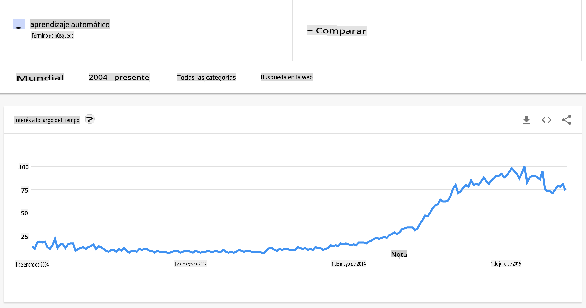
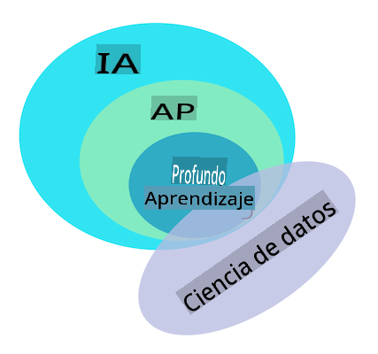

# Introducción al aprendizaje automático

## [Cuestionario previo a la lección](https://gray-sand-07a10f403.1.azurestaticapps.net/quiz/1/)

---

> 🎥 Haz clic en la imagen de arriba para ver un video corto sobre esta lección.

¡Bienvenido a este curso de aprendizaje automático clásico para principiantes! Ya sea que seas completamente nuevo en este tema o un practicante experimentado de ML que busca repasar un área, ¡nos alegra que te unas a nosotros! Queremos crear un punto de partida amigable para tu estudio de ML y estaríamos encantados de evaluar, responder e incorporar tus [comentarios](https://github.com/microsoft/ML-For-Beginners/discussions).

> 🎥 Haz clic en la imagen de arriba para ver un video: John Guttag del MIT introduce el aprendizaje automático

---
## Comenzando con el aprendizaje automático

Antes de comenzar con este plan de estudios, necesitas tener tu computadora configurada y lista para ejecutar notebooks localmente.

- **Configura tu máquina con estos videos**. Utiliza los siguientes enlaces para aprender [cómo instalar Python](https://youtu.be/CXZYvNRIAKM) en tu sistema y [configurar un editor de texto](https://youtu.be/EU8eayHWoZg) para el desarrollo.
- **Aprende Python**. También se recomienda tener un entendimiento básico de [Python](https://docs.microsoft.com/learn/paths/python-language/?WT.mc_id=academic-77952-leestott), un lenguaje de programación útil para científicos de datos que usamos en este curso.
- **Aprende Node.js y JavaScript**. También usamos JavaScript algunas veces en este curso al construir aplicaciones web, por lo que necesitarás tener [node](https://nodejs.org) y [npm](https://www.npmjs.com/) instalados, así como [Visual Studio Code](https://code.visualstudio.com/) disponible tanto para el desarrollo en Python como en JavaScript.
- **Crea una cuenta de GitHub**. Dado que nos encontraste aquí en [GitHub](https://github.com), es posible que ya tengas una cuenta, pero si no, crea una y luego haz un fork de este plan de estudios para usarlo por tu cuenta. (Siéntete libre de darnos una estrella, también 😊)
- **Explora Scikit-learn**. Familiarízate con [Scikit-learn](https://scikit-learn.org/stable/user_guide.html), un conjunto de bibliotecas de ML que referenciamos en estas lecciones.

---
## ¿Qué es el aprendizaje automático?

El término 'aprendizaje automático' es uno de los términos más populares y frecuentemente utilizados en la actualidad. Hay una posibilidad no trivial de que hayas escuchado este término al menos una vez si tienes algún tipo de familiaridad con la tecnología, sin importar en qué dominio trabajes. Sin embargo, la mecánica del aprendizaje automático es un misterio para la mayoría de las personas. Para un principiante en aprendizaje automático, el tema a veces puede parecer abrumador. Por lo tanto, es importante entender qué es realmente el aprendizaje automático y aprender sobre él paso a paso, a través de ejemplos prácticos.

---
## La curva del hype

> Google Trends muestra la reciente 'curva del hype' del término 'aprendizaje automático'

---
## Un universo misterioso

Vivimos en un universo lleno de misterios fascinantes. Grandes científicos como Stephen Hawking, Albert Einstein y muchos más han dedicado sus vidas a buscar información significativa que revele los misterios del mundo que nos rodea. Esta es la condición humana de aprender: un niño humano aprende cosas nuevas y descubre la estructura de su mundo año tras año a medida que crece hasta la adultez.

---
## El cerebro del niño

El cerebro y los sentidos de un niño perciben los hechos de su entorno y gradualmente aprenden los patrones ocultos de la vida que ayudan al niño a crear reglas lógicas para identificar patrones aprendidos. El proceso de aprendizaje del cerebro humano hace que los humanos sean la criatura viviente más sofisticada de este mundo. Aprender continuamente al descubrir patrones ocultos y luego innovar sobre esos patrones nos permite mejorar y mejorar a lo largo de nuestra vida. Esta capacidad de aprendizaje y capacidad de evolución está relacionada con un concepto llamado [plasticidad cerebral](https://www.simplypsychology.org/brain-plasticity.html). Superficialmente, podemos trazar algunas similitudes motivacionales entre el proceso de aprendizaje del cerebro humano y los conceptos de aprendizaje automático.

---
## El cerebro humano

El [cerebro humano](https://www.livescience.com/29365-human-brain.html) percibe cosas del mundo real, procesa la información percibida, toma decisiones racionales y realiza ciertas acciones según las circunstancias. Esto es lo que llamamos comportarse inteligentemente. Cuando programamos una réplica del proceso de comportamiento inteligente en una máquina, se llama inteligencia artificial (IA).

---
## Algo de terminología

Aunque los términos pueden confundirse, el aprendizaje automático (ML) es un subconjunto importante de la inteligencia artificial. **ML se preocupa por usar algoritmos especializados para descubrir información significativa y encontrar patrones ocultos a partir de datos percibidos para corroborar el proceso de toma de decisiones racionales**.

---
## IA, ML, Aprendizaje Profundo

> Un diagrama que muestra las relaciones entre IA, ML, aprendizaje profundo y ciencia de datos. Infografía de [Jen Looper](https://twitter.com/jenlooper) inspirada por [esta gráfica](https://softwareengineering.stackexchange.com/questions/366996/distinction-between-ai-ml-neural-networks-deep-learning-and-data-mining)

---
## Conceptos a cubrir

En este plan de estudios, vamos a cubrir solo los conceptos básicos del aprendizaje automático que un principiante debe conocer. Cubrimos lo que llamamos 'aprendizaje automático clásico' utilizando principalmente Scikit-learn, una excelente biblioteca que muchos estudiantes usan para aprender lo básico. Para entender conceptos más amplios de inteligencia artificial o aprendizaje profundo, es indispensable un conocimiento fundamental sólido del aprendizaje automático, y por eso queremos ofrecerlo aquí.

---
## En este curso aprenderás:

- conceptos básicos del aprendizaje automático
- la historia del ML
- ML y equidad
- técnicas de regresión en ML
- técnicas de clasificación en ML
- técnicas de clustering en ML
- técnicas de procesamiento de lenguaje natural en ML
- técnicas de pronóstico de series temporales en ML
- aprendizaje por refuerzo
- aplicaciones del mundo real para ML

---
## Lo que no cubriremos

- aprendizaje profundo
- redes neuronales
- IA

Para hacer una mejor experiencia de aprendizaje, evitaremos las complejidades de las redes neuronales, el 'aprendizaje profundo' - construcción de modelos de muchas capas usando redes neuronales - y la IA, que discutiremos en un plan de estudios diferente. También ofreceremos un próximo plan de estudios de ciencia de datos para centrarnos en ese aspecto de este campo más amplio.

---
## ¿Por qué estudiar aprendizaje automático?

El aprendizaje automático, desde una perspectiva de sistemas, se define como la creación de sistemas automatizados que pueden aprender patrones ocultos a partir de datos para ayudar a tomar decisiones inteligentes.

Esta motivación está libremente inspirada en cómo el cerebro humano aprende ciertas cosas basadas en los datos que percibe del mundo exterior.

✅ Piensa por un minuto por qué una empresa querría intentar usar estrategias de aprendizaje automático en lugar de crear un motor basado en reglas codificadas.

---
## Aplicaciones del aprendizaje automático

Las aplicaciones del aprendizaje automático están ahora casi en todas partes, y son tan ubicuas como los datos que fluyen en nuestras sociedades, generados por nuestros teléfonos inteligentes, dispositivos conectados y otros sistemas. Considerando el inmenso potencial de los algoritmos de aprendizaje automático de última generación, los investigadores han estado explorando su capacidad para resolver problemas de la vida real multidimensionales y multidisciplinarios con grandes resultados positivos.

---
## Ejemplos de ML aplicado

**Puedes usar el aprendizaje automático de muchas maneras**:

- Para predecir la probabilidad de enfermedad a partir del historial médico o informes de un paciente.
- Para aprovechar los datos meteorológicos y predecir eventos climáticos.
- Para entender el sentimiento de un texto.
- Para detectar noticias falsas y detener la propagación de propaganda.

Finanzas, economía, ciencias de la tierra, exploración espacial, ingeniería biomédica, ciencia cognitiva e incluso campos en las humanidades han adaptado el aprendizaje automático para resolver los arduos problemas de procesamiento de datos de su dominio.

---
## Conclusión

El aprendizaje automático automatiza el proceso de descubrimiento de patrones al encontrar ideas significativas a partir de datos del mundo real o generados. Ha demostrado ser altamente valioso en aplicaciones comerciales, de salud y financieras, entre otras.

En un futuro cercano, entender los conceptos básicos del aprendizaje automático será una necesidad para personas de cualquier dominio debido a su adopción generalizada.

---
# 🚀 Desafío

Dibuja, en papel o utilizando una aplicación en línea como [Excalidraw](https://excalidraw.com/), tu comprensión de las diferencias entre IA, ML, aprendizaje profundo y ciencia de datos. Agrega algunas ideas de problemas que cada una de estas técnicas es buena para resolver.

# [Cuestionario posterior a la lección](https://gray-sand-07a10f403.1.azurestaticapps.net/quiz/2/)

---
# Revisión y Autoestudio

Para aprender más sobre cómo puedes trabajar con algoritmos de ML en la nube, sigue este [Camino de Aprendizaje](https://docs.microsoft.com/learn/paths/create-no-code-predictive-models-azure-machine-learning/?WT.mc_id=academic-77952-leestott).

Toma un [Camino de Aprendizaje](https://docs.microsoft.com/learn/modules/introduction-to-machine-learning/?WT.mc_id=academic-77952-leestott) sobre los conceptos básicos de ML.

---
# Tarea

[Ponte en marcha](assignment.md)

**Descargo de responsabilidad**:
Este documento ha sido traducido utilizando servicios de traducción automática basados en IA. Aunque nos esforzamos por lograr precisión, tenga en cuenta que las traducciones automáticas pueden contener errores o inexactitudes. El documento original en su idioma nativo debe considerarse la fuente autorizada. Para información crítica, se recomienda una traducción profesional humana. No somos responsables de ningún malentendido o interpretación errónea que surja del uso de esta traducción.