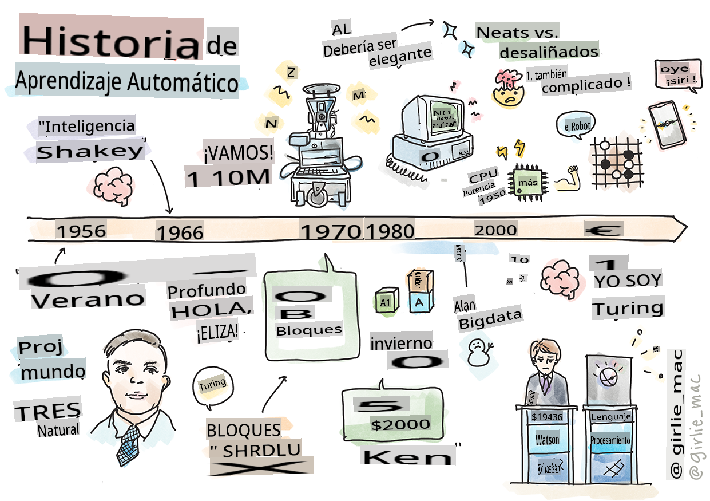
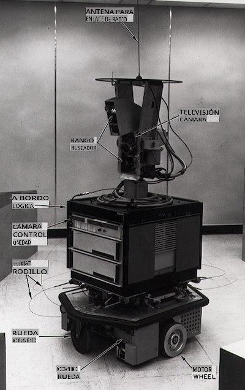
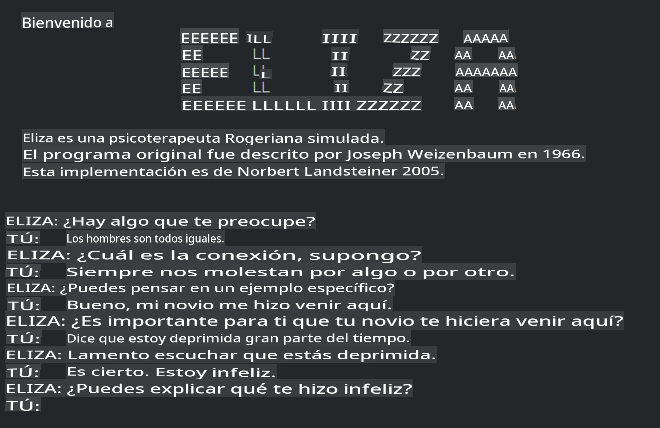

# Historia del aprendizaje automático

> Sketchnote por [Tomomi Imura](https://www.twitter.com/girlie_mac)

## [Cuestionario previo a la lección](https://gray-sand-07a10f403.1.azurestaticapps.net/quiz/3/)

---

> 🎥 Haz clic en la imagen de arriba para ver un video corto sobre esta lección.

En esta lección, repasaremos los hitos más importantes en la historia del aprendizaje automático y la inteligencia artificial.

La historia de la inteligencia artificial (IA) como campo está entrelazada con la historia del aprendizaje automático, ya que los algoritmos y avances computacionales que sustentan el ML alimentaron el desarrollo de la IA. Es útil recordar que, aunque estos campos como áreas de investigación distintas comenzaron a cristalizarse en la década de 1950, importantes [descubrimientos algorítmicos, estadísticos, matemáticos, computacionales y técnicos](https://wikipedia.org/wiki/Timeline_of_machine_learning) precedieron y se superpusieron a esta era. De hecho, las personas han estado pensando en estas cuestiones durante [cientos de años](https://wikipedia.org/wiki/History_of_artificial_intelligence): este artículo discute las bases intelectuales históricas de la idea de una 'máquina pensante'.

---
## Descubrimientos notables

- 1763, 1812 [Teorema de Bayes](https://wikipedia.org/wiki/Bayes%27_theorem) y sus predecesores. Este teorema y sus aplicaciones subyacen en la inferencia, describiendo la probabilidad de que ocurra un evento basado en conocimientos previos.
- 1805 [Teoría de los Mínimos Cuadrados](https://wikipedia.org/wiki/Least_squares) por el matemático francés Adrien-Marie Legendre. Esta teoría, que aprenderás en nuestra unidad de Regresión, ayuda en el ajuste de datos.
- 1913 [Cadenas de Markov](https://wikipedia.org/wiki/Markov_chain), nombradas así por el matemático ruso Andrey Markov, se utilizan para describir una secuencia de posibles eventos basada en un estado anterior.
- 1957 [Perceptrón](https://wikipedia.org/wiki/Perceptron) es un tipo de clasificador lineal inventado por el psicólogo estadounidense Frank Rosenblatt que subyace en los avances en el aprendizaje profundo.

---

- 1967 [Vecino más cercano](https://wikipedia.org/wiki/Nearest_neighbor) es un algoritmo diseñado originalmente para mapear rutas. En un contexto de ML se usa para detectar patrones.
- 1970 [Retropropagación](https://wikipedia.org/wiki/Backpropagation) se utiliza para entrenar [redes neuronales feedforward](https://wikipedia.org/wiki/Feedforward_neural_network).
- 1982 [Redes Neuronales Recurrentes](https://wikipedia.org/wiki/Recurrent_neural_network) son redes neuronales artificiales derivadas de las redes neuronales feedforward que crean gráficos temporales.

✅ Investiga un poco. ¿Qué otras fechas se destacan como fundamentales en la historia del ML y la IA?

---
## 1950: Máquinas que piensan

Alan Turing, una persona verdaderamente notable que fue votada [por el público en 2019](https://wikipedia.org/wiki/Icons:_The_Greatest_Person_of_the_20th_Century) como el mayor científico del siglo XX, es acreditado por ayudar a sentar las bases para el concepto de una 'máquina que puede pensar'. Luchó con detractores y con su propia necesidad de evidencia empírica de este concepto en parte creando el [Test de Turing](https://www.bbc.com/news/technology-18475646), que explorarás en nuestras lecciones de PLN.

---
## 1956: Proyecto de Investigación de Verano de Dartmouth

"El Proyecto de Investigación de Verano de Dartmouth sobre inteligencia artificial fue un evento fundamental para la inteligencia artificial como campo," y fue aquí donde se acuñó el término 'inteligencia artificial' ([fuente](https://250.dartmouth.edu/highlights/artificial-intelligence-ai-coined-dartmouth)).

> Cada aspecto del aprendizaje o cualquier otra característica de la inteligencia puede describirse en principio de manera tan precisa que se pueda hacer que una máquina lo simule.

---

El investigador principal, el profesor de matemáticas John McCarthy, esperaba "proceder sobre la base de la conjetura de que cada aspecto del aprendizaje o cualquier otra característica de la inteligencia puede describirse en principio de manera tan precisa que se pueda hacer que una máquina lo simule." Los participantes incluyeron a otra luminaria en el campo, Marvin Minsky.

El taller se acredita con haber iniciado y alentado varias discusiones, incluyendo "el surgimiento de métodos simbólicos, sistemas enfocados en dominios limitados (primeros sistemas expertos), y sistemas deductivos versus sistemas inductivos." ([fuente](https://wikipedia.org/wiki/Dartmouth_workshop)).

---
## 1956 - 1974: "Los años dorados"

Desde la década de 1950 hasta mediados de los años '70, el optimismo era alto con la esperanza de que la IA pudiera resolver muchos problemas. En 1967, Marvin Minsky afirmó con confianza que "Dentro de una generación... el problema de crear 'inteligencia artificial' se resolverá sustancialmente." (Minsky, Marvin (1967), Computación: Máquinas Finita e Infinita, Englewood Cliffs, N.J.: Prentice-Hall)

La investigación en procesamiento de lenguaje natural floreció, la búsqueda se refinó y se hizo más poderosa, y se creó el concepto de 'micro-mundos', donde se completaban tareas simples usando instrucciones en lenguaje claro.

---

La investigación fue bien financiada por agencias gubernamentales, se hicieron avances en computación y algoritmos, y se construyeron prototipos de máquinas inteligentes. Algunas de estas máquinas incluyen:

* [Shakey el robot](https://wikipedia.org/wiki/Shakey_the_robot), que podía maniobrar y decidir cómo realizar tareas 'inteligentemente'.

    
    > Shakey en 1972

---

* Eliza, un temprano 'chatterbot', podía conversar con personas y actuar como un 'terapeuta' primitivo. Aprenderás más sobre Eliza en las lecciones de PLN.

    
    > Una versión de Eliza, un chatbot

---

* "Mundo de bloques" fue un ejemplo de un micro-mundo donde los bloques podían apilarse y ordenarse, y se podían probar experimentos en enseñar a las máquinas a tomar decisiones. Los avances construidos con bibliotecas como [SHRDLU](https://wikipedia.org/wiki/SHRDLU) ayudaron a impulsar el procesamiento del lenguaje.

    

    > 🎥 Haz clic en la imagen de arriba para un video: Mundo de bloques con SHRDLU

---
## 1974 - 1980: "Invierno de la IA"

A mediados de los años 70, se hizo evidente que la complejidad de hacer 'máquinas inteligentes' había sido subestimada y que su promesa, dada la potencia de cálculo disponible, había sido exagerada. La financiación se secó y la confianza en el campo disminuyó. Algunos problemas que afectaron la confianza incluyeron:
---
- **Limitaciones**. La potencia de cálculo era demasiado limitada.
- **Explosión combinatoria**. La cantidad de parámetros que necesitaban ser entrenados creció exponencialmente a medida que se pedía más a las computadoras, sin una evolución paralela de la potencia y capacidad de cálculo.
- **Escasez de datos**. Había una escasez de datos que obstaculizaba el proceso de probar, desarrollar y refinar algoritmos.
- **¿Estamos haciendo las preguntas correctas?**. Las propias preguntas que se estaban haciendo comenzaron a ser cuestionadas. Los investigadores comenzaron a recibir críticas sobre sus enfoques:
  - Las pruebas de Turing fueron cuestionadas mediante, entre otras ideas, la 'teoría de la habitación china' que postulaba que, "programar una computadora digital puede hacer que parezca entender el lenguaje, pero no podría producir una comprensión real." ([fuente](https://plato.stanford.edu/entries/chinese-room/))
  - Se cuestionó la ética de introducir inteligencias artificiales como el "terapeuta" ELIZA en la sociedad.

---

Al mismo tiempo, comenzaron a formarse varias escuelas de pensamiento de IA. Se estableció una dicotomía entre las prácticas de ["IA desordenada" vs. "IA ordenada"](https://wikipedia.org/wiki/Neats_and_scruffies). Los laboratorios _desordenados_ ajustaban programas durante horas hasta obtener los resultados deseados. Los laboratorios _ordenados_ "se centraban en la lógica y la resolución formal de problemas". ELIZA y SHRDLU eran sistemas _desordenados_ bien conocidos. En la década de 1980, a medida que surgió la demanda de hacer los sistemas de ML reproducibles, el enfoque _ordenado_ gradualmente tomó la delantera ya que sus resultados son más explicables.

---
## Sistemas expertos de los años 80

A medida que el campo creció, sus beneficios para los negocios se hicieron más claros, y en la década de 1980 también lo hizo la proliferación de 'sistemas expertos'. "Los sistemas expertos fueron una de las primeras formas verdaderamente exitosas de software de inteligencia artificial (IA)." ([fuente](https://wikipedia.org/wiki/Expert_system)).

Este tipo de sistema es en realidad _híbrido_, consistiendo parcialmente en un motor de reglas que define los requisitos comerciales, y un motor de inferencia que aprovechaba el sistema de reglas para deducir nuevos hechos.

Esta era también vio una mayor atención a las redes neuronales.

---
## 1987 - 1993: 'Enfriamiento' de la IA

La proliferación de hardware especializado en sistemas expertos tuvo el desafortunado efecto de volverse demasiado especializado. El auge de las computadoras personales también compitió con estos sistemas grandes, especializados y centralizados. La democratización de la informática había comenzado, y eventualmente allanó el camino para la explosión moderna de big data.

---
## 1993 - 2011

Esta época vio una nueva era para el ML y la IA, pudiendo resolver algunos de los problemas causados anteriormente por la falta de datos y potencia de cálculo. La cantidad de datos comenzó a aumentar rápidamente y a estar más disponible, para bien y para mal, especialmente con la llegada del smartphone alrededor de 2007. La potencia de cálculo se expandió exponencialmente, y los algoritmos evolucionaron junto a ella. El campo comenzó a madurar a medida que los días desenfrenados del pasado comenzaron a cristalizarse en una verdadera disciplina.

---
## Ahora

Hoy en día, el aprendizaje automático y la IA tocan casi todas las partes de nuestras vidas. Esta era exige una comprensión cuidadosa de los riesgos y efectos potenciales de estos algoritmos en la vida humana. Como ha dicho Brad Smith de Microsoft, "La tecnología de la información plantea cuestiones que llegan al corazón de las protecciones fundamentales de los derechos humanos, como la privacidad y la libertad de expresión. Estas cuestiones aumentan la responsabilidad de las empresas tecnológicas que crean estos productos. En nuestra opinión, también exigen una regulación gubernamental reflexiva y el desarrollo de normas sobre usos aceptables" ([fuente](https://www.technologyreview.com/2019/12/18/102365/the-future-of-ais-impact-on-society/)).

---

Queda por ver qué depara el futuro, pero es importante entender estos sistemas informáticos y el software y algoritmos que ejecutan. Esperamos que este plan de estudios te ayude a obtener una mejor comprensión para que puedas decidir por ti mismo.

> 🎥 Haz clic en la imagen de arriba para un video: Yann LeCun discute la historia del aprendizaje profundo en esta conferencia

---
## 🚀Desafío

Investiga uno de estos momentos históricos y aprende más sobre las personas detrás de ellos. Hay personajes fascinantes, y ningún descubrimiento científico se creó jamás en un vacío cultural. ¿Qué descubres?

## [Cuestionario posterior a la lección](https://gray-sand-07a10f403.1.azurestaticapps.net/quiz/4/)

---
## Revisión y Autoestudio

Aquí hay elementos para ver y escuchar:

[Este podcast donde Amy Boyd discute la evolución de la IA](http://runasradio.com/Shows/Show/739)

---

## Tarea

[Crear una línea de tiempo](assignment.md)

**Descargo de responsabilidad**:
Este documento ha sido traducido utilizando servicios de traducción automática basados en IA. Si bien nos esforzamos por lograr precisión, tenga en cuenta que las traducciones automáticas pueden contener errores o imprecisiones. El documento original en su idioma nativo debe considerarse la fuente autorizada. Para información crítica, se recomienda una traducción profesional humana. No nos hacemos responsables de ningún malentendido o interpretación errónea que surja del uso de esta traducción.