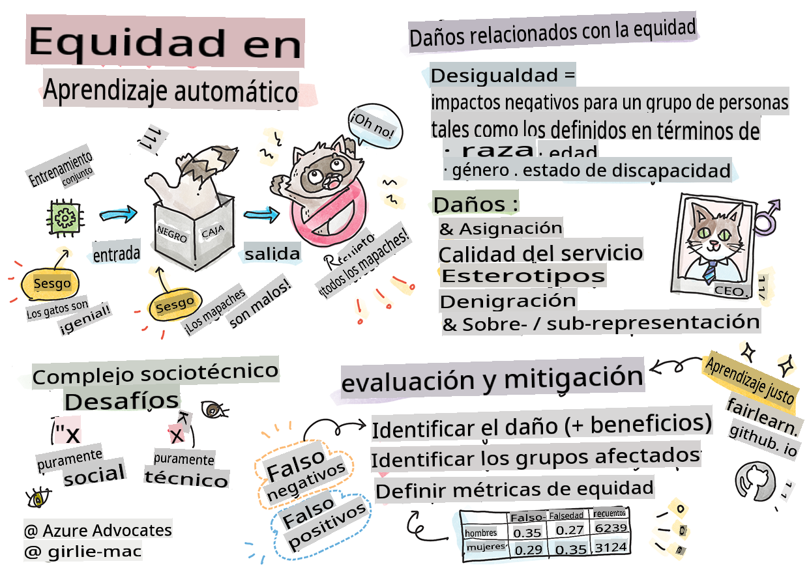

# Construyendo soluciones de aprendizaje automático con IA responsable

> Sketchnote por [Tomomi Imura](https://www.twitter.com/girlie_mac)

## [Cuestionario previo a la lección](https://gray-sand-07a10f403.1.azurestaticapps.net/quiz/5/)

## Introducción

En este currículo, comenzarás a descubrir cómo el aprendizaje automático puede y está impactando nuestras vidas cotidianas. Incluso ahora, los sistemas y modelos están involucrados en tareas de toma de decisiones diarias, como diagnósticos de salud, aprobaciones de préstamos o detección de fraudes. Por lo tanto, es importante que estos modelos funcionen bien para proporcionar resultados confiables. Al igual que cualquier aplicación de software, los sistemas de IA pueden no cumplir con las expectativas o tener un resultado indeseable. Es por eso que es esencial poder entender y explicar el comportamiento de un modelo de IA.

Imagina lo que puede suceder cuando los datos que utilizas para construir estos modelos carecen de ciertos datos demográficos, como raza, género, visión política, religión, o representan desproporcionadamente dichos datos demográficos. ¿Qué pasa cuando la salida del modelo se interpreta para favorecer a algunos demográficos? ¿Cuál es la consecuencia para la aplicación? Además, ¿qué sucede cuando el modelo tiene un resultado adverso y es perjudicial para las personas? ¿Quién es responsable del comportamiento de los sistemas de IA? Estas son algunas preguntas que exploraremos en este currículo.

En esta lección, tú:

- Aumentarás tu conciencia sobre la importancia de la equidad en el aprendizaje automático y los daños relacionados con la equidad.
- Te familiarizarás con la práctica de explorar valores atípicos y escenarios inusuales para garantizar la fiabilidad y seguridad.
- Comprenderás la necesidad de empoderar a todos diseñando sistemas inclusivos.
- Explorarás la importancia de proteger la privacidad y seguridad de los datos y las personas.
- Verás la importancia de tener un enfoque de caja de cristal para explicar el comportamiento de los modelos de IA.
- Serás consciente de cómo la responsabilidad es esencial para construir confianza en los sistemas de IA.

## Prerrequisito

Como prerrequisito, toma la ruta de aprendizaje "Principios de IA Responsable" y mira el video a continuación sobre el tema:

Aprende más sobre IA Responsable siguiendo esta [Ruta de Aprendizaje](https://docs.microsoft.com/learn/modules/responsible-ai-principles/?WT.mc_id=academic-77952-leestott)

> 🎥 Haz clic en la imagen de arriba para ver un video: Enfoque de Microsoft hacia la IA Responsable

## Equidad

Los sistemas de IA deben tratar a todos de manera justa y evitar afectar a grupos similares de personas de diferentes maneras. Por ejemplo, cuando los sistemas de IA proporcionan orientación sobre tratamiento médico, solicitudes de préstamos o empleo, deben hacer las mismas recomendaciones a todos con síntomas similares, circunstancias financieras o cualificaciones profesionales. Cada uno de nosotros, como seres humanos, lleva consigo sesgos heredados que afectan nuestras decisiones y acciones. Estos sesgos pueden ser evidentes en los datos que utilizamos para entrenar los sistemas de IA. Dicha manipulación puede ocurrir a veces de manera involuntaria. A menudo es difícil saber conscientemente cuándo estás introduciendo sesgo en los datos.

**"Injusticia"** abarca impactos negativos, o "daños", para un grupo de personas, como aquellos definidos en términos de raza, género, edad o estado de discapacidad. Los principales daños relacionados con la equidad se pueden clasificar como:

- **Asignación**, si por ejemplo se favorece a un género o etnia sobre otro.
- **Calidad del servicio**. Si entrenas los datos para un escenario específico pero la realidad es mucho más compleja, lleva a un servicio de bajo rendimiento. Por ejemplo, un dispensador de jabón de manos que no parece ser capaz de detectar personas con piel oscura. [Referencia](https://gizmodo.com/why-cant-this-soap-dispenser-identify-dark-skin-1797931773)
- **Denigración**. Criticar y etiquetar injustamente algo o alguien. Por ejemplo, una tecnología de etiquetado de imágenes etiquetó infamemente imágenes de personas de piel oscura como gorilas.
- **Sobre o subrepresentación**. La idea es que un cierto grupo no se vea en una cierta profesión, y cualquier servicio o función que siga promoviendo eso está contribuyendo al daño.
- **Estereotipos**. Asociar un grupo dado con atributos preasignados. Por ejemplo, un sistema de traducción de idiomas entre inglés y turco puede tener inexactitudes debido a palabras con asociaciones estereotipadas de género.

> traducción al turco

> traducción de vuelta al inglés

Al diseñar y probar sistemas de IA, debemos asegurarnos de que la IA sea justa y no esté programada para tomar decisiones sesgadas o discriminatorias, que los seres humanos también tienen prohibido tomar. Garantizar la equidad en la IA y el aprendizaje automático sigue siendo un desafío sociotécnico complejo.

### Fiabilidad y seguridad

Para generar confianza, los sistemas de IA deben ser fiables, seguros y consistentes bajo condiciones normales e inesperadas. Es importante saber cómo se comportarán los sistemas de IA en una variedad de situaciones, especialmente cuando son casos atípicos. Al construir soluciones de IA, se debe poner un enfoque sustancial en cómo manejar una amplia variedad de circunstancias que las soluciones de IA encontrarían. Por ejemplo, un coche autónomo debe poner la seguridad de las personas como una prioridad principal. Como resultado, la IA que impulsa el coche necesita considerar todos los posibles escenarios que el coche podría encontrar, como noche, tormentas eléctricas o ventiscas, niños corriendo por la calle, mascotas, construcciones en la carretera, etc. Qué tan bien un sistema de IA puede manejar una amplia gama de condiciones de manera fiable y segura refleja el nivel de anticipación que el científico de datos o el desarrollador de IA consideró durante el diseño o prueba del sistema.

> [🎥 Haz clic aquí para un video:](https://www.microsoft.com/videoplayer/embed/RE4vvIl)

### Inclusión

Los sistemas de IA deben ser diseñados para involucrar y empoderar a todos. Al diseñar e implementar sistemas de IA, los científicos de datos y desarrolladores de IA identifican y abordan posibles barreras en el sistema que podrían excluir involuntariamente a las personas. Por ejemplo, hay 1 mil millones de personas con discapacidades en todo el mundo. Con el avance de la IA, pueden acceder a una amplia gama de información y oportunidades más fácilmente en sus vidas diarias. Al abordar las barreras, se crean oportunidades para innovar y desarrollar productos de IA con mejores experiencias que beneficien a todos.

> [🎥 Haz clic aquí para un video: inclusión en IA](https://www.microsoft.com/videoplayer/embed/RE4vl9v)

### Seguridad y privacidad

Los sistemas de IA deben ser seguros y respetar la privacidad de las personas. Las personas confían menos en los sistemas que ponen en riesgo su privacidad, información o vidas. Al entrenar modelos de aprendizaje automático, dependemos de los datos para producir los mejores resultados. Al hacerlo, se debe considerar el origen de los datos y su integridad. Por ejemplo, ¿fueron los datos enviados por el usuario o estaban disponibles públicamente? Luego, al trabajar con los datos, es crucial desarrollar sistemas de IA que puedan proteger la información confidencial y resistir ataques. A medida que la IA se vuelve más prevalente, proteger la privacidad y asegurar información personal y empresarial importante se vuelve más crítico y complejo. Los problemas de privacidad y seguridad de datos requieren una atención especialmente cercana para la IA porque el acceso a los datos es esencial para que los sistemas de IA hagan predicciones y decisiones precisas e informadas sobre las personas.

> [🎥 Haz clic aquí para un video: seguridad en IA](https://www.microsoft.com/videoplayer/embed/RE4voJF)

- Como industria, hemos logrado avances significativos en privacidad y seguridad, impulsados significativamente por regulaciones como el GDPR (Reglamento General de Protección de Datos).
- Sin embargo, con los sistemas de IA debemos reconocer la tensión entre la necesidad de más datos personales para hacer los sistemas más personales y efectivos y la privacidad.
- Al igual que con el nacimiento de las computadoras conectadas a Internet, también estamos viendo un gran aumento en el número de problemas de seguridad relacionados con la IA.
- Al mismo tiempo, hemos visto que la IA se usa para mejorar la seguridad. Como ejemplo, la mayoría de los escáneres antivirus modernos están impulsados por heurísticas de IA hoy en día.
- Necesitamos asegurarnos de que nuestros procesos de Ciencia de Datos se mezclen armoniosamente con las últimas prácticas de privacidad y seguridad.

### Transparencia

Los sistemas de IA deben ser comprensibles. Una parte crucial de la transparencia es explicar el comportamiento de los sistemas de IA y sus componentes. Mejorar la comprensión de los sistemas de IA requiere que las partes interesadas comprendan cómo y por qué funcionan para que puedan identificar posibles problemas de rendimiento, preocupaciones de seguridad y privacidad, sesgos, prácticas excluyentes o resultados no deseados. También creemos que aquellos que usan sistemas de IA deben ser honestos y abiertos sobre cuándo, por qué y cómo eligen implementarlos, así como las limitaciones de los sistemas que usan. Por ejemplo, si un banco usa un sistema de IA para apoyar sus decisiones de préstamos al consumidor, es importante examinar los resultados y entender qué datos influyen en las recomendaciones del sistema. Los gobiernos están comenzando a regular la IA en diversas industrias, por lo que los científicos de datos y las organizaciones deben explicar si un sistema de IA cumple con los requisitos regulatorios, especialmente cuando hay un resultado no deseado.

> [🎥 Haz clic aquí para un video: transparencia en IA](https://www.microsoft.com/videoplayer/embed/RE4voJF)

- Debido a que los sistemas de IA son tan complejos, es difícil entender cómo funcionan e interpretar los resultados.
- Esta falta de comprensión afecta la forma en que se gestionan, operacionalizan y documentan estos sistemas.
- Esta falta de comprensión afecta más importantemente las decisiones tomadas utilizando los resultados que estos sistemas producen.

### Responsabilidad

Las personas que diseñan y despliegan sistemas de IA deben ser responsables de cómo operan sus sistemas. La necesidad de responsabilidad es particularmente crucial con tecnologías de uso sensible como el reconocimiento facial. Recientemente, ha habido una creciente demanda de tecnología de reconocimiento facial, especialmente por parte de organizaciones de aplicación de la ley que ven el potencial de la tecnología en usos como encontrar niños desaparecidos. Sin embargo, estas tecnologías podrían ser potencialmente utilizadas por un gobierno para poner en riesgo las libertades fundamentales de sus ciudadanos al, por ejemplo, permitir la vigilancia continua de individuos específicos. Por lo tanto, los científicos de datos y las organizaciones deben ser responsables de cómo su sistema de IA impacta a individuos o a la sociedad.

> 🎥 Haz clic en la imagen de arriba para ver un video: Advertencias sobre la vigilancia masiva a través del reconocimiento facial

En última instancia, una de las preguntas más grandes para nuestra generación, como la primera generación que está llevando la IA a la sociedad, es cómo asegurarse de que las computadoras sigan siendo responsables ante las personas y cómo asegurarse de que las personas que diseñan computadoras sean responsables ante todos los demás.

## Evaluación de impacto

Antes de entrenar un modelo de aprendizaje automático, es importante realizar una evaluación de impacto para comprender el propósito del sistema de IA; cuál es el uso previsto; dónde se desplegará; y quién interactuará con el sistema. Estos son útiles para el/los revisor(es) o probadores que evalúan el sistema para saber qué factores considerar al identificar posibles riesgos y consecuencias esperadas.

Las siguientes son áreas de enfoque al realizar una evaluación de impacto:

* **Impacto adverso en individuos**. Ser consciente de cualquier restricción o requisito, uso no soportado o cualquier limitación conocida que obstaculice el rendimiento del sistema es vital para garantizar que el sistema no se use de manera que pueda causar daño a los individuos.
* **Requisitos de datos**. Comprender cómo y dónde el sistema usará los datos permite a los revisores explorar cualquier requisito de datos que debas tener en cuenta (por ejemplo, regulaciones de datos GDPR o HIPPA). Además, examina si la fuente o cantidad de datos es sustancial para el entrenamiento.
* **Resumen del impacto**. Reúne una lista de posibles daños que podrían surgir del uso del sistema. A lo largo del ciclo de vida del ML, revisa si los problemas identificados están mitigados o abordados.
* **Objetivos aplicables** para cada uno de los seis principios fundamentales. Evalúa si los objetivos de cada uno de los principios se cumplen y si hay alguna brecha.

## Depuración con IA responsable

Al igual que depurar una aplicación de software, depurar un sistema de IA es un proceso necesario de identificación y resolución de problemas en el sistema. Hay muchos factores que afectarían a un modelo que no se desempeña como se espera o de manera responsable. La mayoría de las métricas de rendimiento de modelos tradicionales son agregados cuantitativos del rendimiento de un modelo, que no son suficientes para analizar cómo un modelo viola los principios de IA responsable. Además, un modelo de aprendizaje automático es una caja negra que hace difícil entender qué impulsa su resultado o proporcionar una explicación cuando comete un error. Más adelante en este curso, aprenderemos cómo usar el panel de IA Responsable para ayudar a depurar sistemas de IA. El panel proporciona una herramienta holística para que los científicos de datos y desarrolladores de IA realicen:

* **Análisis de errores**. Para identificar la distribución de errores del modelo que puede afectar la equidad o fiabilidad del sistema.
* **Visión general del modelo**. Para descubrir dónde hay disparidades en el rendimiento del modelo a través de cohortes de datos.
* **Análisis de datos**. Para entender la distribución de datos e identificar cualquier posible sesgo en los datos que podría llevar a problemas de equidad, inclusión y fiabilidad.
* **Interpretabilidad del modelo**. Para entender qué afecta o influye en las predicciones del modelo. Esto ayuda a explicar el comportamiento del modelo, lo cual es importante para la transparencia y la responsabilidad.

## 🚀 Desafío

Para prevenir daños desde el principio, debemos:

- tener una diversidad de antecedentes y perspectivas entre las personas que trabajan en los sistemas
- invertir en conjuntos de datos que reflejen la diversidad de nuestra sociedad
- desarrollar mejores métodos a lo largo del ciclo de vida del aprendizaje automático para detectar y corregir la IA responsable cuando ocurra

Piensa en escenarios de la vida real donde la falta de confiabilidad de un modelo es evidente en la construcción y uso del modelo. ¿Qué más deberíamos considerar?

## [Cuestionario posterior a la lección](https://gray-sand-07a10f403.1.azurestaticapps.net/quiz/6/)
## Revisión y autoestudio

En esta lección, has aprendido algunos conceptos básicos sobre la equidad y la injusticia en el aprendizaje automático.

Mira este taller para profundizar en los temas:

- En busca de IA responsable: Llevando los principios a la práctica por Besmira Nushi, Mehrnoosh Sameki y Amit Sharma

> 🎥 Haz clic en la imagen de arriba para ver un video: RAI Toolbox: Un marco de código abierto para construir IA responsable por Besmira Nushi, Mehrnoosh Sameki y Amit Sharma

También lee:

- Centro de recursos de RAI de Microsoft: [Recursos de IA Responsable – Microsoft AI](https://www.microsoft.com/ai/responsible-ai-resources?activetab=pivot1%3aprimaryr4)

- Grupo de investigación FATE de Microsoft: [FATE: Equidad, Responsabilidad, Transparencia y Ética en IA - Microsoft Research](https://www.microsoft.com/research/theme/fate/)

RAI Toolbox:

- [Repositorio de GitHub de Responsible AI Toolbox](https://github.com/microsoft/responsible-ai-toolbox)

Lee sobre las herramientas de Azure Machine Learning para garantizar la equidad:

- [Azure Machine Learning](https://docs.microsoft.com/azure/machine-learning/concept-fairness-ml?WT.mc_id=academic-77952-leestott)

## Tarea

[Explora RAI Toolbox](assignment.md)

**Descargo de responsabilidad**:
Este documento ha sido traducido utilizando servicios de traducción automática basados en inteligencia artificial. Aunque nos esforzamos por lograr precisión, tenga en cuenta que las traducciones automáticas pueden contener errores o imprecisiones. El documento original en su idioma nativo debe considerarse la fuente autorizada. Para información crítica, se recomienda la traducción profesional humana. No somos responsables de ningún malentendido o interpretación errónea que surja del uso de esta traducción.