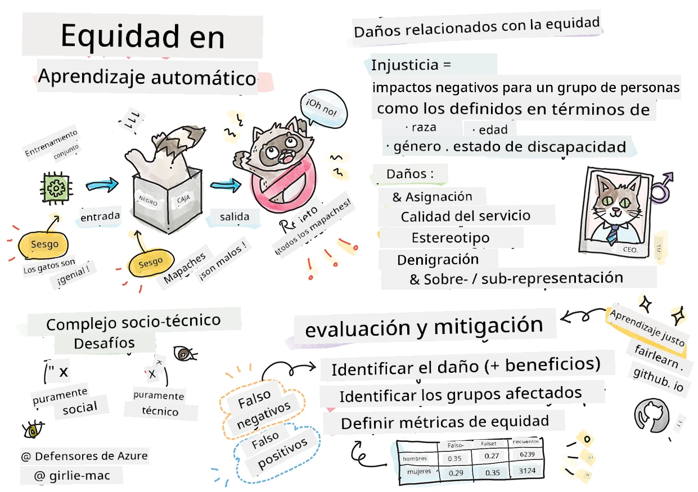

# Construyendo soluciones de Machine Learning con IA responsable
 

> Sketchnote por [Tomomi Imura](https://www.twitter.com/girlie_mac)

## [Cuestionario previo a la clase](https://ff-quizzes.netlify.app/en/ml/)
 
## Introducción

En este currículo, comenzarás a descubrir cómo el aprendizaje automático puede y está impactando nuestra vida diaria. Incluso ahora, los sistemas y modelos participan en tareas diarias de toma de decisiones, como diagnósticos médicos, aprobación de préstamos o detección de fraudes. Por lo tanto, es importante que estos modelos funcionen bien para proporcionar resultados confiables. Al igual que cualquier aplicación de software, los sistemas de IA pueden no cumplir con las expectativas o tener un resultado no deseado. Por eso es esencial poder entender y explicar el comportamiento de un modelo de IA.

Imagina qué puede pasar cuando los datos que usas para construir estos modelos carecen de ciertos grupos demográficos, como raza, género, opinión política, religión, o representan de manera desproporcionada dichos grupos demográficos. ¿Qué pasa cuando la salida del modelo se interpreta para favorecer a algún grupo demográfico? ¿Cuál es la consecuencia para la aplicación? Además, ¿qué ocurre cuando el modelo tiene un resultado adverso y es perjudicial para las personas? ¿Quién es responsable del comportamiento del sistema de IA? Estas son algunas preguntas que exploraremos en este currículo.

En esta lección, tú:

- Tomarás conciencia sobre la importancia de la equidad en el aprendizaje automático y los daños relacionados con la equidad.
- Te familiarizarás con la práctica de explorar valores atípicos y escenarios inusuales para asegurar la fiabilidad y seguridad.
- Entenderás la necesidad de empoderar a todos mediante el diseño de sistemas inclusivos.
- Explorarás lo vital que es proteger la privacidad y la seguridad de los datos y las personas.
- Verás la importancia de tener un enfoque de caja transparente para explicar el comportamiento de los modelos de IA.
- Serás consciente de cómo la responsabilidad es esencial para construir confianza en los sistemas de IA.

## Requisito previo

Como requisito previo, realiza el "Camino de aprendizaje de Principios de IA Responsable" y mira el video a continuación sobre el tema:

Aprende más sobre IA Responsable siguiendo este [Camino de aprendizaje](https://docs.microsoft.com/learn/modules/responsible-ai-principles/?WT.mc_id=academic-77952-leestott)

> 🎥 Haz clic en la imagen de arriba para un video: Enfoque de Microsoft sobre IA Responsable

## Equidad

Los sistemas de IA deben tratar a todos con equidad y evitar afectar de manera diferente a grupos similares de personas. Por ejemplo, cuando los sistemas de IA brindan orientación sobre tratamiento médico, solicitudes de préstamos o empleo, deberían hacer las mismas recomendaciones a todos con síntomas, circunstancias financieras o calificaciones profesionales similares. Cada uno de nosotros, como humanos, lleva inherentes sesgos que afectan nuestras decisiones y acciones. Estos sesgos pueden estar presentes en los datos que usamos para entrenar sistemas de IA. Tal manipulación a veces ocurre sin intención. A menudo es difícil saber conscientemente cuándo estás introduciendo un sesgo en los datos.

**"Injusticia"** abarca impactos negativos, o "daños", para un grupo de personas, como aquellos definidos en términos de raza, género, edad o condición de discapacidad. Los principales daños relacionados con la equidad pueden clasificarse como:

- **Asignación**, si por ejemplo se favorece un género o etnia sobre otro.
- **Calidad del servicio**. Si entrenas los datos para un escenario específico pero la realidad es mucho más compleja, lleva a un servicio de bajo rendimiento. Por ejemplo, un dispensador de jabón que no podía detectar personas con piel oscura. [Referencia](https://gizmodo.com/why-cant-this-soap-dispenser-identify-dark-skin-1797931773)
- **Denigración**. Criticar y etiquetar injustamente algo o a alguien. Por ejemplo, una tecnología de etiquetado de imágenes que etiquetó erróneamente imágenes de personas de piel oscura como gorilas.
- **Sobre o sub-representación**. La idea es que un cierto grupo no se vea en una profesión determinada, y cualquier servicio o función que siga promoviendo eso contribuye al daño.
- **Estereotipos**. Asociar a un grupo dado atributos preasignados. Por ejemplo, un sistema de traducción entre inglés y turco puede tener inexactitudes debido a palabras con asociaciones estereotipadas de género.

> traducción al turco

> traducción de vuelta al inglés

Al diseñar y probar sistemas de IA, debemos asegurar que la IA sea justa y no esté programada para tomar decisiones sesgadas o discriminatorias, decisión que también está prohibida a los humanos. Garantizar la equidad en IA y aprendizaje automático sigue siendo un desafío sociotécnico complejo.

### Fiabilidad y seguridad

Para generar confianza, los sistemas de IA deben ser fiables, seguros y consistentes en condiciones normales e inesperadas. Es importante saber cómo se comportarán los sistemas de IA en diversas situaciones, especialmente cuando son casos extremos. Al construir soluciones de IA, se debe poner un enfoque sustancial en cómo manejar una amplia variedad de circunstancias que las soluciones de IA puedan encontrar. Por ejemplo, un auto autónomo debe priorizar la seguridad de las personas. Por eso, la IA que impulsa el auto debe considerar todos los posibles escenarios que el auto podría encontrar, como la noche, tormentas eléctricas o granizadas, niños cruzando la calle, mascotas, construcciones en la vía, etc. Qué tan bien puede un sistema de IA manejar un rango amplio de condiciones de manera confiable y segura refleja el nivel de anticipación que el científico de datos o desarrollador de IA consideró durante el diseño o pruebas del sistema.

> [🎥 Haz clic aquí para un video: ](https://www.microsoft.com/videoplayer/embed/RE4vvIl)

### Inclusión

Los sistemas de IA deben diseñarse para involucrar y empoderar a todos. Al diseñar e implementar sistemas de IA, los científicos de datos y desarrolladores de IA identifican y abordan posibles barreras en el sistema que podrían excluir a personas sin intención. Por ejemplo, hay 1 mil millones de personas con discapacidades en el mundo. Con el avance de la IA, pueden acceder más fácilmente a una amplia gama de información y oportunidades en su vida diaria. Al abordar las barreras, se crean oportunidades para innovar y desarrollar productos de IA con mejores experiencias que benefician a todos.

> [🎥 Haz clic aquí para un video: inclusión en IA](https://www.microsoft.com/videoplayer/embed/RE4vl9v)

### Seguridad y privacidad

Los sistemas de IA deben ser seguros y respetar la privacidad de las personas. La gente confía menos en sistemas que ponen en riesgo su privacidad, información o vidas. Al entrenar modelos de aprendizaje automático, confiamos en los datos para producir los mejores resultados. Al hacerlo, se debe considerar el origen y la integridad de los datos. Por ejemplo, ¿fueron los datos enviados por usuarios o están disponibles públicamente? Además, al trabajar con los datos, es crucial desarrollar sistemas de IA que puedan proteger información confidencial y resistir ataques. Conforme la IA se vuelve más prevalente, proteger la privacidad y asegurar información personal y empresarial importante se vuelve más crítico y complejo. Los temas de privacidad y seguridad de datos requieren especial atención en IA porque el acceso a los datos es esencial para que los sistemas de IA hagan predicciones y decisiones precisas e informadas sobre las personas.

> [🎥 Haz clic aquí para un video: seguridad en IA](https://www.microsoft.com/videoplayer/embed/RE4voJF)

- Como industria hemos avanzado significativamente en privacidad y seguridad, impulsados en gran medida por regulaciones como el GDPR (Reglamento General de Protección de Datos).
- Sin embargo, con los sistemas de IA debemos reconocer la tensión entre la necesidad de más datos personales para hacer los sistemas más personales y efectivos – y la privacidad.
- Al igual que con el nacimiento de computadoras conectadas con internet, también estamos viendo un gran aumento en los problemas de seguridad relacionados con la IA.
- Al mismo tiempo, hemos visto que la IA se usa para mejorar la seguridad. Por ejemplo, la mayoría de los escáneres antivirus modernos hoy en día cuentan con heurísticas de IA.
- Debemos asegurar que nuestros procesos de Ciencia de Datos se integren armoniosamente con las últimas prácticas de privacidad y seguridad.

### Transparencia
Los sistemas de IA deben ser comprensibles. Parte crucial de la transparencia es explicar el comportamiento de los sistemas de IA y sus componentes. Mejorar la comprensión de los sistemas de IA requiere que las partes interesadas comprendan cómo y por qué funcionan para que puedan identificar problemas potenciales de desempeño, preocupaciones de seguridad y privacidad, sesgos, prácticas excluyentes o resultados no intencionados. También creemos que quienes usan sistemas de IA deben ser honestos y transparentes sobre cuándo, por qué y cómo eligen desplegarlos, así como sus limitaciones. Por ejemplo, si un banco usa un sistema de IA para soportar decisiones de préstamos a consumidores, es importante examinar los resultados y entender qué datos influyen en las recomendaciones del sistema. Los gobiernos están empezando a regular la IA en diferentes industrias, por lo tanto los científicos de datos y organizaciones deben explicar si un sistema de IA cumple con los requerimientos regulatorios, especialmente si hay un resultado no deseado.

> [🎥 Haz clic aquí para un video: transparencia en IA](https://www.microsoft.com/videoplayer/embed/RE4voJF)

- Debido a que los sistemas de IA son muy complejos, es difícil entender cómo funcionan e interpretar los resultados.
- Esta falta de comprensión afecta la manera en que estos sistemas son gestionados, operativizados y documentados.
- Lo más importante, esta falta de comprensión afecta las decisiones tomadas usando los resultados que estos sistemas producen.

### Responsabilidad
 
Las personas que diseñan y despliegan sistemas de IA deben ser responsables de cómo operan sus sistemas. La necesidad de responsabilidad es especialmente crucial con tecnologías sensibles como el reconocimiento facial. Recientemente, ha habido una creciente demanda de tecnología de reconocimiento facial, especialmente de organizaciones de aplicación de la ley que ven el potencial en usos como localizar niños desaparecidos. Sin embargo, estas tecnologías podrían ser usadas por un gobierno para poner en riesgo las libertades fundamentales de sus ciudadanos, por ejemplo, habilitando vigilancia continua de individuos específicos. Por lo tanto, los científicos de datos y organizaciones deben ser responsables de cómo su sistema de IA impacta a los individuos o la sociedad.

> 🎥 Haz clic en la imagen de arriba para un video: Advertencias sobre vigilancia masiva mediante reconocimiento facial

En última instancia, una de las mayores preguntas para nuestra generación, como la primera generación que está trayendo IA a la sociedad, es cómo asegurar que las computadoras permanezcan responsables ante las personas y cómo asegurar que quienes diseñan las computadoras sigan siendo responsables ante todos los demás.

## Evaluación de impacto

Antes de entrenar un modelo de aprendizaje automático, es importante realizar una evaluación de impacto para entender el propósito del sistema de IA; cuál es el uso previsto; dónde será desplegado; y quién interactuará con el sistema. Esto es útil para revisores o evaluadores del sistema para saber qué factores considerar al identificar riesgos potenciales y consecuencias esperadas.

Las siguientes son áreas de enfoque al realizar una evaluación de impacto:

* **Impacto adverso en individuos**. Ser consciente de cualquier restricción o requisito, uso no soportado o cualquier limitación conocida que impida el desempeño del sistema es vital para asegurar que el sistema no se use de manera que pueda causar daño a las personas.
* **Requisitos de datos**. Entender cómo y dónde el sistema usará los datos permite a los revisores explorar cualquier requisito de datos que se deba considerar (por ejemplo, regulaciones de datos GDPR o HIPAA). Además, examina si la fuente o cantidad de datos es suficiente para el entrenamiento.
* **Resumen de impacto**. Recopila una lista de posibles daños que podrían surgir del uso del sistema. A lo largo del ciclo de vida de ML, revisa si los problemas identificados se mitigan o abordan.
* **Objetivos aplicables** para cada uno de los seis principios fundamentales. Evalúa si se cumplen los objetivos de cada principio y si existen brechas.

## Depuración con IA responsable

Similar a depurar una aplicación de software, depurar un sistema de IA es un proceso necesario para identificar y resolver problemas en el sistema. Hay muchos factores que afectarían que un modelo no rinda como se espera o de manera responsable. La mayoría de métricas tradicionales de desempeño de modelos son agregados cuantitativos del rendimiento del modelo, que no son suficientes para analizar cómo un modelo viola los principios de IA responsable. Además, un modelo de aprendizaje automático es una caja negra que dificulta entender qué impulsa su resultado o dar explicación cuando comete un error. Más adelante en este curso aprenderemos a usar el panel de IA Responsable para ayudar a depurar sistemas de IA. El panel proporciona una herramienta holística para que científicos de datos y desarrolladores de IA realicen:

* **Análisis de errores**. Para identificar la distribución de errores del modelo que pueden afectar la equidad o fiabilidad del sistema.
* **Resumen del modelo**. Para descubrir dónde hay disparidades en el desempeño del modelo a través de cohortes de datos.
* **Análisis de datos**. Para entender la distribución de datos e identificar posibles sesgos en los datos que podrían causar problemas de equidad, inclusión y fiabilidad.
* **Interpretabilidad del modelo**. Para entender qué afecta o influye en las predicciones del modelo. Esto ayuda a explicar el comportamiento del modelo, importante para la transparencia y responsabilidad.

## 🚀 Desafío
 
Para prevenir que se introduzcan daños en primer lugar, deberíamos:

- tener diversidad de orígenes y perspectivas entre las personas que trabajan en sistemas
- invertir en conjuntos de datos que reflejen la diversidad de nuestra sociedad
- desarrollar mejores métodos a lo largo del ciclo de vida del aprendizaje automático para detectar y corregir IA responsable cuando ocurra

Piensa en escenarios de la vida real donde la falta de confiabilidad de un modelo es evidente en la construcción y uso del modelo. ¿Qué más deberíamos considerar?

## [Cuestionario posterior a la clase](https://ff-quizzes.netlify.app/en/ml/)

## Revisión y autoestudio
 

En esta lección, has aprendido algunos conceptos básicos sobre la equidad y la inequidad en el aprendizaje automático.  
 
Mira este taller para profundizar en los temas: 

- En búsqueda de una IA responsable: Llevar los principios a la práctica por Besmira Nushi, Mehrnoosh Sameki y Amit Sharma

> 🎥 Haz clic en la imagen de arriba para ver el video: Caja de herramientas RAI: Un marco de código abierto para construir IA responsable por Besmira Nushi, Mehrnoosh Sameki y Amit Sharma

También, lee: 

- Centro de recursos RAI de Microsoft: [Recursos de IA Responsable – Microsoft AI](https://www.microsoft.com/ai/responsible-ai-resources?activetab=pivot1%3aprimaryr4) 

- Grupo de investigación FATE de Microsoft: [FATE: Equidad, Responsabilidad, Transparencia y Ética en IA - Microsoft Research](https://www.microsoft.com/research/theme/fate/) 

Caja de herramientas RAI: 

- [Repositorio GitHub de la Caja de herramientas de IA Responsable](https://github.com/microsoft/responsible-ai-toolbox)

Lee sobre las herramientas de Azure Machine Learning para asegurar la equidad:

- [Azure Machine Learning](https://docs.microsoft.com/azure/machine-learning/concept-fairness-ml?WT.mc_id=academic-77952-leestott) 

## Tarea

[Explora Caja de herramientas RAI](assignment.md)

---

<!-- CO-OP TRANSLATOR DISCLAIMER START -->
**Descargo de responsabilidad**:
Este documento ha sido traducido utilizando el servicio de traducción automática [Co-op Translator](https://github.com/Azure/co-op-translator). Aunque nos esforzamos por la precisión, tenga en cuenta que las traducciones automatizadas pueden contener errores o inexactitudes. El documento original en su idioma nativo debe considerarse la fuente autorizada. Para información crítica, se recomienda una traducción profesional humana. No somos responsables de cualquier malentendido o interpretación errónea que surja del uso de esta traducción.
<!-- CO-OP TRANSLATOR DISCLAIMER END -->