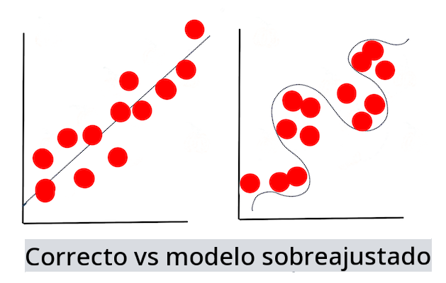

# Técnicas de Aprendizaje Automático

El proceso de construir, usar y mantener modelos de aprendizaje automático y los datos que utilizan es muy diferente de muchos otros flujos de trabajo de desarrollo. En esta lección, desmitificaremos el proceso y delinearemos las principales técnicas que necesitas conocer. Tú:

- Comprenderás los procesos que sustentan el aprendizaje automático a un alto nivel.
- Explorarás conceptos básicos como 'modelos', 'predicciones' y 'datos de entrenamiento'.

## [Cuestionario previo a la lección](https://gray-sand-07a10f403.1.azurestaticapps.net/quiz/7/)

> 🎥 Haz clic en la imagen de arriba para ver un video corto que recorre esta lección.

## Introducción

A un alto nivel, el arte de crear procesos de aprendizaje automático (ML) se compone de varios pasos:

1. **Decidir la pregunta**. La mayoría de los procesos de ML comienzan con una pregunta que no puede ser respondida por un simple programa condicional o un motor basado en reglas. Estas preguntas a menudo giran en torno a predicciones basadas en una colección de datos.
2. **Recopilar y preparar datos**. Para poder responder a tu pregunta, necesitas datos. La calidad y, a veces, la cantidad de tus datos determinarán qué tan bien puedes responder a tu pregunta inicial. Visualizar los datos es un aspecto importante de esta fase. Esta fase también incluye dividir los datos en un grupo de entrenamiento y un grupo de prueba para construir un modelo.
3. **Elegir un método de entrenamiento**. Dependiendo de tu pregunta y la naturaleza de tus datos, necesitas elegir cómo quieres entrenar un modelo para reflejar mejor tus datos y hacer predicciones precisas. Esta es la parte de tu proceso de ML que requiere experiencia específica y, a menudo, una cantidad considerable de experimentación.
4. **Entrenar el modelo**. Usando tus datos de entrenamiento, usarás varios algoritmos para entrenar un modelo que reconozca patrones en los datos. El modelo puede utilizar pesos internos que se pueden ajustar para privilegiar ciertas partes de los datos sobre otras para construir un mejor modelo.
5. **Evaluar el modelo**. Usas datos que nunca antes has visto (tus datos de prueba) de tu conjunto recopilado para ver cómo está funcionando el modelo.
6. **Ajuste de parámetros**. Basado en el rendimiento de tu modelo, puedes rehacer el proceso usando diferentes parámetros, o variables, que controlan el comportamiento de los algoritmos utilizados para entrenar el modelo.
7. **Predecir**. Usa nuevas entradas para probar la precisión de tu modelo.

## Qué pregunta hacer

Las computadoras son particularmente hábiles en descubrir patrones ocultos en los datos. Esta utilidad es muy útil para los investigadores que tienen preguntas sobre un dominio determinado que no pueden ser respondidas fácilmente creando un motor de reglas condicionales. Dada una tarea actuarial, por ejemplo, un científico de datos podría ser capaz de construir reglas hechas a mano sobre la mortalidad de fumadores vs no fumadores.

Sin embargo, cuando se traen muchas otras variables a la ecuación, un modelo de ML podría resultar más eficiente para predecir tasas de mortalidad futuras basadas en el historial de salud pasado. Un ejemplo más alegre podría ser hacer predicciones meteorológicas para el mes de abril en una ubicación determinada basada en datos que incluyen latitud, longitud, cambio climático, proximidad al océano, patrones de la corriente en chorro, y más.

✅ Esta [presentación de diapositivas](https://www2.cisl.ucar.edu/sites/default/files/2021-10/0900%20June%2024%20Haupt_0.pdf) sobre modelos meteorológicos ofrece una perspectiva histórica del uso de ML en el análisis meteorológico.

## Tareas previas a la construcción

Antes de comenzar a construir tu modelo, hay varias tareas que necesitas completar. Para probar tu pregunta y formar una hipótesis basada en las predicciones de un modelo, necesitas identificar y configurar varios elementos.

### Datos

Para poder responder a tu pregunta con algún tipo de certeza, necesitas una buena cantidad de datos del tipo correcto. Hay dos cosas que necesitas hacer en este punto:

- **Recopilar datos**. Teniendo en cuenta la lección anterior sobre la equidad en el análisis de datos, recopila tus datos con cuidado. Sé consciente de las fuentes de estos datos, cualquier sesgo inherente que puedan tener y documenta su origen.
- **Preparar datos**. Hay varios pasos en el proceso de preparación de datos. Es posible que necesites compilar datos y normalizarlos si provienen de fuentes diversas. Puedes mejorar la calidad y cantidad de los datos a través de varios métodos como convertir cadenas a números (como hacemos en [Clustering](../../5-Clustering/1-Visualize/README.md)). También puedes generar nuevos datos, basados en los originales (como hacemos en [Clasificación](../../4-Classification/1-Introduction/README.md)). Puedes limpiar y editar los datos (como haremos antes de la lección de la [Aplicación Web](../../3-Web-App/README.md)). Finalmente, también podrías necesitar aleatorizarlos y barajarlos, dependiendo de tus técnicas de entrenamiento.

✅ Después de recopilar y procesar tus datos, tómate un momento para ver si su forma te permitirá abordar tu pregunta prevista. Puede ser que los datos no se desempeñen bien en tu tarea dada, como descubrimos en nuestras lecciones de [Clustering](../../5-Clustering/1-Visualize/README.md).

### Características y Objetivo

Una [característica](https://www.datasciencecentral.com/profiles/blogs/an-introduction-to-variable-and-feature-selection) es una propiedad medible de tus datos. En muchos conjuntos de datos se expresa como un encabezado de columna como 'fecha', 'tamaño' o 'color'. Tu variable característica, usualmente representada como `X` en el código, representa la variable de entrada que se utilizará para entrenar el modelo.

Un objetivo es aquello que estás tratando de predecir. El objetivo, usualmente representado como `y` en el código, representa la respuesta a la pregunta que estás tratando de hacer a tus datos: en diciembre, ¿qué **color** de calabazas será el más barato? en San Francisco, ¿qué barrios tendrán el mejor **precio** inmobiliario? A veces, el objetivo también se refiere como atributo de etiqueta.

### Selección de tu variable característica

🎓 **Selección de Características y Extracción de Características** ¿Cómo sabes qué variable elegir al construir un modelo? Probablemente pasarás por un proceso de selección de características o extracción de características para elegir las variables correctas para el modelo más eficiente. Sin embargo, no son lo mismo: "La extracción de características crea nuevas características a partir de funciones de las características originales, mientras que la selección de características devuelve un subconjunto de las características." ([fuente](https://wikipedia.org/wiki/Feature_selection))

### Visualiza tus datos

Un aspecto importante del kit de herramientas del científico de datos es el poder de visualizar datos usando varias bibliotecas excelentes como Seaborn o MatPlotLib. Representar tus datos visualmente puede permitirte descubrir correlaciones ocultas que puedes aprovechar. Tus visualizaciones también pueden ayudarte a descubrir sesgos o datos desequilibrados (como descubrimos en [Clasificación](../../4-Classification/2-Classifiers-1/README.md)).

### Divide tu conjunto de datos

Antes de entrenar, necesitas dividir tu conjunto de datos en dos o más partes de tamaño desigual que aún representen bien los datos.

- **Entrenamiento**. Esta parte del conjunto de datos se ajusta a tu modelo para entrenarlo. Este conjunto constituye la mayoría del conjunto de datos original.
- **Prueba**. Un conjunto de datos de prueba es un grupo independiente de datos, a menudo reunido a partir de los datos originales, que utilizas para confirmar el rendimiento del modelo construido.
- **Validación**. Un conjunto de validación es un grupo más pequeño de ejemplos independientes que utilizas para ajustar los hiperparámetros del modelo, o la arquitectura, para mejorar el modelo. Dependiendo del tamaño de tus datos y la pregunta que estás haciendo, es posible que no necesites construir este tercer conjunto (como anotamos en [Pronóstico de Series Temporales](../../7-TimeSeries/1-Introduction/README.md)).

## Construcción de un modelo

Usando tus datos de entrenamiento, tu objetivo es construir un modelo, o una representación estadística de tus datos, usando varios algoritmos para **entrenarlo**. Entrenar un modelo lo expone a datos y le permite hacer suposiciones sobre los patrones percibidos que descubre, valida y acepta o rechaza.

### Decidir un método de entrenamiento

Dependiendo de tu pregunta y la naturaleza de tus datos, elegirás un método para entrenarlo. Revisando la [documentación de Scikit-learn](https://scikit-learn.org/stable/user_guide.html) - que usamos en este curso - puedes explorar muchas formas de entrenar un modelo. Dependiendo de tu experiencia, es posible que tengas que probar varios métodos diferentes para construir el mejor modelo. Es probable que pases por un proceso en el que los científicos de datos evalúan el rendimiento de un modelo alimentándolo con datos no vistos, verificando la precisión, el sesgo y otros problemas que degradan la calidad, y seleccionando el método de entrenamiento más apropiado para la tarea en cuestión.

### Entrenar un modelo

Armado con tus datos de entrenamiento, estás listo para 'ajustarlo' para crear un modelo. Notarás que en muchas bibliotecas de ML encontrarás el código 'model.fit' - es en este momento que envías tu variable característica como un array de valores (usualmente 'X') y una variable objetivo (usualmente 'y').

### Evaluar el modelo

Una vez que el proceso de entrenamiento esté completo (puede tomar muchas iteraciones, o 'épocas', para entrenar un modelo grande), podrás evaluar la calidad del modelo usando datos de prueba para medir su rendimiento. Estos datos son un subconjunto de los datos originales que el modelo no ha analizado previamente. Puedes imprimir una tabla de métricas sobre la calidad de tu modelo.

🎓 **Ajuste del modelo**

En el contexto del aprendizaje automático, el ajuste del modelo se refiere a la precisión de la función subyacente del modelo mientras intenta analizar datos con los que no está familiarizado.

🎓 **Subajuste** y **sobreajuste** son problemas comunes que degradan la calidad del modelo, ya que el modelo se ajusta ya sea no lo suficientemente bien o demasiado bien. Esto causa que el modelo haga predicciones demasiado alineadas o demasiado desalineadas con sus datos de entrenamiento. Un modelo sobreajustado predice los datos de entrenamiento demasiado bien porque ha aprendido demasiado bien los detalles y el ruido de los datos. Un modelo subajustado no es preciso ya que no puede analizar con precisión ni sus datos de entrenamiento ni los datos que aún no ha 'visto'.

> Infografía por [Jen Looper](https://twitter.com/jenlooper)

## Ajuste de parámetros

Una vez que tu entrenamiento inicial esté completo, observa la calidad del modelo y considera mejorarlo ajustando sus 'hiperparámetros'. Lee más sobre el proceso [en la documentación](https://docs.microsoft.com/en-us/azure/machine-learning/how-to-tune-hyperparameters?WT.mc_id=academic-77952-leestott).

## Predicción

Este es el momento en el que puedes usar datos completamente nuevos para probar la precisión de tu modelo. En un entorno de ML 'aplicado', donde estás construyendo activos web para usar el modelo en producción, este proceso podría implicar recopilar la entrada del usuario (una pulsación de botón, por ejemplo) para establecer una variable y enviarla al modelo para inferencia, o evaluación.

En estas lecciones, descubrirás cómo usar estos pasos para preparar, construir, probar, evaluar y predecir - todos los gestos de un científico de datos y más, a medida que avanzas en tu viaje para convertirte en un ingeniero de ML 'full stack'.

---

## 🚀Desafío

Dibuja un diagrama de flujo que refleje los pasos de un practicante de ML. ¿Dónde te ves ahora en el proceso? ¿Dónde predices que encontrarás dificultad? ¿Qué te parece fácil?

## [Cuestionario posterior a la lección](https://gray-sand-07a10f403.1.azurestaticapps.net/quiz/8/)

## Revisión y Autoestudio

Busca en línea entrevistas con científicos de datos que hablen sobre su trabajo diario. Aquí tienes [una](https://www.youtube.com/watch?v=Z3IjgbbCEfs).

## Tarea

[Entrevista a un científico de datos](assignment.md)

        **Descargo de responsabilidad**: 
        Este documento ha sido traducido utilizando servicios de traducción automática basados en inteligencia artificial. Aunque nos esforzamos por la precisión, tenga en cuenta que las traducciones automáticas pueden contener errores o inexactitudes. El documento original en su idioma nativo debe considerarse la fuente autorizada. Para información crítica, se recomienda una traducción humana profesional. No somos responsables de ningún malentendido o interpretación errónea que surja del uso de esta traducción.