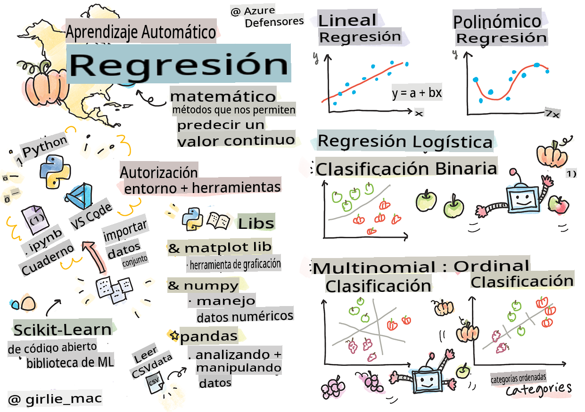
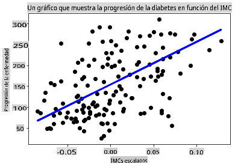

# Comienza con Python y Scikit-learn para modelos de regresión



> Sketchnote por [Tomomi Imura](https://www.twitter.com/girlie_mac)

## [Cuestionario antes de la lección](https://gray-sand-07a10f403.1.azurestaticapps.net/quiz/9/)

> ### [¡Esta lección está disponible en R!](../../../../2-Regression/1-Tools/solution/R/lesson_1.html)

## Introducción

En estas cuatro lecciones, descubrirás cómo construir modelos de regresión. Hablaremos de para qué sirven en breve. ¡Pero antes de hacer nada, asegúrate de tener las herramientas adecuadas para comenzar el proceso!

En esta lección, aprenderás a:

- Configurar tu computadora para tareas locales de aprendizaje automático.
- Trabajar con Jupyter notebooks.
- Usar Scikit-learn, incluida la instalación.
- Explorar la regresión lineal con un ejercicio práctico.

## Instalaciones y configuraciones

[](https://youtu.be/-DfeD2k2Kj0 "ML para principiantes - Configura tus herramientas para construir modelos de Machine Learning")

> 🎥 Haz clic en la imagen de arriba para ver un video corto sobre cómo configurar tu computadora para ML.

1. **Instala Python**. Asegúrate de que [Python](https://www.python.org/downloads/) esté instalado en tu computadora. Usarás Python para muchas tareas de ciencia de datos y aprendizaje automático. La mayoría de los sistemas informáticos ya incluyen una instalación de Python. También hay [Paquetes de Codificación de Python](https://code.visualstudio.com/learn/educators/installers?WT.mc_id=academic-77952-leestott) útiles para facilitar la configuración a algunos usuarios.

   Sin embargo, algunos usos de Python requieren una versión del software, mientras que otros requieren una versión diferente. Por esta razón, es útil trabajar dentro de un [entorno virtual](https://docs.python.org/3/library/venv.html).

2. **Instala Visual Studio Code**. Asegúrate de tener Visual Studio Code instalado en tu computadora. Sigue estas instrucciones para [instalar Visual Studio Code](https://code.visualstudio.com/) para la instalación básica. Vas a usar Python en Visual Studio Code en este curso, por lo que podría ser útil repasar cómo [configurar Visual Studio Code](https://docs.microsoft.com/learn/modules/python-install-vscode?WT.mc_id=academic-77952-leestott) para el desarrollo en Python.

   > Familiarízate con Python trabajando a través de esta colección de [Módulos de aprendizaje](https://docs.microsoft.com/users/jenlooper-2911/collections/mp1pagggd5qrq7?WT.mc_id=academic-77952-leestott)
   >
   > [](https://youtu.be/yyQM70vi7V8 "Configura Python con Visual Studio Code")
   >
   > 🎥 Haz clic en la imagen de arriba para ver un video: usando Python dentro de VS Code.

3. **Instala Scikit-learn**, siguiendo [estas instrucciones](https://scikit-learn.org/stable/install.html). Dado que necesitas asegurarte de usar Python 3, se recomienda que uses un entorno virtual. Nota, si estás instalando esta biblioteca en una Mac M1, hay instrucciones especiales en la página enlazada arriba.

4. **Instala Jupyter Notebook**. Necesitarás [instalar el paquete Jupyter](https://pypi.org/project/jupyter/).

## Tu entorno de autoría de ML

Vas a usar **notebooks** para desarrollar tu código Python y crear modelos de aprendizaje automático. Este tipo de archivo es una herramienta común para los científicos de datos, y pueden ser identificados por su sufijo o extensión `.ipynb`.

Los notebooks son un entorno interactivo que permite al desarrollador tanto codificar como agregar notas y escribir documentación alrededor del código, lo cual es bastante útil para proyectos experimentales o orientados a la investigación.

[](https://youtu.be/7E-jC8FLA2E "ML para principiantes - Configura Jupyter Notebooks para comenzar a construir modelos de regresión")

> 🎥 Haz clic en la imagen de arriba para ver un video corto sobre este ejercicio.

### Ejercicio - trabajar con un notebook

En esta carpeta, encontrarás el archivo _notebook.ipynb_.

1. Abre _notebook.ipynb_ en Visual Studio Code.

   Se iniciará un servidor Jupyter con Python 3+. Encontrarás áreas del notebook que pueden ser `run`, piezas de código. Puedes ejecutar un bloque de código, seleccionando el ícono que parece un botón de reproducción.

2. Selecciona el ícono `md` y agrega un poco de markdown, y el siguiente texto **# Bienvenido a tu notebook**.

   Luego, agrega algo de código Python.

3. Escribe **print('hello notebook')** en el bloque de código.
4. Selecciona la flecha para ejecutar el código.

   Deberías ver la declaración impresa:

    ```output
    hello notebook
    ```


Puedes intercalar tu código con comentarios para auto-documentar el notebook.

✅ Piensa por un minuto cuán diferente es el entorno de trabajo de un desarrollador web en comparación con el de un científico de datos.

## Puesta en marcha con Scikit-learn

Ahora que Python está configurado en tu entorno local, y te sientes cómodo con los Jupyter notebooks, vamos a familiarizarnos con Scikit-learn (se pronuncia `sci` as in `science`). Scikit-learn proporciona una [extensa API](https://scikit-learn.org/stable/modules/classes.html#api-ref) para ayudarte a realizar tareas de ML.

Según su [sitio web](https://scikit-learn.org/stable/getting_started.html), "Scikit-learn es una biblioteca de aprendizaje automático de código abierto que admite el aprendizaje supervisado y no supervisado. También proporciona varias herramientas para el ajuste de modelos, el preprocesamiento de datos, la selección y evaluación de modelos, y muchas otras utilidades."

En este curso, usarás Scikit-learn y otras herramientas para construir modelos de aprendizaje automático para realizar lo que llamamos tareas de 'aprendizaje automático tradicional'. Hemos evitado deliberadamente las redes neuronales y el aprendizaje profundo, ya que están mejor cubiertos en nuestro próximo plan de estudios 'AI for Beginners'.

Scikit-learn hace que sea sencillo construir modelos y evaluarlos para su uso. Se centra principalmente en el uso de datos numéricos y contiene varios conjuntos de datos listos para usar como herramientas de aprendizaje. También incluye modelos pre-construidos para que los estudiantes los prueben. Vamos a explorar el proceso de cargar datos preempaquetados y usar un estimador incorporado para el primer modelo de ML con Scikit-learn con algunos datos básicos.

## Ejercicio - tu primer notebook de Scikit-learn

> Este tutorial fue inspirado por el [ejemplo de regresión lineal](https://scikit-learn.org/stable/auto_examples/linear_model/plot_ols.html#sphx-glr-auto-examples-linear-model-plot-ols-py) en el sitio web de Scikit-learn.

[](https://youtu.be/2xkXL5EUpS0 "ML para principiantes - Tu primer proyecto de regresión lineal en Python")

> 🎥 Haz clic en la imagen de arriba para ver un video corto sobre este ejercicio.

En el archivo _notebook.ipynb_ asociado a esta lección, elimina todas las celdas presionando el ícono de la 'papelera'.

En esta sección, trabajarás con un pequeño conjunto de datos sobre la diabetes que está incorporado en Scikit-learn para fines de aprendizaje. Imagina que quieres probar un tratamiento para pacientes diabéticos. Los modelos de aprendizaje automático podrían ayudarte a determinar qué pacientes responderían mejor al tratamiento, en función de combinaciones de variables. Incluso un modelo de regresión muy básico, cuando se visualiza, podría mostrar información sobre variables que te ayudarían a organizar tus ensayos clínicos teóricos.

✅ Hay muchos tipos de métodos de regresión, y cuál elijas depende de la respuesta que estés buscando. Si deseas predecir la altura probable de una persona de una edad determinada, usarías la regresión lineal, ya que estás buscando un **valor numérico**. Si estás interesado en descubrir si un tipo de cocina debe considerarse vegana o no, estás buscando una **asignación de categoría**, por lo que usarías la regresión logística. Aprenderás más sobre la regresión logística más adelante. Piensa un poco en algunas preguntas que puedes hacer a los datos, y cuál de estos métodos sería más apropiado.

Vamos a empezar con esta tarea.

### Importar bibliotecas

Para esta tarea, importaremos algunas bibliotecas:

- **matplotlib**. Es una herramienta útil para [gráficos](https://matplotlib.org/) y la usaremos para crear un gráfico de líneas.
- **numpy**. [numpy](https://numpy.org/doc/stable/user/whatisnumpy.html) es una biblioteca útil para manejar datos numéricos en Python.
- **sklearn**. Esta es la biblioteca [Scikit-learn](https://scikit-learn.org/stable/user_guide.html).

Importa algunas bibliotecas para ayudarte con tus tareas.

1. Agrega las importaciones escribiendo el siguiente código:

   ```python
   import matplotlib.pyplot as plt
   import numpy as np
   from sklearn import datasets, linear_model, model_selection
   ```

   Arriba estás importando `matplotlib`, `numpy` and you are importing `datasets`, `linear_model` and `model_selection` from `sklearn`. `model_selection` is used for splitting data into training and test sets.

### The diabetes dataset

The built-in [diabetes dataset](https://scikit-learn.org/stable/datasets/toy_dataset.html#diabetes-dataset) includes 442 samples of data around diabetes, with 10 feature variables, some of which include:

- age: age in years
- bmi: body mass index
- bp: average blood pressure
- s1 tc: T-Cells (a type of white blood cells)

✅ This dataset includes the concept of 'sex' as a feature variable important to research around diabetes. Many medical datasets include this type of binary classification. Think a bit about how categorizations such as this might exclude certain parts of a population from treatments.

Now, load up the X and y data.

> 🎓 Remember, this is supervised learning, and we need a named 'y' target.

In a new code cell, load the diabetes dataset by calling `load_diabetes()`. The input `return_X_y=True` signals that `X` will be a data matrix, and `y` será el objetivo de la regresión.

2. Agrega algunos comandos print para mostrar la forma de la matriz de datos y su primer elemento:

    ```python
    X, y = datasets.load_diabetes(return_X_y=True)
    print(X.shape)
    print(X[0])
    ```

    Lo que estás obteniendo como respuesta es una tupla. Lo que estás haciendo es asignar los dos primeros valores de la tupla a `X` and `y` respectivamente. Aprende más [sobre tuplas](https://wikipedia.org/wiki/Tuple).

    Puedes ver que estos datos tienen 442 elementos organizados en matrices de 10 elementos:

    ```text
    (442, 10)
    [ 0.03807591  0.05068012  0.06169621  0.02187235 -0.0442235  -0.03482076
    -0.04340085 -0.00259226  0.01990842 -0.01764613]
    ```

    ✅ Piensa un poco sobre la relación entre los datos y el objetivo de la regresión. La regresión lineal predice relaciones entre la característica X y la variable objetivo y. ¿Puedes encontrar el [objetivo](https://scikit-learn.org/stable/datasets/toy_dataset.html#diabetes-dataset) para el conjunto de datos de diabetes en la documentación? ¿Qué está demostrando este conjunto de datos, dado ese objetivo?

3. A continuación, selecciona una parte de este conjunto de datos para graficar seleccionando la tercera columna del conjunto de datos. Puedes hacer esto usando el `:` operator to select all rows, and then selecting the 3rd column using the index (2). You can also reshape the data to be a 2D array - as required for plotting - by using `reshape(n_rows, n_columns)`. Si uno de los parámetros es -1, la dimensión correspondiente se calcula automáticamente.

   ```python
   X = X[:, 2]
   X = X.reshape((-1,1))
   ```

   ✅ En cualquier momento, imprime los datos para verificar su forma.

4. Ahora que tienes los datos listos para ser graficados, puedes ver si una máquina puede ayudar a determinar una división lógica entre los números en este conjunto de datos. Para hacer esto, necesitas dividir tanto los datos (X) como el objetivo (y) en conjuntos de prueba y entrenamiento. Scikit-learn tiene una manera sencilla de hacer esto; puedes dividir tus datos de prueba en un punto dado.

   ```python
   X_train, X_test, y_train, y_test = model_selection.train_test_split(X, y, test_size=0.33)
   ```

5. ¡Ahora estás listo para entrenar tu modelo! Carga el modelo de regresión lineal y entrénalo con tus conjuntos de entrenamiento X e y usando `model.fit()`:

    ```python
    model = linear_model.LinearRegression()
    model.fit(X_train, y_train)
    ```

    ✅ `model.fit()` is a function you'll see in many ML libraries such as TensorFlow

5. Then, create a prediction using test data, using the function `predict()`. Esto se usará para dibujar la línea entre los grupos de datos del modelo.

    ```python
    y_pred = model.predict(X_test)
    ```

6. Ahora es el momento de mostrar los datos en un gráfico. Matplotlib es una herramienta muy útil para esta tarea. Crea un diagrama de dispersión de todos los datos de prueba X e y, y usa la predicción para dibujar una línea en el lugar más apropiado, entre los agrupamientos de datos del modelo.

    ```python
    plt.scatter(X_test, y_test,  color='black')
    plt.plot(X_test, y_pred, color='blue', linewidth=3)
    plt.xlabel('Scaled BMIs')
    plt.ylabel('Disease Progression')
    plt.title('A Graph Plot Showing Diabetes Progression Against BMI')
    plt.show()
    ```

   

   ✅ Piensa un poco en lo que está pasando aquí. Una línea recta atraviesa muchos pequeños puntos de datos, pero ¿qué está haciendo exactamente? ¿Puedes ver cómo deberías poder usar esta línea para predecir dónde debería encajar un nuevo punto de datos no visto en relación con el eje y del gráfico? Intenta poner en palabras el uso práctico de este modelo.

¡Felicidades, construiste tu primer modelo de regresión lineal, creaste una predicción con él y la mostraste en un gráfico!

---
## 🚀Desafío

Grafica una variable diferente de este conjunto de datos. Pista: edita esta línea: `X = X[:,2]`. Dado el objetivo de este conjunto de datos, ¿qué puedes descubrir sobre la progresión de la diabetes como enfermedad?
## [Cuestionario después de la lección](https://gray-sand-07a10f403.1.azurestaticapps.net/quiz/10/)

## Revisión y autoestudio

En este tutorial, trabajaste con regresión lineal simple, en lugar de regresión univariada o múltiple. Lee un poco sobre las diferencias entre estos métodos, o echa un vistazo a [este video](https://www.coursera.org/lecture/quantifying-relationships-regression-models/linear-vs-nonlinear-categorical-variables-ai2Ef).

Lee más sobre el concepto de regresión y piensa en qué tipo de preguntas pueden ser respondidas por esta técnica. Toma este [tutorial](https://docs.microsoft.com/learn/modules/train-evaluate-regression-models?WT.mc_id=academic-77952-leestott) para profundizar tu comprensión.

## Tarea

[Un conjunto de datos diferente](assignment.md)

        **Descargo de responsabilidad**: 
        Este documento ha sido traducido utilizando servicios de traducción automatizada por IA. Aunque nos esforzamos por lograr precisión, tenga en cuenta que las traducciones automatizadas pueden contener errores o imprecisiones. El documento original en su idioma nativo debe considerarse la fuente autorizada. Para información crítica, se recomienda una traducción profesional humana. No nos hacemos responsables de ningún malentendido o interpretación errónea que surja del uso de esta traducción.