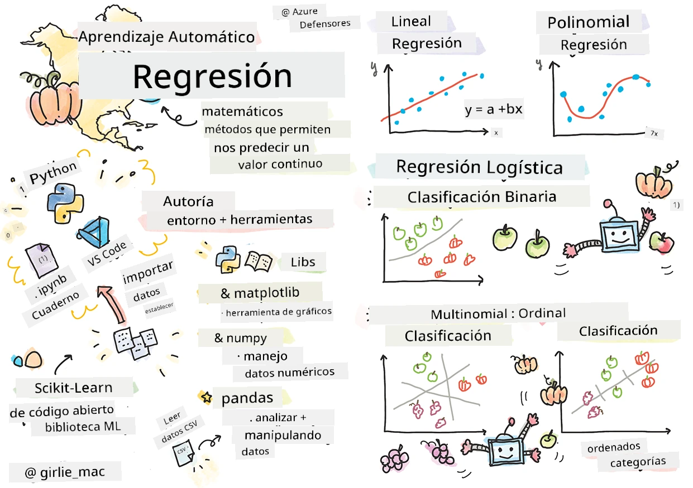
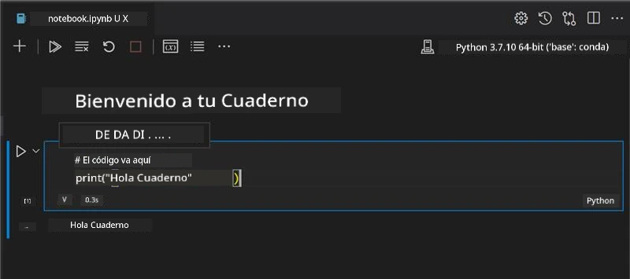
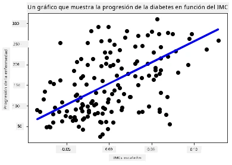

# Comienza con Python y Scikit-learn para modelos de regresión



> Sketchnote de [Tomomi Imura](https://www.twitter.com/girlie_mac)

## [Cuestionario previo a la clase](https://ff-quizzes.netlify.app/en/ml/)

> ### [¡Esta lección está disponible en R!](../../../../2-Regression/1-Tools/solution/R/lesson_1.html)

## Introducción

En estas cuatro lecciones, descubrirás cómo construir modelos de regresión. Hablaremos de para qué sirven en breve. Pero antes de hacer cualquier cosa, asegúrate de tener las herramientas correctas para comenzar el proceso.

En esta lección, aprenderás a:

- Configurar tu computadora para tareas locales de aprendizaje automático.
- Trabajar con Jupyter Notebooks.
- Usar Scikit-learn, incluida la instalación.
- Explorar la regresión lineal con un ejercicio práctico.

## Instalaciones y configuraciones

[](https://youtu.be/-DfeD2k2Kj0 "ML para principiantes - Prepara tus herramientas listas para construir modelos de Machine Learning")

> 🎥 Haz clic en la imagen de arriba para un video corto mostrando cómo configurar tu computadora para ML.

1. **Instala Python**. Asegúrate de que [Python](https://www.python.org/downloads/) esté instalado en tu computadora. Usarás Python para muchas tareas de ciencia de datos y aprendizaje automático. La mayoría de los sistemas ya incluyen una instalación de Python. También hay útiles [Paquetes de Codificación Python](https://code.visualstudio.com/learn/educators/installers?WT.mc_id=academic-77952-leestott) disponibles para facilitar la configuración a algunos usuarios.

   Sin embargo, algunos usos de Python requieren una versión del software, mientras que otros requieren una diferente. Por esto, es útil trabajar dentro de un [entorno virtual](https://docs.python.org/3/library/venv.html).

2. **Instala Visual Studio Code**. Asegúrate de tener instalado Visual Studio Code en tu computadora. Sigue estas instrucciones para [instalar Visual Studio Code](https://code.visualstudio.com/) para la instalación básica. Vas a usar Python en Visual Studio Code en este curso, por lo que quizás quieras repasar cómo [configurar Visual Studio Code](https://docs.microsoft.com/learn/modules/python-install-vscode?WT.mc_id=academic-77952-leestott) para desarrollo en Python.

   > Familiarízate con Python trabajando estos [módulos de aprendizaje](https://docs.microsoft.com/users/jenlooper-2911/collections/mp1pagggd5qrq7?WT.mc_id=academic-77952-leestott)
   >
   > [](https://youtu.be/yyQM70vi7V8 "Configura Python con Visual Studio Code")
   >
   > 🎥 Haz clic en la imagen de arriba para un video: usando Python dentro de VS Code.

3. **Instala Scikit-learn**, siguiendo [estas instrucciones](https://scikit-learn.org/stable/install.html). Como necesitas asegurarte de usar Python 3, se recomienda usar un entorno virtual. Nota que si instalas esta biblioteca en un Mac M1, hay instrucciones especiales en la página enlazada arriba.

1. **Instala Jupyter Notebook**. Necesitarás [instalar el paquete Jupyter](https://pypi.org/project/jupyter/).

## Tu entorno de autoría ML

Usarás **notebooks** para desarrollar tu código Python y crear modelos de aprendizaje automático. Este tipo de archivo es una herramienta común para científicos de datos, y se identifica por su sufijo o extensión `.ipynb`.

Los notebooks son un entorno interactivo que permite al desarrollador tanto codificar como añadir notas y escribir documentación alrededor del código, lo que es muy útil para proyectos experimentales o de investigación.

[](https://youtu.be/7E-jC8FLA2E "ML para principiantes - Configura Jupyter Notebooks para comenzar a construir modelos de regresión")

> 🎥 Haz clic en la imagen de arriba para un video corto realizando este ejercicio.

### Ejercicio - trabaja con un notebook

En esta carpeta, encontrarás el archivo _notebook.ipynb_.

1. Abre _notebook.ipynb_ en Visual Studio Code.

   Se iniciará un servidor Jupyter con Python 3+ activo. Encontrarás áreas del notebook que pueden `ejecutarse`, fragmentos de código. Puedes ejecutar un bloque de código seleccionando el icono que parece un botón de reproducir.

1. Selecciona el icono `md` y añade un poco de markdown, y el siguiente texto **# Bienvenido a tu notebook**.

   Luego, añade un poco de código Python.

1. Escribe **print('hola notebook')** en el bloque de código.
1. Selecciona la flecha para ejecutar el código.

   Deberías ver la instrucción impresa:

    ```output
    hello notebook
    ```



Puedes intercalar tu código con comentarios para auto-documentar el notebook.

✅ Piensa por un minuto cuán diferente es el entorno de trabajo de un desarrollador web en comparación con el de un científico de datos.

## En marcha con Scikit-learn

Ahora que Python está configurado en tu entorno local y estás cómodo con Jupyter Notebooks, vamos a familiarizarnos también con Scikit-learn (pronúncialo `sci` como en `science`). Scikit-learn proporciona una [API extensa](https://scikit-learn.org/stable/modules/classes.html#api-ref) para ayudarte a realizar tareas de ML.

Según su [sitio web](https://scikit-learn.org/stable/getting_started.html), "Scikit-learn es una biblioteca de aprendizaje automático de código abierto que soporta aprendizaje supervisado y no supervisado. También provee varias herramientas para ajuste de modelos, preprocesamiento de datos, selección y evaluación de modelos, y muchas otras utilidades."

En este curso usarás Scikit-learn y otras herramientas para construir modelos de aprendizaje automático para realizar lo que llamamos tareas tradicionales de aprendizaje automático. Hemos evitado intencionadamente redes neuronales y aprendizaje profundo, ya que se cubren mejor en nuestro próximo plan curricular 'IA para principiantes'.

Scikit-learn facilita construir modelos y evaluarlos para uso. Se centra principalmente en datos numéricos y contiene varios conjuntos de datos listos para usar como herramientas de aprendizaje. También incluye modelos preconstruidos para que los estudiantes prueben. Exploremos primero el proceso de cargar datos preempaquetados y usar un estimador incorporado para el primer modelo ML con Scikit-learn con datos básicos.

## Ejercicio - tu primer notebook con Scikit-learn

> Este tutorial fue inspirado por el [ejemplo de regresión lineal](https://scikit-learn.org/stable/auto_examples/linear_model/plot_ols.html#sphx-glr-auto-examples-linear-model-plot-ols-py) en el sitio web de Scikit-learn.


[](https://youtu.be/2xkXL5EUpS0 "ML para principiantes - Tu Primer Proyecto de Regresión Lineal en Python")

> 🎥 Haz clic en la imagen de arriba para un video corto realizando este ejercicio.

En el archivo _notebook.ipynb_ asociado a esta lección, limpia todas las celdas presionando el icono de 'papelera'.

En esta sección, trabajarás con un pequeño conjunto de datos sobre diabetes que está incorporado en Scikit-learn para fines de aprendizaje. Imagina que quieres probar un tratamiento para pacientes diabéticos. Los modelos de aprendizaje automático pueden ayudarte a determinar qué pacientes responderían mejor al tratamiento, basándose en combinaciones de variables. Incluso un modelo básico de regresión, cuando se visualiza, puede mostrar información sobre variables que te ayudarían a organizar tus ensayos clínicos teóricos.

✅ Hay muchos tipos de métodos de regresión y cuál eliges depende de la respuesta que buscas. Si quieres predecir la altura probable para una persona de cierta edad, usarías regresión lineal, ya que buscas un **valor numérico**. Si te interesa descubrir si un tipo de cocina debe considerarse vegana o no, buscas una **asignación de categoría**, por lo que usarías regresión logística. Aprenderás más sobre regresión logística más adelante. Piensa un poco en algunas preguntas que puedes hacer sobre datos y cuál de estos métodos sería más apropiado.

Vamos a comenzar con esta tarea.

### Importar bibliotecas

Para esta tarea importaremos algunas bibliotecas:

- **matplotlib**. Es una [herramienta de gráficos](https://matplotlib.org/) útil que usaremos para crear un gráfico de líneas.
- **numpy**. [numpy](https://numpy.org/doc/stable/user/whatisnumpy.html) es una biblioteca útil para manejar datos numéricos en Python.
- **sklearn**. Esta es la biblioteca [Scikit-learn](https://scikit-learn.org/stable/user_guide.html).

Importa algunas bibliotecas para ayudarte con tus tareas.

1. Añade las importaciones escribiendo el siguiente código:

   ```python
   import matplotlib.pyplot as plt
   import numpy as np
   from sklearn import datasets, linear_model, model_selection
   ```

   Más arriba estás importando `matplotlib`, `numpy` y estás importando `datasets`, `linear_model` y `model_selection` de `sklearn`. `model_selection` se usa para dividir los datos en conjuntos de entrenamiento y prueba.

### El conjunto de datos de diabetes

El [conjunto de datos diabetes](https://scikit-learn.org/stable/datasets/toy_dataset.html#diabetes-dataset) incorporado incluye 442 muestras de datos sobre diabetes, con 10 variables características, algunas de las cuales incluyen:

- edad: edad en años
- imc: índice de masa corporal
- presión arterial: presión arterial promedio
- s1 tc: Células T (un tipo de glóbulos blancos)

✅ Este conjunto de datos incluye el concepto de 'sexo' como variable característica importante para la investigación sobre diabetes. Muchos conjuntos de datos médicos incluyen este tipo de clasificación binaria. Piensa un poco en cómo categorizaciones así podrían excluir a ciertas partes de una población de tratamientos.

Ahora, carga los datos X y y.

> 🎓 Recuerda, este es aprendizaje supervisado, y necesitamos un objetivo llamado 'y'.

En una nueva celda de código, carga el conjunto de datos diabetes llamando a `load_diabetes()`. El parámetro `return_X_y=True` señala que `X` será una matriz de datos, y `y` será el objetivo de regresión.

1. Añade algunos comandos print para mostrar la forma de la matriz de datos y su primer elemento:

    ```python
    X, y = datasets.load_diabetes(return_X_y=True)
    print(X.shape)
    print(X[0])
    ```

    Lo que recibes como respuesta es una tupla. Lo que haces es asignar los dos primeros valores de la tupla a `X` y `y` respectivamente. Aprende más [sobre tuplas](https://wikipedia.org/wiki/Tuple).

    Puedes ver que estos datos tienen 442 ítems con forma de arrays de 10 elementos:

    ```text
    (442, 10)
    [ 0.03807591  0.05068012  0.06169621  0.02187235 -0.0442235  -0.03482076
    -0.04340085 -0.00259226  0.01990842 -0.01764613]
    ```

    ✅ Piensa un poco sobre la relación entre los datos y el objetivo de regresión. La regresión lineal predice relaciones entre la característica X y la variable objetivo y. ¿Puedes encontrar el [objetivo](https://scikit-learn.org/stable/datasets/toy_dataset.html#diabetes-dataset) para el conjunto de datos de diabetes en la documentación? ¿Qué está demostrando este conjunto de datos dado ese objetivo?

2. Luego, selecciona una parte de este conjunto de datos para graficar seleccionando la tercera columna del conjunto. Puedes hacerlo usando el operador `:` para seleccionar todas las filas, y luego seleccionando la tercera columna usando el índice (2). También puedes remodelar los datos para que sean un array 2D — como se requiere para la gráfica — usando `reshape(n_filas, n_columnas)`. Si uno de los parámetros es -1, la dimensión correspondiente se calcula automáticamente.

   ```python
   X = X[:, 2]
   X = X.reshape((-1,1))
   ```

   ✅ En cualquier momento, imprime los datos para verificar su forma.

3. Ahora que tienes datos listos para graficar, puedes ver si una máquina puede ayudar a determinar una división lógica entre los números en este conjunto de datos. Para ello, necesitas dividir tanto los datos (X) como el objetivo (y) en conjuntos de prueba y entrenamiento. Scikit-learn tiene una forma sencilla de hacerlo; puedes dividir tus datos de prueba en un punto dado.

   ```python
   X_train, X_test, y_train, y_test = model_selection.train_test_split(X, y, test_size=0.33)
   ```

4. ¡Ahora estás listo para entrenar tu modelo! Carga el modelo de regresión lineal y entrénalo con tus conjuntos de entrenamiento X y y usando `model.fit()`:

    ```python
    model = linear_model.LinearRegression()
    model.fit(X_train, y_train)
    ```

    ✅ `model.fit()` es una función que verás en muchas bibliotecas de ML como TensorFlow

5. Luego, crea una predicción usando los datos de prueba, usando la función `predict()`. Esto se usará para trazar la línea entre los grupos de datos.

    ```python
    y_pred = model.predict(X_test)
    ```

6. Ahora es momento de mostrar los datos en una gráfica. Matplotlib es una herramienta muy útil para esta tarea. Crea un diagrama de dispersión de todos los datos de prueba X e y, y usa la predicción para dibujar una línea en el lugar más apropiado, entre los grupos de datos del modelo.

    ```python
    plt.scatter(X_test, y_test,  color='black')
    plt.plot(X_test, y_pred, color='blue', linewidth=3)
    plt.xlabel('Scaled BMIs')
    plt.ylabel('Disease Progression')
    plt.title('A Graph Plot Showing Diabetes Progression Against BMI')
    plt.show()
    ```

   


   ✅ Piensa un poco sobre lo que está pasando aquí. Una línea recta atraviesa muchos pequeños puntos de datos, pero ¿qué está haciendo exactamente? ¿Puedes ver cómo deberías poder usar esta línea para predecir dónde debería encajar un nuevo punto de datos no visto en relación con el eje y del gráfico? Trata de poner en palabras el uso práctico de este modelo.

¡Felicidades, construiste tu primer modelo de regresión lineal, creaste una predicción con él y la mostraste en un gráfico!

---
## 🚀Desafío

Grafica una variable diferente de este conjunto de datos. Pista: edita esta línea: `X = X[:,2]`. Dado el objetivo de este conjunto de datos, ¿qué puedes descubrir sobre la progresión de la diabetes como enfermedad?
## [Cuestionario posterior a la conferencia](https://ff-quizzes.netlify.app/en/ml/)

## Revisión y Autoestudio

En este tutorial, trabajaste con regresión lineal simple, en lugar de regresión lineal univariante o múltiple. Lee un poco sobre las diferencias entre estos métodos, o mira [este video](https://www.coursera.org/lecture/quantifying-relationships-regression-models/linear-vs-nonlinear-categorical-variables-ai2Ef)

Lee más sobre el concepto de regresión y piensa en qué tipos de preguntas pueden responderse con esta técnica. Toma este [tutorial](https://docs.microsoft.com/learn/modules/train-evaluate-regression-models?WT.mc_id=academic-77952-leestott) para profundizar tu comprensión.

## Tarea

[Un conjunto de datos diferente](assignment.md)

---

<!-- CO-OP TRANSLATOR DISCLAIMER START -->
**Descargo de responsabilidad**:
Este documento ha sido traducido utilizando el servicio de traducción automática [Co-op Translator](https://github.com/Azure/co-op-translator). Aunque nos esforzamos por la precisión, tenga en cuenta que las traducciones automatizadas pueden contener errores o inexactitudes. El documento original en su idioma nativo debe considerarse la fuente autorizada. Para información crítica, se recomienda una traducción profesional humana. No somos responsables de cualquier malentendido o interpretación errónea que surja del uso de esta traducción.
<!-- CO-OP TRANSLATOR DISCLAIMER END -->