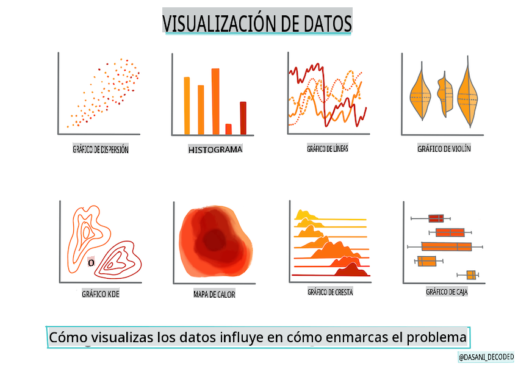
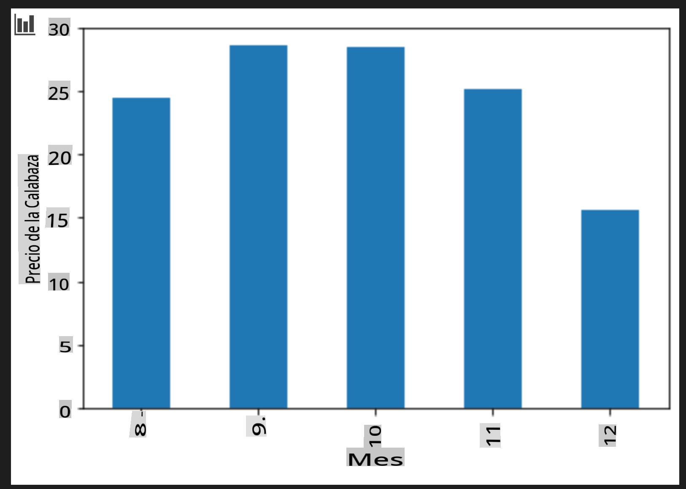

# Construir un modelo de regresión usando Scikit-learn: preparar y visualizar datos



Infografía por [Dasani Madipalli](https://twitter.com/dasani_decoded)

## [Cuestionario previo a la lección](https://gray-sand-07a10f403.1.azurestaticapps.net/quiz/11/)

> ### [¡Esta lección está disponible en R!](../../../../2-Regression/2-Data/solution/R/lesson_2.html)

## Introducción

Ahora que tienes las herramientas necesarias para comenzar a construir modelos de aprendizaje automático con Scikit-learn, estás listo para empezar a hacer preguntas a tus datos. A medida que trabajas con datos y aplicas soluciones de ML, es muy importante entender cómo hacer la pregunta correcta para desbloquear adecuadamente el potencial de tu conjunto de datos.

En esta lección, aprenderás:

- Cómo preparar tus datos para la construcción de modelos.
- Cómo usar Matplotlib para la visualización de datos.

## Hacer la pregunta correcta a tus datos

La pregunta que necesitas responder determinará qué tipo de algoritmos de ML utilizarás. Y la calidad de la respuesta que obtengas dependerá en gran medida de la naturaleza de tus datos.

Echa un vistazo a los [datos](https://github.com/microsoft/ML-For-Beginners/blob/main/2-Regression/data/US-pumpkins.csv) proporcionados para esta lección. Puedes abrir este archivo .csv en VS Code. Una rápida ojeada muestra inmediatamente que hay espacios en blanco y una mezcla de cadenas y datos numéricos. También hay una columna extraña llamada 'Package' donde los datos son una mezcla entre 'sacks', 'bins' y otros valores. Los datos, de hecho, son un poco desordenados.

[](https://youtu.be/5qGjczWTrDQ "ML para principiantes - Cómo analizar y limpiar un conjunto de datos")

> 🎥 Haz clic en la imagen de arriba para ver un breve video sobre cómo preparar los datos para esta lección.

De hecho, no es muy común recibir un conjunto de datos completamente listo para usar y crear un modelo de ML de inmediato. En esta lección, aprenderás cómo preparar un conjunto de datos crudo utilizando bibliotecas estándar de Python. También aprenderás varias técnicas para visualizar los datos.

## Estudio de caso: 'el mercado de calabazas'

En esta carpeta encontrarás un archivo .csv en la carpeta raíz `data` llamado [US-pumpkins.csv](https://github.com/microsoft/ML-For-Beginners/blob/main/2-Regression/data/US-pumpkins.csv) que incluye 1757 líneas de datos sobre el mercado de calabazas, ordenados en grupos por ciudad. Estos son datos crudos extraídos de los [Informes Estándar de Mercados Terminales de Cultivos Especiales](https://www.marketnews.usda.gov/mnp/fv-report-config-step1?type=termPrice) distribuidos por el Departamento de Agricultura de los Estados Unidos.

### Preparando los datos

Estos datos están en el dominio público. Se pueden descargar en muchos archivos separados, por ciudad, desde el sitio web del USDA. Para evitar demasiados archivos separados, hemos concatenado todos los datos de las ciudades en una sola hoja de cálculo, por lo tanto, ya hemos _preparado_ un poco los datos. A continuación, echemos un vistazo más de cerca a los datos.

### Los datos de calabazas - primeras conclusiones

¿Qué notas sobre estos datos? Ya viste que hay una mezcla de cadenas, números, espacios en blanco y valores extraños que necesitas interpretar.

¿Qué pregunta puedes hacer a estos datos, utilizando una técnica de regresión? ¿Qué tal "Predecir el precio de una calabaza en venta durante un mes determinado"? Mirando nuevamente los datos, hay algunos cambios que necesitas hacer para crear la estructura de datos necesaria para la tarea.
## Ejercicio - analizar los datos de calabazas

Vamos a usar [Pandas](https://pandas.pydata.org/), (el nombre significa `Python Data Analysis`) una herramienta muy útil para dar forma a los datos, para analizar y preparar estos datos de calabazas.

### Primero, verifica si hay fechas faltantes

Primero necesitarás tomar medidas para verificar si hay fechas faltantes:

1. Convierte las fechas a un formato de mes (estas son fechas de EE.UU., por lo que el formato es `MM/DD/YYYY`).
2. Extrae el mes a una nueva columna.

Abre el archivo _notebook.ipynb_ en Visual Studio Code e importa la hoja de cálculo en un nuevo dataframe de Pandas.

1. Usa la función `head()` para ver las primeras cinco filas.

    ```python
    import pandas as pd
    pumpkins = pd.read_csv('../data/US-pumpkins.csv')
    pumpkins.head()
    ```

    ✅ ¿Qué función usarías para ver las últimas cinco filas?

1. Verifica si hay datos faltantes en el dataframe actual:

    ```python
    pumpkins.isnull().sum()
    ```

    Hay datos faltantes, pero tal vez no importen para la tarea en cuestión.

1. Para hacer que tu dataframe sea más fácil de trabajar, selecciona solo las columnas que necesitas, usando `loc` function which extracts from the original dataframe a group of rows (passed as first parameter) and columns (passed as second parameter). The expression `:` en el caso a continuación significa "todas las filas".

    ```python
    columns_to_select = ['Package', 'Low Price', 'High Price', 'Date']
    pumpkins = pumpkins.loc[:, columns_to_select]
    ```

### Segundo, determina el precio promedio de la calabaza

Piensa en cómo determinar el precio promedio de una calabaza en un mes dado. ¿Qué columnas elegirías para esta tarea? Pista: necesitarás 3 columnas.

Solución: toma el promedio de las columnas `Low Price` and `High Price` para llenar la nueva columna Price, y convierte la columna Date para mostrar solo el mes. Afortunadamente, según la verificación anterior, no hay datos faltantes para fechas o precios.

1. Para calcular el promedio, agrega el siguiente código:

    ```python
    price = (pumpkins['Low Price'] + pumpkins['High Price']) / 2

    month = pd.DatetimeIndex(pumpkins['Date']).month

    ```

   ✅ Siéntete libre de imprimir cualquier dato que desees verificar usando `print(month)`.

2. Ahora, copia tus datos convertidos en un nuevo dataframe de Pandas:

    ```python
    new_pumpkins = pd.DataFrame({'Month': month, 'Package': pumpkins['Package'], 'Low Price': pumpkins['Low Price'],'High Price': pumpkins['High Price'], 'Price': price})
    ```

    Imprimir tu dataframe mostrará un conjunto de datos limpio y ordenado sobre el cual puedes construir tu nuevo modelo de regresión.

### Pero espera, hay algo extraño aquí

Si miras la columna `Package` column, pumpkins are sold in many different configurations. Some are sold in '1 1/9 bushel' measures, and some in '1/2 bushel' measures, some per pumpkin, some per pound, and some in big boxes with varying widths.

> Pumpkins seem very hard to weigh consistently

Digging into the original data, it's interesting that anything with `Unit of Sale` equalling 'EACH' or 'PER BIN' also have the `Package` type per inch, per bin, or 'each'. Pumpkins seem to be very hard to weigh consistently, so let's filter them by selecting only pumpkins with the string 'bushel' in their `Package`.

1. Agrega un filtro en la parte superior del archivo, debajo de la importación inicial del .csv:

    ```python
    pumpkins = pumpkins[pumpkins['Package'].str.contains('bushel', case=True, regex=True)]
    ```

    Si imprimes los datos ahora, puedes ver que solo estás obteniendo alrededor de 415 filas de datos que contienen calabazas por bushel.

### Pero espera, hay una cosa más por hacer

¿Notaste que la cantidad de bushels varía por fila? Necesitas normalizar los precios para que muestres el precio por bushel, así que haz algunos cálculos para estandarizarlo.

1. Agrega estas líneas después del bloque que crea el dataframe new_pumpkins:

    ```python
    new_pumpkins.loc[new_pumpkins['Package'].str.contains('1 1/9'), 'Price'] = price/(1 + 1/9)

    new_pumpkins.loc[new_pumpkins['Package'].str.contains('1/2'), 'Price'] = price/(1/2)
    ```

✅ Según [The Spruce Eats](https://www.thespruceeats.com/how-much-is-a-bushel-1389308), el peso de un bushel depende del tipo de producto, ya que es una medida de volumen. "Un bushel de tomates, por ejemplo, debe pesar 56 libras... Las hojas y verduras ocupan más espacio con menos peso, por lo que un bushel de espinacas pesa solo 20 libras." ¡Es todo bastante complicado! No nos molestemos en hacer una conversión de bushel a libra, y en su lugar, fijemos el precio por bushel. ¡Todo este estudio de bushels de calabazas, sin embargo, muestra lo importante que es entender la naturaleza de tus datos!

Ahora, puedes analizar los precios por unidad basándote en su medida de bushel. Si imprimes los datos una vez más, puedes ver cómo está estandarizado.

✅ ¿Notaste que las calabazas vendidas por medio bushel son muy caras? ¿Puedes averiguar por qué? Pista: las calabazas pequeñas son mucho más caras que las grandes, probablemente porque hay muchas más por bushel, dado el espacio no utilizado que ocupa una gran calabaza hueca para pastel.

## Estrategias de Visualización

Parte del rol del científico de datos es demostrar la calidad y naturaleza de los datos con los que están trabajando. Para hacer esto, a menudo crean visualizaciones interesantes, o gráficos, diagramas y tablas, que muestran diferentes aspectos de los datos. De esta manera, pueden mostrar visualmente relaciones y brechas que de otra manera serían difíciles de descubrir.

[](https://youtu.be/SbUkxH6IJo0 "ML para principiantes - Cómo visualizar datos con Matplotlib")

> 🎥 Haz clic en la imagen de arriba para ver un breve video sobre cómo visualizar los datos para esta lección.

Las visualizaciones también pueden ayudar a determinar la técnica de aprendizaje automático más adecuada para los datos. Un diagrama de dispersión que parece seguir una línea, por ejemplo, indica que los datos son un buen candidato para un ejercicio de regresión lineal.

Una biblioteca de visualización de datos que funciona bien en cuadernos de Jupyter es [Matplotlib](https://matplotlib.org/) (que también viste en la lección anterior).

> Obtén más experiencia con la visualización de datos en [estos tutoriales](https://docs.microsoft.com/learn/modules/explore-analyze-data-with-python?WT.mc_id=academic-77952-leestott).

## Ejercicio - experimenta con Matplotlib

Intenta crear algunos gráficos básicos para mostrar el nuevo dataframe que acabas de crear. ¿Qué mostraría un gráfico de líneas básico?

1. Importa Matplotlib en la parte superior del archivo, debajo de la importación de Pandas:

    ```python
    import matplotlib.pyplot as plt
    ```

1. Vuelve a ejecutar todo el cuaderno para actualizar.
1. Al final del cuaderno, agrega una celda para graficar los datos como un cuadro:

    ```python
    price = new_pumpkins.Price
    month = new_pumpkins.Month
    plt.scatter(price, month)
    plt.show()
    ```

    

    ¿Es este un gráfico útil? ¿Hay algo que te sorprenda?

    No es particularmente útil, ya que solo muestra tus datos como una dispersión de puntos en un mes dado.

### Hazlo útil

Para que los gráficos muestren datos útiles, generalmente necesitas agrupar los datos de alguna manera. Intentemos crear un gráfico donde el eje y muestre los meses y los datos demuestren la distribución de los datos.

1. Agrega una celda para crear un gráfico de barras agrupado:

    ```python
    new_pumpkins.groupby(['Month'])['Price'].mean().plot(kind='bar')
    plt.ylabel("Pumpkin Price")
    ```

    

    ¡Esta es una visualización de datos más útil! Parece indicar que el precio más alto para las calabazas ocurre en septiembre y octubre. ¿Cumple eso con tus expectativas? ¿Por qué o por qué no?

---

## 🚀Desafío

Explora los diferentes tipos de visualización que ofrece Matplotlib. ¿Cuáles son los más apropiados para problemas de regresión?

## [Cuestionario posterior a la lección](https://gray-sand-07a10f403.1.azurestaticapps.net/quiz/12/)

## Revisión y Autoestudio

Echa un vistazo a las muchas formas de visualizar datos. Haz una lista de las diversas bibliotecas disponibles y nota cuáles son las mejores para ciertos tipos de tareas, por ejemplo, visualizaciones 2D vs. visualizaciones 3D. ¿Qué descubres?

## Tarea

[Explorando la visualización](assignment.md)

**Descargo de responsabilidad**:
Este documento ha sido traducido utilizando servicios de traducción automática basados en inteligencia artificial. Aunque nos esforzamos por lograr precisión, tenga en cuenta que las traducciones automáticas pueden contener errores o imprecisiones. El documento original en su idioma nativo debe considerarse la fuente autorizada. Para información crítica, se recomienda la traducción humana profesional. No nos hacemos responsables de ningún malentendido o interpretación errónea que surja del uso de esta traducción.