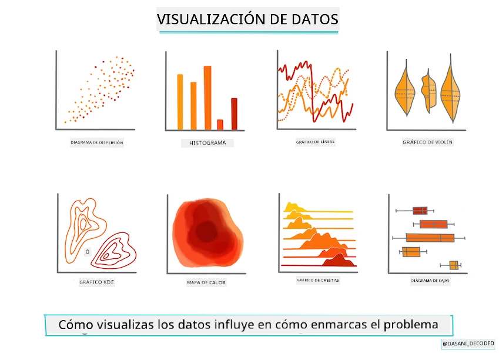
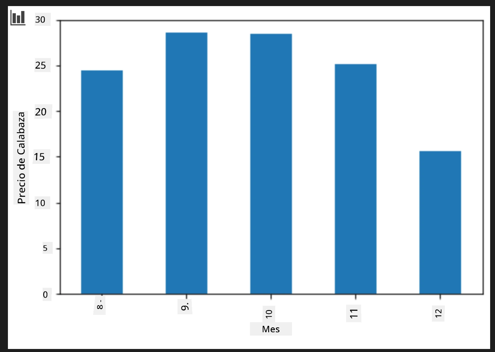
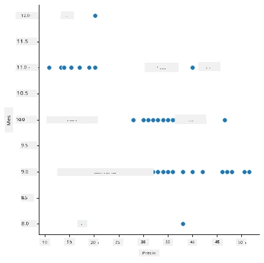
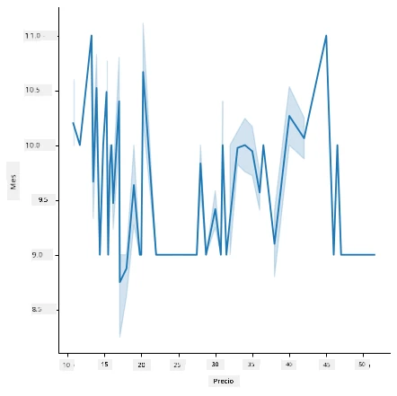
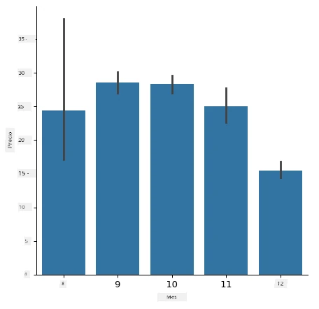
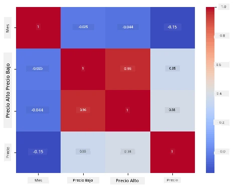

# Construye un modelo de regresión usando Scikit-learn: prepara y visualiza datos



Infografía por [Dasani Madipalli](https://twitter.com/dasani_decoded)

## [Cuestionario antes de la lección](https://ff-quizzes.netlify.app/en/ml/)

> ### [¡Esta lección está disponible en R!](../../../../2-Regression/2-Data/solution/R/lesson_2.html)

## Introducción

Ahora que tienes configuradas las herramientas que necesitas para comenzar a abordar la construcción de modelos de aprendizaje automático con Scikit-learn, estás listo para empezar a hacer preguntas a tus datos. Al trabajar con datos y aplicar soluciones de ML, es muy importante entender cómo hacer la pregunta correcta para desbloquear adecuadamente el potencial de tu conjunto de datos.

En esta lección, aprenderás:

- Cómo preparar tus datos para construir modelos.
- Cómo usar Matplotlib para la visualización de datos.
- Cómo usar Seaborn para una visualización de datos más expresiva.

## Hacer la pregunta correcta a tus datos

La pregunta que necesitas responder determinará qué tipo de algoritmos de ML utilizarás. Y la calidad de la respuesta que recibas dependerá en gran medida de la naturaleza de tus datos.

Observa el [conjunto de datos](https://github.com/microsoft/ML-For-Beginners/blob/main/2-Regression/data/US-pumpkins.csv) proporcionado para esta lección. Puedes abrir este archivo .csv en VS Code. Una revisión rápida muestra inmediatamente que hay espacios en blanco y una mezcla de datos de texto y numéricos. También hay una columna extraña llamada 'Package' donde los datos son una mezcla entre 'sacks', 'bins' y otros valores. De hecho, los datos están un poco desordenados.

[](https://youtu.be/5qGjczWTrDQ "ML para principiantes - Cómo analizar y limpiar un conjunto de datos")

> 🎥 Haz clic en la imagen de arriba para un video breve que muestra cómo preparar los datos para esta lección.

De hecho, no es muy común recibir un conjunto de datos completamente listo para usar y crear un modelo de ML directamente. En esta lección, aprenderás cómo preparar un conjunto de datos sin procesar usando bibliotecas estándar de Python. También aprenderás varias técnicas para visualizar los datos.

## Estudio de caso: 'el mercado de calabazas'

En esta carpeta encontrarás un archivo .csv en la carpeta raíz `data` llamado [US-pumpkins.csv](https://github.com/microsoft/ML-For-Beginners/blob/main/2-Regression/data/US-pumpkins.csv) que incluye 1757 líneas de datos sobre el mercado de calabazas, agrupados por ciudad. Estos son datos sin procesar extraídos de los [Informes estándar de mercados terminales de cultivos especializados](https://www.marketnews.usda.gov/mnp/fv-report-config-step1?type=termPrice) distribuidos por el Departamento de Agricultura de los Estados Unidos.

### Preparando datos

Estos datos son de dominio público. Se pueden descargar en muchos archivos separados, por ciudad, desde el sitio web del USDA. Para evitar demasiados archivos separados, hemos concatenado todos los datos de las ciudades en una sola hoja de cálculo, por lo que ya hemos _preparado_ un poco los datos. Ahora, echemos un vistazo más de cerca a los datos.

### Los datos de calabazas - conclusiones iniciales

¿Qué notas sobre estos datos? Ya viste que hay una mezcla de cadenas, números, espacios en blanco y valores extraños que necesitas comprender.

¿Qué pregunta puedes hacerle a estos datos usando una técnica de Regresión? ¿Qué tal "Predecir el precio de una calabaza a la venta durante un mes dado"? Mirando nuevamente los datos, hay algunos cambios que necesitas hacer para crear la estructura de datos necesaria para la tarea.
## Ejercicio - analiza los datos de calabazas

Usemos [Pandas](https://pandas.pydata.org/), (el nombre significa `Python Data Analysis`), una herramienta muy útil para dar forma a los datos, para analizar y preparar estos datos de calabazas.

### Primero, verifica fechas faltantes

Primero necesitarás hacer pasos para verificar si faltan fechas:

1. Convertir las fechas a formato de mes (estas son fechas de EE.UU., así que el formato es `MM/DD/YYYY`).
2. Extraer el mes a una nueva columna.

Abre el archivo _notebook.ipynb_ en Visual Studio Code y importa la hoja de cálculo en un nuevo dataframe de Pandas.

1. Usa la función `head()` para ver las primeras cinco filas.

    ```python
    import pandas as pd
    pumpkins = pd.read_csv('../data/US-pumpkins.csv')
    pumpkins.head()
    ```

    ✅ ¿Qué función usarías para ver las últimas cinco filas?

1. Revisa si hay datos faltantes en el dataframe actual:

    ```python
    pumpkins.isnull().sum()
    ```

    Hay datos faltantes, pero quizá no importen para la tarea en cuestión.

1. Para que tu dataframe sea más fácil de manejar, selecciona solo las columnas que necesitas, usando la función `loc` que extrae del dataframe original un grupo de filas (pasado como primer parámetro) y columnas (pasado como segundo parámetro). La expresión `:` en el caso siguiente significa "todas las filas".

    ```python
    columns_to_select = ['Package', 'Low Price', 'High Price', 'Date']
    pumpkins = pumpkins.loc[:, columns_to_select]
    ```

### Segundo, determina el precio promedio de la calabaza

Piensa cómo determinar el precio promedio de una calabaza en un mes dado. ¿Qué columnas escogerías para esta tarea? Pista: necesitarás 3 columnas.

Solución: toma el promedio de las columnas `Low Price` y `High Price` para llenar la nueva columna Price, y convierte la columna Date para mostrar solo el mes. Afortunadamente, según la revisión anterior, no hay datos faltantes para fechas o precios.

1. Para calcular el promedio, añade el siguiente código:

    ```python
    price = (pumpkins['Low Price'] + pumpkins['High Price']) / 2

    month = pd.DatetimeIndex(pumpkins['Date']).month

    ```

   ✅ Si quieres, puedes imprimir cualquier dato que desees verificar usando `print(month)`.

2. Ahora, copia tus datos convertidos a un nuevo dataframe de Pandas:

    ```python
    new_pumpkins = pd.DataFrame({'Month': month, 'Package': pumpkins['Package'], 'Low Price': pumpkins['Low Price'],'High Price': pumpkins['High Price'], 'Price': price})
    ```

    Imprimir tu dataframe te mostrará un conjunto de datos limpio y ordenado sobre el que puedes construir tu nuevo modelo de regresión.

### ¡Pero espera! Hay algo extraño aquí

Si miras la columna `Package`, las calabazas se venden en muchas configuraciones diferentes. Algunas se venden en medidas de '1 1/9 bushel', otras en '1/2 bushel', algunas por calabaza, otras por libra, y algunas en cajas grandes de diferentes tamaños.

> Las calabazas parecen muy difíciles de pesar de manera consistente

Al profundizar en los datos originales, es interesante que cualquier cosa con `Unit of Sale` igual a 'EACH' o 'PER BIN' también tenga el tipo `Package` por pulgada, por contenedor o 'cada uno'. Las calabazas parecen ser muy difíciles de pesar consistentemente, así que filtremos solo las calabazas que tengan la cadena 'bushel' en su columna `Package`.

1. Añade un filtro al principio del archivo, bajo la importación inicial del .csv:

    ```python
    pumpkins = pumpkins[pumpkins['Package'].str.contains('bushel', case=True, regex=True)]
    ```

    Si imprimes los datos ahora, verás que solo estás obteniendo alrededor de 415 filas de datos que contienen calabazas por bushel.

### ¡Pero espera! Hay una cosa más que hacer

¿Notaste que la cantidad de bushel varía por fila? Necesitas normalizar los precios para que muestren el precio por bushel, así que haz algunos cálculos para estandarizarlo.

1. Añade estas líneas después del bloque que crea el nuevo dataframe new_pumpkins:

    ```python
    new_pumpkins.loc[new_pumpkins['Package'].str.contains('1 1/9'), 'Price'] = price/(1 + 1/9)

    new_pumpkins.loc[new_pumpkins['Package'].str.contains('1/2'), 'Price'] = price/(1/2)
    ```

✅ Según [The Spruce Eats](https://www.thespruceeats.com/how-much-is-a-bushel-1389308), el peso de un bushel depende del tipo de producto, ya que es una medida de volumen. "Un bushel de tomates, por ejemplo, debe pesar 56 libras... Las hojas y verduras ocupan más espacio con menos peso, así que un bushel de espinacas pesa solo 20 libras." ¡Todo es bastante complicado! No nos molestaremos en hacer una conversión de bushel a libra, sino que valoraremos por bushel. ¡Todo este estudio sobre bushels de calabazas demuestra lo importante que es entender la naturaleza de tus datos!

Ahora, puedes analizar los precios por unidad basados en su medida de bushel. Si imprimes los datos una vez más, puedes ver cómo están estandarizados.

✅ ¿Notaste que las calabazas vendidas por medio bushel son muy caras? ¿Puedes descubrir por qué? Pista: las calabazas pequeñas son mucho más caras que las grandes, probablemente porque hay muchas más por bushel, dado el espacio no usado que ocupa una calabaza grande hueca para pasteles.

## Estrategias de visualización

Parte del rol del científico de datos es demostrar la calidad y naturaleza de los datos con los que están trabajando. Para ello, frecuentemente crean visualizaciones interesantes, o gráficos, diagramas y tablas que muestran diferentes aspectos de los datos. De este modo, pueden mostrar visualmente relaciones y vacíos que de otro modo serían difíciles de descubrir.

[](https://youtu.be/SbUkxH6IJo0 "ML para principiantes - Cómo visualizar datos con Matplotlib")

> 🎥 Haz clic en la imagen arriba para un video corto que muestra cómo visualizar los datos para esta lección.

Las visualizaciones también pueden ayudar a determinar la técnica de aprendizaje automático más apropiada para los datos. Un diagrama de dispersión que parece seguir una línea, por ejemplo, indica que los datos son buenos candidatos para un ejercicio de regresión lineal.

Una biblioteca de visualización de datos que funciona bien en notebooks de Jupyter es [Matplotlib](https://matplotlib.org/) (que también viste en la lección anterior).

> Obtén más experiencia con visualización de datos en [estos tutoriales](https://docs.microsoft.com/learn/modules/explore-analyze-data-with-python?WT.mc_id=academic-77952-leestott).

## Ejercicio - experimenta con Matplotlib

Intenta crear algunos gráficos básicos para mostrar el nuevo dataframe que acabas de crear. ¿Qué mostraría un gráfico de líneas básico?

1. Importa Matplotlib al principio del archivo, bajo la importación de Pandas:

    ```python
    import matplotlib.pyplot as plt
    ```

1. Vuelve a ejecutar todo el notebook para refrescar.
1. Al final del notebook, añade una celda para graficar los datos como un boxplot:

    ```python
    price = new_pumpkins.Price
    month = new_pumpkins.Month
    plt.scatter(price, month)
    plt.show()
    ```

    

    ¿Es este un gráfico útil? ¿Te sorprende algo en él?

    No es particularmente útil ya que solo muestra tus datos como una dispersión de puntos en un mes dado.

### Hazlo útil

Para que los gráficos muestren datos útiles, usualmente necesitas agrupar los datos de alguna manera. Intentemos crear un gráfico donde el eje y muestre los meses y los datos demuestren la distribución de datos.

1. Añade una celda para crear un gráfico de barras agrupadas:

    ```python
    new_pumpkins.groupby(['Month'])['Price'].mean().plot(kind='bar')
    plt.ylabel("Pumpkin Price")
    ```

    

    ¡Esta es una visualización de datos más útil! Parece indicar que el precio más alto de las calabazas ocurre en septiembre y octubre. ¿Cumple esto tus expectativas? ¿Por qué o por qué no?

## Ejercicio - experimenta con Seaborn

Matplotlib es poderoso, pero puede requerir mucho código para producir un gráfico pulido. [Seaborn](https://seaborn.pydata.org/) es una biblioteca construida _sobre_ Matplotlib diseñada para visualización estadística de datos. Trabaja directamente con dataframes de Pandas, aplica estilos predeterminados atractivos y permite crear gráficos informativos con mucho menos código. Dado que Seaborn devuelve objetos de Matplotlib, aún puedes usar todo lo que ya sabes de Matplotlib para afinar el resultado.

> Si aún no tienes Seaborn instalado, instálalo con `pip install seaborn`.

1. Importa Seaborn al inicio del notebook, bajo las otras importaciones. Convencionalmente se importa como `sns`:

    ```python
    import seaborn as sns
    ```

### Diagramas de dispersión para mostrar relaciones

Una gran parte de explorar datos antes de construir un modelo es buscar _relaciones_ entre variables. Un [diagrama de dispersión](https://en.wikipedia.org/wiki/Scatter_plot) es una de las mejores herramientas para esto: si los puntos parecen seguir una línea, las dos variables podrían estar correlacionadas, lo que es una buena señal de que un modelo de regresión lineal podría funcionar.

1. Reproduce el diagrama de dispersión precio a mes de antes, esta vez usando [`relplot()`](https://seaborn.pydata.org/generated/seaborn.relplot.html) de Seaborn (gráfico relacional), que funciona directamente con las columnas de tu dataframe:

    ```python
    sns.relplot(x="Price", y="Month", data=new_pumpkins)
    ```

    

    Observa cómo pasas los _nombres de las columnas_ y el dataframe, y Seaborn se encarga de las etiquetas de los ejes por ti.

2. Puedes cambiar a un gráfico de líneas pasando `kind="line"`. Seaborn incluso dibuja una banda sombreada mostrando el intervalo de confianza alrededor de la línea:

    ```python
    sns.relplot(x="Price", y="Month", kind="line", data=new_pumpkins)
    ```

    

    Estos datos son bastante ruidosos, así que un gráfico de líneas no es la opción más clara aquí — pero muestra qué tan fácil es cambiar tipos de gráficos en Seaborn.

### Gráficos de barras para mostrar distribuciones


Anteriormente agrupaste los datos a mano para crear un gráfico de barras con Matplotlib. El [`catplot()`](https://seaborn.pydata.org/generated/seaborn.catplot.html) de Seaborn (gráfico categórico) puede hacer la agrupación y agregación por ti. Por defecto, `kind="bar"` muestra la media de cada categoría junto con una línea negra que indica el intervalo de confianza.

1. Crea un gráfico de barras del precio promedio por mes:

    ```python
    sns.catplot(x="Month", y="Price", data=new_pumpkins, kind="bar")
    ```

    

    Esto confirma lo que viste con Matplotlib: los precios alcanzan su punto máximo alrededor de septiembre y octubre, pero Seaborn también visualiza cuánto _varía_ el precio dentro de cada mes.

### Mapas de calor para mostrar correlaciones

Los gráficos de dispersión comparan dos variables a la vez. Cuando tienes varias columnas numéricas, un [mapa de calor](https://es.wikipedia.org/wiki/Mapa_de_calor) te permite ver la fuerza de la relación entre _cada_ par de columnas al mismo tiempo. Esta es una manera común de identificar qué características están más correlacionadas antes de elegir qué alimentar en un modelo (y el mismo tipo de gráfico se usa después para mostrar matrices de confusión en clasificación).

1. Construye una matriz de correlación con Pandas y luego dibújala con el [`heatmap()`](https://seaborn.pydata.org/generated/seaborn.heatmap.html) de Seaborn. La opción `annot=True` imprime los valores de correlación en cada celda:

    ```python
    correlations = new_pumpkins[['Month', 'Low Price', 'High Price', 'Price']].corr()
    sns.heatmap(correlations, annot=True, cmap="coolwarm")
    ```

    

    Valores cercanos a `1` (o `-1`) significan que las columnas están fuertemente correlacionadas _linealmente_. Observa cómo `Low Price` y `High Price` están casi perfectamente correlacionados. `Month`, en cambio, muestra solo una débil correlación lineal con el precio, aunque el gráfico de barras arriba reveló un pico estacional claro en septiembre y octubre. Esa es una lección importante: el coeficiente de correlación solo mide relaciones _lineales_, por lo que puede perder patrones estacionales o no lineales. ✅ ¿Por qué es útil mirar tanto un mapa de calor *como* gráficos como el de barras antes de decidir qué columnas usar?

### ¿Matplotlib o Seaborn?

Ambas bibliotecas vale la pena conocer:

- **Matplotlib** te da un control detallado sobre cada elemento de un gráfico y es la base sobre la que se construyen casi todas las otras bibliotecas de visualización en Python.
- **Seaborn** proporciona funciones de mayor nivel y valores predeterminados atractivos para gráficos estadísticos, trabaja directamente con dataframes y es a menudo más rápido para el análisis exploratorio de datos.

Un flujo de trabajo común es usar Seaborn para explorar tus datos rápidamente y luego recurrir a Matplotlib cuando necesitas personalizar detalles.

---

## 🚀Desafío

Explora los diferentes tipos de visualización que ofrecen Matplotlib y Seaborn. ¿Qué tipos son más apropiados para problemas de regresión?

## [Cuestionario posterior a la lección](https://ff-quizzes.netlify.app/en/ml/)

## Repaso y estudio autónomo

Echa un vistazo a las muchas formas de visualizar datos. Haz una lista de las diversas bibliotecas disponibles y anota cuáles son mejores para determinados tipos de tareas, por ejemplo visualizaciones 2D versus visualizaciones 3D. ¿Qué descubres?

## Tarea

[Explorando la visualización](assignment.md)

---

<!-- CO-OP TRANSLATOR DISCLAIMER START -->
**Descargo de responsabilidad**:
Este documento ha sido traducido utilizando el servicio de traducción automática [Co-op Translator](https://github.com/Azure/co-op-translator). Aunque nos esforzamos por la precisión, tenga en cuenta que las traducciones automatizadas pueden contener errores o inexactitudes. El documento original en su idioma nativo debe considerarse la fuente autorizada. Para información crítica, se recomienda una traducción profesional humana. No somos responsables de cualquier malentendido o interpretación errónea que surja del uso de esta traducción.
<!-- CO-OP TRANSLATOR DISCLAIMER END -->