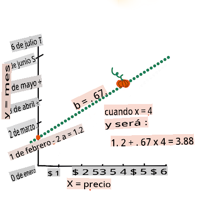

# Construye un modelo de regresión usando Scikit-learn: regresión de cuatro maneras


> Infografía por [Dasani Madipalli](https://twitter.com/dasani_decoded)
## [Cuestionario previo a la lección](https://gray-sand-07a10f403.1.azurestaticapps.net/quiz/13/)

> ### [¡Esta lección está disponible en R!](../../../../2-Regression/3-Linear/solution/R/lesson_3.html)
### Introducción 

Hasta ahora has explorado qué es la regresión con datos de muestra recopilados del conjunto de datos de precios de calabazas que utilizaremos a lo largo de esta lección. También lo has visualizado usando Matplotlib.

Ahora estás listo para profundizar en la regresión para ML. Mientras que la visualización te permite entender los datos, el verdadero poder del Aprendizaje Automático proviene del _entrenamiento de modelos_. Los modelos se entrenan con datos históricos para capturar automáticamente las dependencias de los datos, y te permiten predecir resultados para nuevos datos, que el modelo no ha visto antes.

En esta lección, aprenderás más sobre dos tipos de regresión: _regresión lineal básica_ y _regresión polinómica_, junto con algunas de las matemáticas subyacentes a estas técnicas. Esos modelos nos permitirán predecir los precios de las calabazas dependiendo de diferentes datos de entrada. 

[](https://youtu.be/CRxFT8oTDMg "ML para principiantes - Entendiendo la Regresión Lineal")

> 🎥 Haz clic en la imagen de arriba para una breve visión general de la regresión lineal.

> A lo largo de este plan de estudios, asumimos un conocimiento mínimo de matemáticas, y buscamos hacerlo accesible para estudiantes que vienen de otros campos, así que estate atento a notas, 🧮 llamadas, diagramas y otras herramientas de aprendizaje para ayudar en la comprensión.

### Prerrequisitos

Deberías estar familiarizado con la estructura de los datos de calabazas que estamos examinando. Puedes encontrarlo precargado y pre-limpiado en el archivo _notebook.ipynb_ de esta lección. En el archivo, el precio de la calabaza se muestra por fanega en un nuevo marco de datos. Asegúrate de poder ejecutar estos cuadernos en kernels en Visual Studio Code.

### Preparación

Como recordatorio, estás cargando estos datos para hacerles preguntas.

- ¿Cuándo es el mejor momento para comprar calabazas?
- ¿Qué precio puedo esperar de una caja de calabazas miniatura?
- ¿Debería comprarlas en cestas de media fanega o en cajas de 1 1/9 fanega?
Sigamos profundizando en estos datos.

En la lección anterior, creaste un marco de datos de Pandas y lo llenaste con parte del conjunto de datos original, estandarizando los precios por fanega. Sin embargo, al hacerlo, solo pudiste reunir alrededor de 400 puntos de datos y solo para los meses de otoño.

Echa un vistazo a los datos que precargamos en el cuaderno acompañante de esta lección. Los datos están precargados y se ha graficado un gráfico de dispersión inicial para mostrar los datos por mes. Tal vez podamos obtener un poco más de detalle sobre la naturaleza de los datos limpiándolos más.

## Una línea de regresión lineal

Como aprendiste en la Lección 1, el objetivo de un ejercicio de regresión lineal es poder trazar una línea para:

- **Mostrar relaciones entre variables**. Mostrar la relación entre variables.
- **Hacer predicciones**. Hacer predicciones precisas sobre dónde caería un nuevo punto de datos en relación con esa línea.
 
Es típico de la **Regresión de Mínimos Cuadrados** dibujar este tipo de línea. El término 'mínimos cuadrados' significa que todos los puntos de datos que rodean la línea de regresión se elevan al cuadrado y luego se suman. Idealmente, esa suma final es lo más pequeña posible, porque queremos un número bajo de errores, o `least-squares`. 

Hacemos esto ya que queremos modelar una línea que tenga la menor distancia acumulada de todos nuestros puntos de datos. También elevamos al cuadrado los términos antes de sumarlos, ya que nos preocupa su magnitud más que su dirección.

> **🧮 Muéstrame las matemáticas** 
> 
> Esta línea, llamada la _línea de mejor ajuste_ puede expresarse por [una ecuación](https://es.wikipedia.org/wiki/Regresión_lineal_simple): 
> 
> ```
> Y = a + bX
> ```
>
> `X` is the 'explanatory variable'. `Y` is the 'dependent variable'. The slope of the line is `b` and `a` is the y-intercept, which refers to the value of `Y` when `X = 0`. 
>
>
>
> First, calculate the slope `b`. Infographic by [Jen Looper](https://twitter.com/jenlooper)
>
> In other words, and referring to our pumpkin data's original question: "predict the price of a pumpkin per bushel by month", `X` would refer to the price and `Y` would refer to the month of sale. 
>
>
>
> Calculate the value of Y. If you're paying around $4, it must be April! Infographic by [Jen Looper](https://twitter.com/jenlooper)
>
> The math that calculates the line must demonstrate the slope of the line, which is also dependent on the intercept, or where `Y` is situated when `X = 0`.
>
> You can observe the method of calculation for these values on the [Math is Fun](https://www.mathsisfun.com/data/least-squares-regression.html) web site. Also visit [this Least-squares calculator](https://www.mathsisfun.com/data/least-squares-calculator.html) to watch how the numbers' values impact the line.

## Correlation

One more term to understand is the **Correlation Coefficient** between given X and Y variables. Using a scatterplot, you can quickly visualize this coefficient. A plot with datapoints scattered in a neat line have high correlation, but a plot with datapoints scattered everywhere between X and Y have a low correlation.

A good linear regression model will be one that has a high (nearer to 1 than 0) Correlation Coefficient using the Least-Squares Regression method with a line of regression.

✅ Run the notebook accompanying this lesson and look at the Month to Price scatterplot. Does the data associating Month to Price for pumpkin sales seem to have high or low correlation, according to your visual interpretation of the scatterplot? Does that change if you use more fine-grained measure instead of `Month`, eg. *day of the year* (i.e. number of days since the beginning of the year)?

In the code below, we will assume that we have cleaned up the data, and obtained a data frame called `new_pumpkins`, similar to the following:

ID | Month | DayOfYear | Variety | City | Package | Low Price | High Price | Price
---|-------|-----------|---------|------|---------|-----------|------------|-------
70 | 9 | 267 | PIE TYPE | BALTIMORE | 1 1/9 bushel cartons | 15.0 | 15.0 | 13.636364
71 | 9 | 267 | PIE TYPE | BALTIMORE | 1 1/9 bushel cartons | 18.0 | 18.0 | 16.363636
72 | 10 | 274 | PIE TYPE | BALTIMORE | 1 1/9 bushel cartons | 18.0 | 18.0 | 16.363636
73 | 10 | 274 | PIE TYPE | BALTIMORE | 1 1/9 bushel cartons | 17.0 | 17.0 | 15.454545
74 | 10 | 281 | PIE TYPE | BALTIMORE | 1 1/9 bushel cartons | 15.0 | 15.0 | 13.636364

> The code to clean the data is available in [`notebook.ipynb`](../../../../2-Regression/3-Linear/notebook.ipynb). We have performed the same cleaning steps as in the previous lesson, and have calculated `DayOfYear` columna usando la siguiente expresión: 

```python
day_of_year = pd.to_datetime(pumpkins['Date']).apply(lambda dt: (dt-datetime(dt.year,1,1)).days)
```

Ahora que tienes una comprensión de las matemáticas detrás de la regresión lineal, vamos a crear un modelo de Regresión para ver si podemos predecir qué paquete de calabazas tendrá los mejores precios de calabaza. Alguien que compra calabazas para un huerto de calabazas festivo podría querer esta información para poder optimizar sus compras de paquetes de calabazas para el huerto.

## Buscando correlación

[](https://youtu.be/uoRq-lW2eQo "ML para principiantes - Buscando correlación: La clave para la regresión lineal")

> 🎥 Haz clic en la imagen de arriba para una breve visión general de la correlación.

De la lección anterior, probablemente hayas visto que el precio promedio para diferentes meses se ve así:


Esto sugiere que debería haber alguna correlación, y podemos intentar entrenar un modelo de regresión lineal para predecir la relación entre `Month` and `Price`, or between `DayOfYear` and `Price`. Here is the scatter plot that shows the latter relationship:

 

Let's see if there is a correlation using the `corr` función:

```python
print(new_pumpkins['Month'].corr(new_pumpkins['Price']))
print(new_pumpkins['DayOfYear'].corr(new_pumpkins['Price']))
```

Parece que la correlación es bastante pequeña, -0.15 por `Month` and -0.17 by the `DayOfMonth`, but there could be another important relationship. It looks like there are different clusters of prices corresponding to different pumpkin varieties. To confirm this hypothesis, let's plot each pumpkin category using a different color. By passing an `ax` parameter to the `scatter` función de trazado de dispersión podemos trazar todos los puntos en el mismo gráfico:

```python
ax=None
colors = ['red','blue','green','yellow']
for i,var in enumerate(new_pumpkins['Variety'].unique()):
    df = new_pumpkins[new_pumpkins['Variety']==var]
    ax = df.plot.scatter('DayOfYear','Price',ax=ax,c=colors[i],label=var)
```

 

Nuestra investigación sugiere que la variedad tiene más efecto en el precio general que la fecha de venta real. Podemos ver esto con un gráfico de barras:

```python
new_pumpkins.groupby('Variety')['Price'].mean().plot(kind='bar')
```

 

Centrémonos por el momento solo en una variedad de calabaza, el 'tipo para tarta', y veamos qué efecto tiene la fecha en el precio:

```python
pie_pumpkins = new_pumpkins[new_pumpkins['Variety']=='PIE TYPE']
pie_pumpkins.plot.scatter('DayOfYear','Price') 
```
 

Si ahora calculamos la correlación entre `Price` and `DayOfYear` using `corr` function, we will get something like `-0.27` - lo que significa que tiene sentido entrenar un modelo predictivo.

> Antes de entrenar un modelo de regresión lineal, es importante asegurarse de que nuestros datos estén limpios. La regresión lineal no funciona bien con valores faltantes, por lo que tiene sentido deshacerse de todas las celdas vacías:

```python
pie_pumpkins.dropna(inplace=True)
pie_pumpkins.info()
```

Otro enfoque sería llenar esos valores vacíos con valores medios de la columna correspondiente.

## Regresión Lineal Simple

[](https://youtu.be/e4c_UP2fSjg "ML para principiantes - Regresión Lineal y Polinómica usando Scikit-learn")

> 🎥 Haz clic en la imagen de arriba para una breve visión general de la regresión lineal y polinómica.

Para entrenar nuestro modelo de Regresión Lineal, utilizaremos la biblioteca **Scikit-learn**.

```python
from sklearn.linear_model import LinearRegression
from sklearn.metrics import mean_squared_error
from sklearn.model_selection import train_test_split
```

Comenzamos separando los valores de entrada (características) y la salida esperada (etiqueta) en matrices numpy separadas:

```python
X = pie_pumpkins['DayOfYear'].to_numpy().reshape(-1,1)
y = pie_pumpkins['Price']
```

> Nota que tuvimos que realizar `reshape` en los datos de entrada para que el paquete de Regresión Lineal los entienda correctamente. La Regresión Lineal espera una matriz 2D como entrada, donde cada fila de la matriz corresponde a un vector de características de entrada. En nuestro caso, como solo tenemos una entrada, necesitamos una matriz con forma N×1, donde N es el tamaño del conjunto de datos.

Luego, necesitamos dividir los datos en conjuntos de entrenamiento y prueba, para que podamos validar nuestro modelo después del entrenamiento:

```python
X_train, X_test, y_train, y_test = train_test_split(X, y, test_size=0.2, random_state=0)
```

Finalmente, entrenar el modelo de Regresión Lineal real toma solo dos líneas de código. Definimos el método `LinearRegression` object, and fit it to our data using the `fit`:

```python
lin_reg = LinearRegression()
lin_reg.fit(X_train,y_train)
```

El `LinearRegression` object after `fit`-ting contains all the coefficients of the regression, which can be accessed using `.coef_` property. In our case, there is just one coefficient, which should be around `-0.017`. It means that prices seem to drop a bit with time, but not too much, around 2 cents per day. We can also access the intersection point of the regression with Y-axis using `lin_reg.intercept_` - it will be around `21` en nuestro caso, indicando el precio al comienzo del año.

Para ver qué tan preciso es nuestro modelo, podemos predecir precios en un conjunto de datos de prueba, y luego medir qué tan cerca están nuestras predicciones de los valores esperados. Esto se puede hacer usando la métrica de error cuadrático medio (MSE), que es la media de todas las diferencias al cuadrado entre el valor esperado y el valor predicho.

```python
pred = lin_reg.predict(X_test)

mse = np.sqrt(mean_squared_error(y_test,pred))
print(f'Mean error: {mse:3.3} ({mse/np.mean(pred)*100:3.3}%)')
```

Nuestro error parece ser de alrededor de 2 puntos, lo que es ~17%. No es muy bueno. Otro indicador de la calidad del modelo es el **coeficiente de determinación**, que se puede obtener así:

```python
score = lin_reg.score(X_train,y_train)
print('Model determination: ', score)
```
Si el valor es 0, significa que el modelo no toma en cuenta los datos de entrada, y actúa como el *peor predictor lineal*, que es simplemente un valor medio del resultado. El valor de 1 significa que podemos predecir perfectamente todos los resultados esperados. En nuestro caso, el coeficiente es alrededor de 0.06, lo cual es bastante bajo.

También podemos graficar los datos de prueba junto con la línea de regresión para ver mejor cómo funciona la regresión en nuestro caso:

```python
plt.scatter(X_test,y_test)
plt.plot(X_test,pred)
```


## Regresión Polinómica

Otro tipo de Regresión Lineal es la Regresión Polinómica. Aunque a veces hay una relación lineal entre variables, como que cuanto mayor es el volumen de la calabaza, mayor es el precio, a veces estas relaciones no se pueden trazar como un plano o una línea recta.

✅ Aquí hay [algunos ejemplos más](https://online.stat.psu.edu/stat501/lesson/9/9.8) de datos que podrían usar Regresión Polinómica

Mira nuevamente la relación entre Fecha y Precio. ¿Parece que este gráfico de dispersión debería necesariamente ser analizado por una línea recta? ¿No pueden fluctuar los precios? En este caso, puedes intentar la regresión polinómica.

✅ Los polinomios son expresiones matemáticas que pueden consistir en una o más variables y coeficientes

La regresión polinómica crea una línea curva para ajustar mejor los datos no lineales. En nuestro caso, si incluimos una variable `DayOfYear` al cuadrado en los datos de entrada, deberíamos poder ajustar nuestros datos con una curva parabólica, que tendrá un mínimo en un cierto punto dentro del año.

Scikit-learn incluye una útil [API de pipeline](https://scikit-learn.org/stable/modules/generated/sklearn.pipeline.make_pipeline.html?highlight=pipeline#sklearn.pipeline.make_pipeline) para combinar diferentes pasos de procesamiento de datos juntos. Un **pipeline** es una cadena de **estimadores**. En nuestro caso, crearemos un pipeline que primero agregue características polinómicas a nuestro modelo, y luego entrene la regresión:

```python
from sklearn.preprocessing import PolynomialFeatures
from sklearn.pipeline import make_pipeline

pipeline = make_pipeline(PolynomialFeatures(2), LinearRegression())

pipeline.fit(X_train,y_train)
```

Usando `PolynomialFeatures(2)` means that we will include all second-degree polynomials from the input data. In our case it will just mean `DayOfYear`<sup>2</sup>, but given two input variables X and Y, this will add X<sup>2</sup>, XY and Y<sup>2</sup>. We may also use higher degree polynomials if we want.

Pipelines can be used in the same manner as the original `LinearRegression` object, i.e. we can `fit` the pipeline, and then use `predict` to get the prediction results. Here is the graph showing test data, and the approximation curve:


Using Polynomial Regression, we can get slightly lower MSE and higher determination, but not significantly. We need to take into account other features!

> You can see that the minimal pumpkin prices are observed somewhere around Halloween. How can you explain this? 

🎃 Congratulations, you just created a model that can help predict the price of pie pumpkins. You can probably repeat the same procedure for all pumpkin types, but that would be tedious. Let's learn now how to take pumpkin variety into account in our model!

## Categorical Features

In the ideal world, we want to be able to predict prices for different pumpkin varieties using the same model. However, the `Variety` column is somewhat different from columns like `Month`, because it contains non-numeric values. Such columns are called **categorical**.

[](https://youtu.be/DYGliioIAE0 "ML for beginners - Categorical Feature Predictions with Linear Regression")

> 🎥 Click the image above for a short video overview of using categorical features.

Here you can see how average price depends on variety:


To take variety into account, we first need to convert it to numeric form, or **encode** it. There are several way we can do it:

* Simple **numeric encoding** will build a table of different varieties, and then replace the variety name by an index in that table. This is not the best idea for linear regression, because linear regression takes the actual numeric value of the index, and adds it to the result, multiplying by some coefficient. In our case, the relationship between the index number and the price is clearly non-linear, even if we make sure that indices are ordered in some specific way.
* **One-hot encoding** will replace the `Variety` column by 4 different columns, one for each variety. Each column will contain `1` if the corresponding row is of a given variety, and `0` de lo contrario. Esto significa que habrá cuatro coeficientes en la regresión lineal, uno para cada variedad de calabaza, responsable del "precio inicial" (o más bien "precio adicional") para esa variedad en particular.

El código a continuación muestra cómo podemos codificar una variedad en una sola columna:

```python
pd.get_dummies(new_pumpkins['Variety'])
```

 ID | FAIRYTALE | MINIATURE | MIXED HEIRLOOM VARIETIES | PIE TYPE
----|-----------|-----------|--------------------------|----------
70 | 0 | 0 | 0 | 1
71 | 0 | 0 | 0 | 1
... | ... | ... | ... | ...
1738 | 0 | 1 | 0 | 0
1739 | 0 | 1 | 0 | 0
1740 | 0 | 1 | 0 | 0
1741 | 0 | 1 | 0 | 0
1742 | 0 | 1 | 0 | 0

Para entrenar la regresión lineal usando la variedad codificada en una sola columna como entrada, solo necesitamos inicializar los datos `X` and `y` correctamente:

```python
X = pd.get_dummies(new_pumpkins['Variety'])
y = new_pumpkins['Price']
```

El resto del código es el mismo que usamos arriba para entrenar la Regresión Lineal. Si lo pruebas, verás que el error cuadrático medio es aproximadamente el mismo, pero obtenemos un coeficiente de determinación mucho más alto (~77%). Para obtener predicciones aún más precisas, podemos tener en cuenta más características categóricas, así como características numéricas, como `Month` or `DayOfYear`. To get one large array of features, we can use `join`:

```python
X = pd.get_dummies(new_pumpkins['Variety']) \
        .join(new_pumpkins['Month']) \
        .join(pd.get_dummies(new_pumpkins['City'])) \
        .join(pd.get_dummies(new_pumpkins['Package']))
y = new_pumpkins['Price']
```

Aquí también tenemos en cuenta `City` and `Package` tipo, lo que nos da un MSE de 2.84 (10%), y una determinación de 0.94!

## Poniéndolo todo junto

Para hacer el mejor modelo, podemos usar datos combinados (codificados en una sola columna categórica + numérica) del ejemplo anterior junto con la Regresión Polinómica. Aquí está el código completo para tu conveniencia:

```python
# set up training data
X = pd.get_dummies(new_pumpkins['Variety']) \
        .join(new_pumpkins['Month']) \
        .join(pd.get_dummies(new_pumpkins['City'])) \
        .join(pd.get_dummies(new_pumpkins['Package']))
y = new_pumpkins['Price']

# make train-test split
X_train, X_test, y_train, y_test = train_test_split(X, y, test_size=0.2, random_state=0)

# setup and train the pipeline
pipeline = make_pipeline(PolynomialFeatures(2), LinearRegression())
pipeline.fit(X_train,y_train)

# predict results for test data
pred = pipeline.predict(X_test)

# calculate MSE and determination
mse = np.sqrt(mean_squared_error(y_test,pred))
print(f'Mean error: {mse:3.3} ({mse/np.mean(pred)*100:3.3}%)')

score = pipeline.score(X_train,y_train)
print('Model determination: ', score)
```

Esto debería darnos el mejor coeficiente de determinación de casi 97%, y MSE=2.23 (~8% de error de predicción).

| Modelo | MSE | Determinación |
|-------|-----|---------------|
| `DayOfYear` Linear | 2.77 (17.2%) | 0.07 |
| `DayOfYear` Polynomial | 2.73 (17.0%) | 0.08 |
| `Variety` Lineal | 5.24 (19.7%) | 0.77 |
| Todas las características Lineal | 2.84 (10.5%) | 0.94 |
| Todas las características Polinómica | 2.23 (8.25%) | 0.97 |

🏆 ¡Bien hecho! Creaste cuatro modelos de Regresión en una lección, y mejoraste la calidad del modelo al 97%. En la sección final sobre Regresión, aprenderás sobre la Regresión Logística para determinar categorías. 

---
## 🚀Desafío

Prueba varias variables diferentes en este cuaderno para ver cómo la correlación corresponde a la precisión del modelo.

## [Cuestionario posterior a la lección](https://gray-sand-07a10f403.1.azurestaticapps.net/quiz/14/)

## Revisión y Autoestudio

En esta lección aprendimos sobre la Regresión Lineal. Hay otros tipos importantes de Regresión. Lee sobre las técnicas de Stepwise, Ridge, Lasso y Elasticnet. Un buen curso para estudiar y aprender más es el [curso de Stanford Statistical Learning](https://online.stanford.edu/courses/sohs-ystatslearning-statistical-learning)

## Asignación 

[Construye un Modelo](assignment.md)

**Descargo de responsabilidad**:
Este documento ha sido traducido utilizando servicios de traducción automática basados en IA. Si bien nos esforzamos por lograr precisión, tenga en cuenta que las traducciones automáticas pueden contener errores o imprecisiones. El documento original en su idioma nativo debe considerarse la fuente autorizada. Para información crítica, se recomienda una traducción humana profesional. No nos hacemos responsables de ningún malentendido o interpretación errónea que surja del uso de esta traducción.