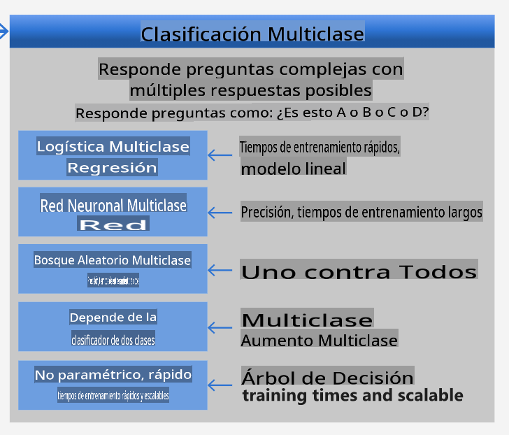
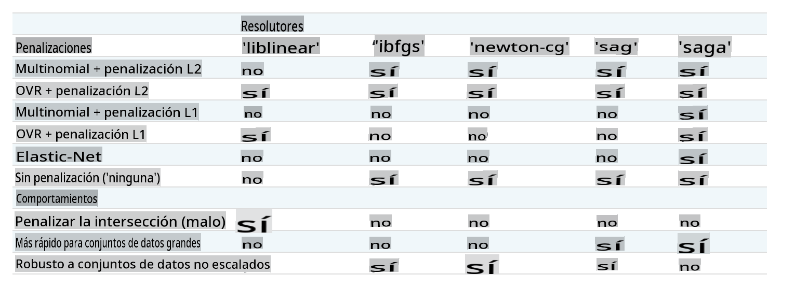

<!--
CO_OP_TRANSLATOR_METADATA:
{
  "original_hash": "9579f42e3ff5114c58379cc9e186a828",
  "translation_date": "2025-09-03T23:51:43+00:00",
  "source_file": "4-Classification/2-Classifiers-1/README.md",
  "language_code": "es"
}
-->
# Clasificadores de cocina 1

En esta lección, utilizarás el conjunto de datos que guardaste en la lección anterior, lleno de datos equilibrados y limpios sobre cocinas.

Usarás este conjunto de datos con una variedad de clasificadores para _predecir una cocina nacional específica basada en un grupo de ingredientes_. Mientras lo haces, aprenderás más sobre algunas de las formas en que los algoritmos pueden ser aprovechados para tareas de clasificación.

## [Cuestionario previo a la lección](https://gray-sand-07a10f403.1.azurestaticapps.net/quiz/21/)
# Preparación

Asumiendo que completaste la [Lección 1](../1-Introduction/README.md), asegúrate de que exista un archivo _cleaned_cuisines.csv_ en la carpeta raíz `/data` para estas cuatro lecciones.

## Ejercicio - predecir una cocina nacional

1. Trabajando en la carpeta _notebook.ipynb_ de esta lección, importa ese archivo junto con la biblioteca Pandas:

    ```python
    import pandas as pd
    cuisines_df = pd.read_csv("../data/cleaned_cuisines.csv")
    cuisines_df.head()
    ```

    Los datos se ven así:

|     | Unnamed: 0 | cuisine | almond | angelica | anise | anise_seed | apple | apple_brandy | apricot | armagnac | ... | whiskey | white_bread | white_wine | whole_grain_wheat_flour | wine | wood | yam | yeast | yogurt | zucchini |
| --- | ---------- | ------- | ------ | -------- | ----- | ---------- | ----- | ------------ | ------- | -------- | --- | ------- | ----------- | ---------- | ----------------------- | ---- | ---- | --- | ----- | ------ | -------- |
| 0   | 0          | indian  | 0      | 0        | 0     | 0          | 0     | 0            | 0       | 0        | ... | 0       | 0           | 0          | 0                       | 0    | 0    | 0   | 0     | 0      | 0        |
| 1   | 1          | indian  | 1      | 0        | 0     | 0          | 0     | 0            | 0       | 0        | ... | 0       | 0           | 0          | 0                       | 0    | 0    | 0   | 0     | 0      | 0        |
| 2   | 2          | indian  | 0      | 0        | 0     | 0          | 0     | 0            | 0       | 0        | ... | 0       | 0           | 0          | 0                       | 0    | 0    | 0   | 0     | 0      | 0        |
| 3   | 3          | indian  | 0      | 0        | 0     | 0          | 0     | 0            | 0       | 0        | ... | 0       | 0           | 0          | 0                       | 0    | 0    | 0   | 0     | 0      | 0        |
| 4   | 4          | indian  | 0      | 0        | 0     | 0          | 0     | 0            | 0       | 0        | ... | 0       | 0           | 0          | 0                       | 0    | 0    | 0   | 0     | 1      | 0        |
  

1. Ahora, importa varias bibliotecas más:

    ```python
    from sklearn.linear_model import LogisticRegression
    from sklearn.model_selection import train_test_split, cross_val_score
    from sklearn.metrics import accuracy_score,precision_score,confusion_matrix,classification_report, precision_recall_curve
    from sklearn.svm import SVC
    import numpy as np
    ```

1. Divide las coordenadas X e y en dos dataframes para entrenamiento. `cuisine` puede ser el dataframe de etiquetas:

    ```python
    cuisines_label_df = cuisines_df['cuisine']
    cuisines_label_df.head()
    ```

    Se verá así:

    ```output
    0    indian
    1    indian
    2    indian
    3    indian
    4    indian
    Name: cuisine, dtype: object
    ```

1. Elimina la columna `Unnamed: 0` y la columna `cuisine` usando `drop()`. Guarda el resto de los datos como características entrenables:

    ```python
    cuisines_feature_df = cuisines_df.drop(['Unnamed: 0', 'cuisine'], axis=1)
    cuisines_feature_df.head()
    ```

    Tus características se ven así:

|      | almond | angelica | anise | anise_seed | apple | apple_brandy | apricot | armagnac | artemisia | artichoke |  ... | whiskey | white_bread | white_wine | whole_grain_wheat_flour | wine | wood |  yam | yeast | yogurt | zucchini |
| ---: | -----: | -------: | ----: | ---------: | ----: | -----------: | ------: | -------: | --------: | --------: | ---: | ------: | ----------: | ---------: | ----------------------: | ---: | ---: | ---: | ----: | -----: | -------: |
|    0 |      0 |        0 |     0 |          0 |     0 |            0 |       0 |        0 |         0 |         0 |  ... |       0 |           0 |          0 |                       0 |    0 |    0 |    0 |     0 |      0 |        0 | 0 |
|    1 |      1 |        0 |     0 |          0 |     0 |            0 |       0 |        0 |         0 |         0 |  ... |       0 |           0 |          0 |                       0 |    0 |    0 |    0 |     0 |      0 |        0 | 0 |
|    2 |      0 |        0 |     0 |          0 |     0 |            0 |       0 |        0 |         0 |         0 |  ... |       0 |           0 |          0 |                       0 |    0 |    0 |    0 |     0 |      0 |        0 | 0 |
|    3 |      0 |        0 |     0 |          0 |     0 |            0 |       0 |        0 |         0 |         0 |  ... |       0 |           0 |          0 |                       0 |    0 |    0 |    0 |     0 |      0 |        0 | 0 |
|    4 |      0 |        0 |     0 |          0 |     0 |            0 |       0 |        0 |         0 |         0 |  ... |       0 |           0 |          0 |                       0 |    0 |    0 |    0 |     0 |      1 |        0 | 0 |

¡Ahora estás listo para entrenar tu modelo!

## Elegir tu clasificador

Ahora que tus datos están limpios y listos para el entrenamiento, debes decidir qué algoritmo usar para la tarea.

Scikit-learn agrupa la clasificación bajo Aprendizaje Supervisado, y en esa categoría encontrarás muchas formas de clasificar. [La variedad](https://scikit-learn.org/stable/supervised_learning.html) puede ser abrumadora a primera vista. Los siguientes métodos incluyen técnicas de clasificación:

- Modelos Lineales
- Máquinas de Soporte Vectorial
- Descenso de Gradiente Estocástico
- Vecinos Más Cercanos
- Procesos Gaussianos
- Árboles de Decisión
- Métodos de Ensamble (voting Classifier)
- Algoritmos Multiclase y Multioutput (clasificación multiclase y multilabel, clasificación multiclase-multioutput)

> También puedes usar [redes neuronales para clasificar datos](https://scikit-learn.org/stable/modules/neural_networks_supervised.html#classification), pero eso está fuera del alcance de esta lección.

### ¿Qué clasificador elegir?

Entonces, ¿qué clasificador deberías elegir? A menudo, probar varios y buscar un buen resultado es una forma de experimentar. Scikit-learn ofrece una [comparación lado a lado](https://scikit-learn.org/stable/auto_examples/classification/plot_classifier_comparison.html) en un conjunto de datos creado, comparando KNeighbors, SVC de dos maneras, GaussianProcessClassifier, DecisionTreeClassifier, RandomForestClassifier, MLPClassifier, AdaBoostClassifier, GaussianNB y QuadraticDiscrinationAnalysis, mostrando los resultados visualizados:


> Gráficos generados en la documentación de Scikit-learn

> AutoML resuelve este problema de manera eficiente al realizar estas comparaciones en la nube, permitiéndote elegir el mejor algoritmo para tus datos. Pruébalo [aquí](https://docs.microsoft.com/learn/modules/automate-model-selection-with-azure-automl/?WT.mc_id=academic-77952-leestott)

### Un enfoque mejor

Una mejor manera que adivinar al azar es seguir las ideas de esta [hoja de trucos de ML descargable](https://docs.microsoft.com/azure/machine-learning/algorithm-cheat-sheet?WT.mc_id=academic-77952-leestott). Aquí descubrimos que, para nuestro problema multiclase, tenemos algunas opciones:


> Una sección de la Hoja de Trucos de Algoritmos de Microsoft, detallando opciones de clasificación multiclase

✅ Descarga esta hoja de trucos, imprímela y cuélgala en tu pared.

### Razonamiento

Veamos si podemos razonar sobre diferentes enfoques dados los límites que tenemos:

- **Las redes neuronales son demasiado pesadas**. Dado nuestro conjunto de datos limpio pero mínimo, y el hecho de que estamos entrenando localmente a través de notebooks, las redes neuronales son demasiado pesadas para esta tarea.
- **No usamos clasificadores de dos clases**. No usamos un clasificador de dos clases, por lo que descartamos el enfoque one-vs-all.
- **Un árbol de decisión o regresión logística podrían funcionar**. Un árbol de decisión podría funcionar, o la regresión logística para datos multiclase.
- **Los Árboles de Decisión Potenciados Multiclase resuelven otro problema**. Los árboles de decisión potenciados multiclase son más adecuados para tareas no paramétricas, como las diseñadas para construir rankings, por lo que no son útiles para nosotros.

### Usando Scikit-learn 

Usaremos Scikit-learn para analizar nuestros datos. Sin embargo, hay muchas formas de usar la regresión logística en Scikit-learn. Echa un vistazo a los [parámetros que puedes pasar](https://scikit-learn.org/stable/modules/generated/sklearn.linear_model.LogisticRegression.html?highlight=logistic%20regressio#sklearn.linear_model.LogisticRegression).

Esencialmente, hay dos parámetros importantes - `multi_class` y `solver` - que necesitamos especificar cuando pedimos a Scikit-learn que realice una regresión logística. El valor de `multi_class` aplica un cierto comportamiento. El valor del solver indica qué algoritmo usar. No todos los solvers pueden combinarse con todos los valores de `multi_class`.

Según la documentación, en el caso multiclase, el algoritmo de entrenamiento:

- **Usa el esquema one-vs-rest (OvR)**, si la opción `multi_class` está configurada como `ovr`.
- **Usa la pérdida de entropía cruzada**, si la opción `multi_class` está configurada como `multinomial`. (Actualmente, la opción `multinomial` solo es compatible con los solvers ‘lbfgs’, ‘sag’, ‘saga’ y ‘newton-cg’).

> 🎓 El 'esquema' aquí puede ser 'ovr' (one-vs-rest) o 'multinomial'. Dado que la regresión logística está diseñada principalmente para soportar clasificación binaria, estos esquemas le permiten manejar mejor tareas de clasificación multiclase. [fuente](https://machinelearningmastery.com/one-vs-rest-and-one-vs-one-for-multi-class-classification/)

> 🎓 El 'solver' se define como "el algoritmo a usar en el problema de optimización". [fuente](https://scikit-learn.org/stable/modules/generated/sklearn.linear_model.LogisticRegression.html?highlight=logistic%20regressio#sklearn.linear_model.LogisticRegression).

Scikit-learn ofrece esta tabla para explicar cómo los solvers manejan diferentes desafíos presentados por diferentes tipos de estructuras de datos:



## Ejercicio - dividir los datos

Podemos centrarnos en la regresión logística para nuestro primer intento de entrenamiento, ya que recientemente aprendiste sobre ella en una lección anterior.
Divide tus datos en grupos de entrenamiento y prueba llamando a `train_test_split()`:

```python
X_train, X_test, y_train, y_test = train_test_split(cuisines_feature_df, cuisines_label_df, test_size=0.3)
```

## Ejercicio - aplicar regresión logística

Dado que estás usando el caso multiclase, necesitas elegir qué _esquema_ usar y qué _solver_ configurar. Usa LogisticRegression con una configuración multiclase y el solver **liblinear** para entrenar.

1. Crea una regresión logística con `multi_class` configurado como `ovr` y el solver configurado como `liblinear`:

    ```python
    lr = LogisticRegression(multi_class='ovr',solver='liblinear')
    model = lr.fit(X_train, np.ravel(y_train))
    
    accuracy = model.score(X_test, y_test)
    print ("Accuracy is {}".format(accuracy))
    ```

    ✅ Prueba un solver diferente como `lbfgs`, que a menudo se configura como predeterminado.
> Nota, utiliza la función [`ravel`](https://pandas.pydata.org/pandas-docs/stable/reference/api/pandas.Series.ravel.html) de Pandas para aplanar tus datos cuando sea necesario.
¡La precisión es buena, con más del **80%**!

1. Puedes ver este modelo en acción probando una fila de datos (#50):

    ```python
    print(f'ingredients: {X_test.iloc[50][X_test.iloc[50]!=0].keys()}')
    print(f'cuisine: {y_test.iloc[50]}')
    ```

    El resultado se imprime:

   ```output
   ingredients: Index(['cilantro', 'onion', 'pea', 'potato', 'tomato', 'vegetable_oil'], dtype='object')
   cuisine: indian
   ```

   ✅ Prueba con un número de fila diferente y verifica los resultados.

1. Profundizando más, puedes comprobar la precisión de esta predicción:

    ```python
    test= X_test.iloc[50].values.reshape(-1, 1).T
    proba = model.predict_proba(test)
    classes = model.classes_
    resultdf = pd.DataFrame(data=proba, columns=classes)
    
    topPrediction = resultdf.T.sort_values(by=[0], ascending = [False])
    topPrediction.head()
    ```

    El resultado se imprime: la cocina india es su mejor suposición, con buena probabilidad:

    |          |        0 |
    | -------: | -------: |
    |   indian | 0.715851 |
    |  chinese | 0.229475 |
    | japanese | 0.029763 |
    |   korean | 0.017277 |
    |     thai | 0.007634 |

    ✅ ¿Puedes explicar por qué el modelo está bastante seguro de que se trata de una cocina india?

1. Obtén más detalles imprimiendo un informe de clasificación, como hiciste en las lecciones de regresión:

    ```python
    y_pred = model.predict(X_test)
    print(classification_report(y_test,y_pred))
    ```

    |              | precisión | recall | f1-score | soporte |
    | ------------ | --------- | ------ | -------- | ------- |
    | chinese      | 0.73      | 0.71   | 0.72     | 229     |
    | indian       | 0.91      | 0.93   | 0.92     | 254     |
    | japanese     | 0.70      | 0.75   | 0.72     | 220     |
    | korean       | 0.86      | 0.76   | 0.81     | 242     |
    | thai         | 0.79      | 0.85   | 0.82     | 254     |
    | accuracy     | 0.80      | 1199   |          |         |
    | macro avg    | 0.80      | 0.80   | 0.80     | 1199    |
    | weighted avg | 0.80      | 0.80   | 0.80     | 1199    |

## 🚀Desafío

En esta lección, utilizaste tus datos limpios para construir un modelo de aprendizaje automático que puede predecir una cocina nacional basada en una serie de ingredientes. Tómate un tiempo para leer las muchas opciones que Scikit-learn ofrece para clasificar datos. Profundiza en el concepto de 'solver' para entender qué sucede detrás de escena.

## [Cuestionario posterior a la lección](https://gray-sand-07a10f403.1.azurestaticapps.net/quiz/22/)

## Revisión y autoestudio

Investiga un poco más sobre las matemáticas detrás de la regresión logística en [esta lección](https://people.eecs.berkeley.edu/~russell/classes/cs194/f11/lectures/CS194%20Fall%202011%20Lecture%2006.pdf)
## Tarea 

[Estudia los solvers](assignment.md)

---

**Descargo de responsabilidad**:  
Este documento ha sido traducido utilizando el servicio de traducción automática [Co-op Translator](https://github.com/Azure/co-op-translator). Si bien nos esforzamos por garantizar la precisión, tenga en cuenta que las traducciones automatizadas pueden contener errores o imprecisiones. El documento original en su idioma nativo debe considerarse como la fuente autorizada. Para información crítica, se recomienda una traducción profesional realizada por humanos. No nos hacemos responsables de malentendidos o interpretaciones erróneas que puedan surgir del uso de esta traducción.