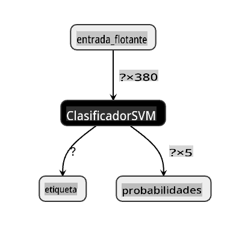

# Construir una Aplicación Web de Recomendación de Cocina

En esta lección, construirás un modelo de clasificación utilizando algunas de las técnicas que has aprendido en lecciones anteriores y con el delicioso conjunto de datos de cocina utilizado a lo largo de esta serie. Además, construirás una pequeña aplicación web para usar un modelo guardado, aprovechando el runtime web de Onnx.

Uno de los usos prácticos más útiles del aprendizaje automático es construir sistemas de recomendación, ¡y puedes dar el primer paso en esa dirección hoy!

[](https://youtu.be/17wdM9AHMfg "Applied ML")

> 🎥 Haz clic en la imagen de arriba para ver un video: Jen Looper construye una aplicación web usando datos de cocina clasificados

## [Cuestionario antes de la lección](https://gray-sand-07a10f403.1.azurestaticapps.net/quiz/25/)

En esta lección aprenderás:

- Cómo construir un modelo y guardarlo como un modelo Onnx
- Cómo usar Netron para inspeccionar el modelo
- Cómo usar tu modelo en una aplicación web para inferencia

## Construye tu modelo

Construir sistemas de ML aplicados es una parte importante de aprovechar estas tecnologías para tus sistemas empresariales. Puedes usar modelos dentro de tus aplicaciones web (y así usarlos en un contexto offline si es necesario) utilizando Onnx.

En una [lección anterior](../../3-Web-App/1-Web-App/README.md), construiste un modelo de Regresión sobre avistamientos de OVNIs, lo "encurtiste" y lo usaste en una aplicación Flask. Si bien esta arquitectura es muy útil de conocer, es una aplicación Python de pila completa, y tus requisitos pueden incluir el uso de una aplicación JavaScript.

En esta lección, puedes construir un sistema básico basado en JavaScript para la inferencia. Primero, sin embargo, necesitas entrenar un modelo y convertirlo para usarlo con Onnx.

## Ejercicio - entrenar modelo de clasificación

Primero, entrena un modelo de clasificación utilizando el conjunto de datos de cocinas limpiado que utilizamos.

1. Comienza importando bibliotecas útiles:

    ```python
    !pip install skl2onnx
    import pandas as pd 
    ```

    Necesitas '[skl2onnx](https://onnx.ai/sklearn-onnx/)' para ayudar a convertir tu modelo de Scikit-learn al formato Onnx.

1. Luego, trabaja con tus datos de la misma manera que lo hiciste en lecciones anteriores, leyendo un archivo CSV usando `read_csv()`:

    ```python
    data = pd.read_csv('../data/cleaned_cuisines.csv')
    data.head()
    ```

1. Elimina las dos primeras columnas innecesarias y guarda los datos restantes como 'X':

    ```python
    X = data.iloc[:,2:]
    X.head()
    ```

1. Guarda las etiquetas como 'y':

    ```python
    y = data[['cuisine']]
    y.head()
    
    ```

### Comienza la rutina de entrenamiento

Usaremos la biblioteca 'SVC' que tiene buena precisión.

1. Importa las bibliotecas apropiadas de Scikit-learn:

    ```python
    from sklearn.model_selection import train_test_split
    from sklearn.svm import SVC
    from sklearn.model_selection import cross_val_score
    from sklearn.metrics import accuracy_score,precision_score,confusion_matrix,classification_report
    ```

1. Separa los conjuntos de entrenamiento y prueba:

    ```python
    X_train, X_test, y_train, y_test = train_test_split(X,y,test_size=0.3)
    ```

1. Construye un modelo de Clasificación SVC como lo hiciste en la lección anterior:

    ```python
    model = SVC(kernel='linear', C=10, probability=True,random_state=0)
    model.fit(X_train,y_train.values.ravel())
    ```

1. Ahora, prueba tu modelo, llamando a `predict()`:

    ```python
    y_pred = model.predict(X_test)
    ```

1. Imprime un informe de clasificación para verificar la calidad del modelo:

    ```python
    print(classification_report(y_test,y_pred))
    ```

    Como vimos antes, la precisión es buena:

    ```output
                    precision    recall  f1-score   support
    
         chinese       0.72      0.69      0.70       257
          indian       0.91      0.87      0.89       243
        japanese       0.79      0.77      0.78       239
          korean       0.83      0.79      0.81       236
            thai       0.72      0.84      0.78       224
    
        accuracy                           0.79      1199
       macro avg       0.79      0.79      0.79      1199
    weighted avg       0.79      0.79      0.79      1199
    ```

### Convierte tu modelo a Onnx

Asegúrate de hacer la conversión con el número de Tensor adecuado. Este conjunto de datos tiene 380 ingredientes listados, por lo que necesitas anotar ese número en `FloatTensorType`:

1. Convierte usando un número de tensor de 380.

    ```python
    from skl2onnx import convert_sklearn
    from skl2onnx.common.data_types import FloatTensorType
    
    initial_type = [('float_input', FloatTensorType([None, 380]))]
    options = {id(model): {'nocl': True, 'zipmap': False}}
    ```

1. Crea el archivo onx y guárdalo como **model.onnx**:

    ```python
    onx = convert_sklearn(model, initial_types=initial_type, options=options)
    with open("./model.onnx", "wb") as f:
        f.write(onx.SerializeToString())
    ```

    > Nota, puedes pasar [opciones](https://onnx.ai/sklearn-onnx/parameterized.html) en tu script de conversión. En este caso, pasamos 'nocl' como True y 'zipmap' como False. Dado que este es un modelo de clasificación, tienes la opción de eliminar ZipMap, que produce una lista de diccionarios (no es necesario). `nocl` refers to class information being included in the model. Reduce your model's size by setting `nocl` to 'True'. 

Running the entire notebook will now build an Onnx model and save it to this folder.

## View your model

Onnx models are not very visible in Visual Studio code, but there's a very good free software that many researchers use to visualize the model to ensure that it is properly built. Download [Netron](https://github.com/lutzroeder/Netron) and  open your model.onnx file. You can see your simple model visualized, with its 380 inputs and classifier listed:



Netron is a helpful tool to view your models.

Now you are ready to use this neat model in a web app. Let's build an app that will come in handy when you look in your refrigerator and try to figure out which combination of your leftover ingredients you can use to cook a given cuisine, as determined by your model.

## Build a recommender web application

You can use your model directly in a web app. This architecture also allows you to run it locally and even offline if needed. Start by creating an `index.html` file in the same folder where you stored your `model.onnx` file.

1. En este archivo _index.html_, agrega el siguiente marcado:

    ```html
    <!DOCTYPE html>
    <html>
        <header>
            <title>Cuisine Matcher</title>
        </header>
        <body>
            ...
        </body>
    </html>
    ```

1. Ahora, trabajando dentro de las etiquetas `body`, agrega un poco de marcado para mostrar una lista de casillas de verificación que reflejan algunos ingredientes:

    ```html
    <h1>Check your refrigerator. What can you create?</h1>
            <div id="wrapper">
                <div class="boxCont">
                    <input type="checkbox" value="4" class="checkbox">
                    <label>apple</label>
                </div>
            
                <div class="boxCont">
                    <input type="checkbox" value="247" class="checkbox">
                    <label>pear</label>
                </div>
            
                <div class="boxCont">
                    <input type="checkbox" value="77" class="checkbox">
                    <label>cherry</label>
                </div>
    
                <div class="boxCont">
                    <input type="checkbox" value="126" class="checkbox">
                    <label>fenugreek</label>
                </div>
    
                <div class="boxCont">
                    <input type="checkbox" value="302" class="checkbox">
                    <label>sake</label>
                </div>
    
                <div class="boxCont">
                    <input type="checkbox" value="327" class="checkbox">
                    <label>soy sauce</label>
                </div>
    
                <div class="boxCont">
                    <input type="checkbox" value="112" class="checkbox">
                    <label>cumin</label>
                </div>
            </div>
            <div style="padding-top:10px">
                <button onClick="startInference()">What kind of cuisine can you make?</button>
            </div> 
    ```

    Nota que a cada casilla de verificación se le da un valor. Esto refleja el índice donde se encuentra el ingrediente según el conjunto de datos. La manzana, por ejemplo, en esta lista alfabética, ocupa la quinta columna, por lo que su valor es '4' ya que comenzamos a contar desde 0. Puedes consultar la [hoja de cálculo de ingredientes](../../../../4-Classification/data/ingredient_indexes.csv) para descubrir el índice de un ingrediente dado.

    Continuando tu trabajo en el archivo index.html, agrega un bloque de script donde se llama al modelo después del cierre final `</div>`.

1. Primero, importa el [Runtime de Onnx](https://www.onnxruntime.ai/):

    ```html
    <script src="https://cdn.jsdelivr.net/npm/onnxruntime-web@1.9.0/dist/ort.min.js"></script> 
    ```

    > Onnx Runtime se usa para permitir ejecutar tus modelos Onnx en una amplia gama de plataformas de hardware, incluidas optimizaciones y una API para usar.

1. Una vez que el Runtime esté en su lugar, puedes llamarlo:

    ```html
    <script>
        const ingredients = Array(380).fill(0);
        
        const checks = [...document.querySelectorAll('.checkbox')];
        
        checks.forEach(check => {
            check.addEventListener('change', function() {
                // toggle the state of the ingredient
                // based on the checkbox's value (1 or 0)
                ingredients[check.value] = check.checked ? 1 : 0;
            });
        });

        function testCheckboxes() {
            // validate if at least one checkbox is checked
            return checks.some(check => check.checked);
        }

        async function startInference() {

            let atLeastOneChecked = testCheckboxes()

            if (!atLeastOneChecked) {
                alert('Please select at least one ingredient.');
                return;
            }
            try {
                // create a new session and load the model.
                
                const session = await ort.InferenceSession.create('./model.onnx');

                const input = new ort.Tensor(new Float32Array(ingredients), [1, 380]);
                const feeds = { float_input: input };

                // feed inputs and run
                const results = await session.run(feeds);

                // read from results
                alert('You can enjoy ' + results.label.data[0] + ' cuisine today!')

            } catch (e) {
                console.log(`failed to inference ONNX model`);
                console.error(e);
            }
        }
               
    </script>
    ```

En este código, están ocurriendo varias cosas:

1. Creaste una matriz de 380 posibles valores (1 o 0) para ser configurados y enviados al modelo para inferencia, dependiendo de si una casilla de verificación de ingrediente está marcada.
2. Creaste una matriz de casillas de verificación y una forma de determinar si estaban marcadas en un `init` function that is called when the application starts. When a checkbox is checked, the `ingredients` array is altered to reflect the chosen ingredient.
3. You created a `testCheckboxes` function that checks whether any checkbox was checked.
4. You use `startInference` function when the button is pressed and, if any checkbox is checked, you start inference.
5. The inference routine includes:
   1. Setting up an asynchronous load of the model
   2. Creating a Tensor structure to send to the model
   3. Creating 'feeds' that reflects the `float_input` input that you created when training your model (you can use Netron to verify that name)
   4. Sending these 'feeds' to the model and waiting for a response

## Test your application

Open a terminal session in Visual Studio Code in the folder where your index.html file resides. Ensure that you have [http-server](https://www.npmjs.com/package/http-server) installed globally, and type `http-server` en el indicador. Debería abrirse un localhost y puedes ver tu aplicación web. Verifica qué cocina se recomienda según varios ingredientes:


¡Felicidades, has creado una aplicación web de 'recomendación' con unos pocos campos! Tómate un tiempo para desarrollar este sistema.

## 🚀Desafío

Tu aplicación web es muy mínima, así que continúa desarrollándola utilizando ingredientes y sus índices de los datos de [ingredient_indexes](../../../../4-Classification/data/ingredient_indexes.csv). ¿Qué combinaciones de sabores funcionan para crear un plato nacional dado?

## [Cuestionario después de la lección](https://gray-sand-07a10f403.1.azurestaticapps.net/quiz/26/)

## Revisión y Autoestudio

Si bien esta lección solo tocó la utilidad de crear un sistema de recomendación para ingredientes alimentarios, esta área de aplicaciones de ML es muy rica en ejemplos. Lee más sobre cómo se construyen estos sistemas:

- https://www.sciencedirect.com/topics/computer-science/recommendation-engine
- https://www.technologyreview.com/2014/08/25/171547/the-ultimate-challenge-for-recommendation-engines/
- https://www.technologyreview.com/2015/03/23/168831/everything-is-a-recommendation/

## Asignación

[Construye un nuevo recomendador](assignment.md)

**Descargo de responsabilidad**:
Este documento ha sido traducido utilizando servicios de traducción automática basados en IA. Aunque nos esforzamos por lograr precisión, tenga en cuenta que las traducciones automáticas pueden contener errores o inexactitudes. El documento original en su idioma nativo debe considerarse la fuente autorizada. Para información crítica, se recomienda la traducción profesional humana. No somos responsables de ningún malentendido o interpretación errónea que surja del uso de esta traducción.