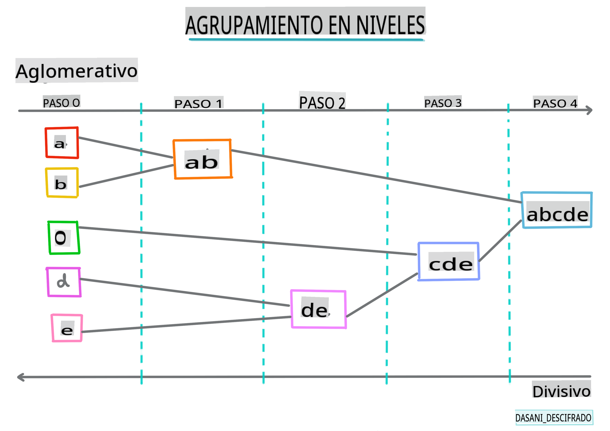
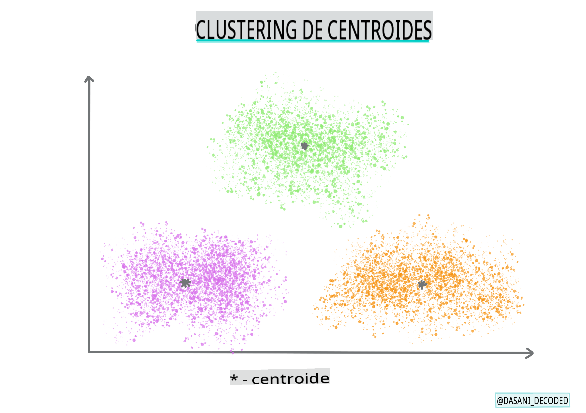

# Introducción a la agrupación

La agrupación es un tipo de [Aprendizaje No Supervisado](https://wikipedia.org/wiki/Unsupervised_learning) que supone que un conjunto de datos no está etiquetado o que sus entradas no están emparejadas con salidas predefinidas. Utiliza varios algoritmos para clasificar datos no etiquetados y proporcionar agrupaciones según los patrones que discierne en los datos.

[](https://youtu.be/ty2advRiWJM "No One Like You by PSquare")

> 🎥 Haz clic en la imagen de arriba para ver un video. Mientras estudias el aprendizaje automático con agrupación, disfruta de algunas pistas de Dance Hall nigeriano: esta es una canción muy valorada de 2014 por PSquare.

## [Cuestionario antes de la lección](https://gray-sand-07a10f403.1.azurestaticapps.net/quiz/27/)
### Introducción

[La agrupación](https://link.springer.com/referenceworkentry/10.1007%2F978-0-387-30164-8_124) es muy útil para la exploración de datos. Veamos si puede ayudar a descubrir tendencias y patrones en la forma en que el público nigeriano consume música.

✅ Tómate un minuto para pensar en los usos de la agrupación. En la vida real, la agrupación ocurre cada vez que tienes una pila de ropa y necesitas separar la ropa de los miembros de tu familia 🧦👕👖🩲. En ciencia de datos, la agrupación ocurre cuando se intenta analizar las preferencias de un usuario o determinar las características de cualquier conjunto de datos no etiquetado. La agrupación, de alguna manera, ayuda a darle sentido al caos, como un cajón de calcetines.

[](https://youtu.be/esmzYhuFnds "Introduction to Clustering")

> 🎥 Haz clic en la imagen de arriba para ver un video: John Guttag del MIT introduce la agrupación

En un entorno profesional, la agrupación puede usarse para determinar cosas como la segmentación del mercado, determinando qué grupos de edad compran qué artículos, por ejemplo. Otro uso sería la detección de anomalías, tal vez para detectar fraudes en un conjunto de datos de transacciones con tarjetas de crédito. O podrías usar la agrupación para determinar tumores en un lote de escaneos médicos.

✅ Piensa un minuto sobre cómo podrías haber encontrado la agrupación 'en la naturaleza', en un entorno bancario, de comercio electrónico o de negocios.

> 🎓 Curiosamente, el análisis de agrupaciones se originó en los campos de la Antropología y la Psicología en la década de 1930. ¿Puedes imaginar cómo podría haberse utilizado?

Alternativamente, podrías usarlo para agrupar resultados de búsqueda: por enlaces de compras, imágenes o reseñas, por ejemplo. La agrupación es útil cuando tienes un conjunto de datos grande que deseas reducir y sobre el cual deseas realizar un análisis más granular, por lo que la técnica puede usarse para aprender sobre los datos antes de que se construyan otros modelos.

✅ Una vez que tus datos estén organizados en grupos, les asignas un Id de grupo, y esta técnica puede ser útil para preservar la privacidad del conjunto de datos; en lugar de referirse a un punto de datos por su id de grupo, en lugar de por datos más reveladores e identificables. ¿Puedes pensar en otras razones por las que preferirías referirte a un Id de grupo en lugar de a otros elementos del grupo para identificarlo?

Profundiza tu comprensión de las técnicas de agrupación en este [módulo de aprendizaje](https://docs.microsoft.com/learn/modules/train-evaluate-cluster-models?WT.mc_id=academic-77952-leestott)
## Empezando con la agrupación

[Scikit-learn ofrece una amplia gama](https://scikit-learn.org/stable/modules/clustering.html) de métodos para realizar agrupaciones. El tipo que elijas dependerá de tu caso de uso. Según la documentación, cada método tiene varios beneficios. Aquí hay una tabla simplificada de los métodos compatibles con Scikit-learn y sus casos de uso apropiados:

| Nombre del método            | Caso de uso                                                                |
| :--------------------------- | :------------------------------------------------------------------------- |
| K-Means                      | propósito general, inductivo                                               |
| Affinity propagation         | muchos, grupos desiguales, inductivo                                       |
| Mean-shift                   | muchos, grupos desiguales, inductivo                                       |
| Spectral clustering          | pocos, grupos uniformes, transductivo                                      |
| Ward hierarchical clustering | muchos, grupos restringidos, transductivo                                  |
| Agglomerative clustering     | muchos, restringidos, distancias no euclidianas, transductivo              |
| DBSCAN                       | geometría no plana, grupos desiguales, transductivo                        |
| OPTICS                       | geometría no plana, grupos desiguales con densidad variable, transductivo  |
| Gaussian mixtures            | geometría plana, inductivo                                                 |
| BIRCH                        | conjunto de datos grande con valores atípicos, inductivo                   |

> 🎓 Cómo creamos grupos tiene mucho que ver con cómo reunimos los puntos de datos en grupos. Desempaquemos algo de vocabulario:
>
> 🎓 ['Transductivo' vs. 'inductivo'](https://wikipedia.org/wiki/Transduction_(machine_learning))
> 
> La inferencia transductiva se deriva de casos de entrenamiento observados que se asignan a casos de prueba específicos. La inferencia inductiva se deriva de casos de entrenamiento que se asignan a reglas generales que solo entonces se aplican a casos de prueba.
> 
> Un ejemplo: Imagina que tienes un conjunto de datos que solo está parcialmente etiquetado. Algunas cosas son 'discos', algunas 'CDs' y algunas están en blanco. Tu trabajo es proporcionar etiquetas para los vacíos. Si eliges un enfoque inductivo, entrenarías un modelo buscando 'discos' y 'CDs', y aplicarías esas etiquetas a tus datos no etiquetados. Este enfoque tendrá problemas para clasificar cosas que en realidad son 'cassettes'. Un enfoque transductivo, por otro lado, maneja estos datos desconocidos de manera más efectiva, ya que trabaja para agrupar elementos similares y luego aplica una etiqueta a un grupo. En este caso, los grupos podrían reflejar 'cosas musicales redondas' y 'cosas musicales cuadradas'.
> 
> 🎓 ['Geometría no plana' vs. 'plana'](https://datascience.stackexchange.com/questions/52260/terminology-flat-geometry-in-the-context-of-clustering)
> 
> Derivado de la terminología matemática, la geometría no plana vs. plana se refiere a la medida de distancias entre puntos mediante métodos geométricos 'planos' ([Euclidianos](https://wikipedia.org/wiki/Euclidean_geometry)) o 'no planos' (no euclidianos).
>
>'Plana' en este contexto se refiere a la geometría euclidiana (partes de la cual se enseñan como geometría 'plana'), y no plana se refiere a la geometría no euclidiana. ¿Qué tiene que ver la geometría con el aprendizaje automático? Bueno, como dos campos que están arraigados en las matemáticas, debe haber una forma común de medir las distancias entre puntos en grupos, y eso se puede hacer de manera 'plana' o 'no plana', dependiendo de la naturaleza de los datos. Las distancias [euclidianas](https://wikipedia.org/wiki/Euclidean_distance) se miden como la longitud de un segmento de línea entre dos puntos. Las distancias [no euclidianas](https://wikipedia.org/wiki/Non-Euclidean_geometry) se miden a lo largo de una curva. Si tus datos, visualizados, parecen no existir en un plano, es posible que necesites usar un algoritmo especializado para manejarlos.
>

> Infografía por [Dasani Madipalli](https://twitter.com/dasani_decoded)
> 
> 🎓 ['Distancias'](https://web.stanford.edu/class/cs345a/slides/12-clustering.pdf)
> 
> Los grupos se definen por su matriz de distancias, es decir, las distancias entre puntos. Esta distancia se puede medir de varias maneras. Los grupos euclidianos se definen por el promedio de los valores de los puntos y contienen un 'centroide' o punto central. Las distancias, por lo tanto, se miden por la distancia a ese centroide. Las distancias no euclidianas se refieren a 'clustroides', el punto más cercano a otros puntos. Los clustroides, a su vez, pueden definirse de varias maneras.
> 
> 🎓 ['Restringido'](https://wikipedia.org/wiki/Constrained_clustering)
> 
> [La Agrupación Restringida](https://web.cs.ucdavis.edu/~davidson/Publications/ICDMTutorial.pdf) introduce el aprendizaje 'semi-supervisado' en este método no supervisado. Las relaciones entre puntos se marcan como 'no pueden enlazarse' o 'deben enlazarse', por lo que se imponen algunas reglas al conjunto de datos.
>
>Un ejemplo: Si un algoritmo se libera en un lote de datos no etiquetados o semi-etiquetados, los grupos que produce pueden ser de baja calidad. En el ejemplo anterior, los grupos podrían agrupar 'cosas musicales redondas' y 'cosas musicales cuadradas' y 'cosas triangulares' y 'galletas'. Si se le dan algunas restricciones o reglas a seguir ("el ítem debe estar hecho de plástico", "el ítem debe poder producir música"), esto puede ayudar a 'restringir' el algoritmo para tomar mejores decisiones.
> 
> 🎓 'Densidad'
> 
> Los datos que son 'ruidosos' se consideran 'densos'. Las distancias entre puntos en cada uno de sus grupos pueden demostrar, al examinarlas, ser más o menos densas, o 'abarrotadas', y por lo tanto, estos datos deben analizarse con el método de agrupación apropiado. [Este artículo](https://www.kdnuggets.com/2020/02/understanding-density-based-clustering.html) demuestra la diferencia entre usar el algoritmo de agrupación K-Means vs. HDBSCAN para explorar un conjunto de datos ruidosos con densidad de grupo desigual.

## Algoritmos de agrupación

Existen más de 100 algoritmos de agrupación, y su uso depende de la naturaleza de los datos disponibles. Hablemos de algunos de los principales:

- **Agrupación jerárquica**. Si un objeto se clasifica por su proximidad a un objeto cercano, en lugar de a uno más lejano, los grupos se forman en función de la distancia de sus miembros a y desde otros objetos. La agrupación aglomerativa de Scikit-learn es jerárquica.

   
   > Infografía por [Dasani Madipalli](https://twitter.com/dasani_decoded)

- **Agrupación de centroides**. Este algoritmo popular requiere la elección de 'k', o el número de grupos a formar, después de lo cual el algoritmo determina el punto central de un grupo y reúne datos alrededor de ese punto. [La agrupación K-means](https://wikipedia.org/wiki/K-means_clustering) es una versión popular de la agrupación de centroides. El centro se determina por la media más cercana, de ahí el nombre. La distancia cuadrada desde el grupo se minimiza.

   
   > Infografía por [Dasani Madipalli](https://twitter.com/dasani_decoded)

- **Agrupación basada en distribución**. Basada en el modelado estadístico, la agrupación basada en distribución se centra en determinar la probabilidad de que un punto de datos pertenezca a un grupo y asignarlo en consecuencia. Los métodos de mezcla gaussiana pertenecen a este tipo.

- **Agrupación basada en densidad**. Los puntos de datos se asignan a grupos en función de su densidad o su agrupación entre sí. Los puntos de datos alejados del grupo se consideran valores atípicos o ruido. DBSCAN, Mean-shift y OPTICS pertenecen a este tipo de agrupación.

- **Agrupación basada en cuadrícula**. Para conjuntos de datos multidimensionales, se crea una cuadrícula y los datos se dividen entre las celdas de la cuadrícula, creando así grupos.

## Ejercicio - agrupa tus datos

La técnica de agrupación se ve muy beneficiada por la visualización adecuada, así que comencemos visualizando nuestros datos musicales. Este ejercicio nos ayudará a decidir cuál de los métodos de agrupación deberíamos usar más eficazmente para la naturaleza de estos datos.

1. Abre el archivo [_notebook.ipynb_](https://github.com/microsoft/ML-For-Beginners/blob/main/5-Clustering/1-Visualize/notebook.ipynb) en esta carpeta.

1. Importa el paquete `Seaborn` para una buena visualización de datos.

    ```python
    !pip install seaborn
    ```

1. Agrega los datos de las canciones desde [_nigerian-songs.csv_](https://github.com/microsoft/ML-For-Beginners/blob/main/5-Clustering/data/nigerian-songs.csv). Carga un dataframe con algunos datos sobre las canciones. Prepárate para explorar estos datos importando las bibliotecas y descargando los datos:

    ```python
    import matplotlib.pyplot as plt
    import pandas as pd
    
    df = pd.read_csv("../data/nigerian-songs.csv")
    df.head()
    ```

    Revisa las primeras líneas de datos:

    |     | nombre                   | álbum                        | artista             | género_principal_artista | fecha_lanzamiento | duración | popularidad | bailabilidad | acusticidad | energía | instrumentalidad | vivacidad | volumen | locuacidad | tempo   | compás |
    | --- | ------------------------ | ---------------------------- | ------------------- | ------------------------ | ----------------- | -------- | ----------- | ------------ | ------------ | ------- | ----------------- | --------- | ------- | ----------- | ------- | ------ |
    | 0   | Sparky                   | Mandy & The Jungle           | Cruel Santino       | alternative r&b          | 2019              | 144000   | 48          | 0.666        | 0.851        | 0.42    | 0.534             | 0.11      | -6.699  | 0.0829      | 133.015 | 5      |
    | 1   | shuga rush               | EVERYTHING YOU HEARD IS TRUE | Odunsi (The Engine) | afropop                  | 2020              | 89488    | 30          | 0.71         | 0.0822       | 0.683   | 0.000169          | 0.101     | -5.64   | 0.36        | 129.993 | 3      |
    | 2   | LITT!                    | LITT!                        | AYLØ                | indie r&b                | 2018              | 207758   | 40          | 0.836        | 0.272        | 0.564   | 0.000537          | 0.11      | -7.127  | 0.0424      | 130.005 | 4      |
    | 3   | Confident / Feeling Cool | Enjoy Your Life              | Lady Donli          | nigerian pop             | 2019              | 175135   | 14          | 0.894        | 0.798        | 0.611   | 0.000187          | 0.0964    | -4.961  | 0.113       | 111.087 | 4      |
    | 4   | wanted you               | rare.                        | Odunsi (The Engine) | afropop                  | 2018              | 152049   | 25          | 0.702        | 0.116        | 0.833   | 0.91              | 0.348     | -6.044  | 0.0447      | 105.115 | 4      |

1. Obtén información sobre el dataframe, llamando a `info()`:

    ```python
    df.info()
    ```

   La salida se verá así:

    ```output
    <class 'pandas.core.frame.DataFrame'>
    RangeIndex: 530 entries, 0 to 529
    Data columns (total 16 columns):
     #   Column            Non-Null Count  Dtype  
    ---  ------            --------------  -----  
     0   name              530 non-null    object 
     1   album             530 non-null    object 
     2   artist            530 non-null    object 
     3   artist_top_genre  530 non-null    object 
     4   release_date      530 non-null    int64  
     5   length            530 non-null    int64  
     6   popularity        530 non-null    int64  
     7   danceability      530 non-null    float64
     8   acousticness      530 non-null    float64
     9   energy            530 non-null    float64
     10  instrumentalness  530 non-null    float64
     11  liveness          530 non-null    float64
     12  loudness          530 non-null    float64
     13  speechiness       530 non-null    float64
     14  tempo             530 non-null    float64
     15  time_signature    530 non-null    int64  
    dtypes: float64(8), int64(4), object(4)
    memory usage: 66.4+ KB
    ```

1. Verifica nuevamente si hay valores nulos, llamando a `isnull()` y verificando que la suma sea 0:

    ```python
    df.isnull().sum()
    ```

    Se ve bien:

    ```output
    name                0
    album               0
    artist              0
    artist_top_genre    0
    release_date        0
    length              0
    popularity          0
    danceability        0
    acousticness        0
    energy              0
    instrumentalness    0
    liveness            0
    loudness            0
    speechiness         0
    tempo               0
    time_signature      0
    dtype: int64
    ```

1. Describe los datos:

    ```python
    df.describe()
    ```

    |       | fecha_lanzamiento | duración   | popularidad | bailabilidad | acusticidad | energía   | instrumentalidad | vivacidad | volumen   | locuacidad | tempo      | compás  |
    | ----- | ----------------- | ---------- | ----------- | ------------ | ------------ | --------- | ----------------- | --------- | --------- | ----------- | ---------- | ------- |
    | count | 530               | 530        | 530         | 530          | 530          | 530       | 530               | 530       | 530       | 530         | 530        | 530     |
    | mean  | 2015.390566       | 222298.1698| 17.507547   | 0.741619     | 0.265412     | 0.760623  | 0.016305          | 0.147308  | -4.953011 | 0.130748    | 116.487864 | 3.986792|
    | std   | 3.131688          | 39696.82226| 18.992212   | 0.117522     | 0.208342     | 0.148533  | 0.090321          | 0.123588  | 2.464186  | 0.092939    | 23.518601  | 0.333701|
    | min   | 1998              | 89488      | 0           | 0.255        | 0.000665     | 0.111     | 0                 | 0.0283    | -19.362   | 0.0278      | 61.695     | 3       |
    | 25%   | 2014              | 199305     | 0           | 0.681        | 0.089525     | 0.669     | 0                
## [Cuestionario posterior a la lección](https://gray-sand-07a10f403.1.azurestaticapps.net/quiz/28/)

## Revisión y Autoestudio

Antes de aplicar algoritmos de clustering, como hemos aprendido, es una buena idea entender la naturaleza de tu conjunto de datos. Lee más sobre este tema [aquí](https://www.kdnuggets.com/2019/10/right-clustering-algorithm.html)

[Este artículo útil](https://www.freecodecamp.org/news/8-clustering-algorithms-in-machine-learning-that-all-data-scientists-should-know/) te guía a través de las diferentes formas en que se comportan varios algoritmos de clustering, dadas diferentes formas de datos.

## Tarea

[Investiga otras visualizaciones para clustering](assignment.md)

        **Descargo de responsabilidad**:
        Este documento ha sido traducido utilizando servicios de traducción automática basados en inteligencia artificial. Aunque nos esforzamos por lograr precisión, tenga en cuenta que las traducciones automáticas pueden contener errores o imprecisiones. El documento original en su idioma nativo debe considerarse la fuente autorizada. Para información crítica, se recomienda una traducción humana profesional. No somos responsables de ningún malentendido o interpretación errónea que surja del uso de esta traducción.