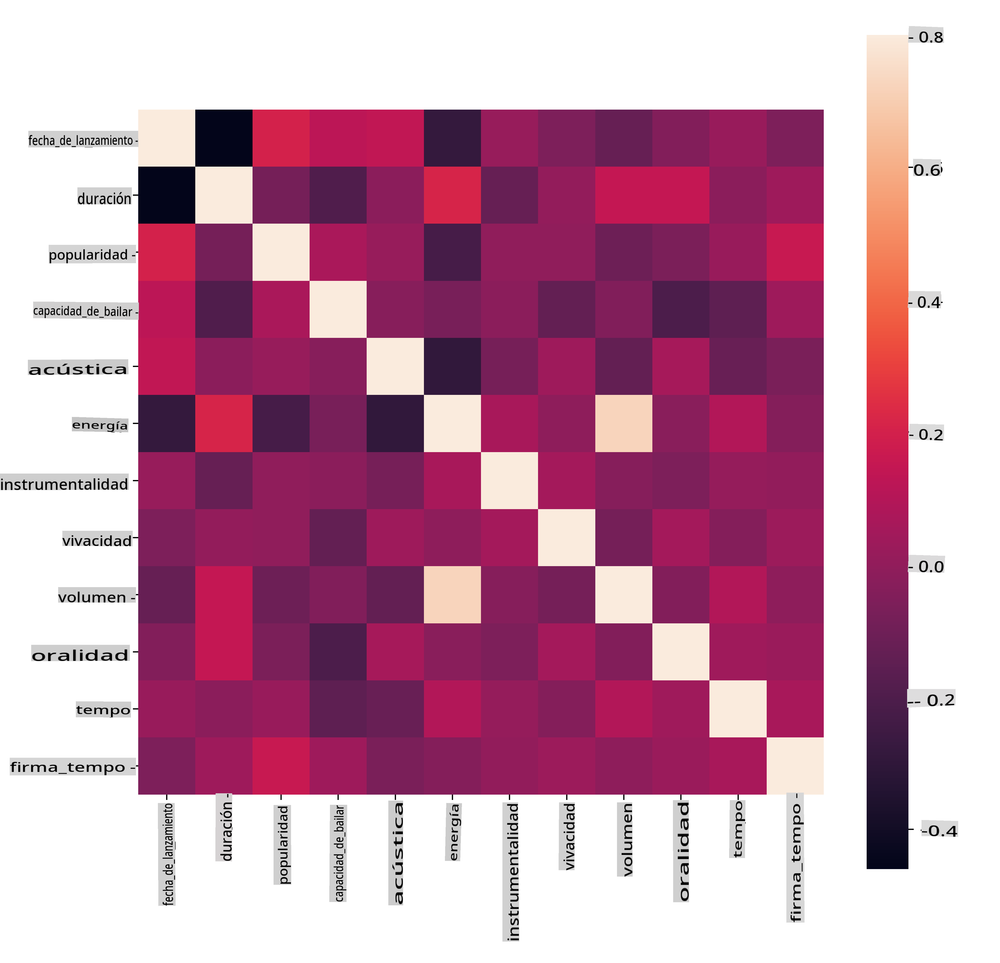
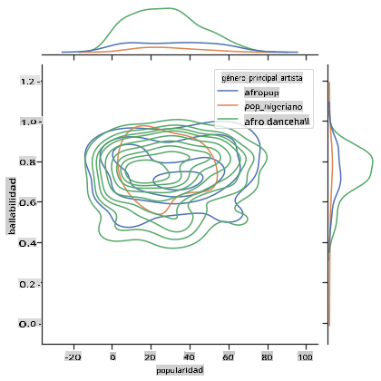
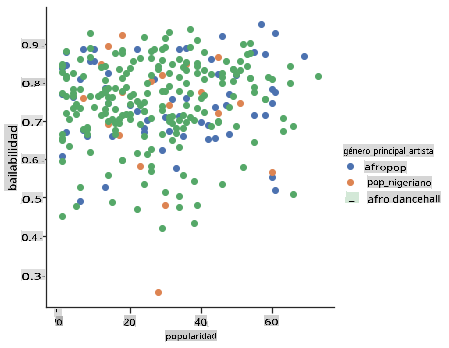

<!--
CO_OP_TRANSLATOR_METADATA:
{
  "original_hash": "0ab69b161efd7a41d325ee28b29415d7",
  "translation_date": "2025-09-03T23:03:37+00:00",
  "source_file": "5-Clustering/1-Visualize/README.md",
  "language_code": "es"
}
-->
# Introducción a la agrupación

La agrupación es un tipo de [Aprendizaje No Supervisado](https://wikipedia.org/wiki/Aprendizaje_no_supervisado) que asume que un conjunto de datos no está etiquetado o que sus entradas no están asociadas con salidas predefinidas. Utiliza varios algoritmos para clasificar datos no etiquetados y proporcionar agrupaciones según los patrones que detecta en los datos.

[](https://youtu.be/ty2advRiWJM "No One Like You de PSquare")

> 🎥 Haz clic en la imagen de arriba para ver un video. Mientras estudias aprendizaje automático con agrupación, disfruta de algunos temas de Dance Hall nigeriano: esta es una canción muy popular de 2014 de PSquare.

## [Cuestionario previo a la clase](https://gray-sand-07a10f403.1.azurestaticapps.net/quiz/27/)

### Introducción

[La agrupación](https://link.springer.com/referenceworkentry/10.1007%2F978-0-387-30164-8_124) es muy útil para la exploración de datos. Veamos si puede ayudar a descubrir tendencias y patrones en la forma en que las audiencias nigerianas consumen música.

✅ Tómate un minuto para pensar en los usos de la agrupación. En la vida cotidiana, la agrupación ocurre cada vez que tienes un montón de ropa y necesitas separar la ropa de los diferentes miembros de tu familia 🧦👕👖🩲. En ciencia de datos, la agrupación ocurre al intentar analizar las preferencias de un usuario o determinar las características de cualquier conjunto de datos no etiquetado. La agrupación, de alguna manera, ayuda a dar sentido al caos, como un cajón de calcetines.

[](https://youtu.be/esmzYhuFnds "Introducción a la agrupación")

> 🎥 Haz clic en la imagen de arriba para ver un video: John Guttag del MIT introduce la agrupación.

En un entorno profesional, la agrupación puede usarse para determinar cosas como la segmentación de mercados, identificando qué grupos de edad compran qué productos, por ejemplo. Otro uso sería la detección de anomalías, tal vez para identificar fraudes en un conjunto de datos de transacciones con tarjetas de crédito. O podrías usar la agrupación para identificar tumores en un lote de escaneos médicos.

✅ Piensa un momento en cómo podrías haber encontrado la agrupación 'en la vida real', en un entorno bancario, de comercio electrónico o empresarial.

> 🎓 Curiosamente, el análisis de agrupación se originó en los campos de la Antropología y la Psicología en la década de 1930. ¿Puedes imaginar cómo podría haberse utilizado?

Alternativamente, podrías usarlo para agrupar resultados de búsqueda, por ejemplo, en enlaces de compras, imágenes o reseñas. La agrupación es útil cuando tienes un conjunto de datos grande que deseas reducir y sobre el cual deseas realizar un análisis más detallado, por lo que la técnica puede usarse para aprender sobre los datos antes de construir otros modelos.

✅ Una vez que tus datos están organizados en grupos, les asignas un Id de grupo, y esta técnica puede ser útil para preservar la privacidad de un conjunto de datos; en lugar de referirte a un punto de datos por información identificable, puedes referirte a él por su Id de grupo. ¿Puedes pensar en otras razones por las que preferirías referirte a un Id de grupo en lugar de otros elementos del grupo para identificarlo?

Profundiza tu comprensión de las técnicas de agrupación en este [módulo de aprendizaje](https://docs.microsoft.com/learn/modules/train-evaluate-cluster-models?WT.mc_id=academic-77952-leestott).

## Introducción a la agrupación

[Scikit-learn ofrece una amplia variedad](https://scikit-learn.org/stable/modules/clustering.html) de métodos para realizar agrupación. El tipo que elijas dependerá de tu caso de uso. Según la documentación, cada método tiene varios beneficios. Aquí hay una tabla simplificada de los métodos compatibles con Scikit-learn y sus casos de uso apropiados:

| Nombre del método            | Caso de uso                                                             |
| :--------------------------- | :---------------------------------------------------------------------- |
| K-Means                      | propósito general, inductivo                                            |
| Propagación de afinidad      | muchos grupos desiguales, inductivo                                     |
| Mean-shift                   | muchos grupos desiguales, inductivo                                     |
| Agrupación espectral         | pocos grupos iguales, transductivo                                      |
| Agrupación jerárquica Ward   | muchos grupos restringidos, transductivo                                |
| Agrupación aglomerativa      | muchos grupos restringidos, distancias no euclidianas, transductivo     |
| DBSCAN                       | geometría no plana, grupos desiguales, transductivo                     |
| OPTICS                       | geometría no plana, grupos desiguales con densidad variable, transductivo |
| Mezclas gaussianas           | geometría plana, inductivo                                              |
| BIRCH                        | conjunto de datos grande con valores atípicos, inductivo                |

> 🎓 Cómo creamos grupos tiene mucho que ver con cómo reunimos los puntos de datos en grupos. Desglosémoslo:
>
> 🎓 ['Transductivo' vs. 'inductivo'](https://wikipedia.org/wiki/Transduction_(machine_learning))
> 
> La inferencia transductiva se deriva de casos de entrenamiento observados que se asignan a casos de prueba específicos. La inferencia inductiva se deriva de casos de entrenamiento que se asignan a reglas generales que solo entonces se aplican a casos de prueba.
> 
> Un ejemplo: Imagina que tienes un conjunto de datos que está parcialmente etiquetado. Algunas cosas son 'discos', otras 'CDs', y otras están en blanco. Tu tarea es proporcionar etiquetas para los elementos en blanco. Si eliges un enfoque inductivo, entrenarías un modelo buscando 'discos' y 'CDs', y aplicarías esas etiquetas a tus datos no etiquetados. Este enfoque tendrá problemas para clasificar cosas que en realidad son 'cassettes'. Un enfoque transductivo, por otro lado, maneja estos datos desconocidos de manera más efectiva al trabajar para agrupar elementos similares y luego aplicar una etiqueta a un grupo. En este caso, los grupos podrían reflejar 'cosas musicales redondas' y 'cosas musicales cuadradas'.
> 
> 🎓 ['Geometría no plana' vs. 'plana'](https://datascience.stackexchange.com/questions/52260/terminology-flat-geometry-in-the-context-of-clustering)
> 
> Derivado de la terminología matemática, geometría no plana vs. plana se refiere a la medida de distancias entre puntos mediante métodos geométricos 'planos' ([Euclidianos](https://wikipedia.org/wiki/Geometr%C3%ADa_euclidiana)) o 'no planos' (no euclidianos).
>
>'Plana' en este contexto se refiere a la geometría euclidiana (partes de la cual se enseñan como geometría 'plana'), y 'no plana' se refiere a la geometría no euclidiana. ¿Qué tiene que ver la geometría con el aprendizaje automático? Bueno, como dos campos que están arraigados en las matemáticas, debe haber una forma común de medir distancias entre puntos en grupos, y eso puede hacerse de manera 'plana' o 'no plana', dependiendo de la naturaleza de los datos. [Las distancias euclidianas](https://wikipedia.org/wiki/Distancia_euclidiana) se miden como la longitud de un segmento de línea entre dos puntos. [Las distancias no euclidianas](https://wikipedia.org/wiki/Geometr%C3%ADa_no_euclidiana) se miden a lo largo de una curva. Si tus datos, visualizados, parecen no existir en un plano, podrías necesitar usar un algoritmo especializado para manejarlos.
>

> Infografía por [Dasani Madipalli](https://twitter.com/dasani_decoded)
> 
> 🎓 ['Distancias'](https://web.stanford.edu/class/cs345a/slides/12-clustering.pdf)
> 
> Los grupos se definen por su matriz de distancias, es decir, las distancias entre puntos. Esta distancia puede medirse de varias maneras. Los grupos euclidianos se definen por el promedio de los valores de los puntos y contienen un 'centroide' o punto central. Las distancias se miden por la distancia a ese centroide. Las distancias no euclidianas se refieren a 'clustroides', el punto más cercano a otros puntos. Los clustroides, a su vez, pueden definirse de varias maneras.
> 
> 🎓 ['Restringido'](https://wikipedia.org/wiki/Constrained_clustering)
> 
> [La agrupación restringida](https://web.cs.ucdavis.edu/~davidson/Publications/ICDMTutorial.pdf) introduce aprendizaje 'semi-supervisado' en este método no supervisado. Las relaciones entre puntos se marcan como 'no puede vincular' o 'debe vincular', por lo que se imponen algunas reglas al conjunto de datos.
>
>Un ejemplo: Si un algoritmo se libera en un lote de datos no etiquetados o semi-etiquetados, los grupos que produce pueden ser de baja calidad. En el ejemplo anterior, los grupos podrían agrupar 'cosas musicales redondas', 'cosas musicales cuadradas', 'cosas triangulares' y 'galletas'. Si se le dan algunas restricciones o reglas a seguir ("el artículo debe estar hecho de plástico", "el artículo necesita poder producir música"), esto puede ayudar a 'restringir' el algoritmo para tomar mejores decisiones.
> 
> 🎓 'Densidad'
> 
> Los datos que son 'ruidosos' se consideran 'densos'. Las distancias entre puntos en cada uno de sus grupos pueden demostrar, al examinarlas, ser más o menos densas, o 'abarrotadas', y por lo tanto estos datos necesitan ser analizados con el método de agrupación apropiado. [Este artículo](https://www.kdnuggets.com/2020/02/understanding-density-based-clustering.html) demuestra la diferencia entre usar agrupación K-Means vs. algoritmos HDBSCAN para explorar un conjunto de datos ruidoso con densidad de grupos desigual.

## Algoritmos de agrupación

Existen más de 100 algoritmos de agrupación, y su uso depende de la naturaleza de los datos en cuestión. Discutamos algunos de los principales:

- **Agrupación jerárquica**. Si un objeto se clasifica por su proximidad a un objeto cercano, en lugar de uno más lejano, los grupos se forman en función de la distancia de sus miembros hacia y desde otros objetos. La agrupación aglomerativa de Scikit-learn es jerárquica.

   
   > Infografía por [Dasani Madipalli](https://twitter.com/dasani_decoded)

- **Agrupación por centroides**. Este popular algoritmo requiere elegir 'k', o el número de grupos a formar, después de lo cual el algoritmo determina el punto central de un grupo y reúne datos alrededor de ese punto. [La agrupación K-means](https://wikipedia.org/wiki/K-means_clustering) es una versión popular de agrupación por centroides. El centro se determina por la media más cercana, de ahí el nombre. La distancia cuadrada desde el grupo se minimiza.

   
   > Infografía por [Dasani Madipalli](https://twitter.com/dasani_decoded)

- **Agrupación basada en distribución**. Basada en modelos estadísticos, la agrupación basada en distribución se centra en determinar la probabilidad de que un punto de datos pertenezca a un grupo y asignarlo en consecuencia. Los métodos de mezcla gaussiana pertenecen a este tipo.

- **Agrupación basada en densidad**. Los puntos de datos se asignan a grupos según su densidad, o su agrupación alrededor de otros puntos. Los puntos de datos alejados del grupo se consideran valores atípicos o ruido. DBSCAN, Mean-shift y OPTICS pertenecen a este tipo de agrupación.

- **Agrupación basada en cuadrícula**. Para conjuntos de datos multidimensionales, se crea una cuadrícula y los datos se dividen entre las celdas de la cuadrícula, creando así grupos.

## Ejercicio - agrupa tus datos

La agrupación como técnica se beneficia enormemente de una visualización adecuada, así que comencemos visualizando nuestros datos musicales. Este ejercicio nos ayudará a decidir cuál de los métodos de agrupación deberíamos usar de manera más efectiva para la naturaleza de estos datos.

1. Abre el archivo [_notebook.ipynb_](https://github.com/microsoft/ML-For-Beginners/blob/main/5-Clustering/1-Visualize/notebook.ipynb) en esta carpeta.

1. Importa el paquete `Seaborn` para una buena visualización de datos.

    ```python
    !pip install seaborn
    ```

1. Agrega los datos de canciones desde [_nigerian-songs.csv_](https://github.com/microsoft/ML-For-Beginners/blob/main/5-Clustering/data/nigerian-songs.csv). Carga un dataframe con algunos datos sobre las canciones. Prepárate para explorar estos datos importando las bibliotecas y mostrando los datos:

    ```python
    import matplotlib.pyplot as plt
    import pandas as pd
    
    df = pd.read_csv("../data/nigerian-songs.csv")
    df.head()
    ```

    Revisa las primeras líneas de datos:

    |     | nombre                  | álbum                        | artista             | género_principal_artista | fecha_lanzamiento | duración | popularidad | bailabilidad | acústica | energía | instrumentalidad | vivacidad | volumen | hablabilidad | tempo   | compás          |
    | --- | ----------------------- | ---------------------------- | ------------------- | ------------------------- | ----------------- | -------- | ----------- | ------------ | -------- | ------ | ---------------- | --------- | ------- | ------------ | ------- | --------------- |
    | 0   | Sparky                  | Mandy & The Jungle           | Cruel Santino       | r&b alternativo          | 2019             | 144000   | 48          | 0.666        | 0.851    | 0.42   | 0.534            | 0.11      | -6.699  | 0.0829       | 133.015 | 5               |
    | 1   | shuga rush              | EVERYTHING YOU HEARD IS TRUE | Odunsi (The Engine) | afropop                  | 2020             | 89488    | 30          | 0.71         | 0.0822   | 0.683  | 0.000169         | 0.101     | -5.64   | 0.36         | 129.993 | 3               |
| 2   | LITT!                    | LITT!                        | AYLØ                | indie r&b        | 2018         | 207758 | 40         | 0.836        | 0.272        | 0.564  | 0.000537         | 0.11     | -7.127   | 0.0424      | 130.005 | 4              |
| 3   | Confident / Feeling Cool | Enjoy Your Life              | Lady Donli          | nigerian pop     | 2019         | 175135 | 14         | 0.894        | 0.798        | 0.611  | 0.000187         | 0.0964   | -4.961   | 0.113       | 111.087 | 4              |
| 4   | wanted you               | rare.                        | Odunsi (The Engine) | afropop          | 2018         | 152049 | 25         | 0.702        | 0.116        | 0.833  | 0.91             | 0.348    | -6.044   | 0.0447      | 105.115 | 4              |

1. Obtén información sobre el dataframe llamando a `info()`:

    ```python
    df.info()
    ```

   El resultado se ve así:

    ```output
    <class 'pandas.core.frame.DataFrame'>
    RangeIndex: 530 entries, 0 to 529
    Data columns (total 16 columns):
     #   Column            Non-Null Count  Dtype  
    ---  ------            --------------  -----  
     0   name              530 non-null    object 
     1   album             530 non-null    object 
     2   artist            530 non-null    object 
     3   artist_top_genre  530 non-null    object 
     4   release_date      530 non-null    int64  
     5   length            530 non-null    int64  
     6   popularity        530 non-null    int64  
     7   danceability      530 non-null    float64
     8   acousticness      530 non-null    float64
     9   energy            530 non-null    float64
     10  instrumentalness  530 non-null    float64
     11  liveness          530 non-null    float64
     12  loudness          530 non-null    float64
     13  speechiness       530 non-null    float64
     14  tempo             530 non-null    float64
     15  time_signature    530 non-null    int64  
    dtypes: float64(8), int64(4), object(4)
    memory usage: 66.4+ KB
    ```

1. Verifica nuevamente si hay valores nulos llamando a `isnull()` y asegurándote de que la suma sea 0:

    ```python
    df.isnull().sum()
    ```

    Todo se ve bien:

    ```output
    name                0
    album               0
    artist              0
    artist_top_genre    0
    release_date        0
    length              0
    popularity          0
    danceability        0
    acousticness        0
    energy              0
    instrumentalness    0
    liveness            0
    loudness            0
    speechiness         0
    tempo               0
    time_signature      0
    dtype: int64
    ```

1. Describe los datos:

    ```python
    df.describe()
    ```

    |       | release_date | length      | popularity | danceability | acousticness | energy   | instrumentalness | liveness | loudness  | speechiness | tempo      | time_signature |
    | ----- | ------------ | ----------- | ---------- | ------------ | ------------ | -------- | ---------------- | -------- | --------- | ----------- | ---------- | -------------- |
    | count | 530          | 530         | 530        | 530          | 530          | 530      | 530              | 530      | 530       | 530         | 530        | 530            |
    | mean  | 2015.390566  | 222298.1698 | 17.507547  | 0.741619     | 0.265412     | 0.760623 | 0.016305         | 0.147308 | -4.953011 | 0.130748    | 116.487864 | 3.986792       |
    | std   | 3.131688     | 39696.82226 | 18.992212  | 0.117522     | 0.208342     | 0.148533 | 0.090321         | 0.123588 | 2.464186  | 0.092939    | 23.518601  | 0.333701       |
    | min   | 1998         | 89488       | 0          | 0.255        | 0.000665     | 0.111    | 0                | 0.0283   | -19.362   | 0.0278      | 61.695     | 3              |
    | 25%   | 2014         | 199305      | 0          | 0.681        | 0.089525     | 0.669    | 0                | 0.07565  | -6.29875  | 0.0591      | 102.96125  | 4              |
    | 50%   | 2016         | 218509      | 13         | 0.761        | 0.2205       | 0.7845   | 0.000004         | 0.1035   | -4.5585   | 0.09795     | 112.7145   | 4              |
    | 75%   | 2017         | 242098.5    | 31         | 0.8295       | 0.403        | 0.87575  | 0.000234         | 0.164    | -3.331    | 0.177       | 125.03925  | 4              |
    | max   | 2020         | 511738      | 73         | 0.966        | 0.954        | 0.995    | 0.91             | 0.811    | 0.582     | 0.514       | 206.007    | 5              |

> 🤔 Si estamos trabajando con clustering, un método no supervisado que no requiere datos etiquetados, ¿por qué estamos mostrando estos datos con etiquetas? En la fase de exploración de datos, son útiles, pero no son necesarios para que los algoritmos de clustering funcionen. Podrías eliminar los encabezados de las columnas y referirte a los datos por número de columna.

Observa los valores generales de los datos. Nota que la popularidad puede ser '0', lo que muestra canciones que no tienen ranking. Eliminemos esos valores pronto.

1. Usa un gráfico de barras para encontrar los géneros más populares:

    ```python
    import seaborn as sns
    
    top = df['artist_top_genre'].value_counts()
    plt.figure(figsize=(10,7))
    sns.barplot(x=top[:5].index,y=top[:5].values)
    plt.xticks(rotation=45)
    plt.title('Top genres',color = 'blue')
    ```

    

✅ Si deseas ver más valores principales, cambia el top `[:5]` a un valor mayor o elimínalo para ver todo.

Nota que cuando el género principal se describe como 'Missing', significa que Spotify no lo clasificó, así que eliminémoslo.

1. Elimina los datos faltantes filtrándolos:

    ```python
    df = df[df['artist_top_genre'] != 'Missing']
    top = df['artist_top_genre'].value_counts()
    plt.figure(figsize=(10,7))
    sns.barplot(x=top.index,y=top.values)
    plt.xticks(rotation=45)
    plt.title('Top genres',color = 'blue')
    ```

    Ahora verifica nuevamente los géneros:

    

1. Los tres géneros principales dominan este conjunto de datos. Concentrémonos en `afro dancehall`, `afropop` y `nigerian pop`, además de filtrar el conjunto de datos para eliminar cualquier valor de popularidad igual a 0 (lo que significa que no fue clasificado con una popularidad en el conjunto de datos y puede considerarse ruido para nuestros propósitos):

    ```python
    df = df[(df['artist_top_genre'] == 'afro dancehall') | (df['artist_top_genre'] == 'afropop') | (df['artist_top_genre'] == 'nigerian pop')]
    df = df[(df['popularity'] > 0)]
    top = df['artist_top_genre'].value_counts()
    plt.figure(figsize=(10,7))
    sns.barplot(x=top.index,y=top.values)
    plt.xticks(rotation=45)
    plt.title('Top genres',color = 'blue')
    ```

1. Haz una prueba rápida para ver si los datos tienen alguna correlación particularmente fuerte:

    ```python
    corrmat = df.corr(numeric_only=True)
    f, ax = plt.subplots(figsize=(12, 9))
    sns.heatmap(corrmat, vmax=.8, square=True)
    ```

    

    La única correlación fuerte es entre `energy` y `loudness`, lo cual no es muy sorprendente, dado que la música fuerte suele ser bastante energética. Por lo demás, las correlaciones son relativamente débiles. Será interesante ver qué puede hacer un algoritmo de clustering con estos datos.

    > 🎓 ¡Nota que la correlación no implica causalidad! Tenemos prueba de correlación pero no prueba de causalidad. Un [sitio web divertido](https://tylervigen.com/spurious-correlations) tiene algunos gráficos que enfatizan este punto.

¿Hay alguna convergencia en este conjunto de datos en torno a la popularidad percibida de una canción y su capacidad de baile? Un FacetGrid muestra que hay círculos concéntricos que se alinean, independientemente del género. ¿Podría ser que los gustos nigerianos convergen en un cierto nivel de capacidad de baile para este género?

✅ Prueba diferentes puntos de datos (energy, loudness, speechiness) y más o diferentes géneros musicales. ¿Qué puedes descubrir? Mira la tabla `df.describe()` para ver la distribución general de los puntos de datos.

### Ejercicio - distribución de datos

¿Son estos tres géneros significativamente diferentes en la percepción de su capacidad de baile, basada en su popularidad?

1. Examina la distribución de datos de nuestros tres géneros principales para popularidad y capacidad de baile a lo largo de un eje x y y dado.

    ```python
    sns.set_theme(style="ticks")
    
    g = sns.jointplot(
        data=df,
        x="popularity", y="danceability", hue="artist_top_genre",
        kind="kde",
    )
    ```

    Puedes descubrir círculos concéntricos alrededor de un punto general de convergencia, mostrando la distribución de puntos.

    > 🎓 Nota que este ejemplo utiliza un gráfico KDE (Kernel Density Estimate) que representa los datos usando una curva de densidad de probabilidad continua. Esto nos permite interpretar los datos cuando trabajamos con múltiples distribuciones.

    En general, los tres géneros se alinean de manera suelta en términos de su popularidad y capacidad de baile. Determinar clusters en estos datos alineados de manera suelta será un desafío:

    

1. Crea un gráfico de dispersión:

    ```python
    sns.FacetGrid(df, hue="artist_top_genre", height=5) \
       .map(plt.scatter, "popularity", "danceability") \
       .add_legend()
    ```

    Un gráfico de dispersión de los mismos ejes muestra un patrón similar de convergencia.

    

En general, para clustering, puedes usar gráficos de dispersión para mostrar clusters de datos, por lo que dominar este tipo de visualización es muy útil. En la próxima lección, tomaremos estos datos filtrados y usaremos clustering k-means para descubrir grupos en estos datos que parecen superponerse de maneras interesantes.

---

## 🚀Desafío

En preparación para la próxima lección, haz un gráfico sobre los diversos algoritmos de clustering que podrías descubrir y usar en un entorno de producción. ¿Qué tipo de problemas está tratando de abordar el clustering?

## [Cuestionario posterior a la lección](https://gray-sand-07a10f403.1.azurestaticapps.net/quiz/28/)

## Revisión y autoestudio

Antes de aplicar algoritmos de clustering, como hemos aprendido, es una buena idea entender la naturaleza de tu conjunto de datos. Lee más sobre este tema [aquí](https://www.kdnuggets.com/2019/10/right-clustering-algorithm.html)

[Este artículo útil](https://www.freecodecamp.org/news/8-clustering-algorithms-in-machine-learning-that-all-data-scientists-should-know/) te guía a través de las diferentes formas en que varios algoritmos de clustering se comportan, dados diferentes formatos de datos.

## Tarea

[Investiga otras visualizaciones para clustering](assignment.md)

---

**Descargo de responsabilidad**:  
Este documento ha sido traducido utilizando el servicio de traducción automática [Co-op Translator](https://github.com/Azure/co-op-translator). Si bien nos esforzamos por lograr precisión, tenga en cuenta que las traducciones automáticas pueden contener errores o imprecisiones. El documento original en su idioma nativo debe considerarse como la fuente autorizada. Para información crítica, se recomienda una traducción profesional realizada por humanos. No nos hacemos responsables de malentendidos o interpretaciones erróneas que puedan surgir del uso de esta traducción.