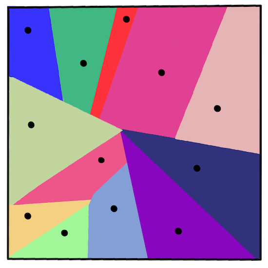
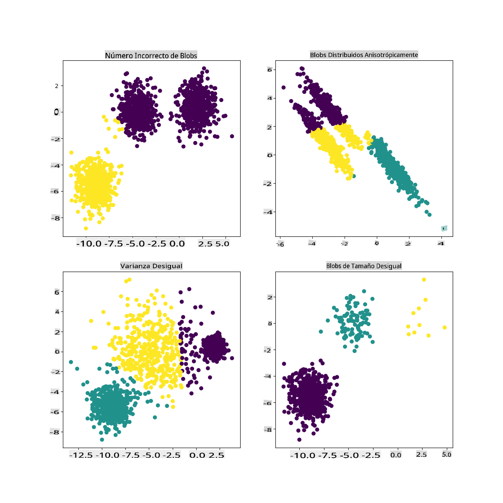

# Agrupamiento K-Means

## [Cuestionario previo a la lección](https://gray-sand-07a10f403.1.azurestaticapps.net/quiz/29/)

En esta lección, aprenderás a crear grupos utilizando Scikit-learn y el conjunto de datos de música nigeriana que importaste anteriormente. Cubriremos los conceptos básicos de K-Means para el agrupamiento. Ten en cuenta que, como aprendiste en la lección anterior, hay muchas formas de trabajar con grupos y el método que utilices depende de tus datos. Intentaremos K-Means ya que es la técnica de agrupamiento más común. ¡Vamos a empezar!

Términos que aprenderás:

- Puntuación de Silhouette
- Método del codo
- Inercia
- Varianza

## Introducción

[El agrupamiento K-Means](https://wikipedia.org/wiki/K-means_clustering) es un método derivado del procesamiento de señales. Se utiliza para dividir y particionar grupos de datos en 'k' grupos utilizando una serie de observaciones. Cada observación trabaja para agrupar un punto de datos dado lo más cerca posible de su 'media' más cercana, o el punto central de un grupo.

Los grupos se pueden visualizar como [diagramas de Voronoi](https://wikipedia.org/wiki/Voronoi_diagram), que incluyen un punto (o 'semilla') y su región correspondiente.



> infografía por [Jen Looper](https://twitter.com/jenlooper)

El proceso de agrupamiento K-Means [se ejecuta en un proceso de tres pasos](https://scikit-learn.org/stable/modules/clustering.html#k-means):

1. El algoritmo selecciona un número k de puntos centrales muestreando del conjunto de datos. Después de esto, se repite:
    1. Asigna cada muestra al centroide más cercano.
    2. Crea nuevos centroides tomando el valor medio de todas las muestras asignadas a los centroides anteriores.
    3. Luego, calcula la diferencia entre los nuevos y antiguos centroides y repite hasta que los centroides se estabilicen.

Una desventaja de usar K-Means es que necesitarás establecer 'k', es decir, el número de centroides. Afortunadamente, el 'método del codo' ayuda a estimar un buen valor inicial para 'k'. Lo probarás en un momento.

## Prerrequisitos

Trabajarás en el archivo [_notebook.ipynb_](https://github.com/microsoft/ML-For-Beginners/blob/main/5-Clustering/2-K-Means/notebook.ipynb) de esta lección que incluye la importación de datos y la limpieza preliminar que hiciste en la última lección.

## Ejercicio - preparación

Comienza echando otro vistazo a los datos de las canciones.

1. Crea un diagrama de caja, llamando a `boxplot()` para cada columna:

    ```python
    plt.figure(figsize=(20,20), dpi=200)
    
    plt.subplot(4,3,1)
    sns.boxplot(x = 'popularity', data = df)
    
    plt.subplot(4,3,2)
    sns.boxplot(x = 'acousticness', data = df)
    
    plt.subplot(4,3,3)
    sns.boxplot(x = 'energy', data = df)
    
    plt.subplot(4,3,4)
    sns.boxplot(x = 'instrumentalness', data = df)
    
    plt.subplot(4,3,5)
    sns.boxplot(x = 'liveness', data = df)
    
    plt.subplot(4,3,6)
    sns.boxplot(x = 'loudness', data = df)
    
    plt.subplot(4,3,7)
    sns.boxplot(x = 'speechiness', data = df)
    
    plt.subplot(4,3,8)
    sns.boxplot(x = 'tempo', data = df)
    
    plt.subplot(4,3,9)
    sns.boxplot(x = 'time_signature', data = df)
    
    plt.subplot(4,3,10)
    sns.boxplot(x = 'danceability', data = df)
    
    plt.subplot(4,3,11)
    sns.boxplot(x = 'length', data = df)
    
    plt.subplot(4,3,12)
    sns.boxplot(x = 'release_date', data = df)
    ```

    Estos datos son un poco ruidosos: al observar cada columna como un diagrama de caja, puedes ver valores atípicos.

    

Podrías recorrer el conjunto de datos y eliminar estos valores atípicos, pero eso haría que los datos fueran bastante mínimos.

1. Por ahora, elige qué columnas usarás para tu ejercicio de agrupamiento. Escoge aquellas con rangos similares y codifica la columna `artist_top_genre` como datos numéricos:

    ```python
    from sklearn.preprocessing import LabelEncoder
    le = LabelEncoder()
    
    X = df.loc[:, ('artist_top_genre','popularity','danceability','acousticness','loudness','energy')]
    
    y = df['artist_top_genre']
    
    X['artist_top_genre'] = le.fit_transform(X['artist_top_genre'])
    
    y = le.transform(y)
    ```

1. Ahora necesitas elegir cuántos grupos apuntar. Sabes que hay 3 géneros de canciones que extrajimos del conjunto de datos, así que intentemos con 3:

    ```python
    from sklearn.cluster import KMeans
    
    nclusters = 3 
    seed = 0
    
    km = KMeans(n_clusters=nclusters, random_state=seed)
    km.fit(X)
    
    # Predict the cluster for each data point
    
    y_cluster_kmeans = km.predict(X)
    y_cluster_kmeans
    ```

Verás un array impreso con los grupos predichos (0, 1 o 2) para cada fila del dataframe.

1. Usa este array para calcular una 'puntuación de Silhouette':

    ```python
    from sklearn import metrics
    score = metrics.silhouette_score(X, y_cluster_kmeans)
    score
    ```

## Puntuación de Silhouette

Busca una puntuación de Silhouette más cercana a 1. Esta puntuación varía de -1 a 1, y si la puntuación es 1, el grupo es denso y está bien separado de otros grupos. Un valor cercano a 0 representa grupos superpuestos con muestras muy cercanas al límite de decisión de los grupos vecinos. [(Fuente)](https://dzone.com/articles/kmeans-silhouette-score-explained-with-python-exam)

Nuestra puntuación es **.53**, así que justo en el medio. Esto indica que nuestros datos no son particularmente adecuados para este tipo de agrupamiento, pero sigamos adelante.

### Ejercicio - construir un modelo

1. Importa `KMeans` y comienza el proceso de agrupamiento.

    ```python
    from sklearn.cluster import KMeans
    wcss = []
    
    for i in range(1, 11):
        kmeans = KMeans(n_clusters = i, init = 'k-means++', random_state = 42)
        kmeans.fit(X)
        wcss.append(kmeans.inertia_)
    
    ```

    Hay algunas partes aquí que merecen una explicación.

    > 🎓 rango: Estas son las iteraciones del proceso de agrupamiento

    > 🎓 random_state: "Determina la generación de números aleatorios para la inicialización del centroide." [Fuente](https://scikit-learn.org/stable/modules/generated/sklearn.cluster.KMeans.html#sklearn.cluster.KMeans)

    > 🎓 WCSS: "suma de cuadrados dentro del grupo" mide la distancia promedio al cuadrado de todos los puntos dentro de un grupo al centroide del grupo. [Fuente](https://medium.com/@ODSC/unsupervised-learning-evaluating-clusters-bd47eed175ce). 

    > 🎓 Inercia: Los algoritmos K-Means intentan elegir centroides para minimizar la 'inercia', "una medida de cuán coherentes son internamente los grupos." [Fuente](https://scikit-learn.org/stable/modules/clustering.html). El valor se agrega a la variable wcss en cada iteración.

    > 🎓 k-means++: En [Scikit-learn](https://scikit-learn.org/stable/modules/clustering.html#k-means) puedes usar la optimización 'k-means++', que "inicializa los centroides para que estén (generalmente) distantes entre sí, lo que lleva a probablemente mejores resultados que la inicialización aleatoria.

### Método del codo

Anteriormente, dedujiste que, debido a que has apuntado a 3 géneros de canciones, deberías elegir 3 grupos. ¿Pero es ese el caso?

1. Usa el 'método del codo' para asegurarte.

    ```python
    plt.figure(figsize=(10,5))
    sns.lineplot(x=range(1, 11), y=wcss, marker='o', color='red')
    plt.title('Elbow')
    plt.xlabel('Number of clusters')
    plt.ylabel('WCSS')
    plt.show()
    ```

    Usa la variable `wcss` que construiste en el paso anterior para crear un gráfico que muestre dónde está el 'doblez' en el codo, lo que indica el número óptimo de grupos. ¡Quizás sí sean 3!

    

## Ejercicio - mostrar los grupos

1. Intenta el proceso nuevamente, esta vez estableciendo tres grupos, y muestra los grupos como un gráfico de dispersión:

    ```python
    from sklearn.cluster import KMeans
    kmeans = KMeans(n_clusters = 3)
    kmeans.fit(X)
    labels = kmeans.predict(X)
    plt.scatter(df['popularity'],df['danceability'],c = labels)
    plt.xlabel('popularity')
    plt.ylabel('danceability')
    plt.show()
    ```

1. Verifica la precisión del modelo:

    ```python
    labels = kmeans.labels_
    
    correct_labels = sum(y == labels)
    
    print("Result: %d out of %d samples were correctly labeled." % (correct_labels, y.size))
    
    print('Accuracy score: {0:0.2f}'. format(correct_labels/float(y.size)))
    ```

    La precisión de este modelo no es muy buena, y la forma de los grupos te da una pista del porqué. 

    

    Estos datos están demasiado desequilibrados, poco correlacionados y hay demasiada varianza entre los valores de las columnas para agrupar bien. De hecho, los grupos que se forman probablemente estén fuertemente influenciados o sesgados por las tres categorías de género que definimos anteriormente. ¡Eso fue un proceso de aprendizaje!

    En la documentación de Scikit-learn, puedes ver que un modelo como este, con grupos no muy bien demarcados, tiene un problema de 'varianza':

    
    > Infografía de Scikit-learn

## Varianza

La varianza se define como "el promedio de las diferencias al cuadrado desde la media" [(Fuente)](https://www.mathsisfun.com/data/standard-deviation.html). En el contexto de este problema de agrupamiento, se refiere a datos donde los números de nuestro conjunto de datos tienden a divergir demasiado de la media.

✅ Este es un buen momento para pensar en todas las formas en que podrías corregir este problema. ¿Ajustar un poco más los datos? ¿Usar diferentes columnas? ¿Usar un algoritmo diferente? Pista: Intenta [escalar tus datos](https://www.mygreatlearning.com/blog/learning-data-science-with-k-means-clustering/) para normalizarlos y probar otras columnas.

> Prueba este '[calculador de varianza](https://www.calculatorsoup.com/calculators/statistics/variance-calculator.php)' para entender un poco más el concepto.

---

## 🚀Desafío

Pasa un tiempo con este cuaderno, ajustando parámetros. ¿Puedes mejorar la precisión del modelo limpiando más los datos (eliminando valores atípicos, por ejemplo)? Puedes usar pesos para dar más peso a ciertas muestras de datos. ¿Qué más puedes hacer para crear mejores grupos?

Pista: Intenta escalar tus datos. Hay código comentado en el cuaderno que agrega escalado estándar para hacer que las columnas de datos se parezcan más en términos de rango. Verás que, aunque la puntuación de Silhouette baja, el 'doblez' en el gráfico del codo se suaviza. Esto se debe a que dejar los datos sin escalar permite que los datos con menos varianza tengan más peso. Lee un poco más sobre este problema [aquí](https://stats.stackexchange.com/questions/21222/are-mean-normalization-and-feature-scaling-needed-for-k-means-clustering/21226#21226).

## [Cuestionario posterior a la lección](https://gray-sand-07a10f403.1.azurestaticapps.net/quiz/30/)

## Revisión y autoestudio

Echa un vistazo a un simulador de K-Means [como este](https://user.ceng.metu.edu.tr/~akifakkus/courses/ceng574/k-means/). Puedes usar esta herramienta para visualizar puntos de datos de muestra y determinar sus centroides. Puedes editar la aleatoriedad de los datos, el número de grupos y el número de centroides. ¿Esto te ayuda a tener una idea de cómo se pueden agrupar los datos?

También, echa un vistazo a [este folleto sobre K-Means](https://stanford.edu/~cpiech/cs221/handouts/kmeans.html) de Stanford.

## Tarea

[Prueba diferentes métodos de agrupamiento](assignment.md)

**Descargo de responsabilidad**:
Este documento ha sido traducido utilizando servicios de traducción automática basados en inteligencia artificial. Si bien nos esforzamos por lograr precisión, tenga en cuenta que las traducciones automatizadas pueden contener errores o inexactitudes. El documento original en su idioma nativo debe considerarse la fuente autorizada. Para información crítica, se recomienda una traducción profesional humana. No nos hacemos responsables de cualquier malentendido o interpretación errónea que surja del uso de esta traducción.