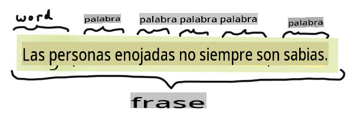
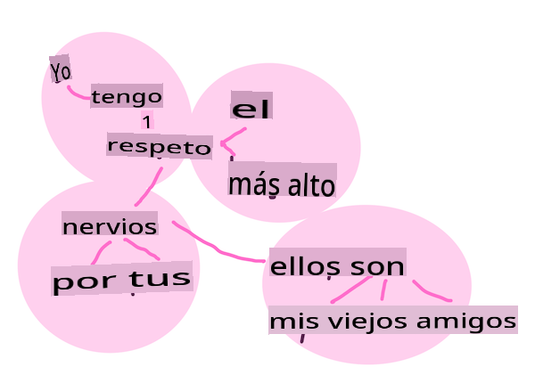
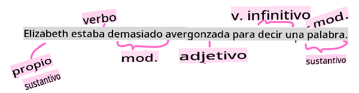

# Tareas y técnicas comunes de procesamiento de lenguaje natural

Para la mayoría de las tareas de *procesamiento de lenguaje natural*, el texto a procesar debe descomponerse, examinarse y los resultados deben almacenarse o cruzarse con reglas y conjuntos de datos. Estas tareas permiten al programador derivar el _significado_ o _intención_ o solo la _frecuencia_ de términos y palabras en un texto.

## [Cuestionario previo a la lección](https://gray-sand-07a10f403.1.azurestaticapps.net/quiz/33/)

Vamos a descubrir técnicas comunes utilizadas en el procesamiento de texto. Combinadas con el aprendizaje automático, estas técnicas te ayudan a analizar grandes cantidades de texto de manera eficiente. Sin embargo, antes de aplicar ML a estas tareas, entendamos los problemas que enfrenta un especialista en PLN.

## Tareas comunes en PLN

Existen diferentes formas de analizar un texto en el que estás trabajando. Hay tareas que puedes realizar y a través de estas tareas puedes comprender el texto y sacar conclusiones. Normalmente, llevas a cabo estas tareas en una secuencia.

### Tokenización

Probablemente, lo primero que la mayoría de los algoritmos de PLN deben hacer es dividir el texto en tokens o palabras. Aunque esto suena simple, tener en cuenta la puntuación y los delimitadores de palabras y oraciones en diferentes idiomas puede complicarlo. Es posible que debas usar varios métodos para determinar las demarcaciones.


> Tokenizando una oración de **Orgullo y Prejuicio**. Infografía por [Jen Looper](https://twitter.com/jenlooper)

### Embeddings

[Embeddings de palabras](https://wikipedia.org/wiki/Word_embedding) son una forma de convertir tus datos de texto numéricamente. Los embeddings se realizan de manera que las palabras con un significado similar o palabras usadas juntas se agrupan.


> "Tengo el mayor respeto por tus nervios, son mis viejos amigos." - Embeddings de palabras para una oración en **Orgullo y Prejuicio**. Infografía por [Jen Looper](https://twitter.com/jenlooper)

✅ Prueba [esta herramienta interesante](https://projector.tensorflow.org/) para experimentar con embeddings de palabras. Hacer clic en una palabra muestra grupos de palabras similares: 'juguete' se agrupa con 'disney', 'lego', 'playstation' y 'consola'.

### Análisis gramatical y etiquetado de partes del discurso

Cada palabra que ha sido tokenizada puede etiquetarse como una parte del discurso: un sustantivo, verbo o adjetivo. La oración `the quick red fox jumped over the lazy brown dog` podría etiquetarse como POS: zorro = sustantivo, saltó = verbo.



> Analizando una oración de **Orgullo y Prejuicio**. Infografía por [Jen Looper](https://twitter.com/jenlooper)

El análisis gramatical es reconocer qué palabras están relacionadas entre sí en una oración. Por ejemplo, `the quick red fox jumped` es una secuencia adjetivo-sustantivo-verbo que está separada de la secuencia `lazy brown dog`.

### Frecuencia de palabras y frases

Un procedimiento útil al analizar un gran cuerpo de texto es construir un diccionario de cada palabra o frase de interés y cuántas veces aparece. La frase `the quick red fox jumped over the lazy brown dog` tiene una frecuencia de palabras de 2 para "the".

Veamos un ejemplo de texto donde contamos la frecuencia de palabras. El poema de Rudyard Kipling "Los Ganadores" contiene el siguiente verso:

```output
What the moral? Who rides may read.
When the night is thick and the tracks are blind
A friend at a pinch is a friend, indeed,
But a fool to wait for the laggard behind.
Down to Gehenna or up to the Throne,
He travels the fastest who travels alone.
```

Como las frecuencias de frases pueden ser insensibles a mayúsculas o sensibles a mayúsculas según sea necesario, la frase `a friend` has a frequency of 2 and `the` has a frequency of 6, and `travels` es 2.

### N-gramas

Un texto puede dividirse en secuencias de palabras de una longitud establecida, una sola palabra (unigrama), dos palabras (bigramas), tres palabras (trigramas) o cualquier número de palabras (n-gramas).

Por ejemplo, `the quick red fox jumped over the lazy brown dog` con una puntuación de n-grama de 2 produce los siguientes n-gramas:

1. the quick 
2. quick red 
3. red fox
4. fox jumped 
5. jumped over 
6. over the 
7. the lazy 
8. lazy brown 
9. brown dog

Podría ser más fácil visualizarlo como una caja deslizante sobre la oración. Aquí está para n-gramas de 3 palabras, el n-grama está en negrita en cada oración:

1.   <u>**the quick red**</u> fox jumped over the lazy brown dog
2.   the **<u>quick red fox</u>** jumped over the lazy brown dog
3.   the quick **<u>red fox jumped</u>** over the lazy brown dog
4.   the quick red **<u>fox jumped over</u>** the lazy brown dog
5.   the quick red fox **<u>jumped over the</u>** lazy brown dog
6.   the quick red fox jumped **<u>over the lazy</u>** brown dog
7.   the quick red fox jumped over <u>**the lazy brown**</u> dog
8.   the quick red fox jumped over the **<u>lazy brown dog</u>**


> Valor de n-grama de 3: Infografía por [Jen Looper](https://twitter.com/jenlooper)

### Extracción de frases nominales

En la mayoría de las oraciones, hay un sustantivo que es el sujeto u objeto de la oración. En inglés, a menudo se identifica por tener 'a', 'an' o 'the' antes de él. Identificar el sujeto u objeto de una oración extrayendo la frase nominal es una tarea común en PLN cuando se intenta entender el significado de una oración.

✅ En la oración "No puedo fijar la hora, ni el lugar, ni la mirada ni las palabras, que sentaron las bases. Hace demasiado tiempo. Estaba en medio antes de saber que había comenzado.", ¿puedes identificar las frases nominales?

En la oración `the quick red fox jumped over the lazy brown dog` hay 2 frases nominales: **quick red fox** y **lazy brown dog**.

### Análisis de sentimiento

Una oración o texto puede analizarse para determinar su sentimiento, o cuán *positivo* o *negativo* es. El sentimiento se mide en *polaridad* y *objetividad/subjetividad*. La polaridad se mide de -1.0 a 1.0 (negativo a positivo) y de 0.0 a 1.0 (más objetivo a más subjetivo).

✅ Más adelante aprenderás que hay diferentes formas de determinar el sentimiento utilizando el aprendizaje automático, pero una forma es tener una lista de palabras y frases categorizadas como positivas o negativas por un experto humano y aplicar ese modelo al texto para calcular una puntuación de polaridad. ¿Puedes ver cómo esto funcionaría en algunas circunstancias y menos en otras?

### Inflección

La inflección te permite tomar una palabra y obtener el singular o plural de la palabra.

### Lematización

Un *lema* es la raíz o palabra principal de un conjunto de palabras, por ejemplo, *flew*, *flies*, *flying* tienen como lema el verbo *fly*.

También hay bases de datos útiles disponibles para el investigador de PLN, notablemente:

### WordNet

[WordNet](https://wordnet.princeton.edu/) es una base de datos de palabras, sinónimos, antónimos y muchos otros detalles para cada palabra en muchos idiomas diferentes. Es increíblemente útil al intentar construir traducciones, correctores ortográficos o herramientas de lenguaje de cualquier tipo.

## Bibliotecas de PLN

Afortunadamente, no tienes que construir todas estas técnicas tú mismo, ya que hay excelentes bibliotecas de Python disponibles que lo hacen mucho más accesible para los desarrolladores que no están especializados en procesamiento de lenguaje natural o aprendizaje automático. Las próximas lecciones incluyen más ejemplos de estas, pero aquí aprenderás algunos ejemplos útiles para ayudarte con la siguiente tarea.

### Ejercicio - usando `TextBlob` library

Let's use a library called TextBlob as it contains helpful APIs for tackling these types of tasks. TextBlob "stands on the giant shoulders of [NLTK](https://nltk.org) and [pattern](https://github.com/clips/pattern), and plays nicely with both." It has a considerable amount of ML embedded in its API.

> Note: A useful [Quick Start](https://textblob.readthedocs.io/en/dev/quickstart.html#quickstart) guide is available for TextBlob that is recommended for experienced Python developers 

When attempting to identify *noun phrases*, TextBlob offers several options of extractors to find noun phrases. 

1. Take a look at `ConllExtractor`.

    ```python
    from textblob import TextBlob
    from textblob.np_extractors import ConllExtractor
    # import and create a Conll extractor to use later 
    extractor = ConllExtractor()
    
    # later when you need a noun phrase extractor:
    user_input = input("> ")
    user_input_blob = TextBlob(user_input, np_extractor=extractor)  # note non-default extractor specified
    np = user_input_blob.noun_phrases                                    
    ```

    > ¿Qué está pasando aquí? [ConllExtractor](https://textblob.readthedocs.io/en/dev/api_reference.html?highlight=Conll#textblob.en.np_extractors.ConllExtractor) es "Un extractor de frases nominales que utiliza análisis por fragmentos entrenados con el corpus de entrenamiento ConLL-2000." ConLL-2000 se refiere a la Conferencia de 2000 sobre Aprendizaje Computacional del Lenguaje Natural. Cada año la conferencia organizaba un taller para abordar un problema espinoso de PLN, y en 2000 fue la fragmentación de sustantivos. Se entrenó un modelo en el Wall Street Journal, con "las secciones 15-18 como datos de entrenamiento (211727 tokens) y la sección 20 como datos de prueba (47377 tokens)". Puedes ver los procedimientos utilizados [aquí](https://www.clips.uantwerpen.be/conll2000/chunking/) y los [resultados](https://ifarm.nl/erikt/research/np-chunking.html).

### Desafío - mejorando tu bot con PLN

En la lección anterior construiste un bot de preguntas y respuestas muy simple. Ahora, harás que Marvin sea un poco más simpático analizando tu entrada para detectar el sentimiento y mostrando una respuesta que coincida con el sentimiento. También necesitarás identificar una `noun_phrase` y preguntar sobre ella.

Tus pasos al construir un mejor bot conversacional:

1. Imprime instrucciones aconsejando al usuario cómo interactuar con el bot
2. Inicia el bucle 
   1. Acepta la entrada del usuario
   2. Si el usuario ha pedido salir, entonces salir
   3. Procesa la entrada del usuario y determina la respuesta de sentimiento adecuada
   4. Si se detecta una frase nominal en el sentimiento, pluralízala y pide más información sobre ese tema
   5. Imprime la respuesta
3. vuelve al paso 2

Aquí está el fragmento de código para determinar el sentimiento usando TextBlob. Nota que solo hay cuatro *gradientes* de respuesta de sentimiento (podrías tener más si lo deseas):

```python
if user_input_blob.polarity <= -0.5:
  response = "Oh dear, that sounds bad. "
elif user_input_blob.polarity <= 0:
  response = "Hmm, that's not great. "
elif user_input_blob.polarity <= 0.5:
  response = "Well, that sounds positive. "
elif user_input_blob.polarity <= 1:
  response = "Wow, that sounds great. "
```

Aquí hay un ejemplo de salida para guiarte (la entrada del usuario está en las líneas que comienzan con >):

```output
Hello, I am Marvin, the friendly robot.
You can end this conversation at any time by typing 'bye'
After typing each answer, press 'enter'
How are you today?
> I am ok
Well, that sounds positive. Can you tell me more?
> I went for a walk and saw a lovely cat
Well, that sounds positive. Can you tell me more about lovely cats?
> cats are the best. But I also have a cool dog
Wow, that sounds great. Can you tell me more about cool dogs?
> I have an old hounddog but he is sick
Hmm, that's not great. Can you tell me more about old hounddogs?
> bye
It was nice talking to you, goodbye!
```

Una posible solución a la tarea está [aquí](https://github.com/microsoft/ML-For-Beginners/blob/main/6-NLP/2-Tasks/solution/bot.py)

✅ Verificación de conocimiento

1. ¿Crees que las respuestas simpáticas podrían 'engañar' a alguien haciéndole pensar que el bot realmente los entendía?
2. ¿Hace que el bot sea más 'creíble' identificar la frase nominal?
3. ¿Por qué sería útil extraer una 'frase nominal' de una oración?

---

Implementa el bot en la verificación de conocimiento previa y pruébalo con un amigo. ¿Puede engañarlo? ¿Puedes hacer que tu bot sea más 'creíble'?

## 🚀Desafío

Toma una tarea en la verificación de conocimiento previa e intenta implementarla. Prueba el bot con un amigo. ¿Puede engañarlo? ¿Puedes hacer que tu bot sea más 'creíble'?

## [Cuestionario posterior a la lección](https://gray-sand-07a10f403.1.azurestaticapps.net/quiz/34/)

## Revisión y autoestudio

En las próximas lecciones aprenderás más sobre el análisis de sentimiento. Investiga esta interesante técnica en artículos como estos en [KDNuggets](https://www.kdnuggets.com/tag/nlp)

## Tarea 

[Haz que un bot responda](assignment.md)

**Descargo de responsabilidad**:
Este documento ha sido traducido utilizando servicios de traducción automatizados por IA. Si bien nos esforzamos por lograr precisión, tenga en cuenta que las traducciones automáticas pueden contener errores o imprecisiones. El documento original en su idioma nativo debe considerarse la fuente autorizada. Para información crítica, se recomienda una traducción profesional humana. No somos responsables de ningún malentendido o interpretación errónea que surja del uso de esta traducción.