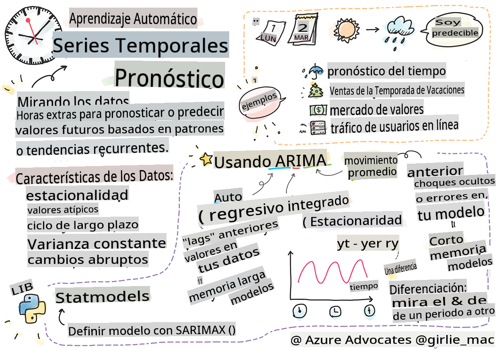
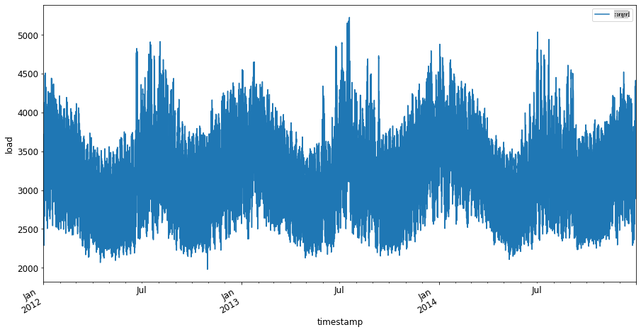
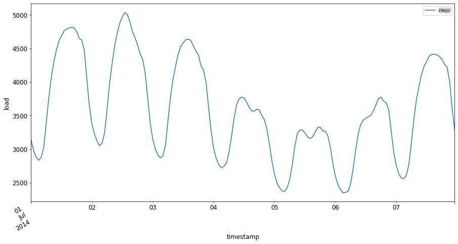

# Introducción a la predicción de series temporales



> Sketchnote por [Tomomi Imura](https://www.twitter.com/girlie_mac)

En esta lección y la siguiente, aprenderás un poco sobre la predicción de series temporales, una parte interesante y valiosa del repertorio de un científico de ML que es un poco menos conocida que otros temas. La predicción de series temporales es una especie de 'bola de cristal': basada en el rendimiento pasado de una variable como el precio, puedes predecir su valor potencial futuro.

[](https://youtu.be/cBojo1hsHiI "Introducción a la predicción de series temporales")

> 🎥 Haz clic en la imagen de arriba para ver un video sobre la predicción de series temporales

## [Cuestionario previo a la lección](https://gray-sand-07a10f403.1.azurestaticapps.net/quiz/41/)

Es un campo útil e interesante con un valor real para los negocios, dada su aplicación directa a problemas de precios, inventarios y problemas de la cadena de suministro. Aunque las técnicas de aprendizaje profundo han comenzado a usarse para obtener más información y predecir mejor el rendimiento futuro, la predicción de series temporales sigue siendo un campo muy informado por técnicas clásicas de ML.

> El útil plan de estudios de series temporales de Penn State se puede encontrar [aquí](https://online.stat.psu.edu/stat510/lesson/1)

## Introducción

Supón que mantienes una serie de parquímetros inteligentes que proporcionan datos sobre con qué frecuencia se utilizan y por cuánto tiempo a lo largo del tiempo.

> ¿Qué pasaría si pudieras predecir, basándote en el rendimiento pasado del parquímetro, su valor futuro de acuerdo con las leyes de oferta y demanda?

Predecir con precisión cuándo actuar para lograr tu objetivo es un desafío que podría abordarse mediante la predicción de series temporales. ¡No haría feliz a la gente que se les cobrara más en momentos de alta demanda cuando están buscando un lugar para estacionar, pero sería una forma segura de generar ingresos para limpiar las calles!

Vamos a explorar algunos de los tipos de algoritmos de series temporales y comenzar un cuaderno para limpiar y preparar algunos datos. Los datos que analizarás están tomados de la competencia de predicción GEFCom2014. Consisten en 3 años de carga eléctrica horaria y valores de temperatura entre 2012 y 2014. Dado los patrones históricos de carga eléctrica y temperatura, puedes predecir los valores futuros de carga eléctrica.

En este ejemplo, aprenderás cómo predecir un paso temporal adelante, utilizando solo datos históricos de carga. Sin embargo, antes de comenzar, es útil entender qué está sucediendo detrás de escena.

## Algunas definiciones

Cuando encuentres el término 'serie temporal' necesitas entender su uso en varios contextos diferentes.

🎓 **Serie temporal**

En matemáticas, "una serie temporal es una serie de puntos de datos indexados (o listados o graficados) en orden temporal. Más comúnmente, una serie temporal es una secuencia tomada en puntos de tiempo sucesivos equidistantes." Un ejemplo de una serie temporal es el valor de cierre diario del [Promedio Industrial Dow Jones](https://wikipedia.org/wiki/Time_series). El uso de gráficos de series temporales y modelado estadístico se encuentra frecuentemente en procesamiento de señales, predicción del clima, predicción de terremotos y otros campos donde ocurren eventos y se pueden graficar puntos de datos a lo largo del tiempo.

🎓 **Análisis de series temporales**

El análisis de series temporales es el análisis de los datos de series temporales mencionados anteriormente. Los datos de series temporales pueden tomar formas distintas, incluyendo 'series temporales interrumpidas' que detectan patrones en la evolución de una serie temporal antes y después de un evento interruptor. El tipo de análisis necesario para la serie temporal depende de la naturaleza de los datos. Los datos de series temporales en sí pueden tomar la forma de series de números o caracteres.

El análisis a realizar utiliza una variedad de métodos, incluyendo dominio de frecuencia y dominio de tiempo, lineal y no lineal, y más. [Aprende más](https://www.itl.nist.gov/div898/handbook/pmc/section4/pmc4.htm) sobre las muchas formas de analizar este tipo de datos.

🎓 **Predicción de series temporales**

La predicción de series temporales es el uso de un modelo para predecir valores futuros basados en patrones mostrados por datos previamente recopilados tal como ocurrieron en el pasado. Aunque es posible usar modelos de regresión para explorar datos de series temporales, con índices de tiempo como variables x en un gráfico, tales datos se analizan mejor utilizando tipos especiales de modelos.

Los datos de series temporales son una lista de observaciones ordenadas, a diferencia de los datos que pueden analizarse mediante regresión lineal. El más común es ARIMA, un acrónimo que significa "Promedio Móvil Integrado Autoregresivo".

[Modelos ARIMA](https://online.stat.psu.edu/stat510/lesson/1/1.1) "relacionan el valor presente de una serie con valores pasados y errores de predicción pasados." Son más apropiados para analizar datos de dominio temporal, donde los datos están ordenados a lo largo del tiempo.

> Hay varios tipos de modelos ARIMA, que puedes aprender [aquí](https://people.duke.edu/~rnau/411arim.htm) y que tocarás en la próxima lección.

En la próxima lección, construirás un modelo ARIMA utilizando [Series Temporales Univariadas](https://itl.nist.gov/div898/handbook/pmc/section4/pmc44.htm), que se enfoca en una variable que cambia su valor a lo largo del tiempo. Un ejemplo de este tipo de datos es [este conjunto de datos](https://itl.nist.gov/div898/handbook/pmc/section4/pmc4411.htm) que registra la concentración mensual de CO2 en el Observatorio Mauna Loa:

|  CO2   | YearMonth | Year  | Month |
| :----: | :-------: | :---: | :---: |
| 330.62 |  1975.04  | 1975  |   1   |
| 331.40 |  1975.13  | 1975  |   2   |
| 331.87 |  1975.21  | 1975  |   3   |
| 333.18 |  1975.29  | 1975  |   4   |
| 333.92 |  1975.38  | 1975  |   5   |
| 333.43 |  1975.46  | 1975  |   6   |
| 331.85 |  1975.54  | 1975  |   7   |
| 330.01 |  1975.63  | 1975  |   8   |
| 328.51 |  1975.71  | 1975  |   9   |
| 328.41 |  1975.79  | 1975  |  10   |
| 329.25 |  1975.88  | 1975  |  11   |
| 330.97 |  1975.96  | 1975  |  12   |

✅ Identifica la variable que cambia a lo largo del tiempo en este conjunto de datos

## Características de los datos de series temporales a considerar

Al observar los datos de series temporales, podrías notar que tienen [ciertas características](https://online.stat.psu.edu/stat510/lesson/1/1.1) que necesitas tener en cuenta y mitigar para comprender mejor sus patrones. Si consideras los datos de series temporales como potencialmente proporcionando una 'señal' que deseas analizar, estas características pueden considerarse 'ruido'. A menudo necesitarás reducir este 'ruido' compensando algunas de estas características utilizando algunas técnicas estadísticas.

Aquí hay algunos conceptos que debes conocer para poder trabajar con series temporales:

🎓 **Tendencias**

Las tendencias se definen como aumentos y disminuciones medibles a lo largo del tiempo. [Lee más](https://machinelearningmastery.com/time-series-trends-in-python). En el contexto de las series temporales, se trata de cómo usar y, si es necesario, eliminar las tendencias de tu serie temporal.

🎓 **[Estacionalidad](https://machinelearningmastery.com/time-series-seasonality-with-python/)**

La estacionalidad se define como fluctuaciones periódicas, como las temporadas de compras navideñas que podrían afectar las ventas, por ejemplo. [Echa un vistazo](https://itl.nist.gov/div898/handbook/pmc/section4/pmc443.htm) a cómo diferentes tipos de gráficos muestran la estacionalidad en los datos.

🎓 **Valores atípicos**

Los valores atípicos están muy alejados de la varianza estándar de los datos.

🎓 **Ciclo a largo plazo**

Independientemente de la estacionalidad, los datos podrían mostrar un ciclo a largo plazo, como una recesión económica que dura más de un año.

🎓 **Varianza constante**

Con el tiempo, algunos datos muestran fluctuaciones constantes, como el uso de energía por día y noche.

🎓 **Cambios abruptos**

Los datos podrían mostrar un cambio abrupto que podría necesitar un análisis más detallado. El cierre abrupto de negocios debido al COVID, por ejemplo, causó cambios en los datos.

✅ Aquí hay un [ejemplo de gráfico de series temporales](https://www.kaggle.com/kashnitsky/topic-9-part-1-time-series-analysis-in-python) que muestra el gasto diario en moneda dentro del juego durante algunos años. ¿Puedes identificar alguna de las características mencionadas anteriormente en estos datos?


## Ejercicio - comenzando con datos de uso de energía

Vamos a comenzar creando un modelo de series temporales para predecir el uso futuro de energía dado el uso pasado.

> Los datos en este ejemplo están tomados de la competencia de predicción GEFCom2014. Consisten en 3 años de carga eléctrica horaria y valores de temperatura entre 2012 y 2014.
>
> Tao Hong, Pierre Pinson, Shu Fan, Hamidreza Zareipour, Alberto Troccoli y Rob J. Hyndman, "Predicción probabilística de energía: Competencia de predicción de energía global 2014 y más allá", International Journal of Forecasting, vol.32, no.3, pp 896-913, julio-septiembre, 2016.

1. En la carpeta `working` de esta lección, abre el archivo _notebook.ipynb_. Comienza agregando bibliotecas que te ayudarán a cargar y visualizar datos

    ```python
    import os
    import matplotlib.pyplot as plt
    from common.utils import load_data
    %matplotlib inline
    ```

    Nota, estás usando los archivos del `common` folder which set up your environment and handle downloading the data.

2. Next, examine the data as a dataframe calling `load_data()` and `head()` incluidos:

    ```python
    data_dir = './data'
    energy = load_data(data_dir)[['load']]
    energy.head()
    ```

    Puedes ver que hay dos columnas que representan fecha y carga:

    |                     |  load  |
    | :-----------------: | :----: |
    | 2012-01-01 00:00:00 | 2698.0 |
    | 2012-01-01 01:00:00 | 2558.0 |
    | 2012-01-01 02:00:00 | 2444.0 |
    | 2012-01-01 03:00:00 | 2402.0 |
    | 2012-01-01 04:00:00 | 2403.0 |

3. Ahora, grafica los datos llamando a `plot()`:

    ```python
    energy.plot(y='load', subplots=True, figsize=(15, 8), fontsize=12)
    plt.xlabel('timestamp', fontsize=12)
    plt.ylabel('load', fontsize=12)
    plt.show()
    ```

    

4. Ahora, grafica la primera semana de julio de 2014, proporcionándola como entrada al patrón `energy` in `[from date]: [to date]`:

    ```python
    energy['2014-07-01':'2014-07-07'].plot(y='load', subplots=True, figsize=(15, 8), fontsize=12)
    plt.xlabel('timestamp', fontsize=12)
    plt.ylabel('load', fontsize=12)
    plt.show()
    ```

    

    ¡Un gráfico hermoso! Echa un vistazo a estos gráficos y ve si puedes determinar alguna de las características mencionadas anteriormente. ¿Qué podemos deducir visualizando los datos?

En la próxima lección, crearás un modelo ARIMA para hacer algunas predicciones.

---

## 🚀Desafío

Haz una lista de todas las industrias y áreas de investigación que puedas pensar que se beneficiarían de la predicción de series temporales. ¿Puedes pensar en una aplicación de estas técnicas en las artes? ¿En Econometría? ¿Ecología? ¿Comercio minorista? ¿Industria? ¿Finanzas? ¿Dónde más?

## [Cuestionario posterior a la lección](https://gray-sand-07a10f403.1.azurestaticapps.net/quiz/42/)

## Repaso y autoestudio

Aunque no los cubriremos aquí, las redes neuronales a veces se usan para mejorar los métodos clásicos de predicción de series temporales. Lee más sobre ellas [en este artículo](https://medium.com/microsoftazure/neural-networks-for-forecasting-financial-and-economic-time-series-6aca370ff412)

## Tarea

[Visualiza algunas series temporales más](assignment.md)

**Descargo de responsabilidad**:
Este documento ha sido traducido utilizando servicios de traducción automática basados en inteligencia artificial. Si bien nos esforzamos por lograr precisión, tenga en cuenta que las traducciones automáticas pueden contener errores o imprecisiones. El documento original en su idioma nativo debe considerarse la fuente autorizada. Para información crítica, se recomienda una traducción profesional realizada por humanos. No somos responsables de ningún malentendido o interpretación errónea que surja del uso de esta traducción.