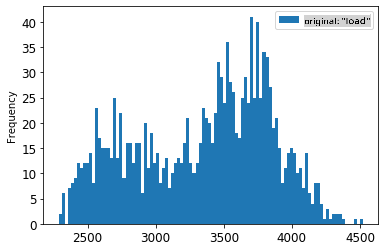

# Pronóstico de series temporales con ARIMA

En la lección anterior, aprendiste un poco sobre el pronóstico de series temporales y cargaste un conjunto de datos que muestra las fluctuaciones de la carga eléctrica a lo largo de un período de tiempo.

[](https://youtu.be/IUSk-YDau10 "Introducción a ARIMA")

> 🎥 Haz clic en la imagen de arriba para ver un video: Una breve introducción a los modelos ARIMA. El ejemplo está hecho en R, pero los conceptos son universales.

## [Cuestionario previo a la lección](https://gray-sand-07a10f403.1.azurestaticapps.net/quiz/43/)

## Introducción

En esta lección, descubrirás una forma específica de construir modelos con [ARIMA: *A*uto*R*egressive *I*ntegrated *M*oving *A*verage](https://wikipedia.org/wiki/Autoregressive_integrated_moving_average). Los modelos ARIMA son particularmente adecuados para ajustar datos que muestran [no estacionariedad](https://wikipedia.org/wiki/Stationary_process).

## Conceptos generales

Para poder trabajar con ARIMA, hay algunos conceptos que necesitas conocer:

- 🎓 **Estacionariedad**. Desde un contexto estadístico, la estacionariedad se refiere a datos cuya distribución no cambia cuando se desplazan en el tiempo. Los datos no estacionarios, entonces, muestran fluctuaciones debido a tendencias que deben transformarse para ser analizadas. La estacionalidad, por ejemplo, puede introducir fluctuaciones en los datos y puede eliminarse mediante un proceso de 'diferenciación estacional'.

- 🎓 **[Diferenciación](https://wikipedia.org/wiki/Autoregressive_integrated_moving_average#Differencing)**. Diferenciar datos, nuevamente desde un contexto estadístico, se refiere al proceso de transformar datos no estacionarios para hacerlos estacionarios eliminando su tendencia no constante. "La diferenciación elimina los cambios en el nivel de una serie temporal, eliminando la tendencia y la estacionalidad y, en consecuencia, estabilizando la media de la serie temporal." [Documento de Shixiong et al](https://arxiv.org/abs/1904.07632)

## ARIMA en el contexto de series temporales

Desglosamos las partes de ARIMA para entender mejor cómo nos ayuda a modelar series temporales y nos ayuda a hacer predicciones.

- **AR - de AutoRegresivo**. Los modelos autorregresivos, como su nombre indica, miran 'hacia atrás' en el tiempo para analizar valores anteriores en tus datos y hacer suposiciones sobre ellos. Estos valores anteriores se llaman 'rezagos'. Un ejemplo sería datos que muestran ventas mensuales de lápices. El total de ventas de cada mes se consideraría una 'variable evolutiva' en el conjunto de datos. Este modelo se construye como "la variable evolutiva de interés se regresa sobre sus propios valores rezagados (es decir, anteriores)." [wikipedia](https://wikipedia.org/wiki/Autoregressive_integrated_moving_average)

- **I - de Integrado**. A diferencia de los modelos similares 'ARMA', la 'I' en ARIMA se refiere a su aspecto *[integrado](https://wikipedia.org/wiki/Order_of_integration)*. Los datos se 'integran' cuando se aplican pasos de diferenciación para eliminar la no estacionariedad.

- **MA - de Promedio Móvil**. El aspecto de [promedio móvil](https://wikipedia.org/wiki/Moving-average_model) de este modelo se refiere a la variable de salida que se determina observando los valores actuales y pasados de los rezagos.

En resumen: ARIMA se usa para ajustar un modelo lo más cerca posible a la forma especial de los datos de series temporales.

## Ejercicio - construir un modelo ARIMA

Abre la carpeta [_/working_](https://github.com/microsoft/ML-For-Beginners/tree/main/7-TimeSeries/2-ARIMA/working) en esta lección y encuentra el archivo [_notebook.ipynb_](https://github.com/microsoft/ML-For-Beginners/blob/main/7-TimeSeries/2-ARIMA/working/notebook.ipynb).

1. Ejecuta el notebook para cargar la biblioteca de Python `statsmodels`; necesitarás esto para los modelos ARIMA.

1. Carga las bibliotecas necesarias

1. Ahora, carga varias bibliotecas más útiles para graficar datos:

    ```python
    import os
    import warnings
    import matplotlib.pyplot as plt
    import numpy as np
    import pandas as pd
    import datetime as dt
    import math

    from pandas.plotting import autocorrelation_plot
    from statsmodels.tsa.statespace.sarimax import SARIMAX
    from sklearn.preprocessing import MinMaxScaler
    from common.utils import load_data, mape
    from IPython.display import Image

    %matplotlib inline
    pd.options.display.float_format = '{:,.2f}'.format
    np.set_printoptions(precision=2)
    warnings.filterwarnings("ignore") # specify to ignore warning messages
    ```

1. Carga los datos del archivo `/data/energy.csv` en un dataframe de Pandas y échale un vistazo:

    ```python
    energy = load_data('./data')[['load']]
    energy.head(10)
    ```

1. Grafica todos los datos de energía disponibles desde enero de 2012 hasta diciembre de 2014. No debería haber sorpresas, ya que vimos estos datos en la última lección:

    ```python
    energy.plot(y='load', subplots=True, figsize=(15, 8), fontsize=12)
    plt.xlabel('timestamp', fontsize=12)
    plt.ylabel('load', fontsize=12)
    plt.show()
    ```

    ¡Ahora, vamos a construir un modelo!

### Crear conjuntos de datos de entrenamiento y prueba

Ahora que tus datos están cargados, puedes separarlos en conjuntos de entrenamiento y prueba. Entrenarás tu modelo en el conjunto de entrenamiento. Como de costumbre, después de que el modelo haya terminado de entrenarse, evaluarás su precisión usando el conjunto de prueba. Necesitas asegurarte de que el conjunto de prueba cubra un período posterior en el tiempo al del conjunto de entrenamiento para asegurarte de que el modelo no obtenga información de períodos futuros.

1. Asigna un período de dos meses desde el 1 de septiembre hasta el 31 de octubre de 2014 al conjunto de entrenamiento. El conjunto de prueba incluirá el período de dos meses del 1 de noviembre al 31 de diciembre de 2014:

    ```python
    train_start_dt = '2014-11-01 00:00:00'
    test_start_dt = '2014-12-30 00:00:00'
    ```

    Dado que estos datos reflejan el consumo diario de energía, hay un fuerte patrón estacional, pero el consumo es más similar al consumo en días más recientes.

1. Visualiza las diferencias:

    ```python
    energy[(energy.index < test_start_dt) & (energy.index >= train_start_dt)][['load']].rename(columns={'load':'train'}) \
        .join(energy[test_start_dt:][['load']].rename(columns={'load':'test'}), how='outer') \
        .plot(y=['train', 'test'], figsize=(15, 8), fontsize=12)
    plt.xlabel('timestamp', fontsize=12)
    plt.ylabel('load', fontsize=12)
    plt.show()
    ```

    

    Por lo tanto, usar una ventana de tiempo relativamente pequeña para entrenar los datos debería ser suficiente.

    > Nota: Dado que la función que usamos para ajustar el modelo ARIMA utiliza validación en la muestra durante el ajuste, omitiremos los datos de validación.

### Preparar los datos para el entrenamiento

Ahora, necesitas preparar los datos para el entrenamiento realizando el filtrado y escalado de tus datos. Filtra tu conjunto de datos para incluir solo los períodos de tiempo y columnas que necesitas, y escala para asegurarte de que los datos se proyecten en el intervalo 0,1.

1. Filtra el conjunto de datos original para incluir solo los períodos de tiempo mencionados por conjunto y solo incluye la columna necesaria 'load' más la fecha:

    ```python
    train = energy.copy()[(energy.index >= train_start_dt) & (energy.index < test_start_dt)][['load']]
    test = energy.copy()[energy.index >= test_start_dt][['load']]

    print('Training data shape: ', train.shape)
    print('Test data shape: ', test.shape)
    ```

    Puedes ver la forma de los datos:

    ```output
    Training data shape:  (1416, 1)
    Test data shape:  (48, 1)
    ```

1. Escala los datos para que estén en el rango (0, 1).

    ```python
    scaler = MinMaxScaler()
    train['load'] = scaler.fit_transform(train)
    train.head(10)
    ```

1. Visualiza los datos originales vs. los escalados:

    ```python
    energy[(energy.index >= train_start_dt) & (energy.index < test_start_dt)][['load']].rename(columns={'load':'original load'}).plot.hist(bins=100, fontsize=12)
    train.rename(columns={'load':'scaled load'}).plot.hist(bins=100, fontsize=12)
    plt.show()
    ```

    

    > Los datos originales

    

    > Los datos escalados

1. Ahora que has calibrado los datos escalados, puedes escalar los datos de prueba:

    ```python
    test['load'] = scaler.transform(test)
    test.head()
    ```

### Implementar ARIMA

¡Es hora de implementar ARIMA! Ahora usarás la biblioteca `statsmodels` que instalaste anteriormente.

Ahora necesitas seguir varios pasos

   1. Define el modelo llamando a `SARIMAX()` and passing in the model parameters: p, d, and q parameters, and P, D, and Q parameters.
   2. Prepare the model for the training data by calling the fit() function.
   3. Make predictions calling the `forecast()` function and specifying the number of steps (the `horizon`) to forecast.

> 🎓 What are all these parameters for? In an ARIMA model there are 3 parameters that are used to help model the major aspects of a time series: seasonality, trend, and noise. These parameters are:

`p`: the parameter associated with the auto-regressive aspect of the model, which incorporates *past* values.
`d`: the parameter associated with the integrated part of the model, which affects the amount of *differencing* (🎓 remember differencing 👆?) to apply to a time series.
`q`: the parameter associated with the moving-average part of the model.

> Note: If your data has a seasonal aspect - which this one does - , we use a seasonal ARIMA model (SARIMA). In that case you need to use another set of parameters: `P`, `D`, and `Q` which describe the same associations as `p`, `d`, and `q`, pero corresponden a los componentes estacionales del modelo.

1. Comienza configurando tu valor de horizonte preferido. Probemos 3 horas:

    ```python
    # Specify the number of steps to forecast ahead
    HORIZON = 3
    print('Forecasting horizon:', HORIZON, 'hours')
    ```

    Seleccionar los mejores valores para los parámetros de un modelo ARIMA puede ser un desafío, ya que es algo subjetivo y requiere tiempo. Podrías considerar usar una biblioteca `auto_arima()` function from the [`pyramid` library](https://alkaline-ml.com/pmdarima/0.9.0/modules/generated/pyramid.arima.auto_arima.html),

1. Por ahora, prueba algunas selecciones manuales para encontrar un buen modelo.

    ```python
    order = (4, 1, 0)
    seasonal_order = (1, 1, 0, 24)

    model = SARIMAX(endog=train, order=order, seasonal_order=seasonal_order)
    results = model.fit()

    print(results.summary())
    ```

    Se imprime una tabla de resultados.

¡Has construido tu primer modelo! Ahora necesitamos encontrar una manera de evaluarlo.

### Evaluar tu modelo

Para evaluar tu modelo, puedes realizar la llamada validación `walk forward`. En la práctica, los modelos de series temporales se reentrenan cada vez que se dispone de nuevos datos. Esto permite que el modelo haga la mejor predicción en cada paso de tiempo.

Comenzando desde el principio de la serie temporal usando esta técnica, entrena el modelo en el conjunto de datos de entrenamiento. Luego haz una predicción en el siguiente paso de tiempo. La predicción se evalúa en función del valor conocido. Luego, el conjunto de entrenamiento se expande para incluir el valor conocido y se repite el proceso.

> Nota: Debes mantener fija la ventana del conjunto de entrenamiento para un entrenamiento más eficiente, de modo que cada vez que agregues una nueva observación al conjunto de entrenamiento, elimines la observación del comienzo del conjunto.

Este proceso proporciona una estimación más robusta de cómo se desempeñará el modelo en la práctica. Sin embargo, tiene el costo computacional de crear tantos modelos. Esto es aceptable si los datos son pequeños o si el modelo es simple, pero podría ser un problema a gran escala.

La validación walk-forward es el estándar de oro de la evaluación de modelos de series temporales y se recomienda para tus propios proyectos.

1. Primero, crea un punto de datos de prueba para cada paso de HORIZON.

    ```python
    test_shifted = test.copy()

    for t in range(1, HORIZON+1):
        test_shifted['load+'+str(t)] = test_shifted['load'].shift(-t, freq='H')

    test_shifted = test_shifted.dropna(how='any')
    test_shifted.head(5)
    ```

    |            |          | load | load+1 | load+2 |
    | ---------- | -------- | ---- | ------ | ------ |
    | 2014-12-30 | 00:00:00 | 0.33 | 0.29   | 0.27   |
    | 2014-12-30 | 01:00:00 | 0.29 | 0.27   | 0.27   |
    | 2014-12-30 | 02:00:00 | 0.27 | 0.27   | 0.30   |
    | 2014-12-30 | 03:00:00 | 0.27 | 0.30   | 0.41   |
    | 2014-12-30 | 04:00:00 | 0.30 | 0.41   | 0.57   |

    Los datos se desplazan horizontalmente según su punto de horizonte.

1. Haz predicciones en tus datos de prueba usando este enfoque de ventana deslizante en un bucle del tamaño de la longitud de los datos de prueba:

    ```python
    %%time
    training_window = 720 # dedicate 30 days (720 hours) for training

    train_ts = train['load']
    test_ts = test_shifted

    history = [x for x in train_ts]
    history = history[(-training_window):]

    predictions = list()

    order = (2, 1, 0)
    seasonal_order = (1, 1, 0, 24)

    for t in range(test_ts.shape[0]):
        model = SARIMAX(endog=history, order=order, seasonal_order=seasonal_order)
        model_fit = model.fit()
        yhat = model_fit.forecast(steps = HORIZON)
        predictions.append(yhat)
        obs = list(test_ts.iloc[t])
        # move the training window
        history.append(obs[0])
        history.pop(0)
        print(test_ts.index[t])
        print(t+1, ': predicted =', yhat, 'expected =', obs)
    ```

    Puedes ver el entrenamiento ocurriendo:

    ```output
    2014-12-30 00:00:00
    1 : predicted = [0.32 0.29 0.28] expected = [0.32945389435989236, 0.2900626678603402, 0.2739480752014323]

    2014-12-30 01:00:00
    2 : predicted = [0.3  0.29 0.3 ] expected = [0.2900626678603402, 0.2739480752014323, 0.26812891674127126]

    2014-12-30 02:00:00
    3 : predicted = [0.27 0.28 0.32] expected = [0.2739480752014323, 0.26812891674127126, 0.3025962399283795]
    ```

1. Compara las predicciones con la carga real:

    ```python
    eval_df = pd.DataFrame(predictions, columns=['t+'+str(t) for t in range(1, HORIZON+1)])
    eval_df['timestamp'] = test.index[0:len(test.index)-HORIZON+1]
    eval_df = pd.melt(eval_df, id_vars='timestamp', value_name='prediction', var_name='h')
    eval_df['actual'] = np.array(np.transpose(test_ts)).ravel()
    eval_df[['prediction', 'actual']] = scaler.inverse_transform(eval_df[['prediction', 'actual']])
    eval_df.head()
    ```

    Salida
    |     |            | timestamp | h   | prediction | actual   |
    | --- | ---------- | --------- | --- | ---------- | -------- |
    | 0   | 2014-12-30 | 00:00:00  | t+1 | 3,008.74   | 3,023.00 |
    | 1   | 2014-12-30 | 01:00:00  | t+1 | 2,955.53   | 2,935.00 |
    | 2   | 2014-12-30 | 02:00:00  | t+1 | 2,900.17   | 2,899.00 |
    | 3   | 2014-12-30 | 03:00:00  | t+1 | 2,917.69   | 2,886.00 |
    | 4   | 2014-12-30 | 04:00:00  | t+1 | 2,946.99   | 2,963.00 |

    Observa la predicción de los datos horarios, en comparación con la carga real. ¿Qué tan precisa es?

### Verificar la precisión del modelo

Verifica la precisión de tu modelo probando su error porcentual absoluto medio (MAPE) sobre todas las predicciones.

> **🧮 Muéstrame las matemáticas**
>
> 
>
>  [MAPE](https://www.linkedin.com/pulse/what-mape-mad-msd-time-series-allameh-statistics/) se utiliza para mostrar la precisión de la predicción como una proporción definida por la fórmula anterior. La diferencia entre actual<sub>t</sub> y predicho<sub>t</sub> se divide por el actual<sub>t</sub>. "El valor absoluto en este cálculo se suma para cada punto de pronóstico en el tiempo y se divide por el número de puntos ajustados n." [wikipedia](https://wikipedia.org/wiki/Mean_absolute_percentage_error)

1. Expresa la ecuación en código:

    ```python
    if(HORIZON > 1):
        eval_df['APE'] = (eval_df['prediction'] - eval_df['actual']).abs() / eval_df['actual']
        print(eval_df.groupby('h')['APE'].mean())
    ```

1. Calcula el MAPE de un paso:

    ```python
    print('One step forecast MAPE: ', (mape(eval_df[eval_df['h'] == 't+1']['prediction'], eval_df[eval_df['h'] == 't+1']['actual']))*100, '%')
    ```

    MAPE de pronóstico de un paso:  0.5570581332313952 %

1. Imprime el MAPE de pronóstico de múltiples pasos:

    ```python
    print('Multi-step forecast MAPE: ', mape(eval_df['prediction'], eval_df['actual'])*100, '%')
    ```

    ```output
    Multi-step forecast MAPE:  1.1460048657704118 %
    ```

    Un número bajo es mejor: considera que un pronóstico que tiene un MAPE de 10 está desviado en un 10%.

1. Pero como siempre, es más fácil ver este tipo de medición de precisión visualmente, así que vamos a graficarlo:

    ```python
     if(HORIZON == 1):
        ## Plotting single step forecast
        eval_df.plot(x='timestamp', y=['actual', 'prediction'], style=['r', 'b'], figsize=(15, 8))

    else:
        ## Plotting multi step forecast
        plot_df = eval_df[(eval_df.h=='t+1')][['timestamp', 'actual']]
        for t in range(1, HORIZON+1):
            plot_df['t+'+str(t)] = eval_df[(eval_df.h=='t+'+str(t))]['prediction'].values

        fig = plt.figure(figsize=(15, 8))
        ax = plt.plot(plot_df['timestamp'], plot_df['actual'], color='red', linewidth=4.0)
        ax = fig.add_subplot(111)
        for t in range(1, HORIZON+1):
            x = plot_df['timestamp'][(t-1):]
            y = plot_df['t+'+str(t)][0:len(x)]
            ax.plot(x, y, color='blue', linewidth=4*math.pow(.9,t), alpha=math.pow(0.8,t))

        ax.legend(loc='best')

    plt.xlabel('timestamp', fontsize=12)
    plt.ylabel('load', fontsize=12)
    plt.show()
    ```

    

🏆 Una gráfica muy bonita, que muestra un modelo con buena precisión. ¡Bien hecho!

---

## 🚀Desafío

Investiga las formas de probar la precisión de un modelo de series temporales. Tocamos el MAPE en esta lección, pero ¿hay otros métodos que podrías usar? Investígalos y anótalos. Un documento útil se puede encontrar [aquí](https://otexts.com/fpp2/accuracy.html)

## [Cuestionario posterior a la lección](https://gray-sand-07a10f403.1.azurestaticapps.net/quiz/44/)

## Repaso y autoestudio

Esta lección toca solo lo básico del pronóstico de series temporales con ARIMA. Tómate un tiempo para profundizar tu conocimiento explorando [este repositorio](https://microsoft.github.io/forecasting/) y sus diversos tipos de modelos para aprender otras formas de construir modelos de series temporales.

## Tarea

[Un nuevo modelo ARIMA](assignment.md)

**Descargo de responsabilidad**:
Este documento ha sido traducido utilizando servicios de traducción automática por IA. Si bien nos esforzamos por lograr precisión, tenga en cuenta que las traducciones automáticas pueden contener errores o imprecisiones. El documento original en su idioma nativo debe considerarse la fuente autorizada. Para información crítica, se recomienda la traducción profesional humana. No somos responsables de ningún malentendido o interpretación errónea que surja del uso de esta traducción.