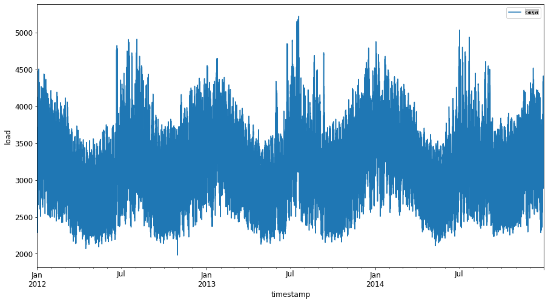
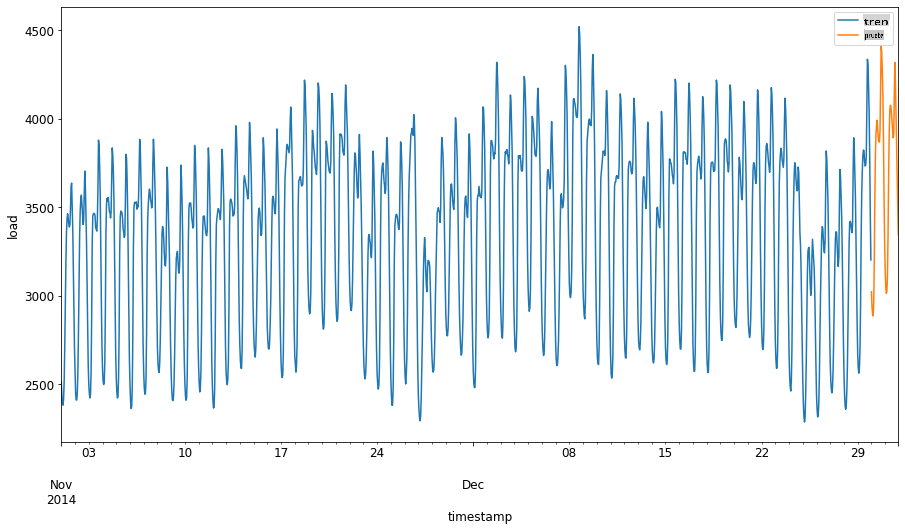
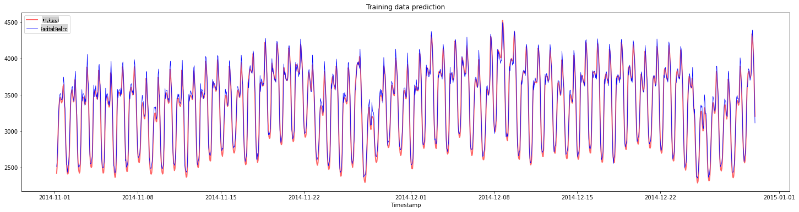
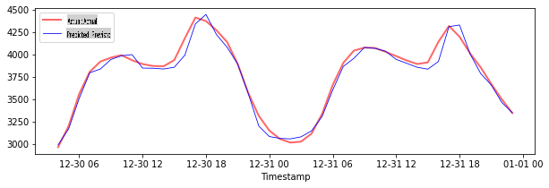
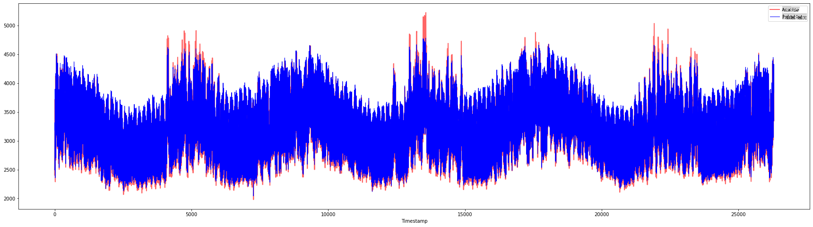

<!--
CO_OP_TRANSLATOR_METADATA:
{
  "original_hash": "f80e513b3279869e7661e3190cc83076",
  "translation_date": "2025-09-03T22:53:22+00:00",
  "source_file": "7-TimeSeries/3-SVR/README.md",
  "language_code": "es"
}
-->
# Pronóstico de Series Temporales con Support Vector Regressor

En la lección anterior, aprendiste a usar el modelo ARIMA para realizar predicciones de series temporales. Ahora exploraremos el modelo Support Vector Regressor, que es un modelo de regresión utilizado para predecir datos continuos.

## [Cuestionario previo a la lección](https://gray-sand-07a10f403.1.azurestaticapps.net/quiz/51/) 

## Introducción

En esta lección, descubrirás una forma específica de construir modelos con [**SVM**: **S**upport **V**ector **M**achine](https://en.wikipedia.org/wiki/Support-vector_machine) para regresión, o **SVR: Support Vector Regressor**. 

### SVR en el contexto de series temporales [^1]

Antes de entender la importancia de SVR en la predicción de series temporales, aquí tienes algunos conceptos importantes que necesitas conocer:

- **Regresión:** Técnica de aprendizaje supervisado para predecir valores continuos a partir de un conjunto de entradas. La idea es ajustar una curva (o línea) en el espacio de características que tenga el mayor número de puntos de datos. [Haz clic aquí](https://en.wikipedia.org/wiki/Regression_analysis) para más información.
- **Support Vector Machine (SVM):** Un tipo de modelo de aprendizaje supervisado utilizado para clasificación, regresión y detección de valores atípicos. El modelo es un hiperplano en el espacio de características, que en el caso de la clasificación actúa como un límite, y en el caso de la regresión actúa como la línea de mejor ajuste. En SVM, generalmente se utiliza una función Kernel para transformar el conjunto de datos a un espacio de mayor número de dimensiones, de modo que puedan ser fácilmente separables. [Haz clic aquí](https://en.wikipedia.org/wiki/Support-vector_machine) para más información sobre SVMs.
- **Support Vector Regressor (SVR):** Un tipo de SVM, que encuentra la línea de mejor ajuste (que en el caso de SVM es un hiperplano) que tiene el mayor número de puntos de datos.

### ¿Por qué SVR? [^1]

En la última lección aprendiste sobre ARIMA, que es un método estadístico lineal muy exitoso para pronosticar datos de series temporales. Sin embargo, en muchos casos, los datos de series temporales tienen *no linealidad*, que no puede ser modelada por modelos lineales. En tales casos, la capacidad de SVM para considerar la no linealidad en los datos para tareas de regresión hace que SVR sea exitoso en el pronóstico de series temporales.

## Ejercicio - construir un modelo SVR

Los primeros pasos para la preparación de datos son los mismos que en la lección anterior sobre [ARIMA](https://github.com/microsoft/ML-For-Beginners/tree/main/7-TimeSeries/2-ARIMA). 

Abre la carpeta [_/working_](https://github.com/microsoft/ML-For-Beginners/tree/main/7-TimeSeries/3-SVR/working) en esta lección y encuentra el archivo [_notebook.ipynb_](https://github.com/microsoft/ML-For-Beginners/blob/main/7-TimeSeries/3-SVR/working/notebook.ipynb). [^2]

1. Ejecuta el notebook e importa las bibliotecas necesarias: [^2]

   ```python
   import sys
   sys.path.append('../../')
   ```

   ```python
   import os
   import warnings
   import matplotlib.pyplot as plt
   import numpy as np
   import pandas as pd
   import datetime as dt
   import math
   
   from sklearn.svm import SVR
   from sklearn.preprocessing import MinMaxScaler
   from common.utils import load_data, mape
   ```

2. Carga los datos del archivo `/data/energy.csv` en un dataframe de Pandas y échales un vistazo: [^2]

   ```python
   energy = load_data('../../data')[['load']]
   ```

3. Grafica todos los datos de energía disponibles desde enero de 2012 hasta diciembre de 2014: [^2]

   ```python
   energy.plot(y='load', subplots=True, figsize=(15, 8), fontsize=12)
   plt.xlabel('timestamp', fontsize=12)
   plt.ylabel('load', fontsize=12)
   plt.show()
   ```

   

   Ahora, construyamos nuestro modelo SVR.

### Crear conjuntos de entrenamiento y prueba

Ahora que tus datos están cargados, puedes separarlos en conjuntos de entrenamiento y prueba. Luego, reformatearás los datos para crear un conjunto de datos basado en pasos de tiempo que será necesario para el SVR. Entrenarás tu modelo en el conjunto de entrenamiento. Una vez que el modelo haya terminado de entrenarse, evaluarás su precisión en el conjunto de entrenamiento, el conjunto de prueba y luego en el conjunto de datos completo para ver el rendimiento general. Debes asegurarte de que el conjunto de prueba cubra un período posterior en el tiempo al conjunto de entrenamiento para garantizar que el modelo no obtenga información de períodos futuros [^2] (una situación conocida como *sobreajuste*).

1. Asigna un período de dos meses del 1 de septiembre al 31 de octubre de 2014 al conjunto de entrenamiento. El conjunto de prueba incluirá el período de dos meses del 1 de noviembre al 31 de diciembre de 2014: [^2]

   ```python
   train_start_dt = '2014-11-01 00:00:00'
   test_start_dt = '2014-12-30 00:00:00'
   ```

2. Visualiza las diferencias: [^2]

   ```python
   energy[(energy.index < test_start_dt) & (energy.index >= train_start_dt)][['load']].rename(columns={'load':'train'}) \
       .join(energy[test_start_dt:][['load']].rename(columns={'load':'test'}), how='outer') \
       .plot(y=['train', 'test'], figsize=(15, 8), fontsize=12)
   plt.xlabel('timestamp', fontsize=12)
   plt.ylabel('load', fontsize=12)
   plt.show()
   ```

   

### Preparar los datos para el entrenamiento

Ahora necesitas preparar los datos para el entrenamiento realizando un filtrado y escalado de tus datos. Filtra tu conjunto de datos para incluir solo los períodos de tiempo y columnas necesarios, y escala los datos para asegurarte de que estén proyectados en el intervalo 0,1.

1. Filtra el conjunto de datos original para incluir solo los períodos de tiempo mencionados por conjunto e incluyendo únicamente la columna 'load' más la fecha: [^2]

   ```python
   train = energy.copy()[(energy.index >= train_start_dt) & (energy.index < test_start_dt)][['load']]
   test = energy.copy()[energy.index >= test_start_dt][['load']]
   
   print('Training data shape: ', train.shape)
   print('Test data shape: ', test.shape)
   ```

   ```output
   Training data shape:  (1416, 1)
   Test data shape:  (48, 1)
   ```
   
2. Escala los datos de entrenamiento para que estén en el rango (0, 1): [^2]

   ```python
   scaler = MinMaxScaler()
   train['load'] = scaler.fit_transform(train)
   ```
   
4. Ahora, escala los datos de prueba: [^2]

   ```python
   test['load'] = scaler.transform(test)
   ```

### Crear datos con pasos de tiempo [^1]

Para el SVR, transformas los datos de entrada para que tengan la forma `[batch, timesteps]`. Por lo tanto, reformateas los `train_data` y `test_data` existentes de manera que haya una nueva dimensión que se refiera a los pasos de tiempo.

```python
# Converting to numpy arrays
train_data = train.values
test_data = test.values
```

En este ejemplo, tomamos `timesteps = 5`. Por lo tanto, las entradas al modelo son los datos de los primeros 4 pasos de tiempo, y la salida serán los datos del quinto paso de tiempo.

```python
timesteps=5
```

Convirtiendo los datos de entrenamiento a un tensor 2D usando comprensión de listas anidadas:

```python
train_data_timesteps=np.array([[j for j in train_data[i:i+timesteps]] for i in range(0,len(train_data)-timesteps+1)])[:,:,0]
train_data_timesteps.shape
```

```output
(1412, 5)
```

Convirtiendo los datos de prueba a un tensor 2D:

```python
test_data_timesteps=np.array([[j for j in test_data[i:i+timesteps]] for i in range(0,len(test_data)-timesteps+1)])[:,:,0]
test_data_timesteps.shape
```

```output
(44, 5)
```

Seleccionando entradas y salidas de los datos de entrenamiento y prueba:

```python
x_train, y_train = train_data_timesteps[:,:timesteps-1],train_data_timesteps[:,[timesteps-1]]
x_test, y_test = test_data_timesteps[:,:timesteps-1],test_data_timesteps[:,[timesteps-1]]

print(x_train.shape, y_train.shape)
print(x_test.shape, y_test.shape)
```

```output
(1412, 4) (1412, 1)
(44, 4) (44, 1)
```

### Implementar SVR [^1]

Ahora es momento de implementar SVR. Para leer más sobre esta implementación, puedes consultar [esta documentación](https://scikit-learn.org/stable/modules/generated/sklearn.svm.SVR.html). Para nuestra implementación, seguimos estos pasos:

  1. Define el modelo llamando a `SVR()` y pasando los hiperparámetros del modelo: kernel, gamma, c y epsilon.
  2. Prepara el modelo para los datos de entrenamiento llamando a la función `fit()`.
  3. Realiza predicciones llamando a la función `predict()`.

Ahora creamos un modelo SVR. Aquí usamos el [kernel RBF](https://scikit-learn.org/stable/modules/svm.html#parameters-of-the-rbf-kernel), y configuramos los hiperparámetros gamma, C y epsilon como 0.5, 10 y 0.05 respectivamente.

```python
model = SVR(kernel='rbf',gamma=0.5, C=10, epsilon = 0.05)
```

#### Ajustar el modelo a los datos de entrenamiento [^1]

```python
model.fit(x_train, y_train[:,0])
```

```output
SVR(C=10, cache_size=200, coef0=0.0, degree=3, epsilon=0.05, gamma=0.5,
    kernel='rbf', max_iter=-1, shrinking=True, tol=0.001, verbose=False)
```

#### Realizar predicciones con el modelo [^1]

```python
y_train_pred = model.predict(x_train).reshape(-1,1)
y_test_pred = model.predict(x_test).reshape(-1,1)

print(y_train_pred.shape, y_test_pred.shape)
```

```output
(1412, 1) (44, 1)
```

¡Has construido tu SVR! Ahora necesitamos evaluarlo.

### Evaluar tu modelo [^1]

Para la evaluación, primero escalaremos los datos de vuelta a su escala original. Luego, para verificar el rendimiento, graficaremos la serie temporal original y la predicha, y también imprimiremos el resultado de MAPE.

Escala la salida predicha y la original:

```python
# Scaling the predictions
y_train_pred = scaler.inverse_transform(y_train_pred)
y_test_pred = scaler.inverse_transform(y_test_pred)

print(len(y_train_pred), len(y_test_pred))
```

```python
# Scaling the original values
y_train = scaler.inverse_transform(y_train)
y_test = scaler.inverse_transform(y_test)

print(len(y_train), len(y_test))
```

#### Verificar el rendimiento del modelo en los datos de entrenamiento y prueba [^1]

Extraemos las marcas de tiempo del conjunto de datos para mostrarlas en el eje x de nuestro gráfico. Ten en cuenta que estamos usando los primeros ```timesteps-1``` valores como entrada para la primera salida, por lo que las marcas de tiempo para la salida comenzarán después de eso.

```python
train_timestamps = energy[(energy.index < test_start_dt) & (energy.index >= train_start_dt)].index[timesteps-1:]
test_timestamps = energy[test_start_dt:].index[timesteps-1:]

print(len(train_timestamps), len(test_timestamps))
```

```output
1412 44
```

Grafica las predicciones para los datos de entrenamiento:

```python
plt.figure(figsize=(25,6))
plt.plot(train_timestamps, y_train, color = 'red', linewidth=2.0, alpha = 0.6)
plt.plot(train_timestamps, y_train_pred, color = 'blue', linewidth=0.8)
plt.legend(['Actual','Predicted'])
plt.xlabel('Timestamp')
plt.title("Training data prediction")
plt.show()
```



Imprime MAPE para los datos de entrenamiento:

```python
print('MAPE for training data: ', mape(y_train_pred, y_train)*100, '%')
```

```output
MAPE for training data: 1.7195710200875551 %
```

Grafica las predicciones para los datos de prueba:

```python
plt.figure(figsize=(10,3))
plt.plot(test_timestamps, y_test, color = 'red', linewidth=2.0, alpha = 0.6)
plt.plot(test_timestamps, y_test_pred, color = 'blue', linewidth=0.8)
plt.legend(['Actual','Predicted'])
plt.xlabel('Timestamp')
plt.show()
```



Imprime MAPE para los datos de prueba:

```python
print('MAPE for testing data: ', mape(y_test_pred, y_test)*100, '%')
```

```output
MAPE for testing data:  1.2623790187854018 %
```

🏆 ¡Tienes un muy buen resultado en el conjunto de datos de prueba!

### Verificar el rendimiento del modelo en el conjunto de datos completo [^1]

```python
# Extracting load values as numpy array
data = energy.copy().values

# Scaling
data = scaler.transform(data)

# Transforming to 2D tensor as per model input requirement
data_timesteps=np.array([[j for j in data[i:i+timesteps]] for i in range(0,len(data)-timesteps+1)])[:,:,0]
print("Tensor shape: ", data_timesteps.shape)

# Selecting inputs and outputs from data
X, Y = data_timesteps[:,:timesteps-1],data_timesteps[:,[timesteps-1]]
print("X shape: ", X.shape,"\nY shape: ", Y.shape)
```

```output
Tensor shape:  (26300, 5)
X shape:  (26300, 4) 
Y shape:  (26300, 1)
```

```python
# Make model predictions
Y_pred = model.predict(X).reshape(-1,1)

# Inverse scale and reshape
Y_pred = scaler.inverse_transform(Y_pred)
Y = scaler.inverse_transform(Y)
```

```python
plt.figure(figsize=(30,8))
plt.plot(Y, color = 'red', linewidth=2.0, alpha = 0.6)
plt.plot(Y_pred, color = 'blue', linewidth=0.8)
plt.legend(['Actual','Predicted'])
plt.xlabel('Timestamp')
plt.show()
```



```python
print('MAPE: ', mape(Y_pred, Y)*100, '%')
```

```output
MAPE:  2.0572089029888656 %
```

🏆 Muy buenos gráficos, mostrando un modelo con buena precisión. ¡Bien hecho!

---

## 🚀Desafío

- Intenta ajustar los hiperparámetros (gamma, C, epsilon) al crear el modelo y evalúalo en los datos para ver qué conjunto de hiperparámetros da los mejores resultados en los datos de prueba. Para saber más sobre estos hiperparámetros, puedes consultar el documento [aquí](https://scikit-learn.org/stable/modules/svm.html#parameters-of-the-rbf-kernel). 
- Intenta usar diferentes funciones kernel para el modelo y analiza su rendimiento en el conjunto de datos. Un documento útil se encuentra [aquí](https://scikit-learn.org/stable/modules/svm.html#kernel-functions).
- Intenta usar diferentes valores para `timesteps` para que el modelo mire hacia atrás y haga predicciones.

## [Cuestionario posterior a la lección](https://gray-sand-07a10f403.1.azurestaticapps.net/quiz/52/)

## Revisión y Autoestudio

Esta lección fue una introducción a la aplicación de SVR para el pronóstico de series temporales. Para leer más sobre SVR, puedes consultar [este blog](https://www.analyticsvidhya.com/blog/2020/03/support-vector-regression-tutorial-for-machine-learning/). Esta [documentación en scikit-learn](https://scikit-learn.org/stable/modules/svm.html) proporciona una explicación más completa sobre SVMs en general, [SVRs](https://scikit-learn.org/stable/modules/svm.html#regression) y también otros detalles de implementación como las diferentes [funciones kernel](https://scikit-learn.org/stable/modules/svm.html#kernel-functions) que se pueden usar y sus parámetros.

## Tarea

[Un nuevo modelo SVR](assignment.md)

## Créditos

[^1]: El texto, código y resultados en esta sección fueron contribuidos por [@AnirbanMukherjeeXD](https://github.com/AnirbanMukherjeeXD)  
[^2]: El texto, código y resultados en esta sección fueron tomados de [ARIMA](https://github.com/microsoft/ML-For-Beginners/tree/main/7-TimeSeries/2-ARIMA)

---

**Descargo de responsabilidad**:  
Este documento ha sido traducido utilizando el servicio de traducción automática [Co-op Translator](https://github.com/Azure/co-op-translator). Si bien nos esforzamos por lograr precisión, tenga en cuenta que las traducciones automáticas pueden contener errores o imprecisiones. El documento original en su idioma nativo debe considerarse como la fuente autorizada. Para información crítica, se recomienda una traducción profesional realizada por humanos. No nos hacemos responsables de malentendidos o interpretaciones erróneas que puedan surgir del uso de esta traducción.