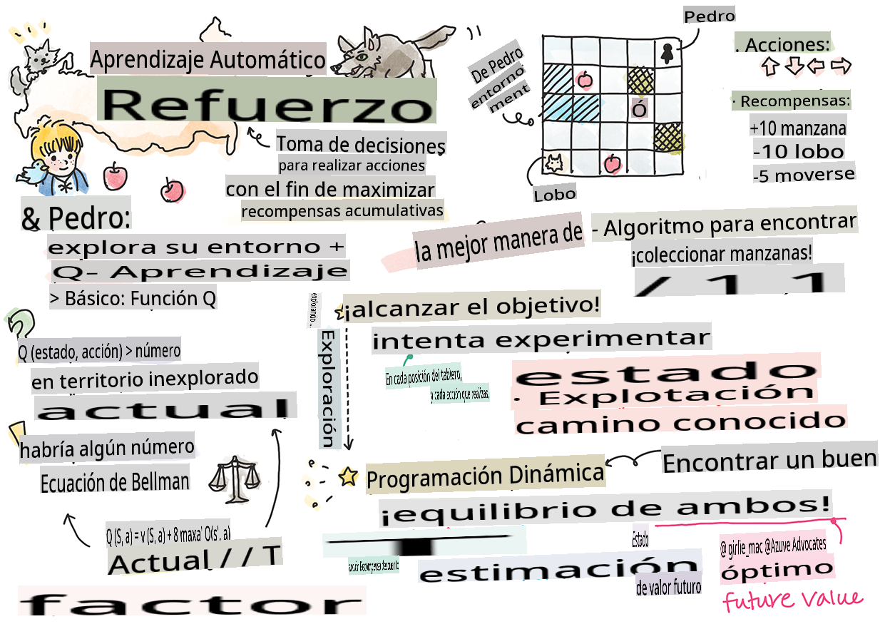

## Introducción al Aprendizaje por Refuerzo y Q-Learning


> Sketchnote por [Tomomi Imura](https://www.twitter.com/girlie_mac)

El aprendizaje por refuerzo implica tres conceptos importantes: el agente, algunos estados y un conjunto de acciones por estado. Al ejecutar una acción en un estado especificado, el agente recibe una recompensa. Imagina de nuevo el videojuego Super Mario. Eres Mario, estás en un nivel del juego, parado al borde de un acantilado. Encima de ti hay una moneda. Tú, siendo Mario, en un nivel del juego, en una posición específica... ese es tu estado. Mover un paso a la derecha (una acción) te llevará al borde y te daría una puntuación baja. Sin embargo, presionar el botón de salto te permitiría obtener un punto y seguirías vivo. Ese es un resultado positivo y debería otorgarte una puntuación numérica positiva.

Usando el aprendizaje por refuerzo y un simulador (el juego), puedes aprender a jugar el juego para maximizar la recompensa, que es mantenerte vivo y obtener tantos puntos como sea posible.

[](https://www.youtube.com/watch?v=lDq_en8RNOo)

> 🎥 Haz clic en la imagen de arriba para escuchar a Dmitry hablar sobre el Aprendizaje por Refuerzo

## [Cuestionario antes de la lección](https://gray-sand-07a10f403.1.azurestaticapps.net/quiz/45/)

## Requisitos y Configuración

En esta lección, experimentaremos con algo de código en Python. Deberías poder ejecutar el código del Jupyter Notebook de esta lección, ya sea en tu computadora o en algún lugar en la nube.

Puedes abrir [el notebook de la lección](https://github.com/microsoft/ML-For-Beginners/blob/main/8-Reinforcement/1-QLearning/notebook.ipynb) y seguir esta lección para construir.

> **Nota:** Si estás abriendo este código desde la nube, también necesitas obtener el archivo [`rlboard.py`](https://github.com/microsoft/ML-For-Beginners/blob/main/8-Reinforcement/1-QLearning/rlboard.py), que se usa en el código del notebook. Agrégalo al mismo directorio que el notebook.

## Introducción

En esta lección, exploraremos el mundo de **[Pedro y el lobo](https://es.wikipedia.org/wiki/Pedro_y_el_lobo)**, inspirado en un cuento musical de hadas por un compositor ruso, [Sergei Prokofiev](https://es.wikipedia.org/wiki/Serguéi_Prokófiev). Usaremos **Aprendizaje por Refuerzo** para permitir que Pedro explore su entorno, recoja manzanas sabrosas y evite encontrarse con el lobo.

El **Aprendizaje por Refuerzo** (RL) es una técnica de aprendizaje que nos permite aprender un comportamiento óptimo de un **agente** en algún **entorno** mediante la ejecución de muchos experimentos. Un agente en este entorno debe tener algún **objetivo**, definido por una **función de recompensa**.

## El entorno

Para simplificar, consideremos que el mundo de Pedro es un tablero cuadrado de tamaño `width` x `height`, como este:


Cada celda en este tablero puede ser:

* **suelo**, sobre el cual Pedro y otras criaturas pueden caminar.
* **agua**, sobre la cual obviamente no se puede caminar.
* un **árbol** o **hierba**, un lugar donde puedes descansar.
* una **manzana**, que representa algo que Pedro estaría encantado de encontrar para alimentarse.
* un **lobo**, que es peligroso y debe evitarse.

Hay un módulo de Python separado, [`rlboard.py`](https://github.com/microsoft/ML-For-Beginners/blob/main/8-Reinforcement/1-QLearning/rlboard.py), que contiene el código para trabajar con este entorno. Debido a que este código no es importante para entender nuestros conceptos, importaremos el módulo y lo usaremos para crear el tablero de muestra (bloque de código 1):

```python
from rlboard import *

width, height = 8,8
m = Board(width,height)
m.randomize(seed=13)
m.plot()
```

Este código debería imprimir una imagen del entorno similar a la anterior.

## Acciones y política

En nuestro ejemplo, el objetivo de Pedro sería encontrar una manzana, evitando al lobo y otros obstáculos. Para hacer esto, esencialmente puede caminar hasta encontrar una manzana.

Por lo tanto, en cualquier posición, puede elegir entre una de las siguientes acciones: arriba, abajo, izquierda y derecha.

Definiremos esas acciones como un diccionario y las mapearemos a pares de cambios de coordenadas correspondientes. Por ejemplo, moverse a la derecha (`R`) would correspond to a pair `(1,0)`. (bloque de código 2):

```python
actions = { "U" : (0,-1), "D" : (0,1), "L" : (-1,0), "R" : (1,0) }
action_idx = { a : i for i,a in enumerate(actions.keys()) }
```

Para resumir, la estrategia y el objetivo de este escenario son los siguientes:

- **La estrategia** de nuestro agente (Pedro) está definida por una llamada **política**. Una política es una función que devuelve la acción en cualquier estado dado. En nuestro caso, el estado del problema está representado por el tablero, incluyendo la posición actual del jugador.

- **El objetivo** del aprendizaje por refuerzo es eventualmente aprender una buena política que nos permita resolver el problema de manera eficiente. Sin embargo, como línea base, consideremos la política más simple llamada **caminar aleatorio**.

## Caminar aleatorio

Primero resolvamos nuestro problema implementando una estrategia de caminar aleatorio. Con caminar aleatorio, elegiremos aleatoriamente la siguiente acción de las acciones permitidas, hasta que lleguemos a la manzana (bloque de código 3).

1. Implementa el caminar aleatorio con el siguiente código:

    ```python
    def random_policy(m):
        return random.choice(list(actions))
    
    def walk(m,policy,start_position=None):
        n = 0 # number of steps
        # set initial position
        if start_position:
            m.human = start_position 
        else:
            m.random_start()
        while True:
            if m.at() == Board.Cell.apple:
                return n # success!
            if m.at() in [Board.Cell.wolf, Board.Cell.water]:
                return -1 # eaten by wolf or drowned
            while True:
                a = actions[policy(m)]
                new_pos = m.move_pos(m.human,a)
                if m.is_valid(new_pos) and m.at(new_pos)!=Board.Cell.water:
                    m.move(a) # do the actual move
                    break
            n+=1
    
    walk(m,random_policy)
    ```

    La llamada a `walk` debería devolver la longitud del camino correspondiente, que puede variar de una ejecución a otra. 

1. Ejecuta el experimento de caminar varias veces (digamos, 100), y imprime las estadísticas resultantes (bloque de código 4):

    ```python
    def print_statistics(policy):
        s,w,n = 0,0,0
        for _ in range(100):
            z = walk(m,policy)
            if z<0:
                w+=1
            else:
                s += z
                n += 1
        print(f"Average path length = {s/n}, eaten by wolf: {w} times")
    
    print_statistics(random_policy)
    ```

    Nota que la longitud promedio de un camino es de alrededor de 30-40 pasos, lo cual es bastante, dado el hecho de que la distancia promedio a la manzana más cercana es de alrededor de 5-6 pasos.

    También puedes ver cómo se ve el movimiento de Pedro durante el caminar aleatorio:

    

## Función de recompensa

Para hacer nuestra política más inteligente, necesitamos entender qué movimientos son "mejores" que otros. Para hacer esto, necesitamos definir nuestro objetivo.

El objetivo puede definirse en términos de una **función de recompensa**, que devolverá algún valor de puntuación para cada estado. Cuanto mayor sea el número, mejor será la función de recompensa. (bloque de código 5)

```python
move_reward = -0.1
goal_reward = 10
end_reward = -10

def reward(m,pos=None):
    pos = pos or m.human
    if not m.is_valid(pos):
        return end_reward
    x = m.at(pos)
    if x==Board.Cell.water or x == Board.Cell.wolf:
        return end_reward
    if x==Board.Cell.apple:
        return goal_reward
    return move_reward
```

Una cosa interesante sobre las funciones de recompensa es que en la mayoría de los casos, *solo se nos da una recompensa sustancial al final del juego*. Esto significa que nuestro algoritmo debe recordar de alguna manera los pasos "buenos" que conducen a una recompensa positiva al final, y aumentar su importancia. De manera similar, todos los movimientos que conducen a malos resultados deben desalentarse.

## Q-Learning

Un algoritmo que discutiremos aquí se llama **Q-Learning**. En este algoritmo, la política está definida por una función (o una estructura de datos) llamada **Q-Table**. Registra la "bondad" de cada una de las acciones en un estado dado.

Se llama Q-Table porque a menudo es conveniente representarla como una tabla, o matriz multidimensional. Dado que nuestro tablero tiene dimensiones `width` x `height`, podemos representar la Q-Table usando una matriz numpy con forma `width` x `height` x `len(actions)`: (bloque de código 6)

```python
Q = np.ones((width,height,len(actions)),dtype=np.float)*1.0/len(actions)
```

Nota que inicializamos todos los valores de la Q-Table con un valor igual, en nuestro caso - 0.25. Esto corresponde a la política de "caminar aleatorio", porque todos los movimientos en cada estado son igualmente buenos. Podemos pasar la Q-Table a la `plot` function in order to visualize the table on the board: `m.plot(Q)`.


In the center of each cell there is an "arrow" that indicates the preferred direction of movement. Since all directions are equal, a dot is displayed.

Now we need to run the simulation, explore our environment, and learn a better distribution of Q-Table values, which will allow us to find the path to the apple much faster.

## Essence of Q-Learning: Bellman Equation

Once we start moving, each action will have a corresponding reward, i.e. we can theoretically select the next action based on the highest immediate reward. However, in most states, the move will not achieve our goal of reaching the apple, and thus we cannot immediately decide which direction is better.

> Remember that it is not the immediate result that matters, but rather the final result, which we will obtain at the end of the simulation.

In order to account for this delayed reward, we need to use the principles of **[dynamic programming](https://en.wikipedia.org/wiki/Dynamic_programming)**, which allow us to think about out problem recursively.

Suppose we are now at the state *s*, and we want to move to the next state *s'*. By doing so, we will receive the immediate reward *r(s,a)*, defined by the reward function, plus some future reward. If we suppose that our Q-Table correctly reflects the "attractiveness" of each action, then at state *s'* we will chose an action *a* that corresponds to maximum value of *Q(s',a')*. Thus, the best possible future reward we could get at state *s* will be defined as `max`<sub>a'</sub>*Q(s',a')* (maximum here is computed over all possible actions *a'* at state *s'*).

This gives the **Bellman formula** for calculating the value of the Q-Table at state *s*, given action *a*:


Here γ is the so-called **discount factor** that determines to which extent you should prefer the current reward over the future reward and vice versa.

## Learning Algorithm

Given the equation above, we can now write pseudo-code for our learning algorithm:

* Initialize Q-Table Q with equal numbers for all states and actions
* Set learning rate α ← 1
* Repeat simulation many times
   1. Start at random position
   1. Repeat
        1. Select an action *a* at state *s*
        2. Execute action by moving to a new state *s'*
        3. If we encounter end-of-game condition, or total reward is too small - exit simulation  
        4. Compute reward *r* at the new state
        5. Update Q-Function according to Bellman equation: *Q(s,a)* ← *(1-α)Q(s,a)+α(r+γ max<sub>a'</sub>Q(s',a'))*
        6. *s* ← *s'*
        7. Update the total reward and decrease α.

## Exploit vs. explore

In the algorithm above, we did not specify how exactly we should choose an action at step 2.1. If we are choosing the action randomly, we will randomly **explore** the environment, and we are quite likely to die often as well as explore areas where we would not normally go. An alternative approach would be to **exploit** the Q-Table values that we already know, and thus to choose the best action (with higher Q-Table value) at state *s*. This, however, will prevent us from exploring other states, and it's likely we might not find the optimal solution.

Thus, the best approach is to strike a balance between exploration and exploitation. This can be done by choosing the action at state *s* with probabilities proportional to values in the Q-Table. In the beginning, when Q-Table values are all the same, it would correspond to a random selection, but as we learn more about our environment, we would be more likely to follow the optimal route while allowing the agent to choose the unexplored path once in a while.

## Python implementation

We are now ready to implement the learning algorithm. Before we do that, we also need some function that will convert arbitrary numbers in the Q-Table into a vector of probabilities for corresponding actions.

1. Create a function `probs()`:

    ```python
    def probs(v,eps=1e-4):
        v = v-v.min()+eps
        v = v/v.sum()
        return v
    ```

    Agregamos algunos `eps` al vector original para evitar la división por 0 en el caso inicial, cuando todos los componentes del vector son idénticos.

Ejecuta el algoritmo de aprendizaje a través de 5000 experimentos, también llamados **épocas**: (bloque de código 8)
```python
    for epoch in range(5000):
    
        # Pick initial point
        m.random_start()
        
        # Start travelling
        n=0
        cum_reward = 0
        while True:
            x,y = m.human
            v = probs(Q[x,y])
            a = random.choices(list(actions),weights=v)[0]
            dpos = actions[a]
            m.move(dpos,check_correctness=False) # we allow player to move outside the board, which terminates episode
            r = reward(m)
            cum_reward += r
            if r==end_reward or cum_reward < -1000:
                lpath.append(n)
                break
            alpha = np.exp(-n / 10e5)
            gamma = 0.5
            ai = action_idx[a]
            Q[x,y,ai] = (1 - alpha) * Q[x,y,ai] + alpha * (r + gamma * Q[x+dpos[0], y+dpos[1]].max())
            n+=1
```

Después de ejecutar este algoritmo, la Q-Table debería actualizarse con valores que definan la atractividad de diferentes acciones en cada paso. Podemos intentar visualizar la Q-Table dibujando un vector en cada celda que apunte en la dirección deseada del movimiento. Para simplificar, dibujamos un pequeño círculo en lugar de una punta de flecha.
Estás entrenado con datos hasta octubre de 2023.

## Verificando la política

Dado que la Q-Table enumera la "atractividad" de cada acción en cada estado, es bastante fácil usarla para definir la navegación eficiente en nuestro mundo. En el caso más simple, podemos seleccionar la acción correspondiente al valor más alto de la Q-Table: (bloque de código 9)

```python
def qpolicy_strict(m):
        x,y = m.human
        v = probs(Q[x,y])
        a = list(actions)[np.argmax(v)]
        return a

walk(m,qpolicy_strict)
```

> Si intentas el código anterior varias veces, puedes notar que a veces se "cuelga", y necesitas presionar el botón de DETENER en el notebook para interrumpirlo. Esto sucede porque podría haber situaciones en las que dos estados "señalen" entre sí en términos de Q-Value óptimo, en cuyo caso el agente termina moviéndose entre esos estados indefinidamente.

## 🚀Desafío

> **Tarea 1:** Modifica el `walk` function to limit the maximum length of path by a certain number of steps (say, 100), and watch the code above return this value from time to time.

> **Task 2:** Modify the `walk` function so that it does not go back to the places where it has already been previously. This will prevent `walk` from looping, however, the agent can still end up being "trapped" in a location from which it is unable to escape.

## Navigation

A better navigation policy would be the one that we used during training, which combines exploitation and exploration. In this policy, we will select each action with a certain probability, proportional to the values in the Q-Table. This strategy may still result in the agent returning back to a position it has already explored, but, as you can see from the code below, it results in a very short average path to the desired location (remember that `print_statistics` ejecuta la simulación 100 veces): (bloque de código 10)

```python
def qpolicy(m):
        x,y = m.human
        v = probs(Q[x,y])
        a = random.choices(list(actions),weights=v)[0]
        return a

print_statistics(qpolicy)
```

Después de ejecutar este código, deberías obtener una longitud promedio de camino mucho menor que antes, en el rango de 3-6.

## Investigando el proceso de aprendizaje

Como hemos mencionado, el proceso de aprendizaje es un equilibrio entre la exploración y la explotación del conocimiento adquirido sobre la estructura del espacio del problema. Hemos visto que los resultados del aprendizaje (la capacidad de ayudar a un agente a encontrar un camino corto hacia el objetivo) han mejorado, pero también es interesante observar cómo se comporta la longitud promedio del camino durante el proceso de aprendizaje:

Las conclusiones se pueden resumir como:

- **La longitud promedio del camino aumenta**. Lo que vemos aquí es que al principio, la longitud promedio del camino aumenta. Esto probablemente se deba al hecho de que cuando no sabemos nada sobre el entorno, es probable que quedemos atrapados en estados malos, agua o lobo. A medida que aprendemos más y comenzamos a usar este conocimiento, podemos explorar el entorno por más tiempo, pero aún no sabemos muy bien dónde están las manzanas.

- **La longitud del camino disminuye, a medida que aprendemos más**. Una vez que aprendemos lo suficiente, se vuelve más fácil para el agente lograr el objetivo, y la longitud del camino comienza a disminuir. Sin embargo, todavía estamos abiertos a la exploración, por lo que a menudo nos desviamos del mejor camino y exploramos nuevas opciones, haciendo que el camino sea más largo de lo óptimo.

- **La longitud aumenta abruptamente**. Lo que también observamos en este gráfico es que en algún momento, la longitud aumentó abruptamente. Esto indica la naturaleza estocástica del proceso, y que en algún momento podemos "estropear" los coeficientes de la Q-Table sobrescribiéndolos con nuevos valores. Esto idealmente debería minimizarse disminuyendo la tasa de aprendizaje (por ejemplo, hacia el final del entrenamiento, solo ajustamos los valores de la Q-Table por un pequeño valor).

En general, es importante recordar que el éxito y la calidad del proceso de aprendizaje dependen significativamente de los parámetros, como la tasa de aprendizaje, la disminución de la tasa de aprendizaje y el factor de descuento. Estos a menudo se llaman **hiperparámetros**, para distinguirlos de **parámetros**, que optimizamos durante el entrenamiento (por ejemplo, coeficientes de la Q-Table). El proceso de encontrar los mejores valores de hiperparámetros se llama **optimización de hiperparámetros**, y merece un tema aparte.

## [Cuestionario después de la lección](https://gray-sand-07a10f403.1.azurestaticapps.net/quiz/46/)

## Asignación 
[Un Mundo Más Realista](assignment.md)

**Descargo de responsabilidad**:
Este documento ha sido traducido utilizando servicios de traducción automática basados en IA. Si bien nos esforzamos por lograr precisión, tenga en cuenta que las traducciones automáticas pueden contener errores o inexactitudes. El documento original en su idioma nativo debe considerarse la fuente autorizada. Para información crítica, se recomienda una traducción profesional humana. No nos hacemos responsables de ningún malentendido o interpretación errónea que surja del uso de esta traducción.