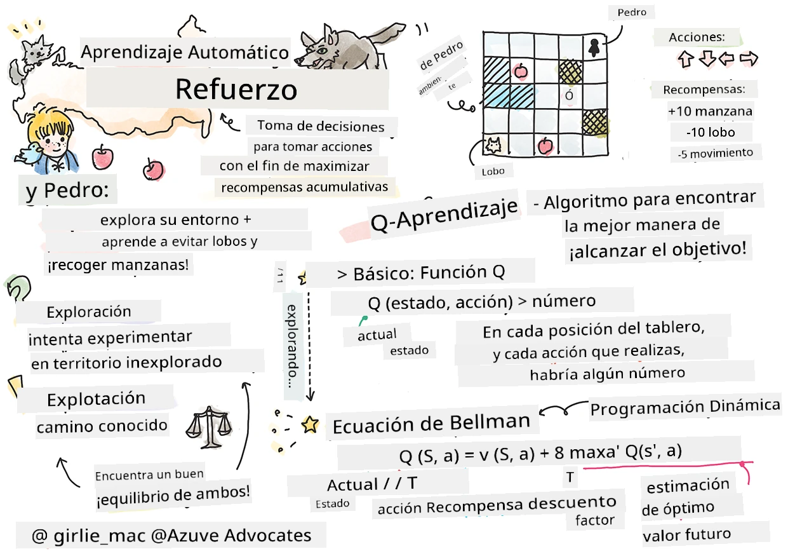

# Introducción al Aprendizaje por Refuerzo y Q-Learning


> Sketchnote por [Tomomi Imura](https://www.twitter.com/girlie_mac)

El aprendizaje por refuerzo involucra tres conceptos importantes: el agente, algunos estados y un conjunto de acciones por estado. Al ejecutar una acción en un estado especificado, el agente recibe una recompensa. Imagina nuevamente el videojuego Super Mario. Eres Mario, estás en un nivel de juego, de pie junto al borde de un acantilado. Encima de ti hay una moneda. Tú siendo Mario, en un nivel de juego, en una posición específica... ese es tu estado. Mover un paso a la derecha (una acción) te llevaría al borde, y eso te daría una puntuación numérica baja. Sin embargo, presionar el botón de salto te permitiría anotar un punto y seguirías vivo. Ese es un resultado positivo y debería premiarte con una puntuación numérica positiva.

Usando el aprendizaje por refuerzo y un simulador (el juego), puedes aprender cómo jugar para maximizar la recompensa, que es mantenerse vivo y anotar tantos puntos como sea posible.

[](https://www.youtube.com/watch?v=lDq_en8RNOo)

> 🎥 Haz clic en la imagen de arriba para escuchar a Dmitry hablar sobre el Aprendizaje por Refuerzo

## [Cuestionario previo a la lección](https://ff-quizzes.netlify.app/en/ml/)

## Requisitos previos y configuración

En esta lección, experimentaremos con algo de código en Python. Deberías poder ejecutar el código del Jupyter Notebook de esta lección, ya sea en tu computadora o en algún lugar en la nube.

Puedes abrir [el cuaderno de la lección](https://github.com/microsoft/ML-For-Beginners/blob/main/8-Reinforcement/1-QLearning/notebook.ipynb) y seguir esta lección para construir.

> **Nota:** Si abres este código desde la nube, también debes obtener el archivo [`rlboard.py`](https://github.com/microsoft/ML-For-Beginners/blob/main/8-Reinforcement/1-QLearning/rlboard.py), que se usa en el código del cuaderno. Agrégalo al mismo directorio que el cuaderno.

## Introducción

En esta lección, exploraremos el mundo de **[Pedro y el Lobo](https://en.wikipedia.org/wiki/Peter_and_the_Wolf)**, inspirado en un cuento musical de un compositor ruso, [Sergei Prokofiev](https://en.wikipedia.org/wiki/Sergei_Prokofiev). Usaremos el **Aprendizaje por Refuerzo** para dejar que Pedro explore su entorno, recolecte manzanas sabrosas y evite encontrarse con el lobo.

El **Aprendizaje por Refuerzo** (RL) es una técnica de aprendizaje que nos permite aprender un comportamiento óptimo de un **agente** en algún **entorno** ejecutando muchos experimentos. Un agente en este entorno debe tener algún **objetivo**, definido por una **función de recompensa**.

## El entorno

Para simplificar, consideremos que el mundo de Pedro es un tablero cuadrado de tamaño `width` x `height`, así:


Cada celda de este tablero puede ser:

* **tierra**, sobre la cual Pedro y otras criaturas pueden caminar.
* **agua**, sobre la cual obviamente no puedes caminar.
* un **árbol** o **césped**, un lugar donde puedes descansar.
* una **manzana**, que representa algo que Pedro estaría feliz de encontrar para alimentarse.
* un **lobo**, que es peligroso y debe evitarse.

Hay un módulo Python separado, [`rlboard.py`](https://github.com/microsoft/ML-For-Beginners/blob/main/8-Reinforcement/1-QLearning/rlboard.py), que contiene el código para trabajar con este entorno. Debido a que este código no es importante para entender nuestros conceptos, importaremos el módulo y lo usaremos para crear el tablero de ejemplo (bloque de código 1):

```python
from rlboard import *

width, height = 8,8
m = Board(width,height)
m.randomize(seed=13)
m.plot()
```

Este código debería imprimir una imagen del entorno similar a la anterior.

## Acciones y política

En nuestro ejemplo, el objetivo de Pedro sería poder encontrar una manzana, evitando al lobo y otros obstáculos. Para ello, básicamente puede caminar hasta encontrar una manzana.

Por lo tanto, en cualquier posición puede elegir entre una de las siguientes acciones: arriba, abajo, izquierda y derecha.

Definiremos estas acciones como un diccionario y las asignaremos a pares de cambios de coordenadas correspondientes. Por ejemplo, moverse a la derecha (`R`) correspondería al par `(1,0)`. (bloque de código 2):

```python
actions = { "U" : (0,-1), "D" : (0,1), "L" : (-1,0), "R" : (1,0) }
action_idx = { a : i for i,a in enumerate(actions.keys()) }
```

En resumen, la estrategia y el objetivo de este escenario son los siguientes:

- **La estrategia**, de nuestro agente (Pedro) está definida por una llamada **política**. Una política es una función que devuelve la acción en cualquier estado dado. En nuestro caso, el estado del problema está representado por el tablero, incluidas las posiciones actuales del jugador.

- **El objetivo**, del aprendizaje por refuerzo es eventualmente aprender una buena política que nos permita resolver el problema eficientemente. Sin embargo, como referencia, consideremos la política más simple llamada **camino aleatorio**.

## Camino aleatorio

Primero resolvamos nuestro problema implementando una estrategia de camino aleatorio. Con el camino aleatorio, elegiremos aleatoriamente la próxima acción entre las permitidas hasta que lleguemos a la manzana (bloque de código 3).

1. Implementa el camino aleatorio con el código a continuación:

    ```python
    def random_policy(m):
        return random.choice(list(actions))
    
    def walk(m,policy,start_position=None):
        n = 0 # número de pasos
        # establecer posición inicial
        if start_position:
            m.human = start_position 
        else:
            m.random_start()
        while True:
            if m.at() == Board.Cell.apple:
                return n # ¡éxito!
            if m.at() in [Board.Cell.wolf, Board.Cell.water]:
                return -1 # comido por el lobo o ahogado
            while True:
                a = actions[policy(m)]
                new_pos = m.move_pos(m.human,a)
                if m.is_valid(new_pos) and m.at(new_pos)!=Board.Cell.water:
                    m.move(a) # realizar el movimiento real
                    break
            n+=1
    
    walk(m,random_policy)
    ```

    La llamada a `walk` debería devolver la longitud del camino correspondiente, que puede variar de una ejecución a otra. 

1. Ejecuta el experimento de camino aleatorio varias veces (digamos, 100) y muestra las estadísticas resultantes (bloque de código 4):

    ```python
    def print_statistics(policy):
        s,w,n = 0,0,0
        for _ in range(100):
            z = walk(m,policy)
            if z<0:
                w+=1
            else:
                s += z
                n += 1
        print(f"Average path length = {s/n}, eaten by wolf: {w} times")
    
    print_statistics(random_policy)
    ```

    Ten en cuenta que la longitud promedio de un camino es de aproximadamente 30-40 pasos, que es bastante, dado que la distancia promedio a la manzana más cercana es de unos 5-6 pasos.

    También puedes ver cómo se ve el movimiento de Pedro durante el camino aleatorio:

    

## Función de recompensa

Para hacer nuestra política más inteligente, necesitamos entender qué movimientos son "mejores" que otros. Para ello, necesitamos definir nuestro objetivo.

El objetivo puede definirse en términos de una **función de recompensa**, que devolverá algún valor de puntuación para cada estado. Cuanto mayor sea el número, mejor será la función de recompensa. (bloque de código 5)

```python
move_reward = -0.1
goal_reward = 10
end_reward = -10

def reward(m,pos=None):
    pos = pos or m.human
    if not m.is_valid(pos):
        return end_reward
    x = m.at(pos)
    if x==Board.Cell.water or x == Board.Cell.wolf:
        return end_reward
    if x==Board.Cell.apple:
        return goal_reward
    return move_reward
```

Algo interesante sobre las funciones de recompensa es que en la mayoría de los casos, *solo se nos da una recompensa sustancial al final del juego*. Esto significa que nuestro algoritmo debería de alguna manera recordar los "buenos" pasos que llevan a una recompensa positiva al final y aumentar su importancia. De manera similar, todos los movimientos que llevan a malos resultados deberían ser desalentados.

## Q-Learning

Un algoritmo que discutiremos aquí se llama **Q-Learning**. En este algoritmo, la política está definida por una función (o una estructura de datos) llamada **Q-Table**. Esta registra la "bondad" de cada una de las acciones en un estado dado.

Se llama Q-Table porque a menudo es conveniente representarla como una tabla o un arreglo multidimensional. Dado que nuestro tablero tiene dimensiones `width` x `height`, podemos representar la Q-Table usando un arreglo numpy con forma `width` x `height` x `len(actions)`: (bloque de código 6)

```python
Q = np.ones((width,height,len(actions)),dtype=np.float)*1.0/len(actions)
```

Observa que inicializamos todos los valores de la Q-Table con un valor igual, en nuestro caso - 0.25. Esto corresponde a la política de "camino aleatorio", porque todos los movimientos en cada estado son igualmente buenos. Podemos pasar la Q-Table a la función `plot` para visualizar la tabla en el tablero: `m.plot(Q)`.


En el centro de cada celda hay una "flecha" que indica la dirección preferida del movimiento. Como todas las direcciones son iguales, se muestra un punto.

Ahora necesitamos ejecutar la simulación, explorar nuestro entorno y aprender una mejor distribución de los valores de la Q-Table, que nos permitirá encontrar el camino a la manzana mucho más rápido.

## Esencia del Q-Learning: Ecuación de Bellman

Una vez que empezamos a movernos, cada acción tendrá una recompensa correspondiente, es decir, teóricamente podemos seleccionar la próxima acción basada en la recompensa inmediata más alta. Sin embargo, en la mayoría de los estados, el movimiento no logrará nuestro objetivo de alcanzar la manzana, y por lo tanto no podemos decidir inmediatamente qué dirección es mejor.

> Recuerda que no importa el resultado inmediato, sino el resultado final, que obtendremos al final de la simulación.

Para tener en cuenta esta recompensa retardada, necesitamos usar los principios de la **[programación dinámica](https://en.wikipedia.org/wiki/Dynamic_programming)**, que nos permiten pensar en nuestro problema recursivamente.

Supongamos que ahora estamos en el estado *s*, y queremos movernos al siguiente estado *s'*. Al hacerlo, recibiremos la recompensa inmediata *r(s,a)*, definida por la función de recompensa, más alguna recompensa futura. Si suponemos que nuestra Q-Table refleja correctamente la "atractividad" de cada acción, entonces en el estado *s'* escogeremos una acción *a* que corresponda al valor máximo de *Q(s',a')*. Por lo tanto, la mejor recompensa futura posible que podríamos obtener en el estado *s* estará definida como `max`<sub>a'</sub>*Q(s',a')* (el máximo aquí se calcula sobre todas las acciones posibles *a'* en el estado *s'*).

Esto da la **fórmula de Bellman** para calcular el valor de la Q-Table en el estado *s*, dada la acción *a*:


Aquí γ es el llamado **factor de descuento** que determina hasta qué punto deberías preferir la recompensa actual sobre la futura y viceversa.

## Algoritmo de aprendizaje

Dada la ecuación anterior, ahora podemos escribir un pseudo-código para nuestro algoritmo de aprendizaje:

* Inicializar Q-Table Q con números iguales para todos los estados y acciones
* Establecer tasa de aprendizaje α ← 1
* Repetir la simulación muchas veces
   1. Comenzar en posición aleatoria
   1. Repetir
        1. Seleccionar una acción *a* en el estado *s*
        2. Ejecutar la acción moviéndose a un nuevo estado *s'*
        3. Si encontramos la condición de fin del juego, o la recompensa total es muy baja - salir de la simulación  
        4. Calcular la recompensa *r* en el nuevo estado
        5. Actualizar la función Q según la ecuación de Bellman: *Q(s,a)* ← *(1-α)Q(s,a)+α(r+γ max<sub>a'</sub>Q(s',a'))*
        6. *s* ← *s'*
        7. Actualizar la recompensa total y disminuir α.

## Explotar vs. explorar

En el algoritmo anterior, no especificamos exactamente cómo deberíamos elegir una acción en el paso 2.1. Si elegimos la acción aleatoriamente, estaremos **explorando** aleatoriamente el entorno, y es bastante probable que muramos a menudo, así como también exploraremos áreas a las que normalmente no iríamos. Un enfoque alternativo sería **explotar** los valores de la Q-Table que ya conocemos y así elegir la mejor acción (con el valor más alto en la Q-Table) en el estado *s*. Esto, sin embargo, nos impedirá explorar otros estados y es probable que no encontremos la solución óptima.

Por lo tanto, el mejor enfoque es encontrar un equilibrio entre exploración y explotación. Esto se puede lograr eligiendo la acción en el estado *s* con probabilidades proporcionales a los valores en la Q-Table. Al principio, cuando los valores de la Q-Table son todos iguales, esto corresponderá a una selección aleatoria, pero a medida que aprendamos más sobre nuestro entorno, será más probable que sigamos la ruta óptima mientras permitimos que el agente elija el camino inexplorado de vez en cuando.

## Implementación en Python

Ahora estamos listos para implementar el algoritmo de aprendizaje. Antes de hacerlo, también necesitamos una función que convierta números arbitrarios en la Q-Table en un vector de probabilidades para las acciones correspondientes.

1. Crea una función `probs()`:

    ```python
    def probs(v,eps=1e-4):
        v = v-v.min()+eps
        v = v/v.sum()
        return v
    ```

    Añadimos un poco de `eps` al vector original para evitar la división por 0 en el caso inicial, cuando todos los componentes del vector son idénticos.

Ejecuta el algoritmo de aprendizaje a través de 5000 experimentos, también llamados **épocas**: (bloque de código 8)
```python
    for epoch in range(5000):
    
        # Elegir punto inicial
        m.random_start()
        
        # Comenzar a viajar
        n=0
        cum_reward = 0
        while True:
            x,y = m.human
            v = probs(Q[x,y])
            a = random.choices(list(actions),weights=v)[0]
            dpos = actions[a]
            m.move(dpos,check_correctness=False) # permitimos que el jugador se mueva fuera del tablero, lo que termina el episodio
            r = reward(m)
            cum_reward += r
            if r==end_reward or cum_reward < -1000:
                lpath.append(n)
                break
            alpha = np.exp(-n / 10e5)
            gamma = 0.5
            ai = action_idx[a]
            Q[x,y,ai] = (1 - alpha) * Q[x,y,ai] + alpha * (r + gamma * Q[x+dpos[0], y+dpos[1]].max())
            n+=1
```

Después de ejecutar este algoritmo, la Q-Table debería actualizarse con valores que definen la atractividad de diferentes acciones en cada paso. Podemos intentar visualizar la Q-Table plotteando un vector en cada celda que apunte en la dirección deseada de movimiento. Por simplicidad, dibujamos un pequeño círculo en lugar de una punta de flecha.


## Verificación de la política

Dado que la Q-Table lista la "atractividad" de cada acción en cada estado, es bastante fácil usarla para definir una navegación eficiente en nuestro mundo. En el caso más simple, podemos seleccionar la acción correspondiente al valor más alto de la Q-Table: (bloque de código 9)

```python
def qpolicy_strict(m):
        x,y = m.human
        v = probs(Q[x,y])
        a = list(actions)[np.argmax(v)]
        return a

walk(m,qpolicy_strict)
```


> Si pruebas el código anterior varias veces, puedes notar que a veces se "cuelga" y necesitas presionar el botón DETENER en el cuaderno para interrumpirlo. Esto ocurre porque podrían existir situaciones en las que dos estados se "apuntan" entre sí en términos del valor Q óptimo, en cuyo caso el agente termina moviéndose entre esos estados indefinidamente.

## 🚀Desafío

> **Tarea 1:** Modifica la función `walk` para limitar la longitud máxima del camino a cierto número de pasos (por ejemplo, 100), y observa cómo el código anterior devuelve este valor de vez en cuando.

> **Tarea 2:** Modifica la función `walk` para que no regrese a lugares donde ya ha estado anteriormente. Esto evitará que `walk` haga bucles, sin embargo, el agente aún puede quedar "atrapado" en un lugar del que no pueda escapar.

## Navegación

Una mejor política de navegación sería la que usamos durante el entrenamiento, que combina explotación y exploración. En esta política, seleccionaremos cada acción con cierta probabilidad, proporcional a los valores en la tabla Q. Esta estrategia aún puede resultar en que el agente regrese a una posición que ya ha explorado, pero, como puedes ver en el código a continuación, resulta en un camino promedio muy corto hasta la ubicación deseada (recuerda que `print_statistics` ejecuta la simulación 100 veces): (bloque de código 10)

```python
def qpolicy(m):
        x,y = m.human
        v = probs(Q[x,y])
        a = random.choices(list(actions),weights=v)[0]
        return a

print_statistics(qpolicy)
```

Después de ejecutar este código, deberías obtener una longitud promedio de camino mucho menor que antes, en el rango de 3-6.

## Investigando el proceso de aprendizaje

Como hemos mencionado, el proceso de aprendizaje es un equilibrio entre la exploración y la explotación del conocimiento adquirido sobre la estructura del espacio del problema. Hemos visto que los resultados del aprendizaje (la habilidad para ayudar a un agente a encontrar un camino corto hasta la meta) han mejorado, pero también es interesante observar cómo se comporta la longitud promedio del camino durante el proceso de aprendizaje:


Se pueden resumir las enseñanzas como:

- **La longitud promedio del camino aumenta**. Lo que vemos aquí es que al principio, la longitud promedio del camino aumenta. Probablemente se deba a que cuando no sabemos nada sobre el entorno, es probable que quedemos atrapados en estados malos, como agua o lobo. A medida que aprendemos más y comenzamos a usar este conocimiento, podemos explorar el entorno por más tiempo, pero todavía no sabemos muy bien dónde están las manzanas.

- **La longitud del camino disminuye a medida que aprendemos más**. Una vez que aprendemos lo suficiente, se vuelve más fácil para el agente lograr la meta, y la longitud del camino comienza a disminuir. Sin embargo, todavía estamos abiertos a la exploración, por lo que a menudo nos desviamos del mejor camino y exploramos nuevas opciones, haciendo que el camino sea más largo que el óptimo.

- **La longitud aumenta abruptamente**. Lo que también observamos en este gráfico es que en algún punto, la longitud aumentó abruptamente. Esto indica la naturaleza estocástica del proceso, y que en algún momento podemos "estropear" los coeficientes de la tabla Q sobrescribiéndolos con nuevos valores. Idealmente, esto debería minimizarse disminuyendo la tasa de aprendizaje (por ejemplo, hacia el final del entrenamiento, solo ajustamos los valores de la tabla Q por un valor pequeño).

En general, es importante recordar que el éxito y la calidad del proceso de aprendizaje dependen significativamente de parámetros, tales como la tasa de aprendizaje, la disminución de la tasa de aprendizaje y el factor de descuento. Estos a menudo se llaman **hiperparámetros**, para distinguirlos de los **parámetros**, que optimizamos durante el entrenamiento (por ejemplo, los coeficientes de la tabla Q). El proceso de encontrar los mejores valores para los hiperparámetros se llama **optimización de hiperparámetros**, y merece un tema aparte.

## [Cuestionario posterior a la conferencia](https://ff-quizzes.netlify.app/en/ml/)

## Tarea  
[Un mundo más realista](assignment.md)

---

<!-- CO-OP TRANSLATOR DISCLAIMER START -->
**Descargo de responsabilidad**:
Este documento ha sido traducido utilizando el servicio de traducción automática [Co-op Translator](https://github.com/Azure/co-op-translator). Aunque nos esforzamos por la precisión, tenga en cuenta que las traducciones automatizadas pueden contener errores o inexactitudes. El documento original en su idioma nativo debe considerarse la fuente autorizada. Para información crítica, se recomienda una traducción profesional humana. No somos responsables de cualquier malentendido o interpretación errónea que surja del uso de esta traducción.
<!-- CO-OP TRANSLATOR DISCLAIMER END -->