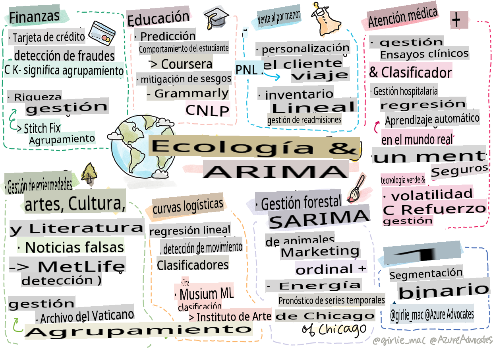

<!--
CO_OP_TRANSLATOR_METADATA:
{
  "original_hash": "20f18ff565638be615df4174858e4a7f",
  "translation_date": "2025-09-03T23:17:14+00:00",
  "source_file": "9-Real-World/1-Applications/README.md",
  "language_code": "es"
}
-->
# Posdata: Aprendizaje automático en el mundo real

> Sketchnote por [Tomomi Imura](https://www.twitter.com/girlie_mac)

En este currículo, has aprendido muchas formas de preparar datos para el entrenamiento y crear modelos de aprendizaje automático. Construiste una serie de modelos clásicos de regresión, agrupamiento, clasificación, procesamiento de lenguaje natural y series temporales. ¡Felicidades! Ahora, podrías estar preguntándote para qué sirve todo esto... ¿cuáles son las aplicaciones reales de estos modelos?

Aunque la industria ha mostrado mucho interés en la IA, que generalmente utiliza aprendizaje profundo, todavía hay aplicaciones valiosas para los modelos clásicos de aprendizaje automático. ¡Incluso podrías estar usando algunas de estas aplicaciones hoy en día! En esta lección, explorarás cómo ocho industrias y dominios temáticos diferentes utilizan estos tipos de modelos para hacer que sus aplicaciones sean más eficientes, confiables, inteligentes y valiosas para los usuarios.

## [Cuestionario previo a la lección](https://gray-sand-07a10f403.1.azurestaticapps.net/quiz/49/)

## 💰 Finanzas

El sector financiero ofrece muchas oportunidades para el aprendizaje automático. Muchos problemas en esta área se prestan para ser modelados y resueltos utilizando ML.

### Detección de fraude con tarjetas de crédito

Aprendimos sobre [agrupamiento k-means](../../5-Clustering/2-K-Means/README.md) anteriormente en el curso, pero ¿cómo puede usarse para resolver problemas relacionados con el fraude con tarjetas de crédito?

El agrupamiento k-means es útil en una técnica de detección de fraude con tarjetas de crédito llamada **detección de valores atípicos**. Los valores atípicos, o desviaciones en las observaciones de un conjunto de datos, pueden indicarnos si una tarjeta de crédito se está utilizando de manera normal o si algo inusual está ocurriendo. Como se muestra en el artículo vinculado a continuación, puedes clasificar los datos de tarjetas de crédito utilizando un algoritmo de agrupamiento k-means y asignar cada transacción a un grupo según qué tan atípica parezca ser. Luego, puedes evaluar los grupos más riesgosos para determinar si las transacciones son fraudulentas o legítimas.  
[Referencia](https://citeseerx.ist.psu.edu/viewdoc/download?doi=10.1.1.680.1195&rep=rep1&type=pdf)

### Gestión de patrimonios

En la gestión de patrimonios, un individuo o empresa maneja inversiones en nombre de sus clientes. Su trabajo es mantener y hacer crecer la riqueza a largo plazo, por lo que es esencial elegir inversiones que tengan un buen desempeño.

Una forma de evaluar cómo se desempeña una inversión en particular es mediante la regresión estadística. La [regresión lineal](../../2-Regression/1-Tools/README.md) es una herramienta valiosa para entender cómo un fondo se desempeña en relación con un punto de referencia. También podemos deducir si los resultados de la regresión son estadísticamente significativos o cuánto afectarían las inversiones de un cliente. Incluso podrías ampliar tu análisis utilizando regresión múltiple, donde se pueden tener en cuenta factores de riesgo adicionales. Para un ejemplo de cómo esto funcionaría para un fondo específico, consulta el artículo a continuación sobre la evaluación del desempeño de fondos utilizando regresión.  
[Referencia](http://www.brightwoodventures.com/evaluating-fund-performance-using-regression/)

## 🎓 Educación

El sector educativo también es un área muy interesante donde se puede aplicar ML. Hay problemas interesantes que abordar, como detectar trampas en exámenes o ensayos, o gestionar sesgos, intencionados o no, en el proceso de corrección.

### Predicción del comportamiento estudiantil

[Coursera](https://coursera.com), un proveedor de cursos abiertos en línea, tiene un excelente blog técnico donde discuten muchas decisiones de ingeniería. En este estudio de caso, trazaron una línea de regresión para explorar cualquier correlación entre una baja calificación de NPS (Net Promoter Score) y la retención o abandono de cursos.  
[Referencia](https://medium.com/coursera-engineering/controlled-regression-quantifying-the-impact-of-course-quality-on-learner-retention-31f956bd592a)

### Mitigación de sesgos

[Grammarly](https://grammarly.com), un asistente de escritura que verifica errores de ortografía y gramática, utiliza sofisticados [sistemas de procesamiento de lenguaje natural](../../6-NLP/README.md) en todos sus productos. Publicaron un interesante estudio de caso en su blog técnico sobre cómo abordaron el sesgo de género en el aprendizaje automático, lo cual aprendiste en nuestra [lección introductoria sobre equidad](../../1-Introduction/3-fairness/README.md).  
[Referencia](https://www.grammarly.com/blog/engineering/mitigating-gender-bias-in-autocorrect/)

## 👜 Retail

El sector minorista definitivamente puede beneficiarse del uso de ML, desde crear una mejor experiencia para el cliente hasta gestionar inventarios de manera óptima.

### Personalización del recorrido del cliente

En Wayfair, una empresa que vende artículos para el hogar como muebles, ayudar a los clientes a encontrar los productos adecuados para sus gustos y necesidades es fundamental. En este artículo, los ingenieros de la empresa describen cómo utilizan ML y NLP para "mostrar los resultados correctos a los clientes". En particular, su motor de intención de consulta se ha construido para usar extracción de entidades, entrenamiento de clasificadores, extracción de activos y opiniones, y etiquetado de sentimientos en las reseñas de los clientes. Este es un caso clásico de cómo funciona el NLP en el comercio minorista en línea.  
[Referencia](https://www.aboutwayfair.com/tech-innovation/how-we-use-machine-learning-and-natural-language-processing-to-empower-search)

### Gestión de inventarios

Empresas innovadoras y ágiles como [StitchFix](https://stitchfix.com), un servicio de cajas que envía ropa a los consumidores, dependen en gran medida de ML para recomendaciones y gestión de inventarios. Sus equipos de estilismo trabajan junto con sus equipos de comercialización, de hecho: "uno de nuestros científicos de datos experimentó con un algoritmo genético y lo aplicó a prendas para predecir qué sería una pieza de ropa exitosa que no existe hoy. Lo llevamos al equipo de comercialización y ahora pueden usarlo como una herramienta".  
[Referencia](https://www.zdnet.com/article/how-stitch-fix-uses-machine-learning-to-master-the-science-of-styling/)

## 🏥 Atención médica

El sector de la atención médica puede aprovechar ML para optimizar tareas de investigación y también problemas logísticos como la readmisión de pacientes o detener la propagación de enfermedades.

### Gestión de ensayos clínicos

La toxicidad en los ensayos clínicos es una gran preocupación para los fabricantes de medicamentos. ¿Cuánta toxicidad es tolerable? En este estudio, analizar varios métodos de ensayos clínicos llevó al desarrollo de un nuevo enfoque para predecir las probabilidades de resultados de ensayos clínicos. Específicamente, pudieron usar random forest para producir un [clasificador](../../4-Classification/README.md) capaz de distinguir entre grupos de medicamentos.  
[Referencia](https://www.sciencedirect.com/science/article/pii/S2451945616302914)

### Gestión de readmisión hospitalaria

La atención hospitalaria es costosa, especialmente cuando los pacientes tienen que ser readmitidos. Este artículo analiza una empresa que utiliza ML para predecir el potencial de readmisión utilizando [agrupamiento](../../5-Clustering/README.md) de algoritmos. Estos grupos ayudan a los analistas a "descubrir grupos de readmisiones que pueden compartir una causa común".  
[Referencia](https://healthmanagement.org/c/healthmanagement/issuearticle/hospital-readmissions-and-machine-learning)

### Gestión de enfermedades

La reciente pandemia ha puesto de relieve las formas en que el aprendizaje automático puede ayudar a detener la propagación de enfermedades. En este artículo, reconocerás el uso de ARIMA, curvas logísticas, regresión lineal y SARIMA. "Este trabajo es un intento de calcular la tasa de propagación de este virus y, por lo tanto, predecir las muertes, recuperaciones y casos confirmados, para que pueda ayudarnos a prepararnos mejor y sobrevivir".  
[Referencia](https://www.ncbi.nlm.nih.gov/pmc/articles/PMC7979218/)

## 🌲 Ecología y tecnología verde

La naturaleza y la ecología consisten en muchos sistemas sensibles donde la interacción entre animales y la naturaleza entra en juego. Es importante poder medir estos sistemas con precisión y actuar adecuadamente si ocurre algo, como un incendio forestal o una disminución en la población animal.

### Gestión forestal

Aprendiste sobre [aprendizaje por refuerzo](../../8-Reinforcement/README.md) en lecciones anteriores. Puede ser muy útil al intentar predecir patrones en la naturaleza. En particular, puede usarse para rastrear problemas ecológicos como incendios forestales y la propagación de especies invasoras. En Canadá, un grupo de investigadores utilizó aprendizaje por refuerzo para construir modelos de dinámica de incendios forestales a partir de imágenes satelitales. Usando un innovador "proceso de propagación espacial (SSP)", imaginaron un incendio forestal como "el agente en cualquier celda del paisaje". "El conjunto de acciones que el fuego puede tomar desde una ubicación en cualquier momento incluye propagarse hacia el norte, sur, este u oeste o no propagarse".

Este enfoque invierte la configuración habitual de RL, ya que la dinámica del correspondiente Proceso de Decisión de Markov (MDP) es una función conocida para la propagación inmediata del incendio forestal." Lee más sobre los algoritmos clásicos utilizados por este grupo en el enlace a continuación.  
[Referencia](https://www.frontiersin.org/articles/10.3389/fict.2018.00006/full)

### Detección de movimiento de animales

Aunque el aprendizaje profundo ha creado una revolución en el seguimiento visual de movimientos de animales (puedes construir tu propio [rastreador de osos polares](https://docs.microsoft.com/learn/modules/build-ml-model-with-azure-stream-analytics/?WT.mc_id=academic-77952-leestott) aquí), el ML clásico todavía tiene un lugar en esta tarea.

Los sensores para rastrear movimientos de animales de granja e IoT hacen uso de este tipo de procesamiento visual, pero las técnicas más básicas de ML son útiles para preprocesar datos. Por ejemplo, en este artículo, se monitorearon y analizaron posturas de ovejas utilizando varios algoritmos clasificadores. Podrías reconocer la curva ROC en la página 335.  
[Referencia](https://druckhaus-hofmann.de/gallery/31-wj-feb-2020.pdf)

### ⚡️ Gestión energética

En nuestras lecciones sobre [pronóstico de series temporales](../../7-TimeSeries/README.md), invocamos el concepto de parquímetros inteligentes para generar ingresos para una ciudad basándonos en la comprensión de la oferta y la demanda. Este artículo analiza en detalle cómo el agrupamiento, la regresión y el pronóstico de series temporales se combinaron para ayudar a predecir el uso futuro de energía en Irlanda, basado en medidores inteligentes.  
[Referencia](https://www-cdn.knime.com/sites/default/files/inline-images/knime_bigdata_energy_timeseries_whitepaper.pdf)

## 💼 Seguros

El sector de seguros es otro sector que utiliza ML para construir y optimizar modelos financieros y actuariales viables.

### Gestión de volatilidad

MetLife, un proveedor de seguros de vida, es transparente con la forma en que analizan y mitigan la volatilidad en sus modelos financieros. En este artículo notarás visualizaciones de clasificación binaria y ordinal. También descubrirás visualizaciones de pronósticos.  
[Referencia](https://investments.metlife.com/content/dam/metlifecom/us/investments/insights/research-topics/macro-strategy/pdf/MetLifeInvestmentManagement_MachineLearnedRanking_070920.pdf)

## 🎨 Artes, cultura y literatura

En las artes, por ejemplo en el periodismo, hay muchos problemas interesantes. Detectar noticias falsas es un gran problema, ya que se ha demostrado que influye en la opinión de las personas e incluso puede desestabilizar democracias. Los museos también pueden beneficiarse del uso de ML en todo, desde encontrar vínculos entre artefactos hasta la planificación de recursos.

### Detección de noticias falsas

Detectar noticias falsas se ha convertido en un juego del gato y el ratón en los medios de comunicación actuales. En este artículo, los investigadores sugieren que un sistema que combine varias de las técnicas de ML que hemos estudiado puede ser probado y el mejor modelo desplegado: "Este sistema se basa en el procesamiento de lenguaje natural para extraer características de los datos y luego estas características se utilizan para el entrenamiento de clasificadores de aprendizaje automático como Naive Bayes, Support Vector Machine (SVM), Random Forest (RF), Stochastic Gradient Descent (SGD) y Logistic Regression (LR)."  
[Referencia](https://www.irjet.net/archives/V7/i6/IRJET-V7I6688.pdf)

Este artículo muestra cómo combinar diferentes dominios de ML puede producir resultados interesantes que pueden ayudar a detener la propagación de noticias falsas y evitar daños reales; en este caso, el impulso fue la propagación de rumores sobre tratamientos para el COVID que incitaron violencia colectiva.

### ML en museos

Los museos están en la cúspide de una revolución de IA en la que catalogar y digitalizar colecciones y encontrar vínculos entre artefactos se está volviendo más fácil a medida que avanza la tecnología. Proyectos como [In Codice Ratio](https://www.sciencedirect.com/science/article/abs/pii/S0306457321001035#:~:text=1.,studies%20over%20large%20historical%20sources.) están ayudando a desbloquear los misterios de colecciones inaccesibles como los Archivos Vaticanos. Pero el aspecto comercial de los museos también se beneficia de los modelos de ML.

Por ejemplo, el Instituto de Arte de Chicago construyó modelos para predecir qué intereses tienen los visitantes y cuándo asistirán a exposiciones. El objetivo es crear experiencias de visita individualizadas y optimizadas cada vez que el usuario visite el museo. "Durante el año fiscal 2017, el modelo predijo la asistencia y las admisiones con un 1 por ciento de precisión, dice Andrew Simnick, vicepresidente senior en el Instituto de Arte."  
[Referencia](https://www.chicagobusiness.com/article/20180518/ISSUE01/180519840/art-institute-of-chicago-uses-data-to-make-exhibit-choices)

## 🏷 Marketing

### Segmentación de clientes

Las estrategias de marketing más efectivas apuntan a los clientes de diferentes maneras según varios grupos. En este artículo, se discuten los usos de los algoritmos de agrupamiento para apoyar el marketing diferenciado. El marketing diferenciado ayuda a las empresas a mejorar el reconocimiento de marca, llegar a más clientes y generar más ingresos.  
[Referencia](https://ai.inqline.com/machine-learning-for-marketing-customer-segmentation/)

## 🚀 Desafío
Identifica otro sector que se beneficie de algunas de las técnicas que aprendiste en este curso y descubre cómo utiliza ML.

## [Cuestionario posterior a la clase](https://gray-sand-07a10f403.1.azurestaticapps.net/quiz/50/)

## Revisión y estudio personal

El equipo de ciencia de datos de Wayfair tiene varios videos interesantes sobre cómo utilizan ML en su empresa. Vale la pena [echarles un vistazo](https://www.youtube.com/channel/UCe2PjkQXqOuwkW1gw6Ameuw/videos).

## Tarea

[Una búsqueda del tesoro de ML](assignment.md)

---

**Descargo de responsabilidad**:  
Este documento ha sido traducido utilizando el servicio de traducción automática [Co-op Translator](https://github.com/Azure/co-op-translator). Si bien nos esforzamos por lograr precisión, tenga en cuenta que las traducciones automáticas pueden contener errores o imprecisiones. El documento original en su idioma nativo debe considerarse como la fuente autorizada. Para información crítica, se recomienda una traducción profesional realizada por humanos. No nos hacemos responsables de malentendidos o interpretaciones erróneas que puedan surgir del uso de esta traducción.