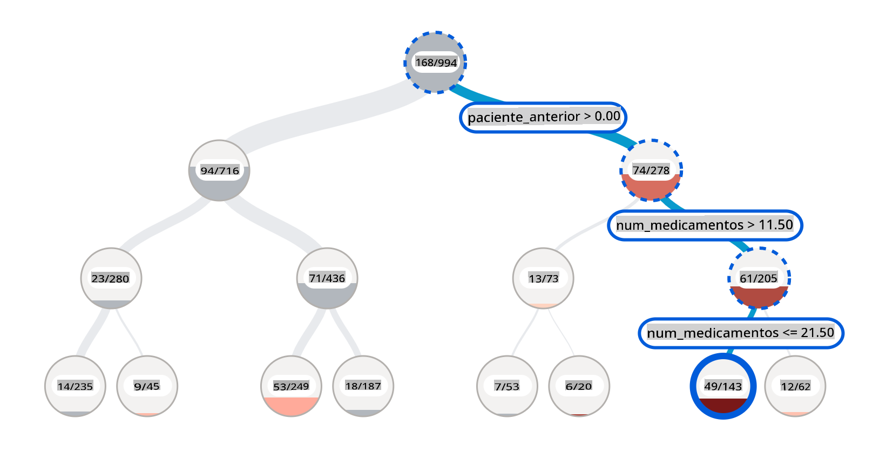
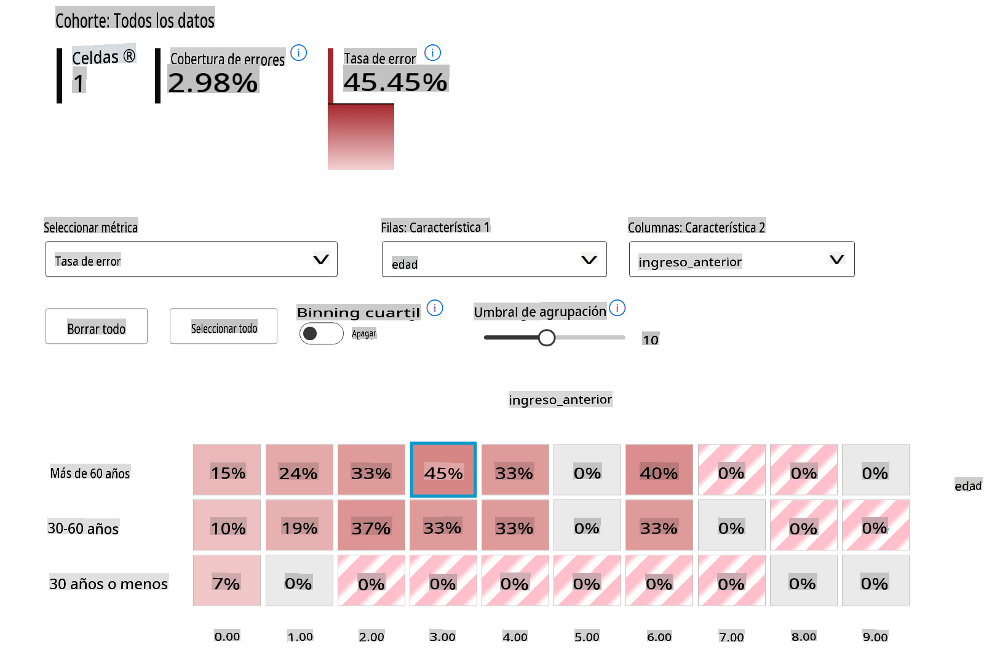
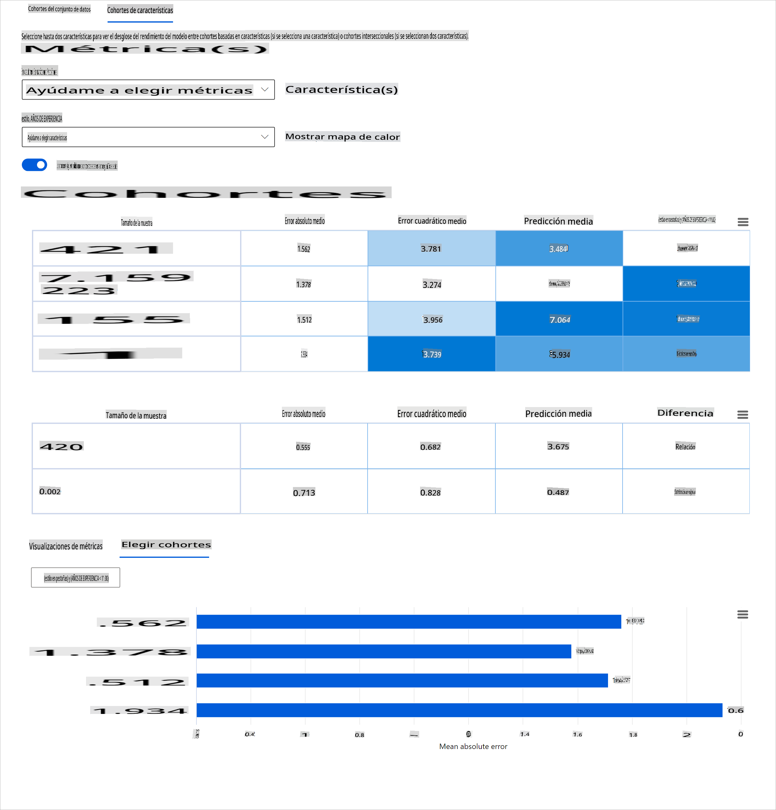
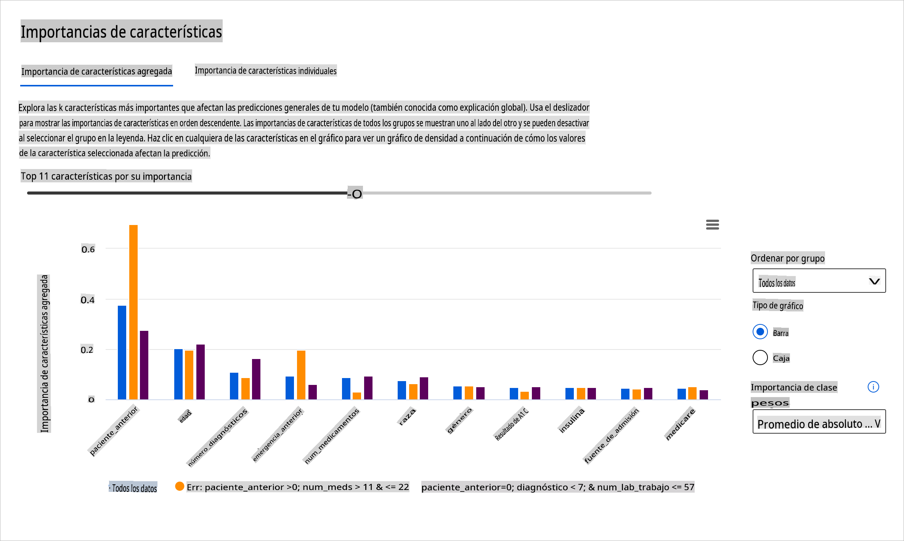
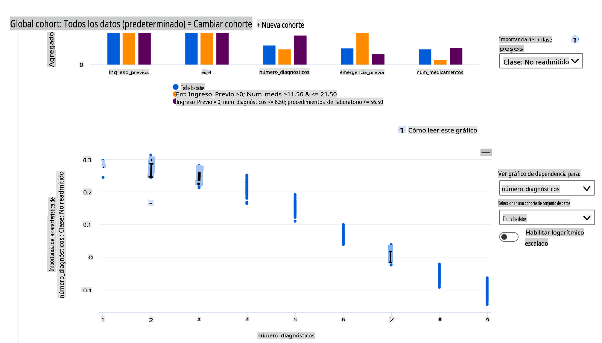

# Posdata: Depuración de Modelos en Aprendizaje Automático usando Componentes del Tablero de IA Responsable

## [Cuestionario previo a la lección](https://gray-sand-07a10f403.1.azurestaticapps.net/quiz/5/)

## Introducción

El aprendizaje automático impacta nuestras vidas cotidianas. La IA está encontrando su camino en algunos de los sistemas más importantes que nos afectan tanto a nivel individual como a nuestra sociedad, desde la atención médica, las finanzas, la educación y el empleo. Por ejemplo, los sistemas y modelos están involucrados en tareas diarias de toma de decisiones, como diagnósticos médicos o la detección de fraudes. En consecuencia, los avances en IA junto con la adopción acelerada están siendo recibidos con expectativas sociales en evolución y una creciente regulación en respuesta. Constantemente vemos áreas donde los sistemas de IA siguen sin cumplir las expectativas; exponen nuevos desafíos; y los gobiernos están comenzando a regular las soluciones de IA. Por lo tanto, es importante que estos modelos sean analizados para proporcionar resultados justos, fiables, inclusivos, transparentes y responsables para todos.

En este currículo, veremos herramientas prácticas que se pueden usar para evaluar si un modelo tiene problemas de IA responsable. Las técnicas tradicionales de depuración de aprendizaje automático tienden a basarse en cálculos cuantitativos como la precisión agregada o la pérdida de error promedio. Imagina lo que puede suceder cuando los datos que estás utilizando para construir estos modelos carecen de ciertos datos demográficos, como raza, género, visión política, religión, o representan desproporcionadamente estos datos demográficos. ¿Qué pasa cuando la salida del modelo se interpreta para favorecer a algunos demográficos? Esto puede introducir una representación excesiva o insuficiente de estos grupos de características sensibles, resultando en problemas de equidad, inclusión o fiabilidad del modelo. Otro factor es que los modelos de aprendizaje automático se consideran cajas negras, lo que dificulta entender y explicar qué impulsa la predicción de un modelo. Todos estos son desafíos que enfrentan los científicos de datos y desarrolladores de IA cuando no tienen herramientas adecuadas para depurar y evaluar la equidad o confiabilidad de un modelo.

En esta lección, aprenderás sobre la depuración de tus modelos usando:

- **Análisis de Errores**: identificar dónde en la distribución de tus datos el modelo tiene altas tasas de error.
- **Visión General del Modelo**: realizar un análisis comparativo entre diferentes cohortes de datos para descubrir disparidades en las métricas de rendimiento de tu modelo.
- **Análisis de Datos**: investigar dónde podría haber una representación excesiva o insuficiente de tus datos que puedan sesgar tu modelo para favorecer a un demográfico de datos sobre otro.
- **Importancia de Características**: entender qué características están impulsando las predicciones de tu modelo a nivel global o local.

## Requisito previo

Como requisito previo, revisa [Herramientas de IA Responsable para desarrolladores](https://www.microsoft.com/ai/ai-lab-responsible-ai-dashboard)

> 

## Análisis de Errores

Las métricas tradicionales de rendimiento del modelo utilizadas para medir la precisión son principalmente cálculos basados en predicciones correctas vs incorrectas. Por ejemplo, determinar que un modelo es preciso el 89% del tiempo con una pérdida de error de 0.001 puede considerarse un buen rendimiento. Los errores a menudo no se distribuyen uniformemente en tu conjunto de datos subyacente. Puedes obtener una puntuación de precisión del modelo del 89%, pero descubrir que hay diferentes regiones de tus datos en las que el modelo falla el 42% del tiempo. La consecuencia de estos patrones de falla con ciertos grupos de datos puede llevar a problemas de equidad o fiabilidad. Es esencial entender las áreas donde el modelo está funcionando bien o no. Las regiones de datos donde hay un alto número de inexactitudes en tu modelo pueden resultar ser un demográfico de datos importante.

El componente de Análisis de Errores en el tablero de RAI ilustra cómo la falla del modelo se distribuye a través de varios cohortes con una visualización en árbol. Esto es útil para identificar características o áreas donde hay una alta tasa de error en tu conjunto de datos. Al ver de dónde provienen la mayoría de las inexactitudes del modelo, puedes comenzar a investigar la causa raíz. También puedes crear cohortes de datos para realizar análisis. Estos cohortes de datos ayudan en el proceso de depuración para determinar por qué el rendimiento del modelo es bueno en un cohorte, pero erróneo en otro.

Los indicadores visuales en el mapa de árbol ayudan a localizar las áreas problemáticas más rápidamente. Por ejemplo, cuanto más oscuro es el tono de color rojo en un nodo del árbol, mayor es la tasa de error.

El mapa de calor es otra funcionalidad de visualización que los usuarios pueden usar para investigar la tasa de error usando una o dos características para encontrar un contribuyente a los errores del modelo en todo el conjunto de datos o cohortes.

Usa el análisis de errores cuando necesites:

* Obtener una comprensión profunda de cómo se distribuyen las fallas del modelo en un conjunto de datos y a través de varias dimensiones de entrada y características.
* Desglosar las métricas de rendimiento agregadas para descubrir automáticamente cohortes erróneos que informen tus pasos de mitigación específicos.

## Visión General del Modelo

Evaluar el rendimiento de un modelo de aprendizaje automático requiere obtener una comprensión holística de su comportamiento. Esto se puede lograr revisando más de una métrica, como tasa de error, precisión, recall, precisión, o MAE (Error Absoluto Medio) para encontrar disparidades entre las métricas de rendimiento. Una métrica de rendimiento puede verse excelente, pero las inexactitudes pueden exponerse en otra métrica. Además, comparar las métricas por disparidades en todo el conjunto de datos o cohortes ayuda a arrojar luz sobre dónde el modelo está funcionando bien o no. Esto es especialmente importante al ver el rendimiento del modelo entre características sensibles vs insensibles (por ejemplo, raza del paciente, género o edad) para descubrir posibles injusticias que el modelo pueda tener. Por ejemplo, descubrir que el modelo es más erróneo en un cohorte que tiene características sensibles puede revelar posibles injusticias que el modelo pueda tener.

El componente de Visión General del Modelo del tablero de RAI ayuda no solo a analizar las métricas de rendimiento de la representación de datos en un cohorte, sino que da a los usuarios la capacidad de comparar el comportamiento del modelo entre diferentes cohortes.

La funcionalidad de análisis basada en características del componente permite a los usuarios reducir subgrupos de datos dentro de una característica particular para identificar anomalías a nivel granular. Por ejemplo, el tablero tiene inteligencia incorporada para generar automáticamente cohortes para una característica seleccionada por el usuario (por ejemplo, *"time_in_hospital < 3"* o *"time_in_hospital >= 7"*). Esto permite a un usuario aislar una característica particular de un grupo de datos más grande para ver si es un influenciador clave de los resultados erróneos del modelo.

El componente de Visión General del Modelo soporta dos clases de métricas de disparidad:

**Disparidad en el rendimiento del modelo**: Estos conjuntos de métricas calculan la disparidad (diferencia) en los valores de la métrica de rendimiento seleccionada entre subgrupos de datos. Aquí hay algunos ejemplos:

* Disparidad en la tasa de precisión
* Disparidad en la tasa de error
* Disparidad en la precisión
* Disparidad en el recall
* Disparidad en el error absoluto medio (MAE)

**Disparidad en la tasa de selección**: Esta métrica contiene la diferencia en la tasa de selección (predicción favorable) entre subgrupos. Un ejemplo de esto es la disparidad en las tasas de aprobación de préstamos. La tasa de selección significa la fracción de puntos de datos en cada clase clasificados como 1 (en clasificación binaria) o la distribución de valores de predicción (en regresión).

## Análisis de Datos

> "Si torturas los datos lo suficiente, confesarán cualquier cosa" - Ronald Coase

Esta declaración suena extrema, pero es cierto que los datos pueden ser manipulados para apoyar cualquier conclusión. Tal manipulación a veces puede ocurrir de manera no intencional. Como humanos, todos tenemos sesgos, y a menudo es difícil saber conscientemente cuándo estás introduciendo sesgo en los datos. Garantizar la equidad en la IA y el aprendizaje automático sigue siendo un desafío complejo.

Los datos son un gran punto ciego para las métricas tradicionales de rendimiento del modelo. Puedes tener altas puntuaciones de precisión, pero esto no siempre refleja el sesgo subyacente en tus datos. Por ejemplo, si un conjunto de datos de empleados tiene el 27% de mujeres en puestos ejecutivos en una empresa y el 73% de hombres en el mismo nivel, un modelo de publicidad de empleo de IA entrenado en estos datos puede dirigirse principalmente a una audiencia masculina para puestos de trabajo de alto nivel. Tener este desequilibrio en los datos sesgó la predicción del modelo para favorecer a un género. Esto revela un problema de equidad donde hay un sesgo de género en el modelo de IA.

El componente de Análisis de Datos en el tablero de RAI ayuda a identificar áreas donde hay una sobre- y sub-representación en el conjunto de datos. Ayuda a los usuarios a diagnosticar la causa raíz de errores y problemas de equidad introducidos por desequilibrios de datos o falta de representación de un grupo de datos particular. Esto da a los usuarios la capacidad de visualizar conjuntos de datos basados en resultados predichos y reales, grupos de errores y características específicas. A veces, descubrir un grupo de datos subrepresentado también puede revelar que el modelo no está aprendiendo bien, de ahí las altas inexactitudes. Tener un modelo con sesgo de datos no es solo un problema de equidad, sino que muestra que el modelo no es inclusivo ni confiable.

Usa el análisis de datos cuando necesites:

* Explorar las estadísticas de tu conjunto de datos seleccionando diferentes filtros para dividir tus datos en diferentes dimensiones (también conocidas como cohortes).
* Entender la distribución de tu conjunto de datos a través de diferentes cohortes y grupos de características.
* Determinar si tus hallazgos relacionados con la equidad, el análisis de errores y la causalidad (derivados de otros componentes del tablero) son el resultado de la distribución de tu conjunto de datos.
* Decidir en qué áreas recolectar más datos para mitigar errores que provienen de problemas de representación, ruido de etiquetas, ruido de características, sesgo de etiquetas y factores similares.

## Interpretabilidad del Modelo

Los modelos de aprendizaje automático tienden a ser cajas negras. Entender qué características clave de los datos impulsan la predicción de un modelo puede ser un desafío. Es importante proporcionar transparencia sobre por qué un modelo hace una cierta predicción. Por ejemplo, si un sistema de IA predice que un paciente diabético está en riesgo de ser readmitido en un hospital en menos de 30 días, debería poder proporcionar datos de apoyo que llevaron a su predicción. Tener indicadores de datos de apoyo aporta transparencia para ayudar a los clínicos u hospitales a tomar decisiones bien informadas. Además, poder explicar por qué un modelo hizo una predicción para un paciente individual permite la responsabilidad con las regulaciones de salud. Cuando estás utilizando modelos de aprendizaje automático de maneras que afectan la vida de las personas, es crucial entender y explicar qué influye en el comportamiento de un modelo. La explicabilidad e interpretabilidad del modelo ayuda a responder preguntas en escenarios como:

* Depuración del modelo: ¿Por qué mi modelo cometió este error? ¿Cómo puedo mejorar mi modelo?
* Colaboración humano-IA: ¿Cómo puedo entender y confiar en las decisiones del modelo?
* Cumplimiento regulatorio: ¿Cumple mi modelo con los requisitos legales?

El componente de Importancia de Características del tablero de RAI te ayuda a depurar y obtener una comprensión integral de cómo un modelo hace predicciones. También es una herramienta útil para profesionales de aprendizaje automático y tomadores de decisiones para explicar y mostrar evidencia de características que influyen en el comportamiento de un modelo para el cumplimiento regulatorio. A continuación, los usuarios pueden explorar tanto explicaciones globales como locales para validar qué características impulsan la predicción de un modelo. Las explicaciones globales enumeran las principales características que afectaron la predicción general de un modelo. Las explicaciones locales muestran qué características llevaron a la predicción de un modelo para un caso individual. La capacidad de evaluar explicaciones locales también es útil para depurar o auditar un caso específico para comprender mejor y interpretar por qué un modelo hizo una predicción precisa o inexacta.

* Explicaciones globales: Por ejemplo, ¿qué características afectan el comportamiento general de un modelo de readmisión hospitalaria para diabetes?
* Explicaciones locales: Por ejemplo, ¿por qué se predijo que un paciente diabético mayor de 60 años con hospitalizaciones previas sería readmitido o no readmitido dentro de los 30 días en un hospital?

En el proceso de depuración de examinar el rendimiento de un modelo a través de diferentes cohortes, la Importancia de Características muestra qué nivel de impacto tiene una característica a través de los cohortes. Ayuda a revelar anomalías al comparar el nivel de influencia que tiene la característica en impulsar las predicciones erróneas de un modelo. El componente de Importancia de Características puede mostrar qué valores en una característica influyeron positiva o negativamente en el resultado del modelo. Por ejemplo, si un modelo hizo una predicción inexacta, el componente te da la capacidad de profundizar y señalar qué características o valores de características impulsaron la predicción. Este nivel de detalle ayuda no solo en la depuración, sino que proporciona transparencia y responsabilidad en situaciones de auditoría. Finalmente, el componente puede ayudarte a identificar problemas de equidad. Para ilustrar, si una característica sensible como la etnia o el género es altamente influyente en impulsar la predicción de un modelo, esto podría ser un indicio de sesgo de raza o género en el modelo.

Usa la interpretabilidad cuando necesites:

* Determinar cuán confiables son las predicciones de tu sistema de IA al entender qué características son más importantes para las predicciones.
* Abordar la depuración de tu modelo entendiéndolo primero e identificando si el modelo está utilizando características saludables o meramente correlaciones falsas.
* Descubrir posibles fuentes de injusticia al entender si el modelo está basando predicciones en características sensibles o en características que están altamente correlacionadas con ellas.
* Construir confianza en las decisiones de tu modelo generando explicaciones locales para ilustrar sus resultados.
* Completar una auditoría regulatoria de un sistema de IA para validar modelos y monitorear el impacto de las decisiones del modelo en los humanos.

## Conclusión

Todos los componentes del tablero de RAI son herramientas prácticas para ayudarte a construir modelos de aprendizaje automático que sean menos dañinos y más confiables para la sociedad. Mejora la prevención de amenazas a los derechos humanos; discriminar o excluir a ciertos grupos de oportunidades de vida; y el riesgo de daño físico o psicológico. También ayuda a construir confianza en las decisiones de tu modelo generando explicaciones locales para ilustrar sus resultados. Algunos de los posibles daños se pueden clasificar como:

- **Asignación**, si un género o etnia, por ejemplo, es favorecido sobre otro.
- **Calidad del servicio**. Si entrenas los datos para un escenario específico pero la realidad es mucho más compleja, lleva a un servicio de bajo rendimiento.
- **Estereotipado**. Asociar a un grupo dado con atributos preasignados.
- **Denigración**. Criticar injustamente y etiquetar algo o a alguien.
- **Sobre- o sub- representación**. La idea es que un cierto grupo no se ve en una cierta profesión, y cualquier servicio o función que siga promoviendo eso está contribuyendo al daño.

### Tablero de RAI de Azure

[El tablero de RAI de Azure](https://learn.microsoft.com/en-us/azure/machine-learning/concept-responsible-ai-dashboard?WT.mc_id=aiml-90525-ruyakubu) está construido sobre herramientas de código abierto desarrolladas por las principales instituciones académicas y organizaciones, incluidas Microsoft, que son instrumentales para que los científicos de datos y desarrolladores de IA comprendan mejor el comportamiento del modelo, descubran y mitiguen problemas indeseables de los modelos de IA.

- Aprende a usar los diferentes componentes consultando la [documentación del tablero de RAI.](https://learn.microsoft.com/en-us/azure/machine-learning/how-to-responsible-ai-dashboard?WT.mc_id=aiml-90525-ruyakubu)

- Consulta algunos [cuadernos de muestra del tablero de RAI](https://github.com/Azure/RAI-vNext-Preview/tree/main/examples/notebooks) para depurar más escenarios de IA responsable en Azure Machine Learning.

---
## 🚀 Desafío

Para evitar que se introduzcan sesgos estadísticos o de datos en primer lugar, debemos:

- tener una diversidad de antecedentes y perspectivas entre las personas que trabajan en los sistemas
- invertir en conjuntos de datos que reflejen la diversidad de nuestra sociedad
- desarrollar mejores métodos para detectar y corregir el sesgo cuando ocurra

Piensa en escenarios de la vida real donde la injusticia es evidente en la construcción y uso de modelos. ¿Qué más deberíamos considerar?

## [Cuestionario posterior a la lección](https://gray-sand-07a10f403.1.azurestaticapps.net/quiz/6/)
## Revisión y Autoestudio

En esta lección, has aprendido algunas de las herramientas prácticas para incorporar IA responsable en el aprendizaje automático.

Mira este taller para profundizar en los temas:

- Tablero de IA Responsable: Un centro integral para operacionalizar la RAI en la práctica por Besmira Nushi y Mehrnoosh Sameki

> 🎥 Haz clic en la imagen de arriba para ver un video: Tablero de IA Responsable: Un centro integral para operacionalizar la RAI en la práctica por Bes

        **Descargo de responsabilidad**:
        Este documento ha sido traducido utilizando servicios de traducción automática basados en IA. Aunque nos esforzamos por lograr precisión, tenga en cuenta que las traducciones automáticas pueden contener errores o imprecisiones. El documento original en su idioma nativo debe considerarse la fuente autorizada. Para información crítica, se recomienda la traducción profesional humana. No nos hacemos responsables de ningún malentendido o interpretación errónea que surja del uso de esta traducción.