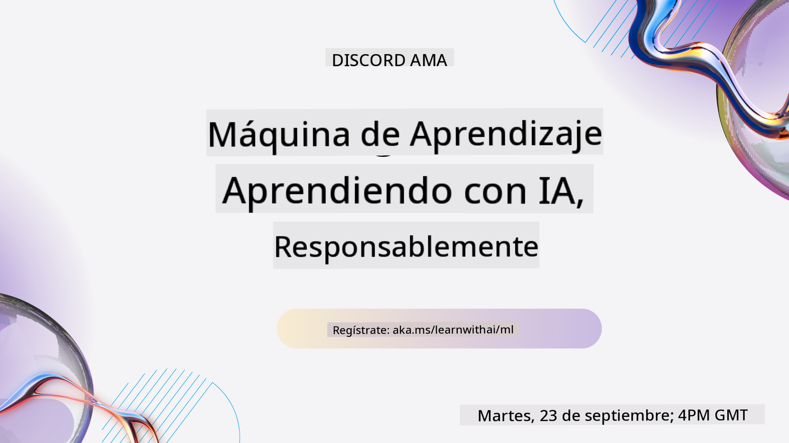

<!--
CO_OP_TRANSLATOR_METADATA:
{
  "original_hash": "c300f2380d9da91b7de8c707f69ce99b",
  "translation_date": "2025-12-19T10:25:39+00:00",
  "source_file": "README.md",
  "language_code": "es"
}
-->

### 🌐 Soporte Multilingüe

#### Soportado mediante GitHub Action (Automatizado y Siempre Actualizado)

<!-- CO-OP TRANSLATOR LANGUAGES TABLE START -->
[Árabe](../ar/README.md) | [Bengalí](../bn/README.md) | [Búlgaro](../bg/README.md) | [Birmano (Myanmar)](../my/README.md) | [Chino (Simplificado)](../zh/README.md) | [Chino (Tradicional, Hong Kong)](../hk/README.md) | [Chino (Tradicional, Macao)](../mo/README.md) | [Chino (Tradicional, Taiwán)](../tw/README.md) | [Croata](../hr/README.md) | [Checo](../cs/README.md) | [Danés](../da/README.md) | [Holandés](../nl/README.md) | [Estonio](../et/README.md) | [Finlandés](../fi/README.md) | [Francés](../fr/README.md) | [Alemán](../de/README.md) | [Griego](../el/README.md) | [Hebreo](../he/README.md) | [Hindi](../hi/README.md) | [Húngaro](../hu/README.md) | [Indonesio](../id/README.md) | [Italiano](../it/README.md) | [Japonés](../ja/README.md) | [Kannada](../kn/README.md) | [Coreano](../ko/README.md) | [Lituano](../lt/README.md) | [Malayo](../ms/README.md) | [Malayalam](../ml/README.md) | [Maratí](../mr/README.md) | [Nepalí](../ne/README.md) | [Pidgin Nigeriano](../pcm/README.md) | [Noruego](../no/README.md) | [Persa (Farsi)](../fa/README.md) | [Polaco](../pl/README.md) | [Portugués (Brasil)](../br/README.md) | [Portugués (Portugal)](../pt/README.md) | [Punjabi (Gurmukhi)](../pa/README.md) | [Rumano](../ro/README.md) | [Ruso](../ru/README.md) | [Serbio (Cirílico)](../sr/README.md) | [Eslovaco](../sk/README.md) | [Esloveno](../sl/README.md) | [Español](./README.md) | [Swahili](../sw/README.md) | [Sueco](../sv/README.md) | [Tagalo (Filipino)](../tl/README.md) | [Tamil](../ta/README.md) | [Telugu](../te/README.md) | [Tailandés](../th/README.md) | [Turco](../tr/README.md) | [Ucraniano](../uk/README.md) | [Urdu](../ur/README.md) | [Vietnamita](../vi/README.md)
<!-- CO-OP TRANSLATOR LANGUAGES TABLE END -->

#### Únete a Nuestra Comunidad

Tenemos una serie en Discord para aprender con IA en curso, aprende más y únete a nosotros en [Learn with AI Series](https://aka.ms/learnwithai/discord) del 18 al 30 de septiembre de 2025. Obtendrás consejos y trucos para usar GitHub Copilot para Ciencia de Datos.

# Aprendizaje Automático para Principiantes - Un Currículo

> 🌍 Viaja alrededor del mundo mientras exploramos el Aprendizaje Automático a través de las culturas del mundo 🌍

Los Cloud Advocates de Microsoft se complacen en ofrecer un currículo de 12 semanas y 26 lecciones sobre **Aprendizaje Automático**. En este currículo, aprenderás sobre lo que a veces se llama **aprendizaje automático clásico**, usando principalmente Scikit-learn como biblioteca y evitando el aprendizaje profundo, que se cubre en nuestro [currículo de IA para principiantes](https://aka.ms/ai4beginners). ¡Combina estas lecciones con nuestro ['Currículo de Ciencia de Datos para Principiantes'](https://aka.ms/ds4beginners)!

Viaja con nosotros alrededor del mundo mientras aplicamos estas técnicas clásicas a datos de muchas áreas del mundo. Cada lección incluye cuestionarios antes y después de la lección, instrucciones escritas para completar la lección, una solución, una tarea y más. Nuestra pedagogía basada en proyectos te permite aprender mientras construyes, una forma comprobada para que las nuevas habilidades se afiancen.

**✍️ Muchas gracias a nuestros autores** Jen Looper, Stephen Howell, Francesca Lazzeri, Tomomi Imura, Cassie Breviu, Dmitry Soshnikov, Chris Noring, Anirban Mukherjee, Ornella Altunyan, Ruth Yakubu y Amy Boyd

**🎨 Gracias también a nuestros ilustradores** Tomomi Imura, Dasani Madipalli y Jen Looper

**🙏 Agradecimientos especiales 🙏 a nuestros autores, revisores y colaboradores de contenido Microsoft Student Ambassador**, especialmente Rishit Dagli, Muhammad Sakib Khan Inan, Rohan Raj, Alexandru Petrescu, Abhishek Jaiswal, Nawrin Tabassum, Ioan Samuila y Snigdha Agarwal

**🤩 Gratitud extra a los Microsoft Student Ambassadors Eric Wanjau, Jasleen Sondhi y Vidushi Gupta por nuestras lecciones en R!**

# Comenzando

Sigue estos pasos:
1. **Haz un Fork del Repositorio**: Haz clic en el botón "Fork" en la esquina superior derecha de esta página.
2. **Clona el Repositorio**:   `git clone https://github.com/microsoft/ML-For-Beginners.git`

> [encuentra todos los recursos adicionales para este curso en nuestra colección de Microsoft Learn](https://learn.microsoft.com/en-us/collections/qrqzamz1nn2wx3?WT.mc_id=academic-77952-bethanycheum)

> 🔧 **¿Necesitas ayuda?** Consulta nuestra [Guía de Solución de Problemas](TROUBLESHOOTING.md) para soluciones a problemas comunes con la instalación, configuración y ejecución de lecciones.

**[Estudiantes](https://aka.ms/student-page)**, para usar este currículo, haz un fork de todo el repositorio a tu propia cuenta de GitHub y completa los ejercicios por tu cuenta o en grupo:

- Comienza con un cuestionario previo a la lección.
- Lee la lección y completa las actividades, haciendo pausas y reflexionando en cada verificación de conocimiento.
- Intenta crear los proyectos comprendiendo las lecciones en lugar de ejecutar el código solución; sin embargo, ese código está disponible en las carpetas `/solution` en cada lección orientada a proyectos.
- Realiza el cuestionario posterior a la lección.
- Completa el desafío.
- Completa la tarea.
- Después de completar un grupo de lecciones, visita el [Foro de Discusión](https://github.com/microsoft/ML-For-Beginners/discussions) y "aprende en voz alta" llenando la rúbrica PAT correspondiente. Un 'PAT' es una Herramienta de Evaluación de Progreso que es una rúbrica que llenas para avanzar en tu aprendizaje. También puedes reaccionar a otros PATs para que aprendamos juntos.

> Para estudios adicionales, recomendamos seguir estos módulos y rutas de aprendizaje de [Microsoft Learn](https://docs.microsoft.com/en-us/users/jenlooper-2911/collections/k7o7tg1gp306q4?WT.mc_id=academic-77952-leestott).

**Profesores**, hemos [incluido algunas sugerencias](for-teachers.md) sobre cómo usar este currículo.

---

## Videos explicativos

Algunas de las lecciones están disponibles en formato de video corto. Puedes encontrarlos en línea dentro de las lecciones, o en la [lista de reproducción ML for Beginners en el canal de Microsoft Developer en YouTube](https://aka.ms/ml-beginners-videos) haciendo clic en la imagen a continuación.

---

## Conoce al Equipo

**Gif por** [Mohit Jaisal](https://linkedin.com/in/mohitjaisal)

> 🎥 ¡Haz clic en la imagen de arriba para ver un video sobre el proyecto y las personas que lo crearon!

---

## Pedagogía

Hemos elegido dos principios pedagógicos al construir este currículo: asegurar que sea práctico y **basado en proyectos** y que incluya **cuestionarios frecuentes**. Además, este currículo tiene un **tema común** para darle cohesión.

Al asegurar que el contenido se alinee con proyectos, el proceso se vuelve más atractivo para los estudiantes y se aumentará la retención de conceptos. Además, un cuestionario de bajo riesgo antes de una clase establece la intención del estudiante hacia el aprendizaje de un tema, mientras que un segundo cuestionario después de la clase asegura una mayor retención. Este currículo fue diseñado para ser flexible y divertido y puede tomarse en su totalidad o en parte. Los proyectos comienzan pequeños y se vuelven cada vez más complejos al final del ciclo de 12 semanas. Este currículo también incluye un posfacio sobre aplicaciones reales del ML, que puede usarse como crédito extra o como base para discusión.

> Encuentra nuestro [Código de Conducta](CODE_OF_CONDUCT.md), [Contribuciones](CONTRIBUTING.md), [Traducción](TRANSLATIONS.md) y [Solución de Problemas](TROUBLESHOOTING.md). ¡Agradecemos tus comentarios constructivos!

## Cada lección incluye

- sketchnote opcional
- video suplementario opcional
- video explicativo (solo algunas lecciones)
- [cuestionario previo a la lección](https://ff-quizzes.netlify.app/en/ml/)
- lección escrita
- para lecciones basadas en proyectos, guías paso a paso para construir el proyecto
- verificaciones de conocimiento
- un desafío
- lectura suplementaria
- tarea
- [cuestionario posterior a la lección](https://ff-quizzes.netlify.app/en/ml/)

> **Una nota sobre los idiomas**: Estas lecciones están principalmente escritas en Python, pero muchas también están disponibles en R. Para completar una lección en R, ve a la carpeta `/solution` y busca las lecciones en R. Incluyen una extensión .rmd que representa un archivo **R Markdown**, que puede definirse simplemente como una combinación de `fragmentos de código` (de R u otros lenguajes) y un `encabezado YAML` (que guía cómo formatear salidas como PDF) en un `documento Markdown`. Como tal, sirve como un marco ejemplar para la autoría en ciencia de datos ya que permite combinar tu código, su salida y tus pensamientos escribiéndolos en Markdown. Además, los documentos R Markdown pueden renderizarse a formatos de salida como PDF, HTML o Word.

> **Una nota sobre los cuestionarios**: Todos los cuestionarios están contenidos en la [carpeta Quiz App](../../quiz-app), para un total de 52 cuestionarios con tres preguntas cada uno. Están enlazados desde dentro de las lecciones pero la aplicación de cuestionarios puede ejecutarse localmente; sigue las instrucciones en la carpeta `quiz-app` para alojar localmente o desplegar en Azure.

| Número de Lección |                             Tema                              |                   Agrupación de Lección                   | Objetivos de Aprendizaje                                                                                                             |                                                              Lección Enlazada                                                               |                        Autor                        |
| :-----------: | :------------------------------------------------------------: | :-------------------------------------------------: | ------------------------------------------------------------------------------------------------------------------------------- | :--------------------------------------------------------------------------------------------------------------------------------------: | :--------------------------------------------------: |
|      01       |                Introducción al aprendizaje automático                |      [Introduction](1-Introduction/README.md)       | Aprende los conceptos básicos detrás del aprendizaje automático                                                                                |                                             [Lesson](1-Introduction/1-intro-to-ML/README.md)                                             |                       Muhammad                       |
|      02       |                La historia del aprendizaje automático                 |      [Introduction](1-Introduction/README.md)       | Aprende la historia que subyace en este campo                                                                                         |                                            [Lesson](1-Introduction/2-history-of-ML/README.md)                                            |                     Jen and Amy                      |
|      03       |                 Equidad y aprendizaje automático                  |      [Introduction](1-Introduction/README.md)       | ¿Cuáles son los problemas filosóficos importantes sobre la equidad que los estudiantes deben considerar al construir y aplicar modelos de ML? |                                              [Lesson](1-Introduction/3-fairness/README.md)                                               |                        Tomomi                        |
|      04       |                Técnicas para el aprendizaje automático                 |      [Introduction](1-Introduction/README.md)       | ¿Qué técnicas usan los investigadores de ML para construir modelos de ML?                                                                       |                                          [Lesson](1-Introduction/4-techniques-of-ML/README.md)                                           |                    Chris and Jen                     |
|      05       |                   Introducción a la regresión                   |        [Regression](2-Regression/README.md)         | Comienza con Python y Scikit-learn para modelos de regresión                                                                  |         [Python](2-Regression/1-Tools/README.md) • [R](../../2-Regression/1-Tools/solution/R/lesson_1.html)         |      Jen • Eric Wanjau       |
|      06       |                Precios de calabazas en Norteamérica 🎃                |        [Regression](2-Regression/README.md)         | Visualiza y limpia datos en preparación para ML                                                                                  |          [Python](2-Regression/2-Data/README.md) • [R](../../2-Regression/2-Data/solution/R/lesson_2.html)          |      Jen • Eric Wanjau       |
|      07       |                Precios de calabazas en Norteamérica 🎃                |        [Regression](2-Regression/README.md)         | Construye modelos de regresión lineal y polinómica                                                                                   |        [Python](2-Regression/3-Linear/README.md) • [R](../../2-Regression/3-Linear/solution/R/lesson_3.html)        |      Jen and Dmitry • Eric Wanjau       |
|      08       |                Precios de calabazas en Norteamérica 🎃                |        [Regression](2-Regression/README.md)         | Construye un modelo de regresión logística                                                                                               |     [Python](2-Regression/4-Logistic/README.md) • [R](../../2-Regression/4-Logistic/solution/R/lesson_4.html)      |      Jen • Eric Wanjau       |
|      09       |                          Una aplicación web 🔌                          |           [Web App](3-Web-App/README.md)            | Construye una aplicación web para usar tu modelo entrenado                                                                                       |                                                 [Python](3-Web-App/1-Web-App/README.md)                                                  |                         Jen                          |
|      10       |                 Introducción a la clasificación                 |    [Classification](4-Classification/README.md)     | Limpia, prepara y visualiza tus datos; introducción a la clasificación                                                            | [Python](4-Classification/1-Introduction/README.md) • [R](../../4-Classification/1-Introduction/solution/R/lesson_10.html)  | Jen and Cassie • Eric Wanjau |
|      11       |             Deliciosas cocinas asiáticas e indias 🍜             |    [Classification](4-Classification/README.md)     | Introducción a los clasificadores                                                                                                     | [Python](4-Classification/2-Classifiers-1/README.md) • [R](../../4-Classification/2-Classifiers-1/solution/R/lesson_11.html) | Jen and Cassie • Eric Wanjau |
|      12       |             Deliciosas cocinas asiáticas e indias 🍜             |    [Classification](4-Classification/README.md)     | Más clasificadores                                                                                                                | [Python](4-Classification/3-Classifiers-2/README.md) • [R](../../4-Classification/3-Classifiers-2/solution/R/lesson_12.html) | Jen and Cassie • Eric Wanjau |
|      13       |             Deliciosas cocinas asiáticas e indias 🍜             |    [Classification](4-Classification/README.md)     | Construye una aplicación web recomendadora usando tu modelo                                                                                    |                                              [Python](4-Classification/4-Applied/README.md)                                              |                         Jen                          |
|      14       |                   Introducción al clustering                   |        [Clustering](5-Clustering/README.md)         | Limpia, prepara y visualiza tus datos; Introducción al clustering                                                                |         [Python](5-Clustering/1-Visualize/README.md) • [R](../../5-Clustering/1-Visualize/solution/R/lesson_14.html)         |      Jen • Eric Wanjau       |
|      15       |              Explorando gustos musicales nigerianos 🎧              |        [Clustering](5-Clustering/README.md)         | Explora el método de clustering K-Means                                                                                           |           [Python](5-Clustering/2-K-Means/README.md) • [R](../../5-Clustering/2-K-Means/solution/R/lesson_15.html)           |      Jen • Eric Wanjau       |
|      16       |        Introducción al procesamiento de lenguaje natural ☕️         |   [Natural language processing](6-NLP/README.md)    | Aprende lo básico sobre PLN construyendo un bot simple                                                                             |                                             [Python](6-NLP/1-Introduction-to-NLP/README.md)                                              |                       Stephen                        |
|      17       |                      Tareas comunes de PLN ☕️                      |   [Natural language processing](6-NLP/README.md)    | Profundiza tu conocimiento de PLN entendiendo tareas comunes requeridas al tratar con estructuras del lenguaje                          |                                                    [Python](6-NLP/2-Tasks/README.md)                                                     |                       Stephen                        |
|      18       |             Traducción y análisis de sentimiento ♥️              |   [Natural language processing](6-NLP/README.md)    | Traducción y análisis de sentimiento con Jane Austen                                                                             |                                            [Python](6-NLP/3-Translation-Sentiment/README.md)                                             |                       Stephen                        |
|      19       |                  Hoteles románticos de Europa ♥️                  |   [Natural language processing](6-NLP/README.md)    | Análisis de sentimiento con reseñas de hoteles 1                                                                                         |                                               [Python](6-NLP/4-Hotel-Reviews-1/README.md)                                                |                       Stephen                        |
|      20       |                  Hoteles románticos de Europa ♥️                  |   [Natural language processing](6-NLP/README.md)    | Análisis de sentimiento con reseñas de hoteles 2                                                                                         |                                               [Python](6-NLP/5-Hotel-Reviews-2/README.md)                                                |                       Stephen                        |
|      21       |            Introducción a la predicción de series temporales             |        [Time series](7-TimeSeries/README.md)        | Introducción a la predicción de series temporales                                                                                         |                                             [Python](7-TimeSeries/1-Introduction/README.md)                                              |                      Francesca                       |
|      22       | ⚡️ Uso mundial de energía ⚡️ - predicción de series temporales con ARIMA |        [Time series](7-TimeSeries/README.md)        | Predicción de series temporales con ARIMA                                                                                              |                                                 [Python](7-TimeSeries/2-ARIMA/README.md)                                                 |                      Francesca                       |
|      23       |  ⚡️ Uso mundial de energía ⚡️ - predicción de series temporales con SVR  |        [Time series](7-TimeSeries/README.md)        | Predicción de series temporales con regresor de vectores de soporte                                                                           |                                                  [Python](7-TimeSeries/3-SVR/README.md)                                                  |                       Anirban                        |
|      24       |             Introducción al aprendizaje por refuerzo             | [Reinforcement learning](8-Reinforcement/README.md) | Introducción al aprendizaje por refuerzo con Q-Learning                                                                          |                                             [Python](8-Reinforcement/1-QLearning/README.md)                                              |                        Dmitry                        |
|      25       |                 ¡Ayuda a Peter a evitar al lobo! 🐺                  | [Reinforcement learning](8-Reinforcement/README.md) | Aprendizaje por refuerzo Gym                                                                                                      |                                                [Python](8-Reinforcement/2-Gym/README.md)                                                 |                        Dmitry                        |
|  Postscript   |            Escenarios y aplicaciones reales de ML            |      [ML in the Wild](9-Real-World/README.md)       | Aplicaciones interesantes y reveladoras del aprendizaje automático clásico                                                               |                                             [Lesson](9-Real-World/1-Applications/README.md)                                              |                         Team                         |
|  Postscript   |            Depuración de modelos en ML usando el panel RAI          |      [ML in the Wild](9-Real-World/README.md)       | Depuración de modelos en aprendizaje automático usando componentes del panel Responsible AI                                                              |                                             [Lesson](9-Real-World/2-Debugging-ML-Models/README.md)                                              |                         Ruth Yakubu                       |

> [encuentra todos los recursos adicionales para este curso en nuestra colección de Microsoft Learn](https://learn.microsoft.com/en-us/collections/qrqzamz1nn2wx3?WT.mc_id=academic-77952-bethanycheum)

## Acceso sin conexión

Puedes ejecutar esta documentación sin conexión usando [Docsify](https://docsify.js.org/#/). Haz un fork de este repositorio, [instala Docsify](https://docsify.js.org/#/quickstart) en tu máquina local, y luego en la carpeta raíz de este repositorio, escribe `docsify serve`. El sitio web se servirá en el puerto 3000 en tu localhost: `localhost:3000`.

## PDFs

Encuentra un pdf del plan de estudios con enlaces [aquí](https://microsoft.github.io/ML-For-Beginners/pdf/readme.pdf).

## 🎒 Otros cursos

¡Nuestro equipo produce otros cursos! Mira:

<!-- CO-OP TRANSLATOR OTHER COURSES START -->
### LangChain

---

### Azure / Edge / MCP / Agentes

---
 
### Serie de IA Generativa

[-9333EA?style=for-the-badge&labelColor=E5E7EB&color=9333EA)](https://github.com/microsoft/Generative-AI-for-beginners-dotnet?WT.mc_id=academic-105485-koreyst)
[-C084FC?style=for-the-badge&labelColor=E5E7EB&color=C084FC)](https://github.com/microsoft/generative-ai-for-beginners-java?WT.mc_id=academic-105485-koreyst)
[-E879F9?style=for-the-badge&labelColor=E5E7EB&color=E879F9)](https://github.com/microsoft/generative-ai-with-javascript?WT.mc_id=academic-105485-koreyst)

---
 
### Aprendizaje Básico

---
 
### Serie Copilot

<!-- CO-OP TRANSLATOR OTHER COURSES END -->

## Obtener ayuda

Si te quedas atascado o tienes alguna pregunta sobre cómo crear aplicaciones de IA. Únete a otros aprendices y desarrolladores experimentados en discusiones sobre MCP. Es una comunidad de apoyo donde las preguntas son bienvenidas y el conocimiento se comparte libremente.

Si tienes comentarios sobre el producto o errores mientras construyes, visita:

---

<!-- CO-OP TRANSLATOR DISCLAIMER START -->
**Aviso Legal**:  
Este documento ha sido traducido utilizando el servicio de traducción automática [Co-op Translator](https://github.com/Azure/co-op-translator). Aunque nos esforzamos por la precisión, tenga en cuenta que las traducciones automáticas pueden contener errores o inexactitudes. El documento original en su idioma nativo debe considerarse la fuente autorizada. Para información crítica, se recomienda una traducción profesional realizada por humanos. No nos hacemos responsables de malentendidos o interpretaciones erróneas derivadas del uso de esta traducción.
<!-- CO-OP TRANSLATOR DISCLAIMER END -->