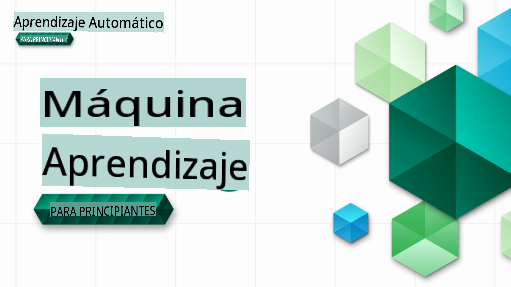

# Aprendizaje Automático para Principiantes - Un Currículo

> 🌍 Viaja por el mundo mientras exploramos el Aprendizaje Automático a través de las culturas del mundo 🌍

Los Cloud Advocates en Microsoft están encantados de ofrecer un currículo de 12 semanas y 26 lecciones sobre **Aprendizaje Automático**. En este currículo, aprenderás sobre lo que a veces se llama **aprendizaje automático clásico**, utilizando principalmente Scikit-learn como biblioteca y evitando el aprendizaje profundo, que se cubre en nuestro [currículo de AI para Principiantes](https://aka.ms/ai4beginners). ¡Combina estas lecciones con nuestro [currículo de Ciencia de Datos para Principiantes](https://aka.ms/ds4beginners), también!

Viaja con nosotros alrededor del mundo mientras aplicamos estas técnicas clásicas a datos de muchas áreas del mundo. Cada lección incluye cuestionarios antes y después de la lección, instrucciones escritas para completar la lección, una solución, una tarea y más. Nuestra pedagogía basada en proyectos te permite aprender mientras construyes, una manera comprobada para que las nuevas habilidades 'se queden'.

**✍️ Agradecimientos de corazón a nuestros autores** Jen Looper, Stephen Howell, Francesca Lazzeri, Tomomi Imura, Cassie Breviu, Dmitry Soshnikov, Chris Noring, Anirban Mukherjee, Ornella Altunyan, Ruth Yakubu y Amy Boyd

**🎨 Gracias también a nuestros ilustradores** Tomomi Imura, Dasani Madipalli y Jen Looper

**🙏 Agradecimientos especiales 🙏 a nuestros autores, revisores y colaboradores de contenido Microsoft Student Ambassador**, notablemente Rishit Dagli, Muhammad Sakib Khan Inan, Rohan Raj, Alexandru Petrescu, Abhishek Jaiswal, Nawrin Tabassum, Ioan Samuila y Snigdha Agarwal

**🤩 Extra gratitud a los Microsoft Student Ambassadors Eric Wanjau, Jasleen Sondhi y Vidushi Gupta por nuestras lecciones de R!**

# Empezando

Sigue estos pasos:
1. **Haz un Fork del Repositorio**: Haz clic en el botón "Fork" en la esquina superior derecha de esta página.
2. **Clona el Repositorio**: `git clone https://github.com/microsoft/ML-For-Beginners.git`

> [encuentra todos los recursos adicionales para este curso en nuestra colección de Microsoft Learn](https://learn.microsoft.com/en-us/collections/qrqzamz1nn2wx3?WT.mc_id=academic-77952-bethanycheum)

**[Estudiantes](https://aka.ms/student-page)**, para usar este currículo, haz un fork del repositorio completo a tu propia cuenta de GitHub y completa los ejercicios por tu cuenta o en grupo:

- Empieza con un cuestionario previo a la lección.
- Lee la lección y completa las actividades, haciendo pausas y reflexionando en cada verificación de conocimiento.
- Trata de crear los proyectos comprendiendo las lecciones en lugar de ejecutar el código de solución; sin embargo, ese código está disponible en las carpetas `/solution` en cada lección orientada a proyectos.
- Realiza el cuestionario posterior a la lección.
- Completa el desafío.
- Completa la tarea.
- Después de completar un grupo de lecciones, visita el [Tablero de Discusión](https://github.com/microsoft/ML-For-Beginners/discussions) y "aprende en voz alta" llenando la rúbrica PAT apropiada. Un 'PAT' es una Herramienta de Evaluación de Progreso que es una rúbrica que llenas para avanzar en tu aprendizaje. También puedes reaccionar a otros PATs para que podamos aprender juntos.

> Para un estudio adicional, recomendamos seguir estos módulos y rutas de aprendizaje de [Microsoft Learn](https://docs.microsoft.com/en-us/users/jenlooper-2911/collections/k7o7tg1gp306q4?WT.mc_id=academic-77952-leestott).

**Profesores**, hemos [incluido algunas sugerencias](for-teachers.md) sobre cómo usar este currículo.

---

## Recorridos en video

Algunas de las lecciones están disponibles en formato de video corto. Puedes encontrar todos estos videos en las lecciones, o en la [lista de reproducción de ML para Principiantes en el canal de YouTube de Microsoft Developer](https://aka.ms/ml-beginners-videos) haciendo clic en la imagen a continuación.

---

## Conoce al Equipo

**Gif por** [Mohit Jaisal](https://linkedin.com/in/mohitjaisal)

> 🎥 ¡Haz clic en la imagen de arriba para ver un video sobre el proyecto y las personas que lo crearon!

---

## Pedagogía

Hemos elegido dos principios pedagógicos al construir este currículo: asegurar que sea **basado en proyectos** y que incluya **cuestionarios frecuentes**. Además, este currículo tiene un **tema común** para darle cohesión.

Al asegurar que el contenido se alinee con los proyectos, el proceso se hace más atractivo para los estudiantes y se aumenta la retención de conceptos. Además, un cuestionario de baja presión antes de la clase establece la intención del estudiante hacia el aprendizaje de un tema, mientras que un segundo cuestionario después de la clase asegura una mayor retención. Este currículo fue diseñado para ser flexible y divertido y puede tomarse en su totalidad o en parte. Los proyectos comienzan pequeños y se vuelven cada vez más complejos al final del ciclo de 12 semanas. Este currículo también incluye un postscript sobre aplicaciones del mundo real del aprendizaje automático, que puede usarse como crédito adicional o como base para la discusión.

> Encuentra nuestro [Código de Conducta](CODE_OF_CONDUCT.md), [Contribución](CONTRIBUTING.md) y [Pautas de Traducción](TRANSLATIONS.md). ¡Agradecemos tus comentarios constructivos!

## Cada lección incluye

- sketchnote opcional
- video complementario opcional
- recorrido en video (algunas lecciones solamente)
- cuestionario de calentamiento previo a la lección
- lección escrita
- para lecciones basadas en proyectos, guías paso a paso sobre cómo construir el proyecto
- verificaciones de conocimiento
- un desafío
- lectura complementaria
- tarea
- cuestionario posterior a la lección

> **Una nota sobre los idiomas**: Estas lecciones están escritas principalmente en Python, pero muchas también están disponibles en R. Para completar una lección en R, ve a la carpeta `/solution` y busca lecciones en R. Incluyen una extensión .rmd que representa un archivo **R Markdown** que puede definirse simplemente como una incrustación de `code chunks` (de R u otros lenguajes) y una `YAML header` (que guía cómo formatear las salidas como PDF) en un `Markdown document`. Como tal, sirve como un marco de autoría ejemplar para la ciencia de datos, ya que te permite combinar tu código, su salida y tus pensamientos al permitirte escribirlos en Markdown. Además, los documentos R Markdown pueden renderizarse a formatos de salida como PDF, HTML o Word.

> **Una nota sobre los cuestionarios**: Todos los cuestionarios están contenidos en la [carpeta de la aplicación de cuestionarios](../../quiz-app), para un total de 52 cuestionarios de tres preguntas cada uno. Están vinculados desde dentro de las lecciones, pero la aplicación de cuestionarios puede ejecutarse localmente; sigue las instrucciones en la carpeta `quiz-app` para alojarla localmente o desplegarla en Azure.

| Número de Lección |                             Tema                              |                   Agrupación de Lección                   | Objetivos de Aprendizaje                                                                                                             |                                                              Lección Vinculada                                                               |                        Autor                        |
| :---------------: | :------------------------------------------------------------: | :-------------------------------------------------------: | ------------------------------------------------------------------------------------------------------------------------------- | :----------------------------------------------------------------------------------------------------------------------------------------: | :--------------------------------------------------: |
|        01         |                Introducción al aprendizaje automático                |      [Introducción](1-Introduction/README.md)       | Aprende los conceptos básicos detrás del aprendizaje automático                                                                                |                                             [Lección](1-Introduction/1-intro-to-ML/README.md)                                             |                       Muhammad                       |
|        02         |                La Historia del aprendizaje automático                 |      [Introducción](1-Introduction/README.md)       | Aprende la historia subyacente a este campo                                                                                         |                                            [Lección](1-Introduction/2-history-of-ML/README.md)                                            |                     Jen y Amy                      |
|        03         |                 Equidad y aprendizaje automático                  |      [Introducción](1-Introduction/README.md)       | ¿Cuáles son los importantes problemas filosóficos sobre la equidad que los estudiantes deben considerar al construir y aplicar modelos de aprendizaje automático? |                                              [Lección](1-Introduction/3-fairness/README.md)                                               |                        Tomomi                        |
|      04       |                Técnicas para el aprendizaje automático          |      [Introduction](1-Introduction/README.md)       | ¿Qué técnicas utilizan los investigadores de ML para construir modelos de ML?                                                  |                                          [Lesson](1-Introduction/4-techniques-of-ML/README.md)                                           |                    Chris y Jen                       |
|      05       |                   Introducción a la regresión                   |        [Regression](2-Regression/README.md)         | Comienza con Python y Scikit-learn para modelos de regresión                                                                   |         <ul><li>[Python](2-Regression/1-Tools/README.md)</li><li>[R](../../2-Regression/1-Tools/solution/R/lesson_1.html)</li></ul>         |      <ul><li>Jen</li><li>Eric Wanjau</li></ul>       |
|      06       |                Precios de calabazas en Norteamérica 🎃          |        [Regression](2-Regression/README.md)         | Visualiza y limpia datos en preparación para ML                                                                                |          <ul><li>[Python](2-Regression/2-Data/README.md)</li><li>[R](../../2-Regression/2-Data/solution/R/lesson_2.html)</li></ul>          |      <ul><li>Jen</li><li>Eric Wanjau</li></ul>       |
|      07       |                Precios de calabazas en Norteamérica 🎃          |        [Regression](2-Regression/README.md)         | Construye modelos de regresión lineal y polinómica                                                                             |        <ul><li>[Python](2-Regression/3-Linear/README.md)</li><li>[R](../../2-Regression/3-Linear/solution/R/lesson_3.html)</li></ul>        |      <ul><li>Jen y Dmitry</li><li>Eric Wanjau</li></ul>       |
|      08       |                Precios de calabazas en Norteamérica 🎃          |        [Regression](2-Regression/README.md)         | Construye un modelo de regresión logística                                                                                     |     <ul><li>[Python](2-Regression/4-Logistic/README.md) </li><li>[R](../../2-Regression/4-Logistic/solution/R/lesson_4.html)</li></ul>      |      <ul><li>Jen</li><li>Eric Wanjau</li></ul>       |
|      09       |                          Una aplicación web 🔌                  |           [Web App](3-Web-App/README.md)            | Construye una aplicación web para usar tu modelo entrenado                                                                     |                                                 [Python](3-Web-App/1-Web-App/README.md)                                                  |                         Jen                          |
|      10       |                 Introducción a la clasificación                 |    [Classification](4-Classification/README.md)     | Limpia, prepara y visualiza tus datos; introducción a la clasificación                                                         | <ul><li> [Python](4-Classification/1-Introduction/README.md) </li><li>[R](../../4-Classification/1-Introduction/solution/R/lesson_10.html)  | <ul><li>Jen y Cassie</li><li>Eric Wanjau</li></ul> |
|      11       |             Deliciosas cocinas asiáticas e indias 🍜            |    [Classification](4-Classification/README.md)     | Introducción a los clasificadores                                                                                              | <ul><li> [Python](4-Classification/2-Classifiers-1/README.md)</li><li>[R](../../4-Classification/2-Classifiers-1/solution/R/lesson_11.html) | <ul><li>Jen y Cassie</li><li>Eric Wanjau</li></ul> |
|      12       |             Deliciosas cocinas asiáticas e indias 🍜            |    [Classification](4-Classification/README.md)     | Más clasificadores                                                                                                             | <ul><li> [Python](4-Classification/3-Classifiers-2/README.md)</li><li>[R](../../4-Classification/3-Classifiers-2/solution/R/lesson_12.html) | <ul><li>Jen y Cassie</li><li>Eric Wanjau</li></ul> |
|      13       |             Deliciosas cocinas asiáticas e indias 🍜            |    [Classification](4-Classification/README.md)     | Construye una aplicación web de recomendación usando tu modelo                                                                 |                                              [Python](4-Classification/4-Applied/README.md)                                              |                         Jen                          |
|      14       |                   Introducción al clustering                    |        [Clustering](5-Clustering/README.md)         | Limpia, prepara y visualiza tus datos; introducción al clustering                                                              |         <ul><li> [Python](5-Clustering/1-Visualize/README.md)</li><li>[R](../../5-Clustering/1-Visualize/solution/R/lesson_14.html)         |      <ul><li>Jen</li><li>Eric Wanjau</li></ul>       |
|      15       |              Explorando los gustos musicales nigerianos 🎧              |        [Clustering](5-Clustering/README.md)         | Explora el método de agrupamiento K-Means                                                                                           |           <ul><li> [Python](5-Clustering/2-K-Means/README.md)</li><li>[R](../../5-Clustering/2-K-Means/solution/R/lesson_15.html)           |      <ul><li>Jen</li><li>Eric Wanjau</li></ul>       |
|      16       |        Introducción al procesamiento de lenguaje natural ☕️         |   [Natural language processing](6-NLP/README.md)    | Aprende los conceptos básicos sobre NLP construyendo un bot sencillo                                                                             |                                             [Python](6-NLP/1-Introduction-to-NLP/README.md)                                              |                       Stephen                        |
|      17       |                      Tareas comunes de NLP ☕️                      |   [Natural language processing](6-NLP/README.md)    | Profundiza tu conocimiento de NLP entendiendo las tareas comunes requeridas al tratar con estructuras de lenguaje                          |                                                    [Python](6-NLP/2-Tasks/README.md)                                                     |                       Stephen                        |
|      18       |             Traducción y análisis de sentimiento ♥️              |   [Natural language processing](6-NLP/README.md)    | Traducción y análisis de sentimiento con Jane Austen                                                                             |                                            [Python](6-NLP/3-Translation-Sentiment/README.md)                                             |                       Stephen                        |
|      19       |                  Hoteles románticos de Europa ♥️                  |   [Natural language processing](6-NLP/README.md)    | Análisis de sentimiento con reseñas de hoteles 1                                                                                         |                                               [Python](6-NLP/4-Hotel-Reviews-1/README.md)                                                |                       Stephen                        |
|      20       |                  Hoteles románticos de Europa ♥️                  |   [Natural language processing](6-NLP/README.md)    | Análisis de sentimiento con reseñas de hoteles 2                                                                                         |                                               [Python](6-NLP/5-Hotel-Reviews-2/README.md)                                                |                       Stephen                        |
|      21       |            Introducción a la predicción de series temporales             |        [Time series](7-TimeSeries/README.md)        | Introducción a la predicción de series temporales                                                                                         |                                             [Python](7-TimeSeries/1-Introduction/README.md)                                              |                      Francesca                       |
|      22       | ⚡️ Uso de energía mundial ⚡️ - predicción de series temporales con ARIMA |        [Time series](7-TimeSeries/README.md)        | Predicción de series temporales con ARIMA                                                                                              |                                                 [Python](7-TimeSeries/2-ARIMA/README.md)                                                 |                      Francesca                       |
|      23       |  ⚡️ Uso de energía mundial ⚡️ - predicción de series temporales con SVR  |        [Time series](7-TimeSeries/README.md)        | Predicción de series temporales con Support Vector Regressor                                                                           |                                                  [Python](7-TimeSeries/3-SVR/README.md)                                                  |                       Anirban                        |
|      24       |             Introducción al aprendizaje por refuerzo             | [Reinforcement learning](8-Reinforcement/README.md) | Introducción al aprendizaje por refuerzo con Q-Learning                                                                          |                                             [Python](8-Reinforcement/1-QLearning/README.md)                                              |                        Dmitry                        |
|      25       |                 ¡Ayuda a Peter a evitar al lobo! 🐺                  | [Reinforcement learning](8-Reinforcement/README.md) | Gimnasio de aprendizaje por refuerzo                                                                                                      |                                                [Python](8-Reinforcement/2-Gym/README.md)                                                 |                        Dmitry                        |
|  Postscript   |            Escenarios y aplicaciones de ML en el mundo real            |      [ML in the Wild](9-Real-World/README.md)       | Aplicaciones interesantes y reveladoras de ML clásico en el mundo real                                                               |                                             [Lesson](9-Real-World/1-Applications/README.md)                                              |                         Team                         |
|  Postscript   |            Depuración de modelos en ML usando el panel de control de RAI          |      [ML in the Wild](9-Real-World/README.md)       | Depuración de modelos en Machine Learning usando componentes del panel de control de IA responsable                                                              |                                             [Lesson](9-Real-World/2-Debugging-ML-Models/README.md)                                              |                         Ruth Yakubu                       |

> [encuentra todos los recursos adicionales para este curso en nuestra colección de Microsoft Learn](https://learn.microsoft.com/en-us/collections/qrqzamz1nn2wx3?WT.mc_id=academic-77952-bethanycheum)

## Acceso sin conexión

Puedes ejecutar esta documentación sin conexión utilizando [Docsify](https://docsify.js.org/#/). Haz un fork de este repositorio, [instala Docsify](https://docsify.js.org/#/quickstart) en tu máquina local, y luego en la carpeta raíz de este repositorio, escribe `docsify serve`. El sitio web se servirá en el puerto 3000 en tu localhost: `localhost:3000`.

## PDFs
Encuentra un pdf del currículo con enlaces [aquí](https://microsoft.github.io/ML-For-Beginners/pdf/readme.pdf).

## Se Busca Ayuda

¿Te gustaría contribuir con una traducción? Por favor, lee nuestras [directrices de traducción](TRANSLATIONS.md) y añade un issue con plantilla para gestionar la carga de trabajo [aquí](https://github.com/microsoft/ML-For-Beginners/issues).

## Otros Currículos

¡Nuestro equipo produce otros currículos! Echa un vistazo a:

- [AI for Beginners](https://aka.ms/ai4beginners)
- [Data Science for Beginners](https://aka.ms/datascience-beginners)
- [**Nueva Versión 2.0** - Generative AI for Beginners](https://aka.ms/genai-beginners)
- [**NUEVO** Cybersecurity for Beginners](https://github.com/microsoft/Security-101??WT.mc_id=academic-96948-sayoung)
- [Web Dev for Beginners](https://aka.ms/webdev-beginners)
- [IoT for Beginners](https://aka.ms/iot-beginners)
- [Machine Learning for Beginners](https://aka.ms/ml4beginners)
- [XR Development for Beginners](https://aka.ms/xr-dev-for-beginners)
- [Mastering GitHub Copilot for AI Paired Programming](https://aka.ms/GitHubCopilotAI)

**Descargo de responsabilidad**:
Este documento ha sido traducido utilizando servicios de traducción automatizada por IA. Aunque nos esforzamos por lograr precisión, tenga en cuenta que las traducciones automatizadas pueden contener errores o imprecisiones. El documento original en su idioma nativo debe considerarse la fuente autorizada. Para información crítica, se recomienda la traducción humana profesional. No somos responsables de cualquier malentendido o interpretación errónea que surja del uso de esta traducción.