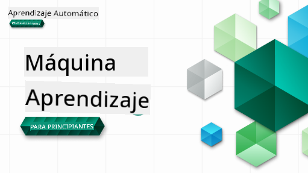

<!--
CO_OP_TRANSLATOR_METADATA:
{
  "original_hash": "1dd12e0cd1de7d05f65abe07bc401c63",
  "translation_date": "2025-09-06T18:31:25+00:00",
  "source_file": "README.md",
  "language_code": "es"
}
-->
  
  
  
  
  

  
  
  

### 🌐 Soporte multilingüe  

#### Soporte mediante GitHub Action (Automatizado y siempre actualizado)  

[Francés](../fr/README.md) | [Español](./README.md) | [Alemán](../de/README.md) | [Ruso](../ru/README.md) | [Árabe](../ar/README.md) | [Persa (Farsi)](../fa/README.md) | [Urdu](../ur/README.md) | [Chino (Simplificado)](../zh/README.md) | [Chino (Tradicional, Macao)](../mo/README.md) | [Chino (Tradicional, Hong Kong)](../hk/README.md) | [Chino (Tradicional, Taiwán)](../tw/README.md) | [Japonés](../ja/README.md) | [Coreano](../ko/README.md) | [Hindi](../hi/README.md) | [Bengalí](../bn/README.md) | [Maratí](../mr/README.md) | [Nepalí](../ne/README.md) | [Panyabí (Gurmukhi)](../pa/README.md) | [Portugués (Portugal)](../pt/README.md) | [Portugués (Brasil)](../br/README.md) | [Italiano](../it/README.md) | [Polaco](../pl/README.md) | [Turco](../tr/README.md) | [Griego](../el/README.md) | [Tailandés](../th/README.md) | [Sueco](../sv/README.md) | [Danés](../da/README.md) | [Noruego](../no/README.md) | [Finlandés](../fi/README.md) | [Holandés](../nl/README.md) | [Hebreo](../he/README.md) | [Vietnamita](../vi/README.md) | [Indonesio](../id/README.md) | [Malayo](../ms/README.md) | [Tagalo (Filipino)](../tl/README.md) | [Suajili](../sw/README.md) | [Húngaro](../hu/README.md) | [Checo](../cs/README.md) | [Eslovaco](../sk/README.md) | [Rumano](../ro/README.md) | [Búlgaro](../bg/README.md) | [Serbio (Cirílico)](../sr/README.md) | [Croata](../hr/README.md) | [Esloveno](../sl/README.md) | [Ucraniano](../uk/README.md) | [Birmano (Myanmar)](../my/README.md)  

#### Únete a la comunidad  

  

# Aprendizaje Automático para Principiantes - Un Currículo  

> 🌍 Viaja por el mundo mientras exploramos el aprendizaje automático a través de las culturas del mundo 🌍  

Los Cloud Advocates de Microsoft se complacen en ofrecer un currículo de 12 semanas y 26 lecciones sobre **aprendizaje automático**. En este currículo, aprenderás sobre lo que a veces se llama **aprendizaje automático clásico**, utilizando principalmente Scikit-learn como biblioteca y evitando el aprendizaje profundo, que se cubre en nuestro [currículo de AI para Principiantes](https://aka.ms/ai4beginners). Combina estas lecciones con nuestro [currículo de Ciencia de Datos para Principiantes](https://aka.ms/ds4beginners), también.  

Viaja con nosotros por el mundo mientras aplicamos estas técnicas clásicas a datos de muchas áreas del mundo. Cada lección incluye cuestionarios antes y después de la lección, instrucciones escritas para completar la lección, una solución, una tarea y más. Nuestra pedagogía basada en proyectos te permite aprender mientras construyes, una forma comprobada para que las nuevas habilidades se afiancen.  

**✍️ Un agradecimiento especial a nuestros autores** Jen Looper, Stephen Howell, Francesca Lazzeri, Tomomi Imura, Cassie Breviu, Dmitry Soshnikov, Chris Noring, Anirban Mukherjee, Ornella Altunyan, Ruth Yakubu y Amy Boyd  

**🎨 Gracias también a nuestros ilustradores** Tomomi Imura, Dasani Madipalli y Jen Looper  

**🙏 Agradecimiento especial 🙏 a nuestros Microsoft Student Ambassadors autores, revisores y colaboradores de contenido**, en particular Rishit Dagli, Muhammad Sakib Khan Inan, Rohan Raj, Alexandru Petrescu, Abhishek Jaiswal, Nawrin Tabassum, Ioan Samuila y Snigdha Agarwal  

**🤩 Gratitud extra a los Microsoft Student Ambassadors Eric Wanjau, Jasleen Sondhi y Vidushi Gupta por nuestras lecciones en R!**  

# Comenzando  

Sigue estos pasos:  
1. **Haz un fork del repositorio**: Haz clic en el botón "Fork" en la esquina superior derecha de esta página.  
2. **Clona el repositorio**: `git clone https://github.com/microsoft/ML-For-Beginners.git`  

> [encuentra todos los recursos adicionales para este curso en nuestra colección de Microsoft Learn](https://learn.microsoft.com/en-us/collections/qrqzamz1nn2wx3?WT.mc_id=academic-77952-bethanycheum)  

**[Estudiantes](https://aka.ms/student-page)**, para usar este currículo, haz un fork del repositorio completo en tu propia cuenta de GitHub y completa los ejercicios por tu cuenta o en grupo:  

- Comienza con un cuestionario previo a la lección.  
- Lee la lección y completa las actividades, haciendo pausas y reflexionando en cada verificación de conocimiento.  
- Intenta crear los proyectos comprendiendo las lecciones en lugar de ejecutar el código de solución; sin embargo, ese código está disponible en las carpetas `/solution` en cada lección orientada a proyectos.  
- Realiza el cuestionario posterior a la lección.  
- Completa el desafío.  
- Completa la tarea.  
- Después de completar un grupo de lecciones, visita el [Tablero de Discusión](https://github.com/microsoft/ML-For-Beginners/discussions) y "aprende en voz alta" completando la rúbrica PAT correspondiente. Un 'PAT' es una Herramienta de Evaluación de Progreso que es una rúbrica que completas para profundizar tu aprendizaje. También puedes reaccionar a otros PATs para que podamos aprender juntos.  

> Para un estudio más profundo, recomendamos seguir estos [módulos y rutas de aprendizaje de Microsoft Learn](https://docs.microsoft.com/en-us/users/jenlooper-2911/collections/k7o7tg1gp306q4?WT.mc_id=academic-77952-leestott).  

**Profesores**, hemos [incluido algunas sugerencias](for-teachers.md) sobre cómo usar este currículo.  

---  

## Tutoriales en video  

Algunas de las lecciones están disponibles en formato de video corto. Puedes encontrar todos estos en las lecciones, o en la [lista de reproducción de ML para Principiantes en el canal de YouTube de Microsoft Developer](https://aka.ms/ml-beginners-videos) haciendo clic en la imagen a continuación.  

  

---  

## Conoce al equipo  

  

**Gif por** [Mohit Jaisal](https://linkedin.com/in/mohitjaisal)  

> 🎥 Haz clic en la imagen de arriba para ver un video sobre el proyecto y las personas que lo crearon.  

---  

## Pedagogía  

Hemos elegido dos principios pedagógicos al construir este currículo: asegurarnos de que sea **basado en proyectos** y que incluya **cuestionarios frecuentes**. Además, este currículo tiene un **tema común** para darle cohesión.  

Al asegurarnos de que el contenido se alinee con proyectos, el proceso se hace más atractivo para los estudiantes y se mejora la retención de conceptos. Además, un cuestionario de bajo riesgo antes de una clase establece la intención del estudiante hacia el aprendizaje de un tema, mientras que un segundo cuestionario después de la clase asegura una mayor retención. Este currículo fue diseñado para ser flexible y divertido y puede tomarse en su totalidad o en parte. Los proyectos comienzan pequeños y se vuelven cada vez más complejos al final del ciclo de 12 semanas. Este currículo también incluye un postscript sobre aplicaciones reales de ML, que puede usarse como crédito adicional o como base para discusión.  

> Encuentra nuestro [Código de Conducta](CODE_OF_CONDUCT.md), [Contribuciones](CONTRIBUTING.md) y [Directrices de Traducción](TRANSLATIONS.md). ¡Agradecemos tus comentarios constructivos!  

## Cada lección incluye  

- sketchnote opcional  
- video complementario opcional  
- tutorial en video (solo algunas lecciones)  
- [cuestionario de calentamiento previo a la lección](https://ff-quizzes.netlify.app/en/ml/)  
- lección escrita  
- para lecciones basadas en proyectos, guías paso a paso sobre cómo construir el proyecto  
- verificaciones de conocimiento  
- un desafío  
- lectura complementaria  
- tarea  
- [cuestionario posterior a la lección](https://ff-quizzes.netlify.app/en/ml/)  

> **Nota sobre los idiomas**: Estas lecciones están escritas principalmente en Python, pero muchas también están disponibles en R. Para completar una lección en R, ve a la carpeta `/solution` y busca lecciones en R. Incluyen una extensión .rmd que representa un archivo **R Markdown**, que puede definirse simplemente como una combinación de `fragmentos de código` (de R u otros lenguajes) y un `encabezado YAML` (que guía cómo formatear salidas como PDF) en un `documento Markdown`. Como tal, sirve como un marco ejemplar de autoría para la ciencia de datos, ya que te permite combinar tu código, su salida y tus pensamientos al escribirlos en Markdown. Además, los documentos R Markdown pueden renderizarse en formatos de salida como PDF, HTML o Word.  

> **Nota sobre los cuestionarios**: Todos los cuestionarios están contenidos en la [carpeta Quiz App](../../quiz-app), para un total de 52 cuestionarios de tres preguntas cada uno. Están vinculados desde las lecciones, pero la aplicación de cuestionarios puede ejecutarse localmente; sigue las instrucciones en la carpeta `quiz-app` para alojarla localmente o implementarla en Azure.  

| Número de Lección |                             Tema                              |                   Agrupación de Lecciones                   | Objetivos de Aprendizaje                                                                                                         |                                                              Lección Vinculada                                                               |                        Autor                        |  
| :---------------: | :----------------------------------------------------------: | :--------------------------------------------------------: | ------------------------------------------------------------------------------------------------------------------------------- | :------------------------------------------------------------------------------------------------------------------------------------------: | :------------------------------------------------: |  
|        01         |                Introducción al aprendizaje automático         |      [Introducción](1-Introduction/README.md)              | Aprende los conceptos básicos detrás del aprendizaje automático                                                                  |                                             [Lección](1-Introduction/1-intro-to-ML/README.md)                                               |                       Muhammad                       |  
|        02         |                La historia del aprendizaje automático         |      [Introducción](1-Introduction/README.md)              | Aprende la historia detrás de este campo                                                                                        |                                            [Lección](1-Introduction/2-history-of-ML/README.md)                                              |                     Jen y Amy                      |  
|        03         |                 Justicia y aprendizaje automático             |      [Introducción](1-Introduction/README.md)              | ¿Cuáles son los importantes temas filosóficos sobre justicia que los estudiantes deben considerar al construir y aplicar modelos de ML? |                                              [Lección](1-Introduction/3-fairness/README.md)                                                 |                        Tomomi                        |  
|      04       |                Técnicas para aprendizaje automático            |      [Introducción](1-Introduction/README.md)       | ¿Qué técnicas utilizan los investigadores de ML para construir modelos de aprendizaje automático?                                |                                          [Lección](1-Introduction/4-techniques-of-ML/README.md)                                           |                    Chris y Jen                     |
|      05       |                   Introducción a la regresión                  |        [Regresión](2-Regression/README.md)          | Comienza con Python y Scikit-learn para modelos de regresión                                                                    |         [Python](2-Regression/1-Tools/README.md) • [R](../../2-Regression/1-Tools/solution/R/lesson_1.html)         |      Jen • Eric Wanjau       |
|      06       |                Precios de calabazas en Norteamérica 🎃         |        [Regresión](2-Regression/README.md)          | Visualiza y limpia datos en preparación para ML                                                                                 |          [Python](2-Regression/2-Data/README.md) • [R](../../2-Regression/2-Data/solution/R/lesson_2.html)          |      Jen • Eric Wanjau       |
|      07       |                Precios de calabazas en Norteamérica 🎃         |        [Regresión](2-Regression/README.md)          | Construye modelos de regresión lineal y polinómica                                                                              |        [Python](2-Regression/3-Linear/README.md) • [R](../../2-Regression/3-Linear/solution/R/lesson_3.html)        |      Jen y Dmitry • Eric Wanjau       |
|      08       |                Precios de calabazas en Norteamérica 🎃         |        [Regresión](2-Regression/README.md)          | Construye un modelo de regresión logística                                                                                      |     [Python](2-Regression/4-Logistic/README.md) • [R](../../2-Regression/4-Logistic/solution/R/lesson_4.html)      |      Jen • Eric Wanjau       |
|      09       |                          Una aplicación web 🔌                 |           [Aplicación web](3-Web-App/README.md)     | Construye una aplicación web para usar tu modelo entrenado                                                                      |                                                 [Python](3-Web-App/1-Web-App/README.md)                                                  |                         Jen                          |
|      10       |                 Introducción a la clasificación                |    [Clasificación](4-Classification/README.md)      | Limpia, prepara y visualiza tus datos; introducción a la clasificación                                                          | [Python](4-Classification/1-Introduction/README.md) • [R](../../4-Classification/1-Introduction/solution/R/lesson_10.html)  | Jen y Cassie • Eric Wanjau |
|      11       |             Deliciosas cocinas asiáticas e indias 🍜           |    [Clasificación](4-Classification/README.md)      | Introducción a los clasificadores                                                                                               | [Python](4-Classification/2-Classifiers-1/README.md) • [R](../../4-Classification/2-Classifiers-1/solution/R/lesson_11.html) | Jen y Cassie • Eric Wanjau |
|      12       |             Deliciosas cocinas asiáticas e indias 🍜           |    [Clasificación](4-Classification/README.md)      | Más clasificadores                                                                                                              | [Python](4-Classification/3-Classifiers-2/README.md) • [R](../../4-Classification/3-Classifiers-2/solution/R/lesson_12.html) | Jen y Cassie • Eric Wanjau |
|      13       |             Deliciosas cocinas asiáticas e indias 🍜           |    [Clasificación](4-Classification/README.md)      | Construye una aplicación web recomendadora usando tu modelo                                                                     |                                              [Python](4-Classification/4-Applied/README.md)                                              |                         Jen                          |
|      14       |                   Introducción al clustering                   |        [Clustering](5-Clustering/README.md)         | Limpia, prepara y visualiza tus datos; introducción al clustering                                                               |         [Python](5-Clustering/1-Visualize/README.md) • [R](../../5-Clustering/1-Visualize/solution/R/lesson_14.html)         |      Jen • Eric Wanjau       |
|      15       |              Explorando gustos musicales nigerianos 🎧         |        [Clustering](5-Clustering/README.md)         | Explora el método de clustering K-Means                                                                                        |           [Python](5-Clustering/2-K-Means/README.md) • [R](../../5-Clustering/2-K-Means/solution/R/lesson_15.html)           |      Jen • Eric Wanjau       |
|      16       |        Introducción al procesamiento de lenguaje natural ☕️   |   [Procesamiento de lenguaje natural](6-NLP/README.md) | Aprende los conceptos básicos de NLP construyendo un bot simple                                                                |                                             [Python](6-NLP/1-Introduction-to-NLP/README.md)                                              |                       Stephen                        |
|      17       |                      Tareas comunes de NLP ☕️                 |   [Procesamiento de lenguaje natural](6-NLP/README.md) | Profundiza tu conocimiento de NLP entendiendo las tareas comunes al trabajar con estructuras de lenguaje                       |                                                    [Python](6-NLP/2-Tasks/README.md)                                                     |                       Stephen                        |
|      18       |             Traducción y análisis de sentimientos ♥️          |   [Procesamiento de lenguaje natural](6-NLP/README.md) | Traducción y análisis de sentimientos con Jane Austen                                                                          |                                            [Python](6-NLP/3-Translation-Sentiment/README.md)                                             |                       Stephen                        |
|      19       |                  Hoteles románticos de Europa ♥️              |   [Procesamiento de lenguaje natural](6-NLP/README.md) | Análisis de sentimientos con reseñas de hoteles 1                                                                              |                                               [Python](6-NLP/4-Hotel-Reviews-1/README.md)                                                |                       Stephen                        |
|      20       |                  Hoteles románticos de Europa ♥️              |   [Procesamiento de lenguaje natural](6-NLP/README.md) | Análisis de sentimientos con reseñas de hoteles 2                                                                              |                                               [Python](6-NLP/5-Hotel-Reviews-2/README.md)                                                |                       Stephen                        |
|      21       |            Introducción a la predicción de series temporales  |        [Series temporales](7-TimeSeries/README.md)  | Introducción a la predicción de series temporales                                                                               |                                             [Python](7-TimeSeries/1-Introduction/README.md)                                              |                      Francesca                       |
|      22       | ⚡️ Uso mundial de energía ⚡️ - predicción con ARIMA           |        [Series temporales](7-TimeSeries/README.md)  | Predicción de series temporales con ARIMA                                                                                      |                                                 [Python](7-TimeSeries/2-ARIMA/README.md)                                                 |                      Francesca                       |
|      23       |  ⚡️ Uso mundial de energía ⚡️ - predicción con SVR            |        [Series temporales](7-TimeSeries/README.md)  | Predicción de series temporales con Support Vector Regressor                                                                   |                                                  [Python](7-TimeSeries/3-SVR/README.md)                                                  |                       Anirban                        |
|      24       |             Introducción al aprendizaje por refuerzo          | [Aprendizaje por refuerzo](8-Reinforcement/README.md) | Introducción al aprendizaje por refuerzo con Q-Learning                                                                        |                                             [Python](8-Reinforcement/1-QLearning/README.md)                                              |                        Dmitry                        |
|      25       |                 Ayuda a Peter a evitar al lobo 🐺              | [Aprendizaje por refuerzo](8-Reinforcement/README.md) | Gym de aprendizaje por refuerzo                                                                                                |                                                [Python](8-Reinforcement/2-Gym/README.md)                                                 |                        Dmitry                        |
|  Postscript   |            Escenarios y aplicaciones de ML en el mundo real   |      [ML en el mundo real](9-Real-World/README.md)  | Aplicaciones interesantes y reveladoras de ML clásico                                                                          |                                             [Lección](9-Real-World/1-Applications/README.md)                                              |                         Equipo                       |
|  Postscript   |            Depuración de modelos de ML usando el panel RAI    |      [ML en el mundo real](9-Real-World/README.md)  | Depuración de modelos de aprendizaje automático usando componentes del panel de IA Responsable                                 |                                             [Lección](9-Real-World/2-Debugging-ML-Models/README.md)                                              |                         Ruth Yakubu                       |

> [encuentra todos los recursos adicionales para este curso en nuestra colección de Microsoft Learn](https://learn.microsoft.com/en-us/collections/qrqzamz1nn2wx3?WT.mc_id=academic-77952-bethanycheum)

## Acceso sin conexión

Puedes ejecutar esta documentación sin conexión utilizando [Docsify](https://docsify.js.org/#/). Haz un fork de este repositorio, [instala Docsify](https://docsify.js.org/#/quickstart) en tu máquina local y luego, en la carpeta raíz de este repositorio, escribe `docsify serve`. El sitio web se servirá en el puerto 3000 de tu localhost: `localhost:3000`.

## PDFs

Encuentra un PDF del currículo con enlaces [aquí](https://microsoft.github.io/ML-For-Beginners/pdf/readme.pdf).

## 🎒 Otros Cursos 

¡Nuestro equipo produce otros cursos! Revisa:

- [Generative AI for Beginners](https://aka.ms/genai-beginners)
- [Generative AI for Beginners .NET](https://github.com/microsoft/Generative-AI-for-beginners-dotnet)
- [Generative AI with JavaScript](https://github.com/microsoft/generative-ai-with-javascript)
- [Generative AI with Java](https://github.com/microsoft/Generative-AI-for-beginners-java)
- [AI for Beginners](https://aka.ms/ai-beginners)
- [Data Science for Beginners](https://aka.ms/datascience-beginners)
- [ML for Beginners](https://aka.ms/ml-beginners)
- [Cybersecurity for Beginners](https://github.com/microsoft/Security-101) 
- [Web Dev for Beginners](https://aka.ms/webdev-beginners)
- [IoT for Beginners](https://aka.ms/iot-beginners)
- [XR Development for Beginners](https://github.com/microsoft/xr-development-for-beginners)
- [Mastering GitHub Copilot for Paired Programming](https://github.com/microsoft/Mastering-GitHub-Copilot-for-Paired-Programming)
- [Mastering GitHub Copilot for C#/.NET Developers](https://github.com/microsoft/mastering-github-copilot-for-dotnet-csharp-developers)
- [Choose Your Own Copilot Adventure](https://github.com/microsoft/CopilotAdventures)

---

**Descargo de responsabilidad**:  
Este documento ha sido traducido utilizando el servicio de traducción automática [Co-op Translator](https://github.com/Azure/co-op-translator). Si bien nos esforzamos por lograr precisión, tenga en cuenta que las traducciones automáticas pueden contener errores o imprecisiones. El documento original en su idioma nativo debe considerarse como la fuente autorizada. Para información crítica, se recomienda una traducción profesional realizada por humanos. No nos hacemos responsables de malentendidos o interpretaciones erróneas que puedan surgir del uso de esta traducción.