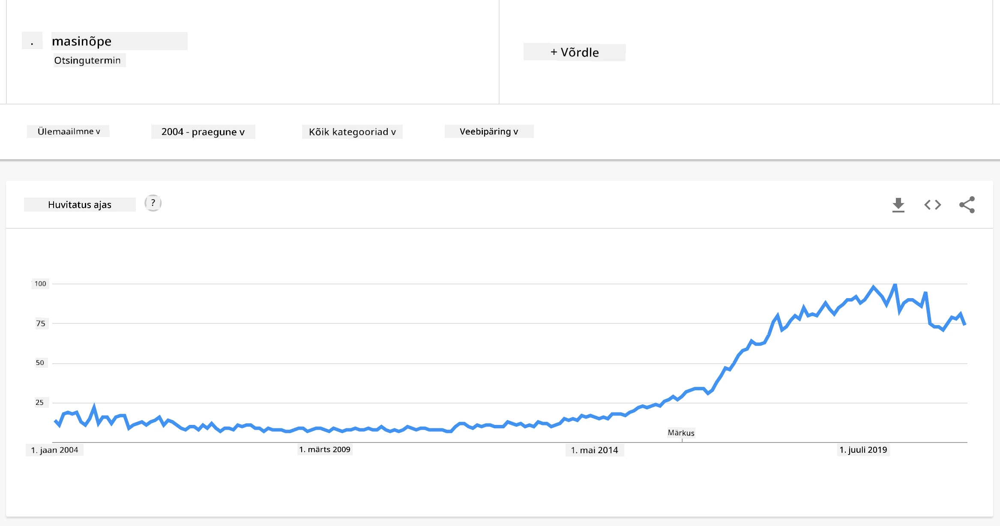
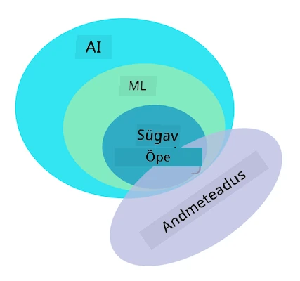

<!--
CO_OP_TRANSLATOR_METADATA:
{
  "original_hash": "69389392fa6346e0dfa30f664b7b6fec",
  "translation_date": "2025-10-11T11:25:14+00:00",
  "source_file": "1-Introduction/1-intro-to-ML/README.md",
  "language_code": "et"
}
-->
# Sissejuhatus masinõppesse

## [Eelloengu viktoriin](https://ff-quizzes.netlify.app/en/ml/)

---

> 🎥 Klõpsa ülaloleval pildil, et vaadata lühikest videot, mis käsitleb seda õppetundi.

Tere tulemast sellele klassikalise masinõppe kursusele algajatele! Olgu sul selle teemaga varasem kogemus või oled kogenud ML-i praktik, kes soovib oma teadmisi värskendada, meil on hea meel, et oled meiega liitunud! Soovime luua sõbraliku alguspunkti sinu ML-i õpingutele ja oleksime rõõmsad, kui jagaksid oma [tagasisidet](https://github.com/microsoft/ML-For-Beginners/discussions).

> 🎥 Klõpsa ülaloleval pildil, et vaadata videot: MIT-i John Guttag tutvustab masinõpet

---
## Masinõppega alustamine

Enne selle õppekava alustamist tuleb sul oma arvuti seadistada ja valmis panna, et saaksid lokaalselt käivitada märkmikke.

- **Seadista oma arvuti nende videote abil**. Kasuta järgmisi linke, et õppida [kuidas installida Python](https://youtu.be/CXZYvNRIAKM) oma süsteemi ja [seadistada tekstiredaktor](https://youtu.be/EU8eayHWoZg) arendamiseks.
- **Õpi Pythonit**. Soovitatav on omada põhiteadmisi [Pythonist](https://docs.microsoft.com/learn/paths/python-language/?WT.mc_id=academic-77952-leestott), programmeerimiskeelest, mis on kasulik andmeteadlastele ja mida me selles kursuses kasutame.
- **Õpi Node.js-i ja JavaScripti**. Kasutame JavaScripti paaril korral selles kursuses veebirakenduste loomisel, seega pead olema installinud [node](https://nodejs.org) ja [npm](https://www.npmjs.com/), samuti [Visual Studio Code](https://code.visualstudio.com/) nii Pythoni kui JavaScripti arendamiseks.
- **Loo GitHubi konto**. Kuna leidsid meid siit [GitHubist](https://github.com), võib sul juba konto olla, aga kui ei, siis loo see ja hargne selle õppekava kasutamiseks enda tarbeks. (Võid meile ka tähe anda 😊)
- **Tutvu Scikit-learniga**. Tutvu [Scikit-learniga](https://scikit-learn.org/stable/user_guide.html), ML-i teekide komplektiga, millele viitame nendes õppetundides.

---
## Mis on masinõpe?

Termin 'masinõpe' on üks tänapäeva populaarsemaid ja sagedamini kasutatavaid termineid. On suur tõenäosus, et oled seda terminit vähemalt korra kuulnud, kui sul on mingisugune kokkupuude tehnoloogiaga, olenemata valdkonnast, kus töötad. Masinõppe mehhanismid on aga enamiku inimeste jaoks müsteerium. Masinõppe algajale võib teema tunduda mõnikord üle jõu käiv. Seetõttu on oluline mõista, mis masinõpe tegelikult on, ja õppida seda samm-sammult praktiliste näidete kaudu.

---
## Hüppekurv

> Google Trends näitab termini 'masinõpe' hiljutist hüppekurvi

---
## Müsteeriumite universum

Me elame universumis, mis on täis põnevaid müsteeriume. Suured teadlased nagu Stephen Hawking, Albert Einstein ja paljud teised on pühendanud oma elu tähendusrikka teabe otsimisele, mis paljastab meie ümber oleva maailma saladusi. See on inimlik õppimise seisund: inimlaps õpib uusi asju ja avastab oma maailma struktuuri aastate jooksul, kui ta kasvab täiskasvanuks.

---
## Lapse aju

Lapse aju ja meeled tajuvad ümbritseva maailma fakte ning õpivad järk-järgult elu varjatud mustreid, mis aitavad lapsel luua loogilisi reegleid õpitud mustrite tuvastamiseks. Inimaju õppimisprotsess teeb inimestest selle maailma kõige keerukama elusolendi. Jätkuv õppimine varjatud mustrite avastamise kaudu ja nende mustrite põhjal innovatsioon võimaldab meil end kogu elu jooksul paremaks muuta. See õppimisvõime ja arenemisvõime on seotud kontseptsiooniga, mida nimetatakse [aju plastilisuseks](https://www.simplypsychology.org/brain-plasticity.html). Pealiskaudselt võime tõmmata mõningaid motiveerivaid sarnasusi inimaju õppimisprotsessi ja masinõppe kontseptsioonide vahel.

---
## Inimaju

[Inimaju](https://www.livescience.com/29365-human-brain.html) tajub asju reaalsest maailmast, töötleb tajutud teavet, teeb ratsionaalseid otsuseid ja sooritab teatud tegevusi vastavalt oludele. Seda nimetame intelligentselt käitumiseks. Kui programmeerime masina jaoks intelligentse käitumisprotsessi jäljenduse, nimetatakse seda tehisintellektiks (AI).

---
## Mõned terminid

Kuigi termineid võib segamini ajada, on masinõpe (ML) tehisintellekti oluline alamhulk. **ML tegeleb spetsiaalsete algoritmide kasutamisega, et avastada tähendusrikast teavet ja leida tajutud andmetest varjatud mustreid, mis toetavad ratsionaalset otsustusprotsessi**.

---
## AI, ML, süvaõpe

> Diagramm, mis näitab AI, ML-i, süvaõppe ja andmeteaduse vahelisi seoseid. Infograafik autorilt [Jen Looper](https://twitter.com/jenlooper), inspireeritud [sellest graafikust](https://softwareengineering.stackexchange.com/questions/366996/distinction-between-ai-ml-neural-networks-deep-learning-and-data-mining)

---
## Käsitletavad kontseptsioonid

Selles õppekavas käsitleme ainult masinõppe põhikontseptsioone, mida algaja peab teadma. Käsitleme seda, mida nimetame 'klassikaliseks masinõppeks', kasutades peamiselt Scikit-learn'i, suurepärast teeki, mida paljud õpilased kasutavad põhitõdede õppimiseks. Laiemate tehisintellekti või süvaõppe kontseptsioonide mõistmiseks on tugev masinõppe põhiteadmiste baas hädavajalik, ja seetõttu soovime seda siin pakkuda.

---
## Selles kursuses õpid:

- masinõppe põhikontseptsioone
- ML-i ajalugu
- ML ja õiglus
- regressiooni ML-tehnikaid
- klassifikatsiooni ML-tehnikaid
- klasterdamise ML-tehnikaid
- loomuliku keele töötlemise ML-tehnikaid
- ajareegressiooni prognoosimise ML-tehnikaid
- tugevdusõpet
- ML-i rakendusi päriselus

---
## Mida me ei käsitle

- süvaõpet
- närvivõrke
- tehisintellekti

Parema õppimiskogemuse huvides väldime närvivõrkude keerukust, 'süvaõpet' - mitmekihilist mudelite loomist närvivõrkude abil - ja tehisintellekti, mida käsitleme eraldi õppekavas. Pakume ka tulevast andmeteaduse õppekava, et keskenduda sellele suurema valdkonna aspektile.

---
## Miks õppida masinõpet?

Masinõpe süsteemide perspektiivist on defineeritud kui automatiseeritud süsteemide loomine, mis suudavad andmetest õppida varjatud mustreid, et aidata teha intelligentseid otsuseid.

See motivatsioon on laias laastus inspireeritud sellest, kuidas inimaju õpib teatud asju välismaailmast tajutud andmete põhjal.

✅ Mõtle hetkeks, miks ettevõte võiks eelistada masinõppe strateegiaid võrreldes kõvakodeeritud reeglipõhise mootoriga.

---
## Masinõppe rakendused

Masinõppe rakendused on nüüd peaaegu kõikjal ja sama levinud kui andmed, mis voolavad meie ühiskondades, mida genereerivad meie nutitelefonid, ühendatud seadmed ja muud süsteemid. Arvestades tipptasemel masinõppe algoritmide tohutut potentsiaali, on teadlased uurinud nende võimekust lahendada mitmemõõtmelisi ja multidistsiplinaarseid päriseluprobleeme suurepäraste positiivsete tulemustega.

---
## Rakendatud ML-i näited

**Masinõpet saab kasutada mitmel viisil**:

- Haiguse tõenäosuse ennustamiseks patsiendi haigusloo või aruannete põhjal.
- Ilmaandmete kasutamiseks ilmastikuolude ennustamiseks.
- Teksti sentimenti mõistmiseks.
- Valeuudiste tuvastamiseks, et peatada propaganda levik.

Finants-, majandus-, maateadus-, kosmoseuuringud, biomeditsiinitehnika, kognitiivteadus ja isegi humanitaarteaduste valdkonnad on kohandanud masinõpet, et lahendada oma valdkonna keerulisi, andmetöötlusmahukaid probleeme.

---
## Kokkuvõte

Masinõpe automatiseerib mustrite avastamise protsessi, leides tähendusrikkaid teadmisi pärismaailma või genereeritud andmetest. See on osutunud äärmiselt väärtuslikuks äris, tervishoius ja finantsrakendustes, muu hulgas.

Lähitulevikus saab masinõppe põhialuste mõistmine olema hädavajalik inimestele igast valdkonnast, arvestades selle laialdast kasutuselevõttu.

---
# 🚀 Väljakutse

Joonista paberil või veebirakenduse, näiteks [Excalidraw](https://excalidraw.com/), abil oma arusaam AI, ML-i, süvaõppe ja andmeteaduse erinevustest. Lisa ideid probleemidest, mida igaüks neist tehnikatest hästi lahendada suudab.

# [Järelloengu viktoriin](https://ff-quizzes.netlify.app/en/ml/)

---
# Ülevaade ja iseseisev õppimine

Et rohkem teada saada, kuidas töötada ML-algoritmidega pilves, järgi seda [õppimisrada](https://docs.microsoft.com/learn/paths/create-no-code-predictive-models-azure-machine-learning/?WT.mc_id=academic-77952-leestott).

Võta [õppimisrada](https://docs.microsoft.com/learn/modules/introduction-to-machine-learning/?WT.mc_id=academic-77952-leestott), et õppida ML-i põhialuseid.

---
# Ülesanne

[Alusta ja tööta](assignment.md)

---

**Lahtiütlus**:  
See dokument on tõlgitud AI tõlketeenuse [Co-op Translator](https://github.com/Azure/co-op-translator) abil. Kuigi püüame tagada täpsust, palume arvestada, et automaatsed tõlked võivad sisaldada vigu või ebatäpsusi. Algne dokument selle algses keeles tuleks pidada autoriteetseks allikaks. Olulise teabe puhul soovitame kasutada professionaalset inimtõlget. Me ei vastuta selle tõlke kasutamisest tulenevate arusaamatuste või valesti tõlgenduste eest.