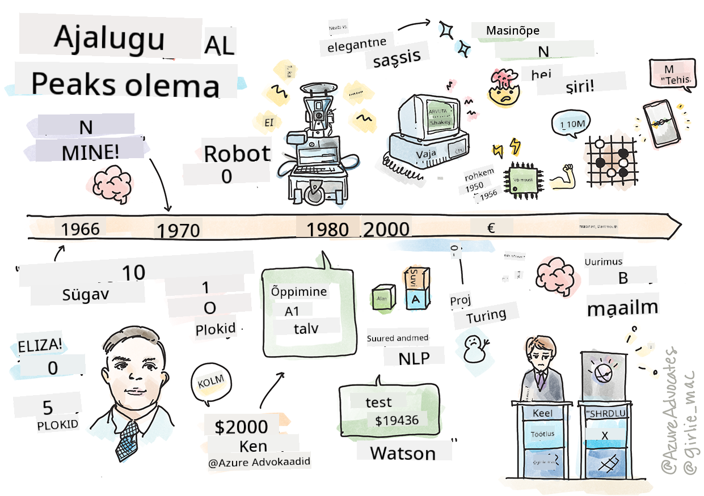
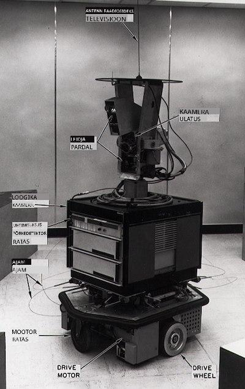

<!--
CO_OP_TRANSLATOR_METADATA:
{
  "original_hash": "6a05fec147e734c3e6bfa54505648e2b",
  "translation_date": "2025-10-11T11:28:06+00:00",
  "source_file": "1-Introduction/2-history-of-ML/README.md",
  "language_code": "et"
}
-->
# Masinõppe ajalugu

> Visandmärkmed: [Tomomi Imura](https://www.twitter.com/girlie_mac)

## [Eelloengu viktoriin](https://ff-quizzes.netlify.app/en/ml/)

---

> 🎥 Klõpsake ülaloleval pildil, et vaadata lühivideot, mis käsitleb seda õppetundi.

Selles õppetunnis vaatame läbi masinõppe ja tehisintellekti ajaloo olulisemad verstapostid.

Tehisintellekti (AI) kui valdkonna ajalugu on tihedalt seotud masinõppe ajalooga, kuna ML-i aluseks olevad algoritmid ja arvutuslikud edusammud toetasid AI arengut. Tasub meeles pidada, et kuigi need valdkonnad hakkasid eraldiseisvate uurimisvaldkondadena kujunema 1950ndatel, eelnesid sellele ajastule olulised [algoritmilised, statistilised, matemaatilised, arvutuslikud ja tehnilised avastused](https://wikipedia.org/wiki/Timeline_of_machine_learning). Tegelikult on inimesed nende küsimuste üle mõelnud juba [sadu aastaid](https://wikipedia.org/wiki/History_of_artificial_intelligence): see artikkel käsitleb mõtlemisvõimelise masina idee ajaloolisi intellektuaalseid aluseid.

---
## Märkimisväärsed avastused

- 1763, 1812 [Bayesi teoreem](https://wikipedia.org/wiki/Bayes%27_theorem) ja selle eelkäijad. See teoreem ja selle rakendused on aluseks järeldustele, kirjeldades sündmuse tõenäosust varasema teadmise põhjal.
- 1805 [Väikseimate ruutude meetod](https://wikipedia.org/wiki/Least_squares) prantsuse matemaatiku Adrien-Marie Legendre'i poolt. See teooria, mida õpite meie regressiooni õppetükis, aitab andmete sobitamisel.
- 1913 [Markovi ahelad](https://wikipedia.org/wiki/Markov_chain), nime saanud vene matemaatiku Andrey Markovi järgi, kirjeldavad järjestikku võimalikke sündmusi varasema seisundi põhjal.
- 1957 [Perceptron](https://wikipedia.org/wiki/Perceptron) on lineaarse klassifikaatori tüüp, mille leiutas Ameerika psühholoog Frank Rosenblatt ja mis on aluseks süvaõppe edusammudele.

---

- 1967 [Lähima naabri algoritm](https://wikipedia.org/wiki/Nearest_neighbor) loodi algselt marsruutide kaardistamiseks. ML-i kontekstis kasutatakse seda mustrite tuvastamiseks.
- 1970 [Tagasiarvutus](https://wikipedia.org/wiki/Backpropagation) kasutatakse [edasisuunatud närvivõrkude](https://wikipedia.org/wiki/Feedforward_neural_network) treenimiseks.
- 1982 [Korduvad närvivõrgud](https://wikipedia.org/wiki/Recurrent_neural_network) on tehisnärvivõrgud, mis on tuletatud edasisuunatud närvivõrkudest ja loovad ajutisi graafe.

✅ Tehke veidi uurimistööd. Millised muud kuupäevad paistavad ML-i ja AI ajaloo seisukohalt olulised?

---
## 1950: Mõtlevad masinad

Alan Turing, tõeliselt erakordne isik, kes valiti [avaliku hääletuse teel 2019. aastal](https://wikipedia.org/wiki/Icons:_The_Greatest_Person_of_the_20th_Century) 20. sajandi suurimaks teadlaseks, aitas rajada mõtlevate masinate kontseptsiooni aluseid. Ta võitles skeptikute ja oma vajadusega selle kontseptsiooni empiirilise tõestuse järele, luues osaliselt [Turingi testi](https://www.bbc.com/news/technology-18475646), mida uurite meie NLP õppetundides.

---
## 1956: Dartmouthi suvine uurimisprojekt

"Dartmouthi suvine uurimisprojekt tehisintellekti alal oli tehisintellekti kui valdkonna jaoks oluline sündmus," ja just siin võeti kasutusele termin 'tehisintellekt' ([allikas](https://250.dartmouth.edu/highlights/artificial-intelligence-ai-coined-dartmouth)).

> Iga õppimise aspekt või mis tahes muu intelligentsuse omadus on põhimõtteliselt nii täpselt kirjeldatav, et masin suudab seda simuleerida.

---

Peamine uurija, matemaatikaprofessor John McCarthy, lootis "edasi liikuda eeldusel, et iga õppimise aspekt või mis tahes muu intelligentsuse omadus on põhimõtteliselt nii täpselt kirjeldatav, et masin suudab seda simuleerida." Osalejate hulka kuulus ka teine valdkonna suurkuju Marvin Minsky.

Töötuba on tunnustatud mitmete arutelude algatamise ja edendamise eest, sealhulgas "sümboolsete meetodite tõus, piiratud valdkondadele keskendunud süsteemid (varased ekspertsüsteemid) ja deduktiivsed süsteemid versus induktiivsed süsteemid." ([allikas](https://wikipedia.org/wiki/Dartmouth_workshop)).

---
## 1956 - 1974: "Kuldne ajastu"

1950ndatest kuni 1970ndate keskpaigani valitses optimism, et AI suudab lahendada palju probleeme. 1967. aastal väitis Marvin Minsky enesekindlalt, et "Ühe põlvkonna jooksul ... tehisintellekti loomise probleem lahendatakse oluliselt." (Minsky, Marvin (1967), Computation: Finite and Infinite Machines, Englewood Cliffs, N.J.: Prentice-Hall)

Looduskeele töötlemise uurimine õitses, otsingut täiustati ja muudeti võimsamaks ning loodi 'mikromaailmade' kontseptsioon, kus lihtsaid ülesandeid täideti lihtsate keeleliste juhiste abil.

---

Uuringuid rahastasid hästi valitsusasutused, arvutusvõimekus ja algoritmid arenesid ning loodi intelligentsete masinate prototüüpe. Mõned neist masinatest hõlmavad:

* [Shakey robot](https://wikipedia.org/wiki/Shakey_the_robot), kes suutis liikuda ja otsustada, kuidas ülesandeid 'intelligentselt' täita.

    
    > Shakey aastal 1972

---

* Eliza, varajane 'vestlusrobot', suutis inimestega vestelda ja toimida primitiivse 'terapeudina'. Õpite Eliza kohta rohkem NLP õppetundides.

    
    > Eliza versioon, vestlusrobot

---

* "Plokkide maailm" oli näide mikromaailmast, kus plokke sai virnastada ja sorteerida ning masinatele otsuste tegemise õpetamise katseid sai testida. Keeltöötluse edendamiseks aitasid kaasa sellised raamatukogud nagu [SHRDLU](https://wikipedia.org/wiki/SHRDLU).

    

    > 🎥 Klõpsake ülaloleval pildil, et vaadata videot: Plokkide maailm SHRDLU-ga

---
## 1974 - 1980: "AI talv"

1970ndate keskpaigaks sai selgeks, et 'intelligentsete masinate' loomise keerukust oli alahinnatud ja selle lubadusi, arvestades olemasolevat arvutusvõimekust, oli üle hinnatud. Rahastamine kuivas kokku ja usaldus valdkonna vastu vähenes. Mõned probleemid, mis mõjutasid usaldust, hõlmavad:
---
- **Piirangud**. Arvutusvõimekus oli liiga piiratud.
- **Kombinatoorne plahvatus**. Parameetrite hulk, mida tuli treenida, kasvas eksponentsiaalselt, kui arvutitelt nõuti rohkem, ilma et arvutusvõimekus ja -võimalused oleksid paralleelselt arenenud.
- **Andmete nappus**. Andmete nappus takistas algoritmide testimise, arendamise ja täiustamise protsessi.
- **Kas me küsime õigeid küsimusi?**. Hakkasid tekkima kahtlused esitatud küsimuste osas. Teadlased hakkasid saama kriitikat oma lähenemisviiside kohta:
  - Turingi testid seati kahtluse alla, muu hulgas 'hiina toa teooria' kaudu, mis väitis, et "digitaalse arvuti programmeerimine võib panna selle näima, et ta mõistab keelt, kuid ei suuda tekitada tõelist mõistmist." ([allikas](https://plato.stanford.edu/entries/chinese-room/))
  - Küsiti tehisintellektide, nagu "terapeut" ELIZA, eetilisuse kohta ühiskonnas.

---

Samal ajal hakkasid kujunema erinevad AI koolkonnad. Loodi dihhotoomia ["räpane" vs. "korralik AI"](https://wikipedia.org/wiki/Neats_and_scruffies) praktikate vahel. _Räpased_ laborid kohandasid programme tundide kaupa, kuni saavutati soovitud tulemused. _Korralikud_ laborid "keskendusid loogikale ja formaalsele probleemide lahendamisele". ELIZA ja SHRDLU olid tuntud _räpased_ süsteemid. 1980ndatel, kui tekkis nõudlus ML-süsteemide reprodutseeritavuse järele, võttis _korralik_ lähenemine järk-järgult juhtpositsiooni, kuna selle tulemused on paremini seletatavad.

---
## 1980ndate ekspertsüsteemid

Valdkonna kasvades sai selgemaks selle kasu ärile ning 1980ndatel kasvas ka 'ekspertsüsteemide' levik. "Ekspertsüsteemid olid esimeste tõeliselt edukate tehisintellekti (AI) tarkvara vormide hulgas." ([allikas](https://wikipedia.org/wiki/Expert_system)).

Selline süsteem on tegelikult _hübriid_, koosnedes osaliselt reeglite mootorist, mis määratleb ärinõuded, ja järeldusmootorist, mis kasutas reeglite süsteemi uute faktide tuletamiseks.

Sellel ajastul pöörati üha enam tähelepanu ka närvivõrkudele.

---
## 1987 - 1993: AI 'külm'

Spetsialiseeritud ekspertsüsteemide riistvara levik avaldas kahjuks mõju, muutudes liiga spetsialiseerituks. Personaalarvutite tõus konkureeris nende suurte, spetsialiseeritud, tsentraliseeritud süsteemidega. Arvutite demokratiseerimine oli alanud ja see sillutas lõpuks teed tänapäevasele suurandmete plahvatusele.

---
## 1993 - 2011

See ajastu tõi ML-i ja AI jaoks uue ajastu, kus suudeti lahendada varasemad probleemid, mis olid põhjustatud andmete ja arvutusvõimekuse puudumisest. Andmete hulk hakkas kiiresti kasvama ja muutuma laiemalt kättesaadavaks, nii heas kui halvas, eriti nutitelefoni tulekuga umbes 2007. aastal. Arvutusvõimekus kasvas eksponentsiaalselt ja algoritmid arenesid koos sellega. Valdkond hakkas küpsema, kuna varasemad vabad päevad hakkasid kristalliseeruma tõeliseks distsipliiniks.

---
## Tänapäev

Tänapäeval puudutavad masinõpe ja AI peaaegu kõiki meie eluvaldkondi. See ajastu nõuab algoritmide mõjude ja riskide hoolikat mõistmist inimeludele. Nagu Microsofti Brad Smith on öelnud: "Infotehnoloogia tõstatab küsimusi, mis puudutavad põhilisi inimõiguste kaitse aspekte, nagu privaatsus ja väljendusvabadus. Need küsimused suurendavad vastutust tehnoloogiaettevõtete jaoks, kes neid tooteid loovad. Meie arvates kutsuvad need esile ka valitsuse läbimõeldud regulatsiooni ja normide väljatöötamist aktsepteeritavate kasutusviiside osas." ([allikas](https://www.technologyreview.com/2019/12/18/102365/the-future-of-ais-impact-on-society/)).

---

Jääb näha, mida tulevik toob, kuid oluline on mõista neid arvutisüsteeme ning tarkvara ja algoritme, mida need käitavad. Loodame, et see õppekava aitab teil paremini mõista, et saaksite ise otsustada.

> 🎥 Klõpsake ülaloleval pildil, et vaadata videot: Yann LeCun arutleb süvaõppe ajaloo üle selles loengus

---
## 🚀Väljakutse

Süvenege ühte neist ajaloolistest hetkedest ja uurige rohkem selle taga olevate inimeste kohta. Seal on põnevaid tegelasi ja ükski teaduslik avastus pole kunagi loodud kultuurilisest vaakumist. Mida avastate?

## [Järelloengu viktoriin](https://ff-quizzes.netlify.app/en/ml/)

---
## Ülevaade ja iseseisev õppimine

Siin on vaatamiseks ja kuulamiseks mõeldud materjalid:

[See taskuhääling, kus Amy Boyd arutleb AI evolutsiooni üle](http://runasradio.com/Shows/Show/739)

---

## Ülesanne

[Loo ajajoon](assignment.md)

---

**Lahtiütlus**:  
See dokument on tõlgitud AI tõlketeenuse [Co-op Translator](https://github.com/Azure/co-op-translator) abil. Kuigi püüame tagada täpsust, palume arvestada, et automaatsed tõlked võivad sisaldada vigu või ebatäpsusi. Algne dokument selle algses keeles tuleks pidada autoriteetseks allikaks. Olulise teabe puhul soovitame kasutada professionaalset inimtõlget. Me ei vastuta selle tõlke kasutamisest tulenevate arusaamatuste või valesti tõlgenduste eest.