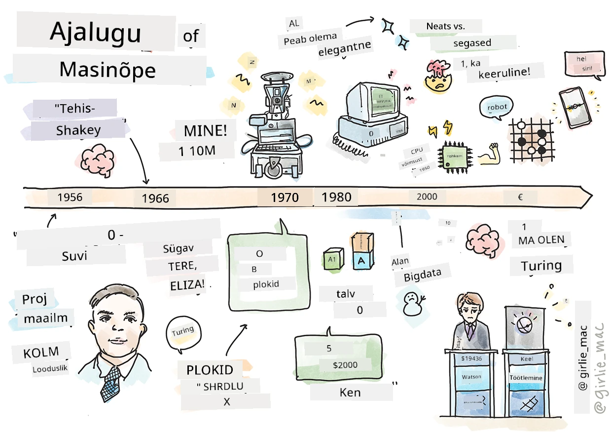
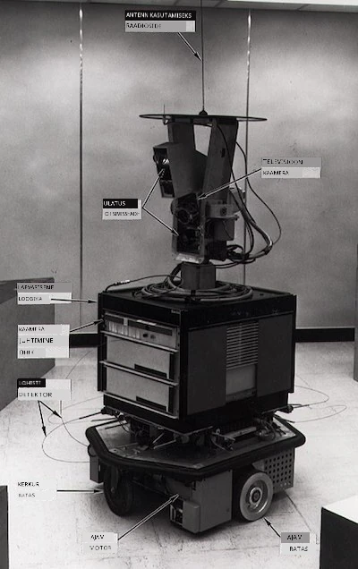
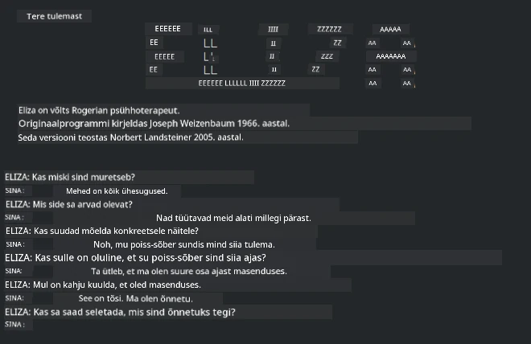

# Masinõppe ajalugu

> Sketchnote autor [Tomomi Imura](https://www.twitter.com/girlie_mac)

## [Eelkontrolli viktoriin](https://ff-quizzes.netlify.app/en/ml/)

---

> 🎥 Klõpsa ülaloleval pildil, et vaadata lühivideot selle õppetüki läbivaatamiseks.

Selles õppetükis vaatame üle masinõppe ja tehisintellekti ajaloo olulised verstapostid.

Tehisintellekti (TI) valdkonna ajalugu on põimunud masinõppe ajalooga, kuna masinõppe aluseks olevad algoritmid ja arvutuslikud edusammud aitasid kaasa TI arengule. Kasulik on meeles pidada, et kuigi need valdkonnad hakati 1950. aastatel eristuma, olid olulised [algoritmilised, statistilised, matemaatilised, arvutuslikud ja tehnilised avastused](https://wikipedia.org/wiki/Timeline_of_machine_learning) juba enne seda ja kattusid selle ajaga. Tegelikult on inimesed nende küsimustega mõelnud juba [sadu aastaid](https://wikipedia.org/wiki/History_of_artificial_intelligence): see artikkel käsitleb ajaloolisi intellektuaalseid aluseid ideele 'mõtlev masin'.

---
## Märkimisväärsed avastused

- 1763, 1812 [Bayesi teoreem](https://wikipedia.org/wiki/Bayes%27_theorem) ja selle eelkäijad. See teoreem ja selle rakendused on tuletamise alus, kirjeldades sündmuse toimumise tõenäosust eelnevate teadmiste põhjal.
- 1805 [Vähimate ruutude teooria](https://wikipedia.org/wiki/Least_squares), prantsuse matemaatiku Adrien-Marie Legendre’i poolt. Selle teooria kohta õpid meie regressiooniosas, see aitab andmete sobitamisel.
- 1913 [Markovi ahelad](https://wikipedia.org/wiki/Markov_chain), nime järgi vene matemaatik Andrey Markovi, kasutatakse võimalike sündmuste jada kirjeldamiseks varasema oleku põhjal.
- 1957 [Perceptron](https://wikipedia.org/wiki/Perceptron), Ameerika psühholoogi Frank Rosenblatti välja mõeldud lineaarne klassifikaator, mis on süvaõppe edusammude alus.

---

- 1967 [Nearest Neighbor](https://wikipedia.org/wiki/Nearest_neighbor) algoritm, algselt marsruutide kaardistamiseks loodud. Masinõppe kontekstis kasutatakse mustrite tuvastamiseks.
- 1970 [Tagasi levitamise meetod](https://wikipedia.org/wiki/Backpropagation) kasutatakse [feedforward närvivõrkude](https://wikipedia.org/wiki/Feedforward_neural_network) treenimiseks.
- 1982 [Rekursiivsed närvivõrgud](https://wikipedia.org/wiki/Recurrent_neural_network) on kunstlikud närvivõrgud, mis on tuletatud feedforward närvivõrkudest ja loovad ajaliselt sõltuvad graafid.

✅ Tee natuke uurimistööd. Millised teised kuupäevad paistavad masinõppe ja tehisintellekti ajaloos silma pöördepunktidena?

---
## 1950: Mõtlevaid masinaid

Alan Turing, tõeliselt tähelepanuväärne isik, keda [avalikkus 2019. aastal](https://wikipedia.org/wiki/Icons:_The_Greatest_Person_of_the_20th_Century) valis 20. sajandi suurimaks teadlaseks, aitas kaasa kontseptsiooni 'mõtlev masin' aluste loomisele. Ta püüdis tõestada seda ideed nii kahtlejate kui ka oma vajaduse kaudu empiiriliste tõendite järele, luues osaliselt selleks [Turingi testi](https://www.bbc.com/news/technology-18475646), mida sa uurid meie NLP õppetundides.

---
## 1956: Dartmouth'i suve-uuringuprojekt

"Dartmouth'i suve-uuringuprojekt tehisintellektil oli oluline tähendus tehisintellekti valdkonna kujunemisel," ja just seal võeti kasutusele termin 'tehisintellekt' ([allikas](https://250.dartmouth.edu/highlights/artificial-intelligence-ai-coined-dartmouth)).

> Iga õppe või muu intelligentsuse tunnus võib põhimõtteliselt olla nii täpselt kirjeldatud, et masin saab selle simuleerida.

---

Peauurija, matemaatikaprofessor John McCarthy lootsid "lähtuda oletusest, et iga õppe või muu intelligentsuse aspekt võib põhimõtteliselt olla nii täpselt kirjeldatud, et masin saab selle simuleerida." Osalejate seas oli ka teine valdkonna tunnustatud teadlane, Marvin Minsky.

Töötuba aitas algatada ja julgustada mitmeid arutelusid, sealhulgas "sümboolsete meetodite tõusu, piiratud domeenidega süsteemide (varased ekspertsüsteemid) ja deduktiivsete süsteemide versus induktiivsete süsteemide küsimusi." ([allikas](https://wikipedia.org/wiki/Dartmouth_workshop)).

---
## 1956 - 1974: "Kuldajad"

Alates 1950ndatest kuni 70ndate keskpaigani valitses suur optimism, et TI suudab lahendada mitmeid probleeme. 1967. aastal ütles Marvin Minsky enesekindlalt, et "Ühe põlvkonna jooksul ... on 'tehisintellekti' loomise probleem suuresti lahendatud." (Minsky, Marvin (1967), Computation: Finite and Infinite Machines, Englewood Cliffs, N.J.: Prentice-Hall)

Loomuliku keele töötlemine turgutas, otsing muutus täpsemaks ja võimsamaks ning tekkis kontseptsioon "mikromaailmadest", kus lihtsaid ülesandeid täideti tavakeele juhiste abil.

---

Uuringud olid hästi rahastatud valitsusasutuste poolt, toimusid edusammud arvutustes ja algoritmides ning ehitati intelligentsete masinate prototüüpe. Mõned neist masinatest olid:

* [Shakey robot](https://wikipedia.org/wiki/Shakey_the_robot), kes suutis manööverdada ja otsustada, kuidas ülesandeid "intelligentsemalt" täita.

    
    > Shakey 1972. aastal

---

* Eliza, varajane 'juturobot', kes suutis vestelda inimestega ja toimida primitiivse "terapeudina". Sa õpid Elizast rohkem NLP õppetundides.

    
    > Eliza, juturoboti versioon

---

* "Blocks world" oli näide mikromaailmast, kus klotse sai laduda ja sorteerida ning masinatele otsuste tegemise katseid teha. Edusammud, mis kasutavad teeke nagu [SHRDLU](https://wikipedia.org/wiki/SHRDLU), aitasid keele töötlemist edasi viia.

    

    > 🎥 Klõpsa ülaloleval pildil, et vaadata videot: Blocks world koos SHRDLU-ga

---
## 1974 - 1980: "TI talv"

1970. aastate keskpaigaks sai selgeks, et intelligentsete masinate tegemise keerukust oli alahinnatud ja lubadusi arvutusvõimsuse kontekstis liialdatud. Rahastamine kuivatas ja valdkonna usaldus aeglustus. Mõned usaldusväärsust mõjutanud probleemid olid:
---
- **Piirangud**. Arvutusvõimsus oli liiga piiratud.
- **Kombinatoriline plahvatus**. Treenimiseks vajalike parameetrite arv kasvas eksponentsiaalselt ning arvutusvõime ei arenenud samas tempos.
- **Andmete vähesus**. Andmete nappus takistas algoritmide testimist, arendamist ja täpsustamist.
- **Kas me esitame õigeid küsimusi?**. Esitatud küsimusi hakati kahtluse alla seadma. Uurijaid kritiseeriti nende lähenemisviiside pärast:
  - Turingi testi kahtluse alla seadmine, muu hulgas 'Hiina toa teooria' abil, mis väidab, et "digitaalset arvutit programmeerides võib tunduda, et mõistetakse keelt, kuid see ei suuda tegelikku arusaamist tekitada." ([allikas](https://plato.stanford.edu/entries/chinese-room/))
  - Tehisintellektide, nagu "terapeut" ELIZA, ühiskonda toomise eetika sai kahtluse alla.

---

Samal ajal hakkasid tekkinud erinevad TI mõtteviisid. Loomist ilmnes dikotoomia ["räpane" vs. "korralik TI"] (https://wikipedia.org/wiki/Neats_and_scruffies) praktikate vahel. _Räpased_ laborid kohendasid programme tundide kaupa, kuni tuli soovitud tulemus. _Korralikud_ laborid "keskendusid loogikale ja formaalsele probleemide lahendamisele". ELIZA ja SHRDLU olid tuntud _räpased_ süsteemid. 1980ndatel, kui tekkis nõudlus masinõppesüsteemide reprodutseerimise järele, tõusis esiplaanile järk-järgult _korralik_ lähenemine, kuna selle tulemused on paremini seletatavad.

---
## 1980ndate ekspertsüsteemid

Valdkond kasvas, selgust tuli ärilisest kasust ja 1980ndatel levisid laialdaselt 'ekspertsüsteemid'. "Ekspertsüsteemid olid üks esimesi tõeliselt edukamaid tehisintellektitarkvarasid." ([allikas](https://wikipedia.org/wiki/Expert_system)).

Sellised süsteemid on tegelikult _hübriidid_, koosnedes osaliselt reeglite mootorist, mis määratleb ärinõuded, ja järeldusmootorist, mis kasutab reeglitest tuletatavaid uusi fakte.

Selles ajastus pöörati üha rohkem tähelepanu närvivõrkudele.

---
## 1987 - 1993: TI 'vaikus'

Spetsialiseeritud ekspertsüsteemide riistvara hulk muutus kahjuks liiga spetsiifiliseks. Isikliku arvuti tõus konkurentsis nende suurte, spetsialiseeritud tsentraliseeritud süsteemidega. Arvutite demokratiseerimine oli alanud ja see sillutas teed tänapäeva suurandmete plahvatusele.

---
## 1993 - 2011

See epohh tähistas uut ajastut masinõppe ja tehisintellekti jaoks, mis suutsid lahendada varasema andmete ja arvutusvõimsuse puudusest tingitud probleeme. Andmete hulk hakkas kiiresti kasvama ja muutus kättesaadavamaks, nii heas kui halvas, eriti nutitelefoni tulekuga umbes 2007. aastal. Arvutusvõimsus kasvas eksponentsiaalselt ja algoritmid arenesid sellega kaasas. Valdkond muutus küpsemaks, kui varem vabal kujul toimunud päevad hakkasid kristalliseeruma tõeliseks distsipliiniks.

---
## Tänapäeval

Tänapäeval mõjutavad masinõpe ja tehisintellekt praktiliselt kõiki eluvaldkondi. See ajastu nõuab hoolikat arusaamist riskidest ja potentsiaalsetest mõjudest inimeste elule. Nagu Microsofti Brad Smith on öelnud: "Infotehnoloogia tõstatab küsimusi, mis puutuvad kokku põhiliste inimõiguste kaitsega nagu privaatsus ja sõnavabadus. Need küsimused suurendavad tehnoloogiaettevõtete vastutust, kes loovad neid tooteid. Meie seisukohast nõuavad nad ka läbimõeldud riiklikku regulatsiooni ja normide väljatöötamist aktsepteeritavate kasutusviiside kohta" ([allikas](https://www.technologyreview.com/2019/12/18/102365/the-future-of-ais-impact-on-society/)).

---

Tuleviku osas on veel vara öelda, kuid oluline on mõista neid arvutisüsteeme ning tarkvara ja algoritme, millega nad töötavad. Loodame, et see õppekava aitab sul paremini mõista, et saaksid ise otsustada.

> 🎥 Klõpsa ülaloleval pildil, et vaadata videot: Yann LeCun räägib selle loengu ajal sügava õppimise ajaloost

---
## 🚀Väljakutse

Uuri mõnda neist ajaloolistest hetkedest ja saa rohkem teada inimestest nende taga. Seal on põnevaid tegelasi, ning ükski teaduslik avastus pole kunagi sündinud kultuurilisest vaakumist. Mida sa avastad?

## [Järgnev viktoriin](https://ff-quizzes.netlify.app/en/ml/)

---
## Kordamine ja iseseisev õpe

Siin on vaatamiseks ja kuulamiseks materjale:

[See podcast, kus Amy Boyd räägib tehisintellekti arengust](http://runasradio.com/Shows/Show/739)

---

## Kodune ülesanne

[Loo ajaskaala](assignment.md)

---

<!-- CO-OP TRANSLATOR DISCLAIMER START -->
**Lahtiütlus**:
See dokument on tõlgitud kasutades AI tõlketeenust [Co-op Translator](https://github.com/Azure/co-op-translator). Kuigi me püüdleme täpsuse poole, palun pange tähele, et automatiseeritud tõlgetes võib esineda vigu või ebatäpsusi. Originaaldokument selle emakeeles tuleks pidada autoriteetseks allikaks. Olulise teabe puhul soovitatakse kasutada professionaalset inimtõlget. Me ei vastuta selle tõlkega seotud eksimustest või valesti mõistmistest.
<!-- CO-OP TRANSLATOR DISCLAIMER END -->