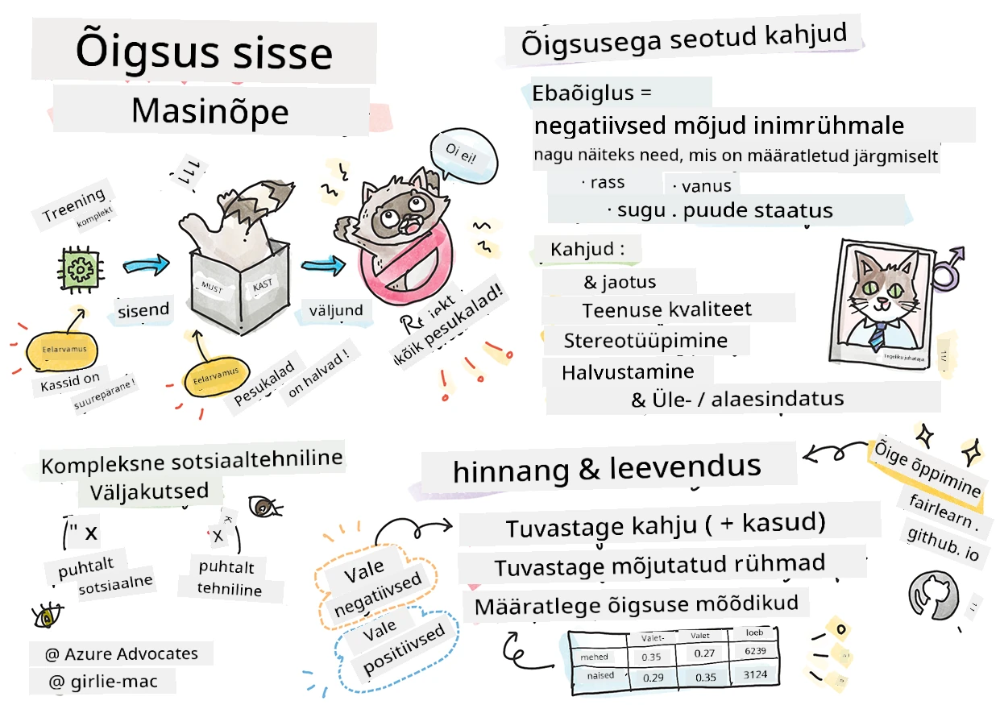

<!--
CO_OP_TRANSLATOR_METADATA:
{
  "original_hash": "9a6b702d1437c0467e3c5c28d763dac2",
  "translation_date": "2025-10-11T11:26:33+00:00",
  "source_file": "1-Introduction/3-fairness/README.md",
  "language_code": "et"
}
-->
# Masinõppe lahenduste loomine vastutustundliku tehisintellektiga

> Sketšimärkmed: [Tomomi Imura](https://www.twitter.com/girlie_mac)

## [Loengu-eelne viktoriin](https://ff-quizzes.netlify.app/en/ml/)

## Sissejuhatus

Selles õppekavas hakkate avastama, kuidas masinõpe mõjutab meie igapäevaelu. Juba praegu on süsteemid ja mudelid seotud igapäevaste otsustusprotsessidega, nagu tervishoiudiagnoosid, laenu heakskiitmine või pettuste tuvastamine. Seetõttu on oluline, et need mudelid töötaksid hästi ja pakuksid usaldusväärseid tulemusi. Nagu iga tarkvararakendus, võivad ka tehisintellekti süsteemid eksida ootustes või anda soovimatuid tulemusi. Seetõttu on hädavajalik mõista ja selgitada tehisintellekti mudeli käitumist.

Kujutage ette, mis juhtub, kui andmed, mida kasutate mudelite loomiseks, ei sisalda teatud demograafilisi rühmi, nagu rass, sugu, poliitilised vaated, religioon, või esindavad neid ebaproportsionaalselt. Mis saab siis, kui mudeli väljund eelistab teatud demograafilist rühma? Millised on tagajärjed rakendusele? Lisaks, mis juhtub siis, kui mudelil on kahjulik tulemus? Kes vastutab tehisintellekti süsteemi käitumise eest? Need on mõned küsimused, mida selles õppekavas uurime.

Selles õppetükis:

- Tõstate teadlikkust masinõppe õiglusest ja sellega seotud kahjudest.
- Tutvute praktika ja ebatavaliste stsenaariumide uurimisega, et tagada usaldusväärsus ja ohutus.
- Saate aru, miks on oluline luua kaasavaid süsteeme, mis võimestavad kõiki.
- Uurite, kui tähtis on kaitsta inimeste ja andmete privaatsust ja turvalisust.
- Näete, kui oluline on "klaaskasti" lähenemine tehisintellekti mudelite käitumise selgitamiseks.
- Mõistate, kuidas vastutus on hädavajalik tehisintellekti süsteemide usalduse loomiseks.

## Eeltingimus

Eeltingimusena palun läbige "Vastutustundliku tehisintellekti põhimõtted" õppeprogramm ja vaadake allolevat videot:

Lisateavet vastutustundliku tehisintellekti kohta leiate siit: [Õppeprogramm](https://docs.microsoft.com/learn/modules/responsible-ai-principles/?WT.mc_id=academic-77952-leestott)

> 🎥 Klõpsake ülaloleval pildil, et vaadata videot: Microsofti lähenemine vastutustundlikule tehisintellektile

## Õiglus

Tehisintellekti süsteemid peaksid kohtlema kõiki õiglaselt ja vältima sarnaste inimrühmade erinevat kohtlemist. Näiteks kui tehisintellekti süsteemid annavad juhiseid meditsiinilise ravi, laenutaotluste või töölevõtmise kohta, peaksid nad tegema samad soovitused kõigile, kellel on sarnased sümptomid, finantsolukord või professionaalsed kvalifikatsioonid. Igaüks meist kannab endaga kaasas pärilikke eelarvamusi, mis mõjutavad meie otsuseid ja tegevusi. Need eelarvamused võivad ilmneda andmetes, mida kasutame tehisintellekti süsteemide treenimiseks. Selline manipuleerimine võib mõnikord juhtuda tahtmatult. Sageli on raske teadlikult märgata, millal andmetesse eelarvamusi lisate.

**"Ebaõiglus"** hõlmab negatiivseid mõjusid või "kahjusid" inimrühmale, näiteks rassi, soo, vanuse või puude alusel. Peamised õigusega seotud kahjud võib jagada järgmiselt:

- **Jaotamine**, kui näiteks sugu või etnilist kuuluvust eelistatakse teisele.
- **Teenuse kvaliteet**. Kui treenite andmeid ühe konkreetse stsenaariumi jaoks, kuid tegelikkus on palju keerulisem, viib see halvasti toimiva teenuseni. Näiteks käte seebidosaator, mis ei suutnud tuvastada tumedanahalisi inimesi. [Viide](https://gizmodo.com/why-cant-this-soap-dispenser-identify-dark-skin-1797931773)
- **Halvustamine**. Ebaõiglane kriitika ja kellegi või millegi sildistamine. Näiteks pildisildistamise tehnoloogia, mis kurikuulsalt ekslikult sildistas tumedanahaliste inimeste pilte gorilladena.
- **Üle- või alaesindatus**. Idee, et teatud rühma ei nähta teatud ametis, ja iga teenus või funktsioon, mis seda jätkuvalt edendab, aitab kaasa kahjule.
- **Stereotüpiseerimine**. Teatud rühma seostamine eelnevalt määratud omadustega. Näiteks inglise ja türgi keele vahel tõlkiv süsteem võib eksida sõnadega, millel on sooga seotud stereotüüpsed seosed.

> Tõlge türgi keelde

> Tõlge tagasi inglise keelde

Tehisintellekti süsteemide kavandamisel ja testimisel peame tagama, et tehisintellekt oleks õiglane ega oleks programmeeritud tegema eelarvamuslikke või diskrimineerivaid otsuseid, mida ka inimestel on keelatud teha. Õigluse tagamine tehisintellektis ja masinõppes jääb keeruliseks sotsiaal-tehniliseks väljakutseks.

### Usaldusväärsus ja ohutus

Usalduse loomiseks peavad tehisintellekti süsteemid olema usaldusväärsed, ohutud ja järjepidevad nii tavapärastes kui ka ootamatutes tingimustes. Oluline on teada, kuidas tehisintellekti süsteemid käituvad erinevates olukordades, eriti kui tegemist on eranditega. Tehisintellekti lahenduste loomisel tuleb keskenduda sellele, kuidas lahendused suudavad toime tulla mitmesuguste olukordadega, millega nad kokku puutuvad. Näiteks peab isesõitev auto seadma inimeste ohutuse esikohale. Seetõttu peab autot juhtiv tehisintellekt arvestama kõiki võimalikke stsenaariume, millega auto võib kokku puutuda, nagu öö, äikesetormid või lumetormid, tänaval jooksvad lapsed, lemmikloomad, teetööd jne. Kui hästi tehisintellekti süsteem suudab usaldusväärselt ja ohutult toime tulla laia valiku tingimustega, peegeldab see andmeteadlase või tehisintellekti arendaja disaini- või testimisprotsessi taset.

> [🎥 Klõpsake siia, et vaadata videot: ](https://www.microsoft.com/videoplayer/embed/RE4vvIl)

### Kaasavus

Tehisintellekti süsteemid peaksid olema loodud kaasama ja võimestama kõiki. Tehisintellekti süsteemide kavandamisel ja rakendamisel tuvastavad andmeteadlased ja tehisintellekti arendajad süsteemis potentsiaalsed takistused, mis võivad tahtmatult inimesi välistada. Näiteks on maailmas 1 miljard puudega inimest. Tehisintellekti arenguga saavad nad igapäevaelus hõlpsamini juurde pääseda laiale hulgale teabele ja võimalustele. Takistuste kõrvaldamine loob võimalusi innovatsiooniks ja tehisintellekti toodete arendamiseks paremate kogemustega, mis toovad kasu kõigile.

> [🎥 Klõpsake siia, et vaadata videot: kaasavus tehisintellektis](https://www.microsoft.com/videoplayer/embed/RE4vl9v)

### Turvalisus ja privaatsus

Tehisintellekti süsteemid peaksid olema ohutud ja austama inimeste privaatsust. Inimesed usaldavad vähem süsteeme, mis seavad ohtu nende privaatsuse, teabe või elu. Masinõppe mudelite treenimisel toetume andmetele, et saavutada parimaid tulemusi. Selle käigus tuleb arvestada andmete päritolu ja terviklikkusega. Näiteks, kas andmed on kasutaja esitatud või avalikult kättesaadavad? Järgmisena, andmetega töötades on oluline arendada tehisintellekti süsteeme, mis suudavad kaitsta konfidentsiaalset teavet ja taluda rünnakuid. Kuna tehisintellekt muutub üha levinumaks, muutub privaatsuse kaitsmine ja olulise isikliku ning ärilise teabe turvalisuse tagamine üha kriitilisemaks ja keerulisemaks. Privaatsuse ja andmete turvalisuse küsimused vajavad tehisintellekti puhul erilist tähelepanu, kuna andmetele juurdepääs on hädavajalik, et tehisintellekti süsteemid saaksid teha täpseid ja informeeritud ennustusi ning otsuseid inimeste kohta.

> [🎥 Klõpsake siia, et vaadata videot: turvalisus tehisintellektis](https://www.microsoft.com/videoplayer/embed/RE4voJF)

- Tööstus on teinud privaatsuse ja turvalisuse valdkonnas märkimisväärseid edusamme, mida on oluliselt edendanud sellised regulatsioonid nagu GDPR (üldine andmekaitse määrus).
- Kuid tehisintellekti süsteemide puhul peame tunnistama pinget, mis tekib vajadusest koguda rohkem isikuandmeid, et muuta süsteemid isiklikumaks ja tõhusamaks – ja privaatsuse säilitamise vahel.
- Nagu internetiga ühendatud arvutite sünni puhul, näeme ka tehisintellektiga seotud turvalisusküsimuste suurt kasvu.
- Samal ajal on tehisintellekti kasutatud turvalisuse parandamiseks. Näiteks enamik kaasaegseid viirusetõrje skannereid põhineb tehisintellekti heuristikal.
- Peame tagama, et meie andmeteaduse protsessid sobituksid harmooniliselt uusimate privaatsuse ja turvalisuse praktikatega.

### Läbipaistvus

Tehisintellekti süsteemid peaksid olema arusaadavad. Läbipaistvuse oluline osa on tehisintellekti süsteemide ja nende komponentide käitumise selgitamine. Tehisintellekti süsteemide mõistmise parandamine nõuab, et sidusrühmad mõistaksid, kuidas ja miks need toimivad, et nad saaksid tuvastada võimalikke jõudlusprobleeme, ohutus- ja privaatsusprobleeme, eelarvamusi, välistavaid tavasid või soovimatuid tulemusi. Usume ka, et need, kes kasutavad tehisintellekti süsteeme, peaksid olema ausad ja avameelsed, kui, miks ja kuidas nad otsustavad neid rakendada. Samuti peaksid nad selgitama kasutatavate süsteemide piiranguid. Näiteks kui pank kasutab tehisintellekti süsteemi, et toetada tarbijate laenuotsuseid, on oluline uurida tulemusi ja mõista, millised andmed mõjutavad süsteemi soovitusi. Valitsused hakkavad tehisintellekti tööstusharudes reguleerima, seega peavad andmeteadlased ja organisatsioonid selgitama, kas tehisintellekti süsteem vastab regulatiivsetele nõuetele, eriti kui esineb soovimatu tulemus.

> [🎥 Klõpsake siia, et vaadata videot: läbipaistvus tehisintellektis](https://www.microsoft.com/videoplayer/embed/RE4voJF)

- Kuna tehisintellekti süsteemid on nii keerulised, on raske mõista, kuidas need töötavad ja tulemusi tõlgendada.
- See arusaamise puudumine mõjutab nende süsteemide haldamist, rakendamist ja dokumenteerimist.
- Veelgi olulisem on see, et see arusaamise puudumine mõjutab otsuseid, mis tehakse nende süsteemide toodetud tulemuste põhjal.

### Vastutus

Inimesed, kes kavandavad ja rakendavad tehisintellekti süsteeme, peavad vastutama selle eest, kuidas nende süsteemid toimivad. Vastutuse vajadus on eriti oluline tundlike tehnoloogiate, nagu näotuvastus, puhul. Viimasel ajal on näotuvastustehnoloogia järele olnud kasvav nõudlus, eriti õiguskaitseorganisatsioonide poolt, kes näevad tehnoloogia potentsiaali näiteks kadunud laste leidmisel. Kuid need tehnoloogiad võivad valitsuse poolt potentsiaalselt ohustada kodanike põhiõigusi, võimaldades näiteks konkreetsete isikute pidevat jälgimist. Seetõttu peavad andmeteadlased ja organisatsioonid vastutama selle eest, kuidas nende tehisintellekti süsteem mõjutab üksikisikuid või ühiskonda.

> 🎥 Klõpsake ülaloleval pildil, et vaadata videot: Hoiatused massilise jälgimise eest näotuvastuse kaudu

Lõppkokkuvõttes on üks suurimaid küsimusi meie põlvkonnale, kui esimesele põlvkonnale, kes toob tehisintellekti ühiskonda, kuidas tagada, et arvutid jääksid inimestele vastutavaks ja kuidas tagada, et arvutite disainerid jääksid vastutavaks kõigi teiste ees.

## Mõju hindamine

Enne masinõppe mudeli treenimist on oluline läbi viia mõju hindamine, et mõista tehisintellekti süsteemi eesmärki; milline on kavandatud kasutus; kus seda rakendatakse; ja kes süsteemiga suhtleb. Need on kasulikud hindajatele või testijatele, et teada saada, milliseid tegureid arvestada võimalike riskide ja oodatavate tagajärgede tuvastamisel.

Mõju hindamise fookusvaldkonnad:

* **Kahjulik mõju üksikisikutele**. Oluline on olla teadlik piirangutest või nõuetest, mittetoetatud kasutusest või teadaolevatest piirangutest, mis takistavad süsteemi toimimist, et tagada, et süsteemi ei kasutata viisil, mis võiks üksikisikutele kahju tekitada.
* **Andmete nõuded**. Süsteemi andmekasutuse mõistmine võimaldab hindajatel uurida andmenõudeid, mida tuleb arvesse võtta (nt GDPR või HIPAA andmereeglid). Lisaks tuleb uurida, kas andmete allikas või kogus on treenimiseks piisav.
* **Mõju kokkuvõte**. Koostage nimekiri võimalikest kahjudest, mis võivad süsteemi kasutamisest tuleneda. Masinõppe elutsükli jooksul vaadake üle, kas tuvastatud probleemid on leevendatud või lahendatud.
* **Rakendatavad eesmärgid** kuue põhiväärtuse jaoks. Hinnake, kas iga põhimõtte eesmärgid on täidetud ja kas on mingeid puudujääke.

## Vastutustundliku tehisintellektiga silumine

Sarnaselt tarkvararakenduse silumisele on tehisintellekti süsteemi silumine vajalik protsess süsteemi probleemide tuvastamiseks ja lahendamiseks. On palju tegureid, mis võivad põhjustada mudeli ootustele mittevastavat või vastutustundetut toimimist. Enamik traditsioonilisi mudeli jõudluse mõõdikuid on kvantitatiivsed koondandmed mudeli jõudluse kohta, mis ei ole piisavad, et analüüsida, kuidas mudel rikub vastutustundliku tehisintellekti põhimõtteid. Lisaks on masinõppe mudel must kast, mis teeb selle tulemuste põhjuseid raskesti mõistetavaks või selgitab eksimusi. Hiljem selles kursuses õpime kasutama vastutustundliku tehisintellekti juhtpaneeli, et aidata tehisintellekti süsteeme siluda. Juhtpaneel pakub terviklikku tööriista andmeteadlastele ja tehisintellekti arendajatele, et teha:

* **Vigade analüüs**. Tuvastada mudeli veajaotust, mis võib mõjutada süsteemi õiglust või usaldusväärsust.
* **Mudeli ülevaade**. Avastada, kus mudeli jõudluses esineb erinevusi andmekoortide vahel.
* **Andmete analüüs
## Ülevaade ja iseseisev õppimine

Selles tunnis õppisite masinõppe õiglus- ja ebaõigluskontseptsioonide põhitõdesid.

Vaadake seda töötuba, et teemadesse süveneda:

- Vastutustundliku tehisintellekti poole püüdlemine: Põhimõtete rakendamine praktikas, autorid Besmira Nushi, Mehrnoosh Sameki ja Amit Sharma

> 🎥 Klõpsake ülaloleval pildil, et vaadata videot: RAI Toolbox: Avatud lähtekoodiga raamistik vastutustundliku tehisintellekti loomiseks, autorid Besmira Nushi, Mehrnoosh Sameki ja Amit Sharma

Lugege ka:

- Microsofti RAI ressursikeskus: [Vastutustundliku tehisintellekti ressursid – Microsoft AI](https://www.microsoft.com/ai/responsible-ai-resources?activetab=pivot1%3aprimaryr4)

- Microsofti FATE uurimisrühm: [FATE: Õiglus, vastutus, läbipaistvus ja eetika tehisintellektis - Microsoft Research](https://www.microsoft.com/research/theme/fate/)

RAI tööriistakast:

- [Vastutustundliku tehisintellekti tööriistakasti GitHubi hoidla](https://github.com/microsoft/responsible-ai-toolbox)

Lugege Azure Machine Learningu tööriistade kohta, mis aitavad tagada õiglust:

- [Azure Machine Learning](https://docs.microsoft.com/azure/machine-learning/concept-fairness-ml?WT.mc_id=academic-77952-leestott)

## Ülesanne

[Uurige RAI tööriistakasti](assignment.md)

---

**Vastutusest loobumine**:  
See dokument on tõlgitud AI tõlketeenuse [Co-op Translator](https://github.com/Azure/co-op-translator) abil. Kuigi püüame tagada täpsust, palume arvestada, et automaatsed tõlked võivad sisaldada vigu või ebatäpsusi. Algne dokument selle algses keeles tuleks pidada autoriteetseks allikaks. Olulise teabe puhul soovitame kasutada professionaalset inimtõlget. Me ei vastuta arusaamatuste või valesti tõlgenduste eest, mis võivad tuleneda selle tõlke kasutamisest.