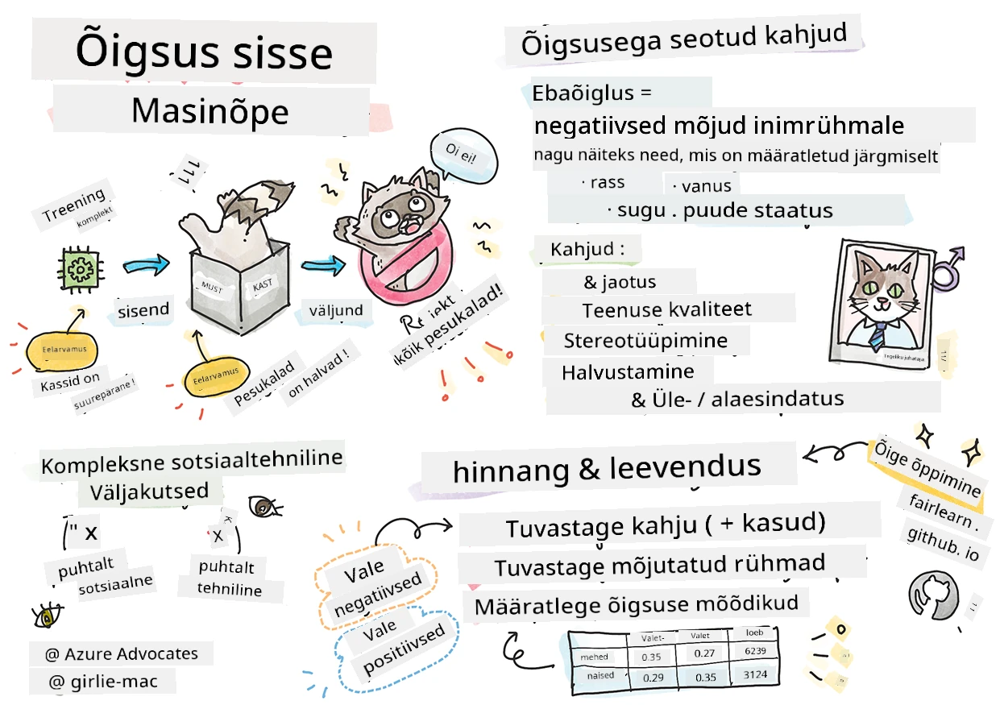
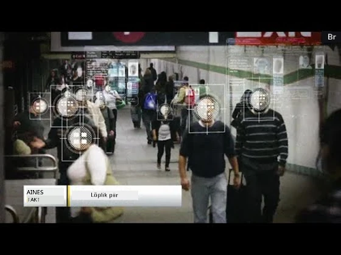

# Vastutustundliku tehisintellektiga masinõppe lahenduste loomine
 

> Joonismärkus autorilt [Tomomi Imura](https://www.twitter.com/girlie_mac)

## [Eel-loengu viktoriin](https://ff-quizzes.netlify.app/en/ml/)
 
## Sissejuhatus

Selles õppekavas hakkate avastama, kuidas masinõpe mõjutab ja võib mõjutada meie igapäevaelu. Juba praegu osalevad süsteemid ja mudelid igapäevastes otsustusülesannetes, nagu tervishoiudiagnoosid, laenude heakskiitmine või pettuste tuvastamine. Seepärast on oluline, et need mudelid töötaksid hästi ja pakuksid usaldusväärseid tulemusi. Nagu iga tarkvararakenduse puhul, võivad ka tehisintellekti süsteemid mitte vastata ootustele või anda soovimatuid tulemusi. Seetõttu on oluline mõista ja osata selgitada tehisintellekti mudeli käitumist. 

Kujutage ette, mis võib juhtuda, kui andmed, mida kasutate nende mudelite loomiseks, puudutavad teatud demograafilisi rühmi, näiteks rassi, sugu, poliitilist vaadet, usku või esindavad selliseid rühmi ebaproportsionaalselt. Mis saab siis, kui mudeli väljundit tõlgendatakse ühekülgselt mõne demograafilise rühma kasuks? Millised on tagajärjed rakendusele? Lisaks, mis juhtub, kui mudel annab kahjuliku tulemuse inimestele? Kes vastutab tehisintellekti süsteemi käitumise eest? Need on mõned küsimused, mida selles õppekavas uurime. 

Selles õppetükis:

- Suurendate teadlikkust õiglusest masinõppes ja sellega seotud kahjudest.
- Tutvute haruliste juhtumite ja ebatavaliste stsenaariumite uurimise praktikaga, et tagada usaldusväärsus ja ohutus.
- Saate aru vajadusest võimestada kõiki, kujundades kaasavaid süsteeme.
- Uurite, kui tähtis on kaitsta andmete ja inimeste privaatsust ja turvalisust.
- Näete, kui oluline on läbipaistva lähenemisega selgitada tehisintellekti mudelite käitumist.
- Olete teadlik sellest, kui oluline on vastutus, et ehitada usaldust tehisintellekti süsteemide vastu.

## Eelteadmised

Eelteadmise jaoks palun läbitage „Vastutustundliku tehisintellekti põhimõtted“ õpperada ja vaadake allolevat videot sellel teemal:

Lisateavet vastutustundliku tehisintellekti kohta leiate järgides seda [Õpperada](https://docs.microsoft.com/learn/modules/responsible-ai-principles/?WT.mc_id=academic-77952-leestott)

> 🎥 Klõpsake ülaloleval pildil video vaatamiseks: Microsofti lähenemine vastutustundlikule tehisintellektile

## Õiglus

Tehisintellekti süsteemid peaksid kõigi suhtes käituma õiglaselt ega tohi mõjutada sarnaseid inimrühmi erinevalt. Näiteks kui tehisintellekti süsteemid annavad juhiseid meditsiinilise ravi, laenutaotluste või töölevõtmise kohta, peaksid nad tegema samad soovitused kõigile, kellel on sarnased sümptomid, rahalised olud või kutseoskused. Me kõik kanname kaasas päritud eelarvamusi, mis mõjutavad meie otsuseid ja tegusid. Need eelarvamused võivad olla nähtavad andmetes, mida kasutame tehisintellekti süsteemide koolitamiseks. Selline manipulatsioon võib juhtuda sageli tahtmatult. Teadlikult on sageli keeruline teada, millal andmetesse eelarvamus sisse juhitakse. 

**„Ebaõiglus“** hõlmab negatiivseid mõjusid või „kahjusid“ teatud inimrühma jaoks, näiteks rassi, soo, vanuse või puude seisundi alusel määratletud rühmasid. Peamised õiglusest tulenevad kahjud võib klassifitseerida järgmiselt: 

- **Jaotus**, kui näiteks üks sugu või etniline rühm saab teise ees eelise.
- **Teenuse kvaliteet**. Kui treenite mudelit ainult konkreetse stsenaariumi jaoks, kuid tegelikkus on palju keerukam, viib see kehva teeninduse tulemuseni. Näiteks käsiseebidosaator, mis tundus olevat võimetu märkama tumeda nahaga inimesi. [Allikas](https://gizmodo.com/why-cant-this-soap-dispenser-identify-dark-skin-1797931773)
- **Määrimine**. Ebaõiglane kriitika ja märgistamine kellegi või millegi kohta. Näiteks pildituvastustehnoloogia ekslikult märkis tumeda nahavärviga inimeste pilte gorilladena.
- **Liigne või vähene esindatus**. Mõte on see, et teatud rühma ei ole nähtud teatud ametis ja mis tahes teenus või funktsioon, mis jätkab seda edendamist, põhjustab kahju.
- **Stereotüüpimine**. Antud rühma seostamine eelmääratud omadustega. Näiteks inglise ja türgi keele tõlketehnoloogia võib sisaldada ebatäpseid tõlkeid seoses sõnadega, mis on seotud sugude stereotüüpiga.

> tõlge türgi keelde

> tõlge tagasi inglise keelde

Tehisintellekti süsteemide loomisel ja testimisel peame tagama, et AI oleks õiglane ega oleks programmeeritud tegema kallutatud või diskrimineerivaid otsuseid, mida ka inimestel on keelatud teha. Õigluse tagamine tehisintellektis ja masinõppes on siiski keeruline sotsiaal-tehniline väljakutse. 

### Usaldusväärsus ja ohutus

Usalduse loomiseks peavad tehisintellekti süsteemid olema usaldusväärsed, ohutud ja järjepidevad nii tavatingimustes kui ka ootamatutes olukordades. On oluline teada, kuidas tehisintellekti süsteemid käituvad erinevates olukordades, eriti haruldastes juhtumites. Masinõppelahenduste loomisel tuleb pöörata suurt tähelepanu sellele, kuidas käsitleda AI lahenduste võimalikke olukordi. Näiteks peab isesõitev auto panema inimeste ohutuse esikohale. Seetõttu peab autot juhiv AI arvestama kõigi võimalike stsenaariumitega, millega auto võib kokku puutuda, nagu öö, äikesetormid või lumetormid, tänavat ületavad lapsed, lemmikloomad, teetööd jms. Kuidas hästi suudab AI süsteem usaldusväärselt ja ohutult toime tulla erinevate tingimustega, peegeldab andmeteadlase või AI arendaja kavandamisel või testimisel arvestatud ettevalmistuse taset.  

> [🎥 Klõpsake siia video vaatamiseks: ](https://www.microsoft.com/videoplayer/embed/RE4vvIl)

### Kaasavus

Tehisintellekti süsteemid peaksid olema loodud nii, et kaasavad ja jõustavad kõiki. AI süsteemide loomisel ja rakendamisel tuvastavad andmeteadlased ja arendajad süsteemis potentsiaalsed takistused, mis võivad tahtmatult inimesi välistada. Näiteks maailmas on miljard puudega inimest. AI arenguga pääsevad nad oma igapäevaelus hõlpsamalt ligi erinevale infole ja võimalustele. Takistuste kõrvaldamine loob võimalused uuendusteks ja arendab AI tooteid paremate kogemustega, mis kasu toovad kõigile. 

> [🎥 Klõpsake siia video vaatamiseks: kaasavus tehisintellektis](https://www.microsoft.com/videoplayer/embed/RE4vl9v)

### Turvalisus ja privaatsus

AI süsteemid peaksid olema ohutud ja austama inimeste privaatsust. Inimestel on väiksem usaldus süsteemidesse, mis panevad ohtu nende privaatsuse, info või elu. Masinõppemudelite koolitamisel sõltume andmetest, et saavutada parimad tulemused. Selle juures tuleb arvestada andmete päritolu ja terviklikkust. Näiteks, kas andmed esitas kasutaja või olid need avalikult kättesaadavad? Järgmiseks on oluline arendada AI süsteeme, mis kaitsevad konfidentsiaalset infot ja taluvad rünnakuid. AI laiemaks levikuks muutub privaatsuse kaitse ja olulise isiku- ning ärilise info turvalisus üha kriitilisemaks ja keerulisemaks. Privaatsuse ja andmeturbe probleemid vajavad AI puhul eriti head tähelepanu, sest ligipääs andmetele on AI süsteemide jaoks hädavajalik täpsete ja teadlike prognooside ning otsuste tegemiseks.

> [🎥 Klõpsake siia video vaatamiseks: turvalisus tehisintellektis](https://www.microsoft.com/videoplayer/embed/RE4voJF)

- Tööstusena oleme saavutanud märkimisväärseid edusamme privaatsuse ja turvalisuse valdkonnas, mida on oluliselt toetanud sellised regulatsioonid nagu GDPR (üldine andmekaitse määrus). 
- Kuid tehisintellekti süsteemides peame tunnistama pingeid, mis on andmekoguse suurenemise vajaduse ja privaatsuse vahel, et muuta süsteeme isikupärasemaks ja efektiivsemaks. 
- Nagu interneti ja ühendatud arvutite sünniga, on meil ka AI-ga seotud turvalisusega seotud probleemide arv märkimisväärselt kasvanud. 
- Samal ajal on AI-d kasutatud ka turvalisuse parandamiseks. Näiteks on enamik tänapäeva viirusetõrjetarkvara võimsad AI heuristikale toetuvad skannerid. 
- Peame tagama, et meie andmeteaduse protsessid sobituksid harmooniliselt uusimate privaatsus- ja turvatavadega. 

### Läbipaistvus
AI süsteemid peaksid olema arusaadavad. Läbipaistvuse oluline osa on tehisintellekti süsteemide ja nende komponentide käitumise selgitamine. AI süsteemide parema mõistmise tagamiseks peavad sidusrühmad mõistma, kuidas ja miks need töötavad, et tuvastada võimalikke jõudlusprobleeme, ohutus- ja privaatsusküsimusi, eelarvamusi, välistavaid praktikaid või soovimatuid tulemusi. Usume ka, et need, kes AI süsteeme kasutavad, peaksid ausalt ja avameelselt selgitama, millal, miks ja kuidas nad otsustavad neid rakendada. Samuti piiranguid nende süsteemide suhtes, mida nad kasutavad. Näiteks kui pank kasutab tehisintellekti süsteemi tarbijalaenude otsuste toetamiseks, on oluline analüüsida tulemusi ja mõista, millised andmed mõjutavad süsteemi soovitusi. Valitsused hakkavad AI-d erinevates valdkondades reguleerima, seega peavad andmeteadlased ja organisatsioonid selgitama, kas tehisintellekti süsteem vastab regulatiivsetele nõuetele, eriti kui toimub soovimatu tulemus. 

> [🎥 Klõpsake siia video vaatamiseks: läbipaistvus tehisintellektis](https://www.microsoft.com/videoplayer/embed/RE4voJF)

- Kuna AI süsteemid on nii keerulised, on raske aru saada, kuidas need töötavad ja tulemusi tõlgendada. 
- See arusaamatus mõjutab seda, kuidas neid süsteeme haldatakse, rakendatakse ja dokumenteeritakse. 
- Veelgi olulisem on see, et arusaamatus mõjutab otsuseid, mis tehakse nendesüsteemides toodetud tulemuste põhjal. 

### Vastutus
 
Tehisintellekti süsteeme kujundavad ja juurutavad inimesed peavad olema vastutavad oma süsteemide toimimise eest. Vastutuse vajadus on eriti oluline tundlike tehnoloogiate, näiteks näotuvastuse puhul. Viimasel ajal on kasvanud nõudlus näotuvastustehnoloogia järele, eriti õiguskaitseorganisatsioonide poolt, kes näevad tehnoloogias potentsiaali näiteks kadunud laste leidmisel. Kuid neid tehnoloogiaid võiks valitsus kasutada oma kodanike põhivabaduste ohustamiseks, näiteks võimaldades konkreetsete isikute pidevat jälgimist. Seega peavad andmeteadlased ja organisatsioonid olema vastutavad selle eest, kuidas nende AI süsteemi mõju mõjutab üksikisikuid või ühiskonda.

> 🎥 Klõpsake ülaloleval pildil video vaatamiseks: hoiatused näotuvastuse massilise järelvalve kohta

Lõppkokkuvõttes on üks suurimaid küsimusi meie põlvkonnale, kes toob AI esmakordselt ühiskonda, kuidas tagada, et arvutid jäävad inimeste suhtes vastutavaks ning kuidas tagada, et arvuteid kujundavad inimesed jäävad vastutavaks kõigi teiste ees.

## Mõjuhinnang

Enne masinõppemudeli koolitamist on oluline läbi viia mõjuhinnang, et mõista AI süsteemi eesmärki; milline on kavandatud kasutus; kus see juurutatakse; ja kes süsteemiga suhtleb. Need on abiks süsteemi hindajatele või testijatele, et teada, milliseid tegureid tuleb riskide ja oodatavate tagajärgede tuvastamisel arvestada.

Mõjuhinnangu läbiviimisel keskendutakse järgmistele valdkondadele:

* **Negatiivne mõju üksikisikutele**. Oluline on olla teadlik piirangutest või nõuetest, toetust mittesaavast kasutusest või teadaolevatest piirangutest, mis takistavad süsteemi jõudlust, et tagada süsteemi ohutu kasutamine.
* **Andmenõuded**. Mõistmine, kuidas ja kus süsteem andmeid kasutab, võimaldab hindajatel uurida, milliseid andmenõudeid tuleks arvesse võtta (nt GDPR või HIPAA andmekaitsenõuded). Kontrollige ka, kas andmete allikas ja kogus on piisavad mudeli koolitamiseks.
* **Mõjude kokkuvõte**. Koostage võimalikest kahjudest nimekiri, mis võivad süsteemi kasutusest tekkida. Läbi masinõppe kogu elutsükli vaadake üle, kas tuvastatud probleemid on leevendatud või lahendatud.
* **Rakendatavad eesmärgid** kõigi kuue põhialuse jaoks. Hinnake, kas iga põhimõtte eesmärgid on täidetud ja kas esinevad lüngad.

## Silumistegevused vastutustundliku AI-ga  

Sarnaselt tarkvararakenduse silumisele on AI süsteemi silumine vajalik protsess süsteemi vigade tuvastamiseks ja lahendamiseks. Paljud tegurid võivad mõjutada mudeli ootuspärast ja vastutustundlikku toimimist. Enamik traditsioonilisi mudelijõudluse mõõdikuid on mudeli tulemuslikkuse kvantitatiivsed agregaadid, mis ei piisa selleks, et analüüsida, kuidas mudel rikub vastutustundliku AI põhimõtteid. Lisaks on masinõppemudel must kast, mis teeb keeruliseks selle väljundi põhjendamise või vea tekke selgitamise. Selle kursuse edenedes õpime kasutama Vastutustundliku AI juhtpaneeli AI süsteemide silumiseks. Juhtpaneel pakub terviklikku tööriista andmeteadlastele ja arendajatele, et teha järgmist:

* **Vigade analüüs**. Mudeli vea jaotuse tuvastamiseks, mis võib mõjutada süsteemi õiglust või usaldusväärsust.
* **Mudeli ülevaade**. Avastada, kus mudeli jõudluses esineb erinevusi andmekogumite vahel.
* **Andmete analüüs**. Andmete jaotuse mõistmiseks ja võimaliku kallutatuse tuvastamiseks, mis võib põhjustada õiglus-, kaasavuse ja usaldusväärsuse probleeme.
* **Mudeli tõlgendatavus**. Mõista, mis mõjutab või suunab mudeli prognoose. See aitab selgitada mudeli käitumist, mis on oluline läbipaistvuse ja vastutuse saavutamiseks.

## 🚀 Väljakutse 
 
Kahjude ennetamiseks peaksime: 

- omama mitmekesist tausta ja vaatenurki süsteemide loomisel töötavate inimeste seas
- investeerima andmestikesse, mis peegeldavad meie ühiskonna mitmekesisust
- arendama paremaid meetodeid kogu masinõppe elutsükli jooksul, et avastada ja parandada vastutustundlikku AI-d esinevaid probleeme

Mõelge reaalse elu olukordadele, kus mudeli usaldusväärsus on ehituses ja kasutuses ilmne. Mida muud tuleks kaaluda? 

## [Järgneva loengu viktoriin](https://ff-quizzes.netlify.app/en/ml/)

## Ülevaade ja iseseisev õppimine
 

Selles õppetükis olete õppinud mõningaid masinõppe õiglust ja ebaõiglust käsitlevate mõistete põhialuseid.  
 
Vaadake seda töötuba, et teemadesse põhjalikumalt süveneda: 

- Vastutustundliku tehisintellekti poole: põhimõtete rakendamine praktikas, esinejad Besmira Nushi, Mehrnoosh Sameki ja Amit Sharma

> 🎥 Klõpsake ülaloleval pildil video vaatamiseks: Vastutustundliku tehisintellekti tööriistakomplekt, esitavad Besmira Nushi, Mehrnoosh Sameki ja Amit Sharma

Samuti lugege: 

- Microsofti vastutustundliku tehisintellekti ressursside keskpunkt: [Responsible AI Resources – Microsoft AI](https://www.microsoft.com/ai/responsible-ai-resources?activetab=pivot1%3aprimaryr4) 

- Microsofti FATE uurimisrühm: [FATE: õiglus, vastutus, läbipaistvus ja eetika tehisintellektis - Microsoft Research](https://www.microsoft.com/research/theme/fate/) 

RAI Toolbox: 

- [Vastutustundliku tehisintellekti tööriistakomplekti GitHub reposiit](https://github.com/microsoft/responsible-ai-toolbox)

Lugege Azure Machine Learning vahendite kohta, mis aitavad tagada õigluse:

- [Azure Machine Learning](https://docs.microsoft.com/azure/machine-learning/concept-fairness-ml?WT.mc_id=academic-77952-leestott) 

## Ülesanne

[Uurige RAI Toolboxi](assignment.md)

---

<!-- CO-OP TRANSLATOR DISCLAIMER START -->
**Lahtiütlus**:
See dokument on tõlgitud kasutades AI tõlketeenust [Co-op Translator](https://github.com/Azure/co-op-translator). Kuigi me püüdleme täpsuse poole, palun pange tähele, et automatiseeritud tõlgetes võib esineda vigu või ebatäpsusi. Originaaldokument selle emakeeles tuleks pidada autoriteetseks allikaks. Olulise teabe puhul soovitatakse kasutada professionaalset inimtõlget. Me ei vastuta selle tõlkega seotud eksimustest või valesti mõistmistest.
<!-- CO-OP TRANSLATOR DISCLAIMER END -->