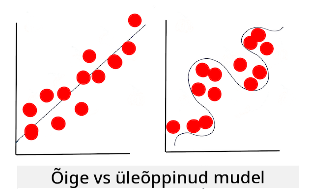

<!--
CO_OP_TRANSLATOR_METADATA:
{
  "original_hash": "9d91f3af3758fdd4569fb410575995ef",
  "translation_date": "2025-10-11T11:29:27+00:00",
  "source_file": "1-Introduction/4-techniques-of-ML/README.md",
  "language_code": "et"
}
-->
# Masinõppe tehnikad

Masinõppe mudelite ja nende kasutatava andmete loomise, kasutamise ja hooldamise protsess erineb oluliselt paljudest teistest arendusvoogudest. Selles õppetükis selgitame seda protsessi ja toome välja peamised tehnikad, mida peate teadma. Te saate:

- Mõista masinõppe aluseks olevaid protsesse üldisel tasemel.
- Uurida põhimõisteid nagu "mudelid", "ennustused" ja "treeningandmed".

## [Eelloengu viktoriin](https://ff-quizzes.netlify.app/en/ml/)

> 🎥 Klõpsake ülaloleval pildil, et vaadata lühivideot, mis käsitleb seda õppetundi.

## Sissejuhatus

Üldisel tasemel koosneb masinõppe (ML) protsesside loomise kunst mitmest etapist:

1. **Küsimuse määratlemine**. Enamik ML-protsesse algab küsimuse esitamisega, millele ei saa vastata lihtsa tingimusliku programmi või reeglipõhise mootoriga. Need küsimused keskenduvad sageli ennustustele, mis põhinevad andmekogumil.
2. **Andmete kogumine ja ettevalmistamine**. Küsimusele vastamiseks on vaja andmeid. Teie andmete kvaliteet ja mõnikord ka kogus määravad, kui hästi saate oma algsele küsimusele vastata. Andmete visualiseerimine on selle etapi oluline osa. See etapp hõlmab ka andmete jagamist treening- ja testimisgruppideks, et mudelit ehitada.
3. **Treeningmeetodi valimine**. Sõltuvalt teie küsimusest ja andmete olemusest peate valima, kuidas soovite mudelit treenida, et see kõige paremini kajastaks teie andmeid ja teeks täpseid ennustusi. See ML-protsessi osa nõuab spetsiifilist ekspertiisi ja sageli märkimisväärset katsetamist.
4. **Mudeli treenimine**. Kasutades oma treeningandmeid, kasutate erinevaid algoritme, et treenida mudelit andmetes mustrite äratundmiseks. Mudel võib kasutada sisemisi kaalusid, mida saab kohandada, et eelistada teatud andmeosi teiste ees, et luua parem mudel.
5. **Mudeli hindamine**. Kasutate varem nägemata andmeid (oma testimisandmeid) kogutud komplektist, et näha, kuidas mudel toimib.
6. **Parameetrite häälestamine**. Mudeli toimivuse põhjal saate protsessi uuesti läbi teha, kasutades erinevaid parameetreid või muutujaid, mis kontrollivad mudeli treenimiseks kasutatud algoritmide käitumist.
7. **Ennustamine**. Kasutage uusi sisendeid, et testida mudeli täpsust.

## Millist küsimust esitada

Arvutid on eriti osavad andmetes peidetud mustrite avastamisel. See oskus on väga kasulik teadlastele, kellel on küsimusi antud valdkonna kohta, millele ei saa lihtsalt vastata tingimuslikult põhineva reeglimootoriga. Näiteks aktuaari ülesande puhul võib andmeteadlane koostada käsitsi loodud reeglid suitsetajate ja mittesuitsetajate suremuse kohta.

Kui võrrandisse tuuakse palju muid muutujaid, võib ML-mudel osutuda tõhusamaks, et ennustada tulevasi suremuse määrasid varasema terviseajaloo põhjal. Rõõmsam näide võiks olla aprillikuu ilmaprognooside tegemine antud asukohas, kasutades andmeid, mis hõlmavad laius- ja pikkuskraadi, kliimamuutusi, ookeani lähedust, jugavoolu mustreid ja palju muud.

✅ See [slaidiesitlus](https://www2.cisl.ucar.edu/sites/default/files/2021-10/0900%20June%2024%20Haupt_0.pdf) ilmamudelite kohta pakub ajaloolist perspektiivi ML-i kasutamiseks ilmaanaluüsi tegemisel.  

## Ehituseelne töö

Enne mudeli ehitamist on mitmeid ülesandeid, mida peate täitma. Oma küsimuse testimiseks ja hüpoteesi loomiseks mudeli ennustuste põhjal peate tuvastama ja seadistama mitmeid elemente.

### Andmed

Küsimusele kindlusega vastamiseks vajate piisavalt õiget tüüpi andmeid. Sellel hetkel peate tegema kaks asja:

- **Andmete kogumine**. Pidades silmas eelmist õppetundi andmeanalüüsi õiglusest, koguge oma andmeid hoolikalt. Olge teadlik nende andmete allikatest, võimalikest sisemistest kallutustest ja dokumenteerige nende päritolu.
- **Andmete ettevalmistamine**. Andmete ettevalmistamise protsess hõlmab mitmeid samme. Võib-olla peate andmeid koondama ja normaliseerima, kui need pärinevad erinevatest allikatest. Andmete kvaliteeti ja kvantiteeti saab parandada mitmel viisil, näiteks teisendades stringe numbriteks (nagu teeme [klasterdamises](../../5-Clustering/1-Visualize/README.md)). Võite ka luua uusi andmeid, mis põhinevad algsetel andmetel (nagu teeme [klassifitseerimises](../../4-Classification/1-Introduction/README.md)). Andmeid saab puhastada ja redigeerida (nagu teeme enne [veebirakenduse](../../3-Web-App/README.md) õppetundi). Lõpuks võib osutuda vajalikuks andmete juhuslikustamine ja segamine, sõltuvalt teie treeningtehnikatest.

✅ Pärast andmete kogumist ja töötlemist võtke hetk, et näha, kas nende kuju võimaldab teil vastata kavandatud küsimusele. Võib juhtuda, et andmed ei tööta teie antud ülesandes hästi, nagu avastame [klasterdamise](../../5-Clustering/1-Visualize/README.md) õppetundides!

### Omadused ja sihtmärk

[Omadus](https://www.datasciencecentral.com/profiles/blogs/an-introduction-to-variable-and-feature-selection) on teie andmete mõõdetav omadus. Paljudes andmekogumites väljendatakse seda veerupäisena, näiteks "kuupäev", "suurus" või "värv". Teie omadusmuutuja, mida tavaliselt tähistatakse koodis `X`, esindab sisendmuutujat, mida kasutatakse mudeli treenimiseks.

Sihtmärk on asi, mida proovite ennustada. Sihtmärk, mida tavaliselt tähistatakse koodis `y`, esindab vastust küsimusele, mida proovite oma andmetelt küsida: detsembris, milline **värv** kõrvitsatest on kõige odavam? San Franciscos, millised naabruskonnad pakuvad parimat kinnisvara **hinda**? Mõnikord viidatakse sihtmärgile ka kui sildi atribuudile.

### Omadusmuutuja valimine

🎓 **Omaduste valik ja omaduste ekstraheerimine** Kuidas valida, millist muutujat mudeli ehitamisel kasutada? Tõenäoliselt läbite protsessi, kus valite omaduste valiku või ekstraheerimise abil õiged muutujad kõige paremini toimiva mudeli jaoks. Need pole siiski samad: "Omaduste ekstraheerimine loob uusi omadusi algsete omaduste funktsioonidest, samas kui omaduste valik tagastab omaduste alamhulga." ([allikas](https://wikipedia.org/wiki/Feature_selection))

### Andmete visualiseerimine

Andmeteadlase tööriistakomplekti oluline aspekt on võime visualiseerida andmeid, kasutades mitmeid suurepäraseid teeke, nagu Seaborn või MatPlotLib. Andmete visuaalne esitamine võib võimaldada teil avastada peidetud korrelatsioone, mida saate ära kasutada. Teie visualisatsioonid võivad aidata teil avastada kallutatust või tasakaalustamata andmeid (nagu avastame [klassifitseerimises](../../4-Classification/2-Classifiers-1/README.md)).

### Andmekogumi jagamine

Enne treenimist peate jagama oma andmekogumi kaheks või enamaks ebavõrdse suurusega osaks, mis siiski esindavad andmeid hästi.

- **Treening**. See osa andmekogumist sobitatakse teie mudeliga, et seda treenida. See komplekt moodustab suurema osa algsest andmekogumist.
- **Testimine**. Testandmekogum on sõltumatu andmete grupp, mis sageli kogutakse algsetest andmetest ja mida kasutatakse ehitatud mudeli toimivuse kinnitamiseks.
- **Valideerimine**. Valideerimiskomplekt on väiksem sõltumatu näidete grupp, mida kasutatakse mudeli hüperparameetrite või arhitektuuri häälestamiseks, et mudelit täiustada. Sõltuvalt teie andmete suurusest ja küsimusest, mida esitate, ei pruugi teil olla vaja seda kolmandat komplekti luua (nagu märgime [ajasarja prognoosimise](../../7-TimeSeries/1-Introduction/README.md) õppetundides).

## Mudeli ehitamine

Kasutades oma treeningandmeid, on teie eesmärk ehitada mudel ehk teie andmete statistiline esitus, kasutades erinevaid algoritme selle **treenimiseks**. Mudeli treenimine võimaldab sellel andmetega tutvuda ja teha oletusi tajutud mustrite kohta, mida see avastab, valideerib ja aktsepteerib või lükkab tagasi.

### Treeningmeetodi valimine

Sõltuvalt teie küsimusest ja andmete olemusest valite meetodi selle treenimiseks. Läbi käies [Scikit-learn'i dokumentatsiooni](https://scikit-learn.org/stable/user_guide.html) - mida me selles kursuses kasutame - saate uurida mitmeid viise mudeli treenimiseks. Sõltuvalt teie kogemustest peate võib-olla proovima mitmeid erinevaid meetodeid, et ehitada parim mudel. Tõenäoliselt läbite protsessi, kus andmeteadlased hindavad mudeli toimivust, toites sellele varem nägemata andmeid, kontrollides täpsust, kallutatust ja muid kvaliteeti halvendavaid probleeme ning valides ülesande jaoks kõige sobivama treeningmeetodi.

### Mudeli treenimine

Relvastatud oma treeningandmetega olete valmis neid "sobitama", et luua mudel. Märkate, et paljudes ML-teekides leiate koodi "model.fit" - just sel ajal saadate oma omadusmuutuja väärtuste massiivina (tavaliselt "X") ja sihtmuutuja (tavaliselt "y").

### Mudeli hindamine

Kui treenimisprotsess on lõpule jõudnud (suure mudeli treenimiseks võib kuluda palju iteratsioone ehk "epohhe"), saate mudeli kvaliteeti hinnata, kasutades testandmeid selle toimivuse mõõtmiseks. Need andmed on algsete andmete alamhulk, mida mudel pole varem analüüsinud. Saate printida välja tabeli mudeli kvaliteedi mõõdikutega.

🎓 **Mudeli sobitamine**

Masinõppe kontekstis viitab mudeli sobitamine mudeli aluseks oleva funktsiooni täpsusele, kui see üritab analüüsida andmeid, millega see pole tuttav.

🎓 **Alasobitamine** ja **ülesobitamine** on levinud probleemid, mis halvendavad mudeli kvaliteeti, kuna mudel sobitub kas liiga halvasti või liiga hästi. See põhjustab mudeli ennustusi, mis on kas liiga tihedalt seotud või liiga lõdvalt seotud treeningandmetega. Ülesobitunud mudel ennustab treeningandmeid liiga hästi, kuna see on õppinud andmete üksikasju ja müra liiga hästi. Alasobitunud mudel pole täpne, kuna see ei suuda täpselt analüüsida ei oma treeningandmeid ega andmeid, mida see pole veel "näinud".

> Infograafik: [Jen Looper](https://twitter.com/jenlooper)

## Parameetrite häälestamine

Kui teie algne treenimine on lõpule jõudnud, jälgige mudeli kvaliteeti ja kaaluge selle parandamist, kohandades selle "hüperparameetreid". Lugege selle protsessi kohta rohkem [dokumentatsioonis](https://docs.microsoft.com/en-us/azure/machine-learning/how-to-tune-hyperparameters?WT.mc_id=academic-77952-leestott).

## Ennustamine

See on hetk, mil saate kasutada täiesti uusi andmeid, et testida mudeli täpsust. Rakendatud ML-i seadetes, kus ehitate veebivarasid mudeli kasutamiseks tootmises, võib see protsess hõlmata kasutaja sisendi kogumist (näiteks nupuvajutus), et määrata muutuja ja saata see mudelile järeldamiseks või hindamiseks.

Nendes õppetundides avastate, kuidas kasutada neid samme andmete ettevalmistamiseks, mudeli ehitamiseks, testimiseks, hindamiseks ja ennustamiseks - kõik andmeteadlase žestid ja palju muud, kui edendate oma teekonda "täisstack" ML-inseneriks saamiseks.

---

## 🚀Väljakutse

Joonistage vooskeem, mis kajastab ML-praktiku samme. Kus näete end praegu protsessis? Kus ennustate, et teil võib tekkida raskusi? Mis tundub teile lihtne?

## [Järelloengu viktoriin](https://ff-quizzes.netlify.app/en/ml/)

## Ülevaade ja iseseisev õppimine

Otsige veebist intervjuusid andmeteadlastega, kes räägivad oma igapäevasest tööst. Siin on [üks](https://www.youtube.com/watch?v=Z3IjgbbCEfs).

## Ülesanne

[Intervjueerige andmeteadlast](assignment.md)

---

**Lahtiütlus**:  
See dokument on tõlgitud AI tõlketeenuse [Co-op Translator](https://github.com/Azure/co-op-translator) abil. Kuigi püüame tagada täpsust, palume arvestada, et automaatsed tõlked võivad sisaldada vigu või ebatäpsusi. Algne dokument selle algses keeles tuleks pidada autoriteetseks allikaks. Olulise teabe puhul soovitame kasutada professionaalset inimtõlget. Me ei vastuta selle tõlke kasutamisest tulenevate arusaamatuste või valesti tõlgenduste eest.