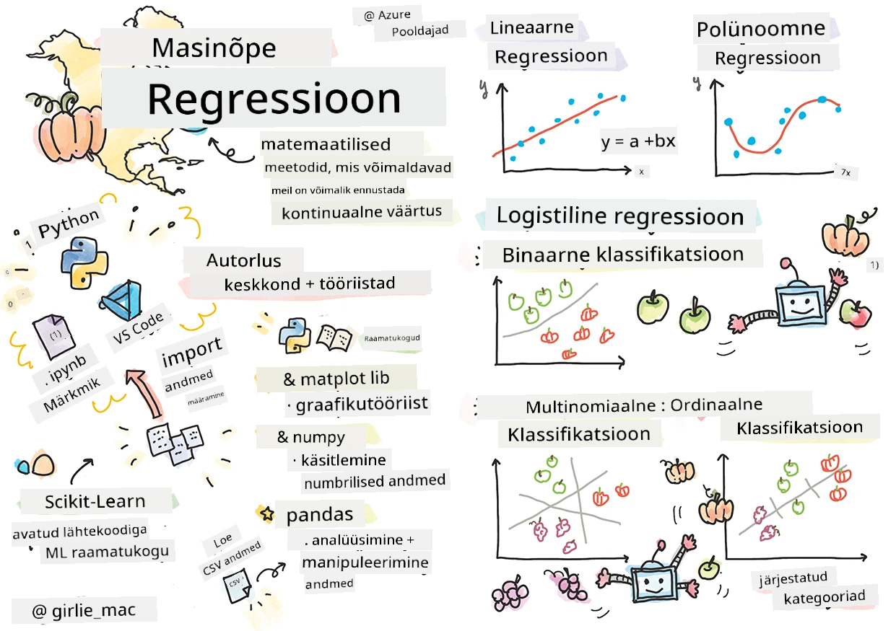
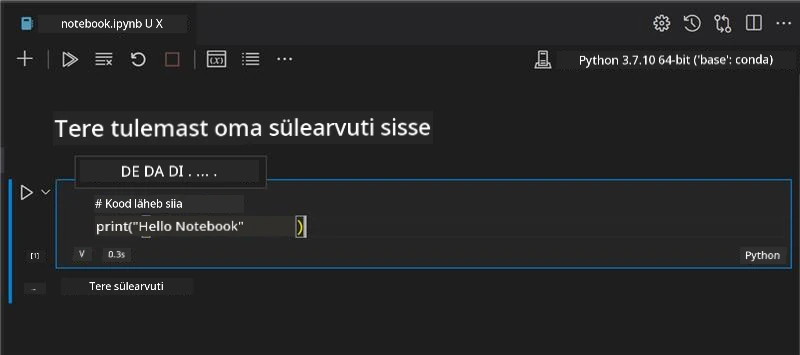
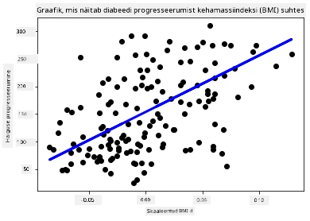

# Alustamine Pythoniga ja Scikit-learn regressioonimudelite jaoks



> Visand, autor [Tomomi Imura](https://www.twitter.com/girlie_mac)

## [Eeloengu viktoriin](https://ff-quizzes.netlify.app/en/ml/)

> ### [See õppetund on saadaval ka R keeles!](../../../../2-Regression/1-Tools/solution/R/lesson_1.html)

## Sissejuhatus

Nendes neljas õppetükis õpid, kuidas ehitada regressioonimudeleid. Peagi räägime, milleks neid kasutatakse. Kuid enne kui midagi teed, veendu, et sul oleksid õiged tööriistad valmis protsessi alustamiseks!

Selles õppetükis õpid, kuidas:

- Konfigureerida oma arvutit kohalike masinõppe ülesannete jaoks.
- Töötada Jupyter Notebookidega.
- Kasutada Scikit-learn'i, sealhulgas paigaldamist.
- Uurida lineaarset regressiooni praktilise ülesande kaudu.

## Paigaldused ja seadistused

[](https://youtu.be/-DfeD2k2Kj0 "Masinõpe algajatele - Seadista oma tööriistad masinõppemudelite ehitamiseks")

> 🎥 Klõpsa ülalolevale pildile lühikese video jaoks, mis näitab arvuti seadistamist masinõppe jaoks.

1. **Paigalda Python**. Veendu, et arvutisse on paigaldatud [Python](https://www.python.org/downloads/). Pythoni kasutatakse paljudes andmeteaduse ja masinõppe ülesannetes. Enamik arvutisüsteeme sisaldab Pythonit juba vaikimisi. Lisaks on saadaval kasulikud [Python Coding Packs](https://code.visualstudio.com/learn/educators/installers?WT.mc_id=academic-77952-leestott), mis lihtsustavad seadistamist mõne kasutaja jaoks.

   Mõningad Pythoni kasutusviisid nõuavad ühte tarkvaraversiooni, teised teist. Seetõttu on kasulik töötada [virtuaalses keskkonnas](https://docs.python.org/3/library/venv.html).

2. **Paigalda Visual Studio Code**. Veendu, et Visual Studio Code on sinu arvutis paigaldatud. Järgi juhiseid visual studio koodi [paigaldamiseks](https://code.visualstudio.com/). Selles kursuses kasutad Pythoni Visual Studio Codes, nii et võib olla kasulik värskendada teadmisi, kuidas [Visual Studio Code'i seadistada Python arenduseks](https://docs.microsoft.com/learn/modules/python-install-vscode?WT.mc_id=academic-77952-leestott).

   > Tutvu Pythoniga lähemalt, läbides selle kogumi [Õpi moodulid](https://docs.microsoft.com/users/jenlooper-2911/collections/mp1pagggd5qrq7?WT.mc_id=academic-77952-leestott)
   >
   > [](https://youtu.be/yyQM70vi7V8 "Seadista Python Visual Studio Code’iga")
   >
   > 🎥 Klõpsa ülalolevale pildile video vaatamiseks: Pythoni kasutamine VS Code’is.

3. **Paigalda Scikit-learn** järgides [selleid juhiseid](https://scikit-learn.org/stable/install.html). Kuna vajad Python 3 kasutamist, on soovitatav kasutada virtuaalkeskkonda. Kui paigaldate seda teeki M1 Mac süsteemile, on ülalkirjeldatud lingil erijuhised.

1. **Paigalda Jupyter Notebook**. Pead paigaldama [Jupyter paketi](https://pypi.org/project/jupyter/).

## Sinu masinõppe arenduskeskkond

Kasutad **notebooke**, et arendada oma Pythoni koodi ja luua masinõppemudeleid. See failitüüp on andmeteadlaste seas populaarne, neid saab tuvastada faililaiendi `.ipynb` järgi.

Notebookid on interaktiivne keskkond, mis võimaldab arendajal nii koodi kirjutada kui märkmeid lisada ning dokumentatsiooni kirjutada. See on eriti kasulik eksperimenteerimise või uurimusprojektide korral.

[](https://youtu.be/7E-jC8FLA2E "Masinõpe algajatele - Seadista Jupyter Notebookid regressioonimudelite ehituse alustamiseks")

> 🎥 Klõpsa ülalolevale pildile lühikese video jaoks, mis selgitab viisi.

### Harjutus - töötamine notebookiga

Selles kaustas leiad faili _notebook.ipynb_.

1. Ava _notebook.ipynb_ Visual Studio Codes.

   Järgnevalt käivitub Jupyteri server koos Python 3+ keskkonnaga. Notebookis on kohti, mida saab `run` käivitada, need on koodilõigud. Koodibloki käivitamiseks vali ikoon, mis näeb välja nagu esitamisnupp.

1. Vali `md` ikoon ja lisa natuke markdowni tekstina: **# Welcome to your notebook**.

   Seejärel lisa natuke Pythoni koodi.

1. Kirjuta koodiblokki **print('hello notebook')**.
1. Vali nool, et koodi käivitada.

   Sa peaksid nägema väljatrükki:

    ```output
    hello notebook
    ```



Sa võid oma koodi lisada kommentaare, et notebook iseenesest dokumenteeriks seda.

✅ Mõtle korraks, kui erinev on veebiarendaja töökeskkond võrreldes andmeteadlase omaga.

## Scikit-learniga alustamine

Nüüd, kui Python on sinu lokaalses keskkonnas seadistatud ja sa oled Jupyter Notebookidega harjunud, tutvume ka Scikit-learniga (hääldus 'sci' nagu 'science'). Scikit-learn pakub [ulatuslikku API-t](https://scikit-learn.org/stable/modules/classes.html#api-ref), mis aitab sul masinõppe ülesandeid teha.

Nende [veebilehe](https://scikit-learn.org/stable/getting_started.html) kohaselt: "Scikit-learn on avatud lähtekoodiga masinõppe teek, mis toetab juhendatud ja juhendamata õppimist. See pakub ka erinevaid tööriistu mudelite sobitamiseks, andmete ettevalmistamiseks, mudeli valikuks ja hindamiseks ning palju muud."

Selles kursuses kasutad Scikit-learn'i ja teisi tööriistu tavapäraste masinõppe mudelite ehitamiseks. Oleme teadlikult vältinud närvivõrke ja süvaõpet, sest need on põhjalikumalt käsitletud meie tulevases õppekavas 'Tehisintellekt algajatele'.

Scikit-learn teeb mudelite ehitamise ja nende hindamise lihtsalt teostatavaks. See on keskendunud peamiselt numbrilistele andmetele ning sisaldab arenguks mitmeid valmis andmekogumeid ja mudelimalle. Uurimegi kõigepealt, kuidas laadida ettevalmistatud andmeid ja kasutada sisse ehitatud hinnangut esimeseks ML mudeliks Scikit-learniga koos lihtsate andmetega.

## Harjutus - sinu esimene Scikit-learn notebook

> Selle juhendi inspiratsiooniks oli Scikit-learn'i veebisaidilt leitav [lineaarse regressiooni näide](https://scikit-learn.org/stable/auto_examples/linear_model/plot_ols.html#sphx-glr-auto-examples-linear-model-plot-ols-py).


[](https://youtu.be/2xkXL5EUpS0 "Masinõpe algajatele - sinu esimene lineaarse regressiooni projekt Pythonis")

> 🎥 Klõpsa ülalolevale pildile, et vaadata lühikest videot selle ülesande kohta.

Failis _notebook.ipynb_, mis käib selle õppetüki juurde, kustuta kõik lahtrid, vajutades 'prügikasti' ikooni.

Selles osas töötad väikese diabeediandmestikuga, mis on Scikit-learn'i sisse ehitatud õppeotstarbel. Kujuta ette, et soovid testida raviviisi diabeetikutele. Masinõppemudelid võivad aidata otsustada, millised patsiendid reageerivad ravile paremini, tuginedes erinevate muutujate kombineeritud väärtustele. Isegi väga lihtne regressioonimudel võib visualiseerituna näidata infot muutujate kohta, mis aitavad teoreetilisi kliinilisi katseid paremini planeerida.

✅ Regressioonimeetodeid on palju ning millist valida, sõltub sellest, mida soovid leida. Kui tahad ennustada inimese tõenäolist pikkust teatud vanuses, kasutad lineaarset regressiooni, sest otsid **numbrilist väärtust**. Kui tahad teada, kas mingi köögi tüüp on vegan või mitte, otsid **kategooria määratlust**, siis kasutad logistilist regressiooni. Logistilise regressiooni kohta õpid hiljem veel. Mõtle, milliseid küsimusi sa andmetelt küsida võid ja milline meetod oleks sobivam.

Alustame nüüd selle ülesandega.

### Impordi teegid

Selle ülesande jaoks impordime mõned teegid:

- **matplotlib**. Kasulik [graafikutööriist](https://matplotlib.org/), mida kasutame joondiagrammi loomiseks.
- **numpy**. [numpy](https://numpy.org/doc/stable/user/whatisnumpy.html) on kasulik teek numbriliste andmete käsitlemiseks Pythonis.
- **sklearn**. See on [Scikit-learn](https://scikit-learn.org/stable/user_guide.html) teek.

Impordi vajalikud teegid, et ülesannet täita.

1. Lisa import käsud, kirjutades järgmist kood:

   ```python
   import matplotlib.pyplot as plt
   import numpy as np
   from sklearn import datasets, linear_model, model_selection
   ```

   Ülal tood imports `matplotlib`, `numpy` ja lisaks `datasets`, `linear_model` ning `model_selection` `sklearn` teegist. `model_selection` kasutatakse andmete jagamiseks treening- ja testkoguks.

### Diabeedi andmestik

Sisse ehitatud [diabeedi andmestik](https://scikit-learn.org/stable/datasets/toy_dataset.html#diabetes-dataset) sisaldab 442 proovimaterjali diabeedi kohta, 10 tunnusega, millest mõned on:

- vanus: vanus aastates
- kehakaaluindeks (BMI)
- vererõhk (bp)
- s1 tc: T-rakud (valgete vereliblede tüüp)

✅ Selle andmestiku tunnusena on “sugu”, mis on oluline diabeediuuringutes. Paljud meditsiinilised andmestikud sisaldavad sellist binaarset klassifikatsiooni. Mõtle, kuidas sellised kategooriad võivad mõjutada ja vähendada osade elanikkonna ravile pääsemist.

Laadi nüüd X ja y andmed.

> 🎓 Pea meeles, see on juhendatud õppimine ja meil peab olema nimetatud eesmärk `y`.

Uues koodilahtris lae diabeedi andmestik funktsiooniga `load_diabetes()`. Parameeter `return_X_y=True` annab teada, et `X` on andmemaatriks ja `y` regressiooni eesmärgi vektor.

1. Lisa mõned print käsud, et kuvada andmemaatriksi kuju ja esimene element:

    ```python
    X, y = datasets.load_diabetes(return_X_y=True)
    print(X.shape)
    print(X[0])
    ```

    Tagastuseks on tuple, mille kaks esimest väärtust määrad `X` ja `y` muutujatele. Loe rohkem [tuple’ide kohta](https://wikipedia.org/wiki/Tuple).

    Näed, et selles andmestikus on 442 üksust, mis on kuju 10 elemendiga massiividena:

    ```text
    (442, 10)
    [ 0.03807591  0.05068012  0.06169621  0.02187235 -0.0442235  -0.03482076
    -0.04340085 -0.00259226  0.01990842 -0.01764613]
    ```

    ✅ Mõtle natuke seosele andmete ja regressiooni eesmärgi vahel. Lineaarne regressioon ennustab seost tunnuse X ja eesmärgi y vahel. Kas leiad dokumentatsioonist diabeedi andmestiku [eesmärgi](https://scikit-learn.org/stable/datasets/toy_dataset.html#diabetes-dataset)? Mida see andmestik näitab, arvestades eesmärki?

2. Vali nüüd sellest andmestikust osa, mille joonistad, valides andmestiku 3. veeru. Seda saad teha, kasutades operaatorit `:` kõigi ridade valimiseks ja seejärel veeru valimiseks indeksi (2) abil. Andmeid vajadusel ümberkujunda 2D-massiiviks joonistamiseks, kasutades `reshape(n_rows, n_columns)`. Kui üks parameetritest on -1, arvutatakse selle mõõt automaatselt.

   ```python
   X = X[:, 2]
   X = X.reshape((-1,1))
   ```

   ✅ Vahel prindi alati andmed välja, et veenduda vormingus.

3. Nüüd, kui tead, et andmed on joonistamiseks valmis, vaatame, kas masin saab aidata loogilist jaotust arvude vahel selgitada. Selleks on vaja jagada nii andmed (X) kui ka eesmärk (y) test- ja treeningkoguks. Scikit-learn pakub lihtsat meetodit andmete jagamiseks antud punktist.

   ```python
   X_train, X_test, y_train, y_test = model_selection.train_test_split(X, y, test_size=0.33)
   ```

4. Nüüd oled valmis mudelit treenima! Lae lineaarse regressiooni mudel ja treeni seda oma X ja y treeningkoguga, kasutades `model.fit()`:

    ```python
    model = linear_model.LinearRegression()
    model.fit(X_train, y_train)
    ```

    ✅ `model.fit()` on funktsioon, mida näed paljudes ML teekides nagu TensorFlow.

5. Seejärel loo ennustus testandmete põhjal, kasutades funktsiooni `predict()`. Seda kasutatakse joonistades joon mudeli andmegruppide vahel.

    ```python
    y_pred = model.predict(X_test)
    ```

6. Nüüd on aeg näidata andmeid graafikus. Matplotlib on selleks väga kasulik vahend. Loo hajuvusdiagramm kõigist X ja y testandmetest ning kasuta ennustust, et joonistada joon kõige loogilisemasse kohta mudeli andmerühmituse vahele.

    ```python
    plt.scatter(X_test, y_test,  color='black')
    plt.plot(X_test, y_pred, color='blue', linewidth=3)
    plt.xlabel('Scaled BMIs')
    plt.ylabel('Disease Progression')
    plt.title('A Graph Plot Showing Diabetes Progression Against BMI')
    plt.show()
    ```

   


   ✅ Mõtle natuke selle üle, mis siin toimub. Sirgjoon jookseb läbi paljude väikeste andmepunktide, aga mida see täpselt teeb? Kas näed, kuidas sa peaksid saama seda joont kasutada selleks, et ennustada, kuhu uus, nähtamata andmepunkt võiks suhtega plot'i y-teljele sobituda? Proovi sõnastada praktiline kasutusvõimalus selle mudeli jaoks.

Palju õnne, sa ehitasid oma esimese lineaarse regressioonimudeli, tegid selle abil ennustuse ja kuvastasid selle plot'is!

---
## 🚀Väljakutse

Kuvada selle andmekogu mõni teine muutuja. Vihje: muuda seda rida: `X = X[:,2]`. Arvestades selle andmekogu sihtmärki, mida sa suudad avastada diabeedi haiguse progresseerumise kohta?
## [Loengu järeltest](https://ff-quizzes.netlify.app/en/ml/)

## Ülevaade & Iseõpe

Selles juhendis töötasid sa lihtsa lineaarse regressiooniga, mitte univariatiivse või mitme muutujaga lineaarse regressiooniga. Loe veidi nende meetodite erinevustest või vaata seda [videot](https://www.coursera.org/lecture/quantifying-relationships-regression-models/linear-vs-nonlinear-categorical-variables-ai2Ef)

Loe rohkem regressiooni kontseptsioonist ja mõtle, milliseid küsimusi selle tehnikaga saab vastata. Võta see [juhend](https://docs.microsoft.com/learn/modules/train-evaluate-regression-models?WT.mc_id=academic-77952-leestott), et oma arusaama süvendada.

## Kodune ülesanne

[Teine andmekogu](assignment.md)

---

<!-- CO-OP TRANSLATOR DISCLAIMER START -->
**Lahtiütlus**:
See dokument on tõlgitud kasutades AI tõlketeenust [Co-op Translator](https://github.com/Azure/co-op-translator). Kuigi me püüdleme täpsuse poole, palun pange tähele, et automatiseeritud tõlgetes võib esineda vigu või ebatäpsusi. Originaaldokument selle emakeeles tuleks pidada autoriteetseks allikaks. Olulise teabe puhul soovitatakse kasutada professionaalset inimtõlget. Me ei vastuta selle tõlkega seotud eksimustest või valesti mõistmistest.
<!-- CO-OP TRANSLATOR DISCLAIMER END -->