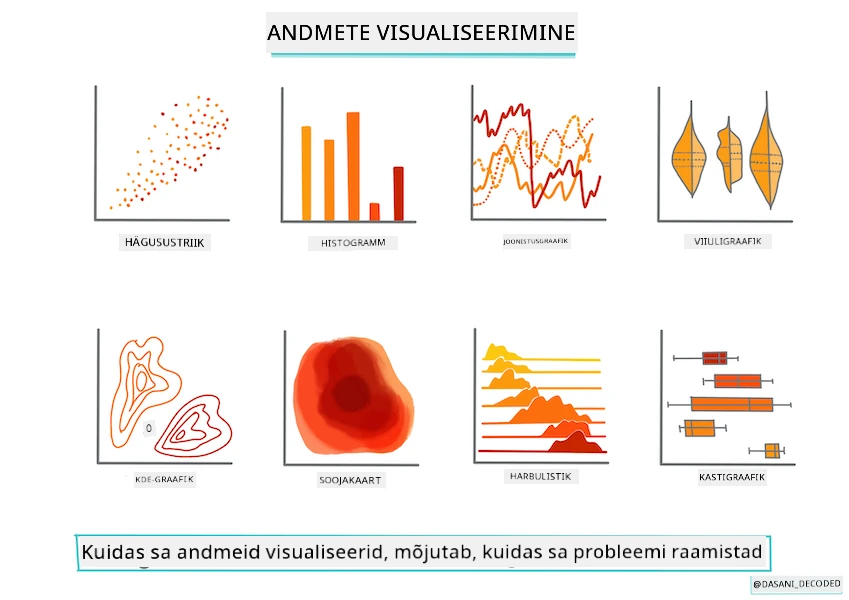
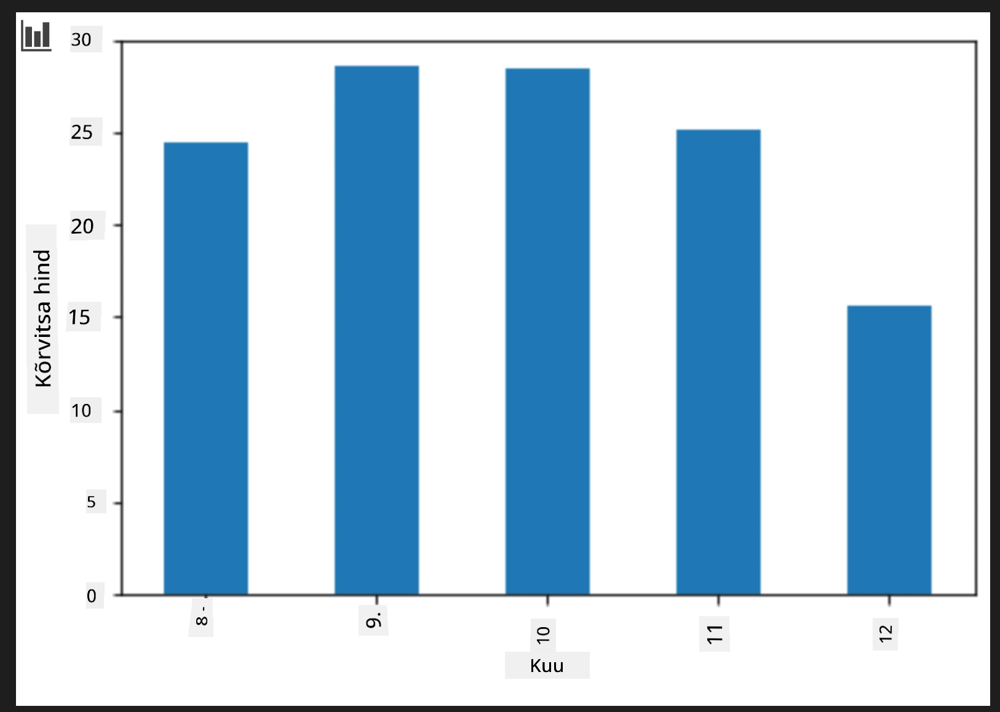

<!--
CO_OP_TRANSLATOR_METADATA:
{
  "original_hash": "7c077988328ebfe33b24d07945f16eca",
  "translation_date": "2025-10-11T11:47:54+00:00",
  "source_file": "2-Regression/2-Data/README.md",
  "language_code": "et"
}
-->
# Ehita regressioonimudel Scikit-learniga: andmete ettevalmistamine ja visualiseerimine



Infograafika autor: [Dasani Madipalli](https://twitter.com/dasani_decoded)

## [Eelloengu viktoriin](https://ff-quizzes.netlify.app/en/ml/)

> ### [See õppetund on saadaval ka R-is!](../../../../2-Regression/2-Data/solution/R/lesson_2.html)

## Sissejuhatus

Nüüd, kui sul on olemas tööriistad, et alustada masinõppe mudelite loomist Scikit-learniga, oled valmis hakkama oma andmetele küsimusi esitama. Andmetega töötades ja ML-lahendusi rakendades on väga oluline osata esitada õigeid küsimusi, et avada oma andmekogumi potentsiaal.

Selles õppetunnis õpid:

- Kuidas valmistada andmeid mudeli loomiseks.
- Kuidas kasutada Matplotlibi andmete visualiseerimiseks.

## Õige küsimuse esitamine oma andmetele

Küsimus, millele vastust otsid, määrab, millist tüüpi ML-algoritme sa kasutad. Vastuse kvaliteet sõltub suuresti sinu andmete olemusest.

Vaata [andmeid](https://github.com/microsoft/ML-For-Beginners/blob/main/2-Regression/data/US-pumpkins.csv), mis on selle õppetunni jaoks ette nähtud. Sa saad avada selle .csv-faili VS Code'is. Kiire pilk näitab kohe, et seal on tühje kohti ja segu stringidest ning numbrilistest andmetest. Seal on ka kummaline veerg nimega 'Package', kus andmed on segu 'sacks', 'bins' ja muudest väärtustest. Tegelikult on andmed üsna segased.

[](https://youtu.be/5qGjczWTrDQ "ML algajatele - Kuidas analüüsida ja puhastada andmekogumit")

> 🎥 Klõpsa ülaloleval pildil, et vaadata lühikest videot, mis käsitleb andmete ettevalmistamist selle õppetunni jaoks.

Tegelikult ei ole väga tavaline, et sulle antakse andmekogum, mis on täiesti valmis ML-mudeli loomiseks. Selles õppetunnis õpid, kuidas valmistada ette toorandmeid, kasutades standardseid Python'i teeke. Samuti õpid erinevaid tehnikaid andmete visualiseerimiseks.

## Juhtumiuuring: 'kõrvitsaturg'

Selles kaustas leiad .csv-faili juurkaustas `data`, nimega [US-pumpkins.csv](https://github.com/microsoft/ML-For-Beginners/blob/main/2-Regression/data/US-pumpkins.csv), mis sisaldab 1757 rida andmeid kõrvitsaturu kohta, rühmitatuna linnade kaupa. Need on toorandmed, mis on saadud [Specialty Crops Terminal Markets Standard Reports](https://www.marketnews.usda.gov/mnp/fv-report-config-step1?type=termPrice) kaudu, mida levitab Ameerika Ühendriikide Põllumajandusministeerium.

### Andmete ettevalmistamine

Need andmed on avalikus domeenis. Neid saab alla laadida paljudes eraldi failides, iga linna kohta, USDA veebisaidilt. Et vältida liiga paljusid eraldi faile, oleme kõik linnade andmed üheks tabeliks kokku liitnud, seega oleme andmeid juba veidi _ette valmistanud_. Järgmine samm on andmetele lähemalt pilk heita.

### Kõrvitsaandmed - esialgsed järeldused

Mida sa nende andmete kohta märkad? Sa juba nägid, et seal on segu stringidest, numbritest, tühjadest kohtadest ja kummalistest väärtustest, mida tuleb mõista.

Millist küsimust sa võiksid nendele andmetele esitada, kasutades regressioonitehnikat? Näiteks: "Prognoosi kõrvitsa müügihinda teatud kuu jooksul." Vaadates andmeid uuesti, on vaja teha mõned muudatused, et luua ülesande jaoks vajalik andmestruktuur.

## Harjutus - analüüsi kõrvitsaandmeid

Kasutame [Pandas](https://pandas.pydata.org/) (nimi tähistab `Python Data Analysis`), mis on väga kasulik tööriist andmete kujundamiseks, et analüüsida ja ette valmistada kõrvitsaandmeid.

### Esmalt kontrolli puuduvate kuupäevade olemasolu

Esmalt tuleb astuda samme, et kontrollida puuduvate kuupäevade olemasolu:

1. Konverteeri kuupäevad kuu formaati (need on USA kuupäevad, seega formaat on `MM/DD/YYYY`).
2. Ekstraheeri kuu uude veergu.

Ava _notebook.ipynb_ fail Visual Studio Code'is ja impordi tabel uude Pandase andmeraami.

1. Kasuta `head()` funktsiooni, et vaadata esimesi viit rida.

    ```python
    import pandas as pd
    pumpkins = pd.read_csv('../data/US-pumpkins.csv')
    pumpkins.head()
    ```

    ✅ Millist funktsiooni kasutaksid viimase viie rea vaatamiseks?

1. Kontrolli, kas praeguses andmeraamis on puuduvad andmed:

    ```python
    pumpkins.isnull().sum()
    ```

    Seal on puuduvad andmed, kuid võib-olla see ei ole ülesande jaoks oluline.

1. Et muuta oma andmeraamiga töötamine lihtsamaks, vali ainult vajalikud veerud, kasutades `loc` funktsiooni, mis ekstraheerib algsest andmeraamist ridade (esimene parameeter) ja veergude (teine parameeter) grupi. Allpool olev väljend `:` tähendab "kõik read".

    ```python
    columns_to_select = ['Package', 'Low Price', 'High Price', 'Date']
    pumpkins = pumpkins.loc[:, columns_to_select]
    ```

### Teiseks, määrake kõrvitsa keskmine hind

Mõtle, kuidas määrata kõrvitsa keskmine hind teatud kuus. Milliseid veerge sa selleks ülesandeks valiksid? Vihje: sul on vaja 3 veergu.

Lahendus: arvuta `Low Price` ja `High Price` veergude keskmine, et täita uus Price veerg, ja konverteeri Date veerg, et näidata ainult kuud. Õnneks, vastavalt ülaltoodud kontrollile, ei ole kuupäevade või hindade osas puuduvat teavet.

1. Keskmise arvutamiseks lisa järgmine kood:

    ```python
    price = (pumpkins['Low Price'] + pumpkins['High Price']) / 2

    month = pd.DatetimeIndex(pumpkins['Date']).month

    ```

   ✅ Võid vabalt printida mis tahes andmeid, mida soovid kontrollida, kasutades `print(month)`.

2. Nüüd kopeeri konverteeritud andmed uude Pandase andmeraami:

    ```python
    new_pumpkins = pd.DataFrame({'Month': month, 'Package': pumpkins['Package'], 'Low Price': pumpkins['Low Price'],'High Price': pumpkins['High Price'], 'Price': price})
    ```

    Kui prindid oma andmeraami välja, näed puhast ja korrastatud andmekogumit, mille põhjal saad ehitada uue regressioonimudeli.

### Aga oota! Siin on midagi kummalist

Kui vaatad `Package` veergu, müüakse kõrvitsaid mitmes erinevas konfiguratsioonis. Mõned müüakse '1 1/9 bushel' mõõtühikutes, mõned '1/2 bushel' mõõtühikutes, mõned kõrvitsa kaupa, mõned naela kaupa ja mõned suurtes kastides, mille laius varieerub.

> Kõrvitsaid tundub olevat väga raske ühtlaselt kaaluda

Originaalandmetesse süvenedes on huvitav, et kõik, mille `Unit of Sale` on 'EACH' või 'PER BIN', omavad ka `Package` tüüpi tolli, bin'i või 'each' kaupa. Kõrvitsaid tundub olevat väga raske ühtlaselt kaaluda, seega filtreerime need, valides ainult kõrvitsad, mille `Package` veerus on string 'bushel'.

1. Lisa filter faili algusesse, .csv importimise alla:

    ```python
    pumpkins = pumpkins[pumpkins['Package'].str.contains('bushel', case=True, regex=True)]
    ```

    Kui prindid andmed nüüd välja, näed, et saad ainult umbes 415 rida andmeid, mis sisaldavad kõrvitsaid bushel'i kaupa.

### Aga oota! Veel üks asi, mida teha

Kas märkasid, et bushel'i kogus varieerub ridade kaupa? Pead hindade normaliseerimiseks tegema matemaatilisi arvutusi, et näidata hinda bushel'i kohta.

1. Lisa need read pärast plokki, mis loob new_pumpkins andmeraami:

    ```python
    new_pumpkins.loc[new_pumpkins['Package'].str.contains('1 1/9'), 'Price'] = price/(1 + 1/9)

    new_pumpkins.loc[new_pumpkins['Package'].str.contains('1/2'), 'Price'] = price/(1/2)
    ```

✅ Vastavalt [The Spruce Eats](https://www.thespruceeats.com/how-much-is-a-bushel-1389308), bushel'i kaal sõltub toodangu tüübist, kuna see on mahu mõõtühik. "Näiteks tomatite bushel peaks kaaluma 56 naela... Lehed ja rohelised võtavad rohkem ruumi vähem kaaluga, seega spinati bushel on ainult 20 naela." See kõik on üsna keeruline! Ärgem vaevugem bushel'i-naela konversiooni tegemisega ja hinnastagem bushel'i kaupa. Kõik see kõrvitsate bushel'ite uurimine näitab aga, kui oluline on mõista oma andmete olemust!

Nüüd saad analüüsida hinnaühikut nende bushel'i mõõtühiku alusel. Kui prindid andmed veel kord välja, näed, kuidas need on standardiseeritud.

✅ Kas märkasid, et kõrvitsad, mida müüakse pool-bushel'i kaupa, on väga kallid? Kas oskad välja selgitada, miks? Vihje: väikesed kõrvitsad on palju kallimad kui suured, tõenäoliselt seetõttu, et neid on bushel'is palju rohkem, arvestades ühe suure õõnsa pirukakõrvitsa poolt hõivatud kasutamata ruumi.

## Visualiseerimisstrateegiad

Andmeteadlase roll on näidata andmete kvaliteeti ja olemust, millega ta töötab. Selleks luuakse sageli huvitavaid visualiseeringuid, nagu graafikud, diagrammid ja joonised, mis näitavad andmete erinevaid aspekte. Nii on võimalik visuaalselt näidata seoseid ja lünki, mida muidu oleks raske avastada.

[](https://youtu.be/SbUkxH6IJo0 "ML algajatele - Kuidas visualiseerida andmeid Matplotlibiga")

> 🎥 Klõpsa ülaloleval pildil, et vaadata lühikest videot, mis käsitleb andmete visualiseerimist selle õppetunni jaoks.

Visualiseeringud aitavad ka määrata, milline masinõppe tehnika on andmete jaoks kõige sobivam. Näiteks hajuvusdiagramm, mis näib järgivat joont, viitab sellele, et andmed sobivad hästi lineaarse regressiooni harjutuseks.

Üks andmete visualiseerimise teek, mis töötab hästi Jupyter'i märkmikes, on [Matplotlib](https://matplotlib.org/) (mida nägid ka eelmises õppetunnis).

> Saa rohkem kogemusi andmete visualiseerimisega [nendes juhendites](https://docs.microsoft.com/learn/modules/explore-analyze-data-with-python?WT.mc_id=academic-77952-leestott).

## Harjutus - katseta Matplotlibiga

Proovi luua mõned põhilised graafikud, et kuvada just loodud andmeraami. Mida näitaks põhiline joongraafik?

1. Impordi Matplotlib faili algusesse, Pandase importimise alla:

    ```python
    import matplotlib.pyplot as plt
    ```

1. Käivita kogu märkmik uuesti, et värskendada.
1. Lisa märkmiku lõppu lahter, et kuvada andmed kastina:

    ```python
    price = new_pumpkins.Price
    month = new_pumpkins.Month
    plt.scatter(price, month)
    plt.show()
    ```

    

    Kas see on kasulik graafik? Kas miski selles üllatab sind?

    See ei ole eriti kasulik, kuna see lihtsalt kuvab sinu andmed punktide hajuvusena antud kuus.

### Muuda see kasulikuks

Et graafikud kuvaksid kasulikke andmeid, tuleb andmeid tavaliselt kuidagi rühmitada. Proovime luua graafiku, kus y-telg näitab kuud ja andmed demonstreerivad andmete jaotust.

1. Lisa lahter, et luua rühmitatud tulpdiagramm:

    ```python
    new_pumpkins.groupby(['Month'])['Price'].mean().plot(kind='bar')
    plt.ylabel("Pumpkin Price")
    ```

    

    See on kasulikum andmete visualiseerimine! Näib, et kõrvitsate kõrgeim hind esineb septembris ja oktoobris. Kas see vastab sinu ootustele? Miks või miks mitte?

---

## 🚀Väljakutse

Uuri erinevaid visualiseerimise tüüpe, mida Matplotlib pakub. Millised tüübid sobivad kõige paremini regressiooniprobleemide jaoks?

## [Järelloengu viktoriin](https://ff-quizzes.netlify.app/en/ml/)

## Ülevaade ja iseseisev õpe

Vaata erinevaid viise andmete visualiseerimiseks. Koosta nimekiri erinevatest teekidest ja märgi, millised sobivad kõige paremini teatud tüüpi ülesannete jaoks, näiteks 2D-visualiseeringud vs. 3D-visualiseeringud. Mida sa avastad?

## Ülesanne

[Visualiseerimise uurimine](assignment.md)

---

**Vastutusest loobumine**:  
See dokument on tõlgitud AI tõlketeenuse [Co-op Translator](https://github.com/Azure/co-op-translator) abil. Kuigi püüame tagada täpsust, palume arvestada, et automaatsed tõlked võivad sisaldada vigu või ebatäpsusi. Algne dokument selle algses keeles tuleks pidada autoriteetseks allikaks. Olulise teabe puhul soovitame kasutada professionaalset inimtõlget. Me ei vastuta arusaamatuste või valesti tõlgendamise eest, mis võivad tuleneda selle tõlke kasutamisest.