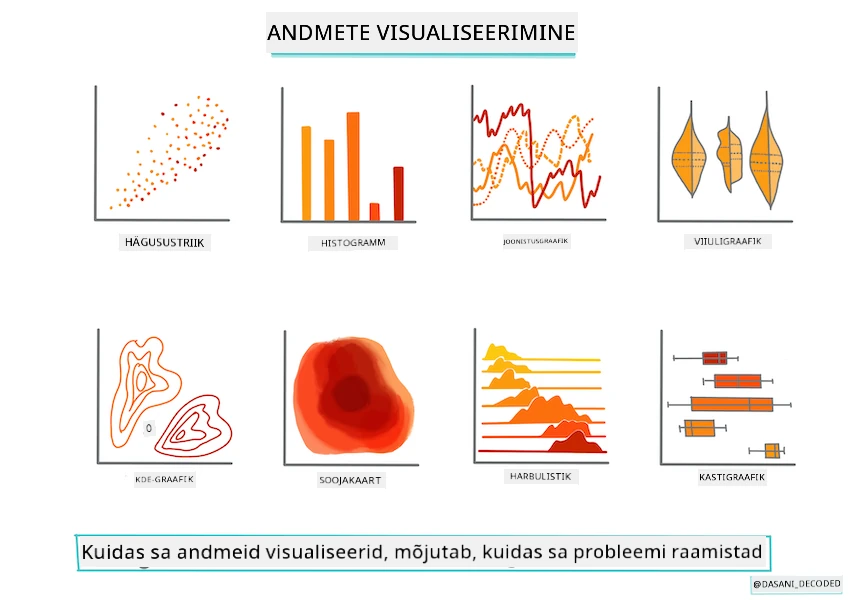
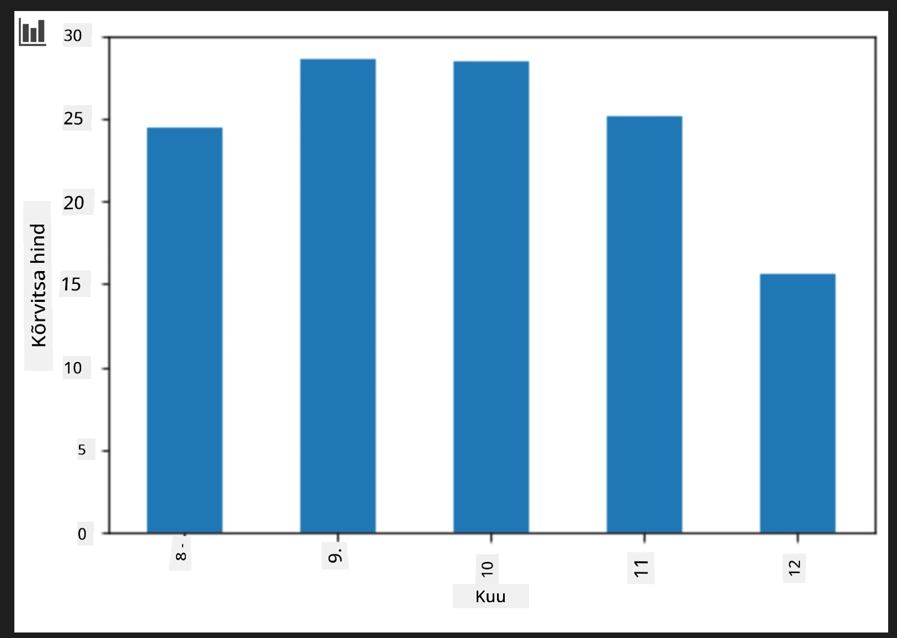
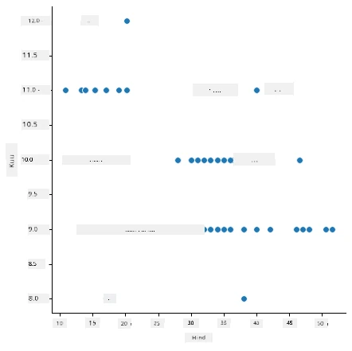
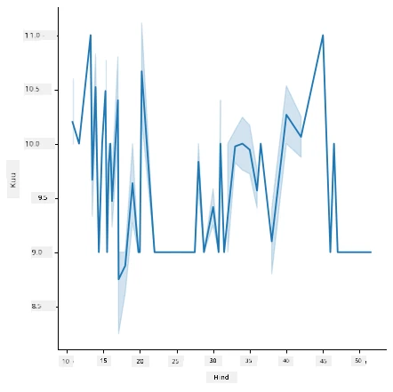
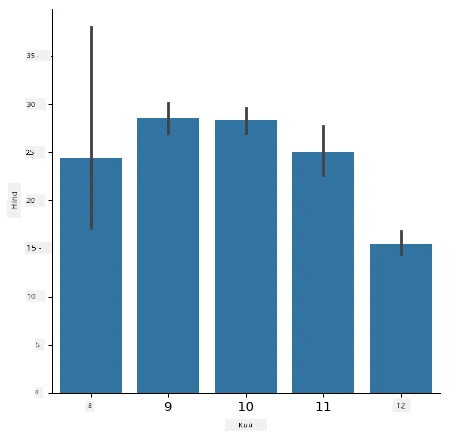
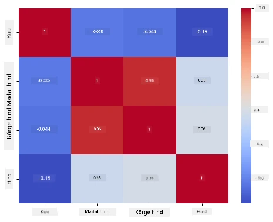

# Ehita regressioonimudel Scikit-learn kasutades: andmete ettevalmistamine ja visualiseerimine



Infograafik autorilt [Dasani Madipalli](https://twitter.com/dasani_decoded)

## [Eel-loengu viktoriin](https://ff-quizzes.netlify.app/en/ml/)

> ### [See õppetund on saadaval R-is!](../../../../2-Regression/2-Data/solution/R/lesson_2.html)

## Sissejuhatus

Nüüd, kui sul on olemas tööriistad masinaõppemudeli ehitamiseks Scikit-learn abil, oled valmis oma andmetest küsimusi esitama. Andmetega töötades ja masinõpperakendusi kasutades on väga oluline mõista, kuidas esitada õigeid küsimusi, et oma andmekogu potentsiaali õigesti avada.

Selles õppetükis õpid:

- Kuidas ette valmistada andmeid mudeli koostamiseks.
- Kuidas kasutada Matplotlibi andmete visualiseerimiseks.
- Kuidas kasutada Seaborni väljendusrikkamate andmevisualiseeringute loomiseks.

## Õige küsimuse esitamine oma andmetele

Sulle vajaliku vastuse küsimus määrab, milliseid ML-algoritme sa kasutad. Ja vastuse kvaliteet sõltub tugevalt sinu andmete olemusest.

Vaata [andmeid](https://github.com/microsoft/ML-For-Beginners/blob/main/2-Regression/data/US-pumpkins.csv), mis on selle õppetunni jaoks esitatud. Saad selle .csv faili avada VS Codes. Esmane kiire ülevaade näitab kohe, et andmetes on tühjad väljad ja segamini on nii tekstid kui ka numbrilised andmed. On ka kummaline veerg nimega 'Package', kus andmed on segamini 'kottide', 'kastide' ja teiste väärtustega. Tegelikult on andmed üsna segased.

[](https://youtu.be/5qGjczWTrDQ "Masinõpe algajatele - Kuidas analüüsida ja puhastada andmestikku")

> 🎥 Klõpsa ülalolevale pildile, et vaadata lühivideot, kus näidatakse, kuidas õppetunni andmeid ette valmistada.

Tegelikult pole väga tavaline, et sulle kingitakse andmestik, mis on täiesti valmis masinõppemudeli loomiseks. Selles õppetükis õpid, kuidas ette valmistada toores andmestik, kasutades standardseid Python'i raamatukogusid. Samuti õpid erinevaid tehnikaid andmete visualiseerimiseks.

## Juhtumiuuring: 'kõrvitsaturg'

Selles kaustas leiad juurkaustast `data` kausta .csv faili nimega [US-pumpkins.csv](https://github.com/microsoft/ML-For-Beginners/blob/main/2-Regression/data/US-pumpkins.csv), mis sisaldab 1757 andmerida kõrvitsaturu kohta, sorteeritud linnade kaupa. See on toores andmestik, mis pärineb [Specialty Crops Terminal Markets Standard Reports](https://www.marketnews.usda.gov/mnp/fv-report-config-step1?type=termPrice) aruannetest, mida levitab USA Põllumajandusministeerium.

### Andmete ettevalmistamine

Need andmed on avalikus omandis. Neid saab alla laadida paljudes eraldi failides, iga linna kohta, USDA veebisaidilt. Koputades, et vältida liiga paljusid eraldi faile, oleme ühendanud kõik linnade andmed üheks tabeliks, seega oleme juba veidi andmeid _valmistanud_. Järgmisena vaatame andmetele lähemalt.

### Kõrvitsaandmed - esimesed järeldused

Mida sa märkad nende andmete kohta? Sa juba nägid, et seal on segamini tekstid, numbrid, tühjad väljad ja kummalised väärtused, mida pead mõistma.

Millise küsimuse võid esitada nende andmete kohta, kasutades regressioonitehnikat? Näiteks "Ennusta kõrvitsa hind müügil antud kuul". Andmeid vaadates tuleb mõningaid muudatusi teha, et luua sobiv andmestruktuur ülesande täitmiseks.
## Harjutus - analüüsi kõrvitsaandmeid

Kasuta [Pandas](https://pandas.pydata.org/), (nimi tuleneb sõnadest `Python Data Analysis`), väga kasulikku tööriista andmete kujundamiseks, et analüüsida ja ette valmistada neid kõrvitsaandmeid.

### Esiteks, vaata puuduvad kuupäevad

Esmalt pead kontrollima puuduvate kuupäevade olemasolu:

1. Muuda kuupäevad kuu formaati (need on USA kuupäevad, seega formaat on `KK/PP/AAAA`).
2. Eemalda kuu uusasse veergu.

Ava Visual Studio Codes fail _notebook.ipynb_ ja impordi tabel uude Pandase andmeraami.

1. Kasuta funktsiooni `head()`, et vaadata esimesi viit rida.

    ```python
    import pandas as pd
    pumpkins = pd.read_csv('../data/US-pumpkins.csv')
    pumpkins.head()
    ```

    ✅ Millist funktsiooni kasutaksid viimaste viie rea vaatamiseks?

1. Kontrolli, kas andmeraamis on puuduvaid andmeid:

    ```python
    pumpkins.isnull().sum()
    ```

    Puuduvad andmed on olemas, kuid võib-olla see ei mõjuta antud ülesannet.

1. Tee oma andmebaasiga lihtsam töötada, valides ainult vajalikud veerud, kasutades `loc` funktsiooni, mis väljavõtab originaalandmebaasist rea (esimene parameeter) ja veeru (teine parameeter). Avaldis `:` tähendab allpool "kõik read".

    ```python
    columns_to_select = ['Package', 'Low Price', 'High Price', 'Date']
    pumpkins = pumpkins.loc[:, columns_to_select]
    ```

### Teiseks, määra kõrvitsa keskmine hind

Mõtle, kuidas määrata kõrvitsa keskmine hind kindlal kuul. Milliseid veerge sa selleks valiksid? Vihje: vajate kolme veergu.

Lahendus: arvuta veergude `Low Price` ja `High Price` keskmine, et täita uus veerg Price, ja muuda Date veerg nii, et näidatakse ainult kuud. Õnneks, nagu eelnev kontroll näitas, puuduvad andmed kuupäevade või hindade osas.

1. Keskmise arvutamiseks lisa järgmine kood:

    ```python
    price = (pumpkins['Low Price'] + pumpkins['High Price']) / 2

    month = pd.DatetimeIndex(pumpkins['Date']).month

    ```

   ✅ Kui soovid, võid printida andmeid, nt `print(month)`, et kontrollida.

2. Nüüd kopeeri muudetud andmed uude Pandase andmeraami:

    ```python
    new_pumpkins = pd.DataFrame({'Month': month, 'Package': pumpkins['Package'], 'Low Price': pumpkins['Low Price'],'High Price': pumpkins['High Price'], 'Price': price})
    ```

    Andmeraami printimine näitab sulle puhtaid ja korras andmeid, millele saad ehitada oma regressioonimudeli.

### Aga oota! Siin on midagi kummalist

Kui vaatad `Package` veergu, müüakse kõrvitsaid paljudes erinevates kogustes. Mõned müüakse '1 1/9 bushel' mõõtudes, mõned '1/2 bushel' mõõtudes, mõned tükiti, mõned kilo kohta ja mõned suurtes kastides erinevate laiustega.

> Kõrvitsaid paistab olevat raske ühtlaselt kaaluda

Originaalandmetes on huvitav, et kõik müügitüübid `Unit of Sale` väärtusega 'EACH' või 'PER BIN' on seotud ka `Package` tüübile tolli või kasti või 'üksik' põhise andmetega. Kõrvitsaid on raske ühtlaselt kaaluda, nii et filtreerime neid, valides ainult kõrvitsaid, mille `Package` veerus on sõna 'bushel'.

1. Lisa faili algusesse filter, pärast .csv importi:

    ```python
    pumpkins = pumpkins[pumpkins['Package'].str.contains('bushel', case=True, regex=True)]
    ```

    Kui nüüd andmeid prindid, näed, et saad ainult umbes 415 rida kõrvitsaid bushelites.

### Aga oota! Veel üks asi mida teha

Kas märkasid, et busheli suurus erineb ridade lõikes? Pead hindade normaliseerimiseks näitama hinda ühe busheli kohta, tee seda matemaatiliselt.

1. Lisa need read pärast plokki, mis loob new_pumpkins andmeraami:

    ```python
    new_pumpkins.loc[new_pumpkins['Package'].str.contains('1 1/9'), 'Price'] = price/(1 + 1/9)

    new_pumpkins.loc[new_pumpkins['Package'].str.contains('1/2'), 'Price'] = price/(1/2)
    ```

✅ Vastavalt [The Spruce Eats](https://www.thespruceeats.com/how-much-is-a-bushel-1389308) järgi sõltub busheli kaal toote tüübist, kuna see on mahtmõõde. "Näiteks tomatite bushel peaks kaaluma 56 naela... Lehed ja rohelised võtavad rohkem ruumi vähem kaalu tõttu, seega spinati bushel kaalub ainult 20 naela." See on üsna keeruline! Me ei viitsi teha busheli- ja naela konversiooni, vaid hindame hinda lihtsalt busheli kohta. Kõik see uurimine näitab, kui tähtis on mõista oma andmete olemust!

Nüüd saad analüüsida hinnastamist ühiku kohta, mis põhineb busheli mõõdul. Kui prindid andmed veel kord, näed, et see on standardiseeritud.

✅ Kas märkasid, et poolbusheli kaupa müüdavad kõrvitsad on väga kallid? Kas suudad aru saada, miks? Vihje: väiksed kõrvitsad on palju kallimad kui suured, tõenäoliselt sellepärast, et bushelis on neid palju rohkem, kuna ühe suure aukliku piruka kõrvale jääb palju kasutamata ruumi.

## Visualiseerimise strateegiad

Andmeteadlase ülesanne on näidata töötatavate andmete kvaliteeti ja olemust. Selleks loovad nad tihti huvitavaid visualiseeringuid ehk jooniseid, graafikuid ja tabeleid, mis näitavad andmete erinevaid aspekte. Nii suudavad nad näidata visuaalselt seoseid ja lünki, mida muidu on raske avastada.

[](https://youtu.be/SbUkxH6IJo0 "Masinõpe algajatele - Kuidas visualiseerida andmeid Matplotlibiga")

> 🎥 Klõpsa ülalolevale pildile, et vaadata lühivideot, mis näitab, kuidas selle õppetunni andmeid visualiseerida.

Visualiseeringud aitavad ka määrata masinõppetehnika andmete jaoks. Näiteks hajuvusdiagramm, mille punktid paistavad järgivat joont, viitab, et andmed sobivad hästi lineaarse regressiooni ülesandeks.

Üks andmevisualiseerimise teek, mis sobib hästi Jupyteri märkmikesse, on [Matplotlib](https://matplotlib.org/) (mida sa juba eelnevalt nägid).

> Saavuta rohkem kogemusi andmete visualiseerimisel [nendes juhendites](https://docs.microsoft.com/learn/modules/explore-analyze-data-with-python?WT.mc_id=academic-77952-leestott).

## Harjutus - eksperimenteeri Matplotlibiga

Proovi luua mõned lihtsad joonised, et kuvada oma äsja loodud andmeraami. Mida näitaks lihtne joondiagramm?

1. Impordi faili alguses Matplotlib, Pandase importide alla:

    ```python
    import matplotlib.pyplot as plt
    ```

1. Käivita kogu märkmik uuesti, et värskendada.
1. Lisa märkmiku lõppu lahter, mis joonistab andmed karbidiagrammina:

    ```python
    price = new_pumpkins.Price
    month = new_pumpkins.Month
    plt.scatter(price, month)
    plt.show()
    ```

    

    Kas see joonis on kasulik? Kas miski sind selle juures üllatab?

    See ei ole eriti kasulik, sest see kuvab lihtsalt andmed hajutatult punktidena antud kuus.

### Tee sellest kasulik

Kasulike diagrammide saamiseks tuleb tavaliselt andmeid kuidagi rühmitada. Proovime luua joonise, kus y-teljel on kuud ning andmed näitavad jaotust.

1. Lisa lahter, mis loob rühmitatud tulpdiagrammi:

    ```python
    new_pumpkins.groupby(['Month'])['Price'].mean().plot(kind='bar')
    plt.ylabel("Pumpkin Price")
    ```

    

    See on kasulikum andmete visualiseerimine! Tundub, et kõrvitsate kõrgeim hind on septembris ja oktoobris. Kas see vastab sinu ootustele? Miks või miks mitte?

## Harjutus - eksperimenteeri Seaborniga

Matplotlib on võimas, kuid võib nõuda palju koodi poleeritud diagrammide loomiseks. [Seaborn](https://seaborn.pydata.org/) on raamatukogu, mis ehitatud _Matplotlibi peale_, mõeldud statistiliste andmete visualiseerimiseks. See töötab otse Pandase andmeraamidega, rakendab atraktiivseid vaikestiile ning võimaldab luua informatiivseid diagramme palju vähem koodiga. Kuna Seaborn tagastab Matplotlibi objekte, saad kasutada kõike, mida tead Matplotlibi kohta, tulemuse täiendavaks häälestamiseks.

> Kui sul Seaborni veel ei ole, paigalda see käsuga `pip install seaborn`.

1. Impordi Seaborn märkmiku algusesse koos ülejäänud importidega. Tavaliselt imporditakse see nimega `sns`:

    ```python
    import seaborn as sns
    ```

### Hajuvusgraafikud suhete näitamiseks

Suur osa andmete uurimisest enne mudeli koostamist on otsida _seoseid_ muutujate vahel. [Hajuvusdiagramm](https://en.wikipedia.org/wiki/Scatter_plot) on selleks üks parimaid tööriistu: kui punktid paistavad järgivat joont, võivad kaks muutujat olla korreleeritud, mis on hea märk, et lineaarne regressioonimudel võib toimida.

1. Reproduseeri eelmine hinna-ja-kuu hajuvusdiagramm, seekord kasutades Seaborni [`relplot()`](https://seaborn.pydata.org/generated/seaborn.relplot.html) (seoseline diagramm), mis töötab otse sinu andmeraami veergudega:

    ```python
    sns.relplot(x="Price", y="Month", data=new_pumpkins)
    ```

    

    Märka, kuidas sa annad _veerunimed_ ja andmeraami ning Seaborn hoolitseb teljesiltide eest ise.

2. Võid lülituda joondiagrammile, andes argumendiks `kind="line"`. Seaborn joonistab isegi varjutatud ala, mis näitab joone ümber usaldusvahemikku:

    ```python
    sns.relplot(x="Price", y="Month", kind="line", data=new_pumpkins)
    ```

    

    See konkreetne andmestik on üsna mürarikas, seega joondiagramm pole kõige selgem valik — kuid see näitab, kui lihtsalt saab Seabornis diagrammitüüpe vahetada.

### Tulpdiagrammid jaotusnäitajate kuvamiseks


Varem grupeerisite andmed käsitsi, et Matplotlibiga luua tulpdiagramm. Seaborn'i [`catplot()`](https://seaborn.pydata.org/generated/seaborn.catplot.html) (kategoriadiagramm) suudab teha grupeerimise ja agregatsiooni teie eest. Vaikimisi näitab `kind="bar"` iga kategooria keskmist koos musta joonisega, mis näitab usaldusintervalli.

1. Looge kuu keskmise hinna tulpdiagramm:

    ```python
    sns.catplot(x="Month", y="Price", data=new_pumpkins, kind="bar")
    ```

    

    See kinnitab, mida nägite Matplotlibiga — hinnad on tipphetkel septembris ja oktoobris — kuid Seaborn visualiseerib ka, kui palju hind iga kuu sees _muutub_.

### Soojuskaardid korrelatsioonide näitamiseks

Hajuvusdiagrammid võrdlevad korraga kahte muutujat. Kui teil on mitu numbrilist veergu, võimaldab [soojuskaart](https://en.wikipedia.org/wiki/Heat_map) korraga vaadata iga veerupaaride vahelise seose tugevust. See on levinud viis tuvastada, millised tunnused on kõige korreleeritumad enne, kui valida, mida mudelile sisendiks anda (ja sarnast diagrammi kasutatakse hiljem klassifikatsiooni segadusmaatriksite kuvamiseks).

1. Koostage Pandasega korrelatsioonimaatriks ja joonistage see Seaborni [`heatmap()`](https://seaborn.pydata.org/generated/seaborn.heatmap.html) abil. Valik `annot=True` trükib korrelatsiooniväärtused iga lahtri peale:

    ```python
    correlations = new_pumpkins[['Month', 'Low Price', 'High Price', 'Price']].corr()
    sns.heatmap(correlations, annot=True, cmap="coolwarm")
    ```

    

    Väärtused, mis on lähedal `1`-le (või `-1`-le), tähendavad, et veerud on tugevalt _lineaarselt_ korreleeritud. Märkige, kuidas `Low Price` ja `High Price` on peaaegu täiuslikult korreleeritud. `Month` aga näitab ainult nõrka lineaarset korrelatsiooni hinnaga — kuigi ülaltoodud tulpdiagramm näitas selget hooajalist tippu septembris ja oktoobris. See on tähtis õppetund: korrelatsioonikordaja mõõdab ainult _äärtesirge_ seoseid, seega võib see hooajalisi või muid mittelineaarseid mustreid mitte tuua esile. ✅ Miks on kasulik vaadata nii soojuskaarti kui ka näiteks tulpdiagrammi enne, kui otsustate, milliseid veerge kasutada?

### Matplotlib või Seaborn?

Mõlemad teegid on teadmiste väärt:

- **Matplotlib** annab teile väga peene kontrolli iga diagrammi elemendi üle ja on aluseks peaaegu igale teisele Pythonis kasutatavale graafikuteegile.
- **Seaborn** pakub kõrgema taseme funktsioone ja atraktiivseid vaikeväärtusi statistiliste diagrammide jaoks, töötab otse DataFrame'idega ja on sageli kiirem esmaseks andmeanalüüsiks.

Tavaliselt kasutataksegi Seaborni, et kiiresti andmeid avastada, ning vajadusel liigub seejärel detailseks kohandamiseks Matplotlibi.

---

## 🚀Väljakutse

Uurige Matplotlibi ja Seaborni erinevaid visualiseerimise tüüpe. Millised on regressiooniprobleemide jaoks kõige sobivamad?

## [Loengu järel test](https://ff-quizzes.netlify.app/en/ml/)

## Kordamine ja iseseisev õppimine

Vaadake üle erinevad viisid andmete visualiseerimiseks. Koostage nimekiri saadaolevatest teekidest ja märkige, millised sobivad konkreetselt erinevate ülesannete jaoks, näiteks 2D vs 3D visualiseerimine. Mida te avastate?

## Kodune ülesanne

[Visualiseerimise uurimine](assignment.md)

---

<!-- CO-OP TRANSLATOR DISCLAIMER START -->
**Lahtiütlus**:
See dokument on tõlgitud kasutades AI tõlketeenust [Co-op Translator](https://github.com/Azure/co-op-translator). Kuigi me püüdleme täpsuse poole, palun pange tähele, et automatiseeritud tõlgetes võib esineda vigu või ebatäpsusi. Originaaldokument selle emakeeles tuleks pidada autoriteetseks allikaks. Olulise teabe puhul soovitatakse kasutada professionaalset inimtõlget. Me ei vastuta selle tõlkega seotud eksimustest või valesti mõistmistest.
<!-- CO-OP TRANSLATOR DISCLAIMER END -->