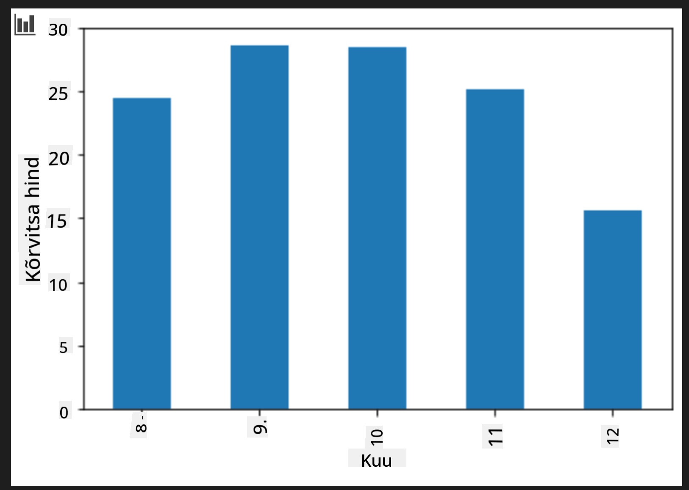

<!--
CO_OP_TRANSLATOR_METADATA:
{
  "original_hash": "40e64f004f3cb50aa1d8661672d3cd92",
  "translation_date": "2025-10-11T11:46:03+00:00",
  "source_file": "2-Regression/3-Linear/README.md",
  "language_code": "et"
}
-->
# Ehita regressioonimudel Scikit-learniga: neli viisi regressiooniks


> Infograafika autor: [Dasani Madipalli](https://twitter.com/dasani_decoded)
## [Eelloengu viktoriin](https://ff-quizzes.netlify.app/en/ml/)

> ### [See õppetund on saadaval ka R-is!](../../../../2-Regression/3-Linear/solution/R/lesson_3.html)
### Sissejuhatus

Siiani olete uurinud, mis on regressioon, kasutades näidisandmeid kõrvitsate hindade andmestikust, mida kasutame kogu selle õppetunni jooksul. Olete seda visualiseerinud ka Matplotlibi abil.

Nüüd olete valmis süvenema regressiooni masinõppe jaoks. Kuigi visualiseerimine aitab andmetest aru saada, peitub masinõppe tõeline jõud _mudelite treenimises_. Mudelid treenitakse ajalooliste andmete põhjal, et automaatselt tabada andmete sõltuvusi, ja need võimaldavad ennustada tulemusi uute andmete põhjal, mida mudel pole varem näinud.

Selles õppetunnis õpite rohkem kahte tüüpi regressiooni kohta: _lihtne lineaarne regressioon_ ja _polünoomne regressioon_, koos mõningate matemaatiliste alustega, mis neid tehnikaid toetavad. Need mudelid võimaldavad meil ennustada kõrvitsate hindu sõltuvalt erinevatest sisendandmetest.

[](https://youtu.be/CRxFT8oTDMg "ML algajatele - Lineaarse regressiooni mõistmine")

> 🎥 Klõpsake ülaloleval pildil, et vaadata lühikest videot lineaarse regressiooni ülevaatest.

> Kogu selle õppekava jooksul eeldame minimaalset matemaatikaalast teadmist ja püüame muuta selle arusaadavaks teiste valdkondade õpilastele, seega jälgige märkmeid, 🧮 matemaatilisi vihjeid, diagramme ja muid õppimisvahendeid, mis aitavad mõistmist.

### Eeldused

Praeguseks peaksite olema tuttav kõrvitsate andmete struktuuriga, mida me uurime. Need andmed on selle õppetunni _notebook.ipynb_ failis eelnevalt laaditud ja puhastatud. Failis kuvatakse kõrvitsate hind busheli kohta uues andmeraamis. Veenduge, et saate neid märkmikke Visual Studio Code'i kerneli abil käivitada.

### Ettevalmistus

Tuletame meelde, et laadite need andmed, et neilt küsimusi küsida.

- Millal on parim aeg kõrvitsaid osta?
- Millist hinda võin oodata miniatuurse kõrvitsate kasti eest?
- Kas peaksin ostma neid poole busheli korvides või 1 1/9 busheli kastides?
Uurime neid andmeid edasi.

Eelmises õppetunnis lõite Pandase andmeraami ja täitsite selle osa algsest andmestikust, standardiseerides hinnad busheli järgi. Sellega suutsime aga koguda ainult umbes 400 andmepunkti ja ainult sügiskuude kohta.

Vaadake andmeid, mis on selle õppetunni kaasasolevas märkmikus eelnevalt laaditud. Andmed on eelnevalt laaditud ja algne hajuvusdiagramm on koostatud, et näidata kuude andmeid. Võib-olla saame andmete olemuse kohta rohkem üksikasju, kui neid rohkem puhastame.

## Lineaarse regressiooni joon

Nagu õppisite 1. õppetunnis, on lineaarse regressiooni eesmärk joonistada joon, et:

- **Näidata muutujate seoseid**. Näidata muutujate vahelist seost
- **Teha ennustusi**. Teha täpseid ennustusi selle kohta, kuhu uus andmepunkt selle joone suhtes paigutuks.

Tüüpiline **väikseimate ruutude regressioon** joonistab sellist joont. Termin "väikseimad ruudud" tähendab, et kõik regressioonijoone ümber olevad andmepunktid ruudustatakse ja seejärel liidetakse. Ideaalis on see lõplik summa võimalikult väike, kuna soovime väikest vigade arvu ehk `väikseimad ruudud`.

Teeme seda, kuna soovime modelleerida joont, millel on kõigi meie andmepunktide suhtes kõige väiksem kumulatiivne kaugus. Samuti ruudustame terminid enne nende liitmist, kuna meid huvitab nende suurus, mitte suund.

> **🧮 Näita mulle matemaatikat**
>
> Seda joont, mida nimetatakse _parima sobivuse jooneks_, saab väljendada [võrrandiga](https://en.wikipedia.org/wiki/Simple_linear_regression):
>
> ```
> Y = a + bX
> ```
>
> `X` on 'selgitav muutuja'. `Y` on 'sõltuv muutuja'. Joone kalle on `b` ja `a` on y-teljelõige, mis viitab `Y` väärtusele, kui `X = 0`.
>
>
>
> Kõigepealt arvutage kalle `b`. Infograafika autor: [Jen Looper](https://twitter.com/jenlooper)
>
> Teisisõnu, viidates meie kõrvitsate andmete algsele küsimusele: "ennusta kõrvitsa hinda busheli kohta kuu järgi", viitaks `X` hinnale ja `Y` müügikuule.
>
>
>
> Arvutage Y väärtus. Kui maksate umbes 4 dollarit, peab olema aprill! Infograafika autor: [Jen Looper](https://twitter.com/jenlooper)
>
> Matemaatika, mis arvutab joone, peab näitama joone kallet, mis sõltub ka lõikepunktist ehk sellest, kus `Y` asub, kui `X = 0`.
>
> Võite vaadata nende väärtuste arvutamise meetodit veebisaidil [Math is Fun](https://www.mathsisfun.com/data/least-squares-regression.html). Külastage ka [väikseimate ruutude kalkulaatorit](https://www.mathsisfun.com/data/least-squares-calculator.html), et näha, kuidas numbrite väärtused joont mõjutavad.

## Korrelatsioon

Veel üks termin, mida mõista, on **korrelatsioonikordaja** antud X ja Y muutujate vahel. Hajuvusdiagrammi abil saate kiiresti visualiseerida seda kordajat. Diagramm, mille andmepunktid on korrektselt joondatud, omab kõrget korrelatsiooni, kuid diagramm, mille andmepunktid on X ja Y vahel laiali, omab madalat korrelatsiooni.

Hea lineaarse regressiooni mudel on selline, millel on kõrge (lähemal 1-le kui 0-le) korrelatsioonikordaja, kasutades väikseimate ruutude regressiooni meetodit koos regressioonijoonega.

✅ Käivitage selle õppetunni kaasasolev märkmik ja vaadake kuude ja hindade hajuvusdiagrammi. Kas andmed, mis seostavad kuud ja hinda kõrvitsate müügi puhul, tunduvad teie visuaalse tõlgenduse järgi hajuvusdiagrammil kõrge või madala korrelatsiooniga? Kas see muutub, kui kasutate kuude asemel täpsemat mõõdet, näiteks *aasta päeva* (st päevade arv aasta algusest)?

Allolevas koodis eeldame, et oleme andmed puhastanud ja saanud andmeraami nimega `new_pumpkins`, mis näeb välja umbes selline:

ID | Kuu | AastaPäev | Sort | Linn | Pakend | Madal Hind | Kõrge Hind | Hind
---|-----|-----------|------|------|--------|------------|------------|-----
70 | 9 | 267 | PIE TYPE | BALTIMORE | 1 1/9 busheli kastid | 15.0 | 15.0 | 13.636364
71 | 9 | 267 | PIE TYPE | BALTIMORE | 1 1/9 busheli kastid | 18.0 | 18.0 | 16.363636
72 | 10 | 274 | PIE TYPE | BALTIMORE | 1 1/9 busheli kastid | 18.0 | 18.0 | 16.363636
73 | 10 | 274 | PIE TYPE | BALTIMORE | 1 1/9 busheli kastid | 17.0 | 17.0 | 15.454545
74 | 10 | 281 | PIE TYPE | BALTIMORE | 1 1/9 busheli kastid | 15.0 | 15.0 | 13.636364

> Kood andmete puhastamiseks on saadaval failis [`notebook.ipynb`](notebook.ipynb). Oleme teinud samad puhastamistoimingud nagu eelmises õppetunnis ja arvutanud `AastaPäev` veeru järgmise avaldise abil:

```python
day_of_year = pd.to_datetime(pumpkins['Date']).apply(lambda dt: (dt-datetime(dt.year,1,1)).days)
```

Nüüd, kui olete aru saanud lineaarse regressiooni matemaatikast, loome regressioonimudeli, et näha, kas suudame ennustada, milline kõrvitsate pakend pakub parimaid kõrvitsahindu. Keegi, kes ostab kõrvitsaid pühade kõrvitsaplatsi jaoks, võib soovida seda teavet, et optimeerida kõrvitsapakendite ostmist platsi jaoks.

## Korrelatsiooni otsimine

[](https://youtu.be/uoRq-lW2eQo "ML algajatele - Korrelatsiooni otsimine: lineaarse regressiooni võti")

> 🎥 Klõpsake ülaloleval pildil, et vaadata lühikest videot korrelatsiooni ülevaatest.

Eelmises õppetunnis olete tõenäoliselt näinud, et keskmine hind erinevate kuude kohta näeb välja selline:



See viitab sellele, et peaks olema mingi korrelatsioon, ja me võime proovida treenida lineaarse regressiooni mudelit, et ennustada seost `Kuu` ja `Hinna` vahel või `AastaPäeva` ja `Hinna` vahel. Siin on hajuvusdiagramm, mis näitab viimast seost:

 

Vaatame, kas korrelatsioon on olemas, kasutades funktsiooni `corr`:

```python
print(new_pumpkins['Month'].corr(new_pumpkins['Price']))
print(new_pumpkins['DayOfYear'].corr(new_pumpkins['Price']))
```

Tundub, et korrelatsioon on üsna väike, -0.15 `Kuu` järgi ja -0.17 `AastaPäeva` järgi, kuid võib olla veel üks oluline seos. Tundub, et erinevad kõrvitsasordid moodustavad erinevaid hinnaklastrid. Selle hüpoteesi kinnitamiseks joonistame iga kõrvitsakategooria erineva värviga. Kui edastame `scatter` joonistamisfunktsioonile parameetri `ax`, saame kõik punktid samale graafikule joonistada:

```python
ax=None
colors = ['red','blue','green','yellow']
for i,var in enumerate(new_pumpkins['Variety'].unique()):
    df = new_pumpkins[new_pumpkins['Variety']==var]
    ax = df.plot.scatter('DayOfYear','Price',ax=ax,c=colors[i],label=var)
```

 

Meie uurimine viitab sellele, et sordil on müügikuupäevast suurem mõju üldisele hinnale. Seda näeme ka tulpdiagrammist:

```python
new_pumpkins.groupby('Variety')['Price'].mean().plot(kind='bar')
```

 

Keskendume hetkeks ainult ühele kõrvitsasordile, 'pie type', ja vaatame, millist mõju kuupäev hinnale avaldab:

```python
pie_pumpkins = new_pumpkins[new_pumpkins['Variety']=='PIE TYPE']
pie_pumpkins.plot.scatter('DayOfYear','Price') 
```
 

Kui arvutame nüüd korrelatsiooni `Hinna` ja `AastaPäeva` vahel, kasutades funktsiooni `corr`, saame tulemuseks umbes `-0.27` - mis tähendab, et ennustava mudeli treenimine on mõistlik.

> Enne lineaarse regressiooni mudeli treenimist on oluline veenduda, et meie andmed on puhtad. Lineaarne regressioon ei tööta hästi puuduvate väärtustega, seega on mõistlik kõik tühjad lahtrid eemaldada:

```python
pie_pumpkins.dropna(inplace=True)
pie_pumpkins.info()
```

Teine lähenemisviis oleks täita need tühjad väärtused vastava veeru keskmiste väärtustega.

## Lihtne lineaarne regressioon

[](https://youtu.be/e4c_UP2fSjg "ML algajatele - Lineaarne ja polünoomne regressioon Scikit-learniga")

> 🎥 Klõpsake ülaloleval pildil, et vaadata lühikest videot lineaarse ja polünoomse regressiooni ülevaatest.

Lineaarse regressiooni mudeli treenimiseks kasutame **Scikit-learn** teeki.

```python
from sklearn.linear_model import LinearRegression
from sklearn.metrics import mean_squared_error
from sklearn.model_selection import train_test_split
```

Alustame sisendväärtuste (omaduste) ja oodatud väljundi (sildi) eraldamisest eraldi numpy massiividesse:

```python
X = pie_pumpkins['DayOfYear'].to_numpy().reshape(-1,1)
y = pie_pumpkins['Price']
```

> Pange tähele, et pidime sisendandmetele rakendama `reshape`, et lineaarse regressiooni pakett neid õigesti mõistaks. Lineaarne regressioon eeldab sisendina 2D-massiivi, kus massiivi iga rida vastab sisendi omaduste vektorile. Meie puhul, kuna meil on ainult üks sisend, vajame massiivi kujuga N&times;1, kus N on andmestiku suurus.

Seejärel peame andmed jagama treening- ja testandmestikeks, et saaksime pärast treenimist oma mudelit valideerida:

```python
X_train, X_test, y_train, y_test = train_test_split(X, y, test_size=0.2, random_state=0)
```

Lõpuks võtab tegeliku lineaarse regressiooni mudeli treenimine ainult kaks koodirida. Määratleme `LinearRegression` objekti ja sobitame selle meie andmetega, kasutades meetodit `fit`:

```python
lin_reg = LinearRegression()
lin_reg.fit(X_train,y_train)
```

`LinearRegression` objekt pärast `fit`-imist sisaldab kõiki regressiooni koefitsiente, millele pääseb ligi omaduse `.coef_` kaudu. Meie puhul on ainult üks koefitsient, mis peaks olema umbes `-0.017`. See tähendab, et hinnad näivad aja jooksul veidi langevat, kuid mitte liiga palju, umbes 2 senti päevas. Samuti pääseme regressiooni lõikepunktile Y-teljega, kasutades `lin_reg.intercept_` - see on meie puhul umbes `21`, mis näitab hinda aasta alguses.
Et näha, kui täpne meie mudel on, saame prognoosida hindu testandmestikul ja seejärel mõõta, kui lähedased meie prognoosid on oodatud väärtustele. Seda saab teha keskmise ruutvea (MSE) mõõdiku abil, mis on kõigi oodatud ja prognoositud väärtuste ruutude erinevuste keskmine.

```python
pred = lin_reg.predict(X_test)

mse = np.sqrt(mean_squared_error(y_test,pred))
print(f'Mean error: {mse:3.3} ({mse/np.mean(pred)*100:3.3}%)')
```

Meie viga tundub olevat umbes 2 punkti, mis on ~17%. Mitte just väga hea. Teine mudeli kvaliteedi näitaja on **determinatsioonikordaja**, mida saab arvutada järgmiselt:

```python
score = lin_reg.score(X_train,y_train)
print('Model determination: ', score)
```

Kui väärtus on 0, tähendab see, et mudel ei arvesta sisendandmeid ja toimib kui *halvim lineaarne ennustaja*, mis on lihtsalt tulemuse keskmine väärtus. Väärtus 1 tähendab, et suudame täiuslikult prognoosida kõiki oodatud väljundeid. Meie puhul on determinatsioonikordaja umbes 0.06, mis on üsna madal.

Samuti saame testandmed koos regressioonijoonega graafikule panna, et paremini näha, kuidas regressioon meie puhul toimib:

```python
plt.scatter(X_test,y_test)
plt.plot(X_test,pred)
```


## Polünoomiline regressioon

Teine lineaarse regressiooni tüüp on polünoomiline regressioon. Kuigi vahel on muutujate vahel lineaarne seos – näiteks mida suurem kõrvitsa maht, seda kõrgem hind – ei saa neid seoseid alati kujutada tasapinnana või sirgjoonena.

✅ Siin on [veel mõned näited](https://online.stat.psu.edu/stat501/lesson/9/9.8) andmetest, mis võiksid kasutada polünoomilist regressiooni.

Vaata uuesti seost kuupäeva ja hinna vahel. Kas see hajusdiagramm tundub, et seda peaks tingimata analüüsima sirgjoonega? Kas hinnad ei võiks kõikuda? Sellisel juhul võid proovida polünoomilist regressiooni.

✅ Polünoomid on matemaatilised avaldised, mis võivad koosneda ühest või mitmest muutujast ja kordajast.

Polünoomiline regressioon loob kõvera joone, et paremini sobitada mittelineaarseid andmeid. Meie puhul, kui lisame sisendandmetesse ruutvõrrandi `DayOfYear`, peaksime suutma oma andmeid sobitada paraboolse kõveraga, millel on aasta teatud punktis miinimum.

Scikit-learn sisaldab kasulikku [pipeline API-d](https://scikit-learn.org/stable/modules/generated/sklearn.pipeline.make_pipeline.html?highlight=pipeline#sklearn.pipeline.make_pipeline), et kombineerida erinevaid andmetöötluse samme. **Pipeline** on **hinnangute** ahel. Meie puhul loome pipeline'i, mis kõigepealt lisab mudelile polünoomilised omadused ja seejärel treenib regressiooni:

```python
from sklearn.preprocessing import PolynomialFeatures
from sklearn.pipeline import make_pipeline

pipeline = make_pipeline(PolynomialFeatures(2), LinearRegression())

pipeline.fit(X_train,y_train)
```

`PolynomialFeatures(2)` kasutamine tähendab, et lisame sisendandmetest kõik teise astme polünoomid. Meie puhul tähendab see lihtsalt `DayOfYear`<sup>2</sup>, kuid kahe sisendmuutuja X ja Y korral lisab see X<sup>2</sup>, XY ja Y<sup>2</sup>. Võime kasutada ka kõrgema astme polünoome, kui soovime.

Pipeline'i saab kasutada samamoodi nagu algset `LinearRegression` objekti, st saame pipeline'i `fit`-ida ja seejärel kasutada `predict`, et saada prognoositulemused. Siin on graafik, mis näitab testandmeid ja lähenduskõverat:


Polünoomilist regressiooni kasutades saame veidi madalama MSE ja kõrgema determinatsiooni, kuid mitte märkimisväärselt. Peame arvesse võtma ka teisi omadusi!

> Näed, et minimaalsed kõrvitsahinnad on täheldatud kuskil Halloweeni paiku. Kuidas sa seda selgitaksid?

🎃 Palju õnne, sa lõid mudeli, mis aitab prognoosida pirukakõrvitsate hinda. Tõenäoliselt saad sama protseduuri korrata kõigi kõrvitsatüüpide puhul, kuid see oleks tülikas. Õpime nüüd, kuidas arvestada kõrvitsasorti oma mudelis!

## Kategoorilised omadused

Ideaalis tahame olla võimelised prognoosima hindu erinevate kõrvitsasortide jaoks, kasutades sama mudelit. Kuid `Variety` veerg erineb veidi veergudest nagu `Month`, kuna see sisaldab mitte-numerilisi väärtusi. Selliseid veerge nimetatakse **kategoorilisteks**.

[](https://youtu.be/DYGliioIAE0 "ML algajatele - Kategooriliste omaduste prognoosimine lineaarse regressiooniga")

> 🎥 Klõpsa ülaloleval pildil, et vaadata lühikest videot kategooriliste omaduste kasutamisest.

Siin näed, kuidas keskmine hind sõltub sordist:


Sordi arvesse võtmiseks peame esmalt selle numbriliseks vormiks teisendama ehk **kodeerima**. Selleks on mitu võimalust:

* Lihtne **numbriline kodeerimine** loob tabeli erinevatest sortidest ja asendab sordinime selle tabeli indeksiga. See pole lineaarse regressiooni jaoks parim idee, kuna lineaarne regressioon võtab indeksi tegeliku numbrilise väärtuse ja lisab selle tulemusele, korrutades mingi kordajaga. Meie puhul on indeksi numbri ja hinna vaheline seos selgelt mittelineaarne, isegi kui tagame, et indeksid on järjestatud mingil konkreetsel viisil.
* **Üks-ühele kodeerimine** asendab `Variety` veeru nelja erineva veeruga, üks iga sordi jaoks. Iga veerg sisaldab `1`, kui vastav rida kuulub antud sordile, ja `0` muidu. See tähendab, et lineaarse regressiooni korral on neli kordajat, üks iga kõrvitsasordi jaoks, mis vastutavad selle konkreetse sordi "algushinna" (või pigem "lisahinna") eest.

Allolev kood näitab, kuidas saame sordi üks-ühele kodeerida:

```python
pd.get_dummies(new_pumpkins['Variety'])
```

 ID | FAIRYTALE | MINIATURE | MIXED HEIRLOOM VARIETIES | PIE TYPE
----|-----------|-----------|--------------------------|----------
70 | 0 | 0 | 0 | 1
71 | 0 | 0 | 0 | 1
... | ... | ... | ... | ...
1738 | 0 | 1 | 0 | 0
1739 | 0 | 1 | 0 | 0
1740 | 0 | 1 | 0 | 0
1741 | 0 | 1 | 0 | 0
1742 | 0 | 1 | 0 | 0

Lineaarse regressiooni treenimiseks, kasutades üks-ühele kodeeritud sorti sisendina, peame lihtsalt `X` ja `y` andmed õigesti initsialiseerima:

```python
X = pd.get_dummies(new_pumpkins['Variety'])
y = new_pumpkins['Price']
```

Ülejäänud kood on sama, mida kasutasime ülal lineaarse regressiooni treenimiseks. Kui proovid seda, näed, et keskmine ruutviga on umbes sama, kuid saame palju kõrgema determinatsioonikordaja (~77%). Täpsemate prognooside saamiseks saame arvesse võtta rohkem kategoorilisi omadusi, samuti numbrilisi omadusi, nagu `Month` või `DayOfYear`. Ühe suure omaduste massiivi saamiseks saame kasutada `join`:

```python
X = pd.get_dummies(new_pumpkins['Variety']) \
        .join(new_pumpkins['Month']) \
        .join(pd.get_dummies(new_pumpkins['City'])) \
        .join(pd.get_dummies(new_pumpkins['Package']))
y = new_pumpkins['Price']
```

Siin võtame arvesse ka `City` ja `Package` tüüpi, mis annab meile MSE 2.84 (10%) ja determinatsiooni 0.94!

## Kõik kokku

Parima mudeli loomiseks saame kasutada kombineeritud (üks-ühele kodeeritud kategoorilised + numbrilised) andmeid ülaltoodud näitest koos polünoomilise regressiooniga. Siin on täielik kood sinu mugavuseks:

```python
# set up training data
X = pd.get_dummies(new_pumpkins['Variety']) \
        .join(new_pumpkins['Month']) \
        .join(pd.get_dummies(new_pumpkins['City'])) \
        .join(pd.get_dummies(new_pumpkins['Package']))
y = new_pumpkins['Price']

# make train-test split
X_train, X_test, y_train, y_test = train_test_split(X, y, test_size=0.2, random_state=0)

# setup and train the pipeline
pipeline = make_pipeline(PolynomialFeatures(2), LinearRegression())
pipeline.fit(X_train,y_train)

# predict results for test data
pred = pipeline.predict(X_test)

# calculate MSE and determination
mse = np.sqrt(mean_squared_error(y_test,pred))
print(f'Mean error: {mse:3.3} ({mse/np.mean(pred)*100:3.3}%)')

score = pipeline.score(X_train,y_train)
print('Model determination: ', score)
```

See peaks andma meile parima determinatsioonikordaja, peaaegu 97%, ja MSE=2.23 (~8% prognoosiviga).

| Mudel | MSE | Determinatsioon |
|-------|-----|-----------------|
| `DayOfYear` Lineaarne | 2.77 (17.2%) | 0.07 |
| `DayOfYear` Polünoomiline | 2.73 (17.0%) | 0.08 |
| `Variety` Lineaarne | 5.24 (19.7%) | 0.77 |
| Kõik omadused Lineaarne | 2.84 (10.5%) | 0.94 |
| Kõik omadused Polünoomiline | 2.23 (8.25%) | 0.97 |

🏆 Tubli töö! Lõid ühe tunni jooksul neli regressioonimudelit ja parandasid mudeli kvaliteeti 97%-ni. Regressiooni viimases osas õpid logistilist regressiooni kategooriate määramiseks.

---
## 🚀Väljakutse

Testi mitmeid erinevaid muutujaid selles märkmikus, et näha, kuidas korrelatsioon vastab mudeli täpsusele.

## [Loengu järgne viktoriin](https://ff-quizzes.netlify.app/en/ml/)

## Ülevaade ja iseseisev õppimine

Selles tunnis õppisime lineaarset regressiooni. On ka teisi olulisi regressiooni tüüpe. Loe Stepwise, Ridge, Lasso ja Elasticnet tehnikate kohta. Hea kursus, mida õppida, on [Stanfordi statistilise õppimise kursus](https://online.stanford.edu/courses/sohs-ystatslearning-statistical-learning).

## Ülesanne

[Ehita mudel](assignment.md)

---

**Lahtiütlus**:  
See dokument on tõlgitud AI tõlketeenuse [Co-op Translator](https://github.com/Azure/co-op-translator) abil. Kuigi püüame tagada täpsust, palume arvestada, et automaatsed tõlked võivad sisaldada vigu või ebatäpsusi. Algne dokument selle algses keeles tuleks pidada autoriteetseks allikaks. Olulise teabe puhul soovitame kasutada professionaalset inimtõlget. Me ei vastuta selle tõlke kasutamisest tulenevate arusaamatuste või valesti tõlgenduste eest.