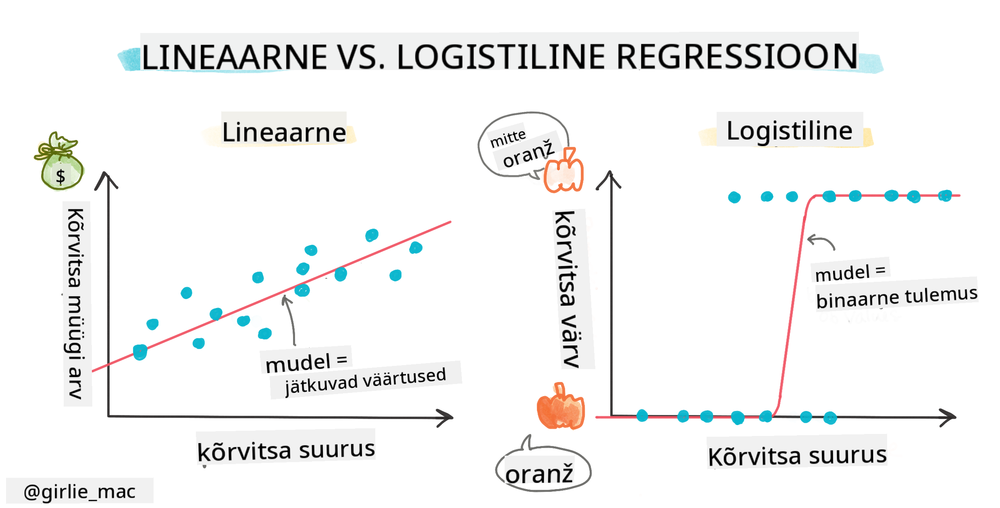
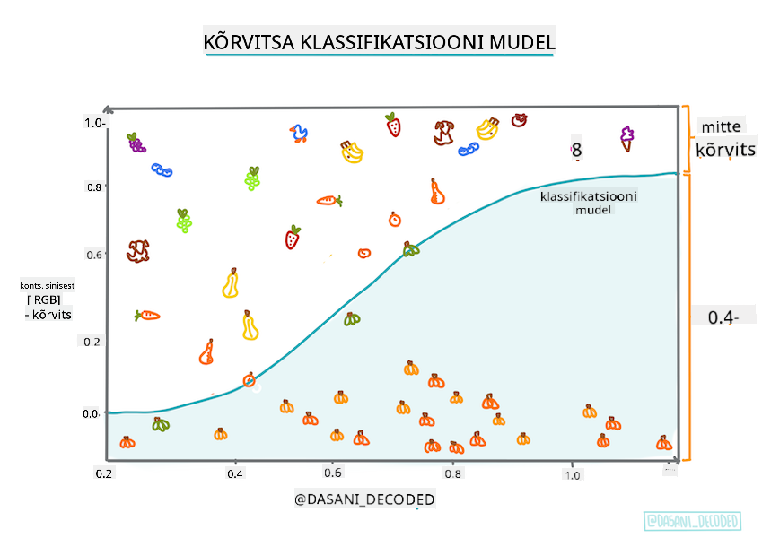
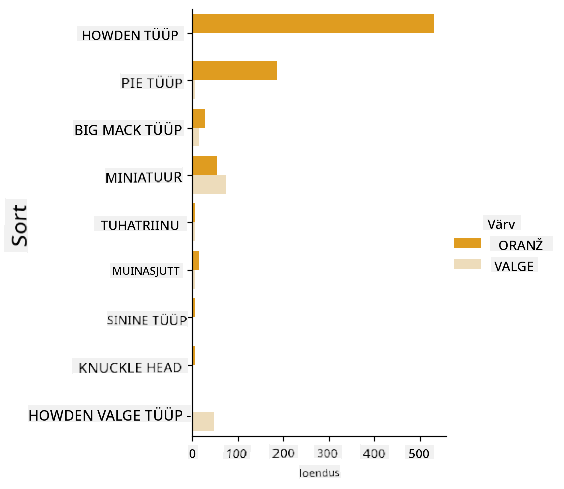
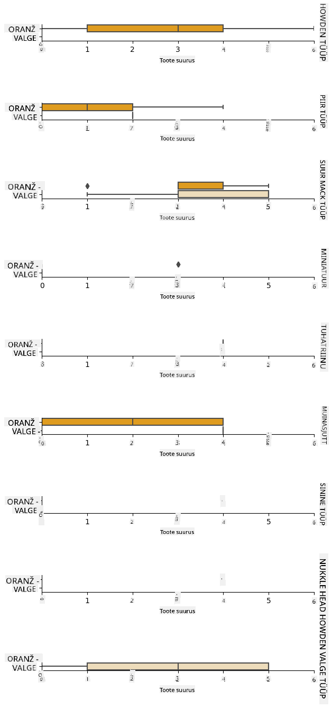
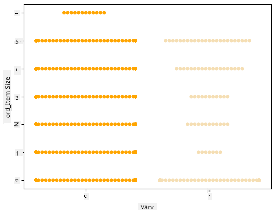
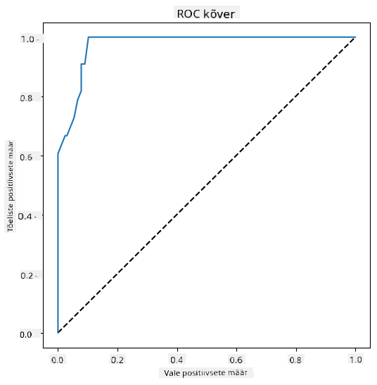

<!--
CO_OP_TRANSLATOR_METADATA:
{
  "original_hash": "abf86d845c84330bce205a46b382ec88",
  "translation_date": "2025-10-11T11:42:07+00:00",
  "source_file": "2-Regression/4-Logistic/README.md",
  "language_code": "et"
}
-->
# Logistiline regressioon kategooriate ennustamiseks



## [Eelloengu viktoriin](https://ff-quizzes.netlify.app/en/ml/)

> ### [See õppetund on saadaval ka R-is!](../../../../2-Regression/4-Logistic/solution/R/lesson_4.html)

## Sissejuhatus

Selles viimases regressiooni õppetunnis, mis on üks klassikalistest ML-tehnikatest, vaatame logistilist regressiooni. Seda tehnikat kasutatakse mustrite avastamiseks, et ennustada binaarseid kategooriaid. Kas see komm on šokolaad või mitte? Kas see haigus on nakkav või mitte? Kas see klient valib selle toote või mitte?

Selles õppetunnis õpid:

- Uut andmete visualiseerimise teeki
- Logistilise regressiooni tehnikaid

✅ Süvenda oma arusaamist selle regressioonitüübi kasutamisest [Learn moodulis](https://docs.microsoft.com/learn/modules/train-evaluate-classification-models?WT.mc_id=academic-77952-leestott)

## Eeldused

Olles töötanud kõrvitsate andmetega, oleme nüüd piisavalt tuttavad, et mõista, et seal on üks binaarne kategooria, millega saame töötada: `Color`.

Loome logistilise regressioonimudeli, et ennustada, millise värviga kõrvits tõenäoliselt on (oranž 🎃 või valge 👻), arvestades mõningaid muutujaid.

> Miks me räägime binaarsest klassifikatsioonist regressiooni õppetundide grupis? Lihtsalt keelelise mugavuse huvides, kuna logistiline regressioon on [tegelikult klassifikatsioonimeetod](https://scikit-learn.org/stable/modules/linear_model.html#logistic-regression), kuigi lineaarne. Õpi teisi viise andmete klassifitseerimiseks järgmises õppetundide grupis.

## Küsimuse määratlemine

Meie eesmärkide jaoks väljendame seda binaarselt: 'Valge' või 'Mitte valge'. Meie andmestikus on ka 'triibuline' kategooria, kuid selle esinemisi on vähe, seega me ei kasuta seda. See kaob niikuinii, kui eemaldame andmestikust nullväärtused.

> 🎃 Lõbus fakt: me kutsume valgeid kõrvitsaid mõnikord 'kummitus' kõrvitsateks. Neid pole väga lihtne nikerdada, seega pole nad nii populaarsed kui oranžid, kuid nad näevad lahedad välja! Seega võiksime oma küsimuse ümber sõnastada: 'Kummitus' või 'Mitte kummitus'. 👻

## Logistilise regressiooni kohta

Logistiline regressioon erineb lineaarse regressioonist, mida sa õppisid varem, mitmel olulisel viisil.

[](https://youtu.be/KpeCT6nEpBY "ML algajatele - Logistilise regressiooni mõistmine masinõppe klassifikatsiooniks")

> 🎥 Klõpsa ülaloleval pildil, et vaadata lühikest videot logistilise regressiooni ülevaatest.

### Binaarne klassifikatsioon

Logistiline regressioon ei paku samu funktsioone kui lineaarne regressioon. Esimene pakub ennustust binaarse kategooria kohta ("valge või mitte valge"), samas kui teine suudab ennustada pidevaid väärtusi, näiteks arvestades kõrvitsa päritolu ja koristusaega, _kui palju selle hind tõuseb_.


> Infograafik autorilt [Dasani Madipalli](https://twitter.com/dasani_decoded)

### Muud klassifikatsioonid

On olemas ka teisi logistilise regressiooni tüüpe, sealhulgas multinomiaalne ja ordinaalne:

- **Multinomiaalne**, mis hõlmab rohkem kui ühte kategooriat - "Oranž, Valge ja Triibuline".
- **Ordinaalne**, mis hõlmab järjestatud kategooriaid, kasulik, kui tahame oma tulemusi loogiliselt järjestada, näiteks kõrvitsad, mis on järjestatud piiratud arvu suuruste järgi (mini, väike, keskmine, suur, XL, XXL).


### Muutujad EI PEA korreleeruma

Kas mäletad, kuidas lineaarne regressioon töötas paremini rohkem korreleeruvate muutujatega? Logistiline regressioon on vastupidine - muutujad ei pea olema seotud. See sobib selle andmestiku jaoks, millel on suhteliselt nõrgad korrelatsioonid.

### Vajad palju puhast andmestikku

Logistiline regressioon annab täpsemaid tulemusi, kui kasutad rohkem andmeid; meie väike andmestik pole selle ülesande jaoks optimaalne, seega pea seda meeles.

[](https://youtu.be/B2X4H9vcXTs "ML algajatele - Andmete analüüs ja ettevalmistus logistilise regressiooni jaoks")

✅ Mõtle, millised andmetüübid sobiksid hästi logistilisele regressioonile

## Harjutus - andmete korrastamine

Kõigepealt puhasta andmed veidi, eemaldades nullväärtused ja valides ainult mõned veerud:

1. Lisa järgmine kood:

    ```python
  
    columns_to_select = ['City Name','Package','Variety', 'Origin','Item Size', 'Color']
    pumpkins = full_pumpkins.loc[:, columns_to_select]

    pumpkins.dropna(inplace=True)
    ```

    Saad alati oma uuele andmestikule pilgu heita:

    ```python
    pumpkins.info
    ```

### Visualiseerimine - kategooriline graafik

Praeguseks oled taas laadinud [algusmärkmiku](./notebook.ipynb) kõrvitsaandmetega ja puhastanud selle, et säilitada andmestik, mis sisaldab mõningaid muutujaid, sealhulgas `Color`. Visualiseerime andmestiku märkmikus, kasutades teist teeki: [Seaborn](https://seaborn.pydata.org/index.html), mis on ehitatud Matplotlibi peale, mida kasutasime varem.

Seaborn pakub huvitavaid viise andmete visualiseerimiseks. Näiteks saad võrrelda andmete jaotusi iga `Variety` ja `Color` jaoks kategoorilises graafikus.

1. Loo selline graafik, kasutades funktsiooni `catplot`, meie kõrvitsaandmeid `pumpkins` ja määrates värvikaardistuse iga kõrvitsakategooria jaoks (oranž või valge):

    ```python
    import seaborn as sns
    
    palette = {
    'ORANGE': 'orange',
    'WHITE': 'wheat',
    }

    sns.catplot(
    data=pumpkins, y="Variety", hue="Color", kind="count",
    palette=palette, 
    )
    ```

    

    Vaadates andmeid, näed, kuidas `Color` andmed seostuvad `Variety`-ga.

    ✅ Selle kategoorilise graafiku põhjal, milliseid huvitavaid uurimusi sa ette kujutad?

### Andmete eeltöötlus: tunnuste ja siltide kodeerimine
Meie kõrvitsaandmestik sisaldab stringiväärtusi kõigi veergude jaoks. Kategooriliste andmetega töötamine on inimestele intuitiivne, kuid mitte masinatele. Masinõppe algoritmid töötavad hästi numbritega. Seetõttu on kodeerimine väga oluline samm andmete eeltöötluse faasis, kuna see võimaldab meil muuta kategoorilised andmed numbrilisteks andmeteks, kaotamata teavet. Hea kodeerimine aitab luua hea mudeli.

Tunnuste kodeerimiseks on kaks peamist tüüpi kodeerijaid:

1. Ordinaalne kodeerija: see sobib hästi ordinaalsete muutujate jaoks, mis on kategoorilised muutujad, kus nende andmed järgivad loogilist järjestust, nagu `Item Size` veerg meie andmestikus. See loob kaardistuse, kus iga kategooriat esindab number, mis on kategooria järjekord veerus.

    ```python
    from sklearn.preprocessing import OrdinalEncoder

    item_size_categories = [['sml', 'med', 'med-lge', 'lge', 'xlge', 'jbo', 'exjbo']]
    ordinal_features = ['Item Size']
    ordinal_encoder = OrdinalEncoder(categories=item_size_categories)
    ```

2. Kategooriline kodeerija: see sobib hästi nominaalsete muutujate jaoks, mis on kategoorilised muutujad, kus nende andmed ei järgi loogilist järjestust, nagu kõik tunnused, mis erinevad `Item Size`-st meie andmestikus. See on ühekuum kodeerimine, mis tähendab, et iga kategooriat esindab binaarne veerg: kodeeritud muutuja on võrdne 1-ga, kui kõrvits kuulub sellesse `Variety`-sse, ja 0-ga, kui mitte.

    ```python
    from sklearn.preprocessing import OneHotEncoder

    categorical_features = ['City Name', 'Package', 'Variety', 'Origin']
    categorical_encoder = OneHotEncoder(sparse_output=False)
    ```
Seejärel kasutatakse `ColumnTransformer`-it, et kombineerida mitu kodeerijat üheks sammuks ja rakendada neid sobivatele veergudele.

```python
    from sklearn.compose import ColumnTransformer
    
    ct = ColumnTransformer(transformers=[
        ('ord', ordinal_encoder, ordinal_features),
        ('cat', categorical_encoder, categorical_features)
        ])
    
    ct.set_output(transform='pandas')
    encoded_features = ct.fit_transform(pumpkins)
```
Teiselt poolt, sildi kodeerimiseks kasutame scikit-learn `LabelEncoder` klassi, mis on utiliitklass, mis aitab normaliseerida silte nii, et need sisaldaksid ainult väärtusi vahemikus 0 kuni n_classes-1 (siin, 0 ja 1).

```python
    from sklearn.preprocessing import LabelEncoder

    label_encoder = LabelEncoder()
    encoded_label = label_encoder.fit_transform(pumpkins['Color'])
```
Kui oleme tunnused ja sildi kodeerinud, saame need ühendada uueks andmestikuks `encoded_pumpkins`.

```python
    encoded_pumpkins = encoded_features.assign(Color=encoded_label)
```
✅ Millised on ordinaalse kodeerija kasutamise eelised `Item Size` veeru jaoks?

### Muutujatevaheliste suhete analüüs

Nüüd, kui oleme oma andmed eeltöötlenud, saame analüüsida tunnuste ja sildi vahelisi suhteid, et mõista, kui hästi mudel suudab sildi ennustada, arvestades tunnuseid.
Parim viis sellise analüüsi tegemiseks on andmete graafikule kandmine. Kasutame taas Seaborn `catplot` funktsiooni, et visualiseerida suhteid `Item Size`, `Variety` ja `Color` vahel kategoorilises graafikus. Andmete paremaks graafikule kandmiseks kasutame kodeeritud `Item Size` veergu ja kodeerimata `Variety` veergu.

```python
    palette = {
    'ORANGE': 'orange',
    'WHITE': 'wheat',
    }
    pumpkins['Item Size'] = encoded_pumpkins['ord__Item Size']

    g = sns.catplot(
        data=pumpkins,
        x="Item Size", y="Color", row='Variety',
        kind="box", orient="h",
        sharex=False, margin_titles=True,
        height=1.8, aspect=4, palette=palette,
    )
    g.set(xlabel="Item Size", ylabel="").set(xlim=(0,6))
    g.set_titles(row_template="{row_name}")
```


### Kasuta 'swarm' graafikut

Kuna `Color` on binaarne kategooria (Valge või Mitte), vajab see '[spetsiaalset lähenemist](https://seaborn.pydata.org/tutorial/categorical.html?highlight=bar) visualiseerimiseks'. On ka teisi viise, kuidas visualiseerida selle kategooria suhet teiste muutujatega.

Saad visualiseerida muutujaid kõrvuti Seaborn graafikutega.

1. Proovi 'swarm' graafikut, et näidata väärtuste jaotust:

    ```python
    palette = {
    0: 'orange',
    1: 'wheat'
    }
    sns.swarmplot(x="Color", y="ord__Item Size", data=encoded_pumpkins, palette=palette)
    ```

    

**Ole ettevaatlik**: ülaltoodud kood võib genereerida hoiatuse, kuna Seaborn ei suuda esitada sellist hulka andmepunkte 'swarm' graafikus. Võimalik lahendus on vähendada markeri suurust, kasutades 'size' parameetrit. Kuid ole teadlik, et see mõjutab graafiku loetavust.

> **🧮 Näita mulle matemaatikat**
>
> Logistiline regressioon tugineb 'maksimaalse tõenäosuse' kontseptsioonile, kasutades [sigmoidfunktsioone](https://wikipedia.org/wiki/Sigmoid_function). 'Sigmoidfunktsioon' graafikul näeb välja nagu 'S'-kuju. See võtab väärtuse ja kaardistab selle vahemikku 0 kuni 1. Selle kõverat nimetatakse ka 'logistiliseks kõveraks'. Selle valem näeb välja selline:
>
> 
>
> kus sigmoidi keskpunkt asub x-i 0 punktis, L on kõvera maksimaalne väärtus ja k on kõvera järskus. Kui funktsiooni tulemus on suurem kui 0.5, antakse vastavale sildile binaarse valiku klass '1'. Kui mitte, klassifitseeritakse see kui '0'.

## Ehita oma mudel

Mudeli ehitamine nende binaarsete klassifikatsioonide leidmiseks on Scikit-learnis üllatavalt lihtne.

[](https://youtu.be/MmZS2otPrQ8 "ML algajatele - Logistiline regressioon andmete klassifikatsiooniks")

> 🎥 Klõpsa ülaloleval pildil, et vaadata lühikest videot lineaarse regressioonimudeli ehitamisest

1. Vali muutujad, mida soovid kasutada oma klassifikatsioonimudelis, ja jaga treening- ja testkomplektid, kutsudes `train_test_split()`:

    ```python
    from sklearn.model_selection import train_test_split
    
    X = encoded_pumpkins[encoded_pumpkins.columns.difference(['Color'])]
    y = encoded_pumpkins['Color']

    X_train, X_test, y_train, y_test = train_test_split(X, y, test_size=0.2, random_state=0)
    
    ```

2. Nüüd saad oma mudelit treenida, kutsudes `fit()` oma treeningandmetega, ja prindi selle tulemus:

    ```python
    from sklearn.metrics import f1_score, classification_report 
    from sklearn.linear_model import LogisticRegression

    model = LogisticRegression()
    model.fit(X_train, y_train)
    predictions = model.predict(X_test)

    print(classification_report(y_test, predictions))
    print('Predicted labels: ', predictions)
    print('F1-score: ', f1_score(y_test, predictions))
    ```

    Vaata oma mudeli skooritabelit. See pole halb, arvestades, et sul on ainult umbes 1000 rida andmeid:

    ```output
                       precision    recall  f1-score   support
    
                    0       0.94      0.98      0.96       166
                    1       0.85      0.67      0.75        33
    
        accuracy                                0.92       199
        macro avg           0.89      0.82      0.85       199
        weighted avg        0.92      0.92      0.92       199
    
        Predicted labels:  [0 0 0 0 0 0 0 0 0 0 0 0 0 0 0 0 0 0 0 0 1 0 0 1 0 0 0 0 0 0 0 0 1 0 0 0 0
        0 0 0 0 0 1 0 1 0 0 1 0 0 0 0 0 1 0 1 0 1 0 1 0 0 0 0 0 0 0 0 0 0 0 0 0 0
        1 0 0 0 0 0 0 0 1 0 0 0 0 0 0 0 1 0 0 0 0 0 0 0 0 1 0 1 0 0 0 0 0 0 0 1 0
        0 0 0 0 0 0 0 0 0 0 0 0 0 0 0 0 0 0 0 0 0 1 0 0 0 0 0 0 0 0 1 0 0 0 1 1 0
        0 0 0 0 1 0 0 0 0 0 1 0 0 0 0 0 0 0 0 0 0 0 0 0 0 0 0 0 0 0 0 0 0 0 0 0 1
        0 0 0 1 0 0 0 0 0 0 0 0 1 1]
        F1-score:  0.7457627118644068
    ```

## Parem arusaamine segadusmaatriksi kaudu

Kuigi saad skooritabeli aruande [terminid](https://scikit-learn.org/stable/modules/generated/sklearn.metrics.classification_report.html?highlight=classification_report#sklearn.metrics.classification_report) printides ülaltoodud üksused, võid oma mudelit paremini mõista, kasutades [segadusmaatriksit](https://scikit-learn.org/stable/modules/model_evaluation.html#confusion-matrix), et aidata meil mõista, kuidas mudel toimib.

> 🎓 '[Segadusmaatriks](https://wikipedia.org/wiki/Confusion_matrix)' (või 'veamaatriks') on tabel, mis väljendab mudeli tõelisi vs. valesid positiivseid ja negatiivseid tulemusi, hinnates seega ennustuste täpsust.

1. Segadusmaatriksi kasutamiseks kutsu `confusion_matrix()`:

    ```python
    from sklearn.metrics import confusion_matrix
    confusion_matrix(y_test, predictions)
    ```

    Vaata oma mudeli segadusmaatriksit:

    ```output
    array([[162,   4],
           [ 11,  22]])
    ```

Scikit-learnis on segadusmaatriksis read (telg 0) tegelikud sildid ja veerud (telg 1) ennustatud sildid.

|       |   0   |   1   |
| :---: | :---: | :---: |
|   0   |  TN   |  FP   |
|   1   |  FN   |  TP   |

Mis siin toimub? Oletame, et meie mudelilt küsitakse kõrvitsate klassifitseerimist kahe binaarse kategooria vahel, kategooria 'valge' ja kategooria 'mitte-valge'.

- Kui mudel ennustab kõrvitsa mitte valgeks ja see kuulub tegelikult kategooriasse 'mitte-valge', nimetame seda tõeliseks negatiivseks, mida näitab ülemine vasakpoolne number.
- Kui mudel ennustab kõrvitsa valgeks ja see kuulub tegelikult kategooriasse 'mitte-valge', nimetame seda valeks negatiivseks, mida näitab alumine vasakpoolne number.
- Kui mudel ennustab kõrvitsa mitte valgeks ja see kuulub tegelikult kategooriasse 'valge', nimetame seda valeks positiivseks, mida näitab ülemine parempoolne number.
- Kui mudel ennustab kõrvitsa valgeks ja see kuulub tegelikult kategooriasse 'valge', nimetame seda tõeliseks positiivseks, mida näitab alumine parempoolne number.
Nagu võisite arvata, on eelistatav, et tõeliste positiivsete ja tõeliste negatiivsete arv oleks suurem ning valepositiivsete ja valenegatiivsete arv väiksem, mis viitab sellele, et mudel töötab paremini.

Kuidas on segadusmaatriks seotud täpsuse ja tagasikutsumisega? Pidage meeles, et ülaltoodud klassifikatsiooniraport näitas täpsust (0,85) ja tagasikutsumist (0,67).

Täpsus = tp / (tp + fp) = 22 / (22 + 4) = 0,8461538461538461

Tagasikutsumine = tp / (tp + fn) = 22 / (22 + 11) = 0,6666666666666666

✅ K: Kuidas mudel segadusmaatriksi põhjal esines? V: Mitte halvasti; on palju tõelisi negatiivseid, kuid ka mõned valenegatiivsed.

Vaatame uuesti üle mõisted, mida varem nägime, kasutades segadusmaatriksi TP/TN ja FP/FN kaardistust:

🎓 Täpsus: TP/(TP + FP) Asjakohaste juhtumite osakaal leitud juhtumite hulgas (nt millised sildid olid õigesti märgistatud)

🎓 Tagasikutsumine: TP/(TP + FN) Asjakohaste juhtumite osakaal, mis leiti, olenemata sellest, kas need olid õigesti märgistatud või mitte

🎓 f1-skoor: (2 * täpsus * tagasikutsumine)/(täpsus + tagasikutsumine) Täpsuse ja tagasikutsumise kaalutud keskmine, kus parim on 1 ja halvim 0

🎓 Tugi: Iga leitud sildi esinemiste arv

🎓 Täpsus: (TP + TN)/(TP + TN + FP + FN) Protsent siltidest, mis on proovi puhul õigesti ennustatud.

🎓 Makro keskmine: Iga sildi kaalumata keskmiste mõõdikute arvutamine, arvestamata siltide tasakaalustamatust.

🎓 Kaalutud keskmine: Iga sildi keskmiste mõõdikute arvutamine, arvestades siltide tasakaalustamatust, kaaludes neid nende toe (iga sildi tõeliste juhtumite arvu) järgi.

✅ Kas oskad arvata, millist mõõdikut peaksid jälgima, kui soovid vähendada valenegatiivsete arvu?

## Visualiseeri selle mudeli ROC kõverat

[](https://youtu.be/GApO575jTA0 "ML algajatele - logistilise regressiooni jõudluse analüüs ROC kõveratega")

> 🎥 Klõpsa ülaloleval pildil, et vaadata lühikest videot ROC kõveratest

Teeme veel ühe visualiseerimise, et näha nn 'ROC' kõverat:

```python
from sklearn.metrics import roc_curve, roc_auc_score
import matplotlib
import matplotlib.pyplot as plt
%matplotlib inline

y_scores = model.predict_proba(X_test)
fpr, tpr, thresholds = roc_curve(y_test, y_scores[:,1])

fig = plt.figure(figsize=(6, 6))
plt.plot([0, 1], [0, 1], 'k--')
plt.plot(fpr, tpr)
plt.xlabel('False Positive Rate')
plt.ylabel('True Positive Rate')
plt.title('ROC Curve')
plt.show()
```

Kasutades Matplotlibi, joonista mudeli [Vastuvõtu Tööomaduste Kõver](https://scikit-learn.org/stable/auto_examples/model_selection/plot_roc.html?highlight=roc) ehk ROC. ROC kõveraid kasutatakse sageli klassifikaatori väljundi vaatamiseks tõeliste ja valepositiivsete osas. "ROC kõveratel on tavaliselt tõeliste positiivsete määr Y-teljel ja valepositiivsete määr X-teljel." Seega on kõvera järskus ja kaugus keskjoonest kõverani olulised: soovid kõverat, mis kiiresti tõuseb ja liigub üle joone. Meie puhul on alguses valepositiivsed, kuid seejärel tõuseb joon korralikult üles ja üle:



Lõpuks kasuta Scikit-learn'i [`roc_auc_score` API-t](https://scikit-learn.org/stable/modules/generated/sklearn.metrics.roc_auc_score.html?highlight=roc_auc#sklearn.metrics.roc_auc_score), et arvutada tegelik 'Kõvera Alune Pindala' (AUC):

```python
auc = roc_auc_score(y_test,y_scores[:,1])
print(auc)
```
Tulemus on `0.9749908725812341`. Arvestades, et AUC ulatub 0-st 1-ni, soovid suurt skoori, kuna mudel, mis on oma ennustustes 100% täpne, saab AUC-iks 1; antud juhul on mudel _üsna hea_.

Tulevastes klassifikatsioonitundides õpid, kuidas oma mudeli skoori parandamiseks iteratsioone teha. Aga praegu, palju õnne! Oled need regressioonitunnid lõpetanud!

---
## 🚀Väljakutse

Logistilises regressioonis on palju rohkem avastada! Kuid parim viis õppimiseks on katsetamine. Leia andmestik, mis sobib selliseks analüüsiks, ja loo sellega mudel. Mida sa õpid? Vihje: proovi [Kaggle](https://www.kaggle.com/search?q=logistic+regression+datasets), et leida huvitavaid andmestikke.

## [Loengu-järgne viktoriin](https://ff-quizzes.netlify.app/en/ml/)

## Ülevaade ja iseseisev õppimine

Loe [selle Stanfordi artikli](https://web.stanford.edu/~jurafsky/slp3/5.pdf) esimesi lehekülgi, mis käsitlevad logistilise regressiooni praktilisi kasutusviise. Mõtle ülesannetele, mis sobivad paremini ühe või teise tüüpi regressiooniülesannete jaoks, mida oleme seni õppinud. Mis töötaks kõige paremini?

## Ülesanne

[Proovi seda regressiooni uuesti](assignment.md)

---

**Lahtiütlus**:  
See dokument on tõlgitud AI tõlketeenuse [Co-op Translator](https://github.com/Azure/co-op-translator) abil. Kuigi püüame tagada täpsust, palume arvestada, et automaatsed tõlked võivad sisaldada vigu või ebatäpsusi. Algne dokument selle algses keeles tuleks pidada autoriteetseks allikaks. Olulise teabe puhul soovitame kasutada professionaalset inimtõlget. Me ei vastuta selle tõlke kasutamisest tulenevate arusaamatuste või valesti tõlgenduste eest.