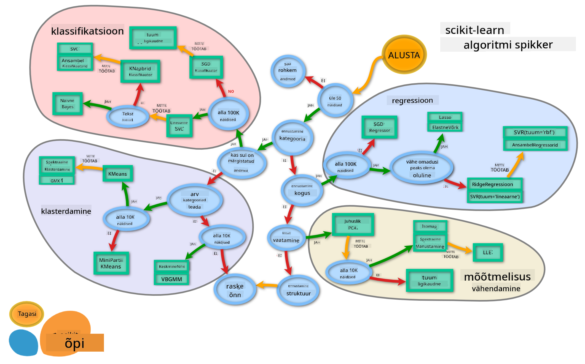

<!--
CO_OP_TRANSLATOR_METADATA:
{
  "original_hash": "49047911108adc49d605cddfb455749c",
  "translation_date": "2025-10-11T11:56:46+00:00",
  "source_file": "4-Classification/3-Classifiers-2/README.md",
  "language_code": "et"
}
-->
# Köögi klassifikaatorid 2

Selles teises klassifikatsiooniõppetunnis uurid rohkem viise, kuidas klassifitseerida numbrilisi andmeid. Samuti õpid, millised on tagajärjed ühe klassifikaatori valimisel teise asemel.

## [Eelloengu viktoriin](https://ff-quizzes.netlify.app/en/ml/)

### Eeldused

Eeldame, et oled läbinud eelnevad õppetunnid ja sul on puhastatud andmestik kaustas `data`, mille nimi on _cleaned_cuisines.csv_ ja mis asub selle nelja õppetunni kausta juurikas.

### Ettevalmistus

Oleme sinu _notebook.ipynb_ faili laadinud puhastatud andmestikuga ja jaganud selle X ja y andmeraamideks, mis on valmis mudeli loomise protsessiks.

## Klassifikatsiooni kaart

Eelnevalt õppisid erinevaid võimalusi andmete klassifitseerimiseks, kasutades Microsofti spikrit. Scikit-learn pakub sarnast, kuid detailsemat spikrit, mis aitab veelgi täpsemalt valida sobivaid hindajaid (teine termin klassifikaatorite kohta):


> Näpunäide: [vaata seda kaarti veebis](https://scikit-learn.org/stable/tutorial/machine_learning_map/) ja klõpsa teekonnal, et lugeda dokumentatsiooni.

### Plaan

See kaart on väga kasulik, kui sul on selge arusaam oma andmetest, kuna saad selle teekonnal liikuda otsuse suunas:

- Meil on >50 näidet
- Tahame ennustada kategooriat
- Meil on märgistatud andmed
- Meil on vähem kui 100K näidet
- ✨ Võime valida Linear SVC
- Kui see ei tööta, kuna meil on numbrilised andmed
    - Võime proovida ✨ KNeighbors Classifier 
      - Kui see ei tööta, proovime ✨ SVC ja ✨ Ensemble Classifiers

See on väga kasulik teekond, mida järgida.

## Harjutus - andmete jagamine

Selle teekonna järgimiseks peaksime alustama vajalike teekide importimisest.

1. Impordi vajalikud teegid:

    ```python
    from sklearn.neighbors import KNeighborsClassifier
    from sklearn.linear_model import LogisticRegression
    from sklearn.svm import SVC
    from sklearn.ensemble import RandomForestClassifier, AdaBoostClassifier
    from sklearn.model_selection import train_test_split, cross_val_score
    from sklearn.metrics import accuracy_score,precision_score,confusion_matrix,classification_report, precision_recall_curve
    import numpy as np
    ```

1. Jaga oma treening- ja testandmed:

    ```python
    X_train, X_test, y_train, y_test = train_test_split(cuisines_feature_df, cuisines_label_df, test_size=0.3)
    ```

## Linear SVC klassifikaator

Support-Vector clustering (SVC) kuulub Support-Vector masinate ML-tehnikate perekonda (loe nende kohta rohkem allpool). Selles meetodis saad valida 'tuuma', et otsustada, kuidas silte grupeerida. Parameeter 'C' viitab 'regulatsioonile', mis reguleerib parameetrite mõju. Tuum võib olla üks [mitmest](https://scikit-learn.org/stable/modules/generated/sklearn.svm.SVC.html#sklearn.svm.SVC); siin määrame selle 'lineaarseks', et kasutada lineaarset SVC-d. Tõenäosus on vaikimisi 'vale'; siin määrame selle 'tõeks', et saada tõenäosuse hinnanguid. Määrame juhusliku oleku '0', et andmeid segada ja saada tõenäosusi.

### Harjutus - rakenda lineaarne SVC

Alusta klassifikaatorite massiivi loomisest. Lisad sellele massiivile järk-järgult, kui testime.

1. Alusta Lineaarse SVC-ga:

    ```python
    C = 10
    # Create different classifiers.
    classifiers = {
        'Linear SVC': SVC(kernel='linear', C=C, probability=True,random_state=0)
    }
    ```

2. Treeni oma mudelit, kasutades Lineaarset SVC-d, ja prindi välja raport:

    ```python
    n_classifiers = len(classifiers)
    
    for index, (name, classifier) in enumerate(classifiers.items()):
        classifier.fit(X_train, np.ravel(y_train))
    
        y_pred = classifier.predict(X_test)
        accuracy = accuracy_score(y_test, y_pred)
        print("Accuracy (train) for %s: %0.1f%% " % (name, accuracy * 100))
        print(classification_report(y_test,y_pred))
    ```

    Tulemus on üsna hea:

    ```output
    Accuracy (train) for Linear SVC: 78.6% 
                  precision    recall  f1-score   support
    
         chinese       0.71      0.67      0.69       242
          indian       0.88      0.86      0.87       234
        japanese       0.79      0.74      0.76       254
          korean       0.85      0.81      0.83       242
            thai       0.71      0.86      0.78       227
    
        accuracy                           0.79      1199
       macro avg       0.79      0.79      0.79      1199
    weighted avg       0.79      0.79      0.79      1199
    ```

## K-Naabrite klassifikaator

K-Naabrid kuuluvad ML-meetodite "naabrite" perekonda, mida saab kasutada nii juhendatud kui juhendamata õppimiseks. Selles meetodis luuakse eelnevalt määratud arv punkte ja andmed kogutakse nende punktide ümber, et üldistatud silte saaks andmetele ennustada.

### Harjutus - rakenda K-Naabrite klassifikaator

Eelmine klassifikaator oli hea ja töötas andmetega hästi, kuid võib-olla saame parema täpsuse. Proovi K-Naabrite klassifikaatorit.

1. Lisa rida oma klassifikaatorite massiivi (lisa koma pärast Lineaarse SVC elementi):

    ```python
    'KNN classifier': KNeighborsClassifier(C),
    ```

    Tulemus on veidi halvem:

    ```output
    Accuracy (train) for KNN classifier: 73.8% 
                  precision    recall  f1-score   support
    
         chinese       0.64      0.67      0.66       242
          indian       0.86      0.78      0.82       234
        japanese       0.66      0.83      0.74       254
          korean       0.94      0.58      0.72       242
            thai       0.71      0.82      0.76       227
    
        accuracy                           0.74      1199
       macro avg       0.76      0.74      0.74      1199
    weighted avg       0.76      0.74      0.74      1199
    ```

    ✅ Loe [K-Naabrite](https://scikit-learn.org/stable/modules/neighbors.html#neighbors) kohta

## Support-Vector klassifikaator

Support-Vector klassifikaatorid kuuluvad [Support-Vector Machine](https://wikipedia.org/wiki/Support-vector_machine) ML-meetodite perekonda, mida kasutatakse klassifikatsiooni ja regressiooni ülesannete jaoks. SVM-id "kaardistavad treeningnäited punktidena ruumis", et maksimeerida kahe kategooria vahelist kaugust. Järgnevad andmed kaardistatakse sellesse ruumi, et nende kategooriat ennustada.

### Harjutus - rakenda Support-Vector klassifikaator

Proovime veidi paremat täpsust Support-Vector klassifikaatoriga.

1. Lisa koma pärast K-Naabrite elementi ja seejärel lisa see rida:

    ```python
    'SVC': SVC(),
    ```

    Tulemus on üsna hea!

    ```output
    Accuracy (train) for SVC: 83.2% 
                  precision    recall  f1-score   support
    
         chinese       0.79      0.74      0.76       242
          indian       0.88      0.90      0.89       234
        japanese       0.87      0.81      0.84       254
          korean       0.91      0.82      0.86       242
            thai       0.74      0.90      0.81       227
    
        accuracy                           0.83      1199
       macro avg       0.84      0.83      0.83      1199
    weighted avg       0.84      0.83      0.83      1199
    ```

    ✅ Loe [Support-Vectors](https://scikit-learn.org/stable/modules/svm.html#svm) kohta

## Ensemble klassifikaatorid

Järgime teekonda lõpuni, kuigi eelmine test oli üsna hea. Proovime mõningaid 'Ensemble klassifikaatoreid', eriti Random Forest ja AdaBoost:

```python
  'RFST': RandomForestClassifier(n_estimators=100),
  'ADA': AdaBoostClassifier(n_estimators=100)
```

Tulemus on väga hea, eriti Random Foresti puhul:

```output
Accuracy (train) for RFST: 84.5% 
              precision    recall  f1-score   support

     chinese       0.80      0.77      0.78       242
      indian       0.89      0.92      0.90       234
    japanese       0.86      0.84      0.85       254
      korean       0.88      0.83      0.85       242
        thai       0.80      0.87      0.83       227

    accuracy                           0.84      1199
   macro avg       0.85      0.85      0.84      1199
weighted avg       0.85      0.84      0.84      1199

Accuracy (train) for ADA: 72.4% 
              precision    recall  f1-score   support

     chinese       0.64      0.49      0.56       242
      indian       0.91      0.83      0.87       234
    japanese       0.68      0.69      0.69       254
      korean       0.73      0.79      0.76       242
        thai       0.67      0.83      0.74       227

    accuracy                           0.72      1199
   macro avg       0.73      0.73      0.72      1199
weighted avg       0.73      0.72      0.72      1199
```

✅ Loe [Ensemble klassifikaatorite](https://scikit-learn.org/stable/modules/ensemble.html) kohta

See masinõppe meetod "ühendab mitme baashindaja ennustused", et parandada mudeli kvaliteeti. Meie näites kasutasime Random Trees ja AdaBoosti. 

- [Random Forest](https://scikit-learn.org/stable/modules/ensemble.html#forest), keskmistamismeetod, ehitab 'otsustuspuude' 'metsa', mis on juhuslikkusega infundeeritud, et vältida üleõppimist. Parameeter n_estimators määratakse puude arvuks.

- [AdaBoost](https://scikit-learn.org/stable/modules/generated/sklearn.ensemble.AdaBoostClassifier.html) sobitab klassifikaatori andmestikuga ja seejärel sobitab selle klassifikaatori koopiaid samale andmestikule. See keskendub valesti klassifitseeritud üksuste kaaludele ja kohandab sobivust järgmise klassifikaatori jaoks, et parandada.

---

## 🚀Väljakutse

Igal neist tehnikatest on suur hulk parameetreid, mida saad kohandada. Uuri igaühe vaikimisi parameetreid ja mõtle, mida nende parameetrite kohandamine tähendaks mudeli kvaliteedi jaoks.

## [Järelloengu viktoriin](https://ff-quizzes.netlify.app/en/ml/)

## Ülevaade ja iseseisev õppimine

Nendes õppetundides on palju erialatermineid, seega võta hetk, et vaadata [seda nimekirja](https://docs.microsoft.com/dotnet/machine-learning/resources/glossary?WT.mc_id=academic-77952-leestott) kasulikest terminidest!

## Ülesanne 

[Parameetrite mäng](assignment.md)

---

**Lahtiütlus**:  
See dokument on tõlgitud, kasutades AI tõlketeenust [Co-op Translator](https://github.com/Azure/co-op-translator). Kuigi püüame tagada täpsust, palun arvestage, et automaatsed tõlked võivad sisaldada vigu või ebatäpsusi. Algne dokument selle algses keeles tuleks lugeda autoriteetseks allikaks. Olulise teabe puhul on soovitatav kasutada professionaalset inimtõlget. Me ei vastuta selle tõlke kasutamisest tulenevate arusaamatuste või valede tõlgenduste eest.