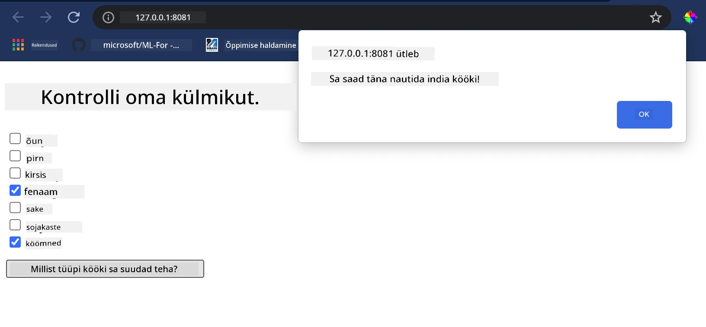

<!--
CO_OP_TRANSLATOR_METADATA:
{
  "original_hash": "61bdec27ed2da8b098cd9065405d9bb0",
  "translation_date": "2025-10-11T11:57:51+00:00",
  "source_file": "4-Classification/4-Applied/README.md",
  "language_code": "et"
}
-->
# Ehita köögi soovitaja veebirakendus

Selles õppetükis ehitad klassifikatsioonimudeli, kasutades mõningaid tehnikaid, mida oled õppinud eelnevates tundides, ja maitsvat köögidatasetit, mida on kasutatud kogu selle sarja jooksul. Lisaks ehitad väikese veebirakenduse, et kasutada salvestatud mudelit, kasutades Onnxi veebiruntime'i.

Masinõppe üks kasulikumaid praktilisi rakendusi on soovitussüsteemide loomine, ja täna saad teha esimese sammu selles suunas!

[](https://youtu.be/17wdM9AHMfg "Rakendatud ML")

> 🎥 Klõpsa ülaloleval pildil, et vaadata videot: Jen Looper ehitab veebirakenduse, kasutades klassifitseeritud köögidatasetit

## [Eeltesti küsimustik](https://ff-quizzes.netlify.app/en/ml/)

Selles õppetükis õpid:

- Kuidas ehitada mudelit ja salvestada see Onnx mudelina
- Kuidas kasutada Netronit mudeli kontrollimiseks
- Kuidas kasutada oma mudelit veebirakenduses järelduste tegemiseks

## Ehita oma mudel

Rakendatud ML-süsteemide ehitamine on oluline osa nende tehnoloogiate kasutamisest ärisüsteemides. Sa saad kasutada mudeleid oma veebirakendustes (ja seega kasutada neid vajadusel ka võrguühenduseta kontekstis), kasutades Onnxi.

[Varasemas õppetükis](../../3-Web-App/1-Web-App/README.md) ehitasid regressioonimudeli UFO vaatlustest, "marineerisid" selle ja kasutasid seda Flaski rakenduses. Kuigi see arhitektuur on väga kasulik, on see täisstack Python rakendus, ja sinu nõuded võivad hõlmata JavaScripti rakenduse kasutamist.

Selles õppetükis saad ehitada lihtsa JavaScript-põhise süsteemi järelduste tegemiseks. Kõigepealt pead aga treenima mudeli ja konverteerima selle Onnxi jaoks.

## Harjutus - treeni klassifikatsioonimudel

Kõigepealt treeni klassifikatsioonimudel, kasutades puhastatud köögidatasetit, mida me kasutasime.

1. Alusta kasulike teekide importimisega:

    ```python
    !pip install skl2onnx
    import pandas as pd 
    ```

   Vajad '[skl2onnx](https://onnx.ai/sklearn-onnx/)', et aidata oma Scikit-learn mudelit Onnx formaati konverteerida.

1. Seejärel töötle oma andmeid samamoodi nagu eelnevates tundides, lugedes CSV-faili `read_csv()` abil:

    ```python
    data = pd.read_csv('../data/cleaned_cuisines.csv')
    data.head()
    ```

1. Eemalda esimesed kaks mittevajalikku veergu ja salvesta ülejäänud andmed kui 'X':

    ```python
    X = data.iloc[:,2:]
    X.head()
    ```

1. Salvesta sildid kui 'y':

    ```python
    y = data[['cuisine']]
    y.head()
    
    ```

### Alusta treeningrutiiini

Kasutame 'SVC' teeki, millel on hea täpsus.

1. Impordi sobivad teegid Scikit-learnist:

    ```python
    from sklearn.model_selection import train_test_split
    from sklearn.svm import SVC
    from sklearn.model_selection import cross_val_score
    from sklearn.metrics import accuracy_score,precision_score,confusion_matrix,classification_report
    ```

1. Eralda treening- ja testkomplektid:

    ```python
    X_train, X_test, y_train, y_test = train_test_split(X,y,test_size=0.3)
    ```

1. Ehita SVC klassifikatsioonimudel nagu tegid eelnevas õppetükis:

    ```python
    model = SVC(kernel='linear', C=10, probability=True,random_state=0)
    model.fit(X_train,y_train.values.ravel())
    ```

1. Nüüd testi oma mudelit, kutsudes `predict()`:

    ```python
    y_pred = model.predict(X_test)
    ```

1. Prindi välja klassifikatsiooniraport, et kontrollida mudeli kvaliteeti:

    ```python
    print(classification_report(y_test,y_pred))
    ```

   Nagu nägime varem, on täpsus hea:

    ```output
                    precision    recall  f1-score   support
    
         chinese       0.72      0.69      0.70       257
          indian       0.91      0.87      0.89       243
        japanese       0.79      0.77      0.78       239
          korean       0.83      0.79      0.81       236
            thai       0.72      0.84      0.78       224
    
        accuracy                           0.79      1199
       macro avg       0.79      0.79      0.79      1199
    weighted avg       0.79      0.79      0.79      1199
    ```

### Konverteeri oma mudel Onnxi formaati

Veendu, et konverteerimine toimub õige tensorarvuga. Selles datasetis on loetletud 380 koostisosa, seega pead märkima selle arvu `FloatTensorType`-is:

1. Konverteeri, kasutades tensorarvuna 380.

    ```python
    from skl2onnx import convert_sklearn
    from skl2onnx.common.data_types import FloatTensorType
    
    initial_type = [('float_input', FloatTensorType([None, 380]))]
    options = {id(model): {'nocl': True, 'zipmap': False}}
    ```

1. Loo onx ja salvesta failina **model.onnx**:

    ```python
    onx = convert_sklearn(model, initial_types=initial_type, options=options)
    with open("./model.onnx", "wb") as f:
        f.write(onx.SerializeToString())
    ```

   > Märkus: Sa saad oma konverteerimisskripti [valikuid](https://onnx.ai/sklearn-onnx/parameterized.html) edastada. Selles näites edastasime 'nocl', et see oleks True, ja 'zipmap', et see oleks False. Kuna tegemist on klassifikatsioonimudeliga, on sul võimalus eemaldada ZipMap, mis toodab loendi sõnastikest (pole vajalik). `nocl` viitab klassiinfo kaasamisele mudelisse. Vähenda oma mudeli suurust, määrates `nocl` väärtuseks 'True'.

Kui käivitad kogu märkmiku, ehitatakse Onnx mudel ja salvestatakse see kausta.

## Vaata oma mudelit

Onnx mudelid ei ole Visual Studio koodis väga nähtavad, kuid on olemas väga hea tasuta tarkvara, mida paljud teadlased kasutavad mudeli visualiseerimiseks, et veenduda selle õiges ehitamises. Laadi alla [Netron](https://github.com/lutzroeder/Netron) ja ava oma model.onnx fail. Näed oma lihtsat mudelit visualiseerituna, koos selle 380 sisendi ja klassifikaatoriga:


Netron on kasulik tööriist mudelite vaatamiseks.

Nüüd oled valmis kasutama seda lahedat mudelit veebirakenduses. Ehita rakendus, mis tuleb kasuks, kui vaatad oma külmkappi ja püüad välja mõelda, millist kombinatsiooni oma ülejäänud koostisosadest saad kasutada, et valmistada mudeli määratud kööki.

## Ehita soovitaja veebirakendus

Sa saad oma mudelit otse veebirakenduses kasutada. See arhitektuur võimaldab seda ka kohapeal ja isegi võrguühenduseta kasutada, kui vaja. Alusta, luues `index.html` faili samasse kausta, kuhu salvestasid oma `model.onnx` faili.

1. Selles failis _index.html_ lisa järgmine märgistus:

    ```html
    <!DOCTYPE html>
    <html>
        <header>
            <title>Cuisine Matcher</title>
        </header>
        <body>
            ...
        </body>
    </html>
    ```

1. Nüüd, töötades `body` tagide sees, lisa veidi märgistust, et näidata koostisosade loendit märkeruutudena:

    ```html
    <h1>Check your refrigerator. What can you create?</h1>
            <div id="wrapper">
                <div class="boxCont">
                    <input type="checkbox" value="4" class="checkbox">
                    <label>apple</label>
                </div>
            
                <div class="boxCont">
                    <input type="checkbox" value="247" class="checkbox">
                    <label>pear</label>
                </div>
            
                <div class="boxCont">
                    <input type="checkbox" value="77" class="checkbox">
                    <label>cherry</label>
                </div>
    
                <div class="boxCont">
                    <input type="checkbox" value="126" class="checkbox">
                    <label>fenugreek</label>
                </div>
    
                <div class="boxCont">
                    <input type="checkbox" value="302" class="checkbox">
                    <label>sake</label>
                </div>
    
                <div class="boxCont">
                    <input type="checkbox" value="327" class="checkbox">
                    <label>soy sauce</label>
                </div>
    
                <div class="boxCont">
                    <input type="checkbox" value="112" class="checkbox">
                    <label>cumin</label>
                </div>
            </div>
            <div style="padding-top:10px">
                <button onClick="startInference()">What kind of cuisine can you make?</button>
            </div> 
    ```

   Pane tähele, et igale märkeruudule on antud väärtus. See kajastab indeksit, kus koostisosa datasetis asub. Näiteks õun, selles tähestikulises loendis, asub viiendas veerus, seega on selle väärtus '4', kuna loendamine algab nullist. Sa saad vaadata [koostisosade tabelit](../../../../4-Classification/data/ingredient_indexes.csv), et leida konkreetse koostisosa indeks.

   Jätkates tööd index.html failis, lisa skriptiplokk, kus mudel kutsutakse pärast viimast sulgemist `</div>`.

1. Kõigepealt impordi [Onnx Runtime](https://www.onnxruntime.ai/):

    ```html
    <script src="https://cdn.jsdelivr.net/npm/onnxruntime-web@1.9.0/dist/ort.min.js"></script> 
    ```

   > Onnx Runtime võimaldab käitada Onnx mudeleid laias valikus riistvaraplatvormidel, sealhulgas optimeerimised ja API kasutamiseks.

1. Kui Runtime on paigas, saad seda kutsuda:

    ```html
    <script>
        const ingredients = Array(380).fill(0);
        
        const checks = [...document.querySelectorAll('.checkbox')];
        
        checks.forEach(check => {
            check.addEventListener('change', function() {
                // toggle the state of the ingredient
                // based on the checkbox's value (1 or 0)
                ingredients[check.value] = check.checked ? 1 : 0;
            });
        });

        function testCheckboxes() {
            // validate if at least one checkbox is checked
            return checks.some(check => check.checked);
        }

        async function startInference() {

            let atLeastOneChecked = testCheckboxes()

            if (!atLeastOneChecked) {
                alert('Please select at least one ingredient.');
                return;
            }
            try {
                // create a new session and load the model.
                
                const session = await ort.InferenceSession.create('./model.onnx');

                const input = new ort.Tensor(new Float32Array(ingredients), [1, 380]);
                const feeds = { float_input: input };

                // feed inputs and run
                const results = await session.run(feeds);

                // read from results
                alert('You can enjoy ' + results.label.data[0] + ' cuisine today!')

            } catch (e) {
                console.log(`failed to inference ONNX model`);
                console.error(e);
            }
        }
               
    </script>
    ```

Selles koodis toimub mitu asja:

1. Lood 380 võimaliku väärtuse (1 või 0) massiivi, mis määratakse ja saadetakse mudelile järelduste tegemiseks, sõltuvalt sellest, kas koostisosa märkeruut on märgitud.
2. Lood märkeruutude massiivi ja viisi, kuidas määrata, kas need on märgitud, funktsioonis `init`, mida kutsutakse rakenduse käivitamisel. Kui märkeruut on märgitud, muudetakse `ingredients` massiivi, et kajastada valitud koostisosa.
3. Lood funktsiooni `testCheckboxes`, mis kontrollib, kas mõni märkeruut on märgitud.
4. Kasutad `startInference` funktsiooni, kui nuppu vajutatakse, ja kui mõni märkeruut on märgitud, alustad järelduste tegemist.
5. Järelduste tegemise rutiin sisaldab:
   1. Mudeli asünkroonse laadimise seadistamist
   2. Tensorstruktuuri loomist, mida mudelile saata
   3. 'feeds' loomist, mis kajastab `float_input` sisendit, mille lõid mudeli treenimisel (sa saad Netronit kasutada selle nime kontrollimiseks)
   4. Nende 'feeds' mudelile saatmist ja vastuse ootamist

## Testi oma rakendust

Ava terminal Visual Studio Code'is kaustas, kus asub sinu index.html fail. Veendu, et sul on [http-server](https://www.npmjs.com/package/http-server) globaalselt installitud, ja kirjuta käsureale `http-server`. Avaneb localhost, kus saad oma veebirakendust vaadata. Kontrolli, millist kööki soovitatakse erinevate koostisosade põhjal:



Palju õnne, oled loonud soovitaja veebirakenduse mõne väljaga. Võta aega, et seda süsteemi edasi arendada!
## 🚀Väljakutse

Sinu veebirakendus on väga minimaalne, seega jätka selle arendamist, kasutades koostisosi ja nende indekseid [ingredient_indexes](../../../../4-Classification/data/ingredient_indexes.csv) andmetest. Millised maitsekooslused sobivad konkreetse rahvusroa loomiseks?

## [Järgneva testi küsimustik](https://ff-quizzes.netlify.app/en/ml/)

## Ülevaade ja iseseisev õppimine

Kuigi see õppetund puudutas vaid toidu koostisosade soovitussüsteemi loomise kasulikkust, on see ML-rakenduste valdkond väga rikas näidete poolest. Loe rohkem, kuidas neid süsteeme ehitatakse:

- https://www.sciencedirect.com/topics/computer-science/recommendation-engine
- https://www.technologyreview.com/2014/08/25/171547/the-ultimate-challenge-for-recommendation-engines/
- https://www.technologyreview.com/2015/03/23/168831/everything-is-a-recommendation/

## Ülesanne

[Ehita uus soovitaja](assignment.md)

---

**Lahtiütlus**:  
See dokument on tõlgitud AI tõlketeenuse [Co-op Translator](https://github.com/Azure/co-op-translator) abil. Kuigi püüame tagada täpsust, palume arvestada, et automaatsed tõlked võivad sisaldada vigu või ebatäpsusi. Algne dokument selle algses keeles tuleks pidada autoriteetseks allikaks. Olulise teabe puhul soovitame kasutada professionaalset inimtõlget. Me ei vastuta selle tõlke kasutamisest tulenevate arusaamatuste või valesti tõlgenduste eest.