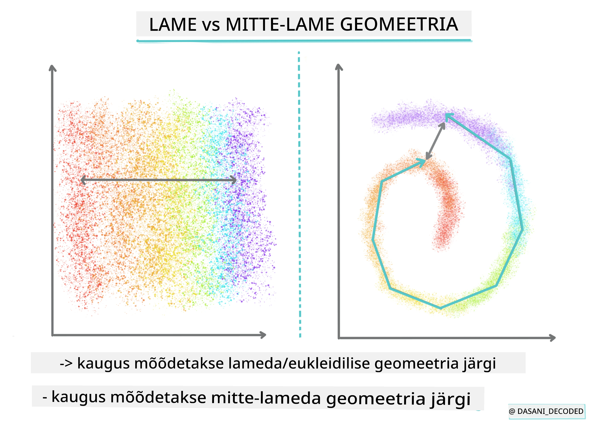
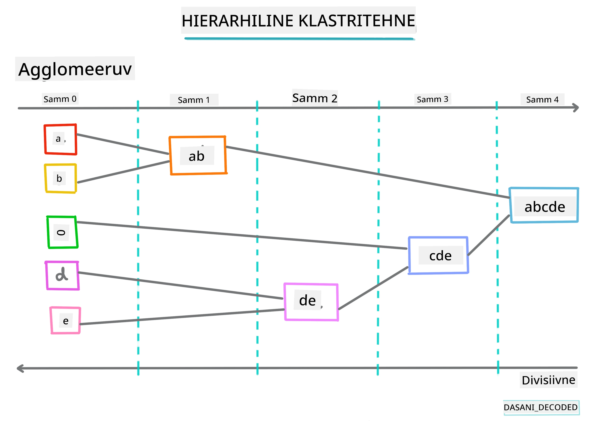
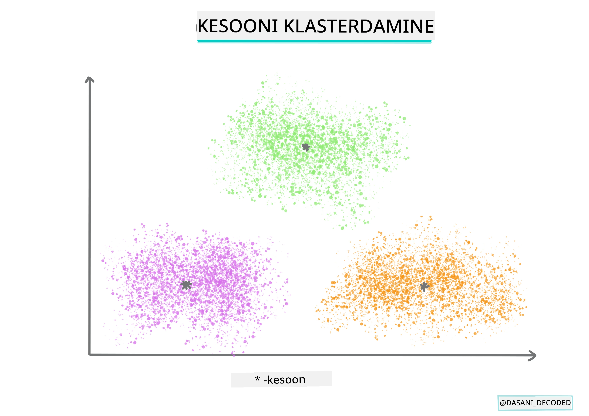
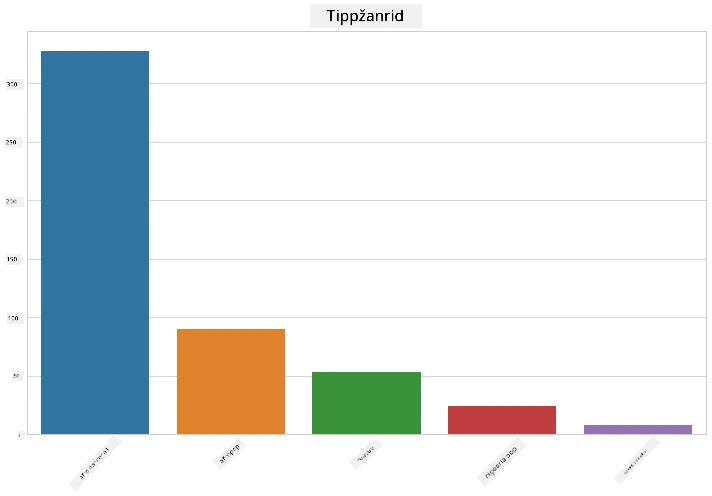
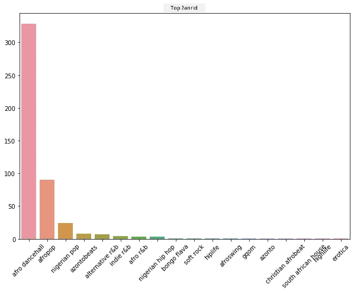
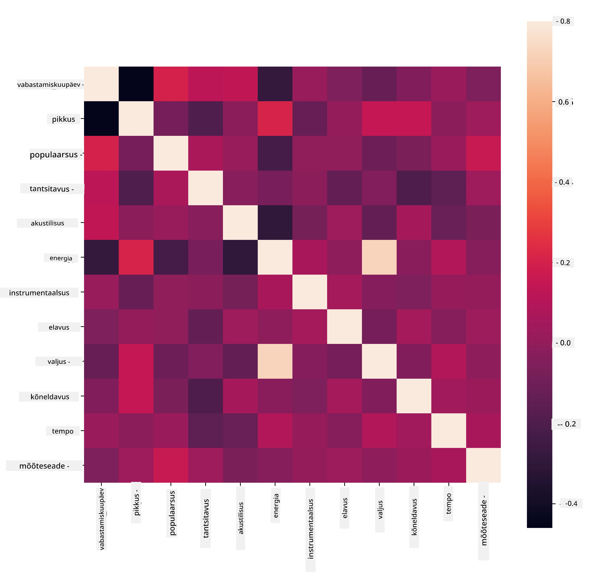
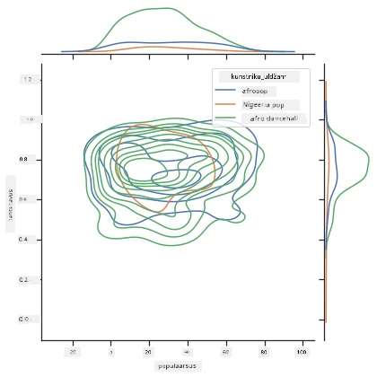
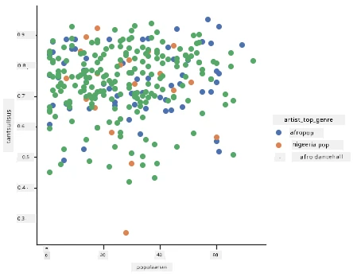

<!--
CO_OP_TRANSLATOR_METADATA:
{
  "original_hash": "730225ea274c9174fe688b21d421539d",
  "translation_date": "2025-10-11T12:06:13+00:00",
  "source_file": "5-Clustering/1-Visualize/README.md",
  "language_code": "et"
}
-->
# Sissejuhatus klasterdamisse

Klasterdamine on [juhendamata õppe](https://wikipedia.org/wiki/Unsupervised_learning) tüüp, mis eeldab, et andmekogum on märgistamata või et selle sisendid ei ole seotud eelnevalt määratletud väljunditega. See kasutab erinevaid algoritme, et sorteerida märgistamata andmeid ja pakkuda rühmitusi vastavalt mustritele, mida ta andmetes tuvastab.

[](https://youtu.be/ty2advRiWJM "No One Like You by PSquare")

> 🎥 Klõpsa ülaloleval pildil, et vaadata videot. Kui õpid masinõpet klasterdamise abil, naudi samal ajal mõnda Nigeeria tantsumuusika pala – see on kõrgelt hinnatud laul aastast 2014 PSquare'ilt.

## [Loengu-eelne viktoriin](https://ff-quizzes.netlify.app/en/ml/)

### Sissejuhatus

[Klasterdamine](https://link.springer.com/referenceworkentry/10.1007%2F978-0-387-30164-8_124) on väga kasulik andmete uurimiseks. Vaatame, kas see aitab avastada trende ja mustreid Nigeeria publikute muusikatarbimise viisides.

✅ Võta hetk, et mõelda klasterdamise kasutusvõimalustele. Päriselus toimub klasterdamine näiteks siis, kui sul on hunnik pesu ja pead sorteerima oma pereliikmete riideid 🧦👕👖🩲. Andmeteaduses toimub klasterdamine, kui üritatakse analüüsida kasutaja eelistusi või määrata mis tahes märgistamata andmekogumi omadusi. Klasterdamine aitab teatud mõttes kaosest aru saada, nagu sokisahtli korrastamine.

[](https://youtu.be/esmzYhuFnds "Sissejuhatus klasterdamisse")

> 🎥 Klõpsa ülaloleval pildil, et vaadata videot: MIT-i John Guttag tutvustab klasterdamist.

Professionaalses keskkonnas saab klasterdamist kasutada näiteks turusegmentide määramiseks, et teada saada, millised vanuserühmad ostavad milliseid tooteid. Teine kasutusviis oleks anomaaliate tuvastamine, näiteks pettuste avastamiseks krediitkaarditehingute andmekogumist. Või võid kasutada klasterdamist kasvajate tuvastamiseks meditsiiniliste skaneeringute partiist.

✅ Mõtle hetkeks, kuidas oled võib-olla kohanud klasterdamist "päriselus", näiteks panganduses, e-kaubanduses või ärikeskkonnas.

> 🎓 Huvitaval kombel pärineb klasteranalüüs antropoloogia ja psühholoogia valdkondadest 1930ndatel. Kas oskad ette kujutada, kuidas seda võidi kasutada?

Teise võimalusena võiks seda kasutada otsingutulemuste rühmitamiseks – näiteks ostulinkide, piltide või arvustuste järgi. Klasterdamine on kasulik, kui sul on suur andmekogum, mida soovid vähendada ja millele soovid teha täpsemat analüüsi, seega saab seda tehnikat kasutada andmete tundmaõppimiseks enne teiste mudelite loomist.

✅ Kui su andmed on klastritesse organiseeritud, määrad neile klastri ID, ja see tehnika võib olla kasulik andmekogumi privaatsuse säilitamisel; võid viidata andmepunktile selle klastri ID järgi, mitte paljastavamate identifitseeritavate andmete järgi. Kas oskad mõelda teistele põhjustele, miks viidata klastri ID-le, mitte klastri teistele elementidele?

Süvene klasterdamistehnikate mõistmisse selles [õppemoodulis](https://docs.microsoft.com/learn/modules/train-evaluate-cluster-models?WT.mc_id=academic-77952-leestott).

## Klasterdamise alustamine

[Scikit-learn pakub laia valikut](https://scikit-learn.org/stable/modules/clustering.html) meetodeid klasterdamise teostamiseks. Valik sõltub sinu kasutusjuhtumist. Dokumentatsiooni järgi on igal meetodil erinevad eelised. Siin on lihtsustatud tabel Scikit-learn'i toetatud meetoditest ja nende sobivatest kasutusjuhtudest:

| Meetodi nimi                 | Kasutusjuhtum                                                          |
| :--------------------------- | :--------------------------------------------------------------------- |
| K-Means                      | üldotstarbeline, induktiivne                                           |
| Affinity propagation         | palju, ebaühtlased klastrid, induktiivne                               |
| Mean-shift                   | palju, ebaühtlased klastrid, induktiivne                               |
| Spectral clustering          | vähe, ühtlased klastrid, transduktsioon                                |
| Ward hierarchical clustering | palju, piiratud klastrid, transduktsioon                               |
| Agglomerative clustering     | palju, piiratud, mitte-eukleidilised kaugused, transduktsioon          |
| DBSCAN                       | mitte-lame geomeetria, ebaühtlased klastrid, transduktsioon            |
| OPTICS                       | mitte-lame geomeetria, ebaühtlased klastrid muutuva tihedusega, transduktsioon |
| Gaussian mixtures            | lame geomeetria, induktiivne                                           |
| BIRCH                        | suur andmekogum koos kõrvalekalletega, induktiivne                     |

> 🎓 Kuidas me loome klastreid, sõltub suuresti sellest, kuidas me kogume andmepunkte rühmadesse. Vaatame mõningaid termineid:
>
> 🎓 ['Transduktsioon' vs. 'induktsioon'](https://wikipedia.org/wiki/Transduction_(machine_learning))
> 
> Transduktsiooniline järeldamine tuleneb täheldatud treeningjuhtudest, mis kaarduvad konkreetsetele testjuhtudele. Induktsiooniline järeldamine tuleneb treeningjuhtudest, mis kaarduvad üldistele reeglitele, mida rakendatakse alles seejärel testjuhtudele.
> 
> Näide: Kujuta ette, et sul on osaliselt märgistatud andmekogum. Mõned asjad on "plaadid", mõned "CD-d" ja mõned on tühjad. Sinu ülesanne on anda tühjadele märgised. Kui valid induktiivse lähenemise, treenid mudelit otsides "plaate" ja "CD-sid" ning rakendad neid märgiseid märgistamata andmetele. See lähenemine võib raskustes olla asjade klassifitseerimisega, mis tegelikult on "kassettid". Transduktsiooniline lähenemine, teiselt poolt, käsitleb seda tundmatut andmestikku tõhusamalt, kuna see töötab sarnaste objektide rühmitamisega ja rakendab seejärel rühmale märgise. Sel juhul võivad klastrid kajastada "ümmargusi muusikaasju" ja "ruudukujulisi muusikaasju".
> 
> 🎓 ['Mitte-lame' vs. 'lame' geomeetria](https://datascience.stackexchange.com/questions/52260/terminology-flat-geometry-in-the-context-of-clustering)
> 
> Matemaatilisest terminoloogiast tuletatud mitte-lame vs. lame geomeetria viitab punktidevaheliste kauguste mõõtmisele kas "lame" ([eukleidiline](https://wikipedia.org/wiki/Euclidean_geometry)) või "mitte-lame" (mitte-eukleidiline) geomeetriliste meetoditega.
>
>'Lame' selles kontekstis viitab eukleidilisele geomeetriale (mida osaliselt õpetatakse "tasapinna" geomeetria nime all) ja mitte-lame viitab mitte-eukleidilisele geomeetriale. Mis on geomeetria seos masinõppega? Noh, kuna mõlemad valdkonnad põhinevad matemaatikal, peab olema ühine viis punktidevaheliste kauguste mõõtmiseks klastrites, ja seda saab teha "lame" või "mitte-lame" viisil, sõltuvalt andmete olemusest. [Eukleidilised kaugused](https://wikipedia.org/wiki/Euclidean_distance) mõõdetakse sirgjoone pikkusena kahe punkti vahel. [Mitte-eukleidilised kaugused](https://wikipedia.org/wiki/Non-Euclidean_geometry) mõõdetakse mööda kõverat. Kui su andmed, visualiseerituna, ei tundu eksisteerivat tasapinnal, võib vaja minna spetsiaalset algoritmi nende käsitlemiseks.
>

> Infograafik: [Dasani Madipalli](https://twitter.com/dasani_decoded)
> 
> 🎓 ['Kaugused'](https://web.stanford.edu/class/cs345a/slides/12-clustering.pdf)
> 
> Klastrid määratletakse nende kaugusmaatriksi järgi, st punktidevaheliste kauguste järgi. Seda kaugust saab mõõta mitmel viisil. Eukleidilised klastrid määratletakse punktiväärtuste keskmise järgi ja sisaldavad "tsentroidi" ehk keskpunkti. Kaugused mõõdetakse seega kaugusena tsentroidist. Mitte-eukleidilised kaugused viitavad "klustroididele", punktile, mis on kõige lähemal teistele punktidele. Klustroidid omakorda võivad olla määratletud mitmel viisil.
> 
> 🎓 ['Piiratud'](https://wikipedia.org/wiki/Constrained_clustering)
> 
> [Piiratud klasterdamine](https://web.cs.ucdavis.edu/~davidson/Publications/ICDMTutorial.pdf) toob "pooljuhendatud" õppe sisse sellesse juhendamata meetodisse. Punktidevahelised suhted märgitakse "ei saa linkida" või "peab linkima", nii et andmekogumile kehtestatakse mõned reeglid.
>
>Näide: Kui algoritm lastakse vabaks märgistamata või poolmärgistatud andmetel, võivad klastrid, mida see toodab, olla kehva kvaliteediga. Ülaltoodud näites võivad klastrid rühmitada "ümmargused muusikaasjad", "ruudukujulised muusikaasjad", "kolmnurksed asjad" ja "küpsised". Kui antakse mõned piirangud või reeglid, mida järgida ("ese peab olema valmistatud plastikust", "ese peab suutma muusikat toota"), võib see aidata algoritmil teha paremaid valikuid.
> 
> 🎓 'Tihedus'
> 
> Andmeid, mis on "mürarikkad", peetakse "tihedaks". Punktidevahelised kaugused igas selle klastris võivad osutuda, uurimisel, rohkem või vähem tihedaks ehk "rahvarohkeks", ja seega tuleb seda andmestikku analüüsida sobiva klasterdamismeetodiga. [See artikkel](https://www.kdnuggets.com/2020/02/understanding-density-based-clustering.html) näitab erinevust K-Means klasterdamise ja HDBSCAN algoritmide kasutamise vahel mürarikka andmestiku uurimiseks, mille klastrite tihedus on ebaühtlane.

## Klasterdamise algoritmid

Klasterdamise algoritme on üle 100, ja nende kasutamine sõltub käsitletavate andmete olemusest. Arutame mõningaid peamisi:

- **Hierarhiline klasterdamine**. Kui objekt klassifitseeritakse selle läheduse järgi lähedalasuvale objektile, mitte kaugemal olevale, moodustuvad klastrid nende liikmete kauguse järgi teistest objektidest. Scikit-learn'i aglomereeriv klasterdamine on hierarhiline.

   
   > Infograafik: [Dasani Madipalli](https://twitter.com/dasani_decoded)

- **Tsentroidi klasterdamine**. See populaarne algoritm nõuab "k" ehk moodustatavate klastrite arvu valimist, mille järel algoritm määrab klastri keskpunkti ja kogub andmeid selle punkti ümber. [K-means klasterdamine](https://wikipedia.org/wiki/K-means_clustering) on populaarne tsentroidi klasterdamise versioon. Keskpunkt määratakse lähima keskmise järgi, seega nimi. Klastri ruutkaugus minimeeritakse.

   
   > Infograafik: [Dasani Madipalli](https://twitter.com/dasani_decoded)

- **Jaotuspõhine klasterdamine**. Statistilisel modelleerimisel põhinev jaotuspõhine klasterdamine keskendub tõenäosuse määramisele, et andmepunkt kuulub klastri juurde, ja määrab selle vastavalt. Gaussi segameetodid kuuluvad sellesse tüüpi.

- **Tiheduspõhine klasterdamine**. Andmepunktid määratakse klastritesse nende tiheduse järgi ehk nende rühmitamise järgi üksteise ümber. Kaugemal rühmast olevad andmepunktid loetakse kõrvalekalleteks või müraks. DBSCAN, Mean-shift ja OPTICS kuuluvad sellesse klasterdamise tüüpi.

- **Võrgupõhine klasterdamine**. Mitmemõõtmeliste andmekogumite jaoks luuakse võrk ja andmed jaotatakse võrgu lahtrite vahel, luues seeläbi klastreid.

## Harjutus – klasterda oma andmed

Klasterdamine kui tehnika on suuresti abiks korraliku visualiseerimisega, seega alustame oma muusikaandmete visualiseerimisest. See harjutus aitab meil otsustada, millist klasterdamismeetodit kõige tõhusamalt kasutada nende andmete olemuse jaoks.

1. Ava [_notebook.ipynb_](https://github.com/microsoft/ML-For-Beginners/blob/main/5-Clustering/1-Visualize/notebook.ipynb) fail selles kaustas.

1. Impordi `Seaborn` pakett heaks andmete visualiseerimiseks.

    ```python
    !pip install seaborn
    ```

1. Lisa laulude andmed failist [_nigerian-songs.csv_](https://github.com/microsoft/ML-For-Beginners/blob/main/5-Clustering/data/nigerian-songs.csv). Laadi andmeraam andmetega laulude kohta. Valmista ette nende andmete uurimine, importides teegid ja kuvades andmed:

    ```python
    import matplotlib.pyplot as plt
    import pandas as pd
    
    df = pd.read_csv("../data/nigerian-songs.csv")
    df.head()
    ```

    Vaata andmete esimesi ridu:

    |     | nimi                     | album                        | artist              | artist_top_genre | release_date | pikkus | populaarsus | tantsitavus | akustilisus | energia | instrumentaalsus | elavus | valjus | kõnelevus | tempo   | taktimõõt |
    | --- | ------------------------ | ---------------------------- | ------------------- | ---------------- | ------------ | ------ | ---------- | ------------ | ------------ | ------ | ---------------- | -------- | -------- | ----------- | ------- | -------------- |
    | 0   | Sparky                   | Mandy & The Jungle           | Cruel Santino       | alternative r&b  | 2019         | 144000 | 48         | 0.666        | 0.851        | 0.42   | 0.534            | 0.11     | -6.699   | 0.0829      | 133.015 | 5              |
    | 1   | shuga rush               | EVERYTHING YOU HEARD IS TRUE | Odunsi (The Engine) | afropop          | 2020         | 89488  | 30         | 0.71         | 0.0822       | 0.683  | 0.000169         | 0.101    | -5.64    | 0.36        | 129.993 | 3              |
| 2   | LITT!                    | LITT!                        | AYLØ                | indie r&b        | 2018         | 207758 | 40         | 0.836        | 0.272        | 0.564  | 0.000537         | 0.11     | -7.127   | 0.0424      | 130.005 | 4              |
| 3   | Confident / Feeling Cool | Enjoy Your Life              | Lady Donli          | nigerian pop     | 2019         | 175135 | 14         | 0.894        | 0.798        | 0.611  | 0.000187         | 0.0964   | -4.961   | 0.113       | 111.087 | 4              |
| 4   | wanted you               | rare.                        | Odunsi (The Engine) | afropop          | 2018         | 152049 | 25         | 0.702        | 0.116        | 0.833  | 0.91             | 0.348    | -6.044   | 0.0447      | 105.115 | 4              |

1. Küsige andmeid tabeli kohta, kutsudes `info()`:

    ```python
    df.info()
    ```

   Väljund näeb välja selline:

    ```output
    <class 'pandas.core.frame.DataFrame'>
    RangeIndex: 530 entries, 0 to 529
    Data columns (total 16 columns):
     #   Column            Non-Null Count  Dtype  
    ---  ------            --------------  -----  
     0   name              530 non-null    object 
     1   album             530 non-null    object 
     2   artist            530 non-null    object 
     3   artist_top_genre  530 non-null    object 
     4   release_date      530 non-null    int64  
     5   length            530 non-null    int64  
     6   popularity        530 non-null    int64  
     7   danceability      530 non-null    float64
     8   acousticness      530 non-null    float64
     9   energy            530 non-null    float64
     10  instrumentalness  530 non-null    float64
     11  liveness          530 non-null    float64
     12  loudness          530 non-null    float64
     13  speechiness       530 non-null    float64
     14  tempo             530 non-null    float64
     15  time_signature    530 non-null    int64  
    dtypes: float64(8), int64(4), object(4)
    memory usage: 66.4+ KB
    ```

1. Kontrollige nullväärtusi, kutsudes `isnull()` ja veendudes, et summa on 0:

    ```python
    df.isnull().sum()
    ```

    Kõik tundub korras:

    ```output
    name                0
    album               0
    artist              0
    artist_top_genre    0
    release_date        0
    length              0
    popularity          0
    danceability        0
    acousticness        0
    energy              0
    instrumentalness    0
    liveness            0
    loudness            0
    speechiness         0
    tempo               0
    time_signature      0
    dtype: int64
    ```

1. Kirjeldage andmeid:

    ```python
    df.describe()
    ```

    |       | release_date | length      | popularity | danceability | acousticness | energy   | instrumentalness | liveness | loudness  | speechiness | tempo      | time_signature |
    | ----- | ------------ | ----------- | ---------- | ------------ | ------------ | -------- | ---------------- | -------- | --------- | ----------- | ---------- | -------------- |
    | count | 530          | 530         | 530        | 530          | 530          | 530      | 530              | 530      | 530       | 530         | 530        | 530            |
    | mean  | 2015.390566  | 222298.1698 | 17.507547  | 0.741619     | 0.265412     | 0.760623 | 0.016305         | 0.147308 | -4.953011 | 0.130748    | 116.487864 | 3.986792       |
    | std   | 3.131688     | 39696.82226 | 18.992212  | 0.117522     | 0.208342     | 0.148533 | 0.090321         | 0.123588 | 2.464186  | 0.092939    | 23.518601  | 0.333701       |
    | min   | 1998         | 89488       | 0          | 0.255        | 0.000665     | 0.111    | 0                | 0.0283   | -19.362   | 0.0278      | 61.695     | 3              |
    | 25%   | 2014         | 199305      | 0          | 0.681        | 0.089525     | 0.669    | 0                | 0.07565  | -6.29875  | 0.0591      | 102.96125  | 4              |
    | 50%   | 2016         | 218509      | 13         | 0.761        | 0.2205       | 0.7845   | 0.000004         | 0.1035   | -4.5585   | 0.09795     | 112.7145   | 4              |
    | 75%   | 2017         | 242098.5    | 31         | 0.8295       | 0.403        | 0.87575  | 0.000234         | 0.164    | -3.331    | 0.177       | 125.03925  | 4              |
    | max   | 2020         | 511738      | 73         | 0.966        | 0.954        | 0.995    | 0.91             | 0.811    | 0.582     | 0.514       | 206.007    | 5              |

> 🤔 Kui me töötame klasterdamisega, mis on juhendamata meetod ja ei vaja märgistatud andmeid, siis miks me näitame neid andmeid koos siltidega? Andmete uurimise faasis on need kasulikud, kuid klasterdamise algoritmid ei vaja neid töötamiseks. Võiksite sama hästi eemaldada veerupäised ja viidata andmetele veeru numbri järgi.

Vaadake andmete üldisi väärtusi. Pange tähele, et populaarsus võib olla '0', mis näitab laule, millel pole reitingut. Eemaldame need peagi.

1. Kasutage tulpdiagrammi, et teada saada populaarseimad žanrid:

    ```python
    import seaborn as sns
    
    top = df['artist_top_genre'].value_counts()
    plt.figure(figsize=(10,7))
    sns.barplot(x=top[:5].index,y=top[:5].values)
    plt.xticks(rotation=45)
    plt.title('Top genres',color = 'blue')
    ```

    

✅ Kui soovite näha rohkem tipptulemusi, muutke top `[:5]` suuremaks väärtuseks või eemaldage see, et näha kõiki.

Pange tähele, et kui populaarseim žanr on kirjeldatud kui 'Puudub', tähendab see, et Spotify ei klassifitseerinud seda, seega eemaldame selle.

1. Eemaldage puuduvad andmed, filtreerides need välja

    ```python
    df = df[df['artist_top_genre'] != 'Missing']
    top = df['artist_top_genre'].value_counts()
    plt.figure(figsize=(10,7))
    sns.barplot(x=top.index,y=top.values)
    plt.xticks(rotation=45)
    plt.title('Top genres',color = 'blue')
    ```

    Nüüd kontrollige žanre uuesti:

    

1. Kolm populaarseimat žanrit domineerivad selgelt selles andmestikus. Keskendume `afro dancehall`, `afropop` ja `nigerian pop` žanritele ning lisaks filtreerime andmestiku, et eemaldada kõik, mille populaarsusväärtus on 0 (mis tähendab, et neid ei klassifitseeritud populaarsuse järgi ja neid võib meie eesmärkidel pidada müra).

    ```python
    df = df[(df['artist_top_genre'] == 'afro dancehall') | (df['artist_top_genre'] == 'afropop') | (df['artist_top_genre'] == 'nigerian pop')]
    df = df[(df['popularity'] > 0)]
    top = df['artist_top_genre'].value_counts()
    plt.figure(figsize=(10,7))
    sns.barplot(x=top.index,y=top.values)
    plt.xticks(rotation=45)
    plt.title('Top genres',color = 'blue')
    ```

1. Tehke kiire test, et näha, kas andmed korreleeruvad mingil eriti tugeval viisil:

    ```python
    corrmat = df.corr(numeric_only=True)
    f, ax = plt.subplots(figsize=(12, 9))
    sns.heatmap(corrmat, vmax=.8, square=True)
    ```

    

    Ainus tugev korrelatsioon on `energy` ja `loudness` vahel, mis pole üllatav, arvestades, et valju muusika on tavaliselt üsna energiline. Muud korrelatsioonid on suhteliselt nõrgad. Huvitav on näha, mida klasterdamise algoritm nende andmetega teha suudab.

    > 🎓 Pange tähele, et korrelatsioon ei tähenda põhjuslikkust! Meil on tõendid korrelatsiooni kohta, kuid mitte põhjuslikkuse kohta. [Lõbus veebisait](https://tylervigen.com/spurious-correlations) pakub visuaale, mis rõhutavad seda punkti.

Kas selles andmestikus on mingit lähenemist laulu tajutava populaarsuse ja tantsitavuse ümber? FacetGrid näitab, et olenemata žanrist on kontsentrilised ringid, mis joondavad end. Kas võib olla, et nigeerlaste maitsed koonduvad teatud tantsitavuse tasemele selles žanris?

✅ Proovige erinevaid andmepunkte (energia, valjus, kõnelemine) ja rohkem või erinevaid muusikažanre. Mida saate avastada? Vaadake `df.describe()` tabelit, et näha andmepunktide üldist jaotust.

### Harjutus - andmete jaotus

Kas need kolm žanrit erinevad oluliselt tantsitavuse tajumises, lähtudes nende populaarsusest?

1. Uurige meie kolme populaarseima žanri andmete jaotust populaarsuse ja tantsitavuse osas antud x- ja y-teljel.

    ```python
    sns.set_theme(style="ticks")
    
    g = sns.jointplot(
        data=df,
        x="popularity", y="danceability", hue="artist_top_genre",
        kind="kde",
    )
    ```

    Võite avastada kontsentrilisi ringe üldise lähenemispunkti ümber, mis näitab punktide jaotust.

    > 🎓 Pange tähele, et see näide kasutab KDE (Kernel Density Estimate) graafikut, mis esindab andmeid pideva tõenäosuse tiheduse kõveraga. See võimaldab meil andmeid tõlgendada, kui töötame mitme jaotusega.

    Üldiselt on kolm žanrit populaarsuse ja tantsitavuse osas lahtiselt joondatud. Klasterdamise määramine selles lahtiselt joondatud andmetes on väljakutse:

    

1. Looge hajuvusdiagramm:

    ```python
    sns.FacetGrid(df, hue="artist_top_genre", height=5) \
       .map(plt.scatter, "popularity", "danceability") \
       .add_legend()
    ```

    Sama telgede hajuvusdiagramm näitab sarnast lähenemismustrit

    

Üldiselt saate klasterdamiseks kasutada hajuvusdiagramme, et näidata andmeklastrite jaotust, seega on selle visualiseerimise tüübi valdamine väga kasulik. Järgmises õppetunnis võtame need filtreeritud andmed ja kasutame k-means klasterdamist, et avastada selles andmestikus rühmi, mis kattuvad huvitavatel viisidel.

---

## 🚀Väljakutse

Valmistudes järgmiseks õppetunniks, koostage diagramm erinevate klasterdamise algoritmide kohta, mida võite avastada ja kasutada tootmiskeskkonnas. Milliseid probleeme klasterdamine püüab lahendada?

## [Loengu järgne viktoriin](https://ff-quizzes.netlify.app/en/ml/)

## Ülevaade ja iseseisev õppimine

Enne klasterdamise algoritmide rakendamist, nagu oleme õppinud, on hea mõte mõista oma andmestiku olemust. Lugege selle teema kohta rohkem [siit](https://www.kdnuggets.com/2019/10/right-clustering-algorithm.html)

[See kasulik artikkel](https://www.freecodecamp.org/news/8-clustering-algorithms-in-machine-learning-that-all-data-scientists-should-know/) juhendab teid erinevate klasterdamise algoritmide käitumise kaudu, arvestades erinevaid andmekujusid.

## Ülesanne

[Uurige teisi klasterdamise visualiseerimisi](assignment.md)

---

**Lahtiütlus**:  
See dokument on tõlgitud AI tõlketeenuse [Co-op Translator](https://github.com/Azure/co-op-translator) abil. Kuigi püüame tagada täpsust, palume arvestada, et automaatsed tõlked võivad sisaldada vigu või ebatäpsusi. Algne dokument selle algses keeles tuleks pidada autoriteetseks allikaks. Olulise teabe puhul soovitame kasutada professionaalset inimtõlget. Me ei vastuta selle tõlke kasutamisest tulenevate arusaamatuste või valesti tõlgenduste eest.