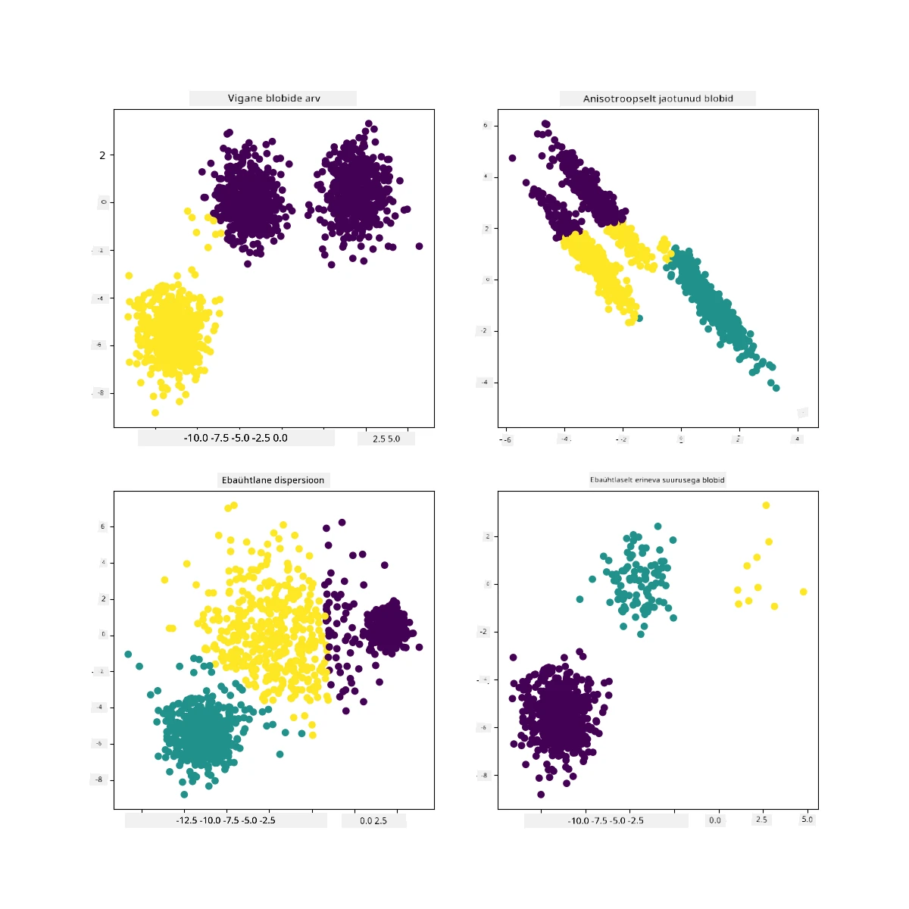

<!--
CO_OP_TRANSLATOR_METADATA:
{
  "original_hash": "7cdd17338d9bbd7e2171c2cd462eb081",
  "translation_date": "2025-10-11T12:08:02+00:00",
  "source_file": "5-Clustering/2-K-Means/README.md",
  "language_code": "et"
}
-->
# K-Means klasterdamine

## [Eelloengu viktoriin](https://ff-quizzes.netlify.app/en/ml/)

Selles õppetükis õpid, kuidas luua klastreid, kasutades Scikit-learn'i ja varem imporditud Nigeeria muusika andmestikku. Käsitleme K-Meansi klasterdamise põhitõdesid. Pea meeles, et nagu eelnevas õppetükis õppisid, on klastritega töötamiseks palju erinevaid meetodeid ja valik sõltub sinu andmetest. Proovime K-Meansi, kuna see on kõige levinum klasterdamise tehnika. Alustame!

Mõisted, mida õpid:

- Silueti skoor
- Küünarnuki meetod
- Inerts
- Variants

## Sissejuhatus

[K-Meansi klasterdamine](https://wikipedia.org/wiki/K-means_clustering) on meetod, mis pärineb signaalitöötluse valdkonnast. Seda kasutatakse andmete jagamiseks ja rühmitamiseks 'k' klastritesse, kasutades vaatluste seeriat. Iga vaatlus töötab selle nimel, et rühmitada antud andmepunkt lähima 'keskmise' ehk klastri keskpunkti juurde.

Klastreid saab visualiseerida kui [Voronoi diagramme](https://wikipedia.org/wiki/Voronoi_diagram), mis sisaldavad punkti (või 'seemet') ja selle vastavat piirkonda.


> infograafik autorilt [Jen Looper](https://twitter.com/jenlooper)

K-Meansi klasterdamise protsess [toimub kolmes etapis](https://scikit-learn.org/stable/modules/clustering.html#k-means):

1. Algoritm valib k-arvu keskpunktid, võttes proove andmestikust. Seejärel kordab:
    1. Määrab iga proovi lähima centroidi juurde.
    2. Loob uued centroidid, arvutades kõigi eelmiste centroidide juurde määratud proovide keskmise väärtuse.
    3. Arvutab uute ja vanade centroidide erinevuse ning kordab, kuni centroidid stabiliseeruvad.

Üks K-Meansi kasutamise puudus on see, et pead määrama 'k', ehk centroidide arvu. Õnneks aitab 'küünarnuki meetod' hinnata head algväärtust 'k' jaoks. Proovime seda kohe.

## Eeltingimus

Töötad selle õppetüki [_notebook.ipynb_](https://github.com/microsoft/ML-For-Beginners/blob/main/5-Clustering/2-K-Means/notebook.ipynb) failis, mis sisaldab andmete importimist ja esmast puhastamist, mida tegid eelmises õppetükis.

## Harjutus - ettevalmistus

Alusta, vaadates uuesti laulude andmeid.

1. Loo kastdiagramm, kutsudes `boxplot()` iga veeru jaoks:

    ```python
    plt.figure(figsize=(20,20), dpi=200)
    
    plt.subplot(4,3,1)
    sns.boxplot(x = 'popularity', data = df)
    
    plt.subplot(4,3,2)
    sns.boxplot(x = 'acousticness', data = df)
    
    plt.subplot(4,3,3)
    sns.boxplot(x = 'energy', data = df)
    
    plt.subplot(4,3,4)
    sns.boxplot(x = 'instrumentalness', data = df)
    
    plt.subplot(4,3,5)
    sns.boxplot(x = 'liveness', data = df)
    
    plt.subplot(4,3,6)
    sns.boxplot(x = 'loudness', data = df)
    
    plt.subplot(4,3,7)
    sns.boxplot(x = 'speechiness', data = df)
    
    plt.subplot(4,3,8)
    sns.boxplot(x = 'tempo', data = df)
    
    plt.subplot(4,3,9)
    sns.boxplot(x = 'time_signature', data = df)
    
    plt.subplot(4,3,10)
    sns.boxplot(x = 'danceability', data = df)
    
    plt.subplot(4,3,11)
    sns.boxplot(x = 'length', data = df)
    
    plt.subplot(4,3,12)
    sns.boxplot(x = 'release_date', data = df)
    ```

    Need andmed on veidi müra täis: iga veeru kastdiagrammi vaadates näed kõrvalekaldeid.

    

Sa võiksid andmestiku läbi käia ja need kõrvalekalded eemaldada, kuid see muudaks andmed üsna minimaalseks.

1. Praegu vali, milliseid veerge kasutad klasterdamise harjutuseks. Vali need, millel on sarnased vahemikud, ja kodeeri veerg `artist_top_genre` numbrilisteks andmeteks:

    ```python
    from sklearn.preprocessing import LabelEncoder
    le = LabelEncoder()
    
    X = df.loc[:, ('artist_top_genre','popularity','danceability','acousticness','loudness','energy')]
    
    y = df['artist_top_genre']
    
    X['artist_top_genre'] = le.fit_transform(X['artist_top_genre'])
    
    y = le.transform(y)
    ```

1. Nüüd pead valima, kui palju klastreid sihtida. Tead, et andmestikust eraldasime 3 laulude žanrit, seega proovime 3:

    ```python
    from sklearn.cluster import KMeans
    
    nclusters = 3 
    seed = 0
    
    km = KMeans(n_clusters=nclusters, random_state=seed)
    km.fit(X)
    
    # Predict the cluster for each data point
    
    y_cluster_kmeans = km.predict(X)
    y_cluster_kmeans
    ```

Näed välja prinditud massiivi, kus iga andmeraami rea jaoks on ennustatud klaster (0, 1 või 2).

1. Kasuta seda massiivi, et arvutada 'silueti skoor':

    ```python
    from sklearn import metrics
    score = metrics.silhouette_score(X, y_cluster_kmeans)
    score
    ```

## Silueti skoor

Otsi silueti skoori, mis on lähemal 1-le. See skoor varieerub -1-st 1-ni, ja kui skoor on 1, on klaster tihe ja hästi eraldatud teistest klastritest. Väärtus, mis on lähedal 0-le, tähistab kattuvaid klastreid, kus proovid on väga lähedal naaberklastrite otsustuspiirile. [(Allikas)](https://dzone.com/articles/kmeans-silhouette-score-explained-with-python-exam)

Meie skoor on **.53**, seega keskmine. See näitab, et meie andmed ei sobi eriti hästi selliseks klasterdamiseks, kuid jätkame.

### Harjutus - mudeli loomine

1. Impordi `KMeans` ja alusta klasterdamise protsessi.

    ```python
    from sklearn.cluster import KMeans
    wcss = []
    
    for i in range(1, 11):
        kmeans = KMeans(n_clusters = i, init = 'k-means++', random_state = 42)
        kmeans.fit(X)
        wcss.append(kmeans.inertia_)
    
    ```

    Siin on mõned osad, mis vajavad selgitamist.

    > 🎓 range: Need on klasterdamise protsessi iteratsioonid.

    > 🎓 random_state: "Määrab juhuslike arvude genereerimise centroidide algväärtustamiseks." [Allikas](https://scikit-learn.org/stable/modules/generated/sklearn.cluster.KMeans.html#sklearn.cluster.KMeans)

    > 🎓 WCSS: "klastri sees olevate ruutude summa" mõõdab kõigi punktide keskmist ruutkaugust klastri centroidist. [Allikas](https://medium.com/@ODSC/unsupervised-learning-evaluating-clusters-bd47eed175ce).

    > 🎓 Inerts: K-Meansi algoritmid püüavad valida centroidid, et minimeerida 'inertsust', "mõõdet, kui sisemiselt koherentne klaster on." [Allikas](https://scikit-learn.org/stable/modules/clustering.html). Väärtus lisatakse wcss muutujale igal iteratsioonil.

    > 🎓 k-means++: [Scikit-learn'is](https://scikit-learn.org/stable/modules/clustering.html#k-means) saad kasutada 'k-means++' optimeerimist, mis "algväärtustab centroidid, et need oleksid (üldiselt) üksteisest kaugel, mis viib tõenäoliselt paremate tulemusteni kui juhuslik algväärtustamine."

### Küünarnuki meetod

Varem arvasid, et kuna sihtisid 3 laulude žanrit, peaksid valima 3 klastrit. Aga kas see on nii?

1. Kasuta 'küünarnuki meetodit', et olla kindel.

    ```python
    plt.figure(figsize=(10,5))
    sns.lineplot(x=range(1, 11), y=wcss, marker='o', color='red')
    plt.title('Elbow')
    plt.xlabel('Number of clusters')
    plt.ylabel('WCSS')
    plt.show()
    ```

    Kasuta `wcss` muutujat, mille ehitasid eelmises etapis, et luua diagramm, mis näitab, kus on 'küünarnuki' painutus, mis näitab optimaalset klastrite arvu. Võib-olla on see tõesti **3**!

    

## Harjutus - klastrite kuvamine

1. Proovi protsessi uuesti, seekord määrates kolm klastrit, ja kuva klastrid hajusdiagrammina:

    ```python
    from sklearn.cluster import KMeans
    kmeans = KMeans(n_clusters = 3)
    kmeans.fit(X)
    labels = kmeans.predict(X)
    plt.scatter(df['popularity'],df['danceability'],c = labels)
    plt.xlabel('popularity')
    plt.ylabel('danceability')
    plt.show()
    ```

1. Kontrolli mudeli täpsust:

    ```python
    labels = kmeans.labels_
    
    correct_labels = sum(y == labels)
    
    print("Result: %d out of %d samples were correctly labeled." % (correct_labels, y.size))
    
    print('Accuracy score: {0:0.2f}'. format(correct_labels/float(y.size)))
    ```

    Selle mudeli täpsus ei ole väga hea ja klastrite kuju annab vihje, miks.

    

    Need andmed on liiga tasakaalust väljas, liiga vähe korrelatsioonis ja veergude väärtuste vahel on liiga palju variatsiooni, et hästi klasterdada. Tegelikult on klastrid, mis moodustuvad, tõenäoliselt tugevalt mõjutatud või kallutatud kolme žanrikategooria poolt, mille me ülal määratlesime. See oli õppeprotsess!

    Scikit-learn'i dokumentatsioonis näed, et mudel nagu see, kus klastrid ei ole väga hästi eraldatud, on 'variantsi' probleemiga:

    
    > Infograafik Scikit-learn'ist

## Variants

Variants on defineeritud kui "keskmine ruutude erinevustest keskmisest" [(Allikas)](https://www.mathsisfun.com/data/standard-deviation.html). Selle klasterdamisprobleemi kontekstis viitab see andmetele, kus meie andmestiku numbrid kipuvad keskmisest liiga palju kõrvale kalduma.

✅ See on suurepärane hetk mõelda kõigile viisidele, kuidas saaksid seda probleemi lahendada. Kas andmeid veidi rohkem kohandada? Kasutada erinevaid veerge? Kasutada teistsugust algoritmi? Vihje: Proovi [andmete skaleerimist](https://www.mygreatlearning.com/blog/learning-data-science-with-k-means-clustering/), et neid normaliseerida ja testida teisi veerge.

> Proovi seda '[variantsi kalkulaatorit](https://www.calculatorsoup.com/calculators/statistics/variance-calculator.php)', et mõista kontseptsiooni veidi paremini.

---

## 🚀Väljakutse

Veeda aega selle märkmikuga, kohandades parameetreid. Kas suudad mudeli täpsust parandada, puhastades andmeid rohkem (näiteks eemaldades kõrvalekaldeid)? Saad kasutada kaalu, et anda teatud andmeproovidele rohkem kaalu. Mida veel saad teha, et luua paremaid klastreid?

Vihje: Proovi oma andmeid skaleerida. Märkmikus on kommenteeritud kood, mis lisab standardse skaleerimise, et muuta andmeveerud vahemiku osas üksteisele sarnasemaks. Näed, et kuigi silueti skoor langeb, muutub küünarnuki graafiku 'kink' sujuvamaks. See on tingitud sellest, et andmete skaleerimata jätmine võimaldab väiksema variatsiooniga andmetel rohkem kaalu kanda. Loe selle probleemi kohta veidi rohkem [siin](https://stats.stackexchange.com/questions/21222/are-mean-normalization-and-feature-scaling-needed-for-k-means-clustering/21226#21226).

## [Järel-loengu viktoriin](https://ff-quizzes.netlify.app/en/ml/)

## Ülevaade ja iseseisev õpe

Vaata K-Meansi simulaatorit [näiteks seda](https://user.ceng.metu.edu.tr/~akifakkus/courses/ceng574/k-means/). Saad kasutada seda tööriista, et visualiseerida näidisandmepunkte ja määrata nende centroidid. Saad muuta andmete juhuslikkust, klastrite arvu ja centroidide arvu. Kas see aitab sul paremini mõista, kuidas andmeid saab rühmitada?

Samuti vaata [seda K-Meansi käsiraamatut](https://stanford.edu/~cpiech/cs221/handouts/kmeans.html) Stanfordist.

## Ülesanne

[Proovi erinevaid klasterdamise meetodeid](assignment.md)

---

**Vastutusest loobumine**:  
See dokument on tõlgitud AI tõlketeenuse [Co-op Translator](https://github.com/Azure/co-op-translator) abil. Kuigi püüame tagada täpsust, palume arvestada, et automaatsed tõlked võivad sisaldada vigu või ebatäpsusi. Algne dokument selle algses keeles tuleks pidada autoriteetseks allikaks. Olulise teabe puhul soovitame kasutada professionaalset inimtõlget. Me ei vastuta selle tõlke kasutamisest tulenevate arusaamatuste või valesti tõlgenduste eest.