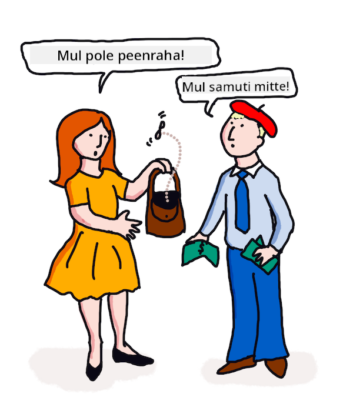

<!--
CO_OP_TRANSLATOR_METADATA:
{
  "original_hash": "be03c8182982b87ced155e4e9d1438e8",
  "translation_date": "2025-10-11T11:38:46+00:00",
  "source_file": "6-NLP/3-Translation-Sentiment/README.md",
  "language_code": "et"
}
-->
# Tõlkimine ja meeleolu analüüs masinõppe abil

Eelnevates tundides õppisite, kuidas luua lihtsat robotit, kasutades `TextBlob`-i, raamatukogu, mis rakendab masinõpet kulisside taga, et täita põhilisi loomuliku keele töötlemise ülesandeid, nagu nimisõnafraaside tuvastamine. Üks oluline väljakutse arvutilingvistikas on täpne _tõlkimine_ ühest kõneldavast või kirjutatud keelest teise.

## [Eeltest](https://ff-quizzes.netlify.app/en/ml/)

Tõlkimine on väga keeruline probleem, mida raskendab asjaolu, et maailmas on tuhandeid keeli, millest igaühel võivad olla väga erinevad grammatikareeglid. Üks lähenemisviis on teisendada ühe keele, näiteks inglise keele, formaalsed grammatikareeglid keeleliselt sõltumatuks struktuuriks ja seejärel tõlkida need teise keelde, muutes struktuuri tagasi. See lähenemine hõlmab järgmisi samme:

1. **Tuvastamine**. Tuvastage või märgistage sisendkeele sõnad nimisõnadeks, tegusõnadeks jne.
2. **Tõlke loomine**. Looge iga sõna otsene tõlge sihtkeele formaadis.

### Näidislause, inglise keelest iiri keelde

Inglise keeles on lause _I feel happy_ kolm sõna järjekorras:

- **aluse** (I)
- **tegusõna** (feel)
- **omadussõna** (happy)

Kuid iiri keeles on sama lause grammatiline struktuur väga erinev – emotsioone nagu "*õnnelik*" või "*kurb*" väljendatakse kui midagi, mis on *sinu peal*.

Inglise fraas `I feel happy` tõlgitakse iiri keelde kui `Tá athas orm`. *Sõnasõnaline* tõlge oleks `Õnnelik on minu peal`.

Iiri keelt kõnelev inimene tõlgiks selle inglise keelde kui `I feel happy`, mitte `Happy is upon me`, sest ta mõistab lause tähendust, isegi kui sõnad ja lause struktuur on erinevad.

Iiri keeles on lause formaalne järjekord:

- **tegusõna** (Tá ehk on)
- **omadussõna** (athas ehk õnnelik)
- **alus** (orm ehk minu peal)

## Tõlkimine

Naivistlik tõlkeprogramm võib tõlkida ainult sõnu, ignoreerides lause struktuuri.

✅ Kui olete õppinud teist (või kolmandat või rohkemat) keelt täiskasvanuna, võisite alustada mõtlemisest oma emakeeles, tõlkides mõiste sõna-sõnalt oma peas teise keelde ja seejärel rääkides oma tõlke välja. See on sarnane sellele, mida naivistlikud tõlkeprogrammid teevad. Oluline on sellest faasist üle saada, et saavutada sujuvus!

Naivistlik tõlkimine viib halva (ja mõnikord naljaka) valesti tõlgendamiseni: `I feel happy` tõlgitakse sõnasõnaliselt iiri keelde kui `Mise bhraitheann athas`. See tähendab (sõnasõnaliselt) `mina tunnen õnnelik` ja ei ole korrektne iiri lause. Kuigi inglise ja iiri keel on naabersaartel kõneldavad keeled, on need väga erinevad grammatilise struktuuriga keeled.

> Võite vaadata mõningaid videoid iiri keele traditsioonidest, näiteks [seda](https://www.youtube.com/watch?v=mRIaLSdRMMs).

### Masinõppe lähenemisviisid

Siiani olete õppinud loomuliku keele töötlemise formaalsete reeglite lähenemisviisi. Teine lähenemisviis on ignoreerida sõnade tähendust ja _kasutada masinõpet mustrite tuvastamiseks_. See võib tõlkimisel toimida, kui teil on palju tekste (*korpus*) või tekste (*korpused*) nii lähte- kui sihtkeeles.

Näiteks võtame *Uhkus ja eelarvamus*, tuntud ingliskeelse romaani, mille kirjutas Jane Austen 1813. aastal. Kui uurite raamatut inglise keeles ja selle inimtõlget *prantsuse* keelde, võite tuvastada fraase, mis on ühes keeles *idiomaatiliselt* tõlgitud teise keelde. Teete seda kohe.

Näiteks kui ingliskeelne fraas `I have no money` tõlgitakse sõnasõnaliselt prantsuse keelde, võib see muutuda `Je n'ai pas de monnaie`. "Monnaie" on keeruline prantsuse 'vale sõna', kuna 'money' ja 'monnaie' ei ole sünonüümid. Parem tõlge, mille inimene võiks teha, oleks `Je n'ai pas d'argent`, kuna see edastab paremini tähendust, et teil pole raha (mitte 'peenraha', mis on 'monnaie' tähendus).



> Pilt autorilt [Jen Looper](https://twitter.com/jenlooper)

Kui ML-mudelil on piisavalt inimtõlkeid, mille põhjal mudelit luua, võib see parandada tõlgete täpsust, tuvastades mustreid tekstides, mida on varem tõlkinud mõlema keele eksperdid.

### Harjutus - tõlkimine

Saate kasutada `TextBlob`-i lausete tõlkimiseks. Proovige kuulsa esimese lauset **Uhkus ja eelarvamus**:

```python
from textblob import TextBlob

blob = TextBlob(
    "It is a truth universally acknowledged, that a single man in possession of a good fortune, must be in want of a wife!"
)
print(blob.translate(to="fr"))

```

`TextBlob` teeb tõlkimisel üsna head tööd: "C'est une vérité universellement reconnue, qu'un homme célibataire en possession d'une bonne fortune doit avoir besoin d'une femme!". 

Võib väita, et TextBlob'i tõlge on tegelikult palju täpsem kui 1932. aasta prantsuse tõlge, mille tegid V. Leconte ja Ch. Pressoir:

"C'est une vérité universelle qu'un célibataire pourvu d'une belle fortune doit avoir envie de se marier, et, si peu que l'on sache de son sentiment à cet egard, lorsqu'il arrive dans une nouvelle résidence, cette idée est si bien fixée dans l'esprit de ses voisins qu'ils le considèrent sur-le-champ comme la propriété légitime de l'une ou l'autre de leurs filles."

Sel juhul teeb ML-i abil juhitud tõlge paremat tööd kui inimtõlkija, kes lisab originaalautori sõnadele tarbetult selgitusi.

> Mis siin toimub? Ja miks on TextBlob tõlkimisel nii hea? Noh, kulisside taga kasutab see Google Translate'i, keerukat AI-d, mis suudab analüüsida miljoneid fraase, et ennustada parimaid stringe antud ülesande jaoks. Siin ei toimu midagi käsitsi ja `blob.translate` kasutamiseks vajate internetiühendust.

✅ Proovige veel mõningaid lauseid. Kumb on parem, ML või inimtõlge? Millistel juhtudel?

## Meeleolu analüüs

Teine valdkond, kus masinõpe võib väga hästi toimida, on meeleolu analüüs. Mitte-ML lähenemisviis meeleolu tuvastamiseks on tuvastada sõnad ja fraasid, mis on 'positiivsed' ja 'negatiivsed'. Seejärel, kui antakse uus tekst, arvutatakse positiivsete, negatiivsete ja neutraalsete sõnade koguväärtus, et tuvastada üldine meeleolu.

See lähenemisviis on kergesti petetav, nagu võisite näha Marvin'i ülesandes – lause `Great, that was a wonderful waste of time, I'm glad we are lost on this dark road` on sarkastiline, negatiivse meeleoluga lause, kuid lihtne algoritm tuvastab 'great', 'wonderful', 'glad' kui positiivsed ja 'waste', 'lost' ja 'dark' kui negatiivsed. Üldine meeleolu on segatud nende vastuoluliste sõnade tõttu.

✅ Peatu hetkeks ja mõtle, kuidas me inimestena sarkasmi edastame. Toonimuutus mängib suurt rolli. Proovige öelda fraas "Well, that film was awesome" erinevatel viisidel, et avastada, kuidas teie hääl edastab tähendust.

### ML lähenemisviisid

ML lähenemisviis oleks käsitsi koguda negatiivseid ja positiivseid tekstikogumeid – näiteks säutse, filmide arvustusi või midagi, kus inimene on andnud hinnangu *ja* kirjaliku arvamuse. Seejärel saab NLP-tehnikaid rakendada arvamustele ja hinnangutele, nii et mustrid ilmnevad (nt positiivsetes filmide arvustustes esineb fraas 'Oscar worthy' sagedamini kui negatiivsetes arvustustes, või positiivsetes restoranide arvustustes öeldakse 'gourmet' palju sagedamini kui 'disgusting').

> ⚖️ **Näide**: Kui töötaksite poliitiku kontoris ja arutlusel oleks uus seadus, võiksid valijad kontorisse kirjutada e-kirju, mis toetavad või on vastu konkreetsele uuele seadusele. Oletame, et teie ülesandeks oleks lugeda e-kirju ja sorteerida need kahte hunnikusse, *poolt* ja *vastu*. Kui e-kirju oleks palju, võiksite olla ülekoormatud, püüdes neid kõiki lugeda. Kas poleks tore, kui robot saaks need kõik teie eest läbi lugeda, neid mõista ja öelda, millisesse hunnikusse iga e-kiri kuulub? 
> 
> Üks viis selle saavutamiseks on kasutada masinõpet. Treeniksite mudelit osa *vastu* e-kirjade ja osa *poolt* e-kirjadega. Mudel seostaks fraase ja sõnu tõenäolisemalt vastu- või poolt-pooltega, *kuid see ei mõistaks sisu*, ainult seda, et teatud sõnad ja mustrid esinevad tõenäolisemalt vastu- või poolt-poolte e-kirjades. Testiksite seda mõne e-kirjaga, mida te ei kasutanud mudeli treenimiseks, ja vaataks, kas see jõuab samale järeldusele kui teie. Kui olete mudeli täpsusega rahul, saaksite tulevasi e-kirju töödelda ilma, et peaksite igaüht lugema.

✅ Kas see protsess kõlab nagu protsessid, mida olete kasutanud eelnevates tundides?

## Harjutus - meeleolukad laused

Meeleolu mõõdetakse *polariteediga* vahemikus -1 kuni 1, kus -1 on kõige negatiivsem meeleolu ja 1 on kõige positiivsem. Meeleolu mõõdetakse ka skooriga vahemikus 0 - 1 objektiivsuse (0) ja subjektiivsuse (1) jaoks.

Vaadake uuesti Jane Austeni *Uhkus ja eelarvamus*. Tekst on saadaval siin: [Project Gutenberg](https://www.gutenberg.org/files/1342/1342-h/1342-h.htm). Allpool olev näidis näitab lühikest programmi, mis analüüsib raamatu esimese ja viimase lause meeleolu ning kuvab selle polariteedi ja subjektiivsuse/objektiivsuse skoori.

Selle ülesande jaoks peaksite kasutama `TextBlob`-i raamatukogu (kirjeldatud eespool), et määrata `sentiment` (te ei pea ise meeleolu kalkulaatorit kirjutama).

```python
from textblob import TextBlob

quote1 = """It is a truth universally acknowledged, that a single man in possession of a good fortune, must be in want of a wife."""

quote2 = """Darcy, as well as Elizabeth, really loved them; and they were both ever sensible of the warmest gratitude towards the persons who, by bringing her into Derbyshire, had been the means of uniting them."""

sentiment1 = TextBlob(quote1).sentiment
sentiment2 = TextBlob(quote2).sentiment

print(quote1 + " has a sentiment of " + str(sentiment1))
print(quote2 + " has a sentiment of " + str(sentiment2))
```

Näete järgmist väljundit:

```output
It is a truth universally acknowledged, that a single man in possession of a good fortune, must be in want # of a wife. has a sentiment of Sentiment(polarity=0.20952380952380953, subjectivity=0.27142857142857146)

Darcy, as well as Elizabeth, really loved them; and they were
     both ever sensible of the warmest gratitude towards the persons
      who, by bringing her into Derbyshire, had been the means of
      uniting them. has a sentiment of Sentiment(polarity=0.7, subjectivity=0.8)
```

## Väljakutse - kontrollige meeleolu polariteeti

Teie ülesanne on määrata, kasutades meeleolu polariteeti, kas *Uhkus ja eelarvamus* sisaldab rohkem absoluutselt positiivseid lauseid kui absoluutselt negatiivseid. Selle ülesande jaoks võite eeldada, et polariteedi skoor 1 või -1 on absoluutselt positiivne või negatiivne vastavalt.

**Sammud:**

1. Laadige alla [Uhkus ja eelarvamus](https://www.gutenberg.org/files/1342/1342-h/1342-h.htm) Project Gutenbergist .txt-failina. Eemaldage metaandmed faili algusest ja lõpust, jättes alles ainult originaalteksti.
2. Avage fail Pythonis ja ekstraheerige sisu stringina.
3. Looge TextBlob, kasutades raamatu stringi.
4. Analüüsige raamatu iga lauset tsüklis.
   1. Kui polariteet on 1 või -1, salvestage lause positiivsete või negatiivsete sõnumite massiivi või loendisse.
5. Lõpus printige välja kõik positiivsed ja negatiivsed laused (eraldi) ning nende arv.

Siin on näidis [lahendus](https://github.com/microsoft/ML-For-Beginners/blob/main/6-NLP/3-Translation-Sentiment/solution/notebook.ipynb).

✅ Teadmiste kontroll

1. Meeleolu põhineb lauses kasutatud sõnadel, kuid kas kood *mõistab* sõnu?
2. Kas arvate, et meeleolu polariteet on täpne, või teisisõnu, kas te *nõustute* skooridega?
   1. Eelkõige, kas nõustute või ei nõustu järgmiste lausete absoluutse **positiivse** polariteediga?
      * “What an excellent father you have, girls!” said she, when the door was shut.
      * “Your examination of Mr. Darcy is over, I presume,” said Miss Bingley; “and pray what is the result?” “I am perfectly convinced by it that Mr. Darcy has no defect.
      * How wonderfully these sort of things occur!
      * I have the greatest dislike in the world to that sort of thing.
      * Charlotte is an excellent manager, I dare say.
      * “This is delightful indeed!
      * I am so happy!
      * Your idea of the ponies is delightful.
   2. Järgmised 3 lauset said absoluutse positiivse meeleolu skoori, kuid lähemal lugemisel ei ole need positiivsed laused. Miks arvas meeleolu analüüs, et need olid positiivsed laused?
      * Happy shall I be, when his stay at Netherfield is over!” “I wish I could say anything to comfort you,” replied Elizabeth; “but it is wholly out of my power.
      * If I could but see you as happy!
      * Our distress, my dear Lizzy, is very great.
   3. Kas nõustute või ei nõustu järgmiste lausete absoluutse **negatiivse** polariteediga?
      - Everybody is disgusted with his pride.
      - “I should like to know how he behaves among strangers.” “You shall hear then—but prepare yourself for something very dreadful.
      - The pause was to Elizabeth’s feelings dreadful.
      - It would be dreadful!

✅ Iga Jane Austeni austaja mõistab, et ta kasutab sageli oma raamatuid, et kritiseerida Inglise regendiajastu ühiskonna naeruväärsemaid aspekte. Elizabeth Bennett, *Uhkus ja eelarvamus* peategelane, on terav ühiskonna vaatleja (nagu autor ise) ja tema keel on sageli tugevalt nüansirikas. Isegi Mr. Darcy (lugu armastuse huvi) märgib Elizabethi mängulist ja kiuslikku keelekasutust: "Olen olnud teie tuttav piisavalt kaua, et teada, et leiate suurt naudingut aeg-ajalt arvamuste väljendamisest, mis tegelikult ei ole teie omad."

---

## 🚀Väljakutse

Kas suudate Marvin'i veelgi paremaks muuta, ekstraheerides kasutaja sisendist muid omadusi?

## [Järgneva loengu test](https://ff-quizzes.netlify.app/en/ml/)
## Ülevaade ja iseseisev õppimine

Tekstist sentimenti tuvastamiseks on palju erinevaid viise. Mõelge ärirakendustele, mis võiksid seda tehnikat kasutada. Mõelge ka sellele, kuidas see võib valesti minna. Lugege rohkem keerukate ettevõtetele mõeldud süsteemide kohta, mis analüüsivad sentimenti, näiteks [Azure Text Analysis](https://docs.microsoft.com/azure/cognitive-services/Text-Analytics/how-tos/text-analytics-how-to-sentiment-analysis?tabs=version-3-1?WT.mc_id=academic-77952-leestott). Katsetage mõningaid ülaltoodud "Uhkus ja eelarvamus" lauseid ja vaadake, kas see suudab tuvastada nüansse.

## Ülesanne

[Luulelitsents](assignment.md)

---

**Lahtiütlus**:  
See dokument on tõlgitud AI tõlketeenuse [Co-op Translator](https://github.com/Azure/co-op-translator) abil. Kuigi püüame tagada täpsust, palume arvestada, et automaatsed tõlked võivad sisaldada vigu või ebatäpsusi. Algne dokument selle algses keeles tuleks pidada autoriteetseks allikaks. Olulise teabe puhul soovitame kasutada professionaalset inimtõlget. Me ei vastuta selle tõlke kasutamisest tulenevate arusaamatuste või valesti tõlgenduste eest.