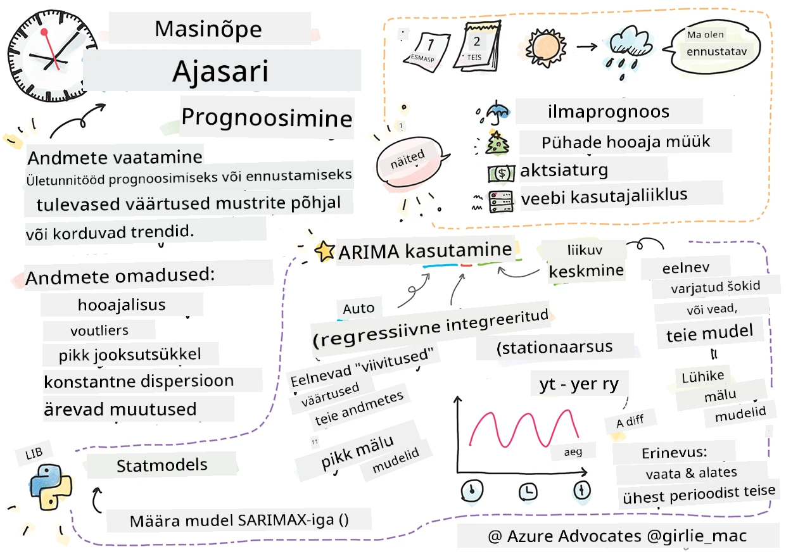
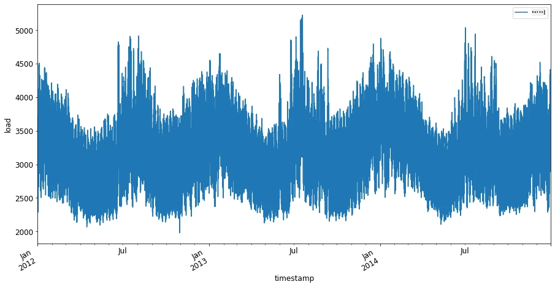
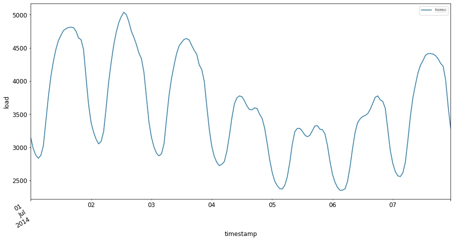

<!--
CO_OP_TRANSLATOR_METADATA:
{
  "original_hash": "662b509c39eee205687726636d0a8455",
  "translation_date": "2025-10-11T12:01:09+00:00",
  "source_file": "7-TimeSeries/1-Introduction/README.md",
  "language_code": "et"
}
-->
# Sissejuhatus aegridade prognoosimisse



> Visand Tomomi Imura poolt [Tomomi Imura](https://www.twitter.com/girlie_mac)

Selles ja järgmises õppetükis õpid veidi aegridade prognoosimisest, mis on huvitav ja väärtuslik osa ML teadlase oskuste repertuaarist, kuid on veidi vähem tuntud kui teised teemad. Aegridade prognoosimine on omamoodi "kristallkuul": varasema muutujate, nagu hind, käitumise põhjal saab ennustada selle tulevast potentsiaalset väärtust.

[](https://youtu.be/cBojo1hsHiI "Sissejuhatus aegridade prognoosimisse")

> 🎥 Klõpsa ülaloleval pildil, et vaadata videot aegridade prognoosimisest

## [Eel-loengu viktoriin](https://ff-quizzes.netlify.app/en/ml/)

See on kasulik ja huvitav valdkond, millel on reaalne väärtus äris, arvestades selle otsest rakendust hinnakujunduse, varude ja tarneahela probleemide lahendamisel. Kuigi süvaõppe tehnikaid on hakatud kasutama tulevase jõudluse parema ennustamise jaoks, jääb aegridade prognoosimine valdkonnaks, mida klassikalised ML tehnikad endiselt tugevalt mõjutavad.

> Penn State'i kasulik aegridade õppekava on saadaval [siin](https://online.stat.psu.edu/stat510/lesson/1)

## Sissejuhatus

Oletame, et haldad nutikaid parkimismõõtureid, mis annavad andmeid selle kohta, kui tihti ja kui kaua neid aja jooksul kasutatakse.

> Mis oleks, kui saaksid prognoosida, mõõturi varasema jõudluse põhjal, selle tulevast väärtust vastavalt pakkumise ja nõudluse seadustele?

Täpne prognoosimine, millal tegutseda, et saavutada oma eesmärk, on väljakutse, mida saab lahendada aegridade prognoosimise abil. Kuigi see ei teeks inimesi õnnelikuks, kui neilt küsitakse rohkem tasu hõivatud aegadel, kui nad otsivad parkimiskohta, oleks see kindel viis tänavate puhastamiseks vajaliku tulu genereerimiseks!

Uurime mõningaid aegridade algoritmide tüüpe ja alustame märkmikuga, et andmeid puhastada ja ette valmistada. Analüüsitavad andmed pärinevad GEFCom2014 prognoosimisvõistluselt. Need sisaldavad 3 aastat tunnipõhiseid elektrikoormuse ja temperatuuriväärtusi ajavahemikus 2012–2014. Arvestades elektrikoormuse ja temperatuuri ajaloolisi mustreid, saab prognoosida elektrikoormuse tulevasi väärtusi.

Selles näites õpid prognoosima ühe ajasammu ette, kasutades ainult ajaloolisi koormusandmeid. Enne alustamist on aga kasulik mõista, mis toimub kulisside taga.

## Mõned definitsioonid

Kui kohtad terminit "aegrida", pead mõistma selle kasutust mitmes erinevas kontekstis.

🎓 **Aegrida**

Matemaatikas on "aegrida andmepunktide jada, mis on järjestatud (või loetletud või graafikul esitatud) ajajärjekorras. Kõige sagedamini on aegrida järjestikuste võrdselt jaotatud ajapunktide jada." Näiteks aegrida on [Dow Jonesi tööstuskeskmise](https://wikipedia.org/wiki/Time_series) igapäevane sulgemisväärtus. Aegridade graafikute ja statistilise modelleerimise kasutamine on sageli kohatav signaalitöötluses, ilmaprognoosides, maavärinate ennustamises ja muudes valdkondades, kus sündmused toimuvad ja andmepunkte saab aja jooksul graafikul esitada.

🎓 **Aegridade analüüs**

Aegridade analüüs on ülalmainitud aegridade andmete analüüs. Aegridade andmed võivad võtta erinevaid vorme, sealhulgas "katkestatud aegrida", mis tuvastab mustreid aegridade arengus enne ja pärast katkestavat sündmust. Vajalik analüüs sõltub andmete olemusest. Aegridade andmed ise võivad olla numbrite või tähemärkide jadad.

Analüüs kasutab mitmesuguseid meetodeid, sealhulgas sagedus- ja ajadomeeni, lineaarseid ja mittelineaarseid meetodeid ning palju muud. [Loe rohkem](https://www.itl.nist.gov/div898/handbook/pmc/section4/pmc4.htm) selle tüüpi andmete analüüsimise viisidest.

🎓 **Aegridade prognoosimine**

Aegridade prognoosimine on mudeli kasutamine tulevaste väärtuste ennustamiseks, tuginedes varem kogutud andmete mustritele. Kuigi regressioonimudeleid on võimalik kasutada aegridade andmete uurimiseks, kus ajas indeksid on x-muutujad graafikul, on selliseid andmeid kõige parem analüüsida spetsiaalsete mudelite abil.

Aegridade andmed on järjestatud vaatluste loend, erinevalt andmetest, mida saab analüüsida lineaarse regressiooniga. Kõige levinum mudel on ARIMA, mis on lühend "Autoregressiivne Integreeritud Liikuva Keskmise".

[ARIMA mudelid](https://online.stat.psu.edu/stat510/lesson/1/1.1) "seostavad seeria praegust väärtust varasemate väärtuste ja varasemate prognoosivigadega." Need sobivad kõige paremini ajadomeeni andmete analüüsimiseks, kus andmed on aja jooksul järjestatud.

> ARIMA mudeleid on mitut tüüpi, millest saad rohkem teada [siin](https://people.duke.edu/~rnau/411arim.htm) ja mida käsitletakse järgmises õppetükis.

Järgmises õppetükis ehitad ARIMA mudeli, kasutades [Ühemuutujalist Aegrida](https://itl.nist.gov/div898/handbook/pmc/section4/pmc44.htm), mis keskendub ühele muutujale, mis aja jooksul oma väärtust muudab. Näiteks sellist tüüpi andmed on [see andmestik](https://itl.nist.gov/div898/handbook/pmc/section4/pmc4411.htm), mis salvestab Mauna Loa observatooriumis igakuise CO2 kontsentratsiooni:

|  CO2   | YearMonth | Year  | Month |
| :----: | :-------: | :---: | :---: |
| 330.62 |  1975.04  | 1975  |   1   |
| 331.40 |  1975.13  | 1975  |   2   |
| 331.87 |  1975.21  | 1975  |   3   |
| 333.18 |  1975.29  | 1975  |   4   |
| 333.92 |  1975.38  | 1975  |   5   |
| 333.43 |  1975.46  | 1975  |   6   |
| 331.85 |  1975.54  | 1975  |   7   |
| 330.01 |  1975.63  | 1975  |   8   |
| 328.51 |  1975.71  | 1975  |   9   |
| 328.41 |  1975.79  | 1975  |  10   |
| 329.25 |  1975.88  | 1975  |  11   |
| 330.97 |  1975.96  | 1975  |  12   |

✅ Tuvasta muutuv muutuja selles andmestikus

## Aegridade andmete omadused, mida arvestada

Aegridade andmeid vaadates võid märgata, et neil on [teatud omadused](https://online.stat.psu.edu/stat510/lesson/1/1.1), mida tuleb arvesse võtta ja leevendada, et paremini mõista nende mustreid. Kui pead aegridade andmeid potentsiaalselt "signaaliks", mida soovid analüüsida, võib neid omadusi pidada "müraks". Sageli tuleb seda "müra" vähendada, kasutades mõningaid statistilisi tehnikaid.

Siin on mõned mõisted, mida peaksid teadma, et aegridadega töötada:

🎓 **Trend**

Trendid on määratletud kui mõõdetavad tõusud ja langused aja jooksul. [Loe rohkem](https://machinelearningmastery.com/time-series-trends-in-python). Aegridade kontekstis on see seotud sellega, kuidas kasutada ja vajadusel eemaldada trende oma aegridadest.

🎓 **[Hooajalisus](https://machinelearningmastery.com/time-series-seasonality-with-python/)**

Hooajalisus on määratletud kui perioodilised kõikumised, näiteks pühadeaegsed müügi tõusud. [Vaata lähemalt](https://itl.nist.gov/div898/handbook/pmc/section4/pmc443.htm), kuidas erinevat tüüpi graafikud kuvavad hooajalisust andmetes.

🎓 **Eristuvad väärtused**

Eristuvad väärtused on kaugel standardandmete variatsioonist.

🎓 **Pikaajaline tsükkel**

Sõltumata hooajalisusest võivad andmed näidata pikaajalist tsüklit, näiteks majanduslangust, mis kestab kauem kui aasta.

🎓 **Püsiv variatsioon**

Aja jooksul võivad mõned andmed näidata püsivaid kõikumisi, näiteks energia kasutamine päeval ja öösel.

🎓 **Järsud muutused**

Andmed võivad näidata järsku muutust, mis vajab täiendavat analüüsi. Näiteks COVIDi tõttu ettevõtete järsk sulgemine põhjustas andmetes muutusi.

✅ Siin on [näidis aegridade graafik](https://www.kaggle.com/kashnitsky/topic-9-part-1-time-series-analysis-in-python), mis näitab igapäevast mängusisese valuuta kulutamist mitme aasta jooksul. Kas suudad tuvastada mõnda ülaltoodud omadust nendes andmetes?


## Harjutus - alustamine elektritarbimise andmetega

Alustame aegridade mudeli loomist, et prognoosida tulevast elektritarbimist, arvestades varasemat tarbimist.

> Selle näite andmed pärinevad GEFCom2014 prognoosimisvõistluselt. Need sisaldavad 3 aastat tunnipõhiseid elektrikoormuse ja temperatuuriväärtusi ajavahemikus 2012–2014.
>
> Tao Hong, Pierre Pinson, Shu Fan, Hamidreza Zareipour, Alberto Troccoli ja Rob J. Hyndman, "Probabilistic energy forecasting: Global Energy Forecasting Competition 2014 and beyond", International Journal of Forecasting, vol.32, no.3, pp 896-913, juuli-september, 2016.

1. Ava selle õppetüki `working` kaustas _notebook.ipynb_ fail. Alusta raamatukogude lisamisega, mis aitavad andmeid laadida ja visualiseerida.

    ```python
    import os
    import matplotlib.pyplot as plt
    from common.utils import load_data
    %matplotlib inline
    ```

    Märkus: kasutad kaasatud `common` kausta faile, mis seadistavad sinu keskkonna ja haldavad andmete allalaadimist.

2. Järgmine samm: vaata andmeid andmeraamina, kutsudes `load_data()` ja `head()`:

    ```python
    data_dir = './data'
    energy = load_data(data_dir)[['load']]
    energy.head()
    ```

    Näed, et on kaks veergu, mis esindavad kuupäeva ja koormust:

    |                     |  load  |
    | :-----------------: | :----: |
    | 2012-01-01 00:00:00 | 2698.0 |
    | 2012-01-01 01:00:00 | 2558.0 |
    | 2012-01-01 02:00:00 | 2444.0 |
    | 2012-01-01 03:00:00 | 2402.0 |
    | 2012-01-01 04:00:00 | 2403.0 |

3. Nüüd, kuva andmed, kutsudes `plot()`:

    ```python
    energy.plot(y='load', subplots=True, figsize=(15, 8), fontsize=12)
    plt.xlabel('timestamp', fontsize=12)
    plt.ylabel('load', fontsize=12)
    plt.show()
    ```

    

4. Nüüd, kuva 2014. aasta juuli esimene nädal, andes selle sisendiks `energy` kujul `[kuupäevast]:[kuupäevani]`:

    ```python
    energy['2014-07-01':'2014-07-07'].plot(y='load', subplots=True, figsize=(15, 8), fontsize=12)
    plt.xlabel('timestamp', fontsize=12)
    plt.ylabel('load', fontsize=12)
    plt.show()
    ```

    

    Kaunis graafik! Vaata neid graafikuid ja proovi tuvastada mõnda ülaltoodud omadust. Mida saame andmeid visualiseerides järeldada?

Järgmises õppetükis lood ARIMA mudeli, et teha prognoose.

---

## 🚀Väljakutse

Koosta nimekiri kõigist tööstusharudest ja uurimisvaldkondadest, mis võiksid aegridade prognoosimisest kasu saada. Kas suudad mõelda nende tehnikate rakendusele kunstis? Majandusteaduses? Ökoloogias? Jaekaubanduses? Tööstuses? Rahanduses? Kus veel?

## [Järgneva loengu viktoriin](https://ff-quizzes.netlify.app/en/ml/)

## Ülevaade ja iseseisev õppimine

Kuigi me ei käsitle neid siin, kasutatakse mõnikord närvivõrke klassikaliste aegridade prognoosimise meetodite täiustamiseks. Loe rohkem nende kohta [selles artiklis](https://medium.com/microsoftazure/neural-networks-for-forecasting-financial-and-economic-time-series-6aca370ff412)

## Ülesanne

[Visualiseeri veel aegridasid](assignment.md)

---

**Lahtiütlus**:  
See dokument on tõlgitud AI tõlketeenuse [Co-op Translator](https://github.com/Azure/co-op-translator) abil. Kuigi püüame tagada täpsust, palume arvestada, et automaatsed tõlked võivad sisaldada vigu või ebatäpsusi. Algne dokument selle algses keeles tuleks pidada autoriteetseks allikaks. Olulise teabe puhul soovitame kasutada professionaalset inimtõlget. Me ei vastuta selle tõlke kasutamisest tulenevate arusaamatuste või valesti tõlgenduste eest.