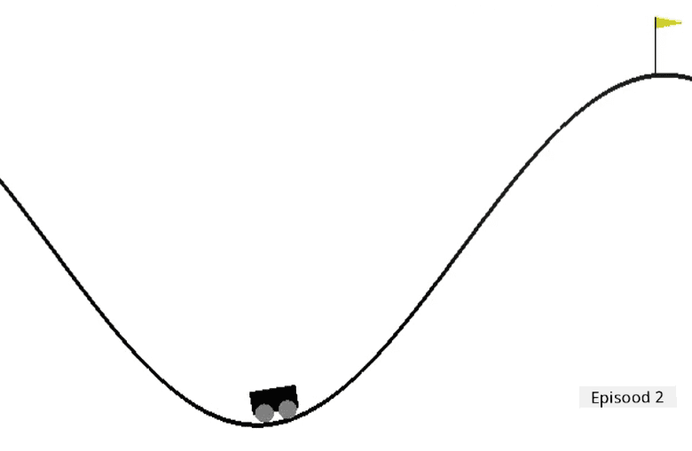

<!--
CO_OP_TRANSLATOR_METADATA:
{
  "original_hash": "1f2b7441745eb52e25745423b247016b",
  "translation_date": "2025-10-11T11:17:43+00:00",
  "source_file": "8-Reinforcement/2-Gym/assignment.md",
  "language_code": "et"
}
-->
# Treeni Mountain Car

[OpenAI Gym](http://gym.openai.com) on loodud nii, et kõik keskkonnad pakuvad sama API-d – st samu meetodeid `reset`, `step` ja `render` ning samu **tegevusruumi** ja **vaatlusruumi** abstraktsioone. Seetõttu peaks olema võimalik kohandada sama tugevdusõppe algoritmi erinevatele keskkondadele minimaalsete koodimuudatustega.

## Mountain Car keskkond

[Mountain Car keskkond](https://gym.openai.com/envs/MountainCar-v0/) sisaldab orgu kinni jäänud autot:

Eesmärk on orust välja pääseda ja lippu kätte saada, tehes igal sammul ühte järgmistest tegevustest:

| Väärtus | Tähendus |
|---|---|
| 0 | Kiirenda vasakule |
| 1 | Ära kiirenda |
| 2 | Kiirenda paremale |

Selle probleemi peamine trikk seisneb aga selles, et auto mootor ei ole piisavalt tugev, et mäest ühe korraga üles sõita. Seetõttu on ainus viis edu saavutamiseks sõita edasi-tagasi, et hoogu koguda.

Vaatlusruum koosneb vaid kahest väärtusest:

| Nr | Vaatlus       | Min | Max |
|----|--------------|-----|-----|
|  0 | Auto asukoht | -1.2| 0.6 |
|  1 | Auto kiirus  | -0.07 | 0.07 |

Mountain Car'i preemiasüsteem on üsna keeruline:

 * Preemia 0 antakse, kui agent jõuab lipuni (asukoht = 0.5) mäe tipus.
 * Preemia -1 antakse, kui agendi asukoht on väiksem kui 0.5.

Episood lõppeb, kui auto asukoht on suurem kui 0.5 või episoodi pikkus ületab 200.
## Juhised

Kohanda meie tugevdusõppe algoritmi, et lahendada Mountain Car'i probleem. Alusta olemasoleva [notebook.ipynb](notebook.ipynb) koodiga, asenda uus keskkond, muuda olekute diskreetimise funktsioone ja proovi olemasolevat algoritmi treenida minimaalsete koodimuudatustega. Optimeeri tulemus, kohandades hüperparameetreid.

> **Märkus**: Hüperparameetrite kohandamine on tõenäoliselt vajalik, et algoritm konvergeeruks.
## Hindamiskriteeriumid

| Kriteerium | Näidislik | Piisav | Vajab parandamist |
| ---------- | --------- | ------ | ----------------- |
|            | Q-õppe algoritm on edukalt kohandatud CartPole näitest, minimaalsete koodimuudatustega, mis suudab lahendada lipu kättesaamise probleemi alla 200 sammu. | Uus Q-õppe algoritm on internetist võetud, kuid hästi dokumenteeritud; või olemasolev algoritm on kohandatud, kuid ei saavuta soovitud tulemusi. | Õpilane ei suutnud edukalt kohandada ühtegi algoritmi, kuid on teinud olulisi samme lahenduse suunas (rakendanud olekute diskreetimise, Q-tabeli andmestruktuuri jne). |

---

**Lahtiütlus**:  
See dokument on tõlgitud, kasutades AI tõlketeenust [Co-op Translator](https://github.com/Azure/co-op-translator). Kuigi püüame tagada täpsust, palun arvestage, et automaatsed tõlked võivad sisaldada vigu või ebatäpsusi. Algne dokument selle algkeeles tuleks lugeda autoriteetseks allikaks. Olulise teabe puhul on soovitatav kasutada professionaalset inimtõlget. Me ei vastuta selle tõlke kasutamisest tulenevate arusaamatuste või valede tõlgenduste eest.