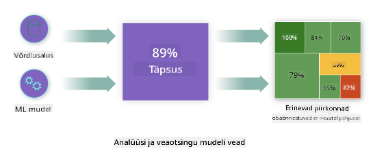
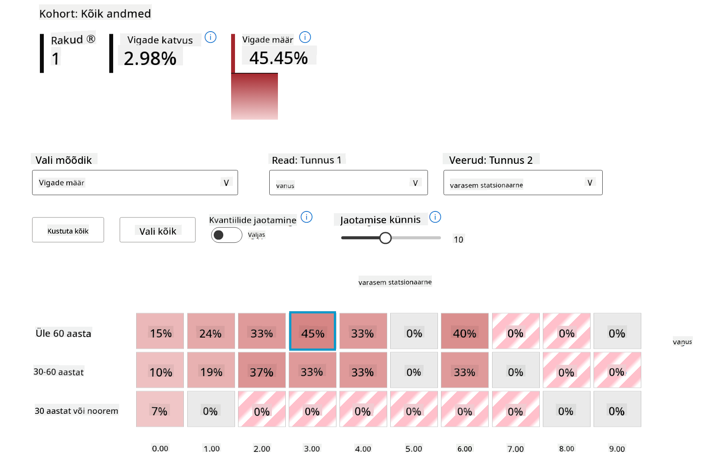

<!--
CO_OP_TRANSLATOR_METADATA:
{
  "original_hash": "df2b538e8fbb3e91cf0419ae2f858675",
  "translation_date": "2025-10-11T11:52:05+00:00",
  "source_file": "9-Real-World/2-Debugging-ML-Models/README.md",
  "language_code": "et"
}
-->
# Postscript: Masinõppe mudelite silumine vastutustundliku AI armatuurlaua komponentide abil

## [Eelloengu viktoriin](https://ff-quizzes.netlify.app/en/ml/)

## Sissejuhatus

Masinõpe mõjutab meie igapäevaelu. Tehisintellekt leiab tee mõningatesse kõige olulisematesse süsteemidesse, mis mõjutavad meid nii üksikisikutena kui ka ühiskonnana, alates tervishoiust, rahandusest, haridusest ja tööhõivest. Näiteks kasutatakse süsteeme ja mudeleid igapäevastes otsustusprotsessides, nagu tervishoiudiagnoosid või pettuste tuvastamine. Seetõttu kaasnevad AI edusammud ja kiirenenud kasutuselevõtt muutuvate ühiskondlike ootuste ja kasvava regulatsiooniga. Me näeme pidevalt valdkondi, kus AI-süsteemid ei vasta ootustele, tekitavad uusi väljakutseid ja valitsused hakkavad AI-lahendusi reguleerima. Seetõttu on oluline, et neid mudeleid analüüsitaks, et tagada kõigile õiglane, usaldusväärne, kaasav, läbipaistev ja vastutustundlik tulemus.

Selles õppekavas vaatleme praktilisi tööriistu, mida saab kasutada mudeli vastutustundliku AI probleemide hindamiseks. Traditsioonilised masinõppe silumistehnikad põhinevad tavaliselt kvantitatiivsetel arvutustel, nagu koondatud täpsus või keskmine veakadu. Kujutage ette, mis võib juhtuda, kui andmed, mida te nende mudelite loomiseks kasutate, ei sisalda teatud demograafilisi andmeid, nagu rass, sugu, poliitilised vaated, religioon, või esindavad neid ebaproportsionaalselt. Mis juhtub siis, kui mudeli väljund eelistab teatud demograafilist gruppi? See võib põhjustada nende tundlike tunnuste gruppide üle- või alarepresentatsiooni, mis toob kaasa mudeli õiglus-, kaasavus- või usaldusväärsusprobleeme. Teine tegur on see, et masinõppe mudelid on sageli mustad kastid, mis muudab keeruliseks mõista ja selgitada, mis juhib mudeli ennustusi. Kõik need on väljakutsed, millega andmeteadlased ja AI arendajad silmitsi seisavad, kui neil puuduvad piisavad tööriistad mudeli õiglus- või usaldusväärsuse hindamiseks ja silumiseks.

Selles õppetükis õpite oma mudeleid siluma, kasutades:

- **Vigade analüüs**: tuvastage, kus teie andmejaotuses on mudelil kõrged veamäärad.
- **Mudeli ülevaade**: tehke võrdlev analüüs erinevate andmekohtade vahel, et avastada erinevusi mudeli jõudlusmõõdikutes.
- **Andmeanalüüs**: uurige, kus teie andmed võivad olla üle- või alarepresentatsioonis, mis võib kallutada mudelit eelistama üht demograafilist gruppi teise ees.
- **Tunnuste olulisus**: mõistke, millised tunnused juhivad mudeli ennustusi globaalsel või lokaalsel tasemel.

## Eeldused

Eeldusena vaadake üle [Vastutustundliku AI tööriistad arendajatele](https://www.microsoft.com/ai/ai-lab-responsible-ai-dashboard)

> 

## Vigade analüüs

Traditsioonilised mudeli jõudlusmõõdikud, mida kasutatakse täpsuse mõõtmiseks, põhinevad peamiselt õigete ja valede ennustuste arvutustel. Näiteks võib mudelit, mis on täpne 89% ajast ja mille veakadu on 0,001, pidada heaks. Vead ei ole sageli jaotatud ühtlaselt teie aluseks olevas andmestikus. Võite saada 89% mudeli täpsuse skoori, kuid avastada, et on olemas andmejaotuse piirkonnad, kus mudel ebaõnnestub 42% ajast. Nende ebaõnnestumismustrite tagajärjed teatud andmegruppidega võivad viia õiglus- või usaldusväärsusprobleemideni. On oluline mõista, kus mudel toimib hästi ja kus mitte. Andmejaotuse piirkonnad, kus mudelil on palju ebatäpsusi, võivad osutuda oluliseks demograafiliseks andmegrupiks.

RAI armatuurlaua vigade analüüsi komponent illustreerib, kuidas mudeli ebaõnnestumised jaotuvad erinevate kohtade vahel puu visualiseerimise abil. See on kasulik tunnuste või piirkondade tuvastamiseks, kus teie andmestikus on kõrge veamäär. Nägemine, kust enamik mudeli ebatäpsusi pärineb, võimaldab teil alustada juurpõhjuse uurimist. Samuti saate luua andmekohti analüüsi tegemiseks. Need andmekohad aitavad silumisprotsessis kindlaks teha, miks mudeli jõudlus on ühes kohas hea, kuid teises vigane.

Puu kaardil olevad visuaalsed indikaatorid aitavad probleemipiirkondi kiiremini leida. Näiteks mida tumedam punane värv puu sõlmel on, seda kõrgem on veamäär.

Kuumuskaart on veel üks visualiseerimisfunktsioon, mida kasutajad saavad kasutada veamäära uurimiseks ühe või kahe tunnuse abil, et leida mudeli vigade panustaja kogu andmestikus või kohtades.

Kasutage vigade analüüsi, kui peate:

* Saama sügava arusaama, kuidas mudeli ebaõnnestumised jaotuvad andmestikus ja mitme sisendi ning tunnuse dimensiooni vahel.
* Jagama koondatud jõudlusmõõdikud, et automaatselt avastada vigaseid kohti ja teavitada sihipärastest leevendamismeetmetest.

## Mudeli ülevaade

Masinõppe mudeli jõudluse hindamine nõuab terviklikku arusaamist selle käitumisest. Seda saab saavutada, vaadates rohkem kui ühte mõõdikut, nagu veamäär, täpsus, tagasikutsumine, täpsus või MAE (keskmine absoluutne viga), et leida erinevusi jõudlusmõõdikutes. Üks jõudlusmõõdik võib tunduda suurepärane, kuid ebatäpsused võivad ilmneda teises mõõdikus. Lisaks aitab mõõdikute võrdlemine erinevuste leidmiseks kogu andmestikus või kohtades valgustada, kus mudel toimib hästi või mitte. See on eriti oluline mudeli jõudluse nägemiseks tundlike ja mittetundlike tunnuste (nt patsiendi rass, sugu või vanus) vahel, et paljastada võimalik ebaõiglus, mis mudelil võib olla. Näiteks avastades, et mudel on tundlike tunnustega kohtades vigasem, võib paljastada mudeli võimaliku ebaõigluse.

RAI armatuurlaua mudeli ülevaate komponent aitab mitte ainult analüüsida andmekohtade esindatuse jõudlusmõõdikuid, vaid annab kasutajatele võimaluse võrrelda mudeli käitumist erinevate kohtade vahel.

Komponendi tunnusepõhine analüüsifunktsioon võimaldab kasutajatel kitsendada andmealamgruppe konkreetse tunnuse piires, et tuvastada anomaaliaid detailsemal tasemel. Näiteks on armatuurlaual sisseehitatud intelligentsus, mis automaatselt genereerib kohtade jaoks kasutaja valitud tunnuse (nt *"time_in_hospital < 3"* või *"time_in_hospital >= 7"*) põhjal. See võimaldab kasutajal eraldada konkreetse tunnuse suuremast andmegrupist, et näha, kas see on mudeli vigaste tulemuste võtmetegur.

Mudeli ülevaate komponent toetab kahte klassi erinevusmõõdikuid:

**Erinevus mudeli jõudluses**: Need mõõdikud arvutavad erinevuse (vahe) valitud jõudlusmõõdiku väärtustes andmealamgruppide vahel. Siin on mõned näited:

* Täpsuse määra erinevus
* Veamäära erinevus
* Täpsuse erinevus
* Tagasikutsumise erinevus
* Keskmise absoluutse vea (MAE) erinevus

**Valiku määra erinevus**: See mõõdik sisaldab valiku määra (soodne ennustus) erinevust alamgruppide vahel. Näiteks laenu heakskiitmise määrade erinevus. Valiku määr tähendab andmepunktide osakaalu igas klassis, mis on klassifitseeritud kui 1 (binaarses klassifikatsioonis) või ennustusväärtuste jaotust (regressioonis).

## Andmeanalüüs

> "Kui piinata andmeid piisavalt kaua, tunnistavad need kõike" - Ronald Coase

See väide kõlab äärmuslikult, kuid on tõsi, et andmeid saab manipuleerida, et toetada mis tahes järeldust. Selline manipuleerimine võib mõnikord juhtuda tahtmatult. Inimestena on meil kõigil eelarvamused ja sageli on raske teadlikult teada, millal te andmetesse eelarvamusi lisate. Õigluse tagamine AI-s ja masinõppes jääb keeruliseks väljakutseks.

Andmed on traditsiooniliste mudeli jõudlusmõõdikute jaoks suur pimeala. Teil võib olla kõrge täpsuse skoor, kuid see ei kajasta alati aluseks olevat andmebiasi, mis võib teie andmestikus olla. Näiteks kui töötajate andmestikus on 27% naisi juhtivatel ametikohtadel ettevõttes ja 73% mehi samal tasemel, võib töökuulutuste AI mudel, mis on treenitud nende andmete põhjal, sihtida peamiselt meessoost publikut kõrgema taseme töökohtadele. Selline andmete tasakaalustamatus kallutas mudeli ennustuse eelistama üht sugu. See paljastab õigluse probleemi, kus AI mudelil on sooline eelarvamus.

RAI armatuurlaua andmeanalüüsi komponent aitab tuvastada piirkondi, kus andmestikus on üle- ja alarepresentatsioon. See aitab kasutajatel diagnoosida vigade ja õigluse probleemide juurpõhjuseid, mis on põhjustatud andmete tasakaalustamatusest või konkreetse andmegrupi esindatuse puudumisest. See annab kasutajatele võimaluse visualiseerida andmestikke ennustatud ja tegelike tulemuste, veagruppide ja konkreetsete tunnuste põhjal. Mõnikord võib alarepresentatsiooni avastamine paljastada, et mudel ei õpi hästi, mistõttu on kõrged ebatäpsused. Mudel, millel on andmebias, ei ole mitte ainult õigluse probleem, vaid näitab, et mudel ei ole kaasav ega usaldusväärne.

Kasutage andmeanalüüsi, kui peate:

* Uurima oma andmestiku statistikat, valides erinevaid filtreid, et jaotada oma andmeid erinevatesse dimensioonidesse (tuntud ka kui kohad).
* Mõistma oma andmestiku jaotust erinevate kohtade ja tunnuste gruppide vahel.
* Määrama, kas teie leiud, mis on seotud õigluse, vigade analüüsi ja põhjuslikkusega (tuletatud teistest armatuurlaua komponentidest), tulenevad teie andmestiku jaotusest.
* Otsustama, millistes piirkondades koguda rohkem andmeid, et leevendada vigu, mis tulenevad esindatuse probleemidest, sildi mürast, tunnuse mürast, sildi eelarvamusest ja sarnastest teguritest.

## Mudeli tõlgendatavus

Masinõppe mudelid kipuvad olema mustad kastid. Mõistmine, millised olulised andmetunnused juhivad mudeli ennustust, võib olla keeruline. On oluline pakkuda läbipaistvust, miks mudel teeb teatud ennustuse. Näiteks kui AI-süsteem ennustab, et diabeediga patsient on ohus, et ta võetakse haiglasse tagasi vähem kui 30 päeva jooksul, peaks see suutma pakkuda toetavaid andmeid, mis viisid selle ennustuseni. Toetavate andmeindikaatorite olemasolu toob läbipaistvuse, mis aitab arstidel või haiglatel teha hästi informeeritud otsuseid. Lisaks võimaldab mudeli ennustuse selgitamine individuaalse patsiendi puhul vastutust tervishoiureeglitega. Kui kasutate masinõppe mudeleid viisil, mis mõjutab inimeste elu, on ülioluline mõista ja selgitada, mis mõjutab mudeli käitumist. Mudeli selgitatavus ja tõlgendatavus aitavad vastata küsimustele sellistes olukordades nagu:

* Mudeli silumine: Miks mu mudel tegi selle vea? Kuidas ma saan oma mudelit parandada?
* Inimese ja AI koostöö: Kuidas ma saan mõista ja usaldada mudeli otsuseid?
* Regulatiivne vastavus: Kas minu mudel vastab seaduslikele nõuetele?

RAI armatuurlaua tunnuste olulisuse komponent aitab teil siluda ja saada põhjalikku arusaama, kuidas mudel teeb ennustusi. See on kasulik tööriist masinõppe spetsialistidele ja otsustajatele, et selgitada ja näidata tõendeid tunnuste mõjust mudeli käitumisele regulatiivse vastavuse jaoks. Järgmisena saavad kasutajad uurida nii globaalseid kui ka kohalikke selgitusi, et valideerida, millised tunnused juhivad mudeli ennustust. Globaalsed selgitused loetlevad peamised tunnused, mis mõjutasid mudeli üldist ennustust. Kohalikud selgitused näitavad, millised tunnused viisid mudeli ennustuseni individuaalse juhtumi puhul. Kohalike selgituste hindamise võime on kasulik ka konkreetse juhtumi silumisel või auditeerimisel, et paremini mõista ja tõlgendada, miks mudel tegi täpse või ebatäpse ennustuse.

* Globaalsed selgitused: Näiteks millised tunnused mõjutavad diabeedi haigla tagasivõtmise mudeli üldist käitumist?
* Kohalikud selgitused: Näiteks miks ennustati, et diabeediga patsient, kes on üle 60-aastane ja kellel on olnud varasemad hospitaliseerimised, võetakse tagasi haiglasse või ei võeta tagasi 30 päeva jooksul?

Mudeli jõudluse uurimise protsessis erinevate kohtade vahel näitab tunnuste olulisus, millisel tasemel tunnus mõjutab kohtade vahel mudeli ennustusi. See aitab paljastada anomaaliaid, kui võrrelda tunnuse mõju taset mudeli vigaste ennustuste juhtimisel. Tunnuste olulisuse komponent võib näidata, millised tunnuse väärtused mõjutasid mudeli tulemust positiivselt või negatiivselt. Näiteks kui mudel tegi ebatäpse ennustuse, annab komponent võimaluse süveneda ja tuvastada, millised tunnused või tunnuse väärtused viisid ennustuseni. See detailide tase aitab mitte ainult silumisel, vaid pakub läbipaistvust ja vastutust auditeerimissituatsioonides. Lõpuks võib komponent aidata tuvastada õigluse probleeme. Näiteks kui tundlik tunnus, nagu etniline kuuluvus või sugu, mõjutab tugevalt mudeli ennustust, võib see viidata rassilise või soolise eelarvamuse olemasolule mudelis.

Kasutage tõlgendatavust, kui peate:

* Määrama, kui usaldusväärsed on teie AI-süsteemi ennustused, mõistes, millised tunnused on ennustuste jaoks kõige olulisemad.
* Lähenema mudeli silumisele, mõistes seda esmalt ja tuvastades, kas mudel kasutab tervislikke tunnuseid või lihtsalt valesid korrelatsioone.
* Paljastama võimalikke ebaõigluse allikaid, mõistes, kas mudel põhineb ennustustes tundlikel tunnustel või tunnustel, mis on nendega tugevalt korrelatsioonis.
* Looma kasutajate usaldust mudeli otsuste vastu, genereerides kohalikke selgitusi, et illustreerida nende tulemusi.
* Lõpetama AI-süsteemi regulatiivse auditi, et valideerida mudeleid ja jälgida mudeli otsuste mõju inimestele.

## Kokkuvõ
- **Halvustamine**. Ebaõiglane kriitika ja kellegi või millegi sildistamine.
- **Üle- või alarepresentatsioon**. Idee, et teatud gruppi ei nähta teatud ametis, ja iga teenus või funktsioon, mis seda jätkuvalt edendab, aitab kaasa kahju tekkimisele.

### Azure RAI armatuurlaud

[Azure RAI armatuurlaud](https://learn.microsoft.com/en-us/azure/machine-learning/concept-responsible-ai-dashboard?WT.mc_id=aiml-90525-ruyakubu) põhineb avatud lähtekoodiga tööriistadel, mille on välja töötanud juhtivad akadeemilised asutused ja organisatsioonid, sealhulgas Microsoft. Need tööriistad aitavad andmeteadlastel ja tehisintellekti arendajatel paremini mõista mudelite käitumist, avastada ja leevendada soovimatuid probleeme tehisintellekti mudelites.

- Õpi, kuidas kasutada erinevaid komponente, vaadates RAI armatuurlaua [dokumentatsiooni.](https://learn.microsoft.com/en-us/azure/machine-learning/how-to-responsible-ai-dashboard?WT.mc_id=aiml-90525-ruyakubu)

- Vaata mõningaid RAI armatuurlaua [näidisnotebooke](https://github.com/Azure/RAI-vNext-Preview/tree/main/examples/notebooks), et lahendada vastutustundliku tehisintellekti stsenaariume Azure Machine Learningus.

---
## 🚀 Väljakutse

Et vältida statistiliste või andmebiaside tekkimist, peaksime:

- kaasama süsteemide loomisse erineva tausta ja vaatenurgaga inimesi
- investeerima andmekogumitesse, mis peegeldavad meie ühiskonna mitmekesisust
- arendama paremaid meetodeid biaside tuvastamiseks ja parandamiseks, kui need ilmnevad

Mõtle päriselulistele olukordadele, kus ebaõiglus mudelite loomisel ja kasutamisel on ilmne. Mida veel peaksime arvesse võtma?

## [Loengu järgne viktoriin](https://ff-quizzes.netlify.app/en/ml/)
## Ülevaade ja iseseisev õppimine

Selles tunnis õppisid praktilisi tööriistu vastutustundliku tehisintellekti integreerimiseks masinõppesse.

Vaata seda töötuba, et teemadesse sügavamalt süveneda:

- Vastutustundliku tehisintellekti armatuurlaud: Ühe peatuse lahendus RAI praktiliseks rakendamiseks, autorid Besmira Nushi ja Mehrnoosh Sameki

> 🎥 Klõpsa ülaloleval pildil, et vaadata videot: Vastutustundliku tehisintellekti armatuurlaud: Ühe peatuse lahendus RAI praktiliseks rakendamiseks, autorid Besmira Nushi ja Mehrnoosh Sameki

Viita järgmistele materjalidele, et õppida rohkem vastutustundliku tehisintellekti kohta ja kuidas luua usaldusväärsemaid mudeleid:

- Microsofti RAI armatuurlaua tööriistad ML mudelite silumiseks: [Vastutustundliku tehisintellekti tööriistade ressursid](https://aka.ms/rai-dashboard)

- Uuri vastutustundliku tehisintellekti tööriistakomplekti: [Github](https://github.com/microsoft/responsible-ai-toolbox)

- Microsofti RAI ressursikeskus: [Vastutustundliku tehisintellekti ressursid – Microsoft AI](https://www.microsoft.com/ai/responsible-ai-resources?activetab=pivot1%3aprimaryr4)

- Microsofti FATE uurimisrühm: [FATE: Õiglus, vastutus, läbipaistvus ja eetika tehisintellektis - Microsoft Research](https://www.microsoft.com/research/theme/fate/)

## Ülesanne

[Uuri RAI armatuurlauda](assignment.md)

---

**Lahtiütlus**:  
See dokument on tõlgitud AI tõlketeenuse [Co-op Translator](https://github.com/Azure/co-op-translator) abil. Kuigi püüame tagada täpsust, palume arvestada, et automaatsed tõlked võivad sisaldada vigu või ebatäpsusi. Algne dokument selle algses keeles tuleks pidada autoriteetseks allikaks. Olulise teabe puhul soovitame kasutada professionaalset inimtõlget. Me ei vastuta selle tõlke kasutamisest tulenevate arusaamatuste või valesti tõlgenduste eest.