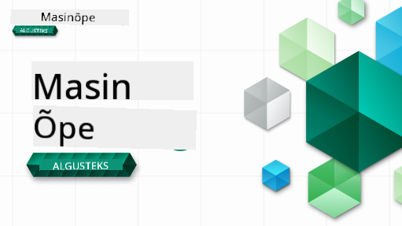

<!--
CO_OP_TRANSLATOR_METADATA:
{
  "original_hash": "7a13afb3674838f557d61f8d67e4d5f8",
  "translation_date": "2025-10-24T09:30:30+00:00",
  "source_file": "README.md",
  "language_code": "et"
}
-->

### 🌐 Mitmekeelne tugi

#### Toetatud GitHub Actioni kaudu (automaatne ja alati ajakohane)

<!-- CO-OP TRANSLATOR LANGUAGES TABLE START -->
[Araabia](../ar/README.md) | [Bengali](../bn/README.md) | [Bulgaaria](../bg/README.md) | [Birma (Myanmar)](../my/README.md) | [Hiina (lihtsustatud)](../zh/README.md) | [Hiina (traditsiooniline, Hongkong)](../hk/README.md) | [Hiina (traditsiooniline, Macau)](../mo/README.md) | [Hiina (traditsiooniline, Taiwan)](../tw/README.md) | [Horvaatia](../hr/README.md) | [Tšehhi](../cs/README.md) | [Taani](../da/README.md) | [Hollandi](../nl/README.md) | [Eesti](./README.md) | [Soome](../fi/README.md) | [Prantsuse](../fr/README.md) | [Saksa](../de/README.md) | [Kreeka](../el/README.md) | [Heebrea](../he/README.md) | [Hindi](../hi/README.md) | [Ungari](../hu/README.md) | [Indoneesia](../id/README.md) | [Itaalia](../it/README.md) | [Jaapani](../ja/README.md) | [Korea](../ko/README.md) | [Leedu](../lt/README.md) | [Malai](../ms/README.md) | [Marathi](../mr/README.md) | [Nepali](../ne/README.md) | [Norra](../no/README.md) | [Pärsia (Farsi)](../fa/README.md) | [Poola](../pl/README.md) | [Portugali (Brasiilia)](../br/README.md) | [Portugali (Portugal)](../pt/README.md) | [Punjabi (Gurmukhi)](../pa/README.md) | [Rumeenia](../ro/README.md) | [Vene](../ru/README.md) | [Serbia (kirillitsa)](../sr/README.md) | [Slovaki](../sk/README.md) | [Sloveeni](../sl/README.md) | [Hispaania](../es/README.md) | [Suahiili](../sw/README.md) | [Rootsi](../sv/README.md) | [Tagalogi (Filipino)](../tl/README.md) | [Tamili](../ta/README.md) | [Tai](../th/README.md) | [Türgi](../tr/README.md) | [Ukraina](../uk/README.md) | [Urdu](../ur/README.md) | [Vietnami](../vi/README.md)
<!-- CO-OP TRANSLATOR LANGUAGES TABLE END -->

#### Liitu meie kogukonnaga

Meil on käimas Discordi õppesari AI-ga, lisateavet leiate ja liituge meiega [Learn with AI Series](https://aka.ms/learnwithai/discord) 18.–30. septembril 2025. Saate näpunäiteid ja nippe GitHub Copiloti kasutamiseks andmeteaduses.

# Masinõpe algajatele - õppekava

> 🌍 Rännak ümber maailma, uurides masinõpet maailma kultuuride kaudu 🌍

Microsofti pilveadvokaadid on rõõmsad pakkuma 12-nädalast, 26-õppetunnist koosnevat õppekava, mis käsitleb **masinõpet**. Selles õppekavas õpite tundma seda, mida mõnikord nimetatakse **klassikaliseks masinõppeks**, kasutades peamiselt Scikit-learn'i teeki ja vältides süvaõpet, mida käsitletakse meie [AI algajatele õppekavas](https://aka.ms/ai4beginners). Siduge need õppetunnid meie ['Andmeteadus algajatele' õppekavaga](https://aka.ms/ds4beginners), samuti!

Reisige koos meiega ümber maailma, rakendades neid klassikalisi tehnikaid andmetele paljudest maailma piirkondadest. Iga õppetund sisaldab enne ja pärast õppetundi tehtavaid teste, kirjalikke juhiseid õppetunni läbiviimiseks, lahendust, ülesannet ja palju muud. Meie projektipõhine pedagoogika võimaldab teil õppida ehitamise käigus, mis on tõestatud viis uute oskuste omandamiseks.

**✍️ Südamlik tänu meie autoritele** Jen Looper, Stephen Howell, Francesca Lazzeri, Tomomi Imura, Cassie Breviu, Dmitry Soshnikov, Chris Noring, Anirban Mukherjee, Ornella Altunyan, Ruth Yakubu ja Amy Boyd

**🎨 Tänu ka meie illustraatoritele** Tomomi Imura, Dasani Madipalli ja Jen Looper

**🙏 Eriline tänu 🙏 meie Microsofti tudengisaadikutele, autoritele, retsensentidele ja sisupakkujatele**, eelkõige Rishit Dagli, Muhammad Sakib Khan Inan, Rohan Raj, Alexandru Petrescu, Abhishek Jaiswal, Nawrin Tabassum, Ioan Samuila ja Snigdha Agarwal

**🤩 Eriline tänu Microsofti tudengisaadikutele Eric Wanjau, Jasleen Sondhi ja Vidushi Gupta meie R-õppetundide eest!**

# Alustamine

Järgige neid samme:
1. **Forkige repositoorium**: Klõpsake selle lehe paremas ülanurgas nuppu "Fork".
2. **Kloonige repositoorium**:   `git clone https://github.com/microsoft/ML-For-Beginners.git`

> [leidke kõik selle kursuse lisamaterjalid meie Microsoft Learn kollektsioonist](https://learn.microsoft.com/en-us/collections/qrqzamz1nn2wx3?WT.mc_id=academic-77952-bethanycheum)

> 🔧 **Vajate abi?** Vaadake meie [tõrkeotsingu juhendit](TROUBLESHOOTING.md), et leida lahendusi levinud probleemidele, mis on seotud paigaldamise, seadistamise ja õppetundide läbiviimisega.

**[Õpilased](https://aka.ms/student-page)**, selle õppekava kasutamiseks forkige kogu repositoorium oma GitHubi kontole ja täitke harjutused iseseisvalt või grupis:

- Alustage enne loengut tehtava testiga.
- Lugege loengut ja täitke tegevused, peatudes ja mõeldes iga teadmiste kontrolli juures.
- Proovige projekte luua, mõistes õppetunde, mitte lihtsalt lahenduskoodi käivitades; kuid see kood on saadaval iga projektipõhise õppetunni `/solution` kaustades.
- Tehke pärast loengut test.
- Täitke väljakutse.
- Täitke ülesanne.
- Pärast õppetundide grupi lõpetamist külastage [arutelufoorumit](https://github.com/microsoft/ML-For-Beginners/discussions) ja "õppige valjult", täites vastava PAT rubriigi. 'PAT' on edusammude hindamise tööriist, mis on rubriik, mille täidate oma õppimise edendamiseks. Samuti saate reageerida teiste PAT-idele, et saaksime koos õppida.

> Edasiseks õppimiseks soovitame järgida neid [Microsoft Learn](https://docs.microsoft.com/en-us/users/jenlooper-2911/collections/k7o7tg1gp306q4?WT.mc_id=academic-77952-leestott) mooduleid ja õpiteekondi.

**Õpetajad**, oleme [lisanud mõned soovitused](for-teachers.md), kuidas seda õppekava kasutada.

---

## Videoõpetused

Mõned õppetunnid on saadaval lühivideotena. Kõik need leiate õppetundide seest või [ML algajatele playlistilt Microsoft Developer YouTube'i kanalil](https://aka.ms/ml-beginners-videos), klõpsates alloleval pildil.

---

## Tutvu meeskonnaga

**Gif autor** [Mohit Jaisal](https://linkedin.com/in/mohitjaisal)

> 🎥 Klõpsake ülaloleval pildil, et vaadata videot projekti ja selle loojate kohta!

---

## Pedagoogika

Selle õppekava loomisel oleme valinud kaks pedagoogilist põhimõtet: tagada, et see on praktiline **projektipõhine** ja et see sisaldab **sagedasi teste**. Lisaks on sellel õppekaval ühine **teema**, mis annab sellele ühtsuse.

Tagades, et sisu vastab projektidele, muutub protsess õpilastele kaasahaaravamaks ja kontseptsioonide omandamine paraneb. Lisaks seab madala panusega test enne tundi õpilasele eesmärgi teema õppimiseks, samas kui teine test pärast tundi tagab edasise omandamise. See õppekava on loodud paindlikuks ja lõbusaks ning seda saab võtta tervikuna või osaliselt. Projektid algavad väikestest ja muutuvad 12-nädalase tsükli lõpuks üha keerukamaks. See õppekava sisaldab ka järelmärkust ML-i reaalse maailma rakenduste kohta, mida saab kasutada lisapunktide saamiseks või arutelu aluseks.

> Leidke meie [käitumisjuhend](CODE_OF_CONDUCT.md), [kaastöö](CONTRIBUTING.md), [tõlkimise](TRANSLATIONS.md) ja [tõrkeotsingu](TROUBLESHOOTING.md) juhised. Ootame teie konstruktiivset tagasisidet!

## Iga õppetund sisaldab

- valikulist visandmärkust
- valikulist täiendavat videot
- videoõpetust (ainult mõned õppetunnid)
- [enne loengut tehtavat soojendustesti](https://ff-quizzes.netlify.app/en/ml/)
- kirjalikku õppetundi
- projektipõhiste õppetundide puhul samm-sammult juhendeid projekti loomiseks
- teadmiste kontrolli
- väljakutset
- täiendavat lugemist
- ülesannet
- [pärast loengut tehtavat testi](https://ff-quizzes.netlify.app/en/ml/)

> **Märkus keelte kohta**: Need õppetunnid on peamiselt kirjutatud Pythonis, kuid paljud on saadaval ka R-is. R-õppetunni läbimiseks minge `/solution` kausta ja otsige R-õppetunde. Need sisaldavad .rmd laiendit, mis tähistab **R Markdown** faili, mida saab lihtsalt määratleda kui `koodilõikude` (R-i või teiste keelte) ja `YAML päise` (mis juhendab, kuidas vormindada väljundeid, nagu PDF) `Markdown dokumendis` sisestamist. Seega toimib see eeskujulikuna autoriraamistikuna andmeteaduse jaoks, kuna see võimaldab teil kombineerida oma koodi, selle väljundit ja oma mõtteid, võimaldades teil need Markdownis kirja panna. Lisaks saab R Markdown dokumente renderdada väljundvormingutesse, nagu PDF, HTML või Word.

> **Märkus testide kohta**: Kõik testid on [Testirakenduse kaustas](../../quiz-app), kokku 52 testi, millest igaüks sisaldab kolme küsimust. Need on lingitud õppetundidest, kuid testirakendust saab käivitada kohapeal; järgige juhiseid `quiz-app` kaustas, et seda kohapeal hostida või Azure'i juurutada.

| Õppetunni number |                             Teema                              |                   Õppetundide rühmitus                   | Õpieesmärgid                                                                                                             |                                                              Lingitud õppetund                                                               |                        Autor                        |
| :-----------: | :------------------------------------------------------------: | :-------------------------------------------------: | ------------------------------------------------------------------------------------------------------------------------------- | :--------------------------------------------------------------------------------------------------------------------------------------: | :--------------------------------------------------: |
|      01       |                Sissejuhatus masinõppesse                |      [Sissejuhatus](1-Introduction/README.md)       | Õpi masinõppe põhimõisteid                                                                                 |                                             [Õppetund](1-Introduction/1-intro-to-ML/README.md)                                             |                       Muhammad                       |
|      02       |                Masinõppe ajalugu                 |      [Sissejuhatus](1-Introduction/README.md)       | Tutvu selle valdkonna ajaloolise taustaga                                                                                         |                                            [Õppetund](1-Introduction/2-history-of-ML/README.md)                                            |                     Jen ja Amy                      |
|      03       |                 Õiglus ja masinõpe                  |      [Sissejuhatus](1-Introduction/README.md)       | Millised olulised filosoofilised küsimused seoses õiglusega peaksid õpilased arvesse võtma ML mudelite loomisel ja rakendamisel? |                                              [Õppetund](1-Introduction/3-fairness/README.md)                                               |                        Tomomi                        |
|      04       |                Masinõppe tehnikad                 |      [Sissejuhatus](1-Introduction/README.md)       | Milliseid tehnikaid kasutavad ML teadlased mudelite loomiseks?                                                                       |                                          [Õppetund](1-Introduction/4-techniques-of-ML/README.md)                                           |                    Chris ja Jen                     |
|      05       |                   Sissejuhatus regressiooni                   |        [Regressioon](2-Regression/README.md)         | Alusta Pythoniga ja Scikit-learniga regressioonimudelite jaoks                                                                  |         [Python](2-Regression/1-Tools/README.md) • [R](../../2-Regression/1-Tools/solution/R/lesson_1.html)         |      Jen • Eric Wanjau       |
|      06       |                Põhja-Ameerika kõrvitsahinnad 🎃                |        [Regressioon](2-Regression/README.md)         | Visualiseeri ja puhasta andmeid ML ettevalmistamiseks                                                                                  |          [Python](2-Regression/2-Data/README.md) • [R](../../2-Regression/2-Data/solution/R/lesson_2.html)          |      Jen • Eric Wanjau       |
|      07       |                Põhja-Ameerika kõrvitsahinnad 🎃                |        [Regressioon](2-Regression/README.md)         | Loo lineaar- ja polünoomregressioonimudelid                                                                                   |        [Python](2-Regression/3-Linear/README.md) • [R](../../2-Regression/3-Linear/solution/R/lesson_3.html)        |      Jen ja Dmitry • Eric Wanjau       |
|      08       |                Põhja-Ameerika kõrvitsahinnad 🎃                |        [Regressioon](2-Regression/README.md)         | Loo logistiline regressioonimudel                                                                                               |     [Python](2-Regression/4-Logistic/README.md) • [R](../../2-Regression/4-Logistic/solution/R/lesson_4.html)      |      Jen • Eric Wanjau       |
|      09       |                          Veebirakendus 🔌                          |           [Veebirakendus](3-Web-App/README.md)            | Loo veebirakendus oma treenitud mudeli kasutamiseks                                                                                       |                                                 [Python](3-Web-App/1-Web-App/README.md)                                                  |                         Jen                          |
|      10       |                 Sissejuhatus klassifitseerimisse                 |    [Klassifitseerimine](4-Classification/README.md)     | Puhasta, ettevalmista ja visualiseeri oma andmeid; sissejuhatus klassifitseerimisse                                                            | [Python](4-Classification/1-Introduction/README.md) • [R](../../4-Classification/1-Introduction/solution/R/lesson_10.html)  | Jen ja Cassie • Eric Wanjau |
|      11       |             Maitsvad Aasia ja India köögid 🍜             |    [Klassifitseerimine](4-Classification/README.md)     | Sissejuhatus klassifikaatoritesse                                                                                                     | [Python](4-Classification/2-Classifiers-1/README.md) • [R](../../4-Classification/2-Classifiers-1/solution/R/lesson_11.html) | Jen ja Cassie • Eric Wanjau |
|      12       |             Maitsvad Aasia ja India köögid 🍜             |    [Klassifitseerimine](4-Classification/README.md)     | Rohkem klassifikaatoreid                                                                                                                | [Python](4-Classification/3-Classifiers-2/README.md) • [R](../../4-Classification/3-Classifiers-2/solution/R/lesson_12.html) | Jen ja Cassie • Eric Wanjau |
|      13       |             Maitsvad Aasia ja India köögid 🍜             |    [Klassifitseerimine](4-Classification/README.md)     | Loo soovitusrakendus, kasutades oma mudelit                                                                                    |                                              [Python](4-Classification/4-Applied/README.md)                                              |                         Jen                          |
|      14       |                   Sissejuhatus klasterdamisse                   |        [Klasterdamine](5-Clustering/README.md)         | Puhasta, ettevalmista ja visualiseeri oma andmeid; sissejuhatus klasterdamisse                                                                |         [Python](5-Clustering/1-Visualize/README.md) • [R](../../5-Clustering/1-Visualize/solution/R/lesson_14.html)         |      Jen • Eric Wanjau       |
|      15       |              Nigeeria muusikamaitse uurimine 🎧              |        [Klasterdamine](5-Clustering/README.md)         | Uuri K-Meansi klasterdamise meetodit                                                                                           |           [Python](5-Clustering/2-K-Means/README.md) • [R](../../5-Clustering/2-K-Means/solution/R/lesson_15.html)           |      Jen • Eric Wanjau       |
|      16       |        Sissejuhatus loomuliku keele töötlemisse ☕️         |   [Loomuliku keele töötlemine](6-NLP/README.md)    | Õpi NLP põhitõdesid, luues lihtsa boti                                                                             |                                             [Python](6-NLP/1-Introduction-to-NLP/README.md)                                              |                       Stephen                        |
|      17       |                      Tavalised NLP ülesanded ☕️                      |   [Loomuliku keele töötlemine](6-NLP/README.md)    | Süvenda oma NLP teadmisi, mõistes keele struktuuridega seotud tavalisi ülesandeid                          |                                                    [Python](6-NLP/2-Tasks/README.md)                                                     |                       Stephen                        |
|      18       |             Tõlkimine ja sentimentide analüüs ♥️              |   [Loomuliku keele töötlemine](6-NLP/README.md)    | Tõlkimine ja sentimentide analüüs Jane Austeni teostega                                                                             |                                            [Python](6-NLP/3-Translation-Sentiment/README.md)                                             |                       Stephen                        |
|      19       |                  Romantilised hotellid Euroopas ♥️                  |   [Loomuliku keele töötlemine](6-NLP/README.md)    | Sentimentide analüüs hotelliarvustustega 1                                                                                         |                                               [Python](6-NLP/4-Hotel-Reviews-1/README.md)                                                |                       Stephen                        |
|      20       |                  Romantilised hotellid Euroopas ♥️                  |   [Loomuliku keele töötlemine](6-NLP/README.md)    | Sentimentide analüüs hotelliarvustustega 2                                                                                         |                                               [Python](6-NLP/5-Hotel-Reviews-2/README.md)                                                |                       Stephen                        |
|      21       |            Sissejuhatus ajareekide prognoosimisse             |        [Ajaread](7-TimeSeries/README.md)        | Sissejuhatus ajareekide prognoosimisse                                                                                         |                                             [Python](7-TimeSeries/1-Introduction/README.md)                                              |                      Francesca                       |
|      22       | ⚡️ Maailma energiatarbimine ⚡️ - ajareekide prognoosimine ARIMA-ga |        [Ajaread](7-TimeSeries/README.md)        | Ajareekide prognoosimine ARIMA meetodiga                                                                                              |                                                 [Python](7-TimeSeries/2-ARIMA/README.md)                                                 |                      Francesca                       |
|      23       |  ⚡️ Maailma energiatarbimine ⚡️ - ajareekide prognoosimine SVR-iga  |        [Ajaread](7-TimeSeries/README.md)        | Ajareekide prognoosimine toetavate vektorite regressori abil                                                                           |                                                  [Python](7-TimeSeries/3-SVR/README.md)                                                  |                       Anirban                        |
|      24       |             Sissejuhatus tugevdusõppesse             | [Tugevdusõpe](8-Reinforcement/README.md) | Sissejuhatus tugevdusõppesse Q-õppega                                                                          |                                             [Python](8-Reinforcement/1-QLearning/README.md)                                              |                        Dmitry                        |
|      25       |                 Aita Peteril hundist pääseda! 🐺                  | [Tugevdusõpe](8-Reinforcement/README.md) | Tugevdusõppe Gym                                                                                                      |                                                [Python](8-Reinforcement/2-Gym/README.md)                                                 |                        Dmitry                        |
|  Postscript   |            Masinõppe stsenaariumid ja rakendused päriselus            |      [ML päriselus](9-Real-World/README.md)       | Huvitavad ja paljastavad klassikalise masinõppe rakendused päriselus                                                               |                                             [Õppetund](9-Real-World/1-Applications/README.md)                                              |                         Meeskond                         |
|  Postscript   |            Mudelite silumine masinõppes RAI armatuurlaua abil          |      [ML päriselus](9-Real-World/README.md)       | Mudelite silumine masinõppes, kasutades vastutustundliku AI armatuurlaua komponente                                                              |                                             [Õppetund](9-Real-World/2-Debugging-ML-Models/README.md)                                              |                         Ruth Yakubu                       |

> [Leia kõik täiendavad ressursid selle kursuse jaoks meie Microsoft Learn kogumikust](https://learn.microsoft.com/en-us/collections/qrqzamz1nn2wx3?WT.mc_id=academic-77952-bethanycheum)

## Offline'i kasutamine

Saad seda dokumentatsiooni kasutada offline'is, kasutades [Docsify](https://docsify.js.org/#/). Forki see repo, [paigalda Docsify](https://docsify.js.org/#/quickstart) oma kohalikule masinale ja seejärel selle repo juurkataloogis sisesta `docsify serve`. Veebileht avaneb porti 3000 sinu localhostis: `localhost:3000`.

## PDF-id

Leia õppekava PDF koos linkidega [siit](https://microsoft.github.io/ML-For-Beginners/pdf/readme.pdf).

## 🎒 Teised kursused 

Meie meeskond toodab ka teisi kursusi! Vaata:

### Azure / Edge / MCP / Agendid

---
 
### Generatiivse AI sari

[-9333EA?style=for-the-badge&labelColor=E5E7EB&color=9333EA)](https://github.com/microsoft/Generative-AI-for-beginners-dotnet?WT.mc_id=academic-105485-koreyst)
[-C084FC?style=for-the-badge&labelColor=E5E7EB&color=C084FC)](https://github.com/microsoft/generative-ai-for-beginners-java?WT.mc_id=academic-105485-koreyst)
[-E879F9?style=for-the-badge&labelColor=E5E7EB&color=E879F9)](https://github.com/microsoft/generative-ai-with-javascript?WT.mc_id=academic-105485-koreyst)

---
 
### Põhiõpe

---

### Copilot seeria

## Abi saamine

Kui jääd hätta või sul on küsimusi AI rakenduste loomise kohta, liitu:

Kui sul on tagasisidet toodete kohta või esineb vigu rakenduste loomisel, külasta:

---

**Lahtiütlus**:  
See dokument on tõlgitud AI tõlketeenuse [Co-op Translator](https://github.com/Azure/co-op-translator) abil. Kuigi püüame tagada täpsust, palume arvestada, et automaatsed tõlked võivad sisaldada vigu või ebatäpsusi. Algne dokument selle algses keeles tuleks pidada autoriteetseks allikaks. Olulise teabe puhul soovitame kasutada professionaalset inimtõlget. Me ei vastuta arusaamatuste või valesti tõlgenduste eest, mis võivad tekkida selle tõlke kasutamisest.