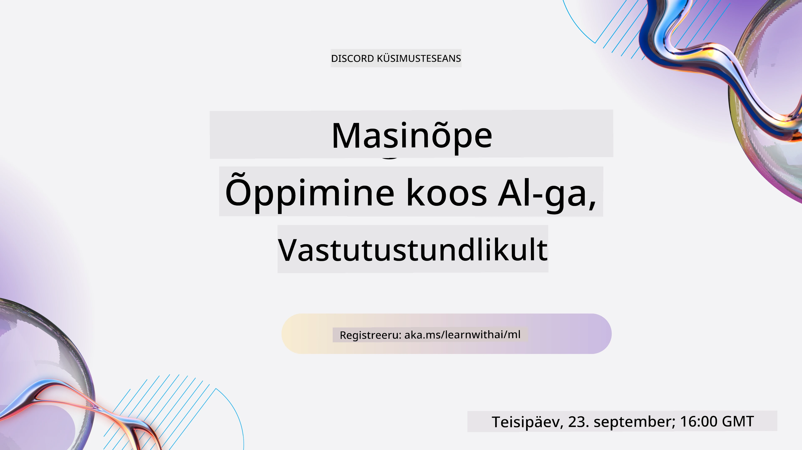
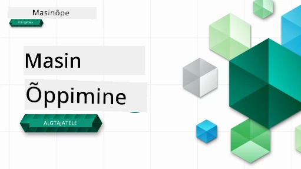

[](https://github.com/microsoft/ML-For-Beginners/blob/master/LICENSE)
[](https://GitHub.com/microsoft/ML-For-Beginners/graphs/contributors/)
[](https://GitHub.com/microsoft/ML-For-Beginners/issues/)
[](https://GitHub.com/microsoft/ML-For-Beginners/pulls/)
[](http://makeapullrequest.com)

[](https://GitHub.com/microsoft/ML-For-Beginners/watchers/)
[](https://GitHub.com/microsoft/ML-For-Beginners/network/)
[](https://GitHub.com/microsoft/ML-For-Beginners/stargazers/)

### 🌐 Mitmekeelne tugi

#### GitHub Actioni kaudu toetatud (automatiseeritud ja alati ajakohane)

<!-- CO-OP TRANSLATOR LANGUAGES TABLE START -->
[Araabia](../ar/README.md) | [Bengali](../bn/README.md) | [Bulgaaria](../bg/README.md) | [Birma (Myanmar)](../my/README.md) | [Hiina (lihtsustatud)](../zh-CN/README.md) | [Hiina (traditsiooniline, Hongkong)](../zh-HK/README.md) | [Hiina (traditsiooniline, Macau)](../zh-MO/README.md) | [Hiina (traditsiooniline, Taiwan)](../zh-TW/README.md) | [Horvaadi](../hr/README.md) | [Tšehhi](../cs/README.md) | [Taani](../da/README.md) | [Hollandi](../nl/README.md) | [Eesti](./README.md) | [Soome](../fi/README.md) | [Prantsuse](../fr/README.md) | [Saksa](../de/README.md) | [Kreeka](../el/README.md) | [Heebrea](../he/README.md) | [Hindi](../hi/README.md) | [Ungari](../hu/README.md) | [Indoneesia](../id/README.md) | [Itaalia](../it/README.md) | [Jaapani](../ja/README.md) | [Kannada](../kn/README.md) | [Khmeri](../km/README.md) | [Korea](../ko/README.md) | [Leedu](../lt/README.md) | [Malai](../ms/README.md) | [Malajalami](../ml/README.md) | [Marathi](../mr/README.md) | [Nepali](../ne/README.md) | [Nigeeria pidžin](../pcm/README.md) | [Norra](../no/README.md) | [Pärsia (Farsi)](../fa/README.md) | [Poola](../pl/README.md) | [Portugali (Brasiilia)](../pt-BR/README.md) | [Portugali (Portugal)](../pt-PT/README.md) | [Pandžabi (Gurmukhi)](../pa/README.md) | [Rumeenia](../ro/README.md) | [Vene](../ru/README.md) | [Serbia (kirilitsa)](../sr/README.md) | [Slovaki](../sk/README.md) | [Sloveeni](../sl/README.md) | [Hispaania](../es/README.md) | [Suahiili](../sw/README.md) | [Rootsi](../sv/README.md) | [Tagalogi (Filipino)](../tl/README.md) | [Tamili](../ta/README.md) | [Telugu](../te/README.md) | [Tai](../th/README.md) | [Türgi](../tr/README.md) | [Ukraina](../uk/README.md) | [Urdu](../ur/README.md) | [Vietnami](../vi/README.md)

> **Eelistad kohalikku kloonimist?**
>
> See hoidla sisaldab üle 50 keele tõlkeid, mis suurendavad oluliselt allalaaditavat mahtu. Tõlkedeta kloonimiseks kasuta harvendatud chekouti:
>
> **Bash / macOS / Linux:**
> ```bash
> git clone --filter=blob:none --sparse https://github.com/microsoft/ML-For-Beginners.git
> cd ML-For-Beginners
> git sparse-checkout set --no-cone '/*' '!translations' '!translated_images'
> ```
>
> **CMD (Windows):**
> ```cmd
> git clone --filter=blob:none --sparse https://github.com/microsoft/ML-For-Beginners.git
> cd ML-For-Beginners
> git sparse-checkout set --no-cone "/*" "!translations" "!translated_images"
> ```
>
> See annab sulle kõik vajaliku kursuse läbimiseks palju kiiremalt.
<!-- CO-OP TRANSLATOR LANGUAGES TABLE END -->

#### Liitu meie kogukonnaga

[](https://discord.gg/nTYy5BXMWG)

Meil toimub Discordis tehisintellekti õppesari, saa rohkem teada ja liitu meiega aadressil [Learn with AI Series](https://aka.ms/learnwithai/discord) 18. - 30. septembril 2025. Saad näpunäiteid ja nippe GitHub Copiloti kasutamiseks andmeteaduses.



# Masinõpe algajatele – õppekava

> 🌍 Rända maailmas ringi, kui uurime masinõpet läbi maailma kultuuride 🌍

Microsofti pilveagendid pakuvad 12-nädalast ja 26-õppetunnist koosnevat õppekava, mis keskendub **masinõppele**. Selles õppekavas õpid nn **klassikalist masinõpet**, kasutades peamiselt Scikit-learn'i teegina ja vältides süvaõpet, mida käsitletakse meie [teisest õppekavast AI algajatele](https://aka.ms/ai4beginners). Soovitame need tõlgendada koos meie ['Andmeteaduse algajate' õppekavaga](https://aka.ms/ds4beginners)!

Reisi koos meiega ümber maailma, rakendades neid klassikalisi tehnikaid andmetele paljudest maailma piirkondadest. Igas õppetunnis on ees- ja järeltest, kirjalikud juhised õppetunni läbimiseks, lahendus, ülesanne ja muud. Meie projektipõhine pedagoogika laseb sul õppida, ehitades samal ajal – see on tõestatud viis uute oskuste kinnistamiseks.

**✍️ Suur tänu meie autoritele** Jen Looper, Stephen Howell, Francesca Lazzeri, Tomomi Imura, Cassie Breviu, Dmitry Soshnikov, Chris Noring, Anirban Mukherjee, Ornella Altunyan, Ruth Yakubu ja Amy Boyd

**🎨 Tänud ka meie illustraatoritele** Tomomi Imura, Dasani Madipalli ja Jen Looper

**🙏 Eriline tänu 🙏 meie Microsofti üliõpilasambasadorite autoritele, ülevaatajatele ja sisuloojatele**, eriti Rishit Dagli, Muhammad Sakib Khan Inan, Rohan Raj, Alexandru Petrescu, Abhishek Jaiswal, Nawrin Tabassum, Ioan Samuila ja Snigdha Agarwal

**🤩 Lisa tänud Microsofti üliõpilasambasadoritele Eric Wanjau, Jasleen Sondhi ja Vidushi Gupta, kes panustasid meie R-õppetundidesse!**

# Alustamine

Järgi neid samme:
1. **Tee hoidlast fork** – klõpsa selle lehe paremas ülanurgas nupule „Fork“.
2. **Klooni hoidla**:   `git clone https://github.com/microsoft/ML-For-Beginners.git`

> 💡 **Kiirjuhis:** Kas soovid alustada brauseris ilma Pythonit kohapeal seadistamata? Kasuta [GitHub Codespaces'i](https://github.com/features/codespaces), et luua oma forkile pilvearenduskeskkond. Ava roheline **Code** menüü, vali **Codespaces** ja loo codespace; paigalda vajadusel iga õppetunni nõutud sõltuvused.

> [Leia kõik selle kursuse täiendavad ressursid meie Microsoft Learn kollektsioonist](https://learn.microsoft.com/en-us/collections/qrqzamz1nn2wx3?WT.mc_id=academic-77952-bethanycheum)

> 🔧 **Vaja abi?** Vaata meie [Veaotsingu juhendit](TROUBLESHOOTING.md) levinud probleemide lahendamiseks paigalduse, seadistuse ja õppetundide käivitamisel.


**[Üliõpilased](https://aka.ms/student-page)**, et seda õppekava kasutada, tee kogu hoidlast fork oma GitHubi kontole ja tee harjutused ise või grupiga:

- Alusta eelloengu testiga.
- Loe loengut ja tee tegevused, peatudes ja mõeldes iga teadmistekontrolli juures.
- Proovi luua projektid selle asemel, et lahenduskoodi lihtsalt jooksutada; selle kood on siiski saadaval iga projektile orienteeritud õppetunni `/solution` kaustas.
- Tee järeltest.
- Täida väljakutse.
- Täida ülesanne.
- Pärast õppetunni rühma lõpetamist külasta [Arutelufoorumit](https://github.com/microsoft/ML-For-Beginners/discussions) ja „õpi valjult“, täites vastava PAT hindamisskaala. „PAT“ on Progress Assessment Tool, mis on rubric teadmiste süvendamiseks; samuti saad teiste PAT-e kommenteerida, et koos õppida.

> Täiendavaks õppimiseks soovitame järgida neid [Microsoft Leardi](https://docs.microsoft.com/en-us/users/jenlooper-2911/collections/k7o7tg1gp306q4?WT.mc_id=academic-77952-leestott) mooduleid ja õpiteid.

**Õpetajad**, oleme lisanud [mõningaid soovitusi](for-teachers.md), kuidas seda õppekava kasutada.

---

## Videokäigud

Mõned õppetunnid on saadaval lühikestes videotes. Leiad need järgemööda õppetundidest või siis [ML algajatele esitusloendist Microsoft Developer YouTube'i kanalil](https://aka.ms/ml-beginners-videos), vajutades allolevale pildile.

[](https://aka.ms/ml-beginners-videos)

---

## Tutvu meeskonnaga

[](https://youtu.be/Tj1XWrDSYJU)

**Gif autor:** [Mohit Jaisal](https://linkedin.com/in/mohitjaisal)

> 🎥 Vajuta ülal olevale pildile, et vaadata videot projektist ja selle tegijatest!

---

## Pedagoogika

Selle õppekava loomisel oleme valinud kaks pedagoogilist alustala: tagada, et see on praktiline **projektipõhine** ja sisaldab **sageli teste**. Lisaks on õppekaval ühine **teema**, mis annab sellele terviklikkuse.

Sisu projektidega sobitades suureneb õpilaste kaasatus ja kontseptsioonide jääb paremini meelde. Madala riskiga test enne tundi seab õppija kavatsuse uue teema õppimiseks, samas kui teine test pärast tundi tagab teadmiste kinnistumise. See õppekava on paindlik ja lõbus ning sobib tervikuna või osaliselt läbitavaks. Projektid algavad väikestena ja muutuvad 12-nädalase tsükli lõpuks järk-järgult keerukamaks. Õppekava sisaldab ka järelmärget masinõppe rakendustest pärismaailmas, mida võib kasutada lisapunktide saamiseks või arutelupõhjana.

> Leia meie [Käitumiskoodeks](CODE_OF_CONDUCT.md), [Panustamine](CONTRIBUTING.md), [Tõlkimine](..) ja [Veaotsing](TROUBLESHOOTING.md) juhised. Ootame konstruktiivset tagasisidet!

## Iga õppetund sisaldab

- vabatahtlikku visandit
- vabatahtlikku lisavideot
- video läbivaadet (ainult mõnes õppetunnis)
- [eelloengu soojendus-quiz](https://ff-quizzes.netlify.app/en/ml/)
- kirjalikku õppetundi
- projektipõhiste õppetundide puhul samm-sammulisi juhendeid projekti ehitamiseks
- teadmistekontrolle
- väljakutset
- lisalugemist
- ülesannet
- [järgnevat testi](https://ff-quizzes.netlify.app/en/ml/)

> **Märkused keeltest**: Need õppetunnid on peamiselt kirjutatud Pythonis, kuid paljud on saadaval ka R-s. R-õppetunni läbimiseks mine `/solution` kausta ja otsi R-õppetunde. Neil on .rmd laiendus, mis esindab **R Markdown** faili, mida saab defineerida kui `kooditükke` (R või teiste keelte jaoks) sisaldava ja `YAML-päise` (suunab väljundite vormindamist nagu PDF) sisaldava `Markdown dokumendi` manustamist. See on andmeteadusele suurepärane raamistik, kuna võimaldab sul kombineerida koodi, selle väljundi ja mõtted kirjalikult Markdownis. Lisaks saab R Markdown dokumente renderdada väljundvormingutesse nagu PDF, HTML või Word.

> **Märkused testide kohta**: Kõik testid asuvad [Quiz App kaustas](../../quiz-app), kokku 52 testi, kus igaühes on kolm küsimust. Need on seotud õppetundidega, aga testirakendust saab käivitada ka lokaalselt; järgi juhiseid `quiz-app` kaustas lokaalseks hostimiseks või Azure'sse deploymiseks.

| Õppetunni number |                             Teema                              |                   Õppetunni grupp                   | Õpieesmärgid                                                                                                             |                                                              Seotud õppetund                                                               |                        Autor                        |
| :-----------: | :------------------------------------------------------------: | :-------------------------------------------------: | ------------------------------------------------------------------------------------------------------------------------------- | :--------------------------------------------------------------------------------------------------------------------------------------: | :--------------------------------------------------: |
|      01       |                Sissejuhatus masinõppesse                      |      [Introduction](1-Introduction/README.md)       | Õpi masinõppe põhialuseid                                                                                                         |                                             [Lesson](1-Introduction/1-intro-to-ML/README.md)                                             |                       Muhammad                       |
|      02       |                Masinõppe ajalugu                               |      [Introduction](1-Introduction/README.md)       | Õpi selle valdkonna ajalugu                                                                                                       |                                            [Lesson](1-Introduction/2-history-of-ML/README.md)                                            |                     Jen and Amy                      |
|      03       |                 Õiglus ja masinõpe                            |      [Introduction](1-Introduction/README.md)       | Millised on tähtsad filosoofilised küsimused seoses õigusega, mida õpilased peaksid masinõppemudelite loomisel ja rakendamisel kaaluma? |                                              [Lesson](1-Introduction/3-fairness/README.md)                                               |                        Tomomi                        |
|      04       |                Masinõppe tehnikad                             |      [Introduction](1-Introduction/README.md)       | Milliseid tehnikaid kasutavad masinõppe uurijad masinõppemudelite ehitamiseks?                                                    |                                          [Lesson](1-Introduction/4-techniques-of-ML/README.md)                                           |                    Chris and Jen                     |
|      05       |                   Sissejuhatus regressiooni                   |        [Regression](2-Regression/README.md)         | Alusta Pythonis ja Scikit-learn'is regressioonimudelitega                                                                        |         [Python](2-Regression/1-Tools/README.md) • [R](../../2-Regression/1-Tools/solution/R/lesson_1.html)         |      Jen • Eric Wanjau       |
|      06       |                Põhja-Ameerika kõrvitsa hinnad 🎃              |        [Regression](2-Regression/README.md)         | Visualiseeri ja puhasta andmeid masinõppe ettevalmistamiseks                                                                      |          [Python](2-Regression/2-Data/README.md) • [R](../../2-Regression/2-Data/solution/R/lesson_2.html)          |      Jen • Eric Wanjau       |
|      07       |                Põhja-Ameerika kõrvitsa hinnad 🎃              |        [Regression](2-Regression/README.md)         | Ehita lineaarsed ja polünoomsed regressioonimudelid                                                                              |        [Python](2-Regression/3-Linear/README.md) • [R](../../2-Regression/3-Linear/solution/R/lesson_3.html)        |      Jen and Dmitry • Eric Wanjau       |
|      08       |                Põhja-Ameerika kõrvitsa hinnad 🎃              |        [Regression](2-Regression/README.md)         | Ehita logistiline regressioonimudel                                                                                              |     [Python](2-Regression/4-Logistic/README.md) • [R](../../2-Regression/4-Logistic/solution/R/lesson_4.html)      |      Jen • Eric Wanjau       |
|      09       |                          Veebirakendus 🔌                     |           [Web App](3-Web-App/README.md)            | Ehita veebirakendus oma treenitud mudeli kasutamiseks                                                                            |                                                 [Python](3-Web-App/1-Web-App/README.md)                                                  |                         Jen                          |
|      10       |                 Sissejuhatus klassifitseerimisse              |    [Classification](4-Classification/README.md)     | Puhasta, valmista ette ja visualiseeri oma andmeid; sissejuhatus klassifitseerimisse                                              | [Python](4-Classification/1-Introduction/README.md) • [R](../../4-Classification/1-Introduction/solution/R/lesson_10.html)  | Jen and Cassie • Eric Wanjau |
|      11       |             Maitsvad Aasia ja India köögid 🍜                |    [Classification](4-Classification/README.md)     | Sissejuhatus klassifitseerijatesse                                                                                             | [Python](4-Classification/2-Classifiers-1/README.md) • [R](../../4-Classification/2-Classifiers-1/solution/R/lesson_11.html) | Jen and Cassie • Eric Wanjau |
|      12       |             Maitsvad Aasia ja India köögid 🍜                |    [Classification](4-Classification/README.md)     | Veel klassifitseerijaid                                                                                                          | [Python](4-Classification/3-Classifiers-2/README.md) • [R](../../4-Classification/3-Classifiers-2/solution/R/lesson_12.html) | Jen and Cassie • Eric Wanjau |
|      13       |             Maitsvad Aasia ja India köögid 🍜                |    [Classification](4-Classification/README.md)     | Ehita soovitusveebirakendus oma mudelit kasutades                                                                              |                                              [Python](4-Classification/4-Applied/README.md)                                              |                         Jen                          |
|      14       |                   Sissejuhatus klastrisse                     |        [Clustering](5-Clustering/README.md)         | Puhasta, valmista ette ja visualiseeri oma andmeid; sissejuhatus klastrisse                                                    |         [Python](5-Clustering/1-Visualize/README.md) • [R](../../5-Clustering/1-Visualize/solution/R/lesson_14.html)         |      Jen • Eric Wanjau       |
|      15       |              Uuri Nigeeria muusikamaitseid 🎧                 |        [Clustering](5-Clustering/README.md)         | Uuri K-Meansi klasterdamismeetodit                                                                                              |           [Python](5-Clustering/2-K-Means/README.md) • [R](../../5-Clustering/2-K-Means/solution/R/lesson_15.html)           |      Jen • Eric Wanjau       |
|      16       |        Sissejuhatus loomuliku keele töötlemisse ☕️           |   [Natural language processing](6-NLP/README.md)    | Õpi NLP põhialuseid, ehitades lihtsa boti                                                                                        |                                             [Python](6-NLP/1-Introduction-to-NLP/README.md)                                              |                       Stephen                        |
|      17       |                      Levinud NLP ülesanded ☕️                |   [Natural language processing](6-NLP/README.md)    | Süvenda oma NLP teadmisi, mõistes keelestruktuuride töötlemisel vajalikke tavapäraseid ülesandeid                                |                                                    [Python](6-NLP/2-Tasks/README.md)                                                     |                       Stephen                        |
|      18       |             Tõlkimine ja sentimendi analüüs ♥️                |   [Natural language processing](6-NLP/README.md)    | Tõlkimine ja meeleolu analüüs Jane Austeni tekstidega                                                                            |                                            [Python](6-NLP/3-Translation-Sentiment/README.md)                                             |                       Stephen                        |
|      19       |                  Euroopa romantilised hotellid ♥️             |   [Natural language processing](6-NLP/README.md)    | Meeleolu analüüs hotellikriitikatest 1                                                                                         |                                               [Python](6-NLP/4-Hotel-Reviews-1/README.md)                                                |                       Stephen                        |
|      20       |                  Euroopa romantilised hotellid ♥️             |   [Natural language processing](6-NLP/README.md)    | Meeleolu analüüs hotellikriitikatest 2                                                                                         |                                               [Python](6-NLP/5-Hotel-Reviews-2/README.md)                                                |                       Stephen                        |
|      21       |            Sissejuhatus ajasari prognoosimisse                |        [Time series](7-TimeSeries/README.md)        | Sissejuhatus ajasari prognoosimisse                                                                                            |                                             [Python](7-TimeSeries/1-Introduction/README.md)                                              |                      Francesca                       |
|      22       | ⚡️ Maailma energiatarbimine ⚡️ - ajasari prognoosimine ARIMA-ga |        [Time series](7-TimeSeries/README.md)        | Ajasari prognoosimine ARIMA abil                                                                                               |                                                 [Python](7-TimeSeries/2-ARIMA/README.md)                                                 |                      Francesca                       |
|      23       |  ⚡️ Maailma energiatarbimine ⚡️ - ajasari prognoosimine SVR-ga  |        [Time series](7-TimeSeries/README.md)        | Ajasari prognoosimine tugivektorregressori abil                                                                                 |                                                  [Python](7-TimeSeries/3-SVR/README.md)                                                  |                       Anirban                        |
|      24       |             Sissejuhatus tugevõppesse                          | [Reinforcement learning](8-Reinforcement/README.md) | Sissejuhatus tugevõppesse Q-õppimise kaudu                                                                                      |                                             [Python](8-Reinforcement/1-QLearning/README.md)                                              |                        Dmitry                        |
|      25       |                 Aita Peteril hunti vältida! 🐺                | [Reinforcement learning](8-Reinforcement/README.md) | Tugevõppimise Gym                                                                                                               |                                                [Python](8-Reinforcement/2-Gym/README.md)                                                 |                        Dmitry                        |
|  Postscript   |            Reaalmaailma masinõppe juhtumid ja rakendused       |      [ML in the Wild](9-Real-World/README.md)       | Huvitavad ja valgustavad klassikalise masinõppe reaalmaailmarakendused                                                         |                                             [Lesson](9-Real-World/1-Applications/README.md)                                              |                         Team                         |
|  Postscript   |            Masinõppe mudelite silumine RAI juhtpaneeli abil   |      [ML in the Wild](9-Real-World/README.md)       | Masinõppe mudelite silumine vastutustundliku tehisintellekti juhtpaneeli komponentidega                                            |                                             [Lesson](9-Real-World/2-Debugging-ML-Models/README.md)                                              |                     Ruth Yakubu                      |

> [leia kõik selle kursuse lisamaterjalid meie Microsoft Learn kollektsioonist](https://learn.microsoft.com/en-us/collections/qrqzamz1nn2wx3?WT.mc_id=academic-77952-bethanycheum)

## Võimalus kasutada võrguühenduseta

Saad seda dokumentatsiooni võrguühenduseta käivitada, kasutades [Docsify](https://docsify.js.org/#/). Tee selle hoidla fork, [paigalda Docsify](https://docsify.js.org/#/quickstart) oma lokaalsele masinale, ning seejärel kirjuta selle hoidla juurkaustas käsk `docsify serve`. Veebileht hakkab teenima pordil 3000 sinu kohalikel aadressil: `localhost:3000`.

## PDF-id

Leia õppekava PDF koos linkidega [siit](https://microsoft.github.io/ML-For-Beginners/pdf/readme.pdf).


## 🎒 Muud kursused 

Meie tiim toodab teisi kursuseid! Vaata neid:

<!-- CO-OP TRANSLATOR OTHER COURSES START -->
### LangChain
[](https://aka.ms/langchain4j-for-beginners)
[](https://aka.ms/langchainjs-for-beginners?WT.mc_id=m365-94501-dwahlin)
[](https://github.com/microsoft/langchain-for-beginners?WT.mc_id=m365-94501-dwahlin)
---

### Azure / Edge / MCP / Agentid
[](https://github.com/microsoft/AZD-for-beginners?WT.mc_id=academic-105485-koreyst)
[](https://github.com/microsoft/edgeai-for-beginners?WT.mc_id=academic-105485-koreyst)
[](https://github.com/microsoft/mcp-for-beginners?WT.mc_id=academic-105485-koreyst)
[](https://github.com/microsoft/ai-agents-for-beginners?WT.mc_id=academic-105485-koreyst)

---
 
### Generatiivse tehisintellekti seeria
[](https://github.com/microsoft/generative-ai-for-beginners?WT.mc_id=academic-105485-koreyst)
[-9333EA?style=for-the-badge&labelColor=E5E7EB&color=9333EA)](https://github.com/microsoft/Generative-AI-for-beginners-dotnet?WT.mc_id=academic-105485-koreyst)
[-C084FC?style=for-the-badge&labelColor=E5E7EB&color=C084FC)](https://github.com/microsoft/generative-ai-for-beginners-java?WT.mc_id=academic-105485-koreyst)
[-E879F9?style=for-the-badge&labelColor=E5E7EB&color=E879F9)](https://github.com/microsoft/generative-ai-with-javascript?WT.mc_id=academic-105485-koreyst)

---
 
### Põhikoolitus
[](https://aka.ms/ml-beginners?WT.mc_id=academic-105485-koreyst)
[](https://aka.ms/datascience-beginners?WT.mc_id=academic-105485-koreyst)
[](https://aka.ms/ai-beginners?WT.mc_id=academic-105485-koreyst)
[](https://github.com/microsoft/Security-101?WT.mc_id=academic-96948-sayoung)
[](https://aka.ms/webdev-beginners?WT.mc_id=academic-105485-koreyst)
[](https://aka.ms/iot-beginners?WT.mc_id=academic-105485-koreyst)
[](https://github.com/microsoft/xr-development-for-beginners?WT.mc_id=academic-105485-koreyst)

---
 
### Copiloti seeria
[](https://aka.ms/GitHubCopilotAI?WT.mc_id=academic-105485-koreyst)
[](https://github.com/microsoft/mastering-github-copilot-for-dotnet-csharp-developers?WT.mc_id=academic-105485-koreyst)
[](https://github.com/microsoft/CopilotAdventures?WT.mc_id=academic-105485-koreyst)
<!-- CO-OP TRANSLATOR OTHER COURSES END -->

## Abi saamine

Kui sa jääd masinõppe õppimisel või tehisintellekti rakenduste loomisel kinni või sul on küsimusi, ära muretse — abi on olemas.

Võid liituda aruteludega teiste õppijate ja arendajatega, esitada küsimusi ning jagada oma ideid kogukonnaga.

- Liitu kogukonnaga, et esitada küsimusi ja õppida koos teistega
- Arutle masinõppe kontseptsioonide ja projektide ideede üle
- Saa juhendamist kogenud arendajatelt

Toetav kogukond on suurepärane viis oma oskuste arendamiseks ja probleemide kiiremale lahendamisele.

[Microsoft Foundry Discordi kogukond](https://discord.gg/nTYy5BXMWG)

Kui leiad vigu, vigu või sul on parandusettepanekuid, võid avada selles hoidlas **Issue** probleemi raportimiseks.

Toodet puudutavate tagasiside või olemasolevate kogukonna postituste otsimiseks külasta arendajate foorumit:

[](https://aka.ms/foundry/forum)

## Täiendavad õppimisnipid

- Vaata märkmeid üle pärast iga õppetundi parema arusaamise saamiseks.
- Harjuta algoritmide omaette rakendamist.
- Uuri omandatud kontseptsioonide abil reaalmaailma andmekogumeid.

---

<!-- CO-OP TRANSLATOR DISCLAIMER START -->
**Lahtiütlus**:
See dokument on tõlgitud kasutades AI tõlketeenust [Co-op Translator](https://github.com/Azure/co-op-translator). Kuigi me püüdleme täpsuse poole, palun pange tähele, et automatiseeritud tõlgetes võib esineda vigu või ebatäpsusi. Originaaldokument selle emakeeles tuleks pidada autoriteetseks allikaks. Olulise teabe puhul soovitatakse kasutada professionaalset inimtõlget. Me ei vastuta selle tõlkega seotud eksimustest või valesti mõistmistest.
<!-- CO-OP TRANSLATOR DISCLAIMER END -->